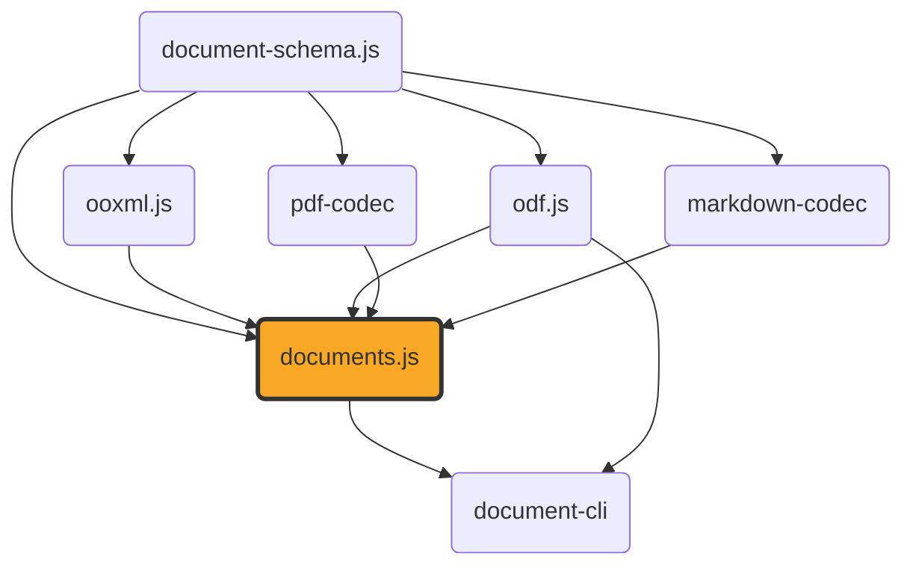

# documents.js

[](https://github.com/ExaDev/documents.js) [](https://www.npmjs.com/package/documents.js) [](https://github.com/ExaDev/documents.js/releases/latest) [](https://github.com/ExaDev/documents.js/actions)

> Converts between any two compatible document formats through a shared content/layout pivot — docx, pptx, odt, odp, ods, odg, xlsx, and markdown all read into and build from the same `ContentDocument`/`LayoutDocument` model, with PDF simply the one format every variant can reach (docx/pptx/odt/odp/ods/odg/xlsx/markdown ⇄ PDF, fourteen pairs, all round-tripping both ways), plus ten further cross-format bridges, five pairs (odt⇄docx, odp⇄pptx, ods⇄xlsx, markdown⇄docx, markdown⇄odt) that bypass PDF entirely for pairs already sharing a pivot variant directly. Also included: a resolver-driven odm (ODF master document) → PDF conversion for multi-chapter documents, `.odb` (ODF database front-end) table extraction to xlsx/CSV from an embedded HSQLDB TEXT script (Tier 1), HSQLDB's own binary CACHED-table row-store format (Tier 2), and an embedded Firebird database's own gbak logical-backup format (Tier 3), plus Form/Report *structure* reading (bound controls, bands/groups/functions), a bounded single-table SQL `SELECT` engine that runs a `.odb`'s own saved queries over that extracted data, a Report Builder rpt formula engine that evaluates a report's group breaks and footer totals over the result, and a structural report renderer that turns the printed bands into a real `ContentDocument`, a read-and-write live-view editor for docx/pptx/odt/odp/ods/odg content, docx comment/footnote/header-footer/numbering-definition exposure via `readDocxExtras`, real font resolution for ordinary text (a source document's own embedded faces extracted and rendered through, ahead of caller-supplied faces, metric-compatible vendored substitutes, and finally the standard 14), a hand-written MathML presentation-layer typesetting engine with embedded-font PDF rendering (odf → PDF, plus formulas embedded inside odt/odp) and a matching MathML → OMML translator so an embedded formula reaches a docx as real, editable Word math, and a fully hand-written PDF codec, built on [ooxml.js](https://github.com/ExaDev/ooxml.js), [odf.js](https://github.com/ExaDev/odf.js), and [markdown-codec](https://github.com/ExaDev/markdown-codec).

`documents.js` depends on `ooxml.js` for lossless docx/pptx/xlsx ⇄ JSON handling and extends it in two directions `ooxml.js` deliberately does not cover: full PDF support (parsing arbitrary real-world PDFs and generating new ones), and a read-**and-write** manipulation API for docx/pptx content — `ooxml.js`'s own typed readers (`readDocx`/`readPptx`) are one-way and explicitly forbid write-back. PDF reading, writing, and the docx⇄PDF/pptx⇄PDF conversion pipeline are provided by [`pdf-codec`](https://github.com/ExaDev/pdf-codec), a sibling package extracted from this one: a hand-written, dependency-minimal PDF codec with no external PDF library (`pdf-lib`, `pdfjs-dist`, `mupdf`, or any other) as a dependency — see pdf-codec's own README for how it's built and what it embeds (including the vendored STIX Two Math font this package renders formulas through). `src/mathml/` (the MathML typesetting engine) stays in this package and is hand-written too, for the same "no supply-chain surface beyond what's already declared" reason, but consumes pdf-codec's embedded math font through a structurally-typed port rather than any font-parsing code of its own — see [Architecture](#architecture). CommonMark+GFM markdown reading/writing is provided by [`markdown-codec`](https://github.com/ExaDev/markdown-codec), the same "hand-write the format instead of wrapping a third-party library" bet applied to markdown: no `micromark`/`remark`/`marked`/`markdown-it`/`commonmark`/`mdast`/`unified`/`turndown`/`showdown` dependency anywhere in that package.



## Why

Converting docx/pptx to PDF and back is usually solved by wrapping a mature third-party PDF library. This package takes the opposite approach for the PDF side of the equation: pdf-codec hand-writes every layer of the PDF format — the object model, the cross-reference table, the content-stream operators, standard-font metrics, the parser's cross-reference/object-stream resolution and content-stream interpreter — against the ISO 32000-1 specification, rather than wrapping one. That is a genuinely large undertaking, and it comes with an honest trade-off spelled out in [Fidelity](#fidelity) below and in pdf-codec's own README: this is not, and does not attempt to be, as robust against adversarial or badly malformed real-world PDFs as a library with 15+ years of hardening. What it buys instead is a dependency-free, fully auditable PDF implementation, with `documents.js`'s own supply-chain surface staying limited to `ooxml.js`, `odf.js`, `document-schema.js`, `pdf-codec`, `markdown-codec`, and `fflate`.

The read-and-write editor exists because `ooxml.js`'s own typed readers are a deliberate one-way, lossy projection — reading is fine, but there is no way to add a paragraph, style a run, or insert an image and get a valid docx/pptx back out. `documents.js`'s editors are live views directly over the `XmlElement` objects inside a decoded `Package`: a mutation edits that tree in place, and everything you don't touch round-trips byte-faithful, because it never stopped being the original XML.

## Getting started

Requires Node.js `>=20` and pnpm `11.6.0` (pinned via `packageManager` in `package.json`).

```sh
pnpm install
```

Install as a dependency in another project:

```sh
pnpm add documents.js
# or
npm install documents.js
```

## Usage

The twelve round-trip ergonomic conversions between the six formats with their own layout engine and PDF (docx/pptx/odt/odp/ods/odg ⇄ PDF, all round-trip both ways), plus a thirteenth pair with the identical ergonomic shape and options — `xlsxToPdf`/`pdfToXlsx`, which composes the ods⇄xlsx bridge with the ods⇄pdf layout pair internally, since xlsx has no layout engine of its own — and a fourteenth, `markdownToPdf`/`pdfToMarkdown`, which DOES lay markdown out directly (it reuses the identical wordprocessing layout engine docx/odt already share):

```ts
import { docxToPdf, markdownToPdf, odgToPdf, odpToPdf, odsToPdf, odtToPdf, pdfToDocx, pdfToMarkdown, pdfToOdg, pdfToOdp, pdfToOds, pdfToOdt, pdfToPptx, pdfToXlsx, pptxToPdf, xlsxToPdf } from 'documents.js';

const pdfBytes = docxToPdf(docxBytes);
const docxBytes2 = pdfToDocx(pdfBytes);

const pdfFromSlides = pptxToPdf(pptxBytes);
const pptxBytes2 = pdfToPptx(pdfFromSlides);

const pdfFromOdt = odtToPdf(odtBytes);
const odtBytes2 = pdfToOdt(pdfFromOdt);

const pdfFromOdp = odpToPdf(odpBytes);
const odpBytes2 = pdfToOdp(pdfFromOdp);

const pdfFromOdg = odgToPdf(odgBytes);
const odgBytes2 = pdfToOdg(pdfFromOdg);

const pdfFromOds = odsToPdf(odsBytes);
const odsBytes2 = pdfToOds(pdfFromOds); // recovers what was printed, then heuristically re-types it -- see Fidelity

const pdfFromXlsx = xlsxToPdf(xlsxBytes); // composes xlsxToOds -> odsToPdf internally -- still a real, direct, single-call conversion
const xlsxBytes2 = pdfToXlsx(pdfFromXlsx); // composes pdfToOds -> odsToXlsx internally

const pdfFromMarkdown = markdownToPdf(markdownBytes);
const markdownBytes2 = pdfToMarkdown(pdfFromMarkdown); // the lossiest conversion in the whole package -- see Fidelity
```

Each accepts an optional `signal` (`AbortSignal`) and either a `onSubstitution` callback (docx/pptx/odt/odp/ods/odg/xlsx/markdown → PDF, called once per character not representable in a standard-14 font) or a `sink` (PDF → docx/pptx/odt/odp/ods/odg/xlsx/markdown, called once per recoverable parse diagnostic).

Every X → PDF conversion additionally accepts `fonts` (extra `ProvidedFont` faces to make available) and `onFontSubstitution` (called once per requested family+weight+style that resolved to something else). Neither is needed for the common case: the conversion already extracts the **source document's own embedded fonts** and renders through them, so a docx or odt saved with font embedding turned on comes out in its real typeface at its real metrics with no caller involvement at all — see [Fonts](#fonts) below for the full resolution order.

Ten further conversions, five pairs, bypass PDF entirely: `odtToDocx`/`docxToOdt`, `odpToPptx`/`pptxToOdp`, `odsToXlsx`/`xlsxToOds`, and `markdownToDocx`/`docxToMarkdown`, `markdownToOdt`/`odtToMarkdown` each compose a direct `readXContent` → `buildYPackage` pivot copy, since both sides of each pair already read into and build from the identical `ContentDocument` variant — no layout engine, no font measurement, and no geometry-based reconstruction in between. See [Fidelity](#fidelity) for what that means in practice, and for markdown specifically, why "no layout/reconstruction lossiness" is not the same claim as "no lossiness at all".

```ts
import { odtToDocx, docxToOdt, markdownToDocx, docxToMarkdown } from 'documents.js';

const docxBytes = odtToDocx(odtBytes);
const odtBytes2 = docxToOdt(docxBytes);

const docxFromMarkdown = markdownToDocx(markdownBytes);
const markdownBytes3 = docxToMarkdown(docxFromMarkdown); // colour, font family/size, and explicit alignment have no markdown source construct -- dropped on this hop, not merely approximated
```

Each takes an optional `{ signal }` — there is no `onSubstitution`/`sink` option here, since there is no font substitution or PDF-parse degradation to report; a wrong-kind `ContentDocument` throws outright rather than becoming a diagnostic. `odtToDocx`/`markdownToDocx`/`docxToOdt`/`docxToMarkdown` additionally take `onMathDiagnostic`, called once per formula construct that degraded or was approximated as an embedded formula crossed the bridge — into OOXML math when building a docx, back out of it when reading one (see [Architecture](#architecture)'s `src/omml/` entry). Either way it reports only what the target vocabulary genuinely has no counterpart for, never the whole formula. `docxToPdf` takes it too, for the read direction.

The same conversions behind a swappable port, for a caller that wants to inject a different implementation later without changing call sites:

```ts
import { createLocalDocumentConverter } from 'documents.js';

const converter = createLocalDocumentConverter();
const { document, diagnostics } = await converter.convert(
  { source: { format: 'docx', bytes: docxBytes }, targetFormat: 'pdf' },
  { signal: new AbortController().signal },
);
```

`DocumentFormat` includes `xlsx` and `markdown` alongside `docx`/`pptx`/`odt`/`odp`/`ods`/`odg`/`pdf` — xlsx because `createLocalDocumentConverter`'s `{ source, targetFormat }` contract already generalises past "targetFormat always means pdf" (xlsx has no PDF conversion of its own; markdown genuinely does, see `markdownToPdf`/`pdfToMarkdown` above). `odt`→`docx`, `docx`→`odt`, `odp`→`pptx`, `pptx`→`odp`, `ods`→`xlsx`, `xlsx`→`ods`, `markdown`→`docx`, `docx`→`markdown`, `markdown`→`odt`, and `odt`→`markdown` are ten further entries in the same `conversions` list, routed to the ten bridge functions above with an empty `diagnostics` array.

Getting back the intermediate `DocumentPackage` (content + layout, from `document-schema.js`) a conversion built internally, instead of only the target bytes — every ergonomic conversion function above accepts an `onDocument` callback for this, and the port surfaces the same value as `package` on its `ConversionResult`:

```ts
import { docxToPdf } from 'documents.js';

const pdfBytes = docxToPdf(docxBytes, {
  onDocument: (pkg) => {
    console.log(pkg.content.kind); // 'wordprocessing'
    console.log(pkg.layout?.pages.length); // populated for every X-to-PDF/PDF-to-X conversion
  },
});

// or via the port:
const { document, package: pkg } = await converter.convert(
  { source: { format: 'docx', bytes: docxBytes }, targetFormat: 'pdf' },
  { signal: new AbortController().signal },
);
```

For the ten PDF-bypassing bridges, `pkg.layout` is always `undefined` — a bridge never runs a layout engine, so there is nothing to populate it with; running one purely to fill this field would be wasted work no caller asked for.

Turning that `DocumentPackage` into self-describing JSON — re-exported from `document-schema.js`, which owns the pivot schemas and the published `.schema.json` files (see that package's own README) — via `documentPackageWithSchema`, which stamps a `$schema` property pointing at the matching schema file for the currently installed `document-schema.js` version, and reading one back via `documentFromJson`, which uses that same `$schema` property to work out which of `DocumentPackage`/`ContentDocument`/`LayoutDocument` a value is before validating it:

```ts
import { documentFromJson, documentPackageWithSchema } from 'documents.js';

const tagged = documentPackageWithSchema(pkg);
writeFileSync('converted.doc.json', JSON.stringify(tagged, null, 2));

const { kind, value } = documentFromJson(JSON.parse(readFileSync('converted.doc.json', 'utf8')));
// kind: 'DocumentPackage' (here) | 'ContentDocument' | 'LayoutDocument'
```

`contentDocumentWithSchema`/`layoutDocumentWithSchema` are the `ContentDocument`/`LayoutDocument` equivalents — these operate on the identical `ContentDocument`/`ContentDocumentSchema` this package imports and re-exports from `document-schema.js` above (a discriminated union of `wordprocessing`/`presentation`/`spreadsheet`/`drawing` variants wrapping `ContentSection`/`ContentSlide`/`ContentSheet`/`ContentDrawPage`), so no separate import or conversion step is needed to construct one for `contentDocumentWithSchema`.

Reading and editing docx/pptx content directly, without going through PDF at all:

```ts
import { openDocx, createDocx } from 'documents.js';

const editor = openDocx(existingDocxBytes);
const paragraph = editor.body.appendParagraph({ alignment: 'center' });
const run = paragraph.appendRun({ text: 'Hello' });
run.bold = true;
run.color = { r: 1, g: 0, b: 0 };
const bytes = editor.toBytes();

// or start from nothing:
const fresh = createDocx();
fresh.body.appendParagraph().appendRun({ text: 'New document' });
```

A docx's own comments, footnotes, headers/footers, and numbering (`w:abstractNum`/`w:num`) definitions never fit `ContentDocument`'s section/block shape, so `readDocxContent` never carried them — `readDocxExtras` is a second, independent read of the same package that returns exactly that data as its own real type, for a caller that wants it without reaching for `ooxml.js`'s own `readDocx` directly:

```ts
import { readDocxExtras } from 'documents.js';
import { decodePackage } from 'ooxml.js';

const { comments, footnotes, headers, footers, numbering } = readDocxExtras(decodePackage(docxBytes));
console.log(comments[0]?.author, comments[0]?.text, footnotes[0]?.text, headers[0], footers[0]);
console.log(Object.values(numbering)[0]?.levels['0']?.format); // numbering is keyed by abstractNumId, each level by its own level index
```

`openPptx`/`createPptx` and `PptxSlide`/`PptxShape` are the pptx equivalent (`slide.addTextBox`, `slide.addImage`, `shape.setParagraphs` for multi-paragraph styled text).

`openOdt`/`createOdt` and `OdtParagraph`/`OdtRun`/`OdtTable`/`OdtList` are the odt equivalent, built on ODF's own style-name-referencing model (`run.bold = true` interns or reuses a named `style:style` in `office:automatic-styles`, rather than writing an inline attribute — see [Conventions](#conventions) below). A list item reads back as well as appends: `OdtListItem.paragraphs()` and `.nestedLists()` return live views on its own `text:p` children and any `text:list` nested inside it (the read counterparts to `appendParagraph`/`addNestedList`), and `.text` is those paragraphs newline-joined, matching `OdtTableCell.text`/`OdpShape.text`'s own convention — a nested list's text belongs to that list's own items, not to the item containing it, since ODF nests lists structurally rather than flagging membership per paragraph. `editor.body.appendFormula(formula, frame)` writes a real embedded formula: a whole nested ODF formula sub-document inside the same package, referenced from a `draw:frame`/`draw:object`, which is how ODF embeds a formula at all (see [Architecture](#architecture)'s `src/odf-package/` entry) — the odt counterpart to `DocxParagraph.appendOfficeMath`. `openOdp`/`createOdp` and `OdpSlide`/`OdpShape` are the odp equivalent of `PptxSlide`/`PptxShape` (`slide.addTextBox`, `slide.addImage`, `slide.notes`), and reuse `OdtParagraph`/`OdtRun`/`OdtList` directly for a shape's own text content — a `draw:frame`'s `draw:text-box` holds the identical `text:p`/`text:span` model `office:text` does, interned into the same `content.xml` style registry:

```ts
import { createOdp } from 'documents.js';

const editor = createOdp();
const slide = editor.addSlide();
const title = slide.addTextBox({ frame: { xPt: 40, yPt: 30, widthPt: 640, heightPt: 80 }, text: 'Title' });
title.rotationDeg = 15; // OdpShape has a genuine draw:transform rotation setter -- PptxShape has the equivalent a:xfrm/@rot setter now too, see Architecture below
const bullets = slide.addTextBox({ frame: { xPt: 40, yPt: 130, widthPt: 300, heightPt: 200 }, text: '' });
bullets.paragraphs()[0].remove();
bullets.addList().addItem().appendParagraph({ text: 'A real bulleted text:list' });
slide.notes = 'Speaker notes for this slide';
const bytes = editor.toBytes();
```

`createOds`/`openOds` and `OdsEditor`/`OdsSheet`/`OdsCell` are the spreadsheet equivalent — cell addressing has no docx/pptx analogue at all, so this is the one editor family built from scratch rather than reusing `OdtParagraph`/`OdtRun`. Setting a cell far from the origin does not materialise every cell in between: the underlying `table:number-columns-repeated`/`table:number-rows-repeated` runs are split in place at exactly the target position, the same repeat-compression convention `odf.js`'s own reader already reads. `OdsSheet.printSettings` is a genuine getter/setter too (`src/edit/ods/print-settings.ts`) — a set mints a fresh `style:page-layout`/`style:master-page`/`style:style[family="table"]` chain and repoints the sheet at it, rather than mutating whatever it was pointing at before, matching this package's own append-only style-editing convention throughout.

```ts
import { createOds } from 'documents.js';

const editor = createOds();
const sheet = editor.addSheet('Sheet1');
sheet.printSettings = { pageSize: { widthPt: 595, heightPt: 842 }, margins: { topPt: 20, rightPt: 20, bottomPt: 20, leftPt: 20 }, gridlines: true, headers: true, pageOrder: 'downThenOver' };
sheet.cell(0, 0).value = { kind: 'string', value: 'Total' }; // 0-based (row, column) -- there is no A1-string overload
sheet.cell(0, 1).value = { kind: 'currency', value: 42.5, currency: 'USD' };
sheet.cell(500, 50).value = { kind: 'boolean', value: true }; // does not materialise 500x50 empty cells
const bytes = editor.toBytes();
```

`createOdg`/`openOdg` and `OdgEditor`/`OdgPage` are the drawing equivalent — a page-level container (`draw:page`), extended with the vector-primitive setters a drawing carries that a presentation typically doesn't. `OdgPage.addTextBox`/`.addImage` return real `OdpShape` instances (draw:frame's content model is byte-for-byte identical between odp and odg — see [Architecture](#architecture)); `addRect`/`addEllipse`/`addLine`/`addPath` return `OdgBoxVector`/`OdgLineVector`/`OdgPathVector`, writing real `draw:rect`/`draw:ellipse`/`draw:line`/`draw:path` elements — `addPath` takes whatever `ContentSubpath[]` the caller passes, lines and cubics both, with no fixed or preset shape vocabulary of its own. `OdgPage.vectors()` is the read counterpart to those four (`shapes()` is the counterpart to `addTextBox`/`addImage`): it returns a live handle on every vector already on the page, in paint order, as an `OdgVector` union discriminated on `kind` (`'rect'`/`'ellipse'`/`'line'`/`'path'`, the same vocabulary `ContentVector` uses) — so a vector's fill, stroke, frame, and rotation stay editable long after the `add*` call that created it, exactly like every other live view in this package. A vector's own paint order is purely document order — the same convention real LibreOffice output already uses, so an earlier `add*` call paints behind a later one, with no `draw:z-index` attribute ever written.

```ts
import { createOdg } from 'documents.js';

const editor = createOdg();
const page = editor.addPage();
page.addRect({ frame: { xPt: 20, yPt: 20, widthPt: 100, heightPt: 60 }, fill: { r: 1, g: 0.5, b: 0 } });
page.addEllipse({ frame: { xPt: 140, yPt: 20, widthPt: 100, heightPt: 60 }, stroke: { color: { r: 0, g: 0, b: 0 }, widthPt: 1 } });
page.addPath({
  frame: { xPt: 20, yPt: 100, widthPt: 80, heightPt: 80 },
  subpaths: [{ start: { xPt: 0, yPt: 80 }, closed: true, segments: [{ kind: 'line', to: { xPt: 60, yPt: 80 } }, { kind: 'cubic', control1: { xPt: 80, yPt: 80 }, control2: { xPt: 80, yPt: 0 }, to: { xPt: 40, yPt: 0 } }] }],
  fill: { r: 1, g: 1, b: 0 },
}); // a genuine Bezier curve -- writes a real svg:d/svg:viewBox pair, not a polygon approximation
page.addTextBox({ frame: { xPt: 20, yPt: 200, widthPt: 300, heightPt: 30 }, text: 'A label on top' });
const bytes = editor.toBytes();
```

`buildOdsPackage` bridges a spreadsheet `ContentDocument` (either one from `readOdsContent`, or a best-effort one from `reconstructSpreadsheet`) to a fresh package built entirely through the same primitives — `pdfToOds`'s own package-building half, mirroring `buildOdtPackage`/`buildOdpPackage`'s role for `pdfToOdt`/`pdfToOdp`. `buildOdgPackage` bridges a drawing `ContentDocument` (either one from `readOdgContent`, or a best-effort one from `reconstructDrawing`) to a fresh package built entirely through the same primitives — `pdfToOdg`'s own package-building half.

Reading and writing PDF bytes directly, without going through docx/pptx:

```ts
import { readPdf, writePdf } from 'documents.js';

const layout = readPdf(pdfBytes); // -> LayoutDocument: pages of positioned text/image/rect/link items
const bytes = writePdf(layout);
```

The same nine round trips (PDF ⇄ `LayoutDocument`, docx ⇄ PDF, pptx ⇄ PDF, odt ⇄ PDF, odp ⇄ PDF, ods ⇄ PDF, odg ⇄ PDF, xlsx ⇄ PDF, markdown ⇄ PDF) are each also available as a schema-validated [`z.codec()`](https://zod.dev) pair, mirroring `ooxml.js`'s own `packageCodec` — `z.decode`/`z.encode` validate both the raw bytes (against the magic-byte schemas below) and the parsed value (against `LayoutDocumentSchema`) on every call, catching a malformed value that a bare function call wouldn't. This is the no-extra-options form: `readPdf`/`writePdf`/`docxToPdf`/etc. remain the entry points for cancellation (`signal`), diagnostics (`sink`), or substitution reporting (`onSubstitution`), none of which fit `z.codec()`'s fixed `decode(input)`/`encode(output)` signature.

```ts
import { z } from 'zod';
import { docxPdfCodec, pdfCodec, pptxPdfCodec } from 'documents.js';

const layout = z.decode(pdfCodec, pdfBytes); // throws a ZodError if pdfBytes has no %PDF- header
const pdfBytes2 = z.encode(pdfCodec, layout);

const pdfFromDocx = z.decode(docxPdfCodec, docxBytes);
const docxBack = z.encode(docxPdfCodec, pdfFromDocx);
```

The ten PDF-bypassing bridges above get the same treatment: `odtDocxCodec`, `odpPptxCodec`, `odsXlsxCodec` (odt bytes ⇄ docx bytes, odp bytes ⇄ pptx bytes, ods bytes ⇄ xlsx bytes), and `markdownDocxCodec`/`markdownOdtCodec` (markdown bytes ⇄ docx bytes, markdown bytes ⇄ odt bytes) — the no-options form again, `odtToDocx`/`docxToOdt`/`markdownToDocx`/`docxToMarkdown`/etc. remain the entry points for `signal`.

`readDocxContent`/`readPptxContent`/`readOdtContent`/`readOdpContent`/`readOdsContent`/`readOdgContent`/`readMarkdownContent` (docx/pptx/odt/odp/ods/odg/markdown → `ContentDocument`), `buildMarkdownText` (`ContentDocument` → markdown text, markdown's own write-side counterpart — there is no live-view editor for markdown, so this is the whole write path, not one stage of a larger one), `convertWordprocessingToLayout`/`convertPresentationToLayout`/`convertSpreadsheetToLayout`/`convertDrawingToLayout` (`ContentDocument` → `LayoutDocument`), and `reconstructWordprocessing`/`reconstructPresentation`/`reconstructSpreadsheet`/`reconstructDrawing` (`LayoutDocument` → `ContentDocument`) are each exported individually too, for a caller that wants one stage of the pipeline without the rest. `readDocxContent` and `readOdtContent` both produce the identical `wordprocessing`-variant `ContentDocument` shape from two completely unrelated package formats (OOXML and ODF), which is what lets `odtToPdf` feed `convertWordprocessingToLayout` without a single line of that engine changing; `readMarkdownContent` produces that identical shape too, from markdown-codec's own `readMarkdown`, making markdown the third format sharing this one pivot and layout engine — not just a second data point; `readPptxContent` and `readOdpContent` do the same for the `presentation` variant and `convertPresentationToLayout`. `readOdgContent`/`convertDrawingToLayout` has no OOXML-side counterpart at all (no drawing-equivalent OOXML format this package reads); `readOdsContent`/`convertSpreadsheetToLayout` now does have one on the read side — `ooxml.js`'s own `readXlsxContent` — but only for the PDF-bypassing `odsToXlsx`/`xlsxToOds` bridge below, not for the PDF pivot: xlsx has no PDF conversion of its own, so `convertSpreadsheetToLayout` still has no xlsx-layout counterpart to reuse or be reused by. Both `convertSpreadsheetToLayout` and `convertDrawingToLayout` are genuinely new layout algorithms, since a spreadsheet's addressed-grid-with-print-settings semantics and a drawing's vector-primitive vocabulary (rect/ellipse/line/path) have no flow/pagination or direct-placement analogue; `convertDrawingToLayout` does still reuse `convertPresentationToLayout`'s own shape-conversion logic (`convertShape`, exported from `src/layout/slides.ts`) verbatim for whatever text/image/table content a drawing page also carries. `reconstructDrawing` is `reconstructWordprocessing`/`reconstructPresentation`'s drawing-side counterpart, but does no baseline/paragraph clustering at all — a drawing has no semantic structure to recover, only a near-1:1 `LayoutItem` → `ContentVector`/`ContentShape` mapping to make, in the same paint order the items were recovered in. `reconstructSpreadsheet` is a genuinely different geometry-recovery problem from either: a real gridline lattice on the page (drawn by a printed sheet with gridlines enabled) is used DIRECTLY as cell boundaries when one is detected; absent one, text is clustered into a 2D grid from geometry alone. It recovers what was printed, not what was entered: every cell keeps its rendered string verbatim in `displayText`, and additionally gets a heuristically re-typed `value` (number/percentage/currency/date/boolean) wherever exactly one reading of that string is defensible — an explicitly probabilistic step, reported per cell through `ReconstructOptions.onCellTypeInference`, and never extended to claiming a formula (see [Fidelity](#fidelity)). `reconstructWordprocessing`/`reconstructPresentation` additionally recover a page's vector primitives and, gated strictly on a real drawn gridline lattice, a real table — see the [Gotchas](#gotchas-and-quirks) entries on each.

One further conversion, `odmToPdf`, is shaped differently from every conversion above: a `.odm` (ODF master document, a "book" of chapters) never carries its own chapters' content — each `text:section` is a bare external reference to a standalone `.odt` file, confirmed against real LibreOffice output (see Gotchas below) — so producing a PDF needs a caller-supplied `resolveSubDocument` callback to hand back each chapter's own bytes given that section's `href`. Every chapter's own `ContentSection[]` is concatenated in `text:section` document order into one combined document, with an explicit page break marking each chapter boundary, and fed through the same `convertWordprocessingToLayout` engine every `wordprocessing`-variant conversion above already uses unmodified:

```ts
import { readFileSync } from 'node:fs';
import { odmToPdf, OdmUnresolvedSectionError } from 'documents.js';

const chapterBytes = new Map([
  ['../chapter1.odt', new Uint8Array(readFileSync('chapter1.odt'))],
  ['../chapter2.odt', new Uint8Array(readFileSync('chapter2.odt'))],
]);

try {
  const pdfBytes = odmToPdf(odmBytes, {
    resolveSubDocument: (href) => chapterBytes.get(href),
  });
} catch (error) {
  if (error instanceof OdmUnresolvedSectionError) {
    console.error('missing chapters:', error.hrefs); // every unresolved href, not just the first
  }
}
```

`odmToPdf` is not one of the fourteen round-trip conversions or the ten bridges above, has no `z.codec()` pair, and is not wired into the `DocumentConverter` port below — see Gotchas for why.

`.odb` (ODF database front-end) support: `readOdbTables` extracts every table an embedded database declares, and `odbToXlsx`/`odbToCsv` turn that straight into xlsx or CSV bytes. Every embedded storage shape LibreOffice's own two embedded engines can produce is supported, dispatched automatically from the package's own connection URL and, for HSQLDB, its own per-table storage shape and script format: a MEMORY/TEXT table's rows inline in `database/script` as ordinary TEXT-format SQL (Tier 1, `src/hsqldb/script.ts`), a CACHED table's rows in a separate binary page-cache file, `database/data` (Tier 2, `src/hsqldb/cache.ts`/`rowformat.ts` — LibreOffice's own embedded-HSQLDB default, see Architecture/Gotchas for the exact scope and version pinning), a Firebird database's own `database/firebird.fbk` part — LibreOffice's modern default embedded engine since 4.1, a genuine gbak logical-backup stream rather than a raw on-disk database file (Tier 3; see the Gotchas entry below for the empirical finding this rests on) — and HSQLDB's own whole-script BINARY (`hsqldb.script_format=1`) and COMPRESSED (`=3`) serialisations of `database/script` itself (Tier 4, `src/hsqldb/binary-script.ts`). A caller never needs to know which shape, engine, or script format a given `.odb` used:

```ts
import { decodePackage } from 'odf.js';
import { odbToCsv, odbToXlsx, readOdbTables } from 'documents.js';

const xlsxBytes = odbToXlsx(odbBytes); // one xlsx sheet per table, a header row of column names then one row per record
const csvBytes = odbToCsv(odbBytes, { table: 'CUSTOMERS' }); // exactly one named table as CSV -- required whenever the .odb has more than one table

const tables = readOdbTables(decodePackage(odbBytes)); // Package -> HsqldbTable[], for a caller that wants the raw table/column/row data without going through xlsx or CSV -- the identical shape whether the .odb is HSQLDB- or Firebird-backed
```

A `.odb`'s own Form/Report *structure* (as opposed to `readOdbTables`' table *data*): `odf.js` 2.0.0's `OdbInventory.forms`/`.reports` carry each declared component's own name and href, and its `readOdbForm`/`readOdbReport` resolve one named component into its real static structure — a form's bound controls, a report's bands/groups/functions — re-exported here unmodified. `readOdbForms`/`readOdbReports` are this package's own "read every declared one at once" convenience, the `readOdbTables`-shaped one-call ergonomic this data did not have before `odf.js` made forms/reports real:

```ts
import { decodePackage } from 'odf.js';
import { readOdbForms, readOdbReports } from 'documents.js';

const forms = readOdbForms(decodePackage(odbBytes)); // OdbForm[] -- each form's own bound controls (form:text/form:data-field/etc), plus its content read as an ordinary ODT document via odf.js's readOdt
const reports = readOdbReports(decodePackage(odbBytes)); // OdbReport[] -- each report's own bands (report-header/detail/report-footer/...), groups, and functions, with each control's own data-bound field name resolved from its rpt:formula

// A caller wanting exactly one named form/report can call odf.js's own readOdbForm/readOdbReport directly instead -- both are re-exported unmodified alongside the two convenience functions above.
```

This is *structure*, not *rendering* — but rendering is now a real thing this package does with it, and `readOdbReportContent` below is the whole chain in one call: it resolves the report's own query against the data, evaluates its bands' formulas over the result, and lays the printed bands out as a real `ContentDocument`. What is *not* offered is a pixel-faithful reproduction of Report Builder's own page output; see [Fidelity](#fidelity) for exactly where that line falls.

`readOdbTables` takes a decoded `Package` (matching `readOdtContent`/`readOdsContent`/etc.'s own convention), while `odbToXlsx`/`odbToCsv` take raw bytes and decode them internally, matching every other ergonomic conversion in this package. `.odb` has no `odbToPdf` ergonomic conversion and no reverse (xlsx/CSV → `.odb`) direction, and — like `odmToPdf` — is not wired into the `DocumentConverter` port below: the write direction would need a real embedded SQL engine this package deliberately does not implement, and `.odb` has no single natural target format, since a database front-end's tables, its saved queries, and its reports are three unrelated output shapes rather than one. A rendered report is nevertheless an ordinary wordprocessing `ContentDocument`, so a caller wanting one as a PDF, a docx, or an odt feeds `readOdbReportContent`'s own output to `convertWordprocessingToLayout`/`buildDocxPackage`/`buildOdtPackage` exactly as for any other document of that variant.

`readFirebirdBackup` (`src/firebird/backup.ts`) is also exported individually, for a caller that has already extracted a Firebird-backed `.odb`'s own `database/firebird.fbk` bytes and wants to decode them directly without going through a `Package` at all:

```ts
import { readFirebirdBackup } from 'documents.js';

const { summary, tables } = readFirebirdBackup(firebirdBackupBytes); // summary: backupFormatVersion/transportable/compressed/pageSizeBytes; tables: the same HsqldbTable[] shape
```

A `.odb`'s own saved queries arrive as SQL *text* (`OdbQueryInfo.command`, via `readOdbInventory`), which on its own answers nothing about the data. `parseSelect`/`evaluateSelect` (`src/odb/sql/`) close that gap: a bounded single-table `SELECT` engine that runs directly over the `HsqldbTable[]` `readOdbTables` produces, in memory, with no database engine anywhere in the path:

```ts
import { decodePackage, readOdbInventory } from 'odf.js';
import { evaluateSelect, parseSelect, readOdbTables } from 'documents.js';

const pkg = decodePackage(odbBytes);
const [query] = readOdbInventory(pkg).queries; // e.g. { name: 'HighValueSales', command: 'SELECT "SALES"."REGION", ... ORDER BY "SALES"."AMOUNT" DESC' }
const { columns, rows } = evaluateSelect(parseSelect(query.command), readOdbTables(pkg)); // columns: string[]; rows: ContentCellValue[][]

// Or write the query yourself, against whatever readOdbTables returned:
const byRegion = evaluateSelect(parseSelect('SELECT REGION, COUNT(*), SUM(AMOUNT) FROM SALES GROUP BY REGION ORDER BY REGION ASC'), readOdbTables(pkg));
```

The grammar is a closed allowlist: `SELECT` a column list or `*` (or `COUNT`/`SUM`/`AVG`/`MIN`/`MAX`) `FROM` one table, with optional `WHERE` (comparisons, `AND`/`OR`/`NOT` with parentheses, `IS [NOT] NULL`, `[NOT] LIKE`, `[NOT] IN`, `[NOT] BETWEEN`), `GROUP BY`, and a multi-column `ORDER BY`. JOINs, subqueries, `UNION`, `DISTINCT`, `HAVING`, row limits, aliases, and every scalar function beyond those five aggregates throw `HsqldbSqlUnsupportedError` naming the construct — never a silently partial or wrong result set. `tokenizeSql` is exported too, for a caller that wants the token stream without the grammar. See [Gotchas](#gotchas-and-quirks) for the full boundary, and [Fidelity](#fidelity) for the semantics (three-valued `NULL` logic, NULL ordering, group ordering).

A Report's own bands go one step further than a query: each bound control carries an `rpt:formula` attribute, and a report declares nested groups whose break tests and per-group totals are written in that same little language. `runRptReport` (`src/odb/formula/`) evaluates it over the result set the query engine just produced, turning a report's static structure into the band instances a renderer would lay out — each carrying its own evaluated values:

```ts
import { decodePackage, readOdbInventory } from 'odf.js';
import { evaluateSelect, parseSelect, readOdbReports, readOdbTables, rptDefinitionFromReport, runRptReport } from 'documents.js';

const pkg = decodePackage(odbBytes);
const [report] = readOdbReports(pkg); // e.g. { name: 'SalesByRegion', command: 'HighValueSales', commandType: 'query', groups: [...], functions: [...] }
const query = readOdbInventory(pkg).queries.find((candidate) => candidate.name === report.command);
const rows = evaluateSelect(parseSelect(query.command), readOdbTables(pkg));

const { bands } = runRptReport(rptDefinitionFromReport(report), rows);
// bands: one entry per printed band, in print order -- 'report-header', then per row the 'group-header's that open at it, the
// 'detail' band, and the 'group-footer's that close after it, then 'report-footer'. Each carries `values`, one evaluated
// ContentCellValue per band element (undefined for an element with no formula of its own, e.g. a fixed-content label).
```

The function set is a closed allowlist here too: `rpt:HASCHANGED(X)` (the group-break test — true when `X` differs from its value on the preceding row), `rpt:LEFT(X;n)` (note the **semicolon** separator, LibreOffice's own formula-language convention), and `rpt:SUM`/`COUNT`/`AVG`/`MIN`/`MAX`, plus the separate `field:[COLUMN]` bound-field form, which is a plain value passthrough rather than a computation. Every other rpt function — and Report Builder ships many — throws `RptFormulaUnsupportedError` naming it. `parseRptFormula` is exported too, for a caller that wants one formula's AST without running a report. See [Gotchas](#gotchas-and-quirks) for the group-scoping rule, which is the substance of this engine.

`readOdbReportContent` (`src/odb/report/`) is all of the above in one call — the report's data binding resolved, its query run, its formulas evaluated, and its printed bands rendered as a real `ContentDocument`:

```ts
import { decodePackage } from 'odf.js';
import { readOdbReportContent } from 'documents.js';

const document = readOdbReportContent(decodePackage(odbBytes)); // a 'wordprocessing' ContentDocument -- one section, one block per printed band
const another = readOdbReportContent(decodePackage(odbBytes), { report: 'SalesByRegion' }); // required whenever the .odb declares more than one
```

Resolving the report's own `rpt:command`/`rpt:command-type` binding is the one part the formula engine never saw: `"table"` means the command names a table and the report reads all of it (turned into a real `SELECT * FROM "<table>"` and run through the same engine, rather than a second resolution rule that could disagree with it), `"query"` means it names a saved query in the `.odb`'s own `db:queries` whose `db:command` holds the SQL, and `"command"` means the command *is* the SQL. Rows arrive in that command's own `ORDER BY` order, and the report's `rpt:sort-expression` is deliberately *not* applied on top — a group's sort expression is a bare column name, so re-sorting by it would discard whatever finer ordering the command already asked for (the real fixture's saved query orders `REGION`, `QUARTER`, then `AMOUNT` **descending**, and the two group sort expressions name only the first two).

Each printed band becomes one single-row `ContentTable`, one cell per control, in document order — the same shape the band has in the report file itself, where every band *is* a `table:table` whose cells hold its controls. Every cell's paragraph carries the band's own name as its `styleId` (`Report Header`, `Page Header`, `Group Header 1`, `Detail`, `Group Footer 1`, `Report Footer`, …), so which band a block printed from survives into the document rather than having to be inferred from its position. Its three stages stay independently usable like every other `.odb` stage: `odbReportCommandSql` (a report → the SQL it issues), `resolveOdbReportRows` (a package + a report → those rows), and `renderOdbReportContent` (a report + any equivalently-shaped rows → the document — useful for rendering the same report over an unfiltered table, say). See [Fidelity](#fidelity) for what "structural, not pixel-faithful" means here in detail.

A standalone `.odf` (an ODF formula document) converts to PDF via `odfToPdf`, rendering the formula's own real MathML through a hand-written typesetting engine (`src/mathml/`) and the embedded STIX Two Math font, not a static image or a StarMath-text placeholder. Its `onDocument` callback reports a real `'formula'`-kind `ContentDocument`, the same as every other conversion reports its own pivot:

```ts
import { odfToPdf } from 'documents.js';

const pdfBytes = odfToPdf(odfBytes); // a single formula (or small formula document), faithfully typeset -- see Fidelity
```

`odfToPdf` is not one of the fourteen round-trip conversions above either: there is no `pdfToOdf` (recovering structured MathML from rendered glyphs is a categorically different, OCR-adjacent problem, not a geometry-reconstruction one — see [Fidelity](#fidelity)), no `z.codec()` pair, and — unlike `odmToPdf` — it *is* wired into the `DocumentConverter` port below, as a `DocumentFormat: 'odf'` source with only a `'pdf'` target.

Standalone `.odf` files are rare in practice; a formula embedded inside an odt paragraph or an odp slide is the far more common real-world case, and `odtToPdf`/`odpToPdf` already render one automatically wherever `readOdtContent`/`readOdpContent` find a `draw:frame` referencing an embedded formula sub-object — no extra code needed at the call site:

```ts
import { odtToPdf } from 'documents.js';

// odtBytes contains an ordinary paragraph followed by an embedded formula object (LibreOffice: Insert > Object > Formula) --
// the formula renders as real typeset MathML in the output PDF, at the position and approximate size of its own source frame.
const pdfBytes = odtToPdf(odtBytes);
```

The formula's real MathML travels **inside** the `ContentDocument`: `readOdtContent`/`readOdpContent` return a bare `ContentDocument` (exactly like `readDocxContent`/`readPptxContent`), and an embedded formula is an ordinary `ContentEmbeddedObjectBlock` whose own `document` is a genuine `'formula'`-kind `ContentDocument` carrying `{ mathml, starMath? }` — document-schema.js's fifth `ContentDocument` variant. There is no side-channel map to thread anywhere:

```ts
import { convertWordprocessingToLayout, formulaOfBlock, readOdtContent } from 'documents.js';

const document = readOdtContent(pkg);
const block = document.sections[0].blocks.find((b) => b.kind === 'embeddedObject');
formulaOfBlock(block); // -> { mathml, starMath? }, or undefined for a non-formula embedded object

const { document: layout, formulas: positioned } = convertWordprocessingToLayout(document, { measurer });
const pdfBytes = writePdf(layout, { formulas: positioned }); // writePdf's own formula-aware option -- see Architecture
```

`writePdf`'s `formulas` option is the one place a formula still travels beside its document rather than within it, and for a different reason: a rendered formula's CID-font glyph runs have no `LayoutItem` kind to be (see pdf-codec's own README), so `convertWordprocessingToLayout`/`convertPresentationToLayout` return the positioned results alongside the `LayoutDocument`.

`layoutFormula` (the typesetting engine's own entry point) and `loadMathFont` (the embedded STIX Two Math font, parsed and cached once per process) are each exported individually too, for a caller that wants to lay out a formula directly:

```ts
import { layoutFormula, loadMathFont } from 'documents.js';

const { metricsAt } = loadMathFont();
const { box, diagnostics } = layoutFormula(mathml, { metrics: metricsAt(12), sizePt: 12, color: { r: 0, g: 0, b: 0 } });
// box: a MathBox -- positioned glyph runs, fraction/radical rules, and radical-hook strokes, ready for pdf-codec's own math-content-write.ts
// diagnostics: a 'missing-glyph' or 'unsupported-element' entry for anything this engine couldn't render faithfully -- see Fidelity
```

`buildOfficeMath`/`buildOfficeMathParagraph` are the write-side counterpart, translating the same MathML into real OMML (OOXML's own math markup) rather than into positioned glyphs — `buildDocxPackage` uses them for every embedded formula, and they are exported for a caller assembling OOXML math itself, e.g. into a docx opened through `openDocx`:

```ts
import { buildOfficeMathParagraph, openDocx } from 'documents.js';

const editor = openDocx(existingDocxBytes);
const { diagnostics } = editor.body.appendParagraph().appendOfficeMath(mathml); // appends a real m:oMathPara > m:oMath equation
// diagnostics: an 'unsupported-element' or 'approximated-element' entry per construct OMML has no faithful counterpart for -- see Gotchas

const { element } = buildOfficeMathParagraph(mathml); // or build the fragment directly, for a caller placing it itself
```

`readOfficeMath`/`collectOfficeMathElements` are the read-side inverse — an OOXML equation back to real MathML. `readDocxContent` runs them over every paragraph itself (see [Architecture](#architecture)'s `src/omml/` entry), so an equation in a docx arrives as an ordinary formula-carrying `ContentEmbeddedObjectBlock` with no caller involvement; these are exported for a caller mining equations out of a docx directly:

```ts
import { collectOfficeMathElements, readOfficeMath } from 'documents.js';

for (const equation of collectOfficeMathElements(paragraphElement.children)) {
  const { mathml, diagnostics } = readOfficeMath(equation);
  // mathml: the children of a <math> root -- exactly what ContentFormula.mathml holds, and what layoutFormula above consumes
  // diagnostics: an 'unsupported-element' or 'approximated-element' entry per OMML construct MathML has no faithful counterpart for -- see Gotchas
}
```

Every module under `src/` is also directly deep-importable by its package-relative path, without going through the barrel — useful for a caller that wants exactly one conversion function and nothing else pulled in:

```ts
import { emuToPt } from 'documents.js/model/units';
import { buildOdtPackage } from 'documents.js/edit/odt/content';
```

This works via a `"./*"` wildcard entry in `package.json`'s `exports` map, resolving any subpath to the correspondingly-named file under `dist/` — the same directory structure `src/` has, one output file per source module, so `src/edit/odt/content.ts` becomes `dist/edit/odt/content.js`/`.cjs`/`.d.ts`/`.d.cts`.

## Fonts

Every X → PDF conversion (`docxToPdf`, `pptxToPdf`, `odtToPdf`, `odpToPdf`, `odsToPdf`, `odgToPdf`, plus `markdownToPdf`/`xlsxToPdf`/`odmToPdf`) resolves each requested typeface through a real [`FontRegistry`](https://github.com/ExaDev/pdf-codec), in this order:

1. **The source document's own embedded faces.** A docx that was saved with font embedding on carries the exact bytes it was authored against, in `word/fontTable.xml`'s `w:embed*` parts (obfuscated per ECMA-376 Part 4, 2.8.1 — the first 32 bytes XORed against a key derived from the accompanying `w:fontKey` GUID); a pptx carries them in `p:embeddedFontLst` (unobfuscated `.fntdata` parts); an ODF package carries them under `Fonts/`, declared by `office:font-face-decls`'s `svg:font-face-uri` (also unobfuscated). All three are extracted automatically — the caller does nothing.
2. **Faces the caller supplied** through `options.fonts`, for a family the source document did not embed.
3. **pdf-codec's vendored Carlito and Caladea faces**, genuinely metric-compatible with Calibri and Cambria, embedded as real subsetted TrueType font programs.
4. **The standard 14**, for everything else — where Helvetica/Times-Roman remain metric-compatible with Arial/Times New Roman and a width-correction factor approximates the rest.

The same registry drives both halves of a conversion: the `TextMeasurer` that decides where lines break and the writer that emits the glyphs. That is load-bearing rather than tidy — measuring against Helvetica's metrics and then drawing through a real Carlito face would wrap text at positions that do not match what was painted.

```ts
import { docxToPdf } from 'documents.js';

// Nothing to configure: a docx that embedded its fonts renders in its real typeface.
const pdfBytes = docxToPdf(docxBytes);

// A face for a family the document didn't embed, plus a report of anything that still fell back.
const withFallbackFace = docxToPdf(docxBytes, {
  fonts: [{ family: 'Brand Sans', bold: false, italic: false, bytes: brandSansTtfBytes }],
  onFontSubstitution: (substitution) => console.warn(substitution.requestedFamily, '->', substitution.resolvedFamily),
});
```

A document that embeds nothing and asks for no family a vendored substitute covers writes **byte-identical** output to the standard-14-only pipeline this package had before font resolution existed — proven by a real before/after byte comparison across all six conversions in `src/convert/convert-fonts.test.ts`, against a reference that reproduces the old pipeline exactly.

Two honest limits, both structural rather than provisional. An embedded face is normally **subsetted** by the application that saved it, so it can legitimately lack a character this package synthesises rather than reads (a list bullet, `sheets.ts`'s `###` column-overflow marker); pdf-codec reports that per character through `onMissingGlyph` and falls back for that one character, never for the run or the document. And `odfToPdf` accepts both font options and consults neither — a standalone formula document emits no positioned text at all, only the embedded STIX Two Math font's own glyphs, which are not registry-resolvable.

`extractOoxmlEmbeddedFonts`/`extractOdfEmbeddedFonts`, `extractSourceFonts`, and `createDocumentFontRegistry` are exported for a caller composing `readXContent` → `convertXToLayout` → `writePdf` themselves rather than going through an ergonomic conversion.

## Architecture

The package is layered from generic primitives outward to the two conversion directions:

- **`src/model/`** — thin, documents.js-specific additions on top of the sibling [`document-schema.js`](https://github.com/ExaDev/document-schema.js) package, which now owns the two pivot models themselves: `LayoutDocument` (the PDF-side pivot: pages of positioned text/image/rect/line/ellipse/path/link items, PDF-native coordinates and units — `LayoutPath` is a general vector path, one or more subpaths of line/cubic segments sharing one fill/fillRule/stroke, the item kind `writePath`, pdf-codec's own content-write.ts, turns into PDF `m`/`l`/`c`/`h` content-stream operators) and `ContentDocument` (the semantic pivot: a discriminated union of `wordprocessing`, `presentation`, `spreadsheet`, `drawing`, and `formula` variants — the first four sharing paragraph/run/table/image building blocks, `drawing`'s own `ContentVector` vocabulary — rect/ellipse/line/path — being the vector-primitive counterpart to the shared `ContentShape`, and `formula` carrying a real MathML tree rather than any of them) are both imported, not defined here — `document-schema.js` exists specifically so `ooxml.js`, `odf.js`, `pdf-codec`, and `documents.js` share one schema instead of each maintaining an independent, drift-prone copy. What remains local: `bytes.ts` (magic-byte-validated `Uint8Array` schemas for docx/pptx/PDF, plus `Odt`/`Ods`/`Odp`/`OdgBytesSchema`, which check the package's actual declared media type against `odf.js`'s `ODF_MEDIA_TYPES` table rather than only the generic ZIP signature the OOXML schemas are limited to), `units.ts` (OOXML EMU/twip/point/half-point conversions), and `geometry.ts`/`color.ts`/`style.ts`, each now mostly a thin re-export of `document-schema.js`'s `Box`/`Margins`/`PageSize`/`Color`/`Alignment`/`LayoutFont` — the one genuinely PDF-specific piece each still adds locally is `geometry.ts`'s `flipY` (the top-left/y-down ↔ bottom-left/y-up space conversion between OOXML/ODF and PDF coordinates); `LayoutFont`/`DEFAULT_LAYOUT_FONT` moved to `document-schema.js` too (since `LayoutText`, part of the pivot, needs the field), leaving only the standard-14 font *resolution* logic that consumes it (pdf-codec's own `fonts.ts`/`font-read.ts`) as PDF-specific, now external to this package entirely. `ContentDocument`/`ContentDocumentSchema`/`CONTENT_FORMAT_VERSION` themselves have no local file at all any more — every consumer imports them directly from `document-schema.js`, which owns the envelope as well as everything it wraps. `paint-order.ts`'s `mergeByPaintOrder` merges a drawing page's two arrays (`shapes`, `vectors`) back into one true-paint-order walk through the shared `paintOrder` field both carry; it lives here rather than beside either caller because `src/layout/drawing.ts` and `src/edit/odg/content.ts` both need the identical merge and `src/layout/*` deliberately imports no `odf.js`/`edit` code. `formula.ts` holds the small helpers around document-schema.js's own `ContentFormula`: the `'formula'`-kind `ContentDocument` envelope, the `ContentEmbeddedObjectBlock` an odt/odp reader produces for an inline formula, the narrowing back out of such a block, and the plain-text stand-in (`formulaPlaceholderText`) every consumer that cannot typeset MathML writes instead. It declares no formula type of its own — the side-channel `EmbeddedFormula` it used to define is gone, replaced by the real schema type. `PositionedFormula` (the equivalent side-channel shape for a `LayoutDocument`) now lives in `pdf-codec` itself, which redeclares its own structurally-identical copy of it and of `MathBox` — see [Architecture](#architecture) below and pdf-codec's own README for why a real `MathBox` this package's `layoutFormula` produces crosses that package boundary with zero cast or wrapper.
- **The hand-written PDF codec, and the generic byte/image primitives it depends on, are now the external [`pdf-codec`](https://github.com/ExaDev/pdf-codec) dependency** rather than local `src/pdf/`/`src/bytes/`/`src/image/` directories — see that package's own README for its internal architecture (the object model, cross-reference handling, content-stream interpreter, standard-14 font resolution, the embedded math-font writer, and the generic byte/PNG/JPEG primitives it exports for a layout engine like this package's own `src/layout/` to build on).
- **`src/ports/`** — the injectable ports this package's own "identity, clock, and observability are first-class ports" convention calls for: `abort.ts`'s `throwIfAborted` (a signal-check helper called at row loop boundaries in `src/layout/sheets.ts`/`reconstruct.ts` — the codebase has no `await` point for cancellation to hook into implicitly, since the local pipeline is synchronous end to end, so every long-running loop checks explicitly instead; `pdf-codec` needed the identical helper for its own page loops and now carries its own independently-duplicated copy rather than depending on this package for it) and `clock.ts`'s `ClockPort`/`systemClock`/`fixedClock` (an injectable "now", for deterministic PDF output in tests). `ClockPort` is exported and tested in isolation but not yet consumed by any conversion path — `writePdf`'s own `/CreationDate`/`/ModDate` come directly from `LayoutDocument.metadata.createdIso`/`modifiedIso` when present, with nothing in pdf-codec's own write path calling `new Date()` to fill in a missing one, so there is currently no real call site for `ClockPort` to inject into. A real, tracked gap in wiring, not a documentation gap: a future default-timestamp write path should consume it rather than reaching for `new Date()` directly.
- **`src/xml/`** and **`src/opc/`** — parent-aware XML query/mutation and OPC package mechanics (relationship IDs, content-type entries, atomic media-part insertion) built over `ooxml.js`'s `Package`/`XmlNode`, needed because `ooxml.js`'s own XML nodes have no parent pointers and `ooxml.js` never writes new parts into an existing package. `src/xml/odf-text.ts` is the one ODF-specific module in this directory: `encodeOdfText`/`decodeOdfText` convert between a plain string and ODF's own whitespace-run element sequence (`text:s` for a run of two or more literal spaces, `text:tab`, `text:line-break` — all three occupy real character positions in an ODF paragraph but are ELEMENTS, not text-node characters, unlike docx's flat `w:t` run text) — see the Gotchas entry below on why every ODF text getter in this codebase must call `decodeOdfText`, never `ooxml.js`'s own plain-text-node `textContent()`.
- **`src/odf-package/`** — the ODF-side counterpart to `src/opc/`: `manifest.ts` re-exports `odf.js`'s own manifest read/build/write/sync/validate functions (`odf.js` already owns `META-INF/manifest.xml` end to end — reading, deriving, writing, syncing, and validating it — unlike `ooxml.js`'s read-only OPC relationship handling) and adds exactly one thing of its own, `syncOdfManifest`: `odf.js`'s `buildManifest` synthesises a `manifest:file-entry` for every embedded sub-document directory it finds (any `"<dir>/content.xml"` prefix) but resolves that entry's media type by file EXTENSION, which a directory has none of, so it comes out empty unless a caller supplies an override. `syncOdfManifest` derives each one from what the sub-document actually is — the single element inside its own `office:body`, the same discriminant every `odf.js` reader keys on — and every part-mutating helper here syncs through it, so adding an image to a document that already embeds a formula cannot blank the formula object's own entry on the way past. `media.ts`'s `addImageMedia` inserts a binary image part under `Pictures/` (the real-world LibreOffice/OASIS convention, confirmed against `odf.js`'s own round-trip/manifest fixtures) — one step simpler than OOXML's own `addImageMedia` (`src/opc/media.ts`) since ODF references a media part directly by its package path (`xlink:href`) rather than through a relationship-ID indirection. `formula.ts`'s `addFormulaObject` is the newer sibling and a genuinely different shape of insertion: an embedded ODF formula is not a markup vocabulary inside the host `content.xml` the way OOXML's own OMML is, it is a WHOLE NESTED DOCUMENT stored under its own directory prefix in the same zip (`Object 1/content.xml`, an `office:document-content` > `office:body` > `office:math` > `math:math` tree), referenced from the host by a `draw:frame`/`draw:object` naming that directory — precisely what `odf.js`'s own `readOdfFormula` reads back, and what `readOdfEmbeddedFormula` (`src/odf/formula/read.ts`) resolves out of the outer package's flat parts record. The formula's own MathML nodes are written straight through with no translation and no re-serialisation, since `document-schema.js`'s `MathMlNode` and `odf.js`'s `XmlNode` are structurally identical; the `math:math` element declares the MathML namespace both as the `math:` prefix and as the default, so a prefixed tree (real LibreOffice output) and a bare one (what `src/omml/read.ts` recovers from an OOXML equation) are each genuinely namespaced. `OdpSlide.addImage`/`OdpShape` (`src/edit/odp/image.ts`) is `addImageMedia`'s real caller — and, through `src/edit/odg/*`'s wholesale reuse of `OdpShape` (see the `src/edit/` entry below), `OdgPage.addImage` too; `OdtBody.appendFormula` (via `src/edit/odt/formula.ts`) is `addFormulaObject`'s; `src/odb/read.ts` also reuses `manifest.ts`'s `readManifest` directly, to check `database/script`'s own manifest-declared media type before treating it as an HSQLDB script part.
- **`src/edit/`** — the read-and-write editable model: live-view classes (`DocxEditor`/`DocxParagraph`/`DocxRun`/`DocxTable`, `PptxEditor`/`PptxSlide`/`PptxShape`, `OdtEditor`/`OdtParagraph`/`OdtRun`/`OdtTable`/`OdtList`, `OdpEditor`/`OdpSlide`/`OdpShape`, `OdsEditor`/`OdsSheet`/`OdsCell`, `OdgEditor`/`OdgPage`/`OdgBoxVector`/`OdgLineVector`/`OdgPathVector`) wrapping the actual `XmlElement` objects inside a decoded `Package`, plus `buildDocxPackage`/`buildPptxPackage`/`buildOdtPackage`/`buildOdpPackage`/`buildOdsPackage`/`buildOdgPackage` bridging a `ContentDocument` to a fresh package built entirely through those same primitives — `pdfToOdt`/`pdfToOdp`/`pdfToOds`/`pdfToOdg` each call the matching one. `DocxParagraph.appendOfficeMath` and `OdtBody.appendFormula` are the formula-writing primitives, and they are deliberately shaped differently because the two formats embed a formula in genuinely different ways: `appendOfficeMath` appends a real OMML display equation (`m:oMathPara` > `m:oMath`) built by `src/omml/write.ts` INLINE in the paragraph, while `appendFormula` writes a whole nested formula sub-document into the package (`src/odf-package/formula.ts`) and appends a `draw:frame`/`draw:object` referencing it. `buildDocxPackage`/`buildOdtPackage` use them to write an embedded formula as genuine, editable math in each format instead of a plain-text stand-in. `src/edit/odp/*` reuses `src/edit/odt/*`'s own paragraph/run/list/style-interning classes WHOLESALE rather than reimplementing them for presentations: a `draw:frame`'s `draw:text-box` holds the identical `text:p`/`text:span` content model `office:text` does, interned into the identical `content.xml` `office:automatic-styles` registry (`src/edit/odt/props.ts`'s `applyStyleChange`) — `OdpShape.appendParagraph`/`.paragraphs()`/`.addList()` return real `OdtParagraph`/`OdtList` instances, not odp-specific lookalikes. The genuinely new odp-specific work is `draw:page`/`draw:frame` mechanics (a slide is a `draw:page`, a shape's geometry is explicit `svg:x`/`svg:y`/`svg:width`/`svg:height` rather than pptx's placeholder-inheritance-heavy model) and rotation: `OdpShape.rotationDeg` is a genuine `draw:transform` setter built on `odf.js`'s own `applyOdfTransform`/`resolveOdfShapeGeometry` (`typed/shared/transform.ts`) — the write-side inverse of the exact function odf.js's own reader uses. `PptxShape.rotationDeg` (`src/edit/pptx/shape.ts`) is the DrawingML analogue, a plain `a:xfrm/@rot` attribute setter (60,000ths of a degree, clockwise, ECMA-376 20.1.7.6) needing no group-composition logic of its own, since `ooxml.js`'s own `composeShapeRotationDeg` already collapses to a bare passthrough of `xfrm.rotationDeg` for a top-level, ungrouped shape. That write side now lives in `src/edit/geometry.ts` (`buildTransformAttr`/`applyOdfGeometry`), a peer of the per-format edit directories rather than inside `odp/`, because `OdgBoxVector.rotationDeg`/`OdgPathVector.rotationDeg` need the identical machinery for `draw:rect`/`draw:ellipse`/`draw:path` — odf.js resolves all four element kinds through one `resolveOdfShapeGeometry`, so there is exactly one correct inverse of it. A table INSIDE a slide shape (not a document-level table) is now writable too: `OdpSlide.addTable` builds a `draw:frame` whose only child is a `table:table` directly (no `draw:text-box` wrapper) and reuses `OdtTable`/`buildTable` WHOLESALE for it, the same content-model-is-identical-wherever-it-lives argument `OdpShape`'s own paragraph/list reuse already rests on; `PptxSlide.addTable` (`src/edit/pptx/table.ts`) is the genuinely new DrawingML-side work, since a table shape lives in its own `p:graphicFrame` — a shape kind distinct from `p:sp`/`p:pic`, with its own frame on a direct `p:xfrm` child rather than nested in a `p:spPr` — and a DrawingML table's own merge model is a THIRD distinct convention from both docx's gridSpan-collapses-the-row scheme and ODF's covered-table-cell elements: every row always carries exactly as many `a:tc` as there are grid columns, and a covered cell is marked by a plain `hMerge`/`vMerge="1"` attribute on that same element, never an omitted or a differently-tagged one. `src/edit/ods/*` has no docx/pptx/odt/odp analogue to reuse for its core concern (cell addressing) but still reuses `src/edit/odt/*`'s style interning and `src/edit/odt/content.ts`'s `populateParagraph` for cell text content — `src/edit/ods/address.ts` is the write-side counterpart to `odf.js`'s own read-side `table:number-*-repeated`-aware cursor: setting a distant cell's value splits the covering repeated run in place at that one position rather than materialising every cell in between, exactly mirroring the read-side hazard `odf.js`'s own `typed/shared/a1.ts` already solved. `src/edit/ods/print-settings.ts` is the newest addition: `OdsSheet.printSettings`'s own getter/setter, mining `styles.xml`'s `office:automatic-styles`/`office:master-styles` directly (a part no other `src/edit/ods/*` module needed to touch before) rather than `content.xml` alone, reusing `odf.js`'s own exported `findStyleElement`/`resolvePageLayoutProperties`/`parsePageSize`/`parseMargins` for the read half and `src/edit/odt/automatic-styles.ts`'s `nextStyleName` (already generic over which `office:automatic-styles` element it scans) for the write half's own fresh-name minting. `src/edit/odg/*` reuses `OdpShape`/`buildTextBoxFrame`/`insertImageFrameMedia` WHOLESALE for `draw:frame` text/image content (a drawing page's `draw:frame` content model and geometry resolution — rotation included — are byte-for-byte identical to a presentation's, both resolved through `odf.js`'s own shared `readDrawFrame`), so there is no separate `OdgShape` class at all; the genuinely new work is the vector-primitive classes (a per-kind attribute vocabulary: `svg:x`/`y`/`width`/`height` for rect/ellipse/path, `svg:x1`/`y1`/`x2`/`y2` for a line) and their own fill/stroke, which needed a small, self-contained graphic-family style writer (`src/edit/odg/style.ts`) since `odf.js`'s own `StyleRegistry` recognises `'graphic'` as a style family but its `StylePropertiesSchema` only ever models text/paragraph formatting — it has no fill/stroke fields and never emits a `style:graphic-properties` element. A path vector's own `svg:d` is generated by `src/edit/odg/svg-path.ts`, the write-side inverse of `odf.js`'s own `typed/shared/path.ts` parser — always absolute, always space-separated commands, anchoring `svg:viewBox` at `"0 0 {widthPt} {heightPt}"` so the written numbers are the exact source `ContentPathPoint` values with no rescaling arithmetic either way (see Gotchas below for the cross-check against that exact parser).
- **`src/fonts/`** — source-embedded font extraction, and the registry composition every X → PDF conversion builds from it (see [Fonts](#fonts) above for the resolution order this produces). `obfuscation.ts` implements ECMA-376 Part 4, 2.8.1: `deriveFontKey` turns a `w:fontKey` GUID into the 16-byte XOR key — reading its 32 hex digits as byte pairs in REVERSE order, so `key[0]` is the GUID's LAST pair, verified against the specification's own worked example — and `deobfuscateEmbeddedFont` applies it twice across the part's first 32 bytes. One function covers docx and pptx both, by sniffing the leading sfnt signature FIRST and only deobfuscating bytes that are not already a recognisable font, rather than branching on source format: pptx's own `.fntdata` parts are stored clear and carry no font key at all, and a docx producer that stored a clear part stays readable too. `ooxml.ts` resolves `word/fontTable.xml` (or `ppt/presentation.xml`) through the package's own relationship graph rather than assuming a conventional path, reads each `w:embedRegular`/`w:embedBold`/`w:embedItalic`/`w:embedBoldItalic` (or `p:regular`/`p:bold`/`p:italic`/`p:boldItalic`) reference, and produces pdf-codec's `ProvidedFont` shape. `odf.ts` does the same for `style:font-face`'s `svg:font-face-src`/`svg:font-face-uri` — no relationship indirection, no obfuscation, and a face's weight/style taken from `loext:font-weight`/`loext:font-style` where a producer wrote them and from the font's OWN `OS/2` `fsSelection` bits where it did not (the better signal of the two: a `loext` attribute is a producer's claim about a file, `fsSelection` is that file's own declaration about itself). `registry.ts`'s `createDocumentFontRegistry` composes a source package plus any caller-supplied faces into a real `FontRegistry`, expressing the whole precedence chain as data (`sourceFonts` ahead of `fonts` ahead of the vendored substitutes) rather than as a branch. A face is deliberately never filtered by what the document actually uses: an embedded face is normally subsetted, so a character this package synthesises rather than reads can legitimately be absent from a face that is otherwise exactly right, and that is resolved per character by pdf-codec's own `onMissingGlyph`, not by dropping the whole face.
- **`src/mathml/`** — a MathML presentation-layer typesetting engine, comparable in scope to pdf-codec's own standard-14 text-layout half — genuinely self-contained: no import from `model`, `pdf-codec`, or `odf.js` at all (not even `document-schema.js`), matching `src/layout/`'s own "pure conversion algorithm" isolation one tier further down. `nodes.ts` defines `MathMlNode`/`MathMlElement` as a local, structurally-compatible mirror of `odf.js`'s own `XmlNode` (the same "mirror the shape, don't import the package" trick `src/interop.test.ts` already proves holds between `ooxml.js` and `odf.js`), so `odf.js`'s `readOdfFormula`'s real return value type-checks against it with zero cast. `variant.ts` maps `mathvariant` to the Unicode Mathematical Alphanumeric Symbols block (Latin/Greek/digits, including the block's own well-known Letterlike-Symbols hole-fillers — italic small h, eleven Script/Fraktur/Double-struck capitals — generated directly from Unicode's own `UnicodeData.txt`, not transcribed by hand). `operators.ts` is a deliberately bounded operator dictionary (lspace/rspace/stretchy/largeop/movablelimits per operator), not the MathML3 spec's own multi-thousand-entry table. `layout.ts` is the recursive box-model engine itself (`mrow`/`mi`/`mn`/`mo`/`mtext`/`mspace`/`msub`/`msup`/`msubsup`/`munder`/`mover`/`munderover`/`mfrac`/`msqrt`/`mroot`/`mtable`/`mtr`/`mtd`/`mstyle`/`semantics`, plus a text-content fallback with a diagnostic for anything else), driven entirely by the injected `MathFontMetrics` port (`metrics.ts`) rather than any font-parsing code of its own — pdf-codec's own `math-font.ts` is the real implementation, consumed only through this structural port, never imported directly. `compose.ts`/`radical.ts`/`length.ts` are its own small geometry helpers (baseline-offset box placement, a hand-drawn hooked radical sign built from line segments rather than a bare glyph substitute, MathML length-unit parsing). `layout.ts` additionally stretches a row's own vertical fences through the same `MathFontMetrics` port (its `stretch` method resolves the font's OpenType MATH `MathVariants` data into positioned glyph IDs), emitting them as `MathAssembledGlyphs` items — the one item kind addressed by glyph ID rather than by Unicode text, because most of the glyphs such a construction names have no code point at all. Output is a flat `MathBox` (positioned glyph runs, rules, strokes, and assembled glyph placements, box-local top-left/y-down coordinates), passed with zero cast into pdf-codec's `writePdf({ formulas })` — see pdf-codec's own README for the structural-typing mechanism that makes this work across a package boundary with no shared class or branded type.
- **`src/omml/`** — the MathML ⇄ OMML (Office Math Markup Language, ECMA-376 Part 1 §22.1's own `m:` vocabulary) structural translator, both directions. `write.ts`'s `buildOfficeMath`/`buildOfficeMathParagraph` are the write side, the counterpart to `src/mathml/`'s own typesetting engine, covering the identical construct set deliberately, so a formula rendered to PDF and the same formula written into a docx degrade in exactly the same places rather than one being silently better than the other: each MathML construct maps onto its real OMML element (`mfrac` → `m:f`, `msqrt`/`mroot` → `m:rad` with `m:radPr/m:degHide` and the degree/radicand order reversed, `msub`/`msup`/`msubsup` → `m:sSub`/`m:sSup`/`m:sSubSup`, `munder`/`mover` → `m:limLow`/`m:limUpp` and `munderover` → the two nested, `mtable`/`mtr`/`mtd` → `m:m`/`m:mr`/`m:e` with per-column `m:mcs`/`m:mc` justification, and every token element → an `m:r`/`m:t` run whose `mathvariant` becomes OMML's own `m:scr` script + `m:sty` style pair). `read.ts`'s `readOfficeMath`/`collectOfficeMathElements` are the read side, the structural inverse of every one of those mappings, and read STRICTLY MORE than the writer writes — deliberately, since the writer only ever has to express what MathML can say while the reader has to cope with whatever Word itself authored: `m:d` (Word's representation of every parenthesised sub-expression), `m:nary` (a sum/product/integral with limits AND its own operand), `m:acc`, `m:bar`, `m:func`, and `m:sPre` each have one exact MathML inverse and no writer counterpart at all. Both directions emit no geometry, measure nothing, and load no font — this is a vocabulary translation, not a rendering. The directory lives outside `src/mathml/` for that directory's own isolation rule: `write.ts`'s whole output type (and `read.ts`'s whole input type) is `ooxml.js`'s `XmlElement`, and `src/mathml/` imports no package at all. `shared.ts` holds what neither direction owns: the `OmmlDiagnostic` shape both report through, the one `mathvariant` ⇄ `m:scr`/`m:sty` table each reads in its own direction, and `mi`'s own intrinsic-variant default. `buildDocxPackage` and `readDocxContent` are their real callers; a construct with no counterpart in the target vocabulary degrades on its own, with a diagnostic, exactly as `src/mathml/layout.ts`'s own `unsupported` fallback does for the PDF path.
- **`src/ooxml/`** — resolves a `Package` into a `ContentDocument`: `docx/read.ts` and `pptx/read.ts` are now thin adapters over `ooxml.js`'s own `readDocx`/`readPptx`, wrapping their `{ metadata, sections }`/`{ metadata, slides }` result into `ContentDocument`'s `wordprocessing`/`presentation` shape. The docx style cascade (`docDefaults` → named-style `basedOn` chains → paragraph-mark run properties → character styles → direct formatting), the pptx placeholder → layout → master → theme inheritance cascade, and DrawingML geometry/colour resolution all now live upstream in `ooxml.js` itself, not in this package. `docx/formula.ts` is the one piece of genuinely local reading work left: a second, independent pass over the same `word/document.xml`, splicing every OOXML math equation `src/omml/read.ts` recovers into the sections `readDocx` produced — needed because `readDocx` has no `m:oMath` handling at all, exactly the way `src/odf/odt/read.ts` needs its own pass for a formula `odf.js`'s `readOdt` likewise does not read. Positioning is derived rather than approximated, and by a shorter route than the ODF side's own block-counting mirror needs: every `w:p` produces exactly one top-level `ContentParagraph` block and nothing else produces one, so the Nth `w:p` in the body IS the Nth paragraph-kind block. A `w:p` carrying nothing but its equation is CONSUMED by the formula block rather than emitted alongside it, which is what keeps a `docx → odt → docx` round trip from accumulating one blank paragraph per formula per hop. `docx/extras.ts`'s `readDocxExtras` is a second, independent re-projection of that same `readDocx` call, for the data `readDocxContent` genuinely cannot carry through `ContentDocument`'s section/block shape at all: comments, footnotes, headers/footers, and numbering (`abstractNum`/`num`) definitions. It calls `readDocx` a second time rather than being fused onto `readDocxContent`'s own return value — an accepted cost matching every other "each pipeline stage independently exported" pair in this codebase — and reuses `ooxml.js`'s own `Comment`/`Footnote`/`NumberingDefinitions` types directly rather than mirroring them locally.
- **`src/odf/`** — the ODF-side counterpart to `src/ooxml/`, resolving an `odf.js` `Package` into a `ContentDocument`: `odt/read.ts`'s `readOdtContent` is a thin adapter over `odf.js`'s own `readOdt`, wrapping its `{ metadata, sections }` result into the identical `wordprocessing` shape `readDocxContent` produces — the concrete proof that odt and docx genuinely share one pivot and one layout engine. `odp/read.ts`'s `readOdpContent` is the same adapter over `odf.js`'s own `readOdp`, wrapping `{ metadata, slides }` into the identical `presentation` shape `readPptxContent` produces. `ods/read.ts`'s `readOdsContent` wraps `odf.js`'s `readOds`'s `{ metadata, sheets }` into the `spreadsheet` `ContentDocument` variant, and `odg/read.ts`'s `readOdgContent` wraps `odf.js`'s `readOdg`'s `{ metadata, pages }` into the `drawing` variant — `odg` still has no OOXML-side sibling adapter at all (no drawing-equivalent OOXML format this package reads); `ods` now does, `ooxml.js`'s own `readXlsxContent`/`buildXlsxPackage`, consumed directly by `src/convert/convert.ts`'s `odsToXlsx`/`xlsxToOds` bridge (see below) but deliberately not re-exported from this package's own public surface, mirroring the `readDocx`/`readPptx` non-re-export choice above. `buildOdtPackage`/`buildOdpPackage`/`buildOdsPackage`/`buildOdgPackage` (`src/edit/{odt,odp,ods,odg}/content.ts`) each bridge a `ContentDocument` back to a fresh package built on that format's own live-view editor, closing the PDF → odt/odp/ods/odg direction (`pdfToOdt`/`pdfToOdp`/`pdfToOds`/`pdfToOdg` each call the matching one) — see the `pdfToOds` gotcha below for `buildOdsPackage`'s own printSettings-writing addition. `formula/read.ts`'s `readOdfFormulaContent`/`readOdfEmbeddedFormula` are the same thin-adapter pattern over `odf.js`'s own `readOdfFormulaDocument`, for a standalone `.odf` (the whole `'formula'`-kind `ContentDocument`) and an embedded sub-object (its bare `ContentFormula`) respectively — the latter reading the sub-object's own `content.xml` directly out of the outer package's flat `Package.parts` record, no separate unzip step needed; `formula/detect.ts`'s `collectFormulaFrames`/`collectSlideFormulaFrames` are genuinely new work with no `odf.js`-side equivalent at all — `odf.js`'s own `readDrawFrameContent` doesn't recognise a `draw:object`-bearing `draw:frame` yet, so `odt/read.ts` and `odp/read.ts` each run one of these as a second pass over the same package's raw `content.xml` to find and inject a formula's own embedded-object block. `collectFormulaFrames` is a deep walk (a frame directly in the container, one nested inside a `draw:g` group with that group's own `draw:transform` composed exactly as `walkDrawShapes` composes it, and one anchored inline inside a paragraph's own run content); `collectSlideFormulaFrames` replicates `odf.js`'s own `walkDrawShapes` traversal precisely so each formula's `ContentShape` index is derived rather than guessed. See the Gotchas entry below for where each detected formula's block actually lands.
- **`src/markdown/`** — a third, independent counterpart to `src/ooxml/`/`src/odf/`, resolving markdown text into a `ContentDocument` via the external [`markdown-codec`](https://github.com/ExaDev/markdown-codec) dependency rather than a package format: `read.ts`'s `readMarkdownContent` is a thin adapter over `markdown-codec`'s own `readMarkdown`, re-stamping `documents.js`'s own `CONTENT_FORMAT_VERSION` onto a fresh envelope (`markdown-codec`'s `readMarkdown` already produces a full `document-schema.js` `ContentDocument`, structurally identical to but nominally separate from this package's local one) — mirroring `readOdtContent`/`readDocxContent` exactly, and the concrete third proof (after odt/docx) that this pivot and layout engine are genuinely format-agnostic. `write.ts`'s `buildMarkdownText` is the reverse, a thin wrapper over `markdown-codec`'s own `writeMarkdown` — deliberately living beside `read.ts` rather than under `src/edit/`, since markdown has no `XmlElement` tree for a live-view editor to hold a mutable reference into; there is no `MarkdownEditor` the way there is a `DocxEditor`/`OdtEditor`. `text.ts`'s `decodeMarkdownText`/`encodeMarkdownText` are the byte↔text boundary neither `readMarkdown`/`writeMarkdown` nor `markdownCodec`'s own `MarkdownBytesSchema` sit on (both operate on strings, not bytes) — the step every bytes-in/bytes-out ergonomic conversion in `convert.ts` needs, using a fatal-mode `TextDecoder` so a non-UTF-8 input throws immediately rather than silently producing replacement characters.
- **`src/layout/`** — the pure conversion algorithms, importing `model`, (for formula placement) `mathml`, and — for line-wrapping/pagination itself — several primitives sourced from the external `pdf-codec` dependency: the injected `TextMeasurer` port and `wrapRunsToWidth` (pdf-codec's own `measure.ts`/`text-layout.ts`, since deciding where a line breaks needs to know how wide text renders in a PDF standard-14 font, regardless of which format the content came from), `loadMathFont` (pdf-codec's own `math-font.ts`, for formula placement), pdf-codec's `matrix.ts`'s `rotatePointAboutCenter` (`slides.ts`'s own shape-rotation placement), and pdf-codec's `afm-widths.ts`/`fonts.ts`'s `STANDARD_METRICS`/`resolveStandardFont` (`reconstruct.ts`'s own font-matching when reconstructing from a `LayoutDocument`) — this package's one dependency on external font/text-measurement primitives, since text layout is inherently coupled to the one font model (pdf-codec's own standard-14 resolution) every conversion direction ultimately renders through: `engine.ts` (`ContentDocument` wordprocessing → `LayoutDocument`: flow, line-breaking, pagination — fed identically by docx-, odt-, and markdown-sourced content; also returns `WordprocessingLayoutResult.formulas`, every embedded formula block it laid out via `src/mathml`'s `layoutFormula`, positioned in PDF page space — see the Gotchas entry below on why a formula can't become an ordinary `LayoutItem`), `slides.ts` (`ContentDocument` presentation → `LayoutDocument`: direct EMU-to-point placement, no pagination needed — fed identically by pptx- and odp-sourced content; also exports `convertShape`, the single-`ContentShape`-to-`LayoutItem[]` conversion `drawing.ts` below reuses verbatim, now optionally formula-aware via its own trailing `formulaContext` parameter so `drawing.ts`'s existing call site keeps compiling unchanged), `sheets.ts` (`ContentDocument` spreadsheet → `LayoutDocument`: resolve the print range, build cumulative column/row offsets skipping hidden ones, reserve header/repeat-row-column space, resolve an explicit or non-iterative fit-to-page scale, partition into column/row bands honouring manual breaks with the same "an oversized item gets its own band and overflows rather than looping" guarantee `engine.ts`'s `ensureRoom` documents, emit pages in `downThenOver`/`overThenDown` order, then per page paint cell backgrounds/gridlines/cell borders/headers/cell text, honouring a cell's own `alignment`/`verticalAlignment` where it declares one and falling back to the value-kind default and bottom where it doesn't, with `###`/spill-then-truncate overflow handling — the first layout algorithm in this package that accepts an `AbortSignal`, since a 50k-cell sheet needs cancellation where a docx/pptx page count never did), `drawing.ts` (`ContentDocument` drawing → `LayoutDocument`: one `ContentDrawPage` per PDF page, direct placement like `slides.ts`, with one new emission path — an unrotated `ContentVector` `rect`/`ellipse`/`line` maps onto the pre-existing `LayoutRect`/`LayoutEllipse`/`LayoutLine` kinds, a `path` vector's local, viewBox-relative subpath points are resolved through the vector's own frame offset then a single page-space flip into a `LayoutPath` value, and a *rotated* rect/ellipse/path becomes a `LayoutPath` of rotated points since neither `LayoutRect` nor `LayoutEllipse` models rotation; the page's `shapes` and `vectors` are merged into one true-paint-order walk through their shared `paintOrder` field rather than painted as two sequential arrays), `reconstruct.ts` (`LayoutDocument` → `ContentDocument`: `reconstructWordprocessing`/`reconstructPresentation` do baseline-proximity line clustering, then paragraph/text-block clustering from geometry — PDF has no semantic paragraph or shape structure to recover, only positioned glyphs; `reconstructDrawing` does no clustering at all, since a drawing has no such structure to infer in the first place — every `LayoutItem` maps close to 1:1 back onto a `ContentVector` `rect`/`ellipse`/`line`/`path` or a `ContentShape`, in the exact z-order it was painted, bucketed into `ContentDrawPageSchema`'s own `shapes`/`vectors` arrays with each item's walk position stamped as its `paintOrder`, so the relative order between the two arrays survives; `reconstructSpreadsheet` tries a real gridline lattice first — scanning the page's `LayoutLine`/stroked-single-segment-`LayoutPath` items for enough parallel horizontal and vertical lines at consistent positions to call it a printed grid, using those line positions directly as cell boundaries when found — and falls back to text-position clustering otherwise, reusing this same module's `clusterIntoLines` for rows and a parallel recurring-x-position generalisation of `clusterIntoParagraphs`'s own `dominantLeftX` for columns; every recovered cell is a bare string, column widths/row heights are genuinely measured from whichever geometry was used, and no print range/scale/repeat-rows/repeat-columns/manual-breaks are ever inferred).
- **`src/hsqldb/`** — the `.odb` decoders, in two tiers over two genuinely different on-disk storage shapes a HSQLDB table can use. `script.ts` (Tier 1): a small, bounded HSQLDB TEXT-script-format (`hsqldb.script_format=0`) DDL/DML text parser, not a database engine — `parseHsqldbScript(bytes)` extracts `CREATE TABLE`'s own column names/types and `INSERT INTO`'s own row values into `HsqldbTable[]`, tolerating (skipping) every other statement kind real HSQLDB output emits that this package has no use for (users, grants, sequences, indexes, views), and throwing `HsqldbScriptParseError` for anything matching neither list. `rowformat.ts`/`cache.ts` (Tier 2): a CACHED table's own binary row-store format — LibreOffice's embedded-HSQLDB default (`database.isStoredFileAccess()` switches `hsqldb.default_table_type` to `cached` specifically for storage-backed access, confirmed against the decompiled engine source) — a CACHED table's DDL still lives in `database/script` as ordinary TEXT (Tier 1 parses it unmodified) but its row *data* lives in a separate binary page-cache file, `database/data`. `rowformat.ts` decodes one column's own binary field at a time (`HsqldbDataCursor`, a big-endian `DataView` cursor; `readHsqldbColumnValue`, one branch per SQL type code); `cache.ts` walks a table's own AVL row-position tree (`readHsqldbCachedTableRows`, following each row's persisted `iLeft`/`iRight` child positions recursively, needing no key-comparison or free-list logic at all — a deleted row is already unlinked from the tree before its space can be reused, so a traversal rooted at the tree's current root only ever reaches live rows), rooted at the position `parseHsqldbIndexRoots` recovers from each table's own `SET TABLE ... INDEX'...'` script line, using `parseHsqldbProperties`'s reading of `database/properties` (cache-file scale, engine version) to resolve byte offsets; `decodeHsqldbCachedTables` is the orchestration `src/odb/read.ts` calls, splicing real rows into every table with an index-root line and leaving every other table (MEMORY/TEXT, or a genuinely empty CACHED table — HSQLDB never writes an index-root line for one) exactly as Tier 1 already produced it. `binary-script.ts` (Tier 4): HSQLDB's own whole-script BINARY (`hsqldb.script_format=1`) and COMPRESSED (`=3`) serialisations of `database/script` itself — `parseHsqldbBinaryScript` reads the leading `org.hsqldb.Result` record carrying the database's DDL, rejoins its statements into exactly the TEXT-format script text the same database would have written at `script_format=0`, feeds that to Tier 1, and then decodes the per-table row sections that follow through `rowformat.ts`'s existing per-column decoder; `inflateHsqldbCompressedScript` is the zlib unwrap `=3` needs first, `fflate`'s `unzlibSync`, the one place in `src/hsqldb/` with a dependency beyond `document-schema.js`. All tiers mirror pdf-codec's own isolation discipline: `script.ts` imports only `document-schema.js`'s `ContentCellValue` type; `rowformat.ts` imports the same plus nothing else; `cache.ts` imports only those two and `script.ts`'s own types — no odf.js `Package`/`XmlElement` knowledge anywhere in `src/hsqldb/` — the caller is responsible for handing every function its raw bytes/text already extracted from a real `.odb` package. `HsqldbTable`/`HsqldbColumn` are also the shared pivot shape `src/firebird/`'s own Tier 3 decoder below produces. See Gotchas for Tier 2's own version scope and verification account.
- **`src/firebird/`** — the Tier 3 `.odb` decoder: a reader for Firebird's own gbak logical-backup format (`database/firebird.fbk`), the artifact a real Firebird-embedded `.odb` actually contains — see the README's own Gotchas entry below for the empirical finding that this is NOT a raw on-disk ODS page dump, the single largest correction this subsystem's own design went through. `reader.ts` holds the two distinct byte-level primitives the format mixes (`FirebirdBackupReader`, the generic little-endian tag+length+value attribute framing every `rec_*`/`att_*` record uses, plus its own RLE/"PackBits"-style decompression for `att_data_data` when the backup is compressed; `XdrReader`, the big-endian, 4-byte-aligned RFC 1832 XDR decoding a row's own field values use once compression is peeled off). `blr-types.ts` maps a field's own BLR type opcode (`att_field_type`) onto its physical storage representation, sourced directly from Firebird's own `blr.h`/`align.h`. `date.ts` restates Firebird's own MJD-epoch DATE and 1/10000-second-tick TIME encoding, taken from `NoThrowTimeStamp.cpp`. `schema.ts` walks `rec_relation`/`rec_field` (column definitions gbak has ALREADY resolved from the live engine's system tables at backup time — see the Gotchas entry). `data.ts` walks `rec_relation_data`/`rec_data` (a relation's own rows, addressed by name), decoding each row's XDR-and-possibly-RLE-compressed field-value sequence into `ContentCellValue[]`. `backup.ts`'s `readFirebirdBackup` is the top-level entry point, producing the identical `HsqldbTable[]` shape `parseHsqldbScript` does.
- **`src/odb/`** — the decoder-selection and pivot-mapping layer sitting between odf.js's `.odb` support and `src/hsqldb/`/`src/firebird/`: `read.ts`'s `readOdbTables(pkg)` calls odf.js's own `readOdbInventory` to classify the package's connection (throwing `OdbNoEmbeddedDataSourceError` for an external-only datasource) and its embedded engine, then routes a genuine HSQLDB TEXT script to `parseHsqldbScript` and a BINARY/COMPRESSED one to `src/hsqldb/binary-script.ts`'s `parseHsqldbBinaryScript` (which recovers the identical TEXT-format DDL either way), then — whenever a `database/data` part is present — hands that result to `src/hsqldb/cache.ts`'s `decodeHsqldbCachedTables` to splice in every CACHED table's real rows (a `.odb` with no CACHED table at all, the common case, never even looks for `database/data`, leaving the script-derived result untouched), or routes a Firebird `database/firebird.fbk` part to `readFirebirdBackup` — throwing `OdbUnsupportedFormatError` for an embedded engine, or an engine storage shape, it has no reader for at all. `spreadsheet.ts`'s `odbTablesToSpreadsheetDocument` maps `HsqldbTable[]` onto the same `ContentSheet`-based `ContentDocument` spreadsheet variant `readOdsContent`/`buildOdsPackage` already produce and consume, feeding `odbToXlsx`'s call into `buildXlsxPackage` directly. `csv.ts`'s `buildOdbTableCsv` writes exactly one named table as CSV bytes, with no `ContentSheet`/xlsx machinery involved at all, throwing `OdbTableNotSpecifiedError`/`OdbTableNotFoundError` (naming every available table) when the caller's own `table` option doesn't resolve to exactly one table.

- **`src/odb/sql/`** — a bounded single-table SQL `SELECT` engine over the `HsqldbTable[]` `src/odb/read.ts` produces, in four modules with a strictly downward dependency chain: `errors.ts` (the three failure classes — `HsqldbSqlUnsupportedError` for real SQL this engine recognises and deliberately does not implement, `HsqldbSqlParseError` for input that is not well-formed SQL under this grammar, `HsqldbSqlEvaluationError` for a statement that parsed but cannot be executed faithfully against the data — each carrying the offending SQL text), `lexer.ts` (`tokenizeSql`: identifiers with SQL's own quoted/unquoted case rule, `''`- and `""`-escaped literals, numeric literals including a leading-dot and exponent form, the six comparison operators, and a symbol-level rejection list naming arithmetic, `||`, comments, parameter placeholders, and `!=` individually), `parser.ts` (`parseSelect`: a real recursive-descent grammar — see that module's own top-of-file production list — preceded by a single-pass scan that rejects every recognised out-of-scope construct by name, so a JOIN is reported as a JOIN rather than as a baffling unexpected keyword; an identifier immediately followed by `(` is necessarily a scalar function, since the five aggregates lex as keywords), and `evaluate.ts` (`evaluateSelect`: WHERE filtering under genuine three-valued NULL logic, projection, GROUP BY partitioning with the five aggregates, and a stable multi-column ORDER BY). It imports `document-schema.js`'s `ContentCellValue`, `src/hsqldb/script.ts`'s `HsqldbTable` type, and `src/odb/values.ts` (below) and nothing else — no odf.js `Package` knowledge, no PDF knowledge, mirroring `src/hsqldb/`'s own isolation discipline. There is no write direction: this engine reads SQL, it never generates it.
- **`src/odb/values.ts`** — the `ContentCellValue` comparison and aggregation semantics `src/odb/sql/` and `src/odb/formula/` share: `cellComparisonKey`/`compareCellKeys`/`compareCellValues` (values compare within three classes — numeric, boolean, text — and never across them), `cellValuesEqual` (the *total* counterpart, since a cross-class pair is unambiguously unequal where an ordering comparison has to throw; this is what `rpt:HASCHANGED` needs), and `aggregateCellValues` (the five aggregates over SQL's own NULL-skipping rules). Both engines implement the identical five aggregates over identical inputs, so the semantics live here once rather than in each — a fix to one would otherwise silently leave the other wrong. What it deliberately does *not* own is which error a violation raises: every function takes a `fail` factory and throws what the caller builds, so the same comparison failure surfaces as an `HsqldbSqlEvaluationError` quoting the statement or an `RptFormulaEvaluationError` quoting the formula.
- **`src/odb/formula/`** — a LibreOffice Report Builder rpt formula engine over the result set `src/odb/sql/` produces, in four modules: `errors.ts` (the same three-class policy as the SQL engine — `RptFormulaUnsupportedError` naming a genuine Report Builder function outside the implemented set, `RptFormulaParseError` for text that is not a well-formed formula, `RptFormulaEvaluationError` for one that parsed but cannot run against the report's own data — plus `RptReportStructureError` for a failure about the report rather than any one formula), `parser.ts` (`parseRptFormula`: a self-contained recursive-descent scanner with no separate lexer, since this language has no keyword vocabulary or operator precedence to keep out of the grammar — `field:[X]` and `rpt:NAME(arg{;arg})`, with `[NAME]` and `"NAME"` as one reference concept and a **semicolon** argument separator), `evaluate.ts` (`runRptReport`: the group-break cascade, group instance ranges, and per-band formula evaluation, the substance of the engine — see the Gotchas entry below), and `definition.ts` (`rptDefinitionFromReport`: the only file here that knows odf.js's own `OdbReport` shape, flattening its nested `rpt:group` tree into the outermost-first chain the evaluator's level-indexed scoping assumes). `evaluate.ts`/`parser.ts` import `document-schema.js`'s `ContentCellValue`, `src/odb/sql/`'s `SqlResultSet` type, and `src/odb/values.ts` only — the same isolation discipline `src/odb/sql/` follows, with odf.js knowledge quarantined in `definition.ts` exactly as `src/odb/read.ts` quarantines it for the decoders. There is no write direction here either: this engine reads formulas, it never generates them.
- **`src/odb/report/`** — the renderer that turns everything above into a document, in three modules matching the three questions rendering a report actually poses: `source.ts` (`odbReportCommandSql`/`resolveOdbReportRows`: what data does this report bind to? — the `rpt:command`/`rpt:command-type` triple of table name, saved-query name, and inline SQL, all three resolved to one statement run through `src/odb/sql/`, so an unknown table fails with that engine's own message naming every table the `.odb` really has rather than through a second resolution rule that could disagree with it), `render.ts` (`renderOdbReportContent`: what does a printed band look like as content? — one single-row `ContentTable` per band instance, one cell per control, the same shape the band has in the file itself, plus the two page bands the formula engine deliberately never emits, evaluated here through `evaluateRptBandOutsideData` under this renderer's own single-logical-page model), and `content.ts` (`readOdbReportContent`: the composition, plus `OdbReportNotSpecifiedError` for a package declaring no report or more than one with none named — mirroring `csv.ts`'s own table-selection convention). `render.ts` is the only module here that knows what a `ContentDocument` is, and `source.ts` the only one that reads a `Package`; both flattening the report's `rpt:group` tree and evaluating a band's formulas are `src/odb/formula/`'s (via that module's exported `odbReportGroupChain`, so a band instance's own group level and the `OdbReportGroup` its controls come from can never index different chains). There is no reverse direction: a `ContentDocument` holds a report's *output*, not the band/group/formula design that produced it.
- **`src/convert/`** — `convert.ts` (the fourteen PDF-pivot round-trip ergonomic wrappers — docx/pptx/odt/odp/ods/odg each with a genuine layout-engine edge, `xlsxToPdf`/`pdfToXlsx` composing the ods⇄xlsx bridge with the ods⇄pdf layout pair internally, and `markdownToPdf`/`pdfToMarkdown` reusing the wordprocessing layout engine directly — plus a dedicated "cross-format bridges" section, ten functions across five pairs: `odtToDocx`/`docxToOdt`, `odpToPptx`/`pptxToOdp`, `odsToXlsx`/`xlsxToOds`, and `markdownToDocx`/`docxToMarkdown`, `markdownToOdt`/`odtToMarkdown`, each a direct `readXContent` → `buildYPackage` composition bypassing PDF entirely — see [Fidelity](#fidelity) — `odmToPdf`, the one further conversion shaped around a caller-supplied `resolveSubDocument` callback rather than being purely bytes-in/bytes-out, since a `.odm` master document's own chapters are external references odf.js's `readOdm` never inlines — see Gotchas — `odbToXlsx`/`odbToCsv`, thin compositions over `readOdbTables` and `src/odb/`'s own pivot/CSV mapping, and `odfToPdf`, a standalone `.odf` formula document → PDF via `readOdfFormulaContent` → `src/mathml`'s `layoutFormula` → `writePdf`'s own formula-aware option, with no reverse `pdfToOdf` at all), `codec.ts` (`docxPdfCodec`/`pptxPdfCodec`/`odtPdfCodec`/`odpPdfCodec`/`odsPdfCodec`/`odgPdfCodec`/`xlsxPdfCodec`/`markdownPdfCodec` plus `odtDocxCodec`/`odpPptxCodec`/`odsXlsxCodec`/`markdownDocxCodec`/`markdownOdtCodec`, a `z.codec()` pair over each — `odmToPdf`/`odbToXlsx`/`odbToCsv`/`odfToPdf` have no codec of their own, for the same fixed-signature/one-directional reasons each has no port entry, or a one-way port entry, below), `port.ts`/`local.ts` (the swappable `DocumentConverter` contract and its synchronous local implementation, covering `docx`/`pptx`/`odt`/`odp`/`ods`/`odg`/`odf`/`xlsx`/`markdown` → `pdf`, `pdf` → `docx`/`pptx`/`odt`/`odp`/`ods`/`odg`/`xlsx`/`markdown`, and the ten bridge functions — `DocumentFormat` includes `xlsx` even though xlsx has no PDF conversion of its own (the port composes one, see `xlsxToPdf`); `odm` and `odb` are deliberately not `DocumentFormat` members, since neither `odmToPdf` nor `odbToXlsx`/`odbToCsv` is wired into this port at all; `odf` IS a member, but with only the one `odf → pdf` entry — no `pdf → odf`). Every conversion function that builds a `ContentDocument`/`LayoutDocument` internally (the fourteen PDF-pivot conversions and the ten bridges; `odfToPdf` accepts but never invokes it) also accepts an `onDocument` callback, and `ConversionResult` carries the same value through the port as an optional `package` field — the full `DocumentPackage` (content + layout, from `document-schema.js`) that conversion built, not just its target bytes. `ConversionOptions` carries `fonts`/`onFontSubstitution` alongside `signal` for the same reason `DocumentToPdfOptions` does (see [Fonts](#fonts)), reaching only the `toPdf` edges — a PDF-to-X reconstruction reads a page's already-positioned glyphs and a bridge runs no layout engine, so neither resolves a face at all — and the local implementation reports every substitution as a `font/substituted` diagnostic as well as through the caller's own callback.

Dependency direction among this package's own local modules is downward and checkable, with one deliberate exception (`layout`, noted below): `mathml`/`ports` import nothing local (`mathml` is fully self-contained — no dependency on `model`, `document-schema.js`, or any ODF package, since it consumes only its own locally-mirrored `MathMlNode` input and its own injected `MathFontMetrics` port); `model` imports nothing local at all any more — `formula.ts`'s former type-only `MathMlNode` import from `mathml` is gone with the local `EmbeddedFormula` type it served, since document-schema.js now owns a fully-specified `MathMlNode` of its own; `ooxml/*` imports no local module at all (now a thin adapter over `ooxml.js`'s own `readDocx`/`readPptx` — see the `src/ooxml/` entry above — with no `model`/`xml/*` dependency of its own left, since `ContentDocument`/`CONTENT_FORMAT_VERSION` now come straight from `document-schema.js`; no PDF knowledge either); `odf/*` imports `model` only, and only for `formula.ts`'s block/document builders and `geometry.ts`'s `Box`/`PAGE_SIZE_A4` (its own `ContentDocument`/`CONTENT_FORMAT_VERSION` usage is `document-schema.js`-direct too now — no PDF knowledge, no `xml/*` — `odf.js` already owns its own XML query helpers); `markdown` imports `model` only, and only for `formula.ts`'s stand-in text on the write side (`write.ts` flattens a formula block markdown cannot represent), plus the external `markdown-codec` dependency directly (no PDF knowledge, no odf.js/ooxml.js knowledge at all — the one adapter package in this family whose source format is not a zip archive); `omml` imports `mathml` (its node helpers, operator dictionary, `mathvariant` type, and length parser) and `xml/*` (`fragment.ts`'s `el`/`txt`, `entities.ts`'s `encodeXmlText`) only, plus `ooxml.js` for its own `XmlElement` output type — never `model`, `layout`, or any ODF package, and never in the other direction: `mathml` still imports nothing local at all, which is exactly why this translator is a sibling of it rather than a file inside it; `hsqldb` imports `document-schema.js` only (no odf.js knowledge); `firebird` imports `document-schema.js` (its own row/schema decoding, `ContentCellValue` only) and `hsqldb` (`HsqldbTable`/`HsqldbColumn`, a type-only import for its own output shape — the deliberate pivot-sharing point between Tier 1 and Tier 3) but no odf.js knowledge at all; `layout` imports `model`+`mathml`+`ports`, plus, genuinely upward and outward, several text-measurement/font-metric/matrix primitives from the external `pdf-codec` dependency (`measure.ts`/`text-layout.ts`/`math-font.ts`/`matrix.ts`/`afm-widths.ts`/`fonts.ts` — see the `src/layout/` entry above for exactly which); `odf-package` imports odf.js only (no local dependency, mirroring `opc`'s relationship to `ooxml.js`); `fonts` imports no local module at all either — only `ooxml.js`/`odf.js` for the two package shapes it reads and `pdf-codec` for the `ProvidedFont`/`FontRegistry` shapes it produces, so it sits beside `layout` rather than under it despite both feeding the same conversion; `odb` imports `hsqldb`+`firebird`+`model`+`odf-package`+odf.js only, and its own `odb/sql` and `odb/formula` subtrees import strictly less than that — `odb/values.ts` plus `document-schema.js`'s `ContentCellValue` plus `hsqldb`'s `HsqldbTable` type for the former, and `odb/values.ts` plus `ContentCellValue` plus `odb/sql`'s `SqlResultSet` type for the latter, with odf.js reaching `odb/formula` only through its one `definition.ts` adapter; `odb/report` is the one subtree that imports *more* than `odb` itself rather than less, since rendering is where the two halves finally meet — `odb/sql`, `odb/formula`, `odb/read.ts`, `hsqldb`'s `displayTextFor`, `model`'s `PAGE_SIZE_A4`, `document-schema.js`'s content vocabulary, and odf.js's `OdbReport` shape — and it still keeps each of those to one module: `Package` reaches only `source.ts`/`content.ts`, and `ContentDocument` only `render.ts`; `convert` composes everything else, including `fonts` and `pdf-codec` directly for `readPdf`/`writePdf`/`loadMathFont`/`createFontMeasurer`/`createFontRegistry` and `markdown-codec` indirectly via `markdown/read.ts`/`markdown/write.ts`/`markdown/text.ts`. Beyond this package's own local modules, five external dependencies each own a distinct concern with no overlap: `ooxml.js` (docx/pptx/xlsx ⇄ JSON), `odf.js` (odt/ods/odp/odg ⇄ JSON), `document-schema.js` (the shared `ContentDocument`/`LayoutDocument` schemas), `pdf-codec` (the PDF codec itself, plus the text-layout/font-resolution/byte/image primitives built on it), and `markdown-codec` (CommonMark+GFM ⇄ `ContentDocument`). No `PdfObject`/`PdfDict`/`PdfStream` type appears anywhere in this package at all — that type is pdf-codec's own internal concern now, never exposed across the package boundary.

## Build, test, and lint

```sh
pnpm build         # tsdown -> dist/ (ESM + CJS + .d.ts)
pnpm typecheck     # tsc --noEmit
pnpm lint          # eslint . --max-warnings 0
pnpm test          # vitest run --project unit
pnpm test:watch    # vitest --project unit
pnpm test:smoke    # rebuilds dist/, then verifies ESM/CJS parity, a real docxToPdf/pdfToDocx round trip, real odtToPdf/odpToPdf/odsToPdf/odgToPdf conversions (odgToPdf's own fixture carries a real curved path, proving writePath reaches the built dist/ bundle), a real createOdp/odpToPdf/pdfToOdp round trip, a real odsToPdf/pdfToOds round trip plus a separate createOds/printSettings/buildOdsPackage exercise, a real createOdg/odgToPdf/pdfToOdg round trip (a curved path, a filled rect, and text, built entirely through the odg live-view editor, converted to PDF and reconstructed back to odg via reconstructDrawing), a real odfToPdf conversion (a fraction, rendered via the embedded STIX Two Math font -- checked by confirming the built PDF contains a real /Type0/Identity-H/CIDFontType0C font resource, proving the base64-embedded font asset itself survived the tsdown build), a real markdownToPdf/pdfToMarkdown round trip plus a markdownToDocx bridge exercise, and real font resolution in docxToPdf (a Calibri run producing a genuine /Type0/Identity-H/CIDFontType2/FontFile2 Carlito font program, alongside an Arial control run that embeds nothing at all), from the built CJS bundle
```

The optional real-world PDF conformance corpus (`test:corpus` in the family's earlier layout) now lives in `pdf-codec`'s own repository, since it exercises the PDF codec directly rather than anything docx/pptx/odt/odp/ods/odg-specific — see that package's own README.

To run a single test file: `pnpm vitest run src/path/to/file.test.ts`.

## Conventions

- **Zod-first schema/type/guard**, matching `ooxml.js`: every model type is inferred from its Zod schema, never hand-written. `ContentBlock` (recursive, mirroring `ooxml.js`'s own `XmlNode` treatment) uses a hand-written structural guard + `z.custom`, not `z.lazy`, which collapses to `unknown` for recursive element-children in the pinned Zod version.
- **`z.codec()` for every schema-to-schema round trip**, matching `ooxml.js`'s `packageCodec`/`xmlCodec`: `pdfCodec` (PDF bytes ⇄ `LayoutDocument`), `docxPdfCodec`/`pptxPdfCodec`/`odtPdfCodec`/`odpPdfCodec`/`odsPdfCodec`/`odgPdfCodec` (docx/pptx/odt/odp/ods/odg bytes ⇄ PDF bytes), and `odtDocxCodec`/`odpPptxCodec`/`odsXlsxCodec` (odt/odp/ods bytes ⇄ docx/pptx/xlsx bytes, the PDF-bypassing bridges) each wrap an already-independently-tested function pair, adding automatic two-way schema validation. These are deliberately the no-options form — `readPdf`/`writePdf`/`docxToPdf`/`pdfToDocx`/`pptxToPdf`/`pdfToPptx`/`odtToPdf`/`pdfToOdt`/`odpToPdf`/`pdfToOdp`/`odsToPdf`/`pdfToOds`/`odgToPdf`/`pdfToOdg`/`odtToDocx`/`docxToOdt`/`odpToPptx`/`pptxToOdp`/`odsToXlsx`/`xlsxToOds` remain the primary entry points wherever a caller needs an `AbortSignal`, a `PdfDiagnosticSink`, or an `onSubstitution` callback, since `z.codec()`'s fixed `decode(input)`/`encode(output)` signature has no room for side-channel options.
- **`PdfObject` has no Zod schema at all**, deliberately: it never crosses a public boundary or round-trips through JSON, and is constructed exclusively by this package's own parser — validating it would just be validating our own output. It narrows natively on its own `kind` discriminant instead, the same reasoning `ooxml.js` applies when it picks a hand-written `isXmlNode` guard over `z.lazy`.
- **No type assertions anywhere.** Every third-party or loosely-typed value is narrowed through a type guard or a Zod parse at the boundary.
- **Live views, not flatten-and-regenerate.** `src/edit/*`'s editor classes hold a reference directly into the real `Package`/`XmlElement` objects; saving is `encodePackage(pkg)`, nothing more. This is what makes "everything you didn't touch stays byte-faithful" a structural guarantee rather than a best effort.
- **A three-tier PDF-read failure policy** governs everything `readPdf` reports back through its own `PdfDiagnosticSink` — throw for a file that cannot be meaningfully processed at all, recover-with-diagnostic for something malformed but salvageable, degrade-with-diagnostic for an individual unsupported feature while the rest of the document still reads. This policy is pdf-codec's own convention now, applied consistently across every one of its read modules — see that package's own README for the full statement.
- **Conventional commits**, enforced via commitlint + husky, matching `ooxml.js`.

## Gotchas and quirks

- **`ooxml.js`'s typed readers (`readDocx`/`readPptx`) are now the actual basis for conversion** — `readDocxContent`/`readPptxContent` are thin wrappers around them, not an independent walk of `word/document.xml`/`ppt/slides/slideN.xml`. They are still deliberately not re-exported from this package's own public surface: exposing both the wrapper and the thing it wraps would invite a caller to reach for the wrong one rather than genuinely offering two competing models. `readDocx`'s own `comments`/`footnotes`/`headers`/`footers`/`numbering` — the fields `ContentDocument` doesn't model at all — are not lost, though: `readDocxExtras` (`src/ooxml/docx/extras.ts`) exposes that exact data as its own real `DocxExtras` return type, re-exported from this package's own surface alongside `Comment`/`Footnote`/`NumberingDefinitions` (`ooxml.js`'s own types, reused directly). `readPptx` has no equivalent extras reader yet — pptx's own comments/notes-master data was not in scope for this pass.
- **ODF paragraph/heading text content is not a plain string the way a docx run's `w:t` is, and reading it wrong fails silently.** Real whitespace collapses HTML-style when an ODF consumer renders XML text-node content, so the format represents a run of two or more literal spaces as `<text:s text:c="N"/>` (an ELEMENT, not a text node), a tab as `<text:tab/>`, and a hard line break as `<text:line-break/>` — all three occupy real character positions in a paragraph's flat content model but carry no text-node value at all. Every ODF text getter in this codebase's editor layer (`src/edit/odt/*`, `src/edit/odp/*`, `src/edit/ods/*`) MUST call `decodeOdfText` (`src/xml/odf-text.ts`) — never `ooxml.js`'s own `textContent()`, a plain text-node concatenation with no idea `text:s`/`text:tab`/`text:line-break` exist. `textContent()` would silently DROP every one of them: the file still parses as valid XML, so this produces no error and no warning, just silently shorter text. `decodeOdfText` delegates the real work entirely to `odf.js`'s own `decodeOdfText` (wrapped in a synthetic container element, since `odf.js`'s version operates on a whole `XmlElement`'s children rather than a bare node array); the encode direction, `encodeOdfText` (plain string → the same element sequence, coalescing adjacent literal characters into as few text nodes as practical), is local to this package, since `odf.js` is a read-and-manifest package with no write-side text builder of its own.
- **The docx⇄PDF and pptx⇄PDF conversions are explicitly not round-trip-lossless** — in deliberate contrast to `ooxml.js`'s own `packageCodec`, which is byte/part-faithful by design. See [Fidelity](#fidelity). The five cross-format bridge pairs below (`odtToDocx`/`docxToOdt`, `odpToPptx`/`pptxToOdp`, `odsToXlsx`/`xlsxToOds`, `markdownToDocx`/`docxToMarkdown`, `markdownToOdt`/`odtToMarkdown`) are a genuinely different case — see the [Fidelity](#fidelity) section's own paragraphs on them (the first three pairs carry no lossiness of their own at all; the two markdown pairs are a nuanced middle case — see that section for exactly why).
- **A `DocumentPackage` returned via `onDocument`/`ConversionResult.package` is a snapshot from that one conversion pass, not a live view** — its `layout` correlates with its `content` only as of the exact read+layout that produced it (`document-schema.js`'s own `DocumentPackageSchema` doc comment), so if a caller mutates the returned `content` afterwards, the `layout` sitting alongside it silently goes stale; nothing in this package (or `document-schema.js`) detects or rejects that.
- **Building the six cross-format bridges surfaced two real, previously-undiscovered gaps in existing `populateParagraph` write paths, both now fixed.** `buildDocxPackage`'s `populateParagraph` (`src/edit/docx/content.ts`) never wrote a paragraph's own `list` membership back (`ContentParagraph.list`, docx's flat `numId`/`level` model) — only read, never written, since no existing caller had ever round-tripped a list-bearing paragraph through it. `buildOdtPackage`'s `populateParagraph` (`src/edit/odt/content.ts`) never wrote a paragraph's own `styleId` back at all (`readOdtContent`/`readOdfParagraph` in `odf.js` reads it unconditionally from `text:style-name`, but nothing on the write side ever set that attribute). Both are now fixed: `DocxParagraph.list` is set unconditionally alongside `styleId`/`alignment`, matching that function's own existing pattern; `OdtParagraph.styleId` is set conditionally alongside `alignment`, matching odt's own local convention. `buildOdtPackage` additionally gained `appendBlocks`/`appendListRun` (`src/edit/odt/content.ts`) — ODF has no flat per-paragraph list property to set the way docx does, so a run of consecutive `ContentParagraph`s sharing `list.numId` is grouped and written as a real, potentially multi-level `text:list`/`text:list-item` tree via `OdtList`/`OdtListItem`, the structural inverse of `odf.js`'s own list-reading (a fresh `text:list` per `numId` change, one level of nesting per `list.level` step, descending only one level at a time since ODF can only open a nested list from inside an existing item). Both gaps were invisible before this task specifically because nothing had previously round-tripped a list-bearing paragraph or a styled paragraph through `docx ⇄ odt` at all — the PDF-pivot conversions never exercised `buildDocxPackage`/`buildOdtPackage` on content read back from the OTHER format.
- **A table shape inside an odp/pptx slide (a `draw:frame`/`p:graphicFrame` whose own content is a table, not inside a text box) now survives `odpToPptx`/`pptxToOdp` both ways.** `buildOdpPackage`/`buildPptxPackage`'s own `appendShape` (`src/edit/odp/content.ts`, `src/edit/pptx/content.ts`) used to silently drop any non-paragraph block found inside a shape's own text-box loop — a scope choice whose own comment ("PDF-reconstructed shapes never mix kinds") assumed its only caller was the PDF-reconstruction path, where that was true; `odpToPptx`/`pptxToOdp` are two further, non-PDF-reconstructed callers for which it was not. Fixed by `OdpSlide.addTable`/`PptxSlide.addTable` (see the `src/edit/` Architecture entry above for the mechanics, including the third distinct merge convention DrawingML tables use) — verified by `src/convert/bridges.test.ts`'s own round trip against the `minimalOdpBytes()` fixture.
- **The `ods ⇄ xlsx` bridge's fidelity improved substantially with `ooxml.js` 2.6.1's full xlsx number-format engine, but it is still not perfect.** `buildXlsxPackage` now writes a real numFmt per semantic kind — a `"0.00%"`-family format for `percentage`, a `"[$CODE]#,##0.00"`-family format for `currency` (the ISO currency code embedded in the format code itself, since xlsx has no dedicated currency cell type), a date-only format for `date`, and a `"TRUE";"TRUE";"FALSE"` format for `boolean` — and `readXlsxContent` reads the format code back to recover the real kind, so an ods `percentage`/`currency` cell now survives the `odsToXlsx` hop with BOTH its value and its semantic kind intact (currency's own ISO code included), and a boolean cell now displays as `TRUE`/`FALSE` rather than a raw `1`/`0` when opened in a real spreadsheet application. xlsx still has only one combined `t="d"` wire type for both date and time, but the number-format engine can now tell a date-only format from one that also carries a time component, so an ods `date` cell round-trips as genuine `'date'` rather than a catch-all `'dateTime'`. An ods `time` cell has no numeric serial to write at all — its own `ContentCellValue` carries an ISO-8601 duration STRING, not a fractional-day number — so `buildXlsxPackage` writes it as a plain `string` cell instead of mangling it into a nonsensical date/time value; the value string still survives byte-for-byte, honestly labelled as text. Column widths survive the `odsToXlsx` hop within roughly a pixel of rounding tolerance (see `src/convert/bridges.test.ts`'s own `COLUMN_WIDTH_TOLERANCE_PT`) and now survive the return `xlsxToOds` hop too, within double that tolerance — `buildOdsPackage` (`src/edit/ods/content.ts`) writes `ContentSheetColumn.widthPt` for real via `OdsSheet.setColumnWidth`. A formula (`table:formula`/`<f>`) is still carried completely verbatim in both directions — never parsed, translated, or evaluated by either this package's own reader or writer — but a REAL spreadsheet application does evaluate a workbook's own `<f>`/`table:formula` on open: confirmed against genuine LibreOffice 26.2, an ods formula authored in OpenFormula syntax (`of:=[.B2]*2`) becomes a formula ERROR (`Err:510`) when the bridged xlsx is opened in real Calc, even though the formula's own cached value is still present and correctly readable via `readXlsxContent` — going the other way is less fragile in practice only because a genuine xlsx formula (bare Excel A1 syntax, e.g. `B2*2`) happens to still parse under LibreOffice's own more lenient, backward-compatible ODF formula grammar, not because of anything this bridge does differently in either direction. `readXlsxContent`'s own cell.value.kind never produces `'error'` from an odf.js-sourced document at all, for a structural reason rather than a bug, confirmed permanent rather than an open question: ODF's `office:value-type` enumeration simply has no `error` member — verified against real LibreOffice 26.2 output, a genuine `#DIV/0!` formula cell serializes as `office:value-type="string"` with an EMPTY `office:string-value`, the error text surviving only in the cell's own `text:p`/displayText, never in any `office:value-type`-driven wire value. The one place the string `"error"` appears anywhere in the format is LibreOffice's own `calcext:value-type="error"` extension attribute, a private, unstable vendor namespace outside the OASIS ODF 1.3 spec — the identical category of escape hatch `odf.js`'s own `typed/shared/table.ts` already declined for `loext:graphic-properties/@draw:fill-color` over the standard `fo:background-color`, and declined here for the same reason: this package's own convention is OASIS-spec-grounded, not vendor-extension-chasing, and a private namespace a future LibreOffice release can rename or drop is not a foundation to build a public API's data fidelity on. `OdsCell.value`'s own write-side choice for a `kind: 'error'` cell is consequently to write it as a genuine, non-empty `office:string-value` carrying the error's own text — an `xlsxToOds` → `odsToXlsx` round trip of a genuine xlsx `t="e"` error cell therefore turns it into a plain `string` cell carrying the identical text; the message survives, the `error` semantic does not, and no mechanism inside or outside the ODF spec can preserve it. This is a permanent format-boundary limitation, not a gap either `odf.js` or this package could close by implementing something — there is nothing standards-based left to implement.
- **`odpToPdf`/`pdfToOdp` needed zero new layout code.** `readOdpContent` (`src/odf/odp/read.ts`) produces the identical `presentation` `ContentDocument` shape `readPptxContent` does, so it feeds `convertPresentationToLayout` unmodified — including the existing hidden-annotation speaker-notes mechanism below, which carries odp's `presentation:notes` through to the PDF with no new notes-handling code at all; `pdfToOdp` reuses `reconstructPresentation` unmodified too, the same architectural bet `pdfToOdt` already proved for `reconstructWordprocessing`. The genuinely new work for the reverse direction was the live-view editor itself (`src/edit/odp/*`) — see Architecture above.
- **`OdpShape.rotationDeg` writes a real `draw:transform`, built on `odf.js`'s own transform machinery.** It is the write-side inverse of `odf.js`'s `resolveOdfShapeGeometry` (`typed/shared/transform.ts`), built on that module's own exported `applyOdfTransform` rather than a hand-rolled rotation matrix, so it inherits that module's own empirically-verified rotate/translate composition order and sign convention by construction. `buildOdpPackage` writes a rotated shape's rotation back correctly — verified both by this package's own tests and by opening a fresh, editor-built `.odp` in actual LibreOffice. `PptxShape.rotationDeg` (see the `src/edit/` Architecture entry above) is the DrawingML-side counterpart, and a rotated shape now round-trips through `odpToPptx`/`pptxToOdp` both ways too (`src/convert/bridges.test.ts`'s own dedicated rotation test).
- **`readPdf` recovers a rect, an ellipse, and a line as their own `LayoutRect`/`LayoutEllipse`/`LayoutLine` kinds, not merely as generic paths — pdf-codec's own shape-pattern detection, and the reason every vector kind now survives a `odgToPdf` → `pdfToOdg` round trip.** PDF has exactly one shape operator (`re`, itself defined as a four-point rectangle subpath) and no ellipse or line operator at all, so a writer has no way to record what a path *was*; pdf-codec recovers it from the geometry instead — an axis-aligned closed four-corner subpath is a `LayoutRect` (any combination of fill and stroke, and a 90°-rotated CTM as well as an unrotated one), a closed subpath of four cubic segments meeting its bounding box at the four cardinal points with kappa-ratio control points is a `LayoutEllipse`, and an open single-straight-segment stroke-only subpath is a `LayoutLine`. See pdf-codec's own README for the tolerances and the honest caveat that these are bounded heuristics: a false positive can change an item's *kind*, never its geometry. What still narrows to a generic `LayoutPath`: an off-axis rotation, a freeform curve, a multi-subpath figure. A practical consequence for `pdfToOds`: a gridline written by `sheets.ts`'s own `renderGridlines` now comes back as a real `LayoutLine`, but `reconstructSpreadsheet`'s lattice detection still accepts the stroked-single-segment `LayoutPath` shape too, so a hand-built `LayoutDocument` and one from a producer other than `readPdf` detect identically.
- **`pdfToOds` re-types a recovered cell heuristically, and this is explicitly PROBABILISTIC BEST-EFFORT RECOVERY, not a fidelity guarantee.** A rendered PDF genuinely never carries a spreadsheet cell's own typed value — a page holds only the string the authoring application chose to print — so every re-typed value below is an inference from that string alone, and a string that looks exactly like a number may genuinely have *been* a string in the source spreadsheet (a part number, a version, a phone extension). Nothing in this package can tell those apart with certainty, and no further heuristic would change that. What is guaranteed: `ContentSheetCell.displayText` is a required field carrying the rendered string verbatim regardless of what was inferred from it, so the printed form is never lost. `src/layout/cell-typing.ts` re-types only where the string has exactly **one** defensible reading, which resolves to four concrete requirements: the decimal must be exactly representable as a JS number (checked by round-tripping it, not by a digit-count limit — this is what keeps a 19-digit barcode a string); the separators must be unambiguous (`.` reads as the decimal separator and `,` as grouping, but a lone comma group like `"1,234"` is **declined**, since the competing European reading of the identical string is 1.234, a thousandfold error — `"1,234,567"` and `"1,234.50"` have no such competing reading and are accepted); a leading zero (`"007"`, `"01.5"`) is declined outright, since a spreadsheet never prints a numeric value with one; and a date's component roles must be stated by the text itself — ISO ordering (`"2024-01-15"`) or a named month (`"15 Jan 2024"`, `"Jan 15, 2024"`) is accepted, an all-numeric separated date (`"01/02/2024"`) is declined regardless of whether one component happens to exceed 12 in that particular cell, because resolving it per cell would type one column inconsistently. `TRUE`/`FALSE` are re-typed as booleans; `Yes`/`No`/`Y`/`N`/`On`/`Off` are **declined**, since no mainstream spreadsheet prints a boolean that way by default, so a `"Yes"` cell is far more likely genuine text. Percentages recover ODF's own fraction convention (`"15%"` → `0.15`); a currency symbol names an ISO code only where it identifies exactly one (`£`→GBP, `€`→EUR; `$` and `¥` re-type as `currency` with the code left `undefined`). `'time'`/`'dateTime'`/`'error'` are deliberately out of scope, and a formula is never claimed. Two ways to tell an inferred value from an untouched one: `value.kind !== 'string'` is itself the flag, and `ReconstructOptions.onCellTypeInference` reports every decision — both a re-typing (with the rule that fired) and a deliberate refusal (with the named ambiguity), the latter being information the output alone cannot carry, since a declined cell is indistinguishable from one that was never number-shaped at all. `inferCellValue` is exported standalone for a caller who wants to replay the same decision over their own text.
- **`reconstructWordprocessing`/`reconstructPresentation` now recover a page's vector primitives too, in a nested drawing document — but no OOXML/ODF wordprocessing or presentation builder can write them yet.** Both directions used to filter each page down to its text and image items and discard every stroke and fill; they now run the same `layoutItemToVector` classification `reconstructDrawing` does (one implementation, not two) and carry the result in a `ContentEmbeddedObjectBlock` whose `objectKind` is `'drawing'` and whose nested `document` is a real one-page drawing `ContentDocument` — the shared schema's own designed mechanism, since `ContentSection.blocks` and `ContentSlide.shapes` have no vector vocabulary of their own. Two honest consequences. First, a PDF does not distinguish a stroke drawn to decorate from one drawn as structure, so a rule under a heading, an underline (pdf-codec writes one as a filled rectangle), and a table cell's background fill are all recovered as vectors — that is intended, since discarding real content because it *might* be incidental is exactly the silent loss this package's conventions rule out, but it does mean a reconstructed document carries more than its text alone. A table's own gridlines are the one case deliberately not double-counted: when the table recovery above claims a lattice, the strokes that formed it are excluded from vector recovery. Second, and stated so this is not mistaken for an end-to-end feature: the recovered vectors reach the `ContentDocument` pivot **only** — exposed through `pdfToDocx`/`pdfToPptx`'s own `onDocument` callback and the `DocumentConverter` port's `ConversionResult.package` — because none of `buildDocxPackage`/`buildPptxPackage`/`buildOdtPackage`/`buildOdpPackage` can write a vector shape at all: there is no DrawingML preset/custom-geometry writer under `src/edit/docx/` or `src/edit/pptx/`, and the ODF builders have no `draw:rect`/`draw:ellipse`/`draw:line`/`draw:path` path either (`src/edit/odg/` has those, but only for a drawing page). A caller wanting the recovered vectors as a real file today can hand the nested drawing document straight to `buildOdgPackage`. Writing them into docx/pptx/odt/odp is a genuine, separate feature — the OOXML/ODF-shape mirror of `src/edit/odg/` — not a loose end of this one. `pdfToMarkdown` drops the block entirely rather than emitting a marker for it: a rect carries no text to stand in for, unlike a formula, and CommonMark has no vector construct regardless.
- **`pdfToOds` recovers what was printed, not what was entered.** `reconstructSpreadsheet` (`src/layout/reconstruct.ts`) tries a real gridline lattice first: it scans the page's `LayoutLine`/stroked-single-segment-`LayoutPath` items (see the `interpret.ts` gotcha above) for enough parallel horizontal and vertical lines at consistent positions to call it a printed grid (`MIN_GRIDLINE_COUNT_PER_AXIS = 3` per axis, i.e. at least a 2×2 grid, and a span-consistency check that rejects a scatter of unrelated short strokes — a page border or a couple of decorative rules — as not a genuine lattice), and uses those line positions DIRECTLY as cell boundaries when found. Absent a lattice, it clusters text into a grid from geometry alone instead: rows reuse `clusterIntoLines` verbatim (a spreadsheet cell's own text is never wrapped across lines, so a text line already IS a row), and columns generalise `clusterIntoParagraphs`'s own single `dominantLeftX` to several recurring x-position anchors, first merging directly-adjacent same-line fragments (`splitLineByLargeGaps`, the same >2em-gap signal `reconstructPresentation`'s own block clustering uses) so a cell whose text arrived as several run-level-split `LayoutText` items isn't scattered across spurious columns. Column widths and row heights are genuinely measured from whichever geometry was used (drawn gridline gaps, or measured text/anchor extents), never invented. Every recovered cell always carries its own extracted `displayText` verbatim, and additionally carries a **heuristically re-typed** `value` wherever `src/layout/cell-typing.ts` finds exactly one defensible reading of that string; a formula is still never claimed. See the dedicated heuristic-re-typing gotcha below and [Fidelity](#fidelity) for the full framing. `buildOdsPackage` (`src/edit/ods/content.ts`) is `pdfToOds`'s own package-building half, mirroring `buildOdtPackage`/`buildOdpPackage`/`buildOdgPackage`'s role for `pdfToOdt`/`pdfToOdp`/`pdfToOdg`.
- **`OdsSheet.printSettings` (`src/edit/ods/print-settings.ts`) now round-trips every field `ContentSheetPrintSettingsSchema` carries, not just the five it started with.** `pageSize`/`margins`/`gridlines`/`headers`/`pageOrder` resolve through the `table:style-name` → `style:style[family="table"]` → `style:master-page-name` → `style:master-page` → `style:page-layout` → `style:page-layout-properties` chain (`odf.js`'s own exported `findStyleElement`/`resolvePageLayoutProperties`/`parsePageSize`/`parseMargins`); the setter mints a fresh `style:page-layout` + `style:master-page` + `style:style[family="table"]` triple and repoints the sheet's own `table:style-name` to it on every call, the same append-only style-editing convention `src/edit/odg/style.ts` already documents. The remaining, previously-unimplemented fields are now implemented too: `printRange` reads/writes `table:print-ranges` directly on `table:table`; `scalePercent`/`fitToPages` read/write `style:scale-to` and `style:scale-to-X`/`style:scale-to-Y` on the page-layout-properties element; `repeatColumns`/`repeatRows` are read via `scanTableStructure`, a scoped-down mirror of `odf.js`'s own private `readTable`'s table-wide column/row cursor tracking (the same walk that function performs before ever calling its own `readPrintSettings`), and written by moving the real `table:table-column`/`table:table-row` elements covering the given range into a fresh `table:table-header-columns`/`table:table-header-rows` wrapper; `manualBreaks` read/write `fo:break-before="page"` on the named row/column's own style. Writing `repeatRows`/`repeatColumns` required teaching `address.ts`'s row/column addressing that a row/column may now live nested one level inside a header wrapper rather than as a direct `table:table` child, so a subsequent cell/column/row write against a wrapped index finds the real element instead of creating a spurious duplicate outside it; the width/height and manual-break writers all target the same `style:table-column-properties`/`style:table-row-properties` element, so each reads the column/row's current style first and mints a fresh style carrying the merged result, rather than a naive single-property mint clobbering whatever an earlier call had already set. No known gap remains in `ContentSheetPrintSettingsSchema` coverage.
- **`OdsSheet` now has a real column-width/row-height setter (`setColumnWidth`/`setRowHeight`, `src/edit/ods/column-row.ts`), closing a gap that escalated from cosmetic to a genuine correctness bug once `xlsxToPdf`/`pdfToXlsx` started composing through `buildOdsPackage` internally.** `OdsSheet.cell()`'s own column/row-materialisation (`address.ts`) creates a real, explicit `table:table-column`/`table:table-row` element for any position a caller ever addresses, but previously never gave it a width/height style. This is a genuinely different failure shape from a column/row with NO element at all: `sheets.ts`'s own `resolveAxis` only falls back to `DEFAULT_COLUMN_WIDTH_PT`/`DEFAULT_ROW_HEIGHT_PT` for an index with no `ContentSheetColumn`/`ContentSheetRow` entry whatsoever — an explicit-but-unstyled element reads back at `widthPt`/`heightPt` 0 (`odf.js`'s own `resolveColumnWidthPt`/`readRowLayout`), and that explicit zero wins over the fallback. While `buildOdsPackage`'s own output was only ever a terminal deliverable (`pdfToOds`, or a caller's own `readOdsContent` round trip), this was cosmetic: a real app reopening it would use its own defaults instead of the source's. `xlsxToPdf` (`xlsxToOds` then `odsToPdf`) made it a real bug instead — the intermediate ods bytes get laid out again by `convertSpreadsheetToLayout`, and a zero-size grid collapses every cell onto the same physical position rather than merely losing precision. `setColumnWidth`/`setRowHeight` mint a fresh `style:style[family="table-column"|"table-row"]` per column/row and repoint its own `table:style-name`, the same append-only style-minting convention `writeSheetPrintSettings`/`src/edit/odg/style.ts` already establish; `buildOdsPackage` now calls both for every `ContentSheetColumn`/`ContentSheetRow` a source sheet carries. Column/row HIDDEN state and `ContentSheetImage`/formula `embeddedObjects` are no longer gaps either, closed in the same phase: `OdsSheet.setColumnHidden`/`setRowHidden` set or clear `table:visibility="collapse"` directly on the `table:table-column`/`table:table-row` element — a plain attribute, not a style property, so it never interacts with the width/height setters above — and `buildOdsPackage` calls one of these for every column/row whose `hidden` field is `true`. `OdsSheet.addImage` (`src/edit/ods/floating.ts`) writes a real floating `draw:frame`/`draw:image` into `table:shapes` (the ODF 1.3 content-model container for spreadsheet floating shapes, always `table:table`'s own first child in a package this editor builds), resolving a `ContentSheetImage`'s `anchorRow`/`anchorColumn` plus `offsetXPt`/`offsetYPt` to an absolute `svg:x`/`svg:y` by summing the real, currently-declared width/height of every column/row strictly before the anchor (header-wrapper-aware, hidden columns/rows contributing zero, falling back to the same default column/row size the layout engine assumes once the walk runs past what the sheet has declared) — reusing `addImageMedia` for the binary part and manifest entry, the same mechanism `src/edit/odp/image.ts` already uses for a slide. `OdsSheet.addEmbeddedObject` writes a real embedded ODF formula sub-document for `objectKind === 'formula'` (reusing `addFormulaObject`, the same mechanism `OdtBody.appendFormula` already uses); every other `objectKind` (`wordprocessing`/`presentation`/`spreadsheet`/`drawing`) is left unwritten, a documented, bounded gap mirroring `buildOdtPackage`'s identical narrowing for a `'drawing'` embedded object, since embedding one would mean writing that document's own package as a nested OLE sub-object, which no writer in this codebase implements. `buildOdsPackage` calls both for every sheet's images/embedded objects, after every column/row width/height/hidden call, so an image's own anchor resolves against the sheet's final, real column/row sizing. This is write-only for now: `odf.js`'s own `readOds` does not read ods floating shapes or embedded objects back at all (`images` hardcoded to `[]`, `embeddedObjects` never set — see the embedded-formula-detection gotcha below), so there is no `ContentDocument` re-read to verify a round trip against; every test verifies the real written package/XML structure directly instead, via `odf.js`'s own query/manifest/formula-reading primitives and a genuine zip encode/decode round trip.
- **`reconstructDrawing` maps recovered geometry back onto ODF shapes near-1:1, with no clustering — and every vector kind in this package's own `.odg` fixture now survives the round trip, where a stroked rect, an ellipse, and a line used to collapse to a generic `path`.** Every painted `LayoutItem` maps onto a `ContentVector`/`ContentShape` directly, in the exact z-order it was recovered — `LayoutRect` → `rect`, `LayoutEllipse` → `ellipse`, `LayoutLine` → `line`, `LayoutPath` → `path`, `LayoutText`/`LayoutImage` → `ContentShape` — a fundamentally more tractable problem than `reconstructWordprocessing`/`reconstructPresentation`'s own paragraph/shape geometry clustering, since a drawing has no semantic structure to infer at all. How much *kind* information survives is decided upstream, by what `readPdf` can hand it: pdf-codec's own shape-pattern detection (see the gotcha above) now recovers a rect under any fill/stroke combination, a real ellipse from the four kappa-ratio cubics `writeEllipse` emits, and a real line, so `reconstructDrawing` receives — and therefore emits — the original kind in each case. What still narrows: a rotation that is not a multiple of 90° leaves no axis-aligned pattern to match, so a rect turned by 30° comes back as a `path` carrying its four rotated corners exactly. Position, size, and fill/stroke colour survive regardless of kind (within ordinary floating-point/string-formatting tolerance). A `path` vector's own reconstructed `frame` is a further, separate approximation: it is the *tight* bounding box of every recovered point, cubic control points included (a cubic curve is guaranteed to lie within their convex hull, so this never clips the curve) — which can legitimately be *larger* than whatever frame the original path's own author declared, if that frame didn't tightly bound its own control points to begin with (a real, valid ODF/SVG authoring pattern: a `viewBox`/frame is a declared coordinate window, not a guaranteed tight bounding box). A single original drawing text box that PDF's own greedy line-wrapper split across several lines does **not** reconstruct as one multi-line shape: `reconstructDrawing` maps each recovered `LayoutText` item to its own separate `ContentShape` (the same one-`LayoutItem`-to-one-shape rule every other kind follows), so a wrapped multi-line text box comes back as several small, independently-positioned text boxes, one per original line — confirmed visually against real LibreOffice (see the real-file verification note below); the full text content still survives, just redistributed. `buildOdgPackage` (`src/edit/odg/content.ts`) is `pdfToOdg`'s own package-building half, mirroring `buildOdtPackage`/`buildOdpPackage`'s role for `pdfToOdt`/`pdfToOdp`.
- **Two real, confirmed-against-actual-LibreOffice-rendering fill bugs were fixed as part of building `reconstructDrawing`/`pdfToOdg`, not by it.** Both are pre-existing gaps in code that `reconstructDrawing`'s own real-file verification exposed, not something the reconstruction algorithm itself introduced, and both apply to every `.odg` this package writes, not only a reconstructed one: (1) `src/edit/odg/style.ts`'s `graphicPropertyAttrs` wrote `draw:fill-color` alone, with no accompanying `draw:fill="solid"` — real LibreOffice 26.2 fills a `draw:rect`/`draw:ellipse` that way fine, but silently renders a `draw:path` with the identical omission as unfilled, even with a fill colour declared. `draw:fill="solid"` is now written explicitly whenever a fill is set, for every vector kind. (2) `writeEllipse` (pdf-codec's own `content-write.ts`) never emitted a PDF closepath (`h`) operator, even though its four Bezier arcs already return exactly to their own starting point — PDF fill operators close every subpath implicitly regardless (ISO 32000-1 8.5.3.1), but `readPdf`'s own general path tracking only marks a subpath `closed: true` when it actually sees an explicit `h`, so a PDF-round-tripped ellipse came back with `closed: false`, which correctly-behaving ODF/SVG consumers then refuse to fill even with `draw:fill="solid"` set. `writeEllipse` now emits `h` before its paint operator, drawing no additional ink (the path was already geometrically closed) but recording that closure explicitly.
- **A vector primitive's own fill/stroke needed a self-contained graphic-family style writer, not `odf.js`'s own `StyleRegistry`.** `'graphic'` is a recognised `StyleFamily` member (`odf.js`'s `src/styles/registry.ts`), but `StylePropertiesSchema`/`buildStylePropertyElements` (`properties.ts`/`serialize.ts`) only ever model text/paragraph formatting and never emit a `style:graphic-properties` element for any family — extending that shared package for one narrow, documents.js-local need (`draw:fill(-color)`/`draw:stroke` + `svg:stroke-color`/`svg:stroke-width`) would be scope creep into a foreign package for a two-attribute-group writer this package can express directly. `src/edit/odg/style.ts` is that writer: it still reuses `odf.js`'s general append-only style-editing invariant (a setter always mints a fresh `style:style` and repoints `draw:style-name`, never mutates an existing entry — verified by the same `assertAutomaticStylesOnlyAppended` helper `OdpEditor`'s own live-view fidelity test uses) and `src/edit/odt/automatic-styles.ts`'s `ensureAutomaticStyles`/`nextStyleName` (the "find-or-create `office:automatic-styles`, mint the next unused name" logic every other hand-rolled style helper in this package already shares), rather than a third reimplementation of either.
- **A path vector's own `svg:d` is cross-checked against `odf.js`'s real parser, not merely asserted to "look plausible".** `src/edit/odg/svg-path.ts`'s `buildSvgPathData` is the write-side inverse of `odf.js`'s `parseOdfPathData`; `OdgPathVector.subpaths` re-derives its value by reparsing the actual written `svg:viewBox`/`svg:d` through that exact function (plus `parseOdfViewBox`/`buildOdfSubpaths`) on every read, rather than echoing back whatever `ContentSubpath[]` the caller originally passed to `addPath` — so every read is itself a live round-trip proof, and this module's own test suite additionally feeds `buildSvgPathData`'s output straight into `parseOdfPathData` to confirm point-for-point recovery.
- **A newly added vector/shape's paint order is expressed purely as document order, with no `draw:z-index` ever written.** This matches `odf.js`'s own reader-side convention exactly (`typed/draw/shapes.ts`'s `paintOrderKey`: honour an explicit `draw:z-index` when present, otherwise fall back to document order — and real LibreOffice output never emits one, it reorders elements instead), so `OdgPage.addRect`/`addEllipse`/`addLine`/`addPath`/`addTextBox`/`addImage` simply append to `draw:page`'s own children in call order and nothing more is needed for a later `add*` call to paint in front of an earlier one.
- **`LayoutPathSchema` (`document-schema.js`) has no quadratic or elliptical-arc segment kind, deliberately — not a scope gap that happens to be unfilled.** `writePath` (pdf-codec's own `content-write.ts`) therefore has no quadratic-to-cubic elevation and no SVG-arc-to-cubic endpoint-to-centre parameterization anywhere in it: `odf.js`'s own real-LibreOffice-output-verified `svg:d` parser (`typed/shared/path.ts`) recognises `S`/`s`/`Q`/`q`/`T`/`t`/`A`/`a` as command letters (so its own token stream stays in sync) but produces no segment for any of them — real LibreOffice output for rectangles, ellipses, freeform curves, and basic custom-shape presets never emits a quadratic or an arc in the first place, only `M`/`L`/`H`/`V`/`C`/`Z`. Building unused quadratic/arc conversion code against a segment kind that can never occur would be speculative, not root-cause work.
- **A drawing page's `shapes` and `vectors` are two separate arrays, but their true relative paint order is carried by a shared `paintOrder` field on both.** `ContentDrawPageSchema` (`document-schema.js`) still keeps text/image/table content (`shapes`) and vector primitives (`vectors`) apart, but `ContentVector` and `ContentShape` each carry a `paintOrder` — one monotonically increasing per-page document index `odf.js`'s own reader stamps on every element it walks (`typed/draw/shapes.ts`'s `walkDrawPageContent`/`paintOrderKey`, honouring a real `draw:z-index` where a producer wrote one, falling back to document position otherwise). `convertDrawingToLayout` merges the two arrays back into one true-paint-order walk through that field (`src/model/paint-order.ts`'s `mergeByPaintOrder`), `reconstructDrawing` stamps the same field from its own single walk over a page's recovered items, and `buildOdgPackage` appends in the same merged order (document order *is* paint order in a written `.odg` — this package never emits a `draw:z-index`). A page that genuinely interleaves the two mid-stack — a text label between two rectangles, a rectangle over a picture — consequently paints in the order its author built it, and survives `convertDrawingToLayout` → `reconstructDrawing` with that interleaving intact. The historical "every vector paints before every shape" rule survives only as the documented fallback for a page missing `paintOrder` anywhere (a hand-built `ContentDocument`, or one produced before the field existed), since an item with no value has no defensible position to be sorted into and inventing one would silently reorder content.
- **A rotated vector primitive renders as a `LayoutPath`, not as a rotated `LayoutRect`/`LayoutEllipse` — because neither of those carries a rotation field at all.** `ContentVectorSchema`'s `rect`/`ellipse`/`path` variants each carry a real `rotationDeg` (the `line` variant does not, and needs none — two endpoints already encode any orientation a line can have), `odf.js`'s own reader resolves one through the same `resolveOdfShapeGeometry` a `draw:frame` uses, and `OdgBoxVector.rotationDeg`/`OdgPathVector.rotationDeg` write one back through the same shared `applyOdfGeometry` (`src/edit/geometry.ts`) `OdpShape.rotationDeg` uses. `convertDrawingToLayout` resolves a rotated vector into a `LayoutPath` whose own points are the shape's corners/curve controls after rotation — a rotated rect becomes a genuine four-point closed subpath, a rotated ellipse its own four cubics rotated — since `LayoutRectSchema`/`LayoutEllipseSchema` model no rotation and only `LayoutText`/`LayoutImage` do (pdf-codec rotates those two through a text/image transformation matrix, which a path-painting operator sequence has no equivalent of). Nothing is approximated by this: an affine rotation maps a straight edge to a straight edge and a cubic Bézier to a cubic Bézier exactly. What a PDF round trip cannot preserve is the `rotationDeg` *field* — a recovered path records where the corners ended up, never that a right-angled box was turned to get there — so `pdfToOdg` returns a rotated rect as an unrotated `path` vector whose geometry is genuinely rotated, the same kind-narrowing every other vector already documents below.
- **`ContentVector`'s `path` variant's `fillRule` is never populated by the reader — always `undefined`, which `writePath` treats as nonzero.** `odf.js`'s `readDrawPathVector` does not currently resolve an evenodd fill rule from real ODF output, so every path this pipeline reads paints with PDF's default nonzero winding rule. `LayoutPathSchema`/`writePath` fully support `fillRule: 'evenodd'` regardless — a caller constructing a `LayoutPath` (or a future `ContentVector` producer) directly can still set it; it just never arrives via `odgToPdf` today.
- **A cell's declared border renders solid whatever its `style` says, because the layout schema has nowhere to carry a dash pattern.** `ContentSheetCellSchema` and `ContentTableCellSchema` both carry real per-cell `background`/`borders` (and `ContentSheetCellSchema` also `alignment`/`verticalAlignment`), `odf.js`'s own reader populates every one of them from a cell's resolved style chain, and `sheets.ts`/`engine.ts` render all of them: a background becomes a real `LayoutRect`, each declared border edge a real `LayoutLine`, and a cell's own alignment/vertical alignment override the value-kind default and the bottom default respectively. What does not survive is `ContentBorder.style` (`solid`/`dashed`/`dotted`/`double`) — `LayoutLineSchema` is kind/x1/y1/x2/y2/color/widthPt and `LayoutPathSchema`'s own stroke is color/widthPt, so there is no dash array to write and nothing in pdf-codec to read one from. Rendering `double` as two hand-offset parallel lines was considered and rejected: the offset distance is nowhere in the model, so it would be an invented constant standing in for information the source never carried.
- **Ordinary text in PDF output now resolves through a real font registry rather than the standard 14 alone, and the standard 14 are only the last resort in that chain.** In order: the source document's own embedded faces (docx's `word/fontTable.xml`, pptx's `p:embeddedFontLst`, ODF's `office:font-face-decls` — see [Fonts](#fonts)), then any face the caller supplied through `options.fonts`, then pdf-codec's vendored Carlito/Caladea faces (genuinely metric-compatible with Calibri/Cambria, and embedded as real subsetted TrueType programs), then the standard 14. Helvetica/Times-Roman remain metric-compatible substitutes for Arial/Times New Roman, so a document asking for either still resolves to a standard font and embeds nothing. What is still not covered: a family with no embedded face, no caller-supplied face, and no vendored substitute — Aptos, say, or any third-party typeface — still renders through the nearest standard-14 face with a width-correction factor, so line wrapping and pagination will drift slightly from what Word itself would produce. Expect a faithful visual approximation there, not a line-identical reproduction. MathML formula rendering (`odfToPdf`, and formulas embedded inside odt/odp) is separate from all of this and always was: it embeds the real STIX Two Math font, which is not a registry-resolvable face and cannot be overridden by `options.fonts` — see the CFF-embedding gotcha below, and pdf-codec's own README, for the exact scope of that embedding (the whole `CFF ` table, not glyph-subsetted).
- **Justified paragraphs now stretch real inter-word gaps in all three layout engines — the flow one (`engine.ts`), the direct-placement one (`slides.ts`), and the spreadsheet one (`sheets.ts`).** `justifyLineGapsPt` (`src/layout/shared.ts`) recovers each wrapped line's own word-gap positions from a line's per-fragment `xOffsetPt` (a genuine gap wider than floating-point noise means a space stood there; two touching fragments are one word split across a run boundary, and stay touching), divides the line's slack evenly across every detected gap, and returns an all-zero shift whenever there is nothing to stretch (fewer than two fragments, no detected gap, or a line already at or past its target width — this function only ever adds space, never compresses). `layoutParagraphFlow`/`layoutParagraphInCell` (`engine.ts`, covering docx/odt paragraphs, docx/odt tables, and odm-assembled chapters) and `layoutParagraph` (`slides.ts`, covering pptx/odp shape text and slide-table cells) call it for every wrapped, non-final line of a `'justify'`-aligned paragraph; the paragraph's own final line (or a paragraph that never wraps at all) stays left-aligned, matching Word/LibreOffice/Impress's own convention. `sheets.ts`'s `renderCellText` calls it too, but a spreadsheet cell only ever renders one line by this module's own documented scope, so the "non-final line" case only arises when a cell's source text carries an explicit line break — `wrapRunsToWidth` then produces more than one line, of which only the first is ever rendered, and that first line is the genuinely non-final one a justified cell stretches; justification is skipped outright when that line already overflowed its cell (the numeric-`###`/string-spill-or-truncate fragments no longer reflect the natural layout the stretch needs) or for an ordinary single-line cell, matching every real spreadsheet application's own "justify only wraps, never a single line" behaviour. `alignmentOffsetPt` itself still returns `0` for `'justify'` in all three files, unchanged — the whole-line offset it computes is the wrong shape for inter-word stretching, which is why the stretch lives in a second, sibling function each caller applies on top, not a new branch inside it. No known gap remains in inter-word justification across any layout engine this package has.
- **Reading arbitrary real-world PDFs, encrypted-PDF support, and unsupported image filters (`CCITTFaxDecode`/`JBIG2Decode`/`JPXDecode`) are all pdf-codec's own scope boundaries now, not this package's.** In short: the parser targets cleanly-generated output from mainstream producers rather than adversarial-input robustness; `/Encrypt` in the trailer throws rather than attempting decryption, even for the common empty-user-password case; scanned-fax and JPEG2000 images are skipped with a diagnostic while the rest of the page still reads (JPEG and PNG both pass through losslessly). See pdf-codec's own README for the full statement of each.
- **PDF → docx/pptx/odt/odp reconstruction recovers a table only from a real drawn gridline lattice, and never from text alignment.** `reconstructWordprocessing`/`reconstructPresentation` run the identical detector, thresholds, and span-consistency check `reconstructSpreadsheet` gates its own cell boundaries on (`src/layout/lattice.ts`), and synthesize a real `ContentTable` when — and only when — one fires. Aligned columns of text with wide gaps are deliberately **not** accepted as evidence: several left-aligned lines separated by a tab-sized gap are indistinguishable, from geometry alone, from a genuinely tabbed paragraph, an indented code sample, or a two-column page layout, so building a table out of one would be inventing structure the source never had rather than recovering structure it did. A wide horizontal gap on a line still becomes a tab character, exactly as before. A lattice with no text inside it is rejected too (a grid of empty boxes is far more likely a decorative frame, a chart's plot area, or a form's field outlines than a table). Where a table IS recovered it reaches the output bytes for real — `buildDocxPackage`/`buildOdtPackage` write a real table, `buildPptxPackage`/`buildOdpPackage` a real slide table — with column widths and row heights measured directly from the drawn boundaries, and the lattice's own strokes reported once, as the table's structure, rather than also as loose vectors alongside it. Gradients and shadings are still not recovered at all.
- **A merged table cell (`colSpan`/`rowSpan`) now round-trips as merged, not as an ordinary unmerged one, through `buildDocxPackage`/`buildOdtPackage`** — and docx and ODF express a merge through two genuinely different conventions, so the two writers (`src/edit/docx/content.ts`, `src/edit/odt/content.ts`) are not mirror images of each other. docx collapses a horizontal merge into ONE real `w:tc` carrying `w:tcPr/w:gridSpan` — no element at all for the columns it consumes — while a vertical merge still needs one real `w:tc` per covered row, marked `w:tcPr/w:vMerge` (`w:val="restart"` on the top cell, a bare `<w:vMerge/>` on each covered row below); `ContentTable.rows[].cells` therefore has exactly one array entry per REAL `w:tc`, which can be fewer than the table's own column count. ODF, by contrast, always writes one array entry per grid position regardless of merge direction: a covered column in the SAME row gets a real `table:covered-table-cell` placeholder element (not just an attribute), and so does a covered row below a `rowSpan` — `table:number-columns-spanned`/`table:number-rows-spanned` mark only the master `table:table-cell`. Both writers track active merges by grid-column index as they walk each row (`DocxTableCell.colSpan`/`.verticalMerge`, `OdtTableCell.colSpan`/`.rowSpan` plus `OdtTableRow.appendCell`/`.appendCoveredCell`), and both are proven by a real build-then-read round trip in `src/edit/docx/content.test.ts`/`src/edit/odt/content.test.ts`, not merely by construction.
- **docx headers/footers, comments, footnotes, and numbering definitions are now readable — but not through `readDocxContent`, and live `PAGE`/`NUMPAGES` field substitution still isn't read at all.** `readDocxContent` still carries none of the first four through: `ContentDocument`'s section/block shape has nowhere to put a comment, a footnote, a header/footer, or a numbering definition, so it deliberately keeps dropping them, exactly as before. What changed is that they are no longer lost outright: `readDocxExtras` (see the `src/ooxml/` Architecture entry and the Usage example above) is a second, independent read of the same package that returns them as their own `DocxExtras` value. `PAGE`/`NUMPAGES` field substitution has no equivalent — neither function reads it, since it isn't static content at all but a value Word computes at render time from the document's own live layout, which this package has no path to reproduce. Inline images, meanwhile, now ARE read by `readDocxContent` itself: `ooxml.js` 2.6.1's `readDocx` gained real `w:drawing` support, and `readDocxContent` (a thin adapter over it) inherited that for free, with zero code change on this package's side — see the docx-image round-trip entry directly below for the one thing that DID need a code change.
- **A docx inline image now reads as a real `ContentImageBlock`, and — since `buildDocxPackage` was taught to recognise the exact shape `readDocx` produces for one — round-trips back to docx without the extra blank paragraph a naive per-block write would otherwise insert.** `readDocx` (`ooxml.js` 2.6.1+) always represents an inline image as TWO adjacent `ContentBlock`s sourced from the one physical `<w:p>`: a paragraph block carrying that paragraph's own (often all-empty) text runs, immediately followed by an image block for the `w:drawing` found inside it — there is no field anywhere in `ContentDocument` distinguishing that pairing from a genuinely separate, intentionally-blank paragraph that happens to sit immediately before an unrelated image; both produce the identical two-block shape. `buildDocxPackage`'s `appendBlocks` (`src/edit/docx/content.ts`) special-cases the pattern `readDocx` actually produces — a paragraph whose runs are all empty text, directly followed by an image block — and writes it back as the single physical paragraph it came from (paragraph properties applied, then `insertImageAfter` called on that SAME paragraph) rather than as two separate paragraphs. This is what makes a full `readDocxContent`/`buildDocxPackage` read → build → read cycle equal byte-for-byte again once an image is involved, rather than accumulating one spurious empty paragraph before every image on every round trip. The one honestly-scoped residual: a paragraph that genuinely is separate and blank, immediately followed by an unrelated image in its own paragraph, is indistinguishable from the common inline-image case and gets merged the same way — an edge case, not the common one this fix targets.
- **pptx speaker notes survive `pptxToPdf`/`pdfToPptx`, but not through any real PDF feature.** PDF has no native concept of hidden presenter notes, so `convertPresentationToLayout` carries `ContentSlide.notes` as a hidden `/Subtype /Text` annotation on the page (the same construct Acrobat's own sticky-note tool uses, marked with the `Hidden` annotation flag so it never renders or prints), and `reconstructPresentation` reads it back via a `/T` marker that distinguishes this package's own notes annotation from a genuine third-party sticky note. This is a round-trip mechanism specific to this package's own writer/reader pair — a PDF produced by anything else will never carry it, and a PDF consumer other than this package's own `readPdf` will never see it as anything but an invisible, empty sticky note.
- **`odmToPdf` is the one conversion in this package that is not purely bytes-in/bytes-out.** A `.odm` (ODF master document) never carries its own chapters' content — each `text:section` is a bare external reference (`text:section-source`'s `xlink:href` + `text:filter-name`) to a standalone `.odt` file, confirmed against real, unmodified LibreOffice 26.2 output while building `odf.js`'s own `readOdm`: a self-closing `text:section-source` with no `xlink:show`/`xlink:type`, no manifest entry for the linked part, and no chapter text anywhere in the master document's own `content.xml`. There is consequently no way for `odmToPdf` to read a chapter's content from the `.odm` bytes alone — it takes an `options.resolveSubDocument` callback, called once per section with that section's own `href`, to hand back the chapter's own `.odt` bytes. Every section left unresolved (no callback given, or the callback returns `undefined` for that `href`) is collected across the *whole* document before anything throws, and reported together in one `OdmUnresolvedSectionError` naming every unresolved `href` — not just whichever section the read loop happened to reach first. `odmToPdf` is consequently not one of the fourteen round-trip conversions or ten bridges above, and is deliberately not wired into the `DocumentConverter` port either: that port's `convert(request, options)` contract is a fixed single-bytes-in/bytes-out shape, and widening it with a resolver parameter for this one format would leak an odm-specific concern into every other conversion's own request shape — a caller wanting `odmToPdf` behind the port can wrap it in their own adapter. `OdmSection.inlineContent` (declared by `odf.js`'s own `readOdm` for schema-completeness, covering a producer that caches a chapter's content inline rather than only linking it) is handled too, via the same `readOdfParagraph`/`readOdfTable` primitives `odf.js`'s own `readOdt` calls internally — but the installed `odf.js` 1.10.0 never actually populates it for any real document `readOdm` was tested against, so this branch is exercised only by a directly-constructed `OdmSection` in this package's own test suite, not by any `.odm` fixture.
- **`.odb` has no `odbToPdf` of its own, and does not need one.** All three parts of rendering a Report are now real — `src/odb/sql/`'s `parseSelect`/`evaluateSelect` run the report's own query over `readOdbTables`' output, `src/odb/formula/`'s `runRptReport` evaluates its rpt formulas and group breaks over the result, and `src/odb/report/`'s `readOdbReportContent` renders the printed bands into a `ContentDocument` — and because that document is an ordinary `wordprocessing` one, every consumer of that variant already accepts it: `convertWordprocessingToLayout` lays it out, `writePdf` writes it, `buildDocxPackage`/`buildOdtPackage` build a docx or odt from it. Adding an `odbToPdf` wrapper would pick one of those targets arbitrarily and imply `.odb` had a single natural output format, which it does not: a database front-end's tables, its saved queries, and its reports are three unrelated output shapes, which is also why `.odb` stays out of `DocumentFormat` and the `DocumentConverter` port entirely. What no part of this chain does is reproduce Report Builder's own *page* output — see [Fidelity](#fidelity) for exactly what "structural, not pixel-faithful" excludes.
- **The rpt formula engine's group scoping cascades an enclosing break inward, and that is the one part of it most easily got subtly wrong.** An aggregate is scoped to the band it appears in — a `rpt:SUM([AMOUNT])` in an inner group's footer totals only that group instance's rows, one in the outer group's footer totals that whole instance, one in the report footer totals every row. The catch is when an instance *ends*: a group at level L starts a new instance when its own group-expression breaks **or when any enclosing group breaks**, unconditionally. The real fixture demonstrates exactly why. Its inner group breaks on `rpt:HASCHANGED("LEFT_QUARTER")` and its outer on `rpt:HASCHANGED("REGION")`; between the rows `(North, Q2)` and `(South, Q2)` the quarter does *not* change, so the inner expression is false there — yet the region does, and a "Q2" subtotal spanning North's Q2 rows and South's Q2 rows would be a number no reader asked for. The cascade lives in the report structure, **not** in `HASCHANGED`: that function is implemented exactly as its name says (the referenced value differs from its value on the immediately preceding row, and true on the first row), with no knowledge of groups at all, and `src/odb/formula/report.test.ts` proves both halves separately against the same real rows — the two-group report splits South's and West's Q2 rows, and the identical expression as the *only* group merges them. Two further consequences worth stating: aggregates are computed over a group instance's complete row range rather than accumulated row by row (the result set is already fully in memory, so a `SUM` in a group *header* is the true total for the group about to print, not a running total of its first row), and a group expression may not transitively depend on an aggregate — that is genuinely circular, since group expressions decide the very boundaries an aggregate's range is defined by, so it throws `RptFormulaEvaluationError` from a static walk of the named-function graph before a single row is read.
- **The rpt formula engine's function set is a closed allowlist, and its argument separator is a semicolon.** `rpt:HASCHANGED(X)`, `rpt:LEFT(X;n)`, and `rpt:SUM`/`COUNT`/`AVG`/`MIN`/`MAX`, plus the separate `field:[COLUMN]` bound-field form — every other rpt function throws `RptFormulaUnsupportedError` carrying the function name and the offending formula, the same policy `src/odb/sql/` and `src/hsqldb/script.ts` follow. The separator is `;`, not `,` (LibreOffice's formula languages use the Basic/Calc convention throughout, and the real fixture's `rpt:LEFT([QUARTER];2)` is the confirmation); a comma-separated argument list is rejected outright rather than accepted as a second convention. The two reference spellings, `[NAME]` and `"NAME"`, are treated as one concept and resolve by one rule, since the real fixture writes `rpt:HASCHANGED("REGION")` with quotes and `rpt:SUM([AMOUNT])` with brackets to no observable difference; a name matching *both* a declared `rpt:function` and a data column is ambiguous and throws rather than letting one shadow the other. Three further bounded refusals, each a place where guessing would produce a plausible wrong value rather than a visible failure: a group expression that does not evaluate to a boolean break test (real Report Builder writes `rpt:HASCHANGED(...)` and nothing else there, so a "group by this value's changes" reinterpretation has no real output to verify against); `rpt:LEFT` over a non-text value (a report's own number format lives in its band styles, which this engine does not read, so formatting a number to text here would mean inventing one); and a per-row formula in the report header or footer, which print outside the data and so belong to no row.
- **The rpt formula engine emits no page headers or footers, deliberately — the renderer places them, under a single-logical-page model it states rather than hides.** Which rows land on which page is a layout decision the formula engine has no basis for making, so `RptReportDefinition` carries no page bands and `rptDefinitionFromReport` drops odf.js's own `pageHeader`/`pageFooter` explicitly rather than silently. `src/odb/report/render.ts` is the renderer that decides: having no pagination engine, it declares the whole report one logical page, prints each page band once (the page header below the report header and above the body, matching the banded-report convention where a report's title sits above the column labels that then repeat on every page; the page footer above the report footer), and evaluates their formulas through `evaluateRptBandOutsideData` at **report** scope — which for a single page is not an approximation but exactly the right scope, since that page's rows are every row. Two failure modes need no special-casing because both already fail correctly: a per-row formula in a page band (`field:[X]`, `rpt:HASCHANGED`) throws for belonging to no row, exactly as it does in the report header, and `rpt:PAGENUMBER` or any other genuinely page-dependent function throws from the parser as an unsupported function rather than being rendered as a plausible-looking wrong value. In the real fixture the page header carries only `rpt:fixed-content` labels and the page footer declares no controls at all — a band with no controls prints no block, which is why nothing sits between the last region total and the grand total in the rendered output.
- **The SQL engine is a closed allowlist, not a partial SQL implementation, and every gap in it is a thrown error rather than an ignored clause.** `src/odb/sql/parser.ts`'s grammar covers exactly one statement shape (its own top-of-file production list is the full statement of it): `SELECT` a column list or `*` or an aggregate `FROM` one table, optional `WHERE` (the six comparison operators, `AND`/`OR`/`NOT` with parentheses, `IS [NOT] NULL`, `[NOT] LIKE` with `%`/`_`, `[NOT] IN` over a literal list, `[NOT] BETWEEN`), optional `GROUP BY` with `COUNT`/`SUM`/`AVG`/`MIN`/`MAX`, optional multi-column `ORDER BY` with per-column `ASC`/`DESC`. Everything else — JOINs (including the comma form), subqueries anywhere, `UNION`/`INTERSECT`/`EXCEPT`, `DISTINCT`, `HAVING`, `LIMIT`/`OFFSET`/`FETCH`/`TOP`, `AS` aliases and bare table aliases, `CASE`, `EXISTS`, `WITH`, schema-qualified table names, `ORDER BY` ordinals or aggregates, `LIKE ... ESCAPE`, `NULLS FIRST/LAST`, arithmetic, string concatenation, SQL comments, parameter placeholders, `!=`, and any scalar function at all — throws `HsqldbSqlUnsupportedError` with a `construct` field naming which one. This is `src/hsqldb/script.ts`'s own closed-allowlist policy (quoted in full at the top of `src/odb/sql/errors.ts` as the precedent) applied to a grammar: silently dropping a `HAVING` or a `DISTINCT` would return rows that look plausible and are wrong, which is strictly worse than returning nothing.
- **Four SQL semantics decisions the engine makes explicitly, each of which a caller can otherwise get wrong by assumption.** (1) `NULL` is `ContentCellValue`'s own `{ kind: 'empty' }`, and `WHERE` uses genuine three-valued logic — a comparison with a NULL operand is UNKNOWN, `NOT UNKNOWN` is still UNKNOWN, and a row survives only on TRUE; a non-match against an `IN` list containing NULL is UNKNOWN too, which is why `x NOT IN (1, NULL)` correctly keeps nothing. (2) Values compare within three classes (numeric, boolean, text) and a comparison ACROSS classes throws rather than coercing — coercion is exactly how a query engine silently returns wrong rows; text comparison is UTF-16 code-unit order, correct for the ISO-8601 date/time strings this package's readers produce but deliberately not an implementation of any database's own collation. (3) `GROUP BY` puts all NULLs in one group and returns groups in first-appearance order (SQL defines no order without `ORDER BY`, and first-appearance is the one deterministic choice); `COUNT(*)` counts rows, `COUNT(column)` counts non-NULL values, `SUM`/`AVG`/`MIN`/`MAX` ignore NULLs and return NULL for a group with no non-NULL value; an aggregate with no `GROUP BY` treats the whole post-`WHERE` row set as one group and still returns exactly one row when that set is empty. (4) `ORDER BY` sorts NULLs last under `ASC` and therefore first under `DESC`, and the sort is stable, so rows tied on every term keep their original order.
- **An unquoted SQL identifier folds to upper case and may match a real column case-insensitively; a double-quoted one matches only exactly.** That is SQL's own rule, and both HSQLDB and Firebird implement it — real LibreOffice-generated `.odb` queries quote every name, so they resolve exactly. Where an unquoted name matches more than one real column case-insensitively, resolution throws rather than picking one. A table qualifier (`"SALES"."REGION"`) is checked against the single table in `FROM` and rejected if it names anything else, since there is no second table it could legitimately refer to.
- **`odf.js` 2.0.0 turned `OdbInventory.forms`/`.reports` from `string[]` (names only) into `OdbComponentInfo[]` (name + href), and made `readOdbForm`/`readOdbReport` real** — a form's own bound controls (`form:text`/`form:data-field`/etc, plus its content read as an ordinary ODT document via `odf.js`'s own `readOdt`) and a report's own bands/groups/functions (`rpt:report-header`/`rpt:group`/`rpt:detail`/etc, with each control's data-bound field name resolved from its `rpt:formula`) are now real, readable structures rather than bare names. Neither was wired into `readOdbTables` (scoped to table DATA, not form/report STRUCTURE), so `readOdbForms`/`readOdbReports` (`src/odb/components.ts`) are this package's own "read every declared one at once" convenience — calling `odf.js`'s own `readOdbForm`/`readOdbReport` once per name discovered via `readOdbInventory`, the same `readOdbTables`-shaped one-call ergonomic this data did not have before. Both single-name functions are also re-exported unmodified for a caller that wants exactly one named form/report, matching the "each pipeline stage independently usable" convention `readOdbTables`/`decodeHsqldbCachedTables`/`readFirebirdBackup` already follow.
- **All four `.odb` decoder tiers are implemented: HSQLDB TEXT-script rows (MEMORY/TEXT tables, Tier 1), HSQLDB's own binary CACHED-table row-store rows (Tier 2), a Firebird-backed embedded database's own gbak logical-backup format (Tier 3, see the dedicated Tier 3 entries below), and HSQLDB's own whole-script BINARY (`hsqldb.script_format=1`) and COMPRESSED (`=3`) serialisations (Tier 4).** Tier 4 turned out to be far closer to a sibling of Tier 2 than the earlier, unimplemented-tier framing suggested, and needed no new value decoding at all: `ScriptWriterBinary` writes the database's DDL as one `org.hsqldb.Result` record — the identical `Result` `DatabaseScript.getScript` builds for the TEXT writer, serialised through `Result.write`/`RowOutputBinary` rather than printed — followed by a per-table section carrying each MEMORY/TEXT table's rows in exactly the per-column binary encoding `src/hsqldb/rowformat.ts` already decodes for a CACHED table's row store. So `parseHsqldbBinaryScript` recovers the DDL statements, rejoins them into ordinary TEXT-format script text, hands that to Tier 1's own `parseHsqldbScript` for the table/column definitions, and splices in the rows the binary section carried; because that recovered text still contains the same `SET TABLE ... INDEX'...'` lines, a BINARY-format script belonging to a database with CACHED tables composes with Tier 2 exactly as a TEXT one does. `hsqldb.script_format=3` is that identical byte stream wrapped in ordinary zlib `DEFLATE` (RFC 1950 — `ScriptWriterZipped`'s own `DeflaterOutputStream`, whose default framing is zlib, never gzip), inflated through `fflate`'s `unzlibSync` and then parsed by the same reader; `classifyScriptBytes` detects the real zlib header rather than gzip's, which a real HSQLDB-produced COMPRESSED file never carries. Verified against two real databases generated by the bundled HSQLDB 1.8.0.10 jar itself — the same content written at `script_format=1` and `=3`, each re-opened by that same engine and dumped back through JDBC as the ground-truth oracle, both oracles byte-identical to each other and to what this reader decodes. An external-only connection (no embedded engine at all — MySQL/PostgreSQL/JDBC/ODBC) is the one *permanent* scope boundary, not a missing tier: `readOdbTables` throws `OdbNoEmbeddedDataSourceError` rather than attempting anything network-facing.
- **The CACHED-table row-store decoder (Tier 2, `src/hsqldb/cache.ts`/`rowformat.ts`) is scoped to the specific HSQLDB 1.8.x-branch on-disk layout LibreOffice's embedded driver actually ships, not "any HSQLDB version ever" — the same bounding principle the PDF codec applies to "mainstream producer output" rather than every PDF ever created.** There is no ISO/ratified specification for this binary format at all (unlike ODF or OOXML); ground truth is the actual HSQLDB 1.8.0.10 engine source, decompiled from the real `hsqldb.jar` LibreOffice 26.2 bundles (`Specification-Version: 1.8.0.10` in that jar's own `META-INF/MANIFEST.MF` — the exact engine version LibreOffice's embedded HSQLDB JDBC driver loads), cross-checked against a real database that exact jar produced: created, populated, and checkpointed via `java.sql` directly against the bundled jar, then read back — as this decoder's own ground-truth oracle — by a second, independent Java program using the identical jar. Every field of every row of all four CACHED tables in the checked-in fixture (`src/test-support/odb.ts`'s `embeddedHsqldbCachedOdbBytes`) matched that oracle exactly; `parseHsqldbProperties` throws for a `hsqldb.compatible_version` outside the `1.7.x`/`1.8.x` family rather than guessing at an unverified layout. A genuine attempt was also made to cross-check the same fixture against actual LibreOffice itself via a headless UNO Basic macro driving its own SDBC API — this task's own strictest verification bar — but headless `soffice` macro invocation hung indefinitely in this sandbox regardless of profile isolation, macro-security configuration, or a five-minute timeout budget, independently corroborated by a concurrent, unrelated agent's own headless-LibreOffice attempt stalling identically in the same session; the JDBC oracle above is a materially stronger substitute than a fallback of convenience, though, since LibreOffice's own SDBC-to-HSQLDB path is itself a thin wrapper around calling this exact same bundled jar's own JDBC driver methods.
- **A CACHED table's own index count comes from its `SET TABLE ... INDEX'...'` line's own token count, which is what makes a multi-index table decodable at all.** A row's on-disk record carries one 16-byte `org.hsqldb.DiskNode` per table index ahead of its column data (`CachedRow.getRealSize()`: `getIndexCount() * 16 + rowOutput.getSize(row)`), so the column data's byte offset depends entirely on that count. The count is recorded, positionally, in the index-roots line itself: `Table.setIndexRoots(String)` — the engine's own reader for that exact line — reads precisely `getIndexCount()` integers and then one trailing identity-sequence bigint, so `tokens.length - 1` is the index count, and the first token is always index 0's root (the primary key, or HSQLDB's own internal row-position index for a table with none declared). Traversing index 0's tree suffices whatever the count, since every index's tree spans the identical live row set. An earlier revision rejected any multi-index table outright, on the premise that the count could only come from counting `CREATE INDEX` statements in the DDL — where a `UNIQUE` constraint's own auto-generated index genuinely is invisible; that premise was wrong about where the count is recorded. Verified against a real HSQLDB 1.8.0.10 fixture generated and read back by the bundled jar itself: a three-index table (`PRIMARY KEY` + `UNIQUE(CODE)` + an explicit `CREATE INDEX` → `INDEX'136 32 240 0'`), a two-index table with no primary key at all (`INDEX'664 664 0'`), and an ordinary single-index one (`INDEX'528 0'`), every row of each matching the JDBC oracle field-for-field. The row-store's own AVL tree is walked purely by following each row's persisted child *positions*, never by comparing key values, so this decoder never needed HSQLDB's own free-block list at all: a deleted row is unlinked from its table's tree before its space is ever added to that list, so a traversal rooted at the tree's current root only ever reaches genuinely live rows.
- **DATE/TIME/TIMESTAMP columns decoded from a CACHED table's binary row store need to know which timezone the database was written in, and the file does not record it — so it is a caller option (`timeZone`), defaulting to the reading process's own local zone.** `org.hsqldb.HsqlDateTime` resolves every date/time value through a `java.util.Calendar` carrying no explicit `TimeZone` (i.e. the writing JVM's own default), and the row store's own encoding is a bare epoch-millisecond `long` with no timezone or offset recorded anywhere alongside it — confirmed empirically: the checked-in fixture's own `DATE` values straddle both GMT and BST, and decoding via UTC (rather than local-timezone) `Date` methods recovers the *wrong calendar day* for every summer date. `readOdbTables`, `odbToXlsx`, `odbToCsv`, `decodeHsqldbCachedTables`, `readHsqldbCachedTableRows`, and `readHsqldbColumnValue` therefore all accept `{ timeZone }` (an IANA name, e.g. `'Europe/London'`), resolving the instant's calendar fields through `Intl.DateTimeFormat` in that zone; omitting it keeps the original local-timezone behaviour exactly — correct whenever a `.odb` is read on the same machine/region that created it, the overwhelmingly common case, and the only sensible default given the file itself is silent on the question. It affects Tier 2 and Tier 4 only: Tier 1's TEXT script carries date/time values as already-formatted literal text, and Tier 3's Firebird backup carries a genuine timezone-free day count, so neither has an epoch instant to reinterpret. `src/hsqldb/cache.test.ts` pins `process.env.TZ` to `'Europe/London'` to exercise the default path against the fixture's own real generation environment, and separately reads the identical bytes back under an explicit `'America/New_York'`/`'UTC'` override to prove the option genuinely shifts the recovered calendar day.
- **A BIGINT/DECIMAL/NUMERIC value beyond what a double can represent exactly no longer silently loses precision — HSQLDB's CACHED-table decoder and Firebird's row decoder both now carry the exact value alongside the approximation.** `document-schema.js`'s `ContentCellValue` number/percentage/currency variants have long accepted an optional `exactValue` decimal-string sidecar for exactly this case; `readHsqldbColumnValue`'s BIGINT/DECIMAL/NUMERIC cases and Firebird `data.ts`'s `decodeRowValues` (short/long/int64 physical types) previously cast straight through `Number()` regardless, discarding it. Both now build the exact digit string via `BigInt` digit manipulation — never a floating multiply/divide, which would risk rounding for a large magnitude — and attach it as `exactValue` only when `String(Number(exactValue))` would not round-trip back to that exact string, `document-schema.js`'s own documented contract for the field; trailing fractional zeros are trimmed first, since a fixed-scale value like `"250.00"` carries no more precision than `"250"` and would otherwise spuriously gain a sidecar even though `Number()` already represents it exactly. Firebird's short/long/int64 cases previously scaled via `raw * 10 ** field.scale`, a floating multiplication carrying the identical precision risk for a large stored integer; they now decode through the same exact-digit-string path. `ContentCellValue` still has no arbitrary-precision kind of its own — `exactValue` is an optional sidecar a consumer may read for the full value, not a replacement for the `number` field — but the information is no longer discarded at the format boundary.
- **`.odb` Tier 3 (Firebird) is the single subsystem in this whole package with no ratified spec foundation at all — not ISO 32000-1 (PDF), not the OASIS ODF 1.3 RelaxNG schema, nothing.** Firebird's own on-disk page format (ODS) has no public specification; the only ground truth is Firebird's own open-source engine implementation (the [firebirdsql/firebird](https://github.com/FirebirdSQL/firebird) repository) and real fixtures generated and cross-verified by hand. Building this reader surfaced a genuine, load-bearing correction to the design plan it was built against, discovered only by extracting and hex-inspecting a real LibreOffice-generated fixture: **a Firebird-embedded `.odb`'s own `database/firebird.fbk` part is a gbak logical BACKUP stream, not a raw ODS page dump.** LibreOffice's embedded-Firebird SDBC driver backs up the live database (via the identical mechanism the standalone `gbak` command-line tool uses) into the `.odb` package on save, and restores it into a throwaway temp `.fdb` file only when a document is actually opened for live editing — confirmed directly from the backup stream's own embedded temp-file path attribute (`att_backup_file`), which names a `.../lu*.tmp/firebird.fdb` path under LibreOffice's own temp directory, never the `.odb`'s own location. This means the page-level reader (header page, Page Inventory Page, Pointer Page → Data Page chains, RLE-style record compression, MVCC back-pointer chains) the original design plan called for has **no real file to ever operate on** — no `.odb` this reader was tested against, or could plausibly be tested against, ever contains one. `src/firebird/` is consequently a gbak-backup-format reader instead, built against the exact same "no ratified spec, read the engine's own source, verify against real fixtures" discipline, just aimed at a different (and, as it turns out, more tractable) real artifact: `src/burp/burp.h`/`backup.epp`/`restore.epp`/`canonical.cpp`/`mvol.cpp` and `src/common/xdr.cpp`/`src/common/classes/NoThrowTimeStamp.cpp` in the Firebird engine repository, cross-checked line-for-line against real fixture bytes throughout construction (several real off-by-one attribute-index errors and one real high/low-word ordering bug in the initial pass were caught exactly this way, not by inspection alone). One genuine, welcome simplification falls out of this finding for free: because gbak's own backup process ALREADY resolves table/column definitions from the live engine's `RDB$RELATIONS`/`RDB$RELATION_FIELDS`/`RDB$FIELDS` system tables before writing anything, `src/firebird/schema.ts` never bootstraps those system tables itself — a real `rec_relation`/`rec_field` record pair, already fully resolved, is simply *there* in the stream for every user table.
- **The exact Firebird gbak backup format version this reader targets, and how that was determined: format version 10, per a real fixture's own `att_backup_format` attribute — burp.h's own version-history comment identifies format 10 as "FB2.5 → FB3.0" output.** `readFirebirdBackup` checks this explicitly and throws `FirebirdBackupFormatError` naming the actual version found for anything else, rather than guessing at a different version's own attribute/record shape. Two real, LibreOffice 26.2-generated fixtures (`src/test-support/firebird.ts`) both report this same format version and both set `att_backup_compress=true` (gbak's own default, not something either fixture-generation session opted into) — a genuine surprise this reader's own construction caught only by testing against real bytes: the naive assumption that a `.odb`'s own embedded backup would be uncompressed was wrong on the very first real file tested, and `src/firebird/reader.ts`'s `readCompressedPayload` (a signed-run-length/"PackBits"-style codec, restated from `backup.epp`'s own `compress`/`restore.epp`'s own `decompress`) exists specifically because of that correction.
- **Three genuine real fixtures back this reader's own tests, each generated via a headless LibreOffice 26.2 UNO automation session and never hand-edited afterward** (`src/test-support/firebird.ts` documents each in full): a rich one (two tables, varied column types — `INTEGER`/`VARCHAR`/`DOUBLE PRECISION`/`DATE`/`BOOLEAN`/`DECIMAL`/`NUMERIC` — four and three rows respectively, including deliberate `NULL`s in every nullable column, an apostrophe-escaped string, and a zero value distinct from `NULL`), a blob-bearing one (see the BLOB entry below), and the `ExaDev/odf.js` repository's own pre-existing fixture (two empty tables, no row data, a second independently-generated real data point proving the schema-only path). The richer fixture's own construction surfaced a genuine UNO API ordering requirement, not obvious from the API surface alone: `getConnection()` on a freshly `createInstance()`'d `DatabaseContext` entry fails with `SQLException: No storage or URL was given` unless `.DatabaseDocument.storeAsURL()` is called FIRST to give the embedded engine real backing storage to connect to — setting `.URL` alone is not enough.
- **Cross-verified field-by-field against real LibreOffice itself, not merely against this reader's own output.** A second headless UNO macro (`VerifyFirebirdFixture` — see `src/test-support/firebird.ts`'s own doc comment) reopens the saved fixture completely fresh from disk (a genuine new document load, not the same in-memory session that created it), reconnects via `getConnection`, and runs a real `SELECT * FROM <table> ORDER BY <pk>` through LibreOffice's own SDBC API — every value it returned matched this reader's own decoded output exactly, row for row, field for field, across both tables.
- **BLOB column content is genuinely decoded, and pinning down the record's own framing corrected two real mistakes in this reader's first implementation — one of which made a blob-bearing `.odb` fail outright rather than merely lose its blob.** `backup.epp`'s own `put_blob` writes `rec_blob att_blob_field_number <int32> att_blob_max_segment <int32> att_blob_number_segments <int32> att_blob_type <int32> att_blob_data (<2-byte little-endian segment length> <that many raw bytes>)*` and then simply returns: there is **no `att_end` terminator**, and `restore.epp`'s own reader correspondingly loops only `while (get_attribute(&attribute, tdgbl) != att_blob_data)`. Reading on in search of an `att_end` consumed the next record's own tag and desynchronised the whole stream. Second, a NULL blob writes **no `rec_blob` record at all** ("If the blob is null, don't store it. It will be restored as null." — `put_blob`'s own comment), so a field with no record is genuinely null rather than missing data. A blob is matched to its column by `att_blob_field_number` against the field's own `att_field_number` — exactly what the engine itself does (`field->fld_number == field_number`), deliberately not by positional index, which coincides in some real files and not others. One further asymmetry is real rather than an omission: a blob's segments are **always raw, never RLE-compressed, even in a compressed backup**, because `backup.epp` calls its own `compress()` at exactly one site (`put_data`'s row payload) while `put_blob` writes every segment through plain `put_block`. A `ContentCellValue` has no binary kind at all, so a TEXT blob (`att_field_sub_type` 1) arrives as an ordinary UTF-8 string and a BINARY blob as a base64 `data:` URI — self-describing and losslessly decodable, and distinguishable from a string the column could genuinely have held. That is a real, tracked **schema** gap belonging in `document-schema.js` (a variant able to say "these are bytes"), not a decoding limit: the bytes are fully recovered either way. Verified against a third real fixture built for exactly this (`BLOB_FIXTURE_FBK_BASE64`): a text blob, a 256-byte binary blob holding every byte value `0x00`..`0xFF` in order (so no byte range can be mangled unnoticed), NULL blobs in both columns, and a second blob-free table *after* the blob-bearing one to prove the stream stays aligned across it — cross-checked field-by-field against real LibreOffice's own SDBC `SELECT *` (`getString` for the text blob, `getBytes` for the binary one) in a separate process that reopened the saved file fresh from disk.
- **FB4+-only types (`INT128`/`DECFLOAT`) are not a deferred decoding task but an environmental hard stop: LibreOffice cannot produce a `.odb` containing one, so there is no real fixture to verify a decoder against, and this package does not guess a wire format from documentation alone.** LibreOffice 26.2.5.2 bundles `libfbclient.dylib.3.0.7` and `security3.fdb`, and its embedded engine reports itself as `Firebird (engine12) / 3.0.7` through SDBC's own `getDatabaseProductVersion`. Confirmed empirically rather than inferred from those version numbers, by attempting each type's own DDL against that engine through the same headless UNO route the fixtures are generated with: `INT128` fails with `SQL error code = -607 ... Specified domain or source column INT128 does not exist`; `DECFLOAT(16)` and `DECFLOAT(34)` fail with `-104 Token unknown`; `TIMESTAMP WITH TIME ZONE` fails with `-104 Token unknown - WITH` (the same reason this reader's `unsupported-tz` physical type is unreachable in practice); `NUMERIC(38,2)` fails with `-842 Precision must be from 1 to 18`, which is precisely the ceiling above which Firebird would need `INT128` storage; and `NUMERIC(18,2)` — the last width FB3 supports — succeeds. `decodeRowValues` accordingly throws a named error for these physical types rather than decoding them speculatively. A Firebird 4/5 server could be run separately to produce such a backup, but the result would be a standalone `.fbk` at a different `att_backup_format` version than the 10 this reader pins, and no `.odb` could ever contain it — widening the reader for a file its only caller cannot encounter would be speculation, not root-cause work.
- **Headless LibreOffice command-line macro dispatch (`soffice {file} {macro:///Library.Module.Name}`) needed two real, non-obvious environment fixes to run at all in this sandbox, beyond the ones already documented for HSQLDB/odm fixture generation.** (1) A prior session's forcefully-killed `soffice` process leaves macOS's own native "reopen windows after a crash" alert showing on every subsequent launch — invisible in headless/`--invisible` mode (no window to click), so `soffice` hangs indefinitely in `-[NSAlert runModal]` waiting for a response that can never arrive; `defaults write org.libreoffice.script ApplePersistenceIgnoreState -bool true` (plus removing `~/Library/Saved Application State/org.libreoffice.script.savedState`) disables it. (2) `soffice "macro:///Library.Module.Name"` with no document argument silently does nothing at all — per `soffice --help`'s own usage text, the `{file}` argument is not optional (`{file} {macro:///Library.Module.MacroName}`); a session invoking a macro with no real work to do on a document still needs a real (even trivial) file argument for the macro to actually dispatch.
- **A Firebird gbak backup stream's own wire format mixes two genuinely different byte-level encodings, confirmed only by testing against real bytes, not solely from reading the engine's source.** Every `rec_*`/`att_*` tag-and-attribute structure is little-endian ("VAX order", `isc_vax_integer`), one length-prefix byte per value; a row's own field-value sequence (once any RLE compression is peeled off) is standard RFC 1832 XDR — big-endian, every value (even a nominally 16-bit `SSHORT`) widened to a 4-byte-aligned unit, opaque byte runs zero-padded to the next 4-byte boundary. A genuine 64-bit-integer word-order bug (high 32 bits transmitted first, not low-first as `xdr_hyper`'s own in-memory `temp_long` array layout suggests on first reading) was caught exactly this way: a `DECIMAL(10,2)` column decoded to a nonsense value on the first real-fixture test run, not from a source-reading mistake that was obvious in advance.
- **STIX Two Math is embedded as a whole, unmodified `CFF ` table rather than glyph-subsetted — pdf-codec's own font-embedding scope decision, not this package's.** See pdf-codec's own README for the full CFF-embedding scope statement.
- **A stretchy fence in an `mrow` now genuinely stretches to its content, via the font's own `MathVariants` data — but only on the VERTICAL axis, and only for an `mo` the operator dictionary calls stretchy.** `layoutRowChildren` (`src/mathml/layout.ts`) targets twice the larger of the row's own non-stretchy children's half-extents about the maths axis (MathML's default `symmetric` behaviour for a fence), asks the `MathFontMetrics.stretch` port for a construction reaching it, and emits a `MathAssembledGlyphs` item: one or more glyph IDs at explicitly computed positions, rather than the Unicode text a `MathGlyphRun` carries. It has to be glyph IDs — every pre-built larger variant in this font is unencoded, as are the radical's and the over-brace's assembly pieces, with only the bracket family's own pieces given code points (the U+239B–U+23AD block). What genuinely stretches today: parentheses, square brackets, curly braces, floor/ceiling, angle brackets, and the vertical-bar/norm pair, each drawn either from a larger pre-built variant or from a real multi-part assembly sized to the content. What does not, and why:
  - **`msqrt`/`mroot` radical signs** keep the hand-drawn hooked sign + vinculum `src/mathml/radical.ts` builds. This is not a `MathVariants` gap — the font's own radical construction stretches perfectly well, and a bare stretchy `<mo>√</mo>` in an `mrow` does now use it — but a radical *construct* needs a vinculum spanning its radicand's width, which no vertical glyph construction supplies, so switching it over means replacing the whole hand-built sign, not just its stem.
  - **Horizontal stretching** (an over/under-brace, `U+23DE`/`U+23DF`, spanning its base in `munder`/`mover`) is not wired up. Everything below the layout engine already handles it — the port takes an `axis`, pdf-codec measures a horizontal construction correctly, and the item kind is axis-agnostic — but `layoutUnderOver` would need to derive its target from a box's *width* rather than from a row's height, and nothing in this module calls `stretch` with `'horizontal'` today.
  - **A multi-character `mo`** (`"||"`, an operator with combining marks) is never stretched: the font's `MathVariants` data is keyed per glyph, so there is no single construction to look up.
- **A stretched fence's own glyphs have no ToUnicode mapping, so pdf-codec wraps them in an `/ActualText` span carrying the operator's real text.** Text extraction, search, and copy/paste still recover `(` from a six-piece assembled bracket. A fence the base glyph already covers is left as an ordinary `MathGlyphRun` rather than converted to glyph IDs, so a plain inline `(x + 1)` renders and extracts exactly as it did before any of this existed.
- **The operator dictionary calls `∑`/`∏`/`⋃` and the rest of the big-operator family NOT stretchy, matching MathML3's own dictionary.** This became load-bearing once a stretchy operator genuinely stretches: STIX Two Math *does* declare vertical `MathVariants` for a summation sign, so a wrong `stretchy: true` there would visibly deform a `∑` standing next to a tall fraction. A big operator grows by selecting a larger designed size in display style — the `largeop` mechanism — never by stretching to its row.
- **A token element's (`mi`/`mn`/`mo`/`mtext`) own box height is the union of its characters' real per-glyph ink bounds, falling back to the font's nominal design ascent/descent only for a glyph that carries none.** `src/mathml/` still parses no glyph outlines itself — the bounds arrive through `MathFontMetrics.glyph`'s own `inkAscentPt`/`inkDescentPt`, which pdf-codec computes by walking the embedded font's Type 2 charstrings (see its README's own `cff-bounds.ts` note). The fallback is not dead code: a glyph that draws nothing (a space) or whose charstring that reader declines to walk reports neither bound, and takes the font-wide nominal extent instead, which is also what a `MathFontMetrics` implementation with no outline parsing at all would supply for every glyph.
- **The MathML operator dictionary (`src/mathml/operators.ts`) is a deliberately bounded ~60-entry table, not the MathML3 specification's own multi-thousand-entry, form-dependent (prefix/infix/postfix) one.** It covers arithmetic, relational, set/logic, calculus big-operators, fences, and punctuation — the operators real formulas overwhelmingly use — with one entry per character regardless of which position it appears in, falling back to a single sane infix-shaped default (thick-space spacing, no stretch/largeop/movablelimits) for anything else.
- **`mover`/`munder`/`munderover` centre an over/under-script geometrically over the wider of the two boxes, not at the base glyph's own font-declared accent-attachment point (`MathTopAccentAttachment`, which the embedded font's `MathGlyphInfo` subtable DOES carry and this package DOES parse — see the CFF-embedding gotcha above — just not consumed here).** Visually correct for the common case of a single-character base (geometric centre ≈ optical centre for a roughly symmetric glyph); measurably different only for a multi-character or asymmetric base under a genuine `accent="true"` mark. A real, bounded simplification, not a data gap — the metric this would need is already being parsed for a different purpose.
- **Greek `mathvariant` mapping covers the plain alphabet, nabla (∇), partial differential (∂), and the six OpenType/Unicode Greek "symbol variant" glyphs** (lunate epsilon/theta/kappa/phi/rho/pi symbols — U+03F5/U+03D1/U+03F0/U+03D5/U+03F1/U+03D6 — styled to bold, italic, bold-italic, bold-sans-serif, and sans-serif-bold-italic; Unicode never assigned symbol-variant glyphs for plain sans-serif, script, fraktur, or double-struck). Every entry is generated directly from Unicode's own `UnicodeData.txt` (see `src/mathml/variant.ts`'s own generation note) rather than transcribed by hand.
- **Embedded-formula detection inside odt/odp is genuinely new work with no `odf.js`-side equivalent (`readDrawFrameContent` doesn't recognise a `draw:object`-bearing `draw:frame` at all yet — see the `src/odf/` architecture entry above), and each format's own placement is now derived from the exact walk `odf.js` itself used, rather than approximated.** For **odt** (`src/odf/odt/read.ts`): a formula frame is found wherever it actually is — a direct child of `office:text`, one nested inside a `draw:g` group, one anchored inline inside a paragraph's own run content (`text:anchor-type="as-char"`, the shape LibreOffice writes for a formula typed into a sentence), and one inside a list item's own paragraph. Each block lands at its **true position** among the paragraphs/tables `odf.js` already read, because this adapter mirrors `readOdt`'s own `readBlocks` walk to *count* how many `ContentBlock`s each `office:text` child contributes — the per-element bookkeeping that was previously missing and forced every formula to be appended at the end (a `text:list` unwraps into one `ContentParagraph` per item at every nesting level, so "one raw child = one block" does not hold, which is exactly why counting rather than indexing is required). Two bounded, honest details remain: an *inline* formula's block is placed immediately **after** the paragraph containing it rather than truly inside it (`ContentRun` is text-only, so `ContentBlock` has no inline slot for an embedded object, and splitting the paragraph around the formula would invent a boundary the source never had), and an inline frame carries `svg:width`/`svg:height` but no `svg:x` — so its recovered frame is the declared size at a zero origin the text flow replaces, which is all the wordprocessing layout engine reads from it anyway. For **odp** (`src/odf/odp/read.ts`): every formula on every slide is detected, groups included. `collectSlideFormulaFrames` replicates `odf.js`'s own `walkDrawShapes` traversal exactly — document order, recursing into a `draw:g`'s children with that group's own `draw:transform` composed, one shape per `draw:frame` whose geometry `readDrawFrame` resolves and none for any it cannot — so the shape index it counts *is* the index `readOdp` assigned. The previous "skip the whole slide if it contains any `draw:g`" narrowing existed only because the old correspondence was "Nth top-level frame = `shapes[N]`", which a group breaks by splicing its own frames into the same flat array; deriving the index from the same walk removes the ambiguity rather than working around it. **ods embedded-formula detection is still not implemented, and the blocker is upstream, re-verified against the installed `odf.js` 2.0.0 rather than assumed**: its own `readSheet` returns `{ name, cells, columns, rows, images: [], printSettings }` — `images` hardcoded empty, `embeddedObjects` never set — and `readOds` walks only the `table:table` children of `office:spreadsheet`, so a floating `draw:frame` on a sheet is never visited at all. There is consequently no anchor-resolution result for a detection pass to derive a position from, which is precisely what odt's block counting and odp's shape indices give their own passes; `src/layout/sheets.ts` accordingly has no formula-handling branch, with a comment stating exactly this.
- **A formula crossing a boundary that cannot typeset it degrades to its own plain-text stand-in — its StarMath annotation, or the literal `[formula]` — never to nothing. The docx bridges are no longer part of that list.** `buildDocxPackage` now writes a genuine OMML display equation (`m:oMathPara` > `m:oMath`, structurally translated by `src/omml/write.ts` — see the architecture entry above), so a formula crossing `odtToDocx`, or reaching a docx through any other `buildDocxPackage` caller, arrives as real, editable Word math rather than text. The stand-in survives there for exactly one case: a formula whose MathML produces no OMML content at all (an empty `mathml` array). An individual MathML construct with no OMML counterpart degrades on its own, *inside* the equation, as a literal-text run with an `unsupported-element` diagnostic reported through `buildDocxPackage`'s own `onMathDiagnostic` (threaded from `odtToDocx`/`markdownToDocx`'s `DocumentBridgeOptions`) — it never drags the whole formula down to text. `buildOdtPackage` is no longer on that list either: it writes a real embedded formula sub-document (a nested `Object N/content.xml` with its own `draw:frame`/`draw:object` reference and manifest entry — see the `src/odf-package/` architecture entry), with the identical single-case fallback, a formula carrying no MathML nodes at all. The markdown writer is the only genuinely stand-in-only path left, since CommonMark/GFM has no math construct whatsoever. **`odmToPdf` is not part of this list either**: a chapter's formula is an ordinary block inside that chapter's own `ContentDocument`, so it survives concatenation into the combined document exactly as a paragraph does and renders as genuine typeset MathML. That used to be a documented gap — the formulas travelled in a side-channel map keyed by `sourcePath`, and re-keying every entry against the combined document's own renumbered block indices was intractable — which moving a formula's content *into* the `ContentDocument` removed outright rather than solved.
- **OMML is read as well as written, but the two directions are deliberately not symmetric in coverage.** `readDocxContent` recovers a docx equation as a real `ContentEmbeddedObjectBlock` carrying its own MathML — the identical shape `readOdtContent` produces for an ODF embedded formula — so `docxToPdf` typesets a Word-authored equation, and `odt → docx → odt` carries a formula through as a formula. The reader covers strictly more than the writer emits, because it has to read what Word wrote rather than only what this package wrote: `m:d`, `m:nary`, `m:acc`, `m:bar`, `m:func`, and `m:sPre` have exact MathML inverses and no writer counterpart at all (see the `src/omml/` architecture entry). What that asymmetry costs in practice: a `docx → odt → docx` round trip of a Word-authored `m:d` comes back as explicit `mo` fence tokens inside an `mrow` rather than as an auto-growing `m:d` delimiter again, an `m:nary` comes back as a scripted operator followed by its operand rather than as an `m:nary`, and an `m:sPre` degrades outright on the way back out, since `mmultiscripts` is one of the constructs `src/omml/write.ts` has no OMML expression for. The mathematics survives every one of those hops; only the specific OMML construct that expressed it does not. Three further real, tracked read-side boundaries: an equation inside a TABLE CELL is not recovered (a cell's paragraphs are blocks of a `ContentTableCell`, not top-level blocks, so they neither participate in the `w:p`-ordinal correspondence nor have a top-level position to splice into — the same scope line `buildDocxPackage`'s own `appendCellBlock` draws on the write side); OMML records no geometry whatsoever, so a recovered block's `frame` is a stand-in whose only meaningful field is `heightPt`, taken from the equation's own `w:rPr/w:sz` when it states one and from Word's own 11pt body default otherwise, stated as the exact inverse of `src/layout/engine.ts`'s `frameHeightPt / 2` size estimate; and an `mtext` that carried an explicit `mathvariant` was written as an ordinary styled math run, which OMML gives no way to distinguish from a styled `mi`, so it reads back as `mi`/`mn`/`mo` rather than as `mtext`.
- **The OMML translator covers exactly the construct set `src/mathml/layout.ts` typesets, no more — the two are kept aligned deliberately, not by accident.** `mrow`/`mstyle`/`semantics` flatten (every OMML argument slot already holds a sequence, so OMML has no row element of its own); `mi`/`mn`/`mo`/`mtext` become `m:r`/`m:t` runs, with `mtext` written as OMML normal text (`m:nor`) and every `mathvariant` mapped onto the `m:scr` script + `m:sty` style pair — a mapping with no residue, since OMML's two axes span MathML's fourteen values exactly. The honest limits: a stretchy fence is written as an ordinary operator run rather than as an auto-growing `m:d` delimiter — which now genuinely DIVERGES from the PDF path, where a fence does stretch to its content (see the stretchy-fence gotcha above): Word will render the docx fence at its base size where the PDF renders it assembled and full height. A tracked, bounded gap, not a silent one; closing it means emitting a real `m:d` with the fence characters as its `m:begChr`/`m:endChr`, which is a different write shape from the run-per-token one the rest of this translator uses. `munderover` becomes a nested `m:limUpp`/`m:limLow` pair rather than an `m:nary`, because `m:nary`'s own `m:e` slot is the *operand* being summed and MathML records no operand inside `munderover` at all (it sits outside as a following sibling, with nothing marking where it ends — choosing one would be guessing at operand scope), and `mspace` becomes a single literal space with an `approximated-element` diagnostic, since OMML has no width-parameterised spacer anywhere in its vocabulary. `mathvariant` is carried as markup only: the characters themselves stay in their base form rather than being rewritten into the Mathematical Alphanumeric Symbols block the way `applyMathVariant` does for glyph rendering, which would double-apply the style in Word. The `xmlns:m` declaration goes on the fragment's own root rather than on `w:document`, so an equation appended through `DocxParagraph.appendOfficeMath` stays valid inside a docx this package did not scaffold.
- **`sourcePath` traces a `LayoutItem` back to the `ContentDocument` node it came from, but only within one read+layout pass.** `ooxml.js`'s `readDocx`/`readPptx` stamp every `ContentRun`/`ContentImageBlock`/`ContentTable`/`ContentShape` with a positional path (`sections[0].blocks[2].runs[1]`, `slides[1].shapes[3].blocks[0]`); `convertWordprocessingToLayout`/`convertPresentationToLayout` copy that same string onto whichever `LayoutText`/`LayoutImage`/`LayoutLink`/`LayoutRect` item(s) it produces, so a positioned PDF-side item can be traced back to its semantic origin. When line-wrapping splits one run's word across a run boundary, every resulting fragment gets its own run's path (not a shared or merged one); when a single run is emergency-split across several lines or pages, every resulting fragment keeps that same one run's path unchanged. A table cell's background `LayoutRect` is attributed to its containing table's own `sourcePath`, since `ContentTableCell` carries none of its own. This is **not** an edit-tracking or incremental-relayout mechanism — the path is only valid against the exact `ContentDocument`/`Package` it was assigned from in that one read; editing the document, re-reading it, or reordering its blocks invalidates every previously-captured path, and nothing here recomputes or diffs paths across two versions of a document.
- **`readMarkdownContent` passes markdown-codec's `readMarkdown` return value straight through, unlike `readDocxContent`/`readOdtContent`/etc., which build a fresh `ContentDocument` envelope from a narrower, format-specific shape.** `markdown-codec`'s own `readMarkdown` already produces a full `document-schema.js` `ContentDocument` directly (`kind`/`formatVersion`/`metadata`/`sections`) — the identical `ContentDocument` type `documents.js` itself imports and re-exports from `document-schema.js`, with no local schema of its own to reconcile against — so, after narrowing to the `wordprocessing` variant, there is nothing left to rebuild.
- **Every construct-mapping gap either `readMarkdownContent` (read) or `buildMarkdownText` (write) cannot represent losslessly is markdown-codec's own documented, reachable `MarkdownDiagnosticCodes` entry, surfaced through whatever `sink` a caller passes to `readMarkdownContent`/`buildMarkdownText` directly (the `DocumentToPdfOptions`/`DocumentBridgeOptions` shapes `markdownToPdf`/`markdownToDocx`/`markdownToOdt` accept have no room for one — see those types' own doc comments) — not a silent approximation:**
  - **`md/invented-page-geometry`** — markdown has no page concept of its own; every lowered document gets one `ContentSection` with A4 + 1in default page geometry (overridable via `readMarkdownContent`'s own `pageSize`/`margins` options). Fires unconditionally, once per lowered document.
  - **`md/nested-emphasis-flattened`** — emphasis nested inside the identical kind (emphasis-in-emphasis, strong-in-strong) flattens to one run rather than preserving the nesting.
  - **`md/link-title-dropped`** — a link or image's own title attribute (`[text](url "title")`) has no `ContentRun`/`ContentImageBlock` field to survive on.
  - **`md/code-block-info-string-dropped`** — a fenced code block's own info string (the language tag after the opening fence) has no `ContentParagraph` field to survive on.
  - **`md/blockquote-nested-depth`** — a blockquote nested beyond one level is recorded only as an indent depth (`indentLeftPt`), never a genuine container boundary; two independent blockquotes back to back at the same depth are indistinguishable from one that spans both.
  - **`md/list-item-block-unlisted`** — a table or a resolved image directly inside a list item has no way to carry `ContentListMembership`, which lives only on `ContentParagraph`.
  - **`md/list-item-multi-block-flattened`** — a list item containing more than one non-nested-list block loses its own item-boundary identity once lowered.
  - **`md/image-unresolved`** — an image with no `MarkdownImageResolver` supplied (or one that returns `undefined`, or resolved bytes that are neither a readable PNG nor JPEG) degrades to a hyperlinked text run of its own alt text, never an invalid `ContentImageBlock`.
  - **`md/raw-html-preserved-as-text` / `md/raw-html-dropped`** — raw HTML is preserved as literal text by default (styleId `HTMLPreformatted` for block-level HTML) or dropped entirely (`rawHtml: 'drop'`); markdown-codec's own read side never sanitises or interprets it.
  - **`md/front-matter-key-unmapped`** — a leading YAML front matter block is not parsed by a real YAML/TOML engine; only `key: value` lines (plus one array special case for `keywords`) mapping onto five known `LayoutMetadata` fields are recognised, everything else is reported and dropped.
  - **`md/heading-level-clamped`** — a `ContentDocument` heading styleId beyond `Heading6` (reachable from another format's `ContentDocument` via `docxToMarkdown`/`odtToMarkdown`) clamps to level 6, since neither ATX nor setext syntax spells a deeper level.
  - **`md/adjacent-links-merged`** and **`md/code-span-as-monospace-run`** — a run of adjacent hyperlinks sharing one destination merges into a single markdown link; a monospace-font run without a genuine code-span origin still emits as a code span, since `ContentDocument` has no separate "this was actually a code span" marker.
  - **`md/paragraph-indent-dropped`** — a paragraph carrying `indentLeftPt` with none of the five styleIds markdown-codec's own blockquote/code-block/rule/HTML-preformatted convention recognises (reachable via `docxToMarkdown`/`odtToMarkdown`) is a genuine cross-format ambiguity this package cannot resolve; the indent is dropped, the paragraph still renders.
  - **`md/list-numid-fallback`** — a docx/odt-sourced `numId` (via `docxToMarkdown`/`odtToMarkdown`) that markdown-codec never minted itself falls back to a plain, tight, non-task bullet list.
  - **`md/table-cell-formatting-dropped`** and **`md/table-cell-multi-paragraph-joined`** — a GFM table cell's own run-level formatting beyond plain text, and a cell containing more than one paragraph (both reachable via `docxToMarkdown`/`odtToMarkdown`, since docx/odt table cells support both), are both lossy: GFM's own table-cell grammar has no multi-paragraph or rich-formatting representation to write back to.
- **`buildMarkdownText` throws `MarkdownUnsupportedDocumentKindError` for a non-`'wordprocessing'` `ContentDocument`**, matching `buildDocxPackage`/`buildOdtPackage`'s own "throw outright for the wrong document kind" convention — markdown has no presentation/spreadsheet/drawing equivalent to render, so `docxToMarkdown`/`odtToMarkdown` never need a redundant guard of their own before calling it (see `src/markdown/write.ts`'s own module comment).
- **`decodeMarkdownText` (`src/markdown/text.ts`) throws `MarkdownInvalidUtf8Error` for malformed UTF-8 input, rather than silently producing U+FFFD replacement characters.** This is the third place this exact invariant is enforced independently: `MarkdownBytesSchema` (both `documents.js`'s own local copy in `src/model/bytes.ts` and markdown-codec's own in that package's `src/codec.ts`) catches it at the schema-validation boundary (`z.decode(markdownPdfCodec, ...)`/`z.decode(markdownDocxCodec, ...)`/etc.), and `decodeMarkdownText` catches it again for `markdownToPdf`/`markdownToDocx`/`markdownToOdt`, which call `readMarkdownContent` directly on already-decoded bytes rather than through a schema.
- **markdown was wired into the capability/path-resolver model (`src/convert/capability.ts`) as a genuine third `wordprocessing`-variant node, but the four markdown cross-format bridge functions are hand-written, not generically composed.** `resolveConversionPath` can, in principle, find a one-hop composed path for any pair sharing an intermediate node — the identical mechanism that already lets it independently rediscover the hand-composed `xlsxToPdf`/`pdfToXlsx` route (`xlsx → ods → pdf`) — but `createLocalDocumentConverter` (`src/convert/local.ts`) only ever executes a `'direct'` strategy, never a `'composed'` one. Wiring `markdown ⇄ docx`/`markdown ⇄ odt` into the `DocumentConverter` port therefore still required four real, callable, registered bridge functions (`markdownToDocx`/`docxToMarkdown`/`markdownToOdt`/`odtToMarkdown`, `src/convert/convert.ts`) added to `DIRECT_EDGES`, exactly as `xlsxToPdf`/`pdfToXlsx` needed hand composition despite the resolver's own theoretical reach — the resolver's composition ability describes what a caller *could* build by hand, not something the port executes automatically on their behalf.

## Fidelity

**docx/pptx/odt/odp/ods/odg → PDF** is a genuine layout render: the docx/odt flow/pagination engine and the pptx/odp direct-placement engine both produce real positioned text, images, tables, and (for docx/odt) numbered/bulleted lists, styled through the full cascade (theme fonts/colours, `basedOn` chains, placeholder inheritance for docx/pptx; `style:default-style`/`style:parent-style-name` chains for odt/odp). `odg` renders its vector primitives (rect/ellipse/line/path, the last emitted as real PDF `m`/`l`/`c`/`h` content-stream operators, not a polygon approximation of any curve) and reuses the pptx/odp direct-placement engine's own shape conversion for whatever text it also carries. It is a faithful **visual approximation**, not a pixel- or line-identical reproduction of what Word/PowerPoint/Writer/Impress/Draw would themselves render — how close depends on which typeface the document asks for and whether it embedded one, see the font-resolution gotcha above.

**odf → PDF (`odfToPdf`), and a formula embedded inside odt/odp,** render **faithful mathematical typesetting**, not a static image or a plain-text placeholder: real box-model layout (script/limit positioning, fraction/radical geometry with correct rule thickness, table column alignment, `mathvariant` → Mathematical Alphanumeric Symbols mapping) through the embedded STIX Two Math font, with genuine per-glyph metrics (advance width, italic correction, top-accent attachment) and font-wide layout constants (axis height, fraction/radical rule thickness and gaps, script shift amounts) parsed directly from that font's own `MATH` table — not approximated or hand-tuned. A vertical fence around a tall construct genuinely stretches too, assembled from the font's own `MathVariants` pieces and sized to what it wraps, rather than drawn at a fixed base size. The honest limits: only vertical stretching is wired up, so an over/under-brace still renders at its base width, and `msqrt`/`mroot` still draw a hand-built radical sign rather than the font's own stretched one (both for structural reasons, not because the font data is unavailable — see the Gotchas entries above); `mover`/`munder` centre geometrically rather than at the font's own declared accent-attachment point; and the operator dictionary and Greek `mathvariant` mapping each cover a deliberately bounded, common-case set rather than the full specification. **`pdfToOdf` (PDF → structured MathML) is not attempted, on either direction** — recovering a semantic operator tree (is this pair of glyphs a fraction, or a coincidentally stacked pair of ordinary characters? is a raised glyph a superscript, or just a smaller font size used for emphasis?) from nothing but positioned glyphs and paths is a categorically different, OCR-adjacent problem, with no geometry-reconstruction analogue anywhere else in this package: `reconstructWordprocessing`/`reconstructPresentation` recover paragraph/shape *structure* from geometry, never semantic *meaning* the way recognising a fraction would require.

**PDF → docx/pptx/odt/odp** is necessarily a **best-effort reconstruction** from geometry: a PDF page is just positioned glyphs and images, with no semantic paragraph or shape structure to recover. Reading order, bold/italic/colour/font-size, and page/slide count are preserved; paragraph and text-block boundaries are inferred from baseline spacing and left-margin indentation, not recovered exactly. Two further kinds of content are recovered on top of that text, each on its own explicit terms: a real `ContentTable`, but **only** where a genuine drawn gridline lattice is detected, never from text alignment (which would be inventing structure, not recovering it); and a page's vector primitives, into a nested drawing document that currently reaches the `ContentDocument` pivot but not the output bytes. Both are covered in full by their own [Gotchas](#gotchas-and-quirks) entries.

**PDF → odg** (`reconstructDrawing`) is a best-effort reconstruction too, but for the opposite reason: not because a drawing's structure is hard to infer, but because a drawing has no semantic structure to infer at all, so there is no clustering step to get right or wrong in the first place. Every recovered `LayoutItem` maps close to 1:1 onto a `ContentVector`/`ContentShape`, in the exact order it was painted. What is genuinely lossy is upstream of `reconstructDrawing`, in what a PDF's own content-stream operators can even preserve: position, size, and fill/stroke colour survive within ordinary floating-point tolerance regardless of vector kind, but a filled-and-stroked rect, any ellipse, and any line each come back as a generic `path` vector rather than their original kind, since PDF has no native rect/ellipse/line primitive beyond one narrow fast-path case — see the `reconstructDrawing` gotcha above for the exact boundary. The one place this genuinely reorganises content rather than just approximating it: a single wrapped multi-line text box comes back as several separate single-line text boxes, one per line PDF's own line-wrapper produced, since `reconstructDrawing` maps one `LayoutText` item to one shape with no clustering — the text survives, its original grouping into one box does not. Verified against real LibreOffice 26.2, not merely against this package's own reader: a richly-varied `.odg` (overlapping rects, a filled-and-stroked ellipse, a stroked line, a filled-and-stroked Bezier curve, a wrapped text label) round-tripped through `odgToPdf` then `pdfToOdg` opens as a valid drawing with correct position, colour, and z-order throughout, the curve genuinely curved rather than polygon-approximated, and only the vector-kind-narrowing and text-splitting above visibly distinguishing it from the source.

**PDF → ods (`pdfToOds`, `reconstructSpreadsheet`) recovers what was printed, not what was entered.** This is a harder, categorically different limit than any other reconstruction direction above, not merely a looser version of the same one: docx/pptx/odp/odg reconstruction can at least recover real text, formatting, and (for odg) exact vector geometry from a PDF's own positioned glyphs and paths. A spreadsheet cell's own *value* — a formula, a real typed number, a date serial, a currency code — never exists anywhere in a rendered PDF at all; a PDF only ever carries the **rendered string** Calc or Excel chose to print for that cell. `reconstructSpreadsheet` handles that in two layers. The printed string is always preserved exactly, in the required `displayText` field, whatever else happens. On top of that, a **heuristic, explicitly probabilistic** re-typing step (`src/layout/cell-typing.ts`) sets a typed `value` — number, percentage, currency, date, or boolean — wherever the rendered string has exactly one defensible reading, and deliberately leaves it a string wherever it does not, reporting both outcomes through `ReconstructOptions.onCellTypeInference`. **This is inference, not recovery: a re-typed value is a best-effort guess about what the source cell held, and a numeric-looking string may genuinely have been a string.** The confidence bar is stated in full in the `pdfToOds` re-typing gotcha above (lossless representation, unambiguous separators, no leading zeros, role-unambiguous dates) — `"42.5"` and `"2024-01-15"` are re-typed, `"1,234"`, `"007"`, `"01/02/2024"` and `"Yes"` are all declined and reported. A formula is still never claimed, since nothing about a rendered value implies one was computed. See the same gotcha for the detection algorithm that finds the cells in the first place (a real gridline lattice used directly as cell boundaries when a printed sheet had gridlines enabled, text-position clustering otherwise). Column widths, row heights, and page size are genuinely measured from whichever geometry was used; no print range, scale, fit-to-page, repeat-rows/columns, or manual breaks are ever inferred, since a rendered page carries no trace of print *intent*, only what was visually printed. Verified against real LibreOffice 26.2, not merely against this package's own reader: a genuine, gridline-and-headers-enabled four-column, four-row employee-record `.ods` (mixed string/date/boolean-looking cell content) round-tripped through `odsToPdf` then `pdfToOds` opens as a valid spreadsheet with every cell's text recovered in its correct row/column position, via the gridline-lattice path specifically (confirmed by inspecting the recovered `printSettings.gridlines`), and every recovered cell carrying its own printed text verbatim.

**`markdownToPdf`/`pdfToMarkdown` is the single lossiest round trip in the whole package, and deliberately so.** `markdownToPdf` itself is a genuine, faithful layout render — `readMarkdownContent` produces the identical `WordprocessingContentDocument` shape `readDocxContent`/`readOdtContent` do, so it feeds `convertWordprocessingToLayout` completely unmodified, the same engine every other wordprocessing conversion in this package shares — but `pdfToMarkdown` stacks TWO independent layers of lossiness on the way back, not one. The first layer is the same one every PDF → docx/pptx/odt/odp direction already carries: `reconstructWordprocessing` recovers paragraph and text-block structure from nothing but positioned glyphs, a best-effort geometric approximation, never an exact recovery (see above). The second layer is new, and unique to markdown: `buildMarkdownText` then has to fit whatever `reconstructWordprocessing` recovered into CommonMark/GFM's own, much coarser vocabulary — no colour, no font family, no font size, no explicit paragraph alignment, no page geometry at all. A round-tripped bold run survives as real `**bold**` markdown syntax; a round-tripped coloured, specifically-sized run does not survive as anything — there is no markdown construct for either to become. This is a categorically worse case than `pdfToOds`'s own "recovers what was printed, not what was entered" limit: `pdfToOds` at least recovers a bare string faithfully into a real spreadsheet cell; `pdfToMarkdown` recovers a bare string too, but into a format that then discards most of whatever formatting the reconstruction step itself already approximated.

Neither direction is round-trip-lossless, and no conversion is the exact inverse of its own reverse direction — `pdfToDocx(docxToPdf(x))` will not reproduce `x` exactly, and neither will `pdfToOdg(odgToPdf(x))` or `pdfToOds(odsToPdf(x))`; neither is intended to. This is a deliberate, permanent contrast with `ooxml.js`'s own `packageCodec`, which genuinely is a lossless round trip. `docxPdfCodec`/`pptxPdfCodec`/`odtPdfCodec`/`odpPdfCodec`/`odsPdfCodec`/`odgPdfCodec`/`xlsxPdfCodec`/`markdownPdfCodec`/`pdfCodec` share `packageCodec`'s *mechanism* (`z.codec()`, schema-validated both ways) but not its *guarantee* — wrapping a lossy conversion in `z.codec()` validates the shape of what comes out, not its fidelity to what went in.

**The first three cross-format bridge pairs (`odtToDocx`/`docxToOdt`, `odpToPptx`/`pptxToOdp`, `odsToXlsx`/`xlsxToOds`) are a categorically different case from every conversion above: they bypass the PDF pivot entirely, so the "not round-trip-lossless" caveat that applies to every PDF-pivot conversion in this section does not carry over to them.** There is no layout engine (no flow, no line-wrapping, no pagination) and no geometry-based reconstruction (no baseline clustering, no gridline-lattice detection) anywhere in a bridge's own call path — each is nothing more than `buildYPackage(readXContent(decodePackage(bytes)))`, composing the identical reader/builder pair the PDF-pivot conversions on either side of the bridge already use, because both formats in each pair read into and build from the exact same `ContentDocument` variant. Concretely, for `odt ⇄ docx` and `odp ⇄ pptx`: text, run styling (bold/italic/underline/colour/font/size), paragraph `styleId`, list membership and nesting level, table structure and cell content (merged cells included), a rotated shape, and (for `odp ⇄ pptx`) speaker notes and a table shape (a slide shape whose own content IS a table, not a text box) all survive completely — proven by `src/convert/bridges.test.ts`'s own dedicated round-trip suite, exercised in both directions from both starting formats, and cross-checked by opening genuinely LibreOffice-produced source files and their bridged output in real LibreOffice (see that test file and this repo's own verification notes). `ods ⇄ xlsx` preserves cell values, semantic kinds (percentage/currency/date/boolean, since `ooxml.js` 2.6.1's number-format engine), formulas (verbatim), merged ranges, and column widths (both hops, within tolerance) completely — but still carries a small number of real, honestly-documented format-boundary limits of its own (a `time` cell has no xlsx serial to write and downgrades to a plain string, and a formula written in one dialect can show as a genuine formula error in a REAL spreadsheet application expecting the other) — see the `ods ⇄ xlsx` gotcha above for the full, specific list. None of this is layout drift or reconstruction guesswork; every gap listed is a genuine format-boundary limit (a cell type or value kind with no counterpart on the other side), not an approximation introduced by the bridge itself. An embedded formula survives `odtToDocx` as **real, editable OOXML math** rather than as plain-text: `buildDocxPackage` translates the block's own MathML into genuine OMML (`src/omml/write.ts`), covering the identical construct set the PDF path typesets — only a construct OMML itself has no counterpart for degrades, individually and with a diagnostic. The reverse hop, `docxToOdt`, reads that equation back as real MathML (`src/omml/read.ts`) and writes it into the odt as a genuine embedded formula sub-document (`src/odf-package/formula.ts`), so `odt → docx → odt` keeps a formula as a formula — proven by `src/convert/formula.test.ts`'s own chain test, which compares the MathML recovered at the far end against the MathML the source carried and repeats the whole cycle three times to confirm nothing accumulates or erodes. What the two hops do NOT guarantee is that the same OMML construct comes back out, since the reader covers more of Word's own vocabulary than the writer can express — see that gotcha for exactly which constructs change shape.

**The two markdown cross-format bridge pairs (`markdownToDocx`/`docxToMarkdown`, `markdownToOdt`/`odtToMarkdown`) bypass the PDF pivot entirely too, exactly like the three pairs above — but "no PDF-pivot lossiness" is not the same claim as "no lossiness at all", and conflating the two here would misdescribe what these specifically preserve.** There is genuinely no layout engine and no geometry-based reconstruction anywhere in either bridge's own call path (proven the same way the three pairs above are, by `src/convert/bridges.test.ts`'s own spy-based "the layout engine was never called" assertions) — `markdownToDocx`/`markdownToOdt` carry a heading's `Heading1`-style `styleId`, a bold/italic run, list membership and nesting level, and GFM table structure through to a real docx/odt `ContentDocument` with zero approximation, and `docxToMarkdown`/`odtToMarkdown` carry the reverse just as faithfully for whatever markdown itself can represent. The asymmetry is upstream of the bridge mechanism, in what CommonMark/GFM's own grammar has room for at all: a docx/odt run's colour, explicit font family/size, and paragraph alignment have no markdown source construct to survive as, so `docxToMarkdown`/`odtToMarkdown` drop them — not because the bridge approximates anything, but because there is nothing to carry them in. Going the other way, `markdownToDocx`/`markdownToOdt` never invent formatting markdown never expressed, so nothing is lost on that hop that wasn't already absent from the source. This is real, permanent, format-boundary lossiness, on exactly one side of the pair — a different shape from `ods ⇄ xlsx`'s own several small, independent format-boundary gaps (percentage/currency, time/date, formula dialect), but a real loss all the same, not the "categorically different, no round-trip-lossless caveat at all" case the three original bridge pairs are.

**`.odb` table extraction (`readOdbTables`, all four tiers) is a genuine, verified data extraction, not an approximation — but it recovers only what a `.odb`'s own embedded database storage actually carries, which differs by tier.** Tier 1 (HSQLDB TEXT script) parses real DDL/DML text, so a table's own declared column types survive as the literal SQL clause they were declared with, and row values are the literal `INSERT` statement literals. Tier 4 (HSQLDB whole-script BINARY/COMPRESSED) is Tier 1's own equal in fidelity, not a degraded variant of it: the DDL it recovers is the identical statement text a TEXT-format script would have carried, and the row values it decodes come from the same per-column binary encoding Tier 2 reads, verified against the engine's own JDBC read-back of both real fixtures. Tier 2 (HSQLDB CACHED-table binary row store) shares Tier 1's own DDL-derived column types — a CACHED table's DDL still lives in `database/script` as ordinary TEXT — but decodes its actual row *values* from a separate binary page-cache file, `database/data`, cross-verified field-by-field against a real HSQLDB JDBC oracle on the identical fixture (see the Gotchas entry above). Tier 3 (Firebird) decodes a real gbak backup stream — every cell value, `NULL`, and column name is genuinely read from the file, cross-verified field-by-field against real LibreOffice's own SDBC query on the identical fixture (see the Gotchas entry above for the full verification transcript) — but a column's own `HsqldbColumn.type` label is *synthesised* from the field's binary metadata (BLR type + length + scale), not lifted from source SQL text the way Tier 1/2's is, since a gbak backup carries no DDL text at all. No tier recovers a database's own forms, reports, or queries (names only, never content — see the gotcha above), and none has a reverse (xlsx/CSV → `.odb`) direction. BLOB column content is genuinely recovered too, byte-for-byte — see the dedicated Gotchas entry above for the record shape and the base64 `data:` URI a binary blob arrives as, which is a `ContentCellValue` schema gap rather than a decoding one. Tier 3 retains two real, bounded, honestly-scoped gaps, both documented in code comments at the exact spot each applies: no FB4+-only types (`INT128`/`DECFLOAT`, i.e. a `NUMERIC`/`DECIMAL` column wider than 18 digits of precision), which is a hard environmental limit rather than a decoding shortcut — see the Gotchas entry above for the empirical confirmation that LibreOffice's own bundled engine cannot declare such a column at all, so no `.odb` exists to verify a decoder against; and a blob-VALUED metadata *attribute* (a relation/field/index/trigger's own description, default value, or BLR body) uses a different, compound wire encoding this reader's generic attribute-skip does not yet handle — never encountered by any real fixture this reader was verified against, but a real gap on a `.odb` whose tables carry comments or computed columns.

**Running a `.odb`'s own saved query (`parseSelect`/`evaluateSelect`) is exact within its grammar, and a hard failure outside it — never an approximation.** Unlike every conversion above, there is no fidelity spectrum here: a statement either falls inside `src/odb/sql/parser.ts`'s closed grammar, in which case the rows it returns are the rows SQL defines for it (three-valued NULL logic, NULL-aware aggregates, stable multi-column ordering — see the Gotchas entries above for each decision spelled out), or it falls outside, in which case it throws with the construct named. Nothing in between: the engine never drops a clause it cannot handle and returns the rest. What it is *not* is a database — there is no query planner, no index, no transaction, no cursor, and every row of the table is materialised in memory by `readOdbTables` before a single predicate runs. Verified end to end against a real saved query in a real LibreOffice-generated `.odb`: `src/odb/sql/query.test.ts` reads `form-and-report.odb`'s own `HighValueSales` command out of the package via `readOdbInventory` (rather than restating it), runs it against the same package's real six-row `SALES` table decoded by the Tier 3 Firebird reader, and asserts the exact four surviving rows in the exact order its three-term mixed-direction `ORDER BY` demands.

**Evaluating a `.odb` Report's own rpt formulas (`runRptReport`) is exact within its function set, on the same terms.** There is no fidelity spectrum here either: a formula either falls inside `src/odb/formula/parser.ts`'s closed set, in which case its value is the value that function defines, or it falls outside, in which case it throws naming the function. The group scoping is likewise defined rather than approximated — instance boundaries follow one stated recurrence, and each aggregate covers exactly its own instance's row range (see the Gotchas entry above). What this engine on its own is *not* is a renderer: it produces evaluated band instances, not content, which is `src/odb/report/`'s job below. Verified end to end against a real report in the same real LibreOffice-generated `.odb`: `src/odb/formula/report.test.ts` reads `form-and-report.odb`'s own `SalesByRegion` report structure out of the package via `readOdbReport` (rather than restating any of it), resolves its `rpt:command` to that package's own `HighValueSales` saved query, runs the query through `src/odb/sql/`, and then asserts the whole band stream — the exact print order, the exact row each band was emitted against, the two-character prefixes the report's own `LEFT_QUARTER` function computes, and the exact `AMOUNT` total in each of the three real `rpt:SUM([AMOUNT])` scopes. The same real report definition is also run over all six `SALES` rows rather than the four the query keeps, which exercises the enclosing-break cascade a second time at a transition (`South`/`Q2` → `West`/`Q2`) where the inner group's own expression is false; the per-region totals it reaches that way are cross-checked against the ones `src/odb/sql/`'s `GROUP BY REGION` reaches by a completely different route over the same data.

**Rendering a `.odb` Report (`readOdbReportContent`) is structurally faithful, not pixel-faithful, and the line between those is exactly where odf.js's own report reader stops.** What is exact: which bands print, in what order, against which rows, with which group instances open, and what every formula in them evaluates to — all of that is the two engines above, which are exact within their own closed sets. What is *structural*: each printed band becomes one single-row `ContentTable`, one cell per control in document order, which is the shape the band genuinely has in the report file (every band there *is* a `table:table` whose cells hold its controls) rather than a guess at one. The alternative shape — a paragraph per field — was rejected, not merely not chosen: it would stack a detail row's Customer and Amount vertically, destroying the one relationship a banded report's layout grid exists to express.

What is *not* reproduced is presentation, because it is not read in the first place: a control's own font, colour, alignment, number format, and grid position live in its style, which odf.js's report reader deliberately does not resolve (that reader's own finding 3 states it — a control's grid position is presentation, not structure). So a numeric value renders as its own plain display text (`1200.5`, not the `1,200.50` the report's own format might produce), no band carries a font or a border, and column widths divide the section's content width equally between a band's cells, which is a stated fallback rather than a recovered measurement. Pagination is not reproduced either: this renderer declares one logical page rather than guessing where breaks fall (see the Gotchas entry for what that means for the two page bands). The bands' own identity does survive, as each cell's paragraph `styleId` (`Group Footer 1`, `Detail`, …), so a consumer can restyle by band without having to infer which band a block came from.

Verified end to end against the real report in the real LibreOffice-generated `.odb`: `src/odb/report/content.test.ts` renders `form-and-report.odb`'s own `SalesByRegion` — its binding resolved from `rpt:command-type="query"` to that package's own `HighValueSales` command, its rows decoded by the Tier 3 Firebird reader, its formulas evaluated by `src/odb/formula/` — and asserts the entire block sequence exactly: every band in print order, both `REGION` groups each containing its own `QUARTER` sub-groups, every detail row in the query's own order, and the `SUM(AMOUNT)` total in all three scopes, each computed by hand from the real six-row `SALES` data and asserted as both its rendered text and its exact number (`1540.50`/`2750.25`/`1810.00` per quarter, `4290.75`/`1810.00` per region, `6100.75` overall; and over all six rows rather than the four the query keeps, `1540.50`/`2750.25`/`95.75`/`1810.00`/`60.00`, `4290.75`/`1905.75`/`60.00`, and `6256.50`). The rendered document is also parsed against `ContentDocumentSchema` and pushed through `convertWordprocessingToLayout`/`writePdf`, so the claim that it needs no `odbToPdf` of its own is proven rather than asserted.

**Optional real-world corpus.** The gitignored, manual real-world PDF conformance harness this README used to describe here now lives in [pdf-codec](https://github.com/ExaDev/pdf-codec)'s own repository, since it exercises the PDF codec directly rather than anything this package adds on top.

## Release and publishing

`.github/workflows/ci.yml` runs commitlint, lint, typecheck, the unit suite, and the smoke test on every push and pull request. On a push to `main` where those all pass, `release.config.ts` drives [semantic-release](https://semantic-release.gitbook.io/semantic-release): commit history since the last tag decides the version bump, `CHANGELOG.md` and `package.json` are committed back to `main`, a GitHub Release is cut, and the package publishes to [npmjs.org](https://www.npmjs.com/package/documents.js) — via npm's OIDC trusted publishing, so no `NPM_TOKEN` exists anywhere in the pipeline.

Whether that release actually published a new version is detected by diffing `package.json`'s version before and after the release step, not by trusting a third-party action's own detection. Two further jobs gate on that: one republishes the same build under the scoped `@exadev/documents.js` alias to GitHub Packages (which has no OIDC exchange of its own, so it authenticates with `GITHUB_TOKEN` instead), and one packs the release into its own directory, generates an SPDX SBOM (`pnpm sbom`), and signs both an SBOM and a build-provenance attestation against that exact tarball — verifiable independently of the registry, and still present if the package is later unpublished.

## Contributing

Commits follow Conventional Commits (`feat:`, `fix:`, `test:`, `chore:`, …), enforced by commitlint (`commitlint.config.ts`) via a husky `commit-msg` hook and a CI `commitlint` job — semantic-release's version bump depends on these being well-formed, not just style. A husky `pre-commit` hook runs `lint-staged` (`eslint --fix` on staged `*.ts` files) and `pre-push` runs the test suite. There is a single `main` branch and no open pull request workflow established so far.

## References

- [ooxml.js](https://github.com/ExaDev/ooxml.js) — the sibling package this depends on for all docx/pptx/xlsx ⇄ JSON handling and cascade-resolved typed reading, including its own `readXlsxContent`/`buildXlsxPackage` (a `ContentDocument`-shaped xlsx reader/writer pair), consumed directly by `src/convert/convert.ts`'s `odsToXlsx`/`xlsxToOds` bridge but not re-exported from this package's own public surface.
- [document-schema.js](https://github.com/ExaDev/document-schema.js) — the sibling package that owns `ContentDocument`/`LayoutDocument` themselves; `ooxml.js`, `odf.js`, `pdf-codec`, `markdown-codec`, and `documents.js` all import from it rather than each maintaining an independent copy.
- [markdown-codec](https://github.com/ExaDev/markdown-codec) — the sibling package this depends on for CommonMark+GFM ⇄ `ContentDocument` handling (`readMarkdown`/`writeMarkdown`), also built on `document-schema.js`. A dependency of `documents.js` for: this package's `MarkdownBytesSchema` (`src/model/bytes.ts`), which checks well-formed UTF-8 the same way that package's own `MarkdownBytesSchema` does; `src/markdown/read.ts`'s `readMarkdownContent`, a thin adapter over `markdown-codec`'s own `readMarkdown`, feeding `markdownToPdf`/`pdfToMarkdown` and the `markdownToDocx`/`markdownToOdt` bridges (`src/convert/convert.ts`); `src/markdown/write.ts`'s `buildMarkdownText`, the same adapter over `markdown-codec`'s own `writeMarkdown`, feeding `pdfToMarkdown` and the `docxToMarkdown`/`odtToMarkdown` bridges. markdown is the third format (after docx and odt) proven to share the `wordprocessing` `ContentDocument` variant and its layout engine.
- [pdf-codec](https://github.com/ExaDev/pdf-codec) — the sibling package this depends on for the hand-written PDF codec itself (`readPdf`/`writePdf`/`pdfCodec`), extracted from this repository: parsing arbitrary real-world PDFs and generating new ones, the embedded STIX Two Math font, and the text-measurement/font-resolution/byte/image primitives `src/layout/` builds on. See [Architecture](#architecture) above for exactly where the boundary between the two packages sits, and pdf-codec's own README for its internals.
- [odf.js](https://github.com/ExaDev/odf.js) — a sibling package doing the equivalent lossless-codec job for the OpenDocument Format (odt/ods/odp/odg/…), also built on `document-schema.js`. A dependency of `documents.js` for: this package's `Odt`/`Ods`/`Odp`/`OdgBytesSchema` (`src/model/bytes.ts`), which validate against its `ODF_MEDIA_TYPES` table; `src/interop.test.ts`, a type-level guard that `ooxml.js`'s and `odf.js`'s raw `XmlElement`/`XmlNode`/`Attribute`/`Package` container types stay structurally compatible; `src/odf/odt/read.ts`'s `readOdtContent`, a thin adapter over `odf.js`'s own `readOdt`, feeding `odtToPdf`/`pdfToOdt` (`src/convert/convert.ts`); `src/odf/odp/read.ts`'s `readOdpContent`, the same adapter over `odf.js`'s `readOdp`, feeding `odpToPdf`/`pdfToOdp`; `src/odf/ods/read.ts`'s `readOdsContent`, the same adapter over `odf.js`'s `readOds`, feeding `odsToPdf`/`pdfToOds`, and reused directly by `src/edit/ods/print-settings.ts`'s own `readSheetPrintSettings` (`findStyleElement`/`resolvePageLayoutProperties`/`parsePageSize`/`parseMargins`, the same style-chain-resolution primitives `readOds`'s own `readPrintSettings` is built on); `src/odf/odg/read.ts`'s `readOdgContent`, the same adapter over `odf.js`'s `readOdg` — including its own `typed/shared/path.ts`, the real-LibreOffice-output-verified `svg:d`/`draw:points` parser this package's `writePath` content is ultimately sourced from, and which `src/edit/odg/svg-path.ts`'s `buildSvgPathData` (the write-side inverse) also cross-checks its own output against directly — feeding `odgToPdf`/`pdfToOdg` (the latter re-reading a rebuilt package's own real geometry through this same `readOdg`, not just writing one); `src/odf/formula/read.ts`'s `readOdfFormulaContent`/`readOdfEmbeddedFormula`, thin adapters over `odf.js`'s own `readOdfFormula`, feeding `odfToPdf` and the odt/odp embedded-formula paths respectively; `src/edit/odt/*`'s `StyleRegistry`/`resolveStyle` (style interning), `src/edit/odp/shape.ts`'s `applyOdfTransform`/`resolveOdfShapeGeometry` (rotation), and `src/edit/odt/automatic-styles.ts`'s `ensureAutomaticStyles`/`nextStyleName` (reused by `src/edit/odg/style.ts`'s own graphic-family style writer and `src/edit/ods/print-settings.ts`'s own page-layout/master-page/table-style minting), all consumed directly rather than reimplemented. odt, odp, ods, and odg → `ContentDocument` reading and PDF conversion are now all integrated both ways.
- [STIX Two Math](https://github.com/stipub/stixfonts) — the embedded math font `odfToPdf` (and the odt/odp embedded-formula paths) render through. Vendored, parsed, and embedded entirely within `pdf-codec` now (this repository no longer carries the font asset directly) — see that package's own README for the exact source commit/version and licensing (OFL-1.1) provenance.
- [firebirdsql/firebird](https://github.com/FirebirdSQL/firebird) — the ground truth `src/firebird/` is built against, since Firebird's own gbak backup format has no ratified public specification: `src/burp/burp.h` (the `rec_type`/`att_type` enumerations and their own per-block numbering, and the backup-format version history), `src/burp/backup.epp`/`restore.epp` (the write/read reference implementation `src/firebird/reader.ts`'s attribute framing and RLE decompression are restated from), `src/burp/canonical.cpp` (the per-SQL-type XDR shape a row's own field values use), `src/burp/mvol.cpp` (the backup-header attributes and their own presence-means-true encoding), `src/common/xdr.cpp` (the underlying big-endian XDR primitive encodings, including the `xdr_hyper` high-word-first ordering this reader's own construction initially got backwards), `src/jrd/align.h`/`src/include/firebird/impl/blr.h` (the BLR-type-opcode-to-physical-storage-type mapping), and `src/common/classes/NoThrowTimeStamp.cpp` (the DATE/TIME encoding algorithms). Not a dependency of this package at build or runtime — read and cited as source material only, per commit state at the time `src/firebird/` was built.

## npm aliases

This package also publishes under the following alternate npm names — the identical build, same version, republished by CI alongside the primary `documents.js` package:

- [js.documents](https://www.npmjs.com/package/js.documents)

## License

MIT
