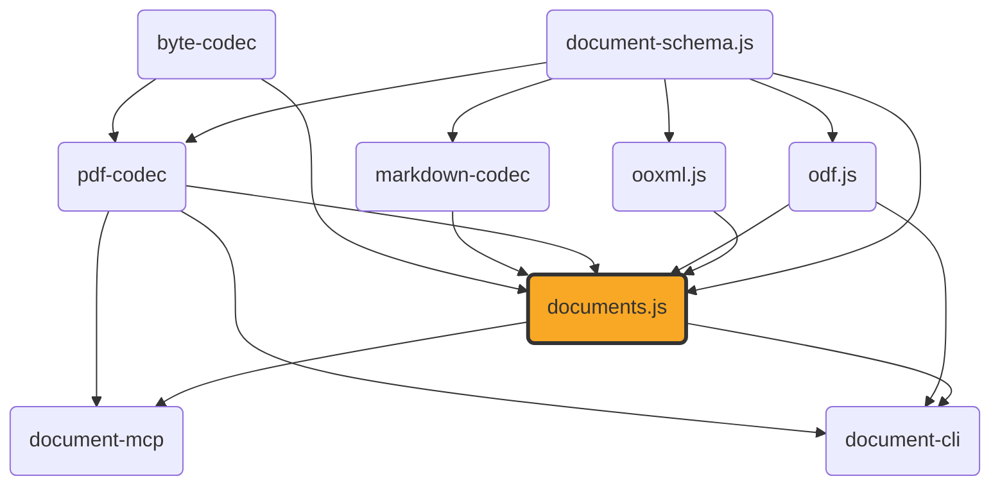

# documents.js

[](https://github.com/ExaDev/documents.js) [](https://www.npmjs.com/package/documents.js) [](https://github.com/ExaDev/documents.js/releases/latest) [](https://github.com/ExaDev/documents.js/actions)

> Converts between any two compatible document formats through a shared content/layout pivot. docx, pptx, odt, odp, ods, odg, xlsx, and markdown all read into and build from the same `ContentDocument`/`LayoutDocument` model, with PDF as the one format every variant can reach. A composition engine (`convertDocument`) routes 73 (source, target) pairs across the eight content formats and PDF, including fourteen PDF-pivot round trips, sixteen cross-format bridges (same-variant direct copies, cross-variant semantic transforms, and PDF-composed), plus special-case conversions for `.odm` master documents, `.odb` database front-ends (HSQLDB and Firebird, four storage tiers), standalone `.odf` formula documents, and a bounded SQL/rpt-formula engine for `.odb` reports. Also includes: read-and-write live-view editors for all six editable formats, docx comment/footnote/header-footer exposure via `readDocxExtras`, real font resolution (source-embedded faces ahead of caller-supplied, vendored substitutes, and the standard 14), a hand-written MathML typesetting engine with embedded-font PDF rendering and a matching MathML ⇄ OMML translator, and a fully hand-written PDF codec. Built on [ooxml.js](https://github.com/ExaDev/ooxml.js), [odf.js](https://github.com/ExaDev/odf.js), [pdf-codec](https://github.com/ExaDev/pdf-codec), [markdown-codec](https://github.com/ExaDev/markdown-codec), and [document-schema.js](https://github.com/ExaDev/document-schema.js).

`documents.js` extends `ooxml.js` in two directions `ooxml.js` deliberately does not cover: full PDF support (parsing and generating, via `pdf-codec`), and a read-**and-write** manipulation API for docx/pptx content — `ooxml.js`'s own typed readers are one-way. The PDF codec is hand-written against ISO 32000-1, with no external PDF library as a dependency — see [Fidelity](#fidelity) and pdf-codec's own README for the honest trade-off (not as robust against adversarial PDFs as a 15+-year-hardened library; fully auditable and dependency-free instead). `src/mathml/` (the MathML typesetting engine) stays in this package and is hand-written too, for the same supply-chain reason.



## Why

The PDF side hand-writes every layer of the format against ISO 32000-1 rather than wrapping a third-party library. The read-and-write editor exists because `ooxml.js`'s typed readers are a deliberate one-way projection — editors are live views directly over the `XmlElement` objects inside a decoded `Package`, so a mutation edits the tree in place and everything you don't touch round-trips byte-faithful.

## Getting started

Requires Node.js `>=20` and pnpm `11.6.0` (pinned via `packageManager` in `package.json`).

```sh
pnpm install
```

Install as a dependency in another project:

```sh
pnpm add documents.js
# or
npm install documents.js
```

## Usage

### The generic entry point: `convertDocument`

A single function, `convertDocument`, sits behind every named conversion and reaches every pair the composition engine can route — all 73 supported (source, target) combinations. The named functions below are thin one-line forwarders to it; they remain the ergonomic layer for a caller who wants a fixed pair and autocomplete discovery, while `convertDocument` is the first-class entry point for a caller working from a runtime format pair (CLI, MCP tool, matrix enumeration).

```ts
import { convertDocument } from 'documents.js';

// markdown -> pptx has no named function of its own: the composition engine routes it
// as one cross-variant transform hop (read wordprocessing, wordprocessingToPresentation, build pptx).
const pptxBytes = convertDocument('markdown', 'pptx', markdownBytes);

// Every option a named function accepts is accepted here too, threaded to whichever hop consumes it.
const odtBytes = convertDocument('docx', 'odt', docxBytes, { onMathDiagnostic: (d) => console.warn(d) });
```

`convertDocument` throws `UnsupportedConversionError` (a named class, so a caller can branch on it) for any pair the composition engine cannot route — there is no silent fallback. `resolveCompositionPlan(source, target)` is exported too, for surfacing the resolved hop plan without running it.

### PDF-pivot conversions

The fourteen round-trip ergonomic conversions between the formats with their own layout engine and PDF (docx/pptx/odt/odp/ods/odg/markdown ⇄ PDF, all round-tripping both ways), plus `xlsxToPdf`/`pdfToXlsx` (composing the ods⇄xlsx bridge with the ods⇄pdf layout pair internally):

```ts
import { docxToPdf, markdownToPdf, odgToPdf, odpToPdf, odsToPdf, odtToPdf, pdfToDocx, pdfToMarkdown, pdfToOdg, pdfToOdp, pdfToOds, pdfToOdt, pdfToPptx, pdfToXlsx, pptxToPdf, xlsxToPdf } from 'documents.js';

const pdfBytes = docxToPdf(docxBytes);
const docxBytes2 = pdfToDocx(pdfBytes);

const pdfFromSlides = pptxToPdf(pptxBytes);
const pptxBytes2 = pdfToPptx(pdfFromSlides);

const pdfFromOdt = odtToPdf(odtBytes);
const odtBytes2 = pdfToOdt(pdfFromOdt);

const pdfFromOdp = odpToPdf(odpBytes);
const odpBytes2 = pdfToOdp(pdfFromOdp);

const pdfFromOdg = odgToPdf(odgBytes);
const odgBytes2 = pdfToOdg(pdfFromOdg);

const pdfFromOds = odsToPdf(odsBytes);
const odsBytes2 = pdfToOds(pdfFromOds); // recovers what was printed, then heuristically re-types it -- see Fidelity

const pdfFromXlsx = xlsxToPdf(xlsxBytes); // composes xlsxToOds -> odsToPdf internally
const xlsxBytes2 = pdfToXlsx(pdfFromXlsx); // composes pdfToOds -> odsToXlsx internally

const pdfFromMarkdown = markdownToPdf(markdownBytes);
const markdownBytes2 = pdfToMarkdown(pdfFromMarkdown); // the lossiest conversion in the whole package -- see Fidelity
```

Each accepts an optional `signal` (`AbortSignal`) and either `onSubstitution` (X → PDF, called per character not representable in a standard-14 font) or `sink` (PDF → X, called per recoverable parse diagnostic). Every X → PDF conversion additionally accepts `fonts` (extra `ProvidedFont` faces) and `onFontSubstitution` (per family+weight+style that resolved to something else). Neither is needed for the common case — see [Fonts](#fonts).

### Cross-format bridges

Sixteen bridge functions across eight pairs bypass the PDF pivot entirely. Five same-variant direct-copy pairs (`odtToDocx`/`docxToOdt`, `odpToPptx`/`pptxToOdp`, `odsToXlsx`/`xlsxToOds`, `markdownToDocx`/`docxToMarkdown`, `markdownToOdt`/`odtToMarkdown`) compose a direct `readXContent` → `buildYPackage` pivot copy. Two cross-variant semantic-transform pairs (`docxToPptx`/`pptxToDocx`, `odtToOdp`/`odpToOdt`) go through `src/convert/variant-bridges.ts`. One PDF-composed pair (`xlsxToMarkdown`/`markdownToXlsx`) routes through PDF internally — the single lossiest conversion in the package.

```ts
import { odtToDocx, docxToOdt, markdownToDocx, docxToMarkdown } from 'documents.js';

const docxBytes = odtToDocx(odtBytes);
const odtBytes2 = docxToOdt(docxBytes);

const docxFromMarkdown = markdownToDocx(markdownBytes);
const markdownBytes3 = docxToMarkdown(docxFromMarkdown); // colour, font family/size, and explicit alignment have no markdown source construct -- dropped on this hop
```

Each takes an optional `{ signal }` — no `onSubstitution`/`sink`, since there is no font substitution or PDF-parse degradation. `odtToDocx`/`markdownToDocx`/`docxToOdt`/`docxToMarkdown` additionally take `onMathDiagnostic`, called per formula construct that degraded crossing the bridge.

### The `DocumentConverter` port

The same conversions behind a swappable port, for a caller that wants to inject a different implementation without changing call sites:

```ts
import { createLocalDocumentConverter } from 'documents.js';

const converter = createLocalDocumentConverter();
const { document, diagnostics } = await converter.convert(
  { source: { format: 'docx', bytes: docxBytes }, targetFormat: 'pdf' },
  { signal: new AbortController().signal },
);
```

`DocumentFormat` includes `docx`/`pptx`/`xlsx`/`odt`/`odp`/`ods`/`odg`/`odf`/`markdown`/`pdf` — ten members. The port's `conversions` list is derived from `resolveCompositionPlan` plus the `odf`→`pdf` special case — 73 pairs total. `DocumentFormat` is inferred from `DocumentFormatSchema` (a real Zod schema); `DOCUMENT_FORMATS` is exported as a plain array derived from the same schema:

```ts
import { DOCUMENT_FORMATS, DocumentFormatSchema } from 'documents.js';

console.log(DOCUMENT_FORMATS); // ['docx', 'pptx', 'xlsx', 'odt', 'odp', 'ods', 'odg', 'odf', 'markdown', 'pdf']
DocumentFormatSchema.parse(userSuppliedFormat); // throws a ZodError for anything outside that list
```

### Intermediate `DocumentPackage`, JSON, and bytes

Every conversion function accepts an `onDocument` callback receiving the intermediate `DocumentPackage` (content + layout). The port surfaces the same value as `package` on `ConversionResult`. For PDF-bypassing bridges, `pkg.layout` is always `undefined`.

```ts
import { docxToPdf } from 'documents.js';

const pdfBytes = docxToPdf(docxBytes, {
  onDocument: (pkg) => {
    console.log(pkg.content.kind); // 'wordprocessing'
    console.log(pkg.layout?.pages.length); // populated for every X-to-PDF/PDF-to-X conversion
  },
});
```

`documentPackageWithSchema`/`documentFromJson` turn a `DocumentPackage` into self-describing JSON and back (re-exported from `document-schema.js`):

```ts
import { documentFromJson, documentPackageWithSchema } from 'documents.js';

const tagged = documentPackageWithSchema(pkg);
writeFileSync('converted.doc.json', JSON.stringify(tagged, null, 2));

const { kind, value } = documentFromJson(JSON.parse(readFileSync('converted.doc.json', 'utf8')));
// kind: 'DocumentPackage' (here) | 'ContentDocument' | 'LayoutDocument'
```

`buildDocumentBytes` rebuilds any `DocumentFormat`'s bytes from a `DocumentPackage` — `'pdf'` writes the `LayoutDocument` half directly (throwing if the package carries none), `'odf'` has no builder and throws, everything else rebuilds from the `ContentDocument` half:

```ts
import { buildDocumentBytes, docxToPdf } from 'documents.js';

let captured;
docxToPdf(docxBytes, { onDocument: (pkg) => { captured = pkg; } });
const pdfBytesAgain = buildDocumentBytes(captured, 'pdf');
const docxBytesAgain = buildDocumentBytes(captured, 'docx');
```

### Package decode/encode, metadata, and deep imports

`decodeDocumentPackage`/`encodeDocumentPackage` dispatch docx/pptx/xlsx through `ooxml.js`'s OPC codec and odt/odp/ods/odg/odf through `odf.js`'s ODF codec, throwing `UnsupportedPackageFormatError` for `markdown`/`pdf`. `decodeOdbPackage` is the `.odb`-specific sibling (`.odb` is not a `DocumentFormat` member):

```ts
import { decodeDocumentPackage, decodeOdbPackage, encodeDocumentPackage } from 'documents.js';

const pkg = decodeDocumentPackage('docx', docxBytes);
const docxBytesAgain = encodeDocumentPackage('docx', pkg);
const odbPkg = decodeOdbPackage(odbBytes);
```

`readDocumentMetadata`/`setDocumentMetadata` read or patch metadata across any `DocumentFormat`. `setDocumentMetadata` patches in place (source/target formats must match); `odf` is rejected in both directions. `readDocumentMetadata('xlsx', ...)` is a named exception: it renders via `xlsxToPdf` and reads the PDF's metadata, because a direct read and the PDF-preview path genuinely disagree on `createdIso`/`modifiedIso`/`producer`.

```ts
import { readDocumentMetadata, setDocumentMetadata } from 'documents.js';

const metadata = readDocumentMetadata('docx', docxBytes);
const patchedBytes = setDocumentMetadata('docx', 'docx', docxBytes, { title: 'New title', keywords: ['a', 'b'] });
```

Every module under `src/` is deep-importable by package-relative path:

```ts
import { emuToPt } from 'documents.js/model/units';
import { buildOdtPackage } from 'documents.js/edit/odt/content';
```

### Reading and building xlsx content directly

Every other content format has its own standalone `readXContent`-shaped entry point (`readDocxContent`, `readPptxContent`, `readOdtContent`, `readOdpContent`, `readOdsContent`, `readOdgContent`) — xlsx is no longer the exception. `readXlsxContent`/`buildXlsxPackage` are `ooxml.js`'s own spreadsheet `ContentDocument` read/build pair — the same one the `ods⇄xlsx` bridge and every xlsx metadata-rebuild path already use internally — re-exported here directly rather than wrapped, since `readXlsxContent` already produces the right shape on its own:

```ts
import { buildXlsxPackage, decodeDocumentPackage, encodeDocumentPackage, readXlsxContent } from 'documents.js';

const content = readXlsxContent(decodeDocumentPackage('xlsx', xlsxBytes)); // ContentDocument, kind: 'spreadsheet'
const rebuiltBytes = encodeDocumentPackage('xlsx', buildXlsxPackage(content));
```

This pair is comparatively newer than the ODF/DrawingML readers above, and inherits their maturity level: percentage, currency, and date cell kinds round-trip with their semantic kind intact, but two narrower gaps are worth knowing before relying on it for more than read-only extraction — an ODS-style time-only value has no xlsx serial to write into and degrades to a plain string cell, and a written column width survives a read back only within about a point of its original value (an algebraic-inverse rounding artifact in the character-width unit conversion, not a dropped value). See `src/convert/bridges.test.ts`'s own `ods⇄xlsx` section for the exact, currently-tested numbers.

### Live-view editors

Read-and-write editors for docx/pptx/odt/odp/ods/odg content, holding a direct reference into the real `Package`/`XmlElement` objects. Saving is `encodePackage(pkg)` — everything you didn't touch stays byte-faithful.

```ts
import { openDocx, createDocx } from 'documents.js';

const editor = openDocx(existingDocxBytes);
const paragraph = editor.body.appendParagraph({ alignment: 'center' });
const run = paragraph.appendRun({ text: 'Hello' });
run.bold = true;
run.color = { r: 1, g: 0, b: 0 };
const bytes = editor.toBytes();

const fresh = createDocx();
fresh.body.appendParagraph().appendRun({ text: 'New document' });
```

A docx's comments, footnotes, headers/footers, and numbering definitions never fit `ContentDocument`'s section/block shape — `readDocxExtras` is a second, independent read returning exactly that data:

```ts
import { readDocxExtras } from 'documents.js';
import { decodePackage } from 'ooxml.js';

const { comments, footnotes, headers, footers, numbering } = readDocxExtras(decodePackage(docxBytes));
console.log(Object.values(numbering)[0]?.levels['0']?.format); // numbering is keyed by numId, each level by its own level index
```

`openPptx`/`createPptx` and `PptxSlide`/`PptxShape` are the pptx equivalent. `openOdt`/`createOdt` and `OdtParagraph`/`OdtRun`/`OdtTable`/`OdtList` are the odt equivalent, built on ODF's style-name-referencing model. `openOdp`/`createOdp` and `OdpSlide`/`OdpShape` reuse `OdtParagraph`/`OdtRun`/`OdtList` directly (a `draw:frame`'s `draw:text-box` holds the identical `text:p`/`text:span` model):

```ts
import { createOdp } from 'documents.js';

const editor = createOdp();
const slide = editor.addSlide();
const title = slide.addTextBox({ frame: { xPt: 40, yPt: 30, widthPt: 640, heightPt: 80 }, text: 'Title' });
title.rotationDeg = 15; // OdpShape has a genuine draw:transform rotation setter
const bullets = slide.addTextBox({ frame: { xPt: 40, yPt: 130, widthPt: 300, heightPt: 200 }, text: '' });
bullets.paragraphs()[0].remove();
bullets.addList().addItem().appendParagraph({ text: 'A real bulleted text:list' });
slide.notes = 'Speaker notes for this slide';
const bytes = editor.toBytes();
```

`createOds`/`openOds` and `OdsEditor`/`OdsSheet`/`OdsCell` are the spreadsheet equivalent — the one editor family built from scratch (cell addressing has no docx/pptx analogue). Setting a cell far from the origin splits `table:number-*-repeated` runs in place rather than materialising every cell in between:

```ts
import { createOds } from 'documents.js';

const editor = createOds();
const sheet = editor.addSheet('Sheet1');
sheet.printSettings = { pageSize: { widthPt: 595, heightPt: 842 }, margins: { topPt: 20, rightPt: 20, bottomPt: 20, leftPt: 20 }, gridlines: true, headers: true, pageOrder: 'downThenOver' };
sheet.cell(0, 0).value = { kind: 'string', value: 'Total' }; // 0-based (row, column)
sheet.cell(0, 1).value = { kind: 'currency', value: 42.5, currency: 'USD' };
sheet.cell(500, 50).value = { kind: 'boolean', value: true }; // does not materialise 500x50 empty cells
const bytes = editor.toBytes();
```

`createOdg`/`openOdg` and `OdgEditor`/`OdgPage` are the drawing equivalent. `OdgPage.addTextBox`/`.addImage` return `OdpShape` instances; `addRect`/`addEllipse`/`addLine`/`addPath` return vector classes writing real `draw:rect`/`draw:ellipse`/`draw:line`/`draw:path` elements:

```ts
import { createOdg } from 'documents.js';

const editor = createOdg();
const page = editor.addPage();
page.addRect({ frame: { xPt: 20, yPt: 20, widthPt: 100, heightPt: 60 }, fill: { r: 1, g: 0.5, b: 0 } });
page.addEllipse({ frame: { xPt: 140, yPt: 20, widthPt: 100, heightPt: 60 }, stroke: { color: { r: 0, g: 0, b: 0 }, widthPt: 1 } });
page.addPath({
  frame: { xPt: 20, yPt: 100, widthPt: 80, heightPt: 80 },
  subpaths: [{ start: { xPt: 0, yPt: 80 }, closed: true, segments: [{ kind: 'line', to: { xPt: 60, yPt: 80 } }, { kind: 'cubic', control1: { xPt: 80, yPt: 80 }, control2: { xPt: 80, yPt: 0 }, to: { xPt: 40, yPt: 0 } }] }],
  fill: { r: 1, g: 1, b: 0 },
}); // a genuine Bezier curve -- writes a real svg:d/svg:viewBox pair, not a polygon approximation
page.addTextBox({ frame: { xPt: 20, yPt: 200, widthPt: 300, heightPt: 30 }, text: 'A label on top' });
const bytes = editor.toBytes();
```

### PDF bytes and `z.codec()` pairs

```ts
import { readPdf, writePdf } from 'documents.js';

const layout = readPdf(pdfBytes); // -> LayoutDocument: pages of positioned text/image/rect/link items
const bytes = writePdf(layout);
```

The nine PDF round trips and ten PDF-bypassing bridges are also available as schema-validated [`z.codec()`](https://zod.dev) pairs (`pdfCodec`, `docxPdfCodec`, `pptxPdfCodec`, `odtPdfCodec`, `odpPdfCodec`, `odsPdfCodec`, `odgPdfCodec`, `xlsxPdfCodec`, `markdownPdfCodec`, `odtDocxCodec`, `odpPptxCodec`, `odsXlsxCodec`, `markdownDocxCodec`, `markdownOdtCodec`) — the no-options form, adding automatic two-way schema validation:

```ts
import { z } from 'zod';
import { docxPdfCodec, pdfCodec } from 'documents.js';

const layout = z.decode(pdfCodec, pdfBytes); // throws a ZodError if pdfBytes has no %PDF- header
const pdfBytes2 = z.encode(pdfCodec, layout);
const pdfFromDocx = z.decode(docxPdfCodec, docxBytes);
const docxBack = z.encode(docxPdfCodec, pdfFromDocx);
```

### Special-case conversions

**`odmToPdf`** — ODF master document → PDF. A `.odm` never carries its chapters' content (each `text:section` is an external `.odt` reference), so it requires a caller-supplied `resolveSubDocument` callback. Not wired into the `DocumentConverter` port (its contract is bytes-in/bytes-out):

```ts
import { readFileSync } from 'node:fs';
import { odmToPdf, OdmUnresolvedSectionError } from 'documents.js';

const chapterBytes = new Map([
  ['../chapter1.odt', new Uint8Array(readFileSync('chapter1.odt'))],
  ['../chapter2.odt', new Uint8Array(readFileSync('chapter2.odt'))],
]);

try {
  const pdfBytes = odmToPdf(odmBytes, { resolveSubDocument: (href) => chapterBytes.get(href) });
} catch (error) {
  if (error instanceof OdmUnresolvedSectionError) {
    console.error('missing chapters:', error.hrefs); // every unresolved href, not just the first
  }
}
```

**`.odb` database front-end** — `readOdbTables` extracts every table; `odbToXlsx`/`odbToCsv` produce xlsx or CSV. All four storage tiers are supported (HSQLDB TEXT-script Tier 1, HSQLDB CACHED binary Tier 2, Firebird gbak Tier 3, HSQLDB BINARY/COMPRESSED Tier 4), dispatched automatically:

```ts
import { decodePackage } from 'odf.js';
import { odbToCsv, odbToXlsx, readOdbTables } from 'documents.js';

const xlsxBytes = odbToXlsx(odbBytes); // one xlsx sheet per table
const csvBytes = odbToCsv(odbBytes, { table: 'CUSTOMERS' }); // required when the .odb has more than one table
const tables = readOdbTables(decodePackage(odbBytes)); // Package -> HsqldbTable[]
```

Form/Report *structure*: `readOdbForms`/`readOdbReports` read every declared component's static structure (bound controls, bands/groups/functions):

```ts
import { decodePackage } from 'odf.js';
import { readOdbForms, readOdbReports } from 'documents.js';

const forms = readOdbForms(decodePackage(odbBytes));
const reports = readOdbReports(decodePackage(odbBytes));
```

`readFirebirdBackup` decodes a Firebird `.fbk` directly:

```ts
import { readFirebirdBackup } from 'documents.js';
const { summary, tables } = readFirebirdBackup(firebirdBackupBytes);
```

**SQL `SELECT` engine** — `parseSelect`/`evaluateSelect` run a bounded single-table `SELECT` over `readOdbTables`' output. Closed allowlist grammar: column list or `*` or aggregates (`COUNT`/`SUM`/`AVG`/`MIN`/`MAX`), `FROM` one table, optional `WHERE`/`GROUP BY`/`ORDER BY`. Everything else throws `HsqldbSqlUnsupportedError`:

```ts
import { decodePackage, readOdbInventory } from 'odf.js';
import { evaluateSelect, parseSelect, readOdbTables } from 'documents.js';

const pkg = decodePackage(odbBytes);
const [query] = readOdbInventory(pkg).queries;
const { columns, rows } = evaluateSelect(parseSelect(query.command), readOdbTables(pkg));
```

**rpt formula engine** — `runRptReport` evaluates a report's group breaks and per-group totals. Closed allowlist: `rpt:HASCHANGED(X)`, `rpt:LEFT(X;n)` (semicolon separator), `rpt:SUM`/`COUNT`/`AVG`/`MIN`/`MAX`, and `field:[COLUMN]`. Everything else throws `RptFormulaUnsupportedError`:

```ts
import { decodePackage, readOdbInventory } from 'odf.js';
import { evaluateSelect, parseSelect, readOdbReports, readOdbTables, rptDefinitionFromReport, runRptReport } from 'documents.js';

const pkg = decodePackage(odbBytes);
const [report] = readOdbReports(pkg);
const query = readOdbInventory(pkg).queries.find((candidate) => candidate.name === report.command);
const rows = evaluateSelect(parseSelect(query.command), readOdbTables(pkg));
const { bands } = runRptReport(rptDefinitionFromReport(report), rows);
```

**Report rendering** — `readOdbReportContent` resolves data binding, runs the query, evaluates formulas, and renders bands as a real `ContentDocument`. `odbReportToDocx`/`odbReportToOdt`/`odbReportToPdf` dispatch it to bytes:

```ts
import { decodePackage } from 'odf.js';
import { odbReportToDocx, odbReportToOdt, odbReportToPdf, readOdbReportContent } from 'documents.js';

const report = readOdbReportContent(decodePackage(odbBytes), { report: 'SalesByRegion' });
const docxBytes = odbReportToDocx(report);
const pdfBytes = odbReportToPdf(report);
```

**`odfToPdf`** — standalone `.odf` formula document → PDF via the MathML typesetting engine. No reverse `pdfToOdf` (recovering structured MathML from rendered glyphs is OCR-adjacent). Formulas embedded inside odt/odp/ods render automatically through `odtToPdf`/`odpToPdf`/`odsToPdf`:

```ts
import { odtToPdf, odfToPdf } from 'documents.js';

const pdfBytes = odfToPdf(odfBytes); // a single formula, faithfully typeset
const pdfFromOdtWithFormula = odtToPdf(odtBytes); // embedded formulas render as real typeset MathML
```

A formula's MathML travels inside the `ContentDocument` as a `ContentEmbeddedObjectBlock` whose `document` is a `'formula'`-kind `ContentDocument`:

```ts
import { convertWordprocessingToLayout, formulaOfBlock, readOdtContent } from 'documents.js';

const document = readOdtContent(pkg);
const block = document.sections[0].blocks.find((b) => b.kind === 'embeddedObject');
formulaOfBlock(block); // -> { mathml, starMath? }, or undefined for a non-formula embedded object

const { document: layout, formulas: positioned } = convertWordprocessingToLayout(document, { measurer });
const pdfBytes = writePdf(layout, { formulas: positioned });
```

`layoutFormula`/`loadMathFont` are exported for direct formula layout. `buildOfficeMath`/`buildOfficeMathParagraph` translate MathML into OMML for docx. `readOfficeMath`/`collectOfficeMathElements` are the read-side inverse:

```ts
import { buildOfficeMathParagraph, layoutFormula, loadMathFont, openDocx } from 'documents.js';

const { metricsAt } = loadMathFont();
const { box, diagnostics } = layoutFormula(mathml, { metrics: metricsAt(12), sizePt: 12, color: { r: 0, g: 0, b: 0 } });

const editor = openDocx(existingDocxBytes);
const { diagnostics: ommlDiagnostics } = editor.body.appendParagraph().appendOfficeMath(mathml);
```

## Fonts

Every X → PDF conversion resolves each typeface through a real `FontRegistry`, in this order:

1. **The source document's own embedded faces** — docx (`w:embed*`, obfuscated per ECMA-376), pptx (`p:embeddedFontLst`, unobfuscated), ODF (`Fonts/` under `svg:font-face-uri`). Extracted automatically.
2. **Faces the caller supplied** through `options.fonts`.
3. **pdf-codec's vendored Carlito and Caladea** — metric-compatible with Calibri and Cambria.
4. **The standard 14** — last resort.

The same registry drives both the `TextMeasurer` (line breaking) and the writer (glyph emission) — measuring against one font's metrics and drawing through another would wrap text at wrong positions.

```ts
import { docxToPdf } from 'documents.js';

const pdfBytes = docxToPdf(docxBytes); // nothing to configure for embedded fonts

const withFallbackFace = docxToPdf(docxBytes, {
  fonts: [{ family: 'Brand Sans', bold: false, italic: false, bytes: brandSansTtfBytes }],
  onFontSubstitution: (substitution) => console.warn(substitution.requestedFamily, '->', substitution.resolvedFamily),
});
```

A document that embeds nothing and asks for no vendored-substitute family writes byte-identical output to the old standard-14-only pipeline. Two structural limits: an embedded face is normally subsetted, so it can legitimately lack a synthesised character (list bullet, `###` overflow marker) — resolved per character via `onMissingGlyph`. And `odfToPdf` accepts font options but consults neither — a standalone formula emits only the embedded STIX Two Math font's glyphs. `extractSourceFonts`/`extractSourceFontsForFormat`/`createDocumentFontRegistry` are exported for callers composing the pipeline manually. `describeFontFace` inspects a standalone `.ttf`/`.otf` file.

```ts
import { describeFontFace, extractSourceFontsForFormat } from 'documents.js';

const faces = extractSourceFontsForFormat('docx', docxBytes); // -> readonly ProvidedFont[]
const { family, bold, italic } = describeFontFace(fontBytes, 'BrandSans-Regular.ttf');
```

## Architecture

The package is layered from generic primitives outward to the two conversion directions:

- **`src/model/`** — thin additions on top of `document-schema.js`, which owns the two pivot models (`LayoutDocument`, `ContentDocument`) imported, not defined here. Local: `bytes.ts` (magic-byte schemas), `units.ts` (EMU/twip/point conversions), `geometry.ts`/`color.ts`/`style.ts` (thin re-exports plus PDF-specific `flipY`), `paint-order.ts` (merges drawing page `shapes`/`vectors` by `paintOrder`), `formula.ts` (helpers around `ContentFormula`), `embedded-drawing.ts` (packages recovered vectors as a `ContentEmbeddedObjectBlock`).
- **`pdf-codec`** (external) — the hand-written PDF codec, plus generic byte/image primitives (now in `byte-codec`). See that package's own README.
- **`src/ports/`** — injectable ports: `throwIfAborted` (signal check at long-loop boundaries) and `ClockPort`/`systemClock`/`fixedClock` (injectable "now" for deterministic output — exported but not yet consumed by any conversion path).
- **`src/xml/`** and **`src/opc/`** — parent-aware XML query/mutation and OPC package mechanics over `ooxml.js`'s `Package`/`XmlNode`. `src/xml/odf-text.ts` holds `encodeOdfText`/`decodeOdfText` — see the ODF text gotcha below.
- **`src/odf-package/`** — ODF-side counterpart to `src/opc/`: manifest sync, media insertion (`addImageMedia`), and embedded formula sub-documents (`addFormulaObject`).
- **`src/edit/`** — the read-and-write editable model: live-view classes for all six editable formats, plus `buildXPackage` functions bridging `ContentDocument` to fresh packages. Key reuse patterns: `src/edit/odp/*` reuses `src/edit/odt/*` wholesale (identical `text:p`/`text:span` model); `src/edit/odg/*` reuses `OdpShape` for `draw:frame` content; `src/edit/drawingml/vector.ts` is the shared OOXML vector writer for docx and pptx; `src/edit/odg/vector.ts` is the shared ODF vector writer for odt/odp/odg. `src/edit/ods/*` is built from scratch (cell addressing) but reuses odt's style interning.
- **`src/fonts/`** — source-embedded font extraction (`obfuscation.ts` implements ECMA-376 Part 4, 2.8.1; `ooxml.ts`/`odf.ts` resolve font references) and `registry.ts`'s `createDocumentFontRegistry` composing the precedence chain as data.
- **`src/mathml/`** — a self-contained MathML presentation-layer typesetting engine (no import from `model`, `pdf-codec`, or `odf.js`; consumes only port contracts from `document-schema.js` and its own locally-mirrored `MathMlNode`). Covers `mrow`/`mi`/`mn`/`mo`/`mtext`/`mspace`/`msub`/`msup`/`msubsup`/`munder`/`mover`/`munderover`/`mfrac`/`msqrt`/`mroot`/`mtable`/`mtr`/`mtd`/`mstyle`/`semantics`, driven by the injected `MathFontMetrics` port. Stretches vertical fences and horizontal braces via the font's `MathVariants` data.
- **`src/omml/`** — the MathML ⇄ OMML structural translator, both directions. `write.ts` covers the identical construct set `src/mathml/layout.ts` typesets; `read.ts` covers strictly more (reads what Word authored, not just what this package writes). Lives outside `src/mathml/` because its I/O type is `ooxml.js`'s `XmlElement` and `src/mathml/` imports no package.
- **`src/ooxml/`** — thin adapters over `ooxml.js`'s own `readDocx`/`readPptx`, wrapping results into `ContentDocument`. `docx/formula.ts` is the one local reading pass (splicing OOXML math equations). `docx/extras.ts`'s `readDocxExtras` returns comments/footnotes/headers/footers/numbering.
- **`src/odf/`** — ODF-side counterparts: `readOdtContent`/`readOdpContent`/`readOdsContent`/`readOdgContent` are thin adapters over `odf.js`. `formula/read.ts`/`formula/detect.ts` handle embedded formula detection (genuinely new work with no `odf.js`-side equivalent).
- **`src/markdown/`** — third adapter family, via `markdown-codec`. `readMarkdownContent` passes `readMarkdown`'s result straight through (it already produces a full `ContentDocument`). `buildMarkdownText` wraps `writeMarkdown`. `text.ts` is the byte↔text boundary. `MarkdownEditor` holds a mutable in-memory `ContentDocument`.
- **`src/layout/`** — the pure conversion algorithms: `engine.ts` (wordprocessing → layout: flow, line-breaking, pagination), `slides.ts` (presentation → layout: direct placement), `sheets.ts` (spreadsheet → layout: grid, print settings, the first algorithm accepting `AbortSignal`), `drawing.ts` (drawing → layout: vector primitives + shape reuse), `reconstruct.ts` (layout → content: baseline clustering for wordprocessing/presentation, near-1:1 mapping for drawing, gridline-lattice-or-text-clustering for spreadsheet).
- **`src/hsqldb/`** — `.odb` decoders, four tiers: `script.ts` (TEXT-script DDL/DML parser), `rowformat.ts`/`cache.ts` (CACHED binary row-store), `binary-script.ts` (BINARY/COMPRESSED whole-script). All import only `document-schema.js` — no odf.js knowledge.
- **`src/firebird/`** — Tier 3: gbak logical-backup reader. `reader.ts` (attribute framing + RLE decompression + XDR decoding), `schema.ts`/`data.ts` (table/row walking). No ratified spec — built against Firebird's own engine source.
- **`src/odb/`** — decoder-selection and pivot-mapping: `read.ts` routes to the right tier, `spreadsheet.ts`/`csv.ts` map to output formats. `odb/sql/` is the bounded SQL engine, `odb/formula/` is the rpt formula engine, `odb/report/` is the renderer, `odb/values.ts` is shared comparison/aggregation semantics.
- **`src/convert/`** — the composition layer: `convert.ts` (all named functions + `convertDocument` + `resolveCompositionPlan`), `composition.ts` (the pathfinder and primitive registry), `codec.ts` (`z.codec()` pairs), `port.ts`/`local.ts` (the `DocumentConverter` port), `variant-bridges.ts` (cross-variant semantic transforms), `from-package.ts` (`buildDocumentBytes`).
- **`src/codecs/`** — `DOCUMENT_FORMAT_CODECS`: every format's read/build capability as data, so `readDocumentMetadata`/`setDocumentMetadata`/`buildDocumentBytes` dispatch through one registry.
- **`src/metadata/`** — cross-format metadata read/write via `DOCUMENT_FORMAT_CODECS`.
- **`src/package-codec.ts`** — `decodeDocumentPackage`/`encodeDocumentPackage`/`decodeOdbPackage`.

Dependency direction is downward and checkable. Six external dependencies each own a distinct concern: `ooxml.js` (docx/pptx/xlsx), `odf.js` (odt/ods/odp/odg), `document-schema.js` (shared schemas + port contracts), `pdf-codec` (PDF codec + text-layout/font primitives), `byte-codec` (byte/image utilities), `markdown-codec` (markdown). No `PdfObject`/`PdfDict`/`PdfStream` type appears anywhere in this package.

## Build, test, and lint

```sh
pnpm build         # turbo run _build (tsdown -> dist/ (ESM + CJS + .d.ts))
pnpm typecheck     # turbo run _typecheck _typecheck:node
pnpm lint          # turbo run _lint (eslint . --fix --cache --max-warnings 0)
pnpm test          # turbo run _test (vitest run --project unit)
pnpm test:workers  # turbo run _test:workers (vitest run --config vitest.workers.config.ts -- Cloudflare Workers runtime)
pnpm test:watch    # vitest --project unit
pnpm test:smoke    # turbo run _test:smoke (rebuilds dist/, verifies ESM/CJS parity, real round trips across all conversions, font resolution, from the built CJS bundle)
```

To run a single test file: `pnpm vitest run src/path/to/file.test.ts`.

## Conventions

- **Zod-first schema/type/guard**, matching `ooxml.js`: every model type is inferred from its Zod schema. `ContentBlock` (recursive) uses a hand-written structural guard + `z.custom`, not `z.lazy`.
- **`z.codec()` for every schema-to-schema round trip** — the no-options form; named functions remain the entry points for `signal`/`sink`/`onSubstitution`.
- **`PdfObject` has no Zod schema** — it never crosses a public boundary; narrows on its own `kind` discriminant.
- **No type assertions anywhere.** Every loosely-typed value is narrowed through a type guard or Zod parse at the boundary.
- **Live views, not flatten-and-regenerate.** Editor classes hold a reference into the real `Package`/`XmlElement` objects; saving is `encodePackage(pkg)`.
- **Three-tier PDF-read failure policy** — throw for unprocessable files, recover-with-diagnostic for malformed-but-salvageable, degrade-with-diagnostic for unsupported features. See pdf-codec's README.
- **Conventional commits**, enforced via commitlint + husky.
- **Worker-isomorphic runtime.** `src/` is typechecked against a web-only environment (`lib: ["ES2024", "WebWorker"]`, no `@types/node`); `eslint` bans Node-only imports/globals; `test:workers` proves PDF-bypassing paths run in `workerd`.

## Gotchas and quirks

- **`ooxml.js`'s typed readers are the basis for conversion** — `readDocxContent`/`readPptxContent` are thin wrappers, not independent walks. They are deliberately not re-exported (exposing both would invite using the wrong one). `readDocx`'s `comments`/`footnotes`/`headers`/`footers`/`numbering` are exposed via `readDocxExtras`. `readPptx` has no extras reader yet. xlsx is the one exception: `ooxml.js`'s `readXlsxContent`/`buildXlsxPackage` already read/write a spreadsheet `ContentDocument` directly (unlike `readDocx`/`readPptx`, which `readDocxContent`/`readPptxContent` wrap), so they're re-exported as-is rather than given a documents.js-local wrapper of their own — `readXlsx`, the separate lossy cell-values-only view, stays unexported for the same reason `readDocx`/`readPptx` do.
- **ODF text content is not a plain string.** ODF represents runs of spaces as `<text:s>`, tabs as `<text:tab/>`, line breaks as `<text:line-break/>` — all elements, not text nodes. Every ODF text getter MUST call `decodeOdfText`, never `textContent()` — which silently drops them (no error, just shorter text).
- **docx⇄PDF and pptx⇄PDF are explicitly not round-trip-lossless** — see [Fidelity](#fidelity). The cross-format bridge pairs are a genuinely different case.
- **A `DocumentPackage` from `onDocument`/`ConversionResult.package` is a snapshot, not a live view** — mutating `content` afterwards leaves `layout` stale; nothing detects or rejects that.
- **ODF text getters must call `decodeOdfText`.** See the dedicated gotcha above.
- **`readPdf` recovers rect/ellipse/line as their own `LayoutRect`/`LayoutEllipse`/`LayoutLine` kinds** via pdf-codec's shape-pattern detection — an axis-aligned closed four-corner subpath is a rect, four kappa-ratio cubics at cardinal points is an ellipse, an open single straight stroke is a line. A false positive changes kind, never geometry. Off-axis rotations, freeform curves, and multi-subpath figures narrow to `LayoutPath`.
- **`pdfToOds` re-types cells heuristically — this is probabilistic, not a fidelity guarantee.** A rendered PDF never carries a cell's typed value, only the printed string. Re-typing fires only where the string has exactly one defensible reading: the decimal must be exactly representable as a JS number; separators must be unambiguous (`"1,234"` is declined — competing European reading is 1.234); leading zeros decline (`"007"`); dates must self-state their component roles (ISO or named month accepted; `"01/02/2024"` declined). `TRUE`/`FALSE` re-type as booleans; `Yes`/`No` are declined. `displayText` always carries the rendered string verbatim. `onCellTypeInference` reports every decision. A formula is never claimed.
- **`reconstructWordprocessing`/`reconstructPresentation` recover vector primitives too**, in a nested drawing document — a rule under a heading, an underline, a cell background are all recovered as vectors (intended — discarding real content because it might be incidental is ruled out). A table's gridlines are excluded from vector recovery when the lattice claims them.
- **Recovered vectors round-trip through all four readers** — `buildDocxPackage`/`buildPptxPackage` write real DrawingML; `buildOdtPackage`/`buildOdpPackage` write real `draw:rect`/`draw:ellipse`/`draw:line`/`draw:path`. The six PDF-bypassing bridges carry vector geometry across too.
- **Each format wraps a vector shape differently.** OOXML: pptx gets a plain `p:sp`; docx gets a `w:drawing`/`wp:anchor` with `behindDoc="1"`/`wp:wrapNone` carrying a `wps:wsp`. ODF: odp appends to `draw:page`; odt anchors in a `text:p` with `style:horizontal-rel`/`style:vertical-rel="page"` (page-absolute coordinates) and `style:run-through="background"`.
- **`ContentStroke.style` is not written by vector writers.** `LayoutLine`/`LayoutPath` carry the enum, but neither ODF nor DrawingML vector writers read it — a hand-built vector with `stroke.style` paints solid. Cell borders are a separate path that does set the style.
- **`pdfToOds` recovers what was printed, not what was entered.** `reconstructSpreadsheet` tries a real gridline lattice first (`MIN_GRIDLINE_COUNT_PER_AXIS = 3`), using line positions directly as cell boundaries; absent one, clusters text into a grid from geometry. Column widths/row heights are measured, never invented. No print range/scale/repeat-rows/manual-breaks are inferred.
- **`OdsSheet.printSettings` round-trips every field** — `pageSize`/`margins`/`gridlines`/`headers`/`pageOrder`/`printRange`/`scalePercent`/`fitToPages`/`repeatColumns`/`repeatRows`/`manualBreaks`. The setter mints a fresh style chain (append-only convention).
- **`OdsSheet` column-width/row-height setters close the zero-size hazard.** An explicit-but-unstyled column/row element reads back at `widthPt`/`heightPt` 0, which wins over the layout engine's fallback — `xlsxToPdf`'s internal composition made this a real bug. `ensureColumnDefaultWidth`/`ensureRowDefaultHeight` stamp defaults on first individuation. `OdsSheet.addImage`/`addEmbeddedObject` write floating shapes and formula sub-documents.
- **`reconstructDrawing` maps recovered geometry near-1:1** — no clustering (a drawing has no semantic structure to infer). Kind survives where `readPdf` recovers it; a rotation not a multiple of 90° narrows to `path`. A wrapped multi-line text box comes back as separate single-line boxes (one `LayoutText` = one shape). A `path`'s reconstructed `frame` is the tight bounding box of all recovered points including cubic controls.
- **Two fill bugs fixed as part of `pdfToOdg`** (both pre-existing, exposed by real-file verification): `draw:fill="solid"` is now written explicitly whenever a fill is set (LibreOffice silently renders a `draw:path` with `draw:fill-color` alone as unfilled); and `writeEllipse` now emits a PDF `h` closepath operator (PDF fills close implicitly, but `readPdf` only marks `closed: true` when it sees `h`).
- **Vector fill/stroke uses a self-contained graphic-family style writer** (`src/edit/odg/style.ts`), not `odf.js`'s `StyleRegistry` — which recognises `'graphic'` but never emits `style:graphic-properties`.
- **`svg:d` is cross-checked against `odf.js`'s real parser** — `OdgPathVector.subpaths` re-derives by reparsing the written `svg:viewBox`/`svg:d` on every read.
- **Paint order is document order, never `draw:z-index`.** `shapes` and `vectors` arrays merge via the shared `paintOrder` field. An earlier `add*` call paints behind a later one.
- **`LayoutPathSchema` has no quadratic or elliptical-arc segment** — deliberately; real LibreOffice output only emits `M`/`L`/`H`/`V`/`C`/`Z`.
- **A rotated vector renders as `LayoutPath`** — `LayoutRect`/`LayoutEllipse` carry no rotation field. The rotation is exact (affine maps edges to edges, cubics to cubics); only the `rotationDeg` field is lost on PDF round trip.
- **`ContentVector.path.fillRule` is read from real `svg:fill-rule` markup.**
- **Cell borders render with real `style` (`solid`/`dashed`/`dotted`/`double`)** — `LayoutLineSchema` carries the enum, `pushCellBorderLines` sets it, pdf-codec renders it. The `'double'` inter-line offset is an internal constant (not in the data model).
- **Font resolution uses a real registry, standard 14 as last resort.** A family with no embedded/caller/vendored face (Aptos, third-party typefaces) renders through the nearest standard-14 face with a width-correction factor — expect a visual approximation, not line-identical output. MathML formula rendering is separate: it embeds STIX Two Math, not registry-resolvable.
- **Justified paragraphs stretch inter-word gaps** in all three layout engines (`engine.ts`, `slides.ts`, `sheets.ts`). `justifyLineGapsPt` divides slack evenly across detected word gaps; final lines stay left-aligned.
- **Encrypted PDFs and CCITT/JBIG2/JPX images are real capabilities** in pdf-codec — not scope boundaries. The permanent boundary is adversarial/malformed-input robustness.
- **PDF → docx/pptx/odt/odp table recovery requires a real drawn gridline lattice** — never text alignment (which would invent structure). A lattice with no text inside is rejected.
- **Merged table cells round-trip as merged.** docx: horizontal merge collapses to one `w:tc` with `w:gridSpan`; vertical merge needs one `w:tc` per covered row with `w:vMerge`. ODF: one entry per grid position, covered cells get `table:covered-table-cell`.
- **docx headers/footers/comments/footnotes/numbering are readable via `readDocxExtras`** — `readDocxContent` still drops them (`ContentDocument` has nowhere to put them). `PAGE`/`NUMPAGES` field substitution is never read (it's a render-time value).
- **A docx inline image reads as a real `ContentImageBlock`** — `buildDocxPackage` recognises `readDocx`'s two-block pattern (empty-text paragraph + image) and writes it back as one paragraph, avoiding spurious blank paragraphs on round trip.
- **pptx speaker notes survive via a hidden `/Subtype /Text` annotation** — specific to this package's writer/reader pair; other PDF producers/consumers won't see it.
- **`odmToPdf` is the one non-bytes-in/bytes-out conversion** — chapters are external `.odt` references requiring `resolveSubDocument`. All unresolved sections are collected before throwing `OdmUnresolvedSectionError`.
- **`.odb` has no `odbToPdf`** — a database front-end's tables/queries/reports are three unrelated output shapes. Rendered *reports* are the exception: `odbReportToDocx`/`odbReportToOdt`/`odbReportToPdf` take an already-rendered `ContentDocument`.
- **The rpt formula engine's group scoping cascades enclosing breaks inward.** A group at level L starts a new instance when its own expression breaks OR when any enclosing group breaks — otherwise a "Q2" subtotal would span two regions. `HASCHANGED` itself knows nothing about groups; the cascade lives in the report structure. Aggregates are computed over complete ranges (not running totals); group expressions may not transitively depend on aggregates (circular).
- **The rpt function set is a closed allowlist; separator is semicolon.** `rpt:HASCHANGED`/`rpt:LEFT`/`rpt:SUM`/`COUNT`/`AVG`/`MIN`/`MAX`/`field:[COLUMN]` — everything else throws. `[NAME]` and `"NAME"` are one concept. Three refusals where guessing would produce wrong values: non-boolean group expressions, `rpt:LEFT` over non-text, per-row formulas in report header/footer.
- **The rpt engine emits no page headers/footers** — the renderer places them under a single-logical-page model, at report scope.
- **The SQL engine is a closed allowlist** — JOINs, subqueries, `UNION`, `DISTINCT`, `HAVING`, `LIMIT`, aliases, `CASE`, arithmetic, etc. all throw `HsqldbSqlUnsupportedError` naming the construct. Silently dropping a clause would return plausible wrong rows.
- **Four SQL semantics decisions:** (1) NULL is `{ kind: 'empty' }`, three-valued logic; (2) values compare within classes (numeric/boolean/text), cross-class throws; (3) `GROUP BY` puts NULLs in one group, first-appearance order; `COUNT(*)` counts rows, `COUNT(column)` counts non-NULL; (4) `ORDER BY` sorts NULLs last under ASC, stable.
- **Unquoted SQL identifiers fold to upper case; double-quoted match exactly.**
- **All four `.odb` decoder tiers are implemented.** Tier 4 (BINARY/COMPRESSED) is a sibling of Tier 2, not a new value decoder — it recovers DDL as TEXT-format script text and decodes rows through the same per-column encoder. An external-only connection is a permanent scope boundary.
- **The CACHED-table decoder is scoped to HSQLDB 1.8.x** (LibreOffice's bundled version). No ratified spec; ground truth is the decompiled engine source, cross-checked against a JDBC oracle.
- **A CACHED table's index count comes from its `SET TABLE ... INDEX'...'` line's token count** — `tokens.length - 1`. Traversing index 0's tree suffices (every index spans the same rows); the AVL tree is walked by child positions, never key comparisons.
- **DATE/TIME/TIMESTAMP from CACHED tables need a timezone** — the file doesn't record one. `{ timeZone }` option (IANA name), defaulting to local zone. Affects Tier 2 and 4 only.
- **BIGINT/DECIMAL/NUMERIC beyond double precision carry `exactValue`** — a decimal-string sidecar, built via `BigInt` digit manipulation, attached only when `Number()` would lose precision.
- **`.odb` Tier 3 (Firebird) has no ratified spec.** The `database/firebird.fbk` part is a gbak logical backup stream, not a raw ODS page dump (confirmed by hex-inspecting a real fixture). Built against Firebird's own engine source; format version 10 (FB2.5→FB3.0).
- **Three real fixtures back the Firebird reader**, generated via headless LibreOffice 26.2 UNO automation, cross-verified field-by-field against LibreOffice's own SDBC.
- **BLOB columns are genuinely decoded.** TEXT blobs arrive as UTF-8 strings; binary blobs as base64 `data:` URIs. NULL blobs write no record. No `att_end` terminator after blob data.
- **FB4+-only types (`INT128`/`DECFLOAT`) are an environmental hard stop** — LibreOffice's bundled FB3 engine cannot declare them, so no `.odb` exists to verify against.
- **Firebird gbak mixes two byte-level encodings:** little-endian for tags/attributes, big-endian XDR for row field values.
- **STIX Two Math is embedded as a whole `CFF ` table** — pdf-codec's scope decision, not this package's.
- **Stretchy fences stretch vertically via `MathVariants`** — parentheses, brackets, braces, floor/ceiling, angle brackets, bars. `msqrt`/`mroot` radicals render through the font's √ construction plus a vinculum rule. Multi-character `mo` never stretches.
- **Over/under-braces stretch horizontally** via the identical `MathFontMetrics.stretch` port, called with `axis: 'horizontal'`.
- **Stretched fence glyphs have no ToUnicode mapping** — pdf-codec wraps them in `/ActualText` spans for text extraction.
- **Big operators (`∑`/`∏`/`⋃`) are NOT stretchy** — they grow via `largeop`, matching MathML3.
- **The operator dictionary is a bounded ~60-entry table**, not the full MathML3 spec.
- **`mover`/`munder` centre at the font's `MathTopAccentAttachment` point** when available, geometric centring otherwise.
- **Greek `mathvariant` covers the alphabet, nabla, partial, and six symbol-variant glyphs** — generated from Unicode's `UnicodeData.txt`.
- **Cell-anchored formulas render for real** — `sheets.ts` resolves the anchor against positioned column/row geometry. The print range widens to cover the anchor cell when no explicit range is declared. A formula in a repeat band renders on every page. Hidden anchor rows/columns skip the formula.
- **`convertSpreadsheetToLayout` returns `{ document, formulas }`** — formula CID-font glyph runs can't travel through `LayoutDocument.pages[].items`.
- **`formulaSizePtForFrame` is one shared two-pass fit** — lay out once at reference size, rescale to fit both frame width and height, floored at 8pt. docx OMML (no geometry) uses height alone.
- **Embedded-formula detection in odt/odp is genuinely new work** — `collectFormulaFrames`/`collectSlideFormulaFrames` mirror `odf.js`'s own walks. ods needs no detection pass (`odf.js` 2.2.0 classifies formula sub-documents directly).
- **A formula that cannot typeset degrades to its plain-text stand-in, never to nothing.** `buildDocxPackage` writes real OMML; `buildOdtPackage` writes real embedded formula sub-documents. The markdown writer is the only stand-in-only path. `odmToPdf` carries formulas through as ordinary blocks.
- **OMML read/write are deliberately asymmetric** — the reader covers more (`m:d`, `m:nary`, `m:acc`, `m:bar`, `m:func`, `m:sPre`) because it must read what Word wrote. `docx → odt → docx` round trips keep the mathematics but may change the OMML construct.
- **The OMML translator covers exactly what `src/mathml/layout.ts` typesets.** A stretchy fence diverges: PDF stretches it, docx writes it at base size. `munderover` becomes nested `m:limUpp`/`m:limLow` (no operand scope in MathML).
- **`sourcePath` traces a `LayoutItem` to its `ContentDocument` origin, but only within one read+layout pass** — not an edit-tracking mechanism.
- **`readMarkdownContent` passes `readMarkdown`'s result straight through** — `markdown-codec` already produces a full `ContentDocument`.
- **Every markdown construct-mapping gap is a documented `MarkdownDiagnosticCodes` entry** (`md/invented-page-geometry`, `md/nested-emphasis-flattened`, `md/link-title-dropped`, `md/code-block-info-string-dropped`, `md/blockquote-nested-depth`, `md/list-item-block-unlisted`, `md/list-item-multi-block-flattened`, `md/image-unresolved`, `md/raw-html-preserved-as-text`/`md/raw-html-dropped`, `md/front-matter-key-unmapped`, `md/heading-level-clamped`, `md/adjacent-links-merged`, `md/code-span-as-monospace-run`, `md/paragraph-indent-dropped`, `md/list-numid-fallback`, `md/table-cell-formatting-dropped`, `md/table-cell-multi-paragraph-joined`) — never a silent approximation.
- **`buildMarkdownText` throws for non-`'wordprocessing'` `ContentDocument`.**
- **`decodeMarkdownText` throws on malformed UTF-8** rather than producing U+FFFD.
- **The composition engine routes every pair generically** through a declarative primitive registry and minimum-cost pathfinder. `resolveCompositionPlan` finds the minimum-cost route (same-variant bridge < cross-variant transform < via-PDF multi-hop). Named functions are thin forwarders.

## Fidelity

Read as **row → column**. `✓` lossless, `~` bounded, `✗` lossy, `✗✗` severe, `→` one-way, `–` no conversion. `.odm`/`.odb` sit outside this table.

| ↓ from \ to → | docx | pptx | xlsx | odt | odp | ods | odg | odf | markdown | pdf |
| --- | --- | --- | --- | --- | --- | --- | --- | --- | --- | --- |
| **docx** | — | ~ | – | ✓ | – | – | – | – | ✗ | ~ |
| **pptx** | ~ | — | – | – | ✓ | – | – | – | – | ~ |
| **xlsx** | – | – | — | – | – | ~ | – | – | ✗✗ | ~ |
| **odt** | ✓ | – | – | — | ~ | – | – | – | ✗ | ~ |
| **odp** | – | ✓ | – | ~ | — | – | – | – | – | ~ |
| **ods** | – | – | ~ | – | – | — | – | – | – | ~ |
| **odg** | – | – | – | – | – | – | — | – | – | ~ |
| **odf** | – | – | – | – | – | – | – | — | – | → |
| **markdown** | ~ | – | ✗✗ | ~ | – | – | – | – | — | ~ |
| **pdf** | ✗ | ✗ | ✗ | ✗ | ✗ | ✗ | ✗ | – | ✗✗ | — |

73 of 90 directional pairs are routable. The `ContentDocument`/`LayoutDocument` pivots are the hub, not PDF — fourteen bridges bypass PDF entirely.

**X → PDF** is a genuine layout render: positioned text, images, tables, lists, vector primitives, styled through the full cascade. It is a faithful visual approximation, not pixel-identical — closeness depends on font availability.

**odf → PDF and embedded formulas** render faithful mathematical typesetting through STIX Two Math: real box-model layout, per-glyph metrics, font-wide constants from the `MATH` table, stretchy fences and braces via `MathVariants`. `pdfToOdf` is not attempted — recovering a semantic operator tree from glyphs is OCR-adjacent.

**PDF → docx/pptx/odt/odp** is best-effort reconstruction from geometry. Reading order, font properties, page count survive; paragraph boundaries are inferred from baseline spacing. Tables recover only from a real gridline lattice. Vector primitives recover into a nested drawing document.

**PDF → odg** is near-1:1 mapping (no clustering needed). Kind narrows upstream: rotated rects, freeform curves, multi-subpath figures become `path`.

**PDF → ods** recovers what was printed, not what was entered. The printed string always survives in `displayText`; re-typed `value` is explicitly probabilistic inference.

**`markdownToPdf`/`pdfToMarkdown`** is the lossiest round trip: `markdownToPdf` is faithful, but `pdfToMarkdown` stacks reconstruction lossiness PLUS markdown's coarser vocabulary (no colour, font, size, alignment).

**The first three bridge pairs** (odt⇄docx, odp⇄pptx, ods⇄xlsx) bypass PDF entirely — no layout engine, no reconstruction. Text, styling, tables, lists, rotated shapes survive completely. `ods⇄xlsx` has small format-boundary limits (time cells, formula dialects). Embedded formulas survive `odtToDocx` as real OOXML math.

**The two markdown bridge pairs** bypass PDF too, but markdown's grammar has no construct for colour/font/size/alignment — `docxToMarkdown`/`odtToMarkdown` drop them (format-boundary loss, not approximation).

**Four cross-variant bridges** (docx⇄pptx, odt⇄odp) go through a semantic transform — slide boundaries are heuristic, but blocks survive intact.

**`.odb` extraction** is genuine verified data extraction across all four tiers, differing by what each storage shape carries. BLOB content recovers byte-for-byte. No reverse direction.

**SQL/rpt engines** are exact within their closed grammars, hard failures outside — never approximations.

**Report rendering** is structurally faithful, not pixel-faithful: band order/content/formulas are exact; fonts/colours/number formats/pagination are not reproduced (odf.js's report reader doesn't resolve styles).

## Release and publishing

`.github/workflows/ci.yml` runs commitlint, lint, typecheck, unit suite, and smoke test on every push/PR. On push to `main` where all pass, `release.config.ts` drives semantic-release: commit history decides the version bump, `CHANGELOG.md` and `package.json` are committed back, a GitHub Release is cut, and the package publishes to npmjs.org via OIDC trusted publishing (no `NPM_TOKEN`). Publication is detected by diffing `package.json`'s version before/after. A second job republishes under `@exadev/documents.js` to GitHub Packages; a third generates an SPDX SBOM and signs build-provenance attestations.

## Contributing

Conventional Commits (`feat:`, `fix:`, `test:`, `chore:`, …), enforced by commitlint via a husky `commit-msg` hook — semantic-release's version bump depends on these. `pre-commit` runs `lint-staged`; `pre-push` runs the test suite. Single `main` branch, no open PR workflow established.

## References

- [ooxml.js](https://github.com/ExaDev/ooxml.js) — docx/pptx/xlsx ⇄ JSON handling and typed reading, including `readXlsxContent`/`buildXlsxPackage` (consumed by the `odsToXlsx`/`xlsxToOds` bridge and internal codecs, and re-exported directly from this package's own surface — see [Reading and building xlsx content directly](#reading-and-building-xlsx-content-directly)).
- [document-schema.js](https://github.com/ExaDev/document-schema.js) — owns `ContentDocument`/`LayoutDocument` and the port contracts; shared by all sibling packages.
- [markdown-codec](https://github.com/ExaDev/markdown-codec) — CommonMark+GFM ⇄ `ContentDocument` handling. The third format (after docx/odt) sharing the wordprocessing pivot.
- [pdf-codec](https://github.com/ExaDev/pdf-codec) — the hand-written PDF codec (`readPdf`/`writePdf`/`pdfCodec`), the embedded STIX Two Math font, and text-measurement/font-resolution primitives.
- [byte-codec](https://github.com/ExaDev/byte-codec) — generic byte/image utilities (ByteWriter, CRC-32, deflate/inflate, PNG/JPEG), extracted from pdf-codec.
- [odf.js](https://github.com/ExaDev/odf.js) — ODF codec (odt/ods/odp/odg), also built on `document-schema.js`. Style interning, rotation, `svg:d` parsing, and manifest handling consumed directly.
- [STIX Two Math](https://github.com/stipub/stixfonts) — the embedded math font. Vendored within pdf-codec (OFL-1.1).
- [firebirdsql/firebird](https://github.com/FirebirdSQL/firebird) — ground truth for `src/firebird/`, since gbak backup format has no ratified spec. Read as source material only, not a build/runtime dependency.

## npm aliases

This package also publishes under:

- [js.documents](https://www.npmjs.com/package/js.documents)

## License

MIT
