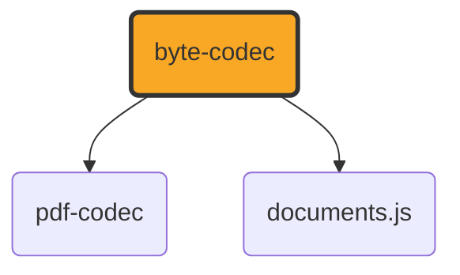

# byte-codec

[](https://github.com/ExaDev/documents.js/tree/main/packages/byte-codec) [](https://www.npmjs.com/package/byte-codec) [](https://www.npmjs.com/package/byte-codec) [](https://github.com/ExaDev/documents.js/actions)

> Generic byte-level primitives (ByteWriter, ByteReader, CRC-32, deflate/inflate, base64) and PNG/JPEG image encoding/decoding with zero PDF knowledge — the shared utility package for the [documents.js family](../../README.md).

Extracted from [pdf-codec](../pdf-codec/README.md), where these utilities lived as a directory-isolated subgraph under `src/bytes/` + `src/image/` with no PDF imports. Both pdf-codec and documents.js consume them from this neutral home rather than one fetching byte utilities from a backend.

byte-codec has no internal dependencies in the documents.js family — its only external dependency is [`fflate`](https://github.com/101arrowz/fflate) for raw DEFLATE/zlib compression. Both [pdf-codec](../pdf-codec/README.md) and [documents.js](https://github.com/ExaDev/documents.js) depend on it:



## Getting started

Requires Node.js `>=20` and pnpm `11.6.0`.

```sh
pnpm install
pnpm build          # tsdown -> dist/ (ESM + CJS + .d.ts)
pnpm typecheck      # tsc -p tsconfig.json && tsc -p tsconfig.node.json (dual tsconfig)
pnpm lint           # eslint . --fix --cache --max-warnings 0
pnpm test           # vitest run
pnpm test:watch     # vitest
pnpm test:workers   # vitest run --config vitest.workers.config.ts, inside a real Cloudflare Workers (workerd) isolate
```

To run a single test file, pass its path to vitest directly, e.g. `pnpm exec vitest run src/bytes/crc32.test.ts`.

## What it provides

| Module             | Exports                                                                                                                                                                                                                                                                                                                                                                                                                                                                                                                                                                                                                                                                                                                                                                                                                                                                                                                                         |
| ------------------ | ----------------------------------------------------------------------------------------------------------------------------------------------------------------------------------------------------------------------------------------------------------------------------------------------------------------------------------------------------------------------------------------------------------------------------------------------------------------------------------------------------------------------------------------------------------------------------------------------------------------------------------------------------------------------------------------------------------------------------------------------------------------------------------------------------------------------------------------------------------------------------------------------------------------------------------------------- |
| `bytes/writer`     | `ByteWriter` (chunked growable byte-output builder), `concatBytes`                                                                                                                                                                                                                                                                                                                                                                                                                                                                                                                                                                                                                                                                                                                                                                                                                                                                              |
| `bytes/reader`     | `ByteReader` (sequential big/little-endian byte reader), `isAsciiWhitespace`                                                                                                                                                                                                                                                                                                                                                                                                                                                                                                                                                                                                                                                                                                                                                                                                                                                                    |
| `bytes/base64`     | `bytesToBase64`, `base64ToBytes` (standard-alphabet base64, RFC 4648 section 4, with padding — the one implementation every package in the family shares for image payloads and `data:` URIs), `BASE64_ENCODE_CHUNK_CHARS`                                                                                                                                                                                                                                                                                                                                                                                                                                                                                                                                                                                                                                                                                                                      |
| `bytes/crc32`      | `crc32` (IEEE 802.3 / ZIP / PNG polynomial table-driven CRC-32)                                                                                                                                                                                                                                                                                                                                                                                                                                                                                                                                                                                                                                                                                                                                                                                                                                                                                 |
| `bytes/flate`      | `deflate`, `inflate`, `inflateTolerant` (fflate-backed DEFLATE compression/decompression with a safety cap)                                                                                                                                                                                                                                                                                                                                                                                                                                                                                                                                                                                                                                                                                                                                                                                                                                     |
| `image/png-encode` | `encodePng` (raw RGB/RGBA pixels → PNG bytes; a truecolour source image whose pixels reduce to 256 or fewer distinct colours is encoded both as indexed colour, PNG colour type 3 with a PLTE and, where needed, a tRNS chunk, and as plain truecolour, and whichever comes out smaller is returned — indexed colour wins for the large flat-colour images typical of diagrams and screenshots, but the PLTE/tRNS chunk overhead can make it larger for small images, so the encoder measures rather than assumes, at the cost of a full second encode for every eligible image; throws if either `width` or `height` is not a positive integer no greater than the PNG spec's own IHDR limit, or if their product exceeds a practical per-call pixel-count ceiling, since PNG's IHDR chunk has no valid encoding for zero, negative, fractional, or non-finite dimensions and this bounds an otherwise-unbounded encode to a fixed worst case) |
| `image/png-decode` | `decodePng` (PNG bytes → raw pixels, handling every PNG colour type including indexed/palette via its own PLTE/tRNS lookup), `RawImage`                                                                                                                                                                                                                                                                                                                                                                                                                                                                                                                                                                                                                                                                                                                                                                                                         |
| `image/png-filter` | `filterScanlines`, `unfilterScanlines` (the five PNG scanline filters)                                                                                                                                                                                                                                                                                                                                                                                                                                                                                                                                                                                                                                                                                                                                                                                                                                                                          |
| `image/jpeg-info`  | `readJpegInfo` (JPEG header reader: dimensions, components, progressive flag — no sample decoding)                                                                                                                                                                                                                                                                                                                                                                                                                                                                                                                                                                                                                                                                                                                                                                                                                                              |
| `text/decode`      | `decodeText`, `tryDecodeText`, `detectByteOrderMark`, `isProbablyText`, `UndecodableTextError`, `TEXT_DECODE_CHUNK_CODE_UNITS` (bytes → text with the character encoding worked out from the bytes; see [Text decoding](#text-decoding) below)                                                                                                                                                                                                                                                                                                                                                                                                                                                                                                                                                                                                                                                                                                  |

## Text decoding

`decodeText` turns bytes into text without being told which character encoding they hold. It exists because the plain-text formats in this family used to assume UTF-8 and refuse everything else, which turns away Excel's own "CSV (Comma delimited)" export (the Windows ANSI code page) and anything Notepad saved as "Unicode" or PowerShell 5.1 wrote with a redirection operator (UTF-16 with a byte order mark).

The encoding is settled in a fixed order, and the result says which step settled it:

| Step | `source`   | `confidence`                     | What decides it                                                               |
| ---- | ---------- | -------------------------------- | ----------------------------------------------------------------------------- |
| 1    | `declared` | `certain`                        | The caller's own `encoding` option, which skips detection entirely            |
| 2    | `bom`      | `certain`                        | A byte order mark: UTF-8, UTF-16LE/BE, UTF-32LE/BE                            |
| 3    | `detected` | `low`                            | The NUL interleave a mark-less UTF-16 file holding Latin-script text produces |
| 4    | `utf8`     | `certain` for ASCII, else `high` | The bytes satisfy UTF-8's own validity rules                                  |
| 5    | `detected` | `low`                            | windows-1252, behind a check that the bytes read as Western text              |

Anything guessed (`confidence: "low"`) also carries a `warnings` entry naming what was guessed and on what evidence, so a guess can be shown as a guess rather than presented as fact. windows-1252 has a character for all but five of its byte values, so trying it and seeing whether it fails proves nothing: the plausibility check, and reporting the result as a guess, are what stand in for a test that cannot exist.

Bytes that are not text at all are refused with an `UndecodableTextError` before any guess is made, since without that gate windows-1252 would read a PNG as a page of mojibake instead of refusing it. `isProbablyText` is that judgement on its own, for a caller whose real question is whether bytes are text: a NUL byte, or more than one C0 control byte other than tab, line feed, form feed and carriage return per 64 bytes, says binary.

`detectByteOrderMark` is step 2 above on its own, for a caller that has to settle the encoding before it can safely read anything past the mark — an XML document's own encoding declaration is the case that occurs: the declaration lives inside the document, in whichever encoding the document turns out to be, so a mark has to be ruled out, or read, before that declaration can even be located. It returns the same encoding and mark length `decodeText` itself would settle on from a mark, or `undefined` when the bytes carry none of the five it recognises.

Everything except UTF-8 is decoded by this package rather than through `TextDecoder`. `TextDecoder`'s legacy single-byte and UTF-16 support comes from the host's ICU build, which a Node binary compiled with small-icu does not carry, and the [Encoding Standard](https://encoding.spec.whatwg.org/#names-and-labels) has no UTF-32 at all, so delegating would make the same bytes decode differently, or not at all, depending on where the code runs. The `pnpm test:workers` suite decodes windows-1252, UTF-16 and UTF-32 inside a real `workerd` isolate for exactly that reason, and one unit test checks the whole windows-1252 table, all 256 bytes, against the platform's own decoder wherever the platform has one.

Three limits are worth knowing rather than discovering:

- UTF-16 holding CJK text has no NUL interleave to see, so without a byte order mark it is not detected. Pass `encoding` for it.
- A legacy CJK or Cyrillic code page is refused rather than guessed at, since nothing distinguishes those from one another without a statistical model this package deliberately does not carry.
- A truncated UTF-8 sequence is genuinely indistinguishable from windows-1252 text containing the same characters, so it decodes as the latter, with a `low` confidence and a warning.

## Conventions

- Worker-isomorphic (see the [family-wide convention](../../README.md#conventions)): runtime `src/` must not import `node:*`, a bare Node builtin, or use the `Buffer` global — enforced by a `no-restricted-imports`/`no-restricted-globals` ESLint rule and exercised in CI by running the test suite inside an actual `workerd` isolate (`pnpm test:workers`). Test files under `src/**/*.test.ts` are exempt and may use Node APIs for fixtures.
- Only `src/index.ts` may be named `index.*` — a custom ESLint rule (`local/no-non-barrel-index`) rejects any other module using an `index` basename, since that would be a hidden entry point the `exports` map in `package.json` doesn't advertise.
- Releases are fully automated: a push to `main` runs `semantic-release` in CI, which determines the version from Conventional Commit messages and publishes to npm via OIDC trusted publishing (no local `NPM_TOKEN` needed). There is no manual publish step. This does not extend to the [npm alias](#npm-alias) below — see that section.

## Install

```sh
pnpm add byte-codec
# or
npm install byte-codec
```

## npm alias

This package also published under an alternate name from the pre-monorepo pipeline:

- [document-bytes](https://www.npmjs.com/package/document-bytes)

**Republished automatically** — the alias's trusted publisher is registered against this repository and workflow (2026-09-10), so every release from the [backfill run](https://github.com/ExaDev/documents.js/actions/runs/34449796133) onward publishes under this name too; the registration evidence is on [ExaDev/documents.js#727](https://github.com/ExaDev/documents.js/issues/727).

## License

MIT
