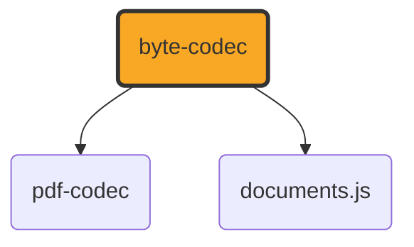

# byte-codec

[](https://github.com/ExaDev/byte-codec) [](https://www.npmjs.com/package/byte-codec) [](https://github.com/ExaDev/byte-codec/releases/latest) [](https://github.com/ExaDev/byte-codec/actions)

> Generic byte-level primitives (ByteWriter, ByteReader, CRC-32, deflate/inflate) and PNG/JPEG image encoding/decoding with zero PDF knowledge — the shared utility package for the [documents.js family](../README.md).

Extracted from [pdf-codec](https://github.com/ExaDev/pdf-codec), where these utilities lived as a directory-isolated subgraph under `src/bytes/` + `src/image/` with no PDF imports. Both pdf-codec and documents.js consume them from this neutral home rather than one fetching byte utilities from a backend.

byte-codec has no internal dependencies in the documents.js family — its only external dependency is [`fflate`](https://github.com/101arrowz/fflate) for raw DEFLATE/zlib compression. Both [pdf-codec](https://github.com/ExaDev/pdf-codec) and [documents.js](https://github.com/ExaDev/documents.js) depend on it:



## Getting started

Requires Node.js `>=20` and pnpm `11.6.0`.

```sh
pnpm install
pnpm build          # tsdown -> dist/ (ESM + CJS + .d.ts)
pnpm typecheck      # tsc -p tsconfig.json && tsc -p tsconfig.node.json (dual tsconfig)
pnpm lint           # eslint . --fix --cache --max-warnings 0
pnpm test           # vitest run
pnpm test:watch     # vitest
pnpm test:workers   # vitest run --config vitest.workers.config.ts, inside a real Cloudflare Workers (workerd) isolate
```

To run a single test file, pass its path to vitest directly, e.g. `pnpm exec vitest run src/bytes/crc32.test.ts`.

## What it provides

| Module | Exports |
|---|---|
| `bytes/writer` | `ByteWriter` (chunked growable byte-output builder), `concatBytes` |
| `bytes/reader` | `ByteReader` (sequential big/little-endian byte reader), `isAsciiWhitespace` |
| `bytes/crc32` | `crc32` (IEEE 802.3 / ZIP / PNG polynomial table-driven CRC-32) |
| `bytes/flate` | `deflate`, `inflate`, `inflateTolerant` (fflate-backed DEFLATE compression/decompression with a safety cap) |
| `image/png-encode` | `encodePng` (raw RGB/RGBA pixels → PNG bytes) |
| `image/png-decode` | `decodePng` (PNG bytes → raw pixels), `RawImage` |
| `image/png-filter` | `filterScanlines`, `unfilterScanlines` (the five PNG scanline filters) |
| `image/jpeg-info` | `readJpegInfo` (JPEG header reader: dimensions, components, progressive flag — no sample decoding) |

## Conventions

- Worker-isomorphic (see the [family-wide convention](../README.md#conventions)): runtime `src/` must not import `node:*`, a bare Node builtin, or use the `Buffer` global — enforced by a `no-restricted-imports`/`no-restricted-globals` ESLint rule and exercised in CI by running the test suite inside an actual `workerd` isolate (`pnpm test:workers`). Test files under `src/**/*.test.ts` are exempt and may use Node APIs for fixtures.
- Only `src/index.ts` may be named `index.*` — a custom ESLint rule (`local/no-non-barrel-index`) rejects any other module using an `index` basename, since that would be a hidden entry point the `exports` map in `package.json` doesn't advertise.
- Releases are fully automated: a push to `main` runs `semantic-release` in CI, which determines the version from Conventional Commit messages, publishes to npm via OIDC trusted publishing (no local `NPM_TOKEN` needed), and re-publishes the identical build under the [npm aliases](#npm-aliases) below. There is no manual publish step.

## Install

```sh
pnpm add byte-codec
# or
npm install byte-codec
```

## npm aliases

This package also publishes under the following alternate npm name — the identical build, same version, republished by CI alongside the primary `byte-codec` package:

- [document-bytes](https://www.npmjs.com/package/document-bytes)

## License

MIT
