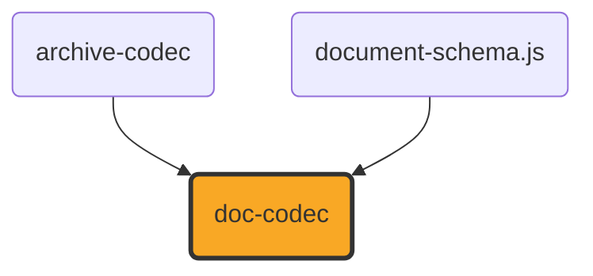

# doc-codec

[](https://github.com/ExaDev/documents.js/tree/main/packages/doc-codec) [](https://www.npmjs.com/package/doc-codec) [](https://www.npmjs.com/package/doc-codec) [](https://github.com/ExaDev/documents.js/actions)

> A hand-written, dependency-minimal reader and writer for the Word Binary File Format (`.doc`, [MS-DOC]) against the shared [`document-schema.js`](../document-schema.js/README.md) content pivot.

`.doc` is the pre-2007 Word format: a binary document living inside an [MS-CFB] compound file, with none of the XML that makes `.docx` tractable. Its text is not stored contiguously, its formatting is stored as sparse exceptions on 512-byte pages, and every structure in it is addressed by a character position that only becomes a byte offset by passing through a piece table. `doc-codec` reads that structure by hand from the published specification, exactly as `ooxml.js` reads `.docx` and `odf.js` reads `.odt`, and produces the same `ContentDocument` all three target.

## Status

**Under active development. This package both reads and writes, over a smaller surface on the write side than the read side covers.**

Built and shipped, on the read side:

- **The compound-file container and the FIB** — `readDocStreams` resolves the `WordDocument` stream and whichever of `1Table`/`0Table` `FibBase.fWhichTblStm` selects, then parses the File Information Block for the counts and offsets every later step needs.
- **The piece table** — `parseClx` resolves a `Clx` (skipping any leading `Prc` array) into the pieces the logical text stream is assembled from, including the compressed 8-bit spelling and its halved byte offset.
- **Text reconstruction** — `readTextRange` turns a range of character positions into real characters through [MS-DOC] 2.4.1's own Retrieving Text algorithm, applying the specification's byte-to-code-point mapping for compressed pieces, and returns each character's byte offset alongside it.
- **Character and paragraph formatting** — the `PlcBteChpx`/`PlcBtePapx` bin tables and the `ChpxFkp`/`PapxFkp` pages behind them, the `Sprm`/`Prl` operand-sizing rules, and the subset of the character- and paragraph-property tables listed under [What is converted](#what-is-converted), now including `sprmCRgFtc0`'s font-table lookup (see [The font table](#the-font-table)).
- **The style sheet** — `parseStsh` reads each style's index, name, kind and parent, and `headingLevelFromIstd` applies `sprmPIstd`'s own rule that an `istd` of 1 through 9 states an outline level.
- **Tables** — `table/read.ts`'s `assembleBlocks` folds a contiguous run of table-depth-1 paragraphs into a real `ContentTable`: cell boundaries at each cell-mark (`0x07`) character, a cell holding more than one paragraph where only its last ends in a cell mark, and each row's own trailing mark (`sprmPFTtp`) resolved through `table/tap.ts`'s `applyTableSprms` for its TAP — column boundaries and every physical cell's own horizontal/vertical merge state, from `sprmTDefTable`'s `TDefTableOperand` (and a `sprmTMerge` range or `sprmTVertMerge` per-cell flag where a real producer states a merge that way instead — see [Tables](#tables) below for why both are read). A table nested inside a table cell (table depth greater than 1, detected via `sprmPItap`/`sprmPFInnerTableCell`/`sprmPFInnerTtp`) is refused with `DocUnsupportedError` rather than mis-read; a row whose own TAP this reader cannot resolve at all — no direct `sprmTDefTable` anywhere in its grpprl, or a cell-mark count that disagrees with it — degrades the whole run back to flat paragraphs instead, since that is a legal producer choice this reader does not yet follow rather than corruption (see [Tables](#tables)).
- **`readDocContent`** — the whole chain, producing a `'wordprocessing'` `ContentDocument` of paragraphs, runs and tables.
- **`isDocBytes`** — distinguishes a `.doc` from the `.xls`, `.ppt` and OLE embeddings that share its container, by looking for a `WordDocument` stream carrying `FibBase.wIdent`.
- **Document metadata** — `title`/`subject`/`author`/`keywords`/`createdIso`/`modifiedIso` read from a `"\x05SummaryInformation"` stream when one is present (see [Metadata](#metadata)); `comments` and `lastPrintedIso` remain unread, since `LayoutMetadata` has no field for either.

Built and shipped, on the write side — see [Writing](#writing) for the full scope statement:

- **`writeDocContent`** — a `'wordprocessing'` `ContentDocument` (one section, paragraphs of runs and tables) to genuine [MS-DOC] bytes: a real piece table, real `ChpxFkp`/`PapxFkp` pages (splitting across as many as a document's own formatting needs, not just the common one-page case), a spec-conformant empty style sheet, a font table when a run names one, and a `"\x05SummaryInformation"` stream when the input's metadata carries anything that stream can hold (see [Metadata](#metadata)) — wrapped in a real [MS-CFB] compound file via `archive-codec`'s `writeCompoundFile`. A `ContentTable` block is expanded by `table/write.ts`'s `flattenSectionBlocks` into the same flat paragraph sequence every other block already is (see [Tables](#tables)), so table paragraphs flow through the identical `ChpxFkp`/`PapxFkp` paging as every other paragraph rather than a separate table-only path.
- Every property `writeDocContent` writes is verified by reading it back through this package's own `readDocContent` (`src/write.test.ts`), and additionally against a real, independent [MS-DOC] implementation: LibreOffice opened, rendered, and re-exported a `writeDocContent` sample without error or content loss, including bold/italic/underline/strike/size/colour/font-family runs, paragraph alignment and indentation, non-Latin-1 and non-BMP text (accented Latin, CJK, an emoji surrogate pair), and a table — recognised as a genuine `table:table`, its row/column/cell structure and both horizontal and vertical merges intact, matching real `table:number-columns-spanned`/`table:number-rows-spanned` attributes and `table:covered-table-cell` elements, exactly as [Tables](#tables) confirms in full.

**Not built, and not approximated, on either side.** Each of these is a genuine layer of [MS-DOC] that this package does not implement; none is silently faked, and a document using one reads (or fails to write) as though it did not:

| Absent                                                          | Consequence                                                                                                                                                                                                                                                                                                                                                                                                                                                                                                                                                                                                                                                                                                                                                                                                                                                                                                           |
| --------------------------------------------------------------- | --------------------------------------------------------------------------------------------------------------------------------------------------------------------------------------------------------------------------------------------------------------------------------------------------------------------------------------------------------------------------------------------------------------------------------------------------------------------------------------------------------------------------------------------------------------------------------------------------------------------------------------------------------------------------------------------------------------------------------------------------------------------------------------------------------------------------------------------------------------------------------------------------------------------- |
| **Nested tables**                                               | A table inside a table cell (table depth greater than 1) is a genuinely different [MS-DOC] structure — `sprmPFInnerTableCell`/`sprmPFInnerTtp` mark its cell/row ends rather than `sprmPFInTable`/`sprmPFTtp`, and `sprmPItap`/`sprmPDtap` state the depth. Neither side of this package descends into one: `readDocContent` refuses with `DocUnsupportedError` the moment it detects a table depth greater than 1, and `writeDocContent` refuses a `ContentTable` block found inside a table cell's own blocks the same way. See [Tables](#tables) for the full scope of what a depth-1 table does resolve.                                                                                                                                                                                                                                                                                                          |
| **Table cell shading and borders**                              | `ContentTableCell.background`/`.borders` are neither read from nor written to TC80's own `brcTop`/`brcLeft`/`brcBottom`/`brcRight`/shading fields — every border this writer emits is the `Brc80MayBeNil` "no border" sentinel. A real cell's shading/border TAP state is silently absent rather than approximated. See [Tables](#tables).                                                                                                                                                                                                                                                                                                                                                                                                                                                                                                                                                                            |
| **Images and drawn objects**                                    | The anchor characters (`U+0001`, `U+0008`) are dropped rather than emitted as control characters. No picture data is read. `writeDocContent` refuses an image block.                                                                                                                                                                                                                                                                                                                                                                                                                                                                                                                                                                                                                                                                                                                                                  |
| **Style-inherited formatting**                                  | A style's own property sets live in the `STD`'s `grLPUpxSw` and are not read, so a paragraph's formatting is the document defaults plus its own direct exceptions. A `Heading 1` paragraph reports its `styleId` and `headingLevel` but not the boldness or size its style would supply. `writeDocContent` writes no paragraph styles at all (every paragraph is `istd` 0) and does not round-trip `styleId`/`headingLevel`.                                                                                                                                                                                                                                                                                                                                                                                                                                                                                          |
| **Subdocuments**                                                | Only the main document (character positions 0 to `ccpText`) is converted. Footnotes, endnotes, headers, footers, comments and text boxes are not, in either direction.                                                                                                                                                                                                                                                                                                                                                                                                                                                                                                                                                                                                                                                                                                                                                |
| **Section properties**                                          | Section boundaries are not read, so the whole document is one section, and its page size and margins are a US Letter placeholder rather than the document's own. `writeDocContent` refuses a `ContentDocument` with more than one section, rather than silently merging their content into what would read back as one.                                                                                                                                                                                                                                                                                                                                                                                                                                                                                                                                                                                               |
| **Numbering definitions**                                       | `sprmPIlfo`/`sprmPIlvl` are read into a `list` membership, but the `PlfLfo`/`PlfLst` tables that say what the list looks like are not, so no marker text or numbering format is available. `writeDocContent` does not write `PlfLfo`/`PlfLst` or `sprmPIlfo`/`sprmPIlvl`, so `ContentParagraph.list` is not round-tripped.                                                                                                                                                                                                                                                                                                                                                                                                                                                                                                                                                                                            |
| **Extended and user-defined document properties**               | `title`/`subject`/`author`/`keywords`/`createdIso`/`modifiedIso` are read from and written to a `"\x05SummaryInformation"` stream when present (see [Metadata](#metadata)); the sibling `"\x05DocumentSummaryInformation"` stream (company, manager, and custom user-defined properties) is not read or written at all.                                                                                                                                                                                                                                                                                                                                                                                                                                                                                                                                                                                               |
| **Encryption**                                                  | An encrypted or XOR-obfuscated document is refused with a `DocUnsupportedError` rather than read as plaintext. `writeDocContent` never encrypts.                                                                                                                                                                                                                                                                                                                                                                                                                                                                                                                                                                                                                                                                                                                                                                      |
| **`sprmPHugePapx` / `sprmPTableProps`**                         | Paragraph properties stored indirectly in the Data stream are not followed, so such a paragraph reads with fewer properties than it states. [MS-DOC] 2.4.3's own Overview of Tables text names `sprmPTableProps` as a real, legal alternative to `sprmTDefTable` some applications process — but a real producer's row mark is not shown to prefer it: a genuine LibreOffice-authored `.doc` table's own row mark states its TAP through the identical direct `sprmTDefTable` this package's reader and writer already use (confirmed by parsing a LibreOffice 26.2.5.2-authored table's raw `PapxFkp` bytes; see [ExaDev/documents.js#892](https://github.com/ExaDev/documents.js/issues/892)), matching 2.4.3's own compatibility guidance ("An application SHOULD use sprmTDefTable to define table cells for applications that do not process sprmPTableProps"). `writeDocContent` never writes an indirect Papx. |
| **Hyperlinks and fields**                                       | `ContentRun.hyperlink`, footnote/comment/annotation references, and every other field or anchor character are read as plain text or dropped (see [What is converted](#what-is-converted)) and are not written.                                                                                                                                                                                                                                                                                                                                                                                                                                                                                                                                                                                                                                                                                                        |
| **Right-margin paragraph indent**                               | `pap.ts`'s reader folds `sprmPDxaRight` into an internal `indentRightPt`, but `ContentParagraphSchema` (`document-schema.js`) carries no field for it, so no reader output and no writer input can ever carry it.                                                                                                                                                                                                                                                                                                                                                                                                                                                                                                                                                                                                                                                                                                     |
| **Every FIB field beyond what this package's own reader needs** | `writeDocContent` populates only the fc/lcb pairs its own reader consults (the style sheet, the two property bin tables, the Clx, the font table). Roughly 140 other `FibRgFcLcb97` pairs — `SttbfAssoc`, `Dop`, the printer-driver structures among them — are left zero, which is the format's own "undefined, MUST be ignored" contract for most of them, but not a certification that every third-party [MS-DOC] reader accepts the result; see `fib/write.ts`'s own note.                                                                                                                                                                                                                                                                                                                                                                                                                                        |

One construct is refused rather than mis-read: a `sprmPChgTabs` whose `cb` is the `255` sentinel encodes its own length as a formula over tab-stop counts this package does not parse, and its length is needed to find the next `Prl`. Rather than guess and silently mis-read every property after it, `operandSize` throws.

## What is converted

Character properties, from `Chpx` grpprls:

| Sprm                                                                    | Becomes                                                                                                   |
| ----------------------------------------------------------------------- | --------------------------------------------------------------------------------------------------------- |
| `sprmCFBold` (0x0835), `sprmCFItalic` (0x0836), `sprmCFStrike` (0x0837) | `bold` / `italic` / `strike`, honouring `ToggleOperand`'s inherit (0x80) and invert (0x81) values         |
| `sprmCKul` (0x2A3E)                                                     | `underline` (any non-zero `Kul` style)                                                                    |
| `sprmCHps` (0x4A43)                                                     | `sizePt`, the operand being half-points                                                                   |
| `sprmCIco` (0x2A42)                                                     | `color`, through [MS-DOC] 2.9.126's fixed palette                                                         |
| `sprmCCv` (0x6870)                                                      | `color`, from a `COLORREF`                                                                                |
| `sprmCIstd` (0x4A30)                                                    | the character style index, carried for a caller to resolve                                                |
| `sprmCRgFtc0` (0x4A4F)                                                  | `fontFamily`, looked up by index in the document's own font table (see [The font table](#the-font-table)) |

Paragraph properties, from `PapxInFkp` grpprls:

| Sprm                                                  | Becomes                                                                 |
| ----------------------------------------------------- | ----------------------------------------------------------------------- |
| `sprmPIstd` (0x4600)                                  | `styleId` (the style's name) and `headingLevel` (via the istd 1-9 rule) |
| `sprmPJc` (0x2461), `sprmPJc80` (0x2403)              | `alignment`                                                             |
| `sprmPDxaLeft` (0x845E) / `sprmPDxaLeft80` (0x840F)   | `indentLeftPt`                                                          |
| `sprmPDxaLeft1` (0x8460) / `sprmPDxaLeft180` (0x8411) | `indentFirstLinePt`                                                     |
| `sprmPDyaBefore` (0xA413), `sprmPDyaAfter` (0xA414)   | `spacingBeforePt` / `spacingAfterPt`                                    |
| `sprmPDyaLine` (0x6412)                               | `lineSpacing`, only for `LSPD`'s multiplier form                        |
| `sprmPFPageBreakBefore` (0x2407)                      | `pageBreakBefore`                                                       |
| `sprmPOutLvl` (0x2640)                                | `headingLevel`, where the istd did not already supply one               |
| `sprmPIlfo` (0x460B), `sprmPIlvl` (0x260A)            | `list` membership                                                       |

Fields are handled structurally: everything between a field-begin (`U+0013`) and a field-separator (`U+0014`) is the field's instruction and is dropped; the result between the separator and the field-end (`U+0015`) is kept. A line break (`U+000B`) inside a paragraph survives as a newline.

### The font table

`sprmCRgFtc0` names a font by an index into `SttbfFfn` ([MS-DOC] 2.9.253), a string table whose entries are `FFN` records ([MS-DOC] 2.9.87) — a fixed head of font-substitution metadata (family, weight, character set, a Panose and a `FontSignature`) this package neither reads nor writes meaningfully, followed by the font's own name as a null-terminated UTF-16 string. `src/style/fonts.ts` reads and writes this table: `parseFontTable` resolves the name at each index for `sprmCRgFtc0` to look up, and `buildFontTable` (used only by the writer) emits one entry per distinct font name a document's runs use, with every metadata field beyond the name itself zeroed — this package writes a font NAME for `ContentRun.fontFamily` to round-trip, not a font-substitution profile. Only `sprmCRgFtc0` (the default, non-East-Asian, non-complex-script font) is read or written; `sprmCRgFtc1`/`sprmCRgFtc2`/`sprmCFtcBi` are not.

## Tables

A table in [MS-DOC] is not a separate container: it is a run of ordinary paragraphs marked `sprmPFInTable`, with cell boundaries at literal `0x07` cell-mark characters in the text stream and each row closed by its own row-ending mark — a cell mark additionally carrying `sprmPFTtp` — per [MS-DOC] 2.4.3's own Overview of Tables. `src/table/` implements exactly this model, at table depth 1 only; a table nested inside a table cell is refused rather than mis-read (see the "Nested tables" row in the scope table above).

**Reading** (`table/read.ts`'s `assembleBlocks`, called from `read.ts`). It walks the flat paragraph sequence `read.ts` already produces, grouping every contiguous run of `inTable` paragraphs into a `ContentTable`: consecutive paragraphs up to and including the one terminated by an ordinary cell mark become one cell's own `blocks` (a cell may hold more than one paragraph — only its last ends in a cell mark, per 2.4.3's own "the last paragraph in a table cell is terminated by a cell mark"), and the row's own trailing mark resolves the row's whole TAP through `table/tap.ts`'s `applyTableSprms`: column boundaries and every physical cell's own merge state, read directly from `sprmTDefTable`'s `TDefTableOperand` — its `rgdxaCenter` array and its `rgTc80` array of per-column `TC80` records ([MS-DOC] 2.9.339-341) — folded with a `sprmTMerge` range or `sprmTVertMerge` per-cell flag on top where a real producer states a merge incrementally instead, genuinely regardless of which order the two appear in within the grpprl (`table/tap.ts`'s own note). Column layout is never assumed shared across a table's own rows: [MS-DOC] 2.6.4 permits each row to declare its own independent `rgdxaCenter` ("There is no requirement that each row of a table have the same number of cells"), and a real, independent [MS-DOC] implementation (LibreOffice 26.2.5.2) was confirmed to rely on exactly this for a horizontal merge — its own merged row simply has fewer, wider physical cells, with no `TCGRF.horzMerge`/`sprmTMerge` signal at all (see the third-party verification paragraph below). `table/read.ts` reconstructs the table's shared column grid as the union of every row's own `rgdxaCenter` boundary values, then expresses each physical cell's own `colSpan` as however many of that shared grid's segments its own boundaries cover. That union is taken within one point rather than by exact integer equality, because [MS-DOC] states those boundaries per row and defines no quantum coarser than the twip itself for them, so two rows meaning the identical grid may legally disagree by a twip or two — and an exact union turns that drift into a phantom hairline column plus a spurious `colSpan` on the cells of every row either side of it (two rows one twip apart across a 2338-twip boundary read back as `columnWidthsPt` `[116.9, 0.05, 144.95, 220]` instead of `[116.9, 145, 220]`; [ExaDev/documents.js#898](https://github.com/ExaDev/documents.js/issues/898)). The default tolerance is `TWIPS_PER_POINT` itself, not a picked number: `columnWidthsPt` states the reconstructed grid in points, so a segment narrower than one point sits below the smallest unit that grid can distinguish at all. It is also the fuzz a real, independent implementation applies to an analogous reconstruct-one-shared-grid-from-N-per-row-arrays problem — LibreOffice's table model is per-row too (`SwTableLine` → `SwTableBox`, each box carrying its own width), and `sw/source/filter/inc/wrtswtbl.hxx` answers it, on its own ODF export (the point at which it projects that per-row model onto one shared grid, `sw/source/filter/xml/xmltble.cxx`'s `SwXMLTableColumn_Impl`), with `#define COLFUZZY 20` twips, `SwWriteTableCol::operator==` treating two column positions as equal when they differ by at most that. Its changeover was confirmed empirically and exactly, not assumed: patching a single `int16` inside a real LibreOffice-authored table's second row and round-tripping it through that implementation's own `.doc` import followed by its ODF export gives three columns and no covered cell for a drift of 1 through 20 twips, and four columns with a real `table:covered-table-cell` from 21 (the `.doc` import side alone preserves the drifted boundary byte-for-byte — the fuzz is applied on export, not import). Per-row drift is not hypothetical even without Word or LibreOffice's own export step in the picture: `WW8TabDesc::CalcDefaults` widens any imported cell narrower than that same implementation's own minimum cell width (`MINLAY`, 23 twips in `sw/inc/swtypes.hxx`) by mutating boundaries per row during `.doc` import itself, so a document that has been through that import is one real mechanism by which per-row drift reaches a `.doc` at all.

The one-point default is not applied unconditionally, because `MINLAY`'s own guarantee is LibreOffice's alone: this package's own writer widens nothing, so nothing stops a real producer's `rgdxaCenter` from stating a column genuinely narrower than a point, and folding that column's own two boundaries together as "drift" would silently delete it rather than fix a phantom one. The tolerance is therefore clamped, per table, to one twip below the narrowest strictly-positive gap any single row states between two of its _own_ adjacent boundaries (a zero-width gap is a legal adjacent-duplicate boundary, not a column, and is excluded) — two boundaries a row itself distinguishes are never folded together, however close, and the clamp can only ever be as generous as the tightest real column that table actually declares. Beyond that, [MS-DOC]'s own physical-cell model keeps every horizontally- and vertically-merged-away cell present in the text stream with its own cell mark and its own `TC80` entry — never omitted the way OOXML's `w:gridSpan` model omits a horizontally-merged-away `<w:tc>` outright — so a horizontal-continuation cell stated the legacy way (`TCGRF.horzMerge` = 1, still honoured for a genuine third-party producer that uses it) is folded into the preceding real cell's own `colSpan` exactly as before, while a genuinely narrower, wider physical cell (no flag, LibreOffice's own encoding) resolves to a `colSpan` greater than 1 directly from its own boundaries — both mechanisms produce the identical shape downstream. A vertical-continuation cell (`TCGRF.vertMerge` = `fvmMerge`) is kept as its own `{blocks: []}` entry — carrying its own `colSpan` too when it is also part of a horizontal-merge group in that row — with `rowSpan` computed on the anchor by scanning subsequent rows for a cell starting at the same position on the table's own shared grid, never a raw physical-array index, since two rows may genuinely have different physical cell counts and still need their vertical merges to line up correctly. Both conventions mirror `ooxml.js`'s own docx table reader exactly, since `colSpan`/`rowSpan`/`{blocks: []}` are precisely the shape `document-schema.js`'s `ContentTableCell` was designed to hold for either format's own cousin of the same merge model. A column boundary that no row in the table ever states on its own — every row happens to merge across it identically — cannot be recovered from the physical bytes at all; this is a genuine limitation of [MS-DOC]'s own physical model, not an approximation this reader chooses to make (see the third-party verification paragraph below for the confirmed reproduction, and `write.test.ts`'s own "narrows columnWidthsPt" test for the honest degraded shape this produces).

A row whose own TAP cannot be resolved this way — no direct `sprmTDefTable` anywhere in its grpprl (a producer may legally state it indirectly instead, through `sprmPTableProps`; see the `sprmPHugePapx`/`sprmPTableProps` scope row above), or a cell-mark count that disagrees with what its `TDefTableOperand` declares — degrades the _whole_ contiguous run of table-depth paragraphs back to flat paragraphs, rather than refusing the whole document: this is a legal, real-world construct this reader does not yet implement, not corruption, and paragraphs that would have become a table simply stay paragraphs instead, the identical class of degrade the `sprmPHugePapx`/`sprmPTableProps` row above already documents for ordinary paragraph formatting. A row ending mid-cell with no terminating mark at all is different in kind — the stream itself is truncated, not merely using an unsupported mechanism — and still throws `DocFormatError`.

**Writing** (`table/write.ts`'s `flattenSectionBlocks`, called from `write.ts`) is the inverse: a `ContentTable` block expands into its own real physical-cell paragraph stream, one physical cell per `ContentTableCell` — real content or a vertical-merge continuation's own `{blocks: []}` — never expanded into extra synthetic cells for a `colSpan` greater than 1. A `{blocks: []}` cell becomes a single empty paragraph, but is only written as a vertical-merge continuation (`TCGRF.vertMerge` = `fvmMerge`) when a vertical merge is genuinely still in progress at that column — tracked across rows by an `active` map keyed by column position, mirroring `ooxml.js`'s own `buildTable` exactly, since a genuinely blank cell has the identical `{blocks: []}` shape and inferring the merge from emptiness alone would silently mis-merge it with whatever real content sits above it; a continuation's own physical column span, likewise, always comes from the anchor's own recorded `colSpan` rather than the continuation cell's own (typically absent) one, so a cell merged both horizontally and vertically at once writes correctly instead of throwing. Every physical cell's own paragraphs carry `sprmPFInTable`; the row's own trailing mark additionally carries `sprmPFTtp` plus a single `sprmTDefTable` stating the row's own column layout and every cell's `TC80.tcgrf` vertical-merge state (`table/tap-write.ts`), and a `sprmTDyaRowHeight` when the row states a `heightPt`. Column widths are derived once from the table's own `columnWidthsPt`, giving every row a shared full grid of boundary points to draw from, but a row containing a horizontal merge writes its own narrower, wider `rgdxaCenter`: a `colSpan`-anchored cell's own physical boundary is the combined width of however many of the full grid's columns it spans, merged into one cell rather than kept as separate flagged ones. This is a deliberate match for how a real, independent [MS-DOC] implementation (LibreOffice 26.2.5.2) was confirmed to encode a horizontal merge — see the third-party verification paragraph below for the full ground-truth finding and [ExaDev/documents.js#895](https://github.com/ExaDev/documents.js/issues/895) for the issue it fixes. No `TCGRF.horzMerge` flag or `sprmTMerge` sprm is written for a horizontal merge at all any more; `TCGRF.horzMerge` is always 0, matching what a real producer's own merged cell states.

The Main Document's own last character MUST be an ordinary paragraph mark ([MS-DOC]'s "Main Document" glossary entry: "The last character in the main document MUST be a paragraph mark (Unicode 0x000D)") — never the row-ending mark's own cell-mark character (0x0007), even though a row mark is a perfectly legal paragraph-boundary terminator everywhere else. `write.ts`'s own top-level `writeDocContent` — not this module — is what guarantees this: whenever `flattenSectionBlocks`' own output ends in anything other than an ordinary paragraph mark (an empty section, or, the case that matters here, a section whose very last block is a table), it appends one trailing empty paragraph so the table's own row mark is never the document's final character. This is the confirmed root cause of, and fix for, [ExaDev/documents.js#892](https://github.com/ExaDev/documents.js/issues/892) — see the third-party verification paragraph immediately below for the full finding.

**Third-party verification: passing for a plain table, a vertical merge, a horizontal merge, and a cell merged both ways at once.** [ExaDev/documents.js#892](https://github.com/ExaDev/documents.js/issues/892) tracked a genuine regression an earlier draft of this README had falsely certified as passing: LibreOffice's own `.doc` import filter recognised no table at all in a `writeDocContent` sample, in any configuration — every cell's text came back concatenated into one flat paragraph, with no `table:table` element anywhere in the converted output. The root cause was found by comparing this writer's own bytes against a genuine LibreOffice-authored `.doc`, byte for byte, rather than guessing: a LibreOffice 26.2.5.2-built `.odt` table converted to `.doc` (`soffice --headless --convert-to doc`) and its `WordDocument` stream parsed directly through this package's own `PapxFkp`/grpprl primitives shows LibreOffice's own row mark stating its TAP through the identical direct `sprmTDefTable` this writer already used — ruling out the indirect-Papx hypothesis #892 had raised (see the `sprmPHugePapx`/`sprmPTableProps` scope row above). The actual difference was the document's own last character: LibreOffice's file ends in a genuine paragraph mark (0x000D) after the table's own row-ending cell mark, while this writer's output ended the whole text stream _at_ the row mark itself (0x0007) — violating [MS-DOC]'s own "Main Document" glossary entry ("The last character in the main document MUST be a paragraph mark") outright. Restoring that trailing paragraph mark (see the note above) with no other change fixed table recognition completely; reverting it (verified by hand) reproduces the original failure exactly.

The horizontal-merge gap #892 left open ([ExaDev/documents.js#895](https://github.com/ExaDev/documents.js/issues/895)) was root-caused the same way: round-tripping a LibreOffice-authored horizontal merge through its own `.doc` writer and parsing the result's raw TAP bytes with this package's own primitives shows LibreOffice does not use `TC80.tcgrf.horzMerge` _or_ `sprmTMerge` for a horizontal merge at all — the merged row's own `TDefTableOperand` genuinely has fewer, wider physical cells (`rgdxaCenter = [0, 6425, 9638]`, 2 physical cells, both `TCGRF.horzMerge = 0`) than an unmerged row in the same table (`rgdxaCenter = [0, 3212, 6425, 9638]`, 3 cells), a real per-row column layout [MS-DOC] 2.6.4 permits ("There is no requirement that each row of a table have the same number of cells"). This writer now matches that encoding (see [Writing](#writing) above) and the reader reconstructs `colSpan` from it (see the Reading paragraph above). Verified against LibreOffice 26.2.5.2 (`soffice --headless --convert-to fodt`, checking for real `table:table`/`table:table-row`/`table:table-cell` elements) for four cases: a plain 2x2 unmerged table (**passes** — genuine `table:table` structure, correct cell text and column count); a vertically merged cell (**passes** — `table:number-rows-spanned="2"` on the anchor cell and a real `table:covered-table-cell` on the row below); a horizontally merged cell (**passes** — `table:number-columns-spanned="2"` on the anchor cell and a real `table:covered-table-cell` beside it, with the table's other, unmerged row confirming 3 real columns); and a cell merged both horizontally and vertically at once (**passes** — `table:number-rows-spanned="2" table:number-columns-spanned="2"` together on the anchor, with two `table:covered-table-cell` elements on the row below it). No case regressed against the other: the same writer output that produces the merges above still passes the plain-table and vertical-merge checks unchanged.

**What is not resolved.** Cell shading and borders (`ContentTableCell.background`/`.borders`) are neither read from nor written to `TC80`'s own `brcTop`/`brcLeft`/`brcBottom`/`brcRight`/shading fields — every border this writer emits is `Brc80MayBeNil`'s "no border" sentinel (all bits set). `sprmTMerge` and `sprmTVertMerge` are both still read (folded onto `sprmTDefTable`'s own layout, for a genuine third-party producer that states a merge that way) but neither is written any more — this writer states a horizontal merge purely through a merged row's own narrower, wider physical cells (see [Writing](#writing) above), and a vertical merge only through `TC80.tcgrf`. Every table-level TAP sprm beyond `sprmTDefTable`/`sprmTDyaRowHeight`/`sprmTMerge`/`sprmTVertMerge` — absolute position, table style, cell padding, and the rest of [MS-DOC] 2.6.4's roughly seventy table sprms — is unread and unwritten, exactly as the read-side scope note already states for ordinary paragraph sprms this package does not convert. A genuine, if narrow, information-loss case remains inherent to the physical model itself rather than a gap in this package: when literally every row of a table merges across the identical column boundary (a single-row table with one merged cell is the simplest case), no row's own `rgdxaCenter` ever states that boundary, so a round trip cannot recover it — `columnWidthsPt` narrows to however many columns the physical bytes actually distinguish, and the merged cell's own `colSpan` comes back `undefined` rather than the value it was written with (`write.test.ts`'s own "narrows columnWidthsPt" test states this precisely). A table with at least one row that does not merge across the same span — the common case, since a merge is usually a header row sitting above ordinary data rows — round-trips `colSpan` and `columnWidthsPt` exactly.

A table's own horizontal position is not read or written either, and this one is a schema boundary rather than a gap in this package. `rgdxaCenter`'s first entry is "the horizontal position of the logical left edge of the table, as indented from the logical left page margin" ([MS-DOC] 2.9.321), and `sprmTDxaLeft`/`sprmTDxaGapHalf`/`sprmTWidthBefore` state the same fact incrementally — but `document-schema.js`'s `ContentTable` carries only `rows` and `columnWidthsPt`, with no field on the table or on a row that could hold a horizontal offset, so a table indent is dropped on read and every row this writer emits starts at 0. No codec in this family models a table indent, so nothing downstream would have anywhere to put one. This is already live in the simple case: a LibreOffice table with `fo:margin-left="1.27cm"` writes `rgdxaCenter = [720, 2884, 5567, 9638]` in **every** row, and reads back as `columnWidthsPt` `[108.2, 134.15, 203.55]` with the 720-twip indent gone. Because [MS-DOC] states the boundary array per row, two rows of one table may also legally begin at different positions — Word's own default for an unindented table is `-108` rather than 0 (confirmed against LibreOffice's own WW8 importer source, which carries `-108` as a named constant with the comment "Word sets the first nCenter value to -108 when no indent is used"; it is plausibly the format's own 108-twip default cell margin, `sprmTCellPaddingDefault`, compensated for, but neither [MS-DOC] nor that source states the two facts are linked, so take the value as confirmed and the reason as a reasonable guess) — so a table one of whose rows carries a real leading indent has rows at `-108` and `0`. Those rows genuinely occupy different horizontal extents, and the reconstructed grid honestly carries the extra boundary between them, with the wider rows' first cell spanning both segments. That is not the twip-drift case above and is deliberately not absorbed by its tolerance: verified against LibreOffice 26.2.5.2, which reads the identical bytes into the identical grid — four columns, a `table:number-columns-spanned="2"` anchor and a real `table:covered-table-cell` on the rows that start further left. The one cosmetic difference is that LibreOffice pads the short row with an empty filler cell so every row covers the full grid, which this reader does not: `ContentTableRow.cells` carries no grid-position field, so a reader-invented empty cell would be indistinguishable from real empty content on the write side, and `table/write.ts` reconstructs each row's own narrower `rgdxaCenter` from spans without needing one.

One narrow accuracy limit follows from the same missing field. `rgdxaCenter`'s entries need only be "in non-decreasing order", so two adjacent entries may be equal — a legal zero-width physical cell. Such a cell covers no segment of the reconstructed grid, and `ContentTableCell` cannot say "zero columns wide", so it comes back carrying its own content as an ordinary un-spanned cell sharing a grid position with the cell after it. Nothing is lost, but the two are indistinguishable by position, so a vertical merge anchored at that position in a later row matches whichever of them comes first.

## Metadata

A `.doc`'s title, author, and dates do not live in any [MS-DOC] structure at all — they live in a `"\x05SummaryInformation"` stream, a genuinely different format ([MS-OLEPS] Property Set Streams) that happens to sit beside `WordDocument`/`1Table` in the same [MS-CFB] compound file. `readDocContent` reads that stream when present (`archive-codec`'s `readSummaryInformation`, since the property-set format itself is zero document-format knowledge, exactly as the [MS-CFB] container it sits inside is) and maps it onto `document-schema.js`'s `LayoutMetadata` (`archive-codec`'s own `summaryInformationToLayoutMetadata` — the mapping is format-agnostic, so it lives there rather than being copied in this package, alongside `xls-codec`'s and `ppt-codec`'s identical need for it); `writeDocContent` does the inverse (`src/metadata.ts`'s `layoutMetadataToSummaryInformation`, which validates `createdIso`/`modifiedIso` as real dates and throws a `DocFormatError` naming the offending field before delegating to `archive-codec`'s own mapping — see [Writing](#writing)), including a `"\x05SummaryInformation"` stream in its `writeCompoundFile` call only when the input's metadata actually carries something that stream can hold — an input whose metadata is `{}`, or carries only fields the mapping below has no destination for, produces no stream at all, matching what an absent-metadata read already returns.

The mapping is not 1:1, and each gap is permanent rather than a remaining TODO:

| Direction                           | Fields covered                                                                         | Gap                                                                                                                                                                                                                                 |
| ----------------------------------- | -------------------------------------------------------------------------------------- | ----------------------------------------------------------------------------------------------------------------------------------------------------------------------------------------------------------------------------------- |
| SummaryInformation → LayoutMetadata | `title`, `subject`, `author`, `keywords`, `createdIso`, `lastSavedIso` → `modifiedIso` | `comments` and `lastPrintedIso` have no LayoutMetadata field to land in — no other codec in the family has a "last printed" or free-text "comments" concept, so these are read from the stream but never reach a `ContentDocument`. |
| LayoutMetadata → SummaryInformation | the same six fields, in reverse                                                        | `creator`, `producer`, and `language` have no SummaryInformation equivalent: `producer` is a PDF-only concept in this schema, and `creator`/`language` are not among the fields the stream this package writes covers.              |

Only the fixed SummaryInformation property set is read or written — the sibling `"\x05DocumentSummaryInformation"` stream (company, manager, and custom user-defined properties, [MS-OLEPS]'s two-property-set spelling) is not attempted at all, an explicit scope boundary `archive-codec`'s own `oleps` support shares.

## Writing

`writeDocContent` takes a `'wordprocessing'` `ContentDocument` with exactly one section and produces real [MS-DOC] bytes wrapped in a real [MS-CFB] compound file, inverting every read-side structure listed above: a real piece table (`text/piece-table-write.ts`, always one uncompressed 16-bit piece — see [Why always uncompressed](#why-the-writer-always-writes-uncompressed-text)), `Sprm`-encoded grpprls for each run's and paragraph's own direct formatting (`prop/chp-write.ts`, `prop/pap-write.ts`), `ChpxFkp`/`PapxFkp` pages packed and split across as many 512-byte pages as the content needs (`prop/fkp-write.ts`), a spec-conformant style sheet carrying zero styles (`style/stsh.ts`'s `buildEmptyStsh` — `FibRgFcLcb97.lcbStshf` "MUST be a nonzero value", so a document is never written without one, even though this package's own reader tolerates a missing one), and a font table when at least one run names a font (`style/fonts.ts`).

Character properties this writer converts, the exact inverse of [What is converted](#what-is-converted)'s character table above: `bold`, `italic`, `strike`, `underline` (as `kulSingle`, the only style a plain boolean can express), `sizePt`, `color` (via `sprmCCv`'s exact `COLORREF`, never the lossy 17-entry `sprmCIco` palette), and `fontFamily`. Paragraph properties: `alignment` (the four `ST_Jc`-aligned values this package's reader itself maps — `left`/`center`/`right`/`justify`), `indentLeftPt`, `indentFirstLinePt`, `spacingBeforePt`, `spacingAfterPt`, `lineSpacing` (only `LSPD`'s multiplier form, matching the reader), and `pageBreakBefore`.

**Deliberately not handled**, beyond what the read-side scope table above already states applies to both directions:

| Absent                                            | Consequence                                                                                                                                                                                                                                                               |
| ------------------------------------------------- | ------------------------------------------------------------------------------------------------------------------------------------------------------------------------------------------------------------------------------------------------------------------------- |
| **Paragraph styles**                              | Every paragraph is written with `istd` 0 ("Normal"); `ContentParagraph.styleId` and `.headingLevel` are not written, and the style sheet this writer produces carries no styles for a future writer to target.                                                            |
| **More than one section**                         | `writeDocContent` throws `DocUnsupportedError` for a `ContentDocument` with more than one `ContentSection`, rather than silently concatenating their blocks into what this package's own reader would read back as one anyway.                                            |
| **Non-paragraph blocks other than tables**        | An image, page break, embedded object, or construct-boundary marker block throws `DocUnsupportedError` naming its own `kind` — `ContentTable` is now written (see [Tables](#tables)); a non-paragraph block found inside one of its own cells throws the identical error. |
| **An empty `ContentDocument.sections[0].blocks`** | Written as a single paragraph with no runs — [MS-DOC] 2.4.2 requires the Main Document's own text to end in a paragraph mark, so an otherwise-empty section still needs one to hold it, exactly as a real producer's own blank document has one.                          |

### Why the writer always writes uncompressed text

`writeDocContent` writes every piece as 16-bit (uncompressed) text, never the 8-bit compressed spelling the reader also understands. A compressed piece can only represent the bytes [MS-DOC] 2.4.1's own compressed-character table maps ([`COMPRESSED_CHARACTER_MAP`](src/text/characters.ts), effectively Windows-1252's high range with four gaps the specification itself leaves undefined), so writing compressed text would mean rejecting or mis-encoding any run outside that range — every character outside Latin-1 entirely, and four Windows-1252 code points [MS-DOC] does not define a mapping for. Always writing uncompressed sidesteps the whole question: every UTF-16 code unit, including each half of a surrogate pair for a character outside the Basic Multilingual Plane, round-trips through a 16-bit piece with no byte-mapping table to invert, verified in `write.test.ts` against accented Latin, CJK and an emoji surrogate pair together in one run.

## Architecture

This package hand-parses and hand-writes [MS-DOC] against its published field tables. It depends on no third-party `.doc` reader or writer, and its ESLint configuration bans several by name (`word-extractor`, `mammoth`, `textract`, the `cfb` package) so the decision is enforced rather than merely intended — the same bet `markdown-codec` makes against every markdown library and `pdf-codec` against `pdf-lib`.

It depends on exactly two siblings: [`archive-codec`](../archive-codec/README.md) for the [MS-CFB] container — `readCompoundFile` on the read side, `writeCompoundFile` on the write side — and [`document-schema.js`](../document-schema.js/README.md) for the content pivot it reads into and writes from. It does not depend on `ooxml.js`, and `ooxml.js` does not depend on it: `.doc` and `.docx` are unrelated formats that happen to share an application, and the only thing they genuinely have in common is the `ContentDocument` both target.



The modules layer in the order [MS-DOC]'s own algorithms chain:

| Module                                           | What it does                                                                                                                                                                                                                                                                                                 |
| ------------------------------------------------ | ------------------------------------------------------------------------------------------------------------------------------------------------------------------------------------------------------------------------------------------------------------------------------------------------------------ |
| `src/bytes.ts`                                   | Bounds-checked little-endian reads; every offset in the format is attacker-controlled data, so an over-read fails loudly.                                                                                                                                                                                    |
| `src/plc.ts`                                     | The `PLC` container shape, whose element count is derived from its total size by [MS-DOC] 2.2.2's own formula, and the "largest key at most" lookup every algorithm phrases in those words.                                                                                                                  |
| `src/fib/`                                       | The FIB's field offsets, derived by summing the declared field sizes, and the parse that reads the counts and offsets from them.                                                                                                                                                                             |
| `src/text/piece-table.ts`                        | The `Clx` and its `PlcPcd`, and the character-position-to-byte-offset mapping.                                                                                                                                                                                                                               |
| `src/text/characters.ts`                         | Text reconstruction, including the compressed-byte mapping table.                                                                                                                                                                                                                                            |
| `src/text/special.ts`                            | The characters that carry structure rather than glyphs.                                                                                                                                                                                                                                                      |
| `src/prop/sprm.ts`                               | `Sprm` decoding and the operand-size table that makes a grpprl walkable.                                                                                                                                                                                                                                     |
| `src/prop/fkp.ts`                                | The formatted disk pages and the bin tables that address them.                                                                                                                                                                                                                                               |
| `src/prop/chp.ts`, `src/prop/pap.ts`             | Folding a grpprl into character and paragraph properties.                                                                                                                                                                                                                                                    |
| `src/style/stsh.ts`                              | The style sheet.                                                                                                                                                                                                                                                                                             |
| `src/style/fonts.ts`                             | The font table (`SttbfFfn`/`FFN`) — read and write together, since both directions share one small, self-contained field layout.                                                                                                                                                                             |
| `src/metadata.ts`                                | Wraps `archive-codec`'s own `SummaryInformationProperties` <-> `LayoutMetadata` mapping with this package's `createdIso`/`modifiedIso` date validation, throwing `DocFormatError` for a malformed one rather than letting an opaque `RangeError` escape the FILETIME conversion (see [Metadata](#metadata)). |
| `src/table/tap.ts`                               | Folding a table row's own sgc-5 grpprl into its TAP — column boundaries and every physical cell's merge state from `sprmTDefTable`, folded with a `sprmTMerge` range or `sprmTVertMerge` flag where one is present, regardless of which order they appear in.                                                |
| `src/table/read.ts`                              | Grouping a contiguous run of table-depth paragraphs (from `read.ts`'s own flat sequence) into a real `ContentTable`, refusing a nested table.                                                                                                                                                                |
| `src/read.ts`                                    | The whole read chain, to a `ContentDocument`.                                                                                                                                                                                                                                                                |
| `src/fib/write.ts`                               | Builds a real FIB for nFib 0x00C1 (Word 97), populated with the fc/lcb pairs this package's own writer needs.                                                                                                                                                                                                |
| `src/text/piece-table-write.ts`                  | Builds a `Clx` describing the whole logical text stream as one uncompressed piece.                                                                                                                                                                                                                           |
| `src/prop/chp-write.ts`, `src/prop/pap-write.ts` | The inverse of `chp.ts`/`pap.ts`: a run's or paragraph's direct properties to a grpprl.                                                                                                                                                                                                                      |
| `src/prop/fkp-write.ts`                          | Packs formatting exceptions into `ChpxFkp`/`PapxFkp` pages, splitting across as many as the content needs, and builds the bin tables addressing them.                                                                                                                                                        |
| `src/table/tap-write.ts`                         | The inverse of `table/tap.ts`: a row's column boundaries, cell merge state and height to a `sprmTDefTable`/`sprmTDyaRowHeight`/`sprmTMerge` grpprl.                                                                                                                                                          |
| `src/table/write.ts`                             | Expanding a `ContentTable` into its own real physical-cell paragraph stream, for `write.ts`'s own paragraph pipeline to lay out like any other paragraph.                                                                                                                                                    |
| `src/write.ts`                                   | The whole write chain, from a `ContentDocument` to real [MS-DOC] bytes in a real [MS-CFB] compound file.                                                                                                                                                                                                     |

### Why the piece table gets the most attention

A `.doc`'s text is assembled from pieces, each naming a byte range of the `WordDocument` stream and the character positions that range supplies, and every other structure in the format addresses text by character position. Two details carry most of the risk, and both live in one 32-bit field: the low 30 bits are a byte offset, and bit 30 says whether the piece's characters are 16-bit (offset used as-is) or 8-bit (the real offset being that value **halved**). Forget the halving and the reader does not fail — it produces real characters from the wrong place in the stream.

That is the failure mode this package is built to avoid throughout: a binary parser that guesses does not crash, it corrupts. So every structure here was implemented against the specification's own field tables, with a failing test written first from those tables, and the piece table is additionally tested against [MS-DOC] 2.9.6's published worked example — the same `Clx`, the same four character positions, the same three pieces, the same `"Hello World."` the specification says they assemble to.

## Getting started

Requires Node.js `>=20` and pnpm `11.6.0` (pinned via `packageManager` in `package.json`).

```sh
pnpm install
pnpm build
pnpm test
```

```ts
import { readDocContent, writeDocContent, isDocBytes } from "doc-codec";

const bytes = new Uint8Array(await file.arrayBuffer());
if (isDocBytes(bytes)) {
  const document = readDocContent(bytes);
  // document.kind === "wordprocessing"
}

const written = writeDocContent({
  kind: "wordprocessing",
  metadata: {},
  sections: [
    {
      pageSize: { widthPt: 612, heightPt: 792 },
      margins: { topPt: 72, rightPt: 72, bottomPt: 72, leftPt: 72 },
      blocks: [{ kind: "paragraph", runs: [{ text: "Hello.", bold: true }] }],
    },
  ],
});
```

`readDocContent` throws a `DocFormatError` when the bytes do not conform to [MS-DOC], and a `DocUnsupportedError` when they conform but use a feature this package deliberately refuses rather than approximates (encryption, or the `sprmPChgTabs` sentinel above). `writeDocContent` throws a `DocUnsupportedError` for a document, section count, or block kind outside its own scope (see [Writing](#writing)) and a `DocFormatError` for a value that would need a property out of a sprm's own operand range (a font size or indent too large to fit its 2-byte operand, for instance).

## Worker-isomorphic

Like every foundation and format-codec package in this family, `doc-codec`'s published `src/` imports no `node:*` module and uses no Node-only global. The whole surface is byte arithmetic over `Uint8Array` and `DataView`, with no I/O of its own. A `test:workers` suite runs both the reader and the writer inside workerd, the real Cloudflare Workers runtime, so the property is a runtime-checked fact rather than an assertion.

## Testing

Every structure is tested against bytes hand-assembled from [MS-DOC]'s own field tables rather than dumped from a real Word file, and the read-side test-support builders (`src/test-support/`) place each field by adding up the specification's declared sizes while the parsers read them from independently derived constants — so the two agree only if both match the specification. `buildDoc` assembles a whole synthetic `.doc`: a real compound file, a real FIB, a real piece table, real FKP pages, and a real style sheet, wired together with the offsets a producer would compute.

The writer is verified the opposite way: `src/write.test.ts` reads every document `writeDocContent` produces back through this package's own `readDocContent`, including cases that force `ChpxFkp`/`PapxFkp` page-splitting (150 distinctly-formatted runs, 60 distinctly-indented paragraphs) rather than relying only on the common one-page case, and a dedicated `describe("writeDocContent tables")` block covering row/column/cell round-tripping, a multi-paragraph cell, row height, a horizontally merged cell's `colSpan`, a vertically merged cell's `rowSpan`, and the nested-table refusal. Beyond the committed suite, a `writeDocContent` sample carrying every character and paragraph property this writer supports was opened, rendered, and re-exported by a real, independent [MS-DOC] implementation — LibreOffice — without error or visible content loss, confirming those bytes are genuinely conformant to a reader this package did not write, not merely self-consistent with its own. A table sample was checked the same way and did **not** pass: LibreOffice's own `.doc` import filter does not recognise it as a table at all — every cell's text comes back as one flattened paragraph, with no `table:table` element anywhere in the converted output — see [Tables](#tables) for the likely root cause and [ExaDev/documents.js#892](https://github.com/ExaDev/documents.js/issues/892) for the tracked fix.

There is no real-world conformance corpus on the read side, and the write side inherits the same gap for the same reason: the tests prove this package matches the published specification, which is not the same as proving it matches what Word itself reads or writes between 1997 and 2007. Anyone extending this package should treat a corpus as the next thing worth building.

## Specification

Every structure in this package cites the section of [MS-DOC] it implements. The specification is published by Microsoft under its Open Specifications programme:

- [[MS-DOC]: Word (.doc) Binary File Format](https://learn.microsoft.com/en-us/openspecs/office_file_formats/ms-doc/) — in particular [Fib](https://learn.microsoft.com/en-us/openspecs/office_file_formats/ms-doc/9aeaa2e7-4a45-468e-ab13-3f6193eb9394), [FibRgFcLcb97](https://learn.microsoft.com/en-us/openspecs/office_file_formats/ms-doc/0c9df81f-98d0-454e-ad84-b612cd05b1a4), [Retrieving Text](https://learn.microsoft.com/en-us/openspecs/office_file_formats/ms-doc/01d5d8c4-cf9c-4ef9-80fd-439e763cfe01), [Clx](https://learn.microsoft.com/en-us/openspecs/office_file_formats/ms-doc/bad26767-b575-44d3-9da3-96378d56ce14), [FcCompressed](https://learn.microsoft.com/en-us/openspecs/office_file_formats/ms-doc/aa2e55a2-f4f2-4795-bab5-6d9d7a0ed249), [ChpxFkp](https://learn.microsoft.com/en-us/openspecs/office_file_formats/ms-doc/f5f10f04-d4cc-4ebd-86df-0de6d227675c), [PapxFkp](https://learn.microsoft.com/en-us/openspecs/office_file_formats/ms-doc/34aaeaf3-9578-41af-a3f5-c12f6f66bf1b), [PapxInFkp](https://learn.microsoft.com/en-us/openspecs/office_file_formats/ms-doc/580510b8-df7a-467e-a51c-0d71eb15c7cd), [Sprm](https://learn.microsoft.com/en-us/openspecs/office_file_formats/ms-doc/099eb99c-a927-4caf-a80c-66254ea83d6a), [Character Properties](https://learn.microsoft.com/en-us/openspecs/office_file_formats/ms-doc/7022285b-9621-42e9-ad4d-4e02c115ef18), [Paragraph Properties](https://learn.microsoft.com/en-us/openspecs/office_file_formats/ms-doc/484822ee-a9d9-4af4-8423-29fda67a6a58), [STSH](https://learn.microsoft.com/en-us/openspecs/office_file_formats/ms-doc/c8ee0f39-02c3-4caa-b27a-6a97600130fe), [STTB](https://learn.microsoft.com/en-us/openspecs/office_file_formats/ms-doc/4a491aed-ad45-4b41-910b-082c71d5ef14), [SttbfFfn](https://learn.microsoft.com/en-us/openspecs/office_file_formats/ms-doc/18b7d35b-ad29-4723-893b-82aa30c64ced), [FFN](https://learn.microsoft.com/en-us/openspecs/office_file_formats/ms-doc/ff407d64-3478-4b56-9b98-6dbcfc66a4ae), [Overview of Tables](https://learn.microsoft.com/en-us/openspecs/office_file_formats/ms-doc/5b45f0e7-7760-4fdb-af88-0146de2feb4c), [Table Properties](https://learn.microsoft.com/en-us/openspecs/office_file_formats/ms-doc/b39a6648-501c-4361-8366-4f042f579469), [TDefTableOperand](https://learn.microsoft.com/en-us/openspecs/office_file_formats/ms-doc/de06ec41-a0ac-4046-9096-cdfaa0091ad9), [TC80](https://learn.microsoft.com/en-us/openspecs/office_file_formats/ms-doc/9dd62a79-8c0b-4b11-99ee-05742ae7cf6d), [TCGRF](https://learn.microsoft.com/en-us/openspecs/office_file_formats/ms-doc/11bf5b1c-943f-421d-bbf3-39088cd1b8dd), [VerticalMergeFlag](https://learn.microsoft.com/en-us/openspecs/office_file_formats/ms-doc/1af35534-516e-4b58-986e-f2084bd6d56f), [VertMergeOperand](https://learn.microsoft.com/en-us/openspecs/office_file_formats/ms-doc/cf7489ac-7eee-404d-8844-8ebbd279b77d), and [Brc80MayBeNil](https://learn.microsoft.com/en-us/openspecs/office_file_formats/ms-doc/8458edbd-c81c-4ec7-b5ff-c99c50575301).
- [[MS-CFB]: Compound File Binary File Format](https://learn.microsoft.com/en-us/openspecs/windows_protocols/ms-cfb/) — the container, read and written through `archive-codec`.

## Licence

MIT. See [LICENSE](LICENSE).
