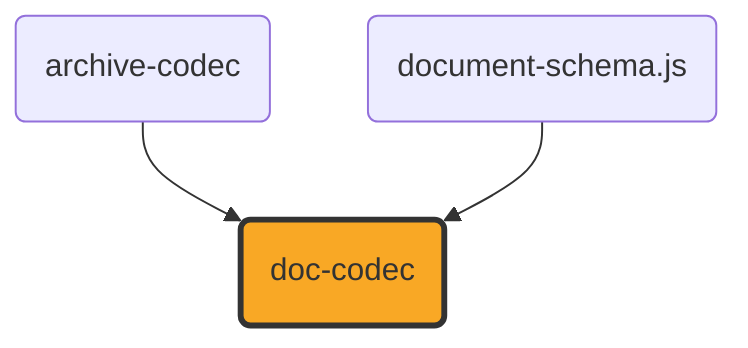

# doc-codec

[](https://github.com/ExaDev/documents.js/tree/main/packages/doc-codec) [](https://www.npmjs.com/package/doc-codec) [](https://www.npmjs.com/package/doc-codec) [](https://github.com/ExaDev/documents.js/actions)

> A hand-written, dependency-minimal reader and writer for the Word Binary File Format (`.doc`, [MS-DOC]) against the shared [`document-schema.js`](../document-schema.js/README.md) content pivot.

`.doc` is the pre-2007 Word format: a binary document living inside an [MS-CFB] compound file, with none of the XML that makes `.docx` tractable. Its text is not stored contiguously, its formatting is stored as sparse exceptions on 512-byte pages, and every structure in it is addressed by a character position that only becomes a byte offset by passing through a piece table. `doc-codec` reads that structure by hand from the published specification, exactly as `ooxml.js` reads `.docx` and `odf.js` reads `.odt`, and produces the same `ContentDocument` all three target.

## Status

**Under active development. This package both reads and writes, over a smaller surface on the write side than the read side covers.**

Built and shipped, on the read side:

- **The compound-file container and the FIB** — `readDocStreams` resolves the `WordDocument` stream and whichever of `1Table`/`0Table` `FibBase.fWhichTblStm` selects, then parses the File Information Block for the counts and offsets every later step needs.
- **The piece table** — `parseClx` resolves a `Clx` (skipping any leading `Prc` array) into the pieces the logical text stream is assembled from, including the compressed 8-bit spelling and its halved byte offset.
- **Text reconstruction** — `readTextRange` turns a range of character positions into real characters through [MS-DOC] 2.4.1's own Retrieving Text algorithm, applying the specification's byte-to-code-point mapping for compressed pieces, and returns each character's byte offset alongside it.
- **Character and paragraph formatting** — the `PlcBteChpx`/`PlcBtePapx` bin tables and the `ChpxFkp`/`PapxFkp` pages behind them, the `Sprm`/`Prl` operand-sizing rules, and the subset of the character- and paragraph-property tables listed under [What is converted](#what-is-converted), now including `sprmCRgFtc0`'s font-table lookup (see [The font table](#the-font-table)).
- **The style sheet** — `parseStsh` reads each style's index, name, kind and parent, and `headingLevelFromIstd` applies `sprmPIstd`'s own rule that an `istd` of 1 through 9 states an outline level.
- **Tables** — `table/read.ts`'s `assembleBlocks` folds a contiguous run of table-depth-1 paragraphs into a real `ContentTable`: cell boundaries at each cell-mark (`0x07`) character, a cell holding more than one paragraph where only its last ends in a cell mark, and each row's own trailing mark (`sprmPFTtp`) resolved through `table/tap.ts`'s `applyTableSprms` for its TAP — column boundaries and every physical cell's own horizontal/vertical merge state, from `sprmTDefTable`'s `TDefTableOperand` (and a `sprmTMerge` range or `sprmTVertMerge` per-cell flag where a real producer states a merge that way instead — see [Tables](#tables) below for why both are read). A table nested inside a table cell (table depth greater than 1, detected via `sprmPItap`/`sprmPFInnerTableCell`/`sprmPFInnerTtp`) is refused with `DocUnsupportedError` rather than mis-read; a row whose own TAP this reader cannot resolve at all — no direct `sprmTDefTable` anywhere in its grpprl, or a cell-mark count that disagrees with it — degrades the whole run back to flat paragraphs instead, since that is a legal producer choice this reader does not yet follow rather than corruption (see [Tables](#tables)).
- **Table cell decoration** — `ContentTableCell.background` and `.borders`, from every encoding [MS-DOC] states them in: each cell's own four `Brc80` borders inside `TC80`, the exact-colour `sprmTSetBrc` layer a real producer writes beside them, the row-level shading arrays (`sprmTDefTableShd`/`2nd`/`3rd`, their `Raw` counterparts, the Word 97-era `sprmTDefTableShd80`, and `sprmTSetShd`/`sprmTSetShdOdd`), and, cascaded onto whichever cells and sides those leave unstated, the row/table-level `sprmTTableBorders`/`sprmTTableBorders80` border set and `sprmTSetShdTable`'s own per-row background. See [Cell decoration](#cell-decoration).
- **`readDocContent`** — the whole chain, producing a `'wordprocessing'` `ContentDocument` of paragraphs, runs and tables.
- **`isDocBytes`** — distinguishes a `.doc` from the `.xls`, `.ppt` and OLE embeddings that share its container, by looking for a `WordDocument` stream carrying `FibBase.wIdent`.
- **Document metadata** — `title`/`subject`/`author`/`keywords`/`createdIso`/`modifiedIso` read from a `"\x05SummaryInformation"` stream when one is present (see [Metadata](#metadata)); `comments` and `lastPrintedIso` remain unread, since `LayoutMetadata` has no field for either.
- **Numbering definitions** — `readDocContent`'s own `numbering` field: every list's glyph/format, level-text template, and start-at value, resolved from `PlfLst`/`PlfLfo` and keyed by the same `listId` a paragraph's `ContentParagraph.list.numId` already carries. Read-only; see [Numbering definitions](#numbering-definitions).
- **The one section's own page size and margins** — `prop/sep.ts`'s `readSectionProperties` resolves `PlcfSed`/`Sepx` (`sprmSXaPage`/`sprmSYaPage`/`sprmSDxaLeft`/`sprmSDxaRight`/`sprmSDyaTop`/`sprmSDyaBottom`) into `ContentSection.pageSize`/`.margins`, falling back field by field to Word's own new-document default (US Letter, one-inch margins) for a document carrying no `PlcfSed` at all, or for any one sprm it leaves unstated. This reader only ever resolves the section spanning the whole main document — the "Section boundaries" row below states what "one section" still means.

Built and shipped, on the write side — see [Writing](#writing) for the full scope statement:

- **`writeDocContent`** — a `'wordprocessing'` `ContentDocument` (one section, paragraphs of runs and tables) to genuine [MS-DOC] bytes: a real piece table, real `ChpxFkp`/`PapxFkp` pages (splitting across as many as a document's own formatting needs, not just the common one-page case), a spec-conformant empty style sheet, a font table when a run names one, a real `PlcfSed`/`Sepx` stating the one section's own page size and margins, and a `"\x05SummaryInformation"` stream when the input's metadata carries anything that stream can hold (see [Metadata](#metadata)) — wrapped in a real [MS-CFB] compound file via `archive-codec`'s `writeCompoundFile`. A `ContentTable` block is expanded by `table/write.ts`'s `flattenSectionBlocks` into the same flat paragraph sequence every other block already is (see [Tables](#tables)), so table paragraphs flow through the identical `ChpxFkp`/`PapxFkp` paging as every other paragraph rather than a separate table-only path. Each cell's own `background` and `borders` ride along into the row's TAP (see [Cell decoration](#cell-decoration)).
- Every property `writeDocContent` writes is verified by reading it back through this package's own `readDocContent` (`src/write.test.ts`), and additionally against a real, independent [MS-DOC] implementation: LibreOffice opened, rendered, and re-exported a `writeDocContent` sample without error or content loss, including bold/italic/underline/strike/size/colour/font-family runs, paragraph alignment and indentation, non-Latin-1 and non-BMP text (accented Latin, CJK, an emoji surrogate pair), a section's own page size and all four margins (a non-default 600x800pt page with a 90/54/45/36pt left/right/top/bottom margin, confirmed against LibreOffice's own `fo:page-width`/`fo:page-height`/`fo:margin-*` export to the exact point), and a table — recognised as a genuine `table:table`, its row/column/cell structure and both horizontal and vertical merges intact, matching real `table:number-columns-spanned`/`table:number-rows-spanned` attributes and `table:covered-table-cell` elements, and each cell's own background fill and per-side borders recovered with their exact colours, exactly as [Tables](#tables) confirms in full.

**Not built, and not approximated, on either side.** Each of these is a genuine layer of [MS-DOC] that this package does not implement; none is silently faked, and a document using one reads (or fails to write) as though it did not:

| Absent                                                          | Consequence                                                                                                                                                                                                                                                                                                                                                                                                                                                                                                                                                                                                                                                                                                                                                                                                                                                                                                           |
| --------------------------------------------------------------- | --------------------------------------------------------------------------------------------------------------------------------------------------------------------------------------------------------------------------------------------------------------------------------------------------------------------------------------------------------------------------------------------------------------------------------------------------------------------------------------------------------------------------------------------------------------------------------------------------------------------------------------------------------------------------------------------------------------------------------------------------------------------------------------------------------------------------------------------------------------------------------------------------------------------- |
| **Nested tables**                                               | A table inside a table cell (table depth greater than 1) is a genuinely different [MS-DOC] structure — `sprmPFInnerTableCell`/`sprmPFInnerTtp` mark its cell/row ends rather than `sprmPFInTable`/`sprmPFTtp`, and `sprmPItap`/`sprmPDtap` state the depth. Neither side of this package descends into one: `readDocContent` refuses with `DocUnsupportedError` the moment it detects a table depth greater than 1, and `writeDocContent` refuses a `ContentTable` block found inside a table cell's own blocks the same way. See [Tables](#tables) for the full scope of what a depth-1 table does resolve.                                                                                                                                                                                                                                                                                                          |
| **Images and drawn objects**                                    | The anchor characters (`U+0001`, `U+0008`) are dropped rather than emitted as control characters. No picture data is read. `writeDocContent` refuses an image block.                                                                                                                                                                                                                                                                                                                                                                                                                                                                                                                                                                                                                                                                                                                                                  |
| **Style-inherited formatting**                                  | A style's own property sets live in the `STD`'s `grLPUpxSw` and are not read, so a paragraph's formatting is the document defaults plus its own direct exceptions. A `Heading 1` paragraph reports its `styleId` and `headingLevel` but not the boldness or size its style would supply. `writeDocContent` writes no paragraph styles at all (every paragraph is `istd` 0) and does not round-trip `styleId`/`headingLevel`. Tracked as its own, genuinely separate piece of work in [ExaDev/documents.js#1005](https://github.com/ExaDev/documents.js/issues/1005).                                                                                                                                                                                                                                                                                                                                                  |
| **Subdocuments**                                                | Only the main document (character positions 0 to `ccpText`) is converted. Footnotes, endnotes, headers, footers, comments and text boxes are not, in either direction.                                                                                                                                                                                                                                                                                                                                                                                                                                                                                                                                                                                                                                                                                                                                                |
| **Section boundaries**                                          | Section boundaries themselves are not read — the whole document is always treated as one section, spanning the entire main document — so a multi-section `.doc`'s later sections' own page size and margins are never consulted, only the first's (see the read-side page-size/margins bullet above for what is now read of that one section). `writeDocContent` refuses a `ContentDocument` with more than one section, rather than silently merging their content into what would read back as one.                                                                                                                                                                                                                                                                                                                                                                                                                 |
| **Extended and user-defined document properties**               | `title`/`subject`/`author`/`keywords`/`createdIso`/`modifiedIso` are read from and written to a `"\x05SummaryInformation"` stream when present (see [Metadata](#metadata)); the sibling `"\x05DocumentSummaryInformation"` stream (company, manager, and custom user-defined properties) is not read or written at all.                                                                                                                                                                                                                                                                                                                                                                                                                                                                                                                                                                                               |
| **Encryption**                                                  | An encrypted or XOR-obfuscated document is refused with a `DocUnsupportedError` rather than read as plaintext. `writeDocContent` never encrypts.                                                                                                                                                                                                                                                                                                                                                                                                                                                                                                                                                                                                                                                                                                                                                                      |
| **`sprmPHugePapx` / `sprmPTableProps`**                         | Paragraph properties stored indirectly in the Data stream are not followed, so such a paragraph reads with fewer properties than it states. [MS-DOC] 2.4.3's own Overview of Tables text names `sprmPTableProps` as a real, legal alternative to `sprmTDefTable` some applications process — but a real producer's row mark is not shown to prefer it: a genuine LibreOffice-authored `.doc` table's own row mark states its TAP through the identical direct `sprmTDefTable` this package's reader and writer already use (confirmed by parsing a LibreOffice 26.2.5.2-authored table's raw `PapxFkp` bytes; see [ExaDev/documents.js#892](https://github.com/ExaDev/documents.js/issues/892)), matching 2.4.3's own compatibility guidance ("An application SHOULD use sprmTDefTable to define table cells for applications that do not process sprmPTableProps"). `writeDocContent` never writes an indirect Papx. |
| **Hyperlinks and fields**                                       | `ContentRun.hyperlink`, footnote/comment/annotation references, and every other field or anchor character are read as plain text or dropped (see [What is converted](#what-is-converted)) and are not written.                                                                                                                                                                                                                                                                                                                                                                                                                                                                                                                                                                                                                                                                                                        |
| **Right-margin paragraph indent**                               | `pap.ts`'s reader folds `sprmPDxaRight` into an internal `indentRightPt`, but `ContentParagraphSchema` (`document-schema.js`) carries no field for it, so no reader output and no writer input can ever carry it.                                                                                                                                                                                                                                                                                                                                                                                                                                                                                                                                                                                                                                                                                                     |
| **Every FIB field beyond what this package's own reader needs** | `writeDocContent` populates only the fc/lcb pairs its own reader consults (the style sheet, the two property bin tables, the Clx, the font table). Roughly 140 other `FibRgFcLcb97` pairs — `SttbfAssoc`, `Dop`, the printer-driver structures among them — are left zero, which is the format's own "undefined, MUST be ignored" contract for most of them, but not a certification that every third-party [MS-DOC] reader accepts the result; see `fib/write.ts`'s own note.                                                                                                                                                                                                                                                                                                                                                                                                                                        |

One construct is refused rather than mis-read: a `sprmPChgTabs` whose `cb` is the `255` sentinel encodes its own length as a formula over tab-stop counts this package does not parse, and its length is needed to find the next `Prl`. Rather than guess and silently mis-read every property after it, `operandSize` throws.

## What is converted

Character properties, from `Chpx` grpprls:

| Sprm                                                                    | Becomes                                                                                                   |
| ----------------------------------------------------------------------- | --------------------------------------------------------------------------------------------------------- |
| `sprmCFBold` (0x0835), `sprmCFItalic` (0x0836), `sprmCFStrike` (0x0837) | `bold` / `italic` / `strike`, honouring `ToggleOperand`'s inherit (0x80) and invert (0x81) values         |
| `sprmCKul` (0x2A3E)                                                     | `underline` (any non-zero `Kul` style)                                                                    |
| `sprmCHps` (0x4A43)                                                     | `sizePt`, the operand being half-points                                                                   |
| `sprmCIco` (0x2A42)                                                     | `color`, through [MS-DOC] 2.9.119's fixed palette                                                         |
| `sprmCCv` (0x6870)                                                      | `color`, from a `COLORREF`                                                                                |
| `sprmCIstd` (0x4A30)                                                    | the character style index, carried for a caller to resolve                                                |
| `sprmCRgFtc0` (0x4A4F)                                                  | `fontFamily`, looked up by index in the document's own font table (see [The font table](#the-font-table)) |

Paragraph properties, from `PapxInFkp` grpprls:

| Sprm                                                  | Becomes                                                                 |
| ----------------------------------------------------- | ----------------------------------------------------------------------- |
| `sprmPIstd` (0x4600)                                  | `styleId` (the style's name) and `headingLevel` (via the istd 1-9 rule) |
| `sprmPJc` (0x2461), `sprmPJc80` (0x2403)              | `alignment`                                                             |
| `sprmPDxaLeft` (0x845E) / `sprmPDxaLeft80` (0x840F)   | `indentLeftPt`                                                          |
| `sprmPDxaLeft1` (0x8460) / `sprmPDxaLeft180` (0x8411) | `indentFirstLinePt`                                                     |
| `sprmPDyaBefore` (0xA413), `sprmPDyaAfter` (0xA414)   | `spacingBeforePt` / `spacingAfterPt`                                    |
| `sprmPDyaLine` (0x6412)                               | `lineSpacing`, only for `LSPD`'s multiplier form                        |
| `sprmPFPageBreakBefore` (0x2407)                      | `pageBreakBefore`                                                       |
| `sprmPOutLvl` (0x2640)                                | `headingLevel`, where the istd did not already supply one               |
| `sprmPIlfo` (0x460B), `sprmPIlvl` (0x260A)            | `list` membership                                                       |

Fields are handled structurally: everything between a field-begin (`U+0013`) and a field-separator (`U+0014`) is the field's instruction and is dropped; the result between the separator and the field-end (`U+0015`) is kept. A line break (`U+000B`) inside a paragraph survives as a newline.

### The font table

`sprmCRgFtc0` names a font by an index into `SttbfFfn` ([MS-DOC] 2.9.253), a string table whose entries are `FFN` records ([MS-DOC] 2.9.87) — a fixed head of font-substitution metadata (family, weight, character set, a Panose and a `FontSignature`) this package neither reads nor writes meaningfully, followed by the font's own name as a null-terminated UTF-16 string. `src/style/fonts.ts` reads and writes this table: `parseFontTable` resolves the name at each index for `sprmCRgFtc0` to look up, and `buildFontTable` (used only by the writer) emits one entry per distinct font name a document's runs use, with every metadata field beyond the name itself zeroed — this package writes a font NAME for `ContentRun.fontFamily` to round-trip, not a font-substitution profile. Only `sprmCRgFtc0` (the default, non-East-Asian, non-complex-script font) is read or written; `sprmCRgFtc1`/`sprmCRgFtc2`/`sprmCFtcBi` are not.

## Tables

A table in [MS-DOC] is not a separate container: it is a run of ordinary paragraphs marked `sprmPFInTable`, with cell boundaries at literal `0x07` cell-mark characters in the text stream and each row closed by its own row-ending mark — a cell mark additionally carrying `sprmPFTtp` — per [MS-DOC] 2.4.3's own Overview of Tables. `src/table/` implements exactly this model, at table depth 1 only; a table nested inside a table cell is refused rather than mis-read (see the "Nested tables" row in the scope table above).

**Reading** (`table/read.ts`'s `assembleBlocks`, called from `read.ts`). It walks the flat paragraph sequence `read.ts` already produces, grouping every contiguous run of `inTable` paragraphs into a `ContentTable`: consecutive paragraphs up to and including the one terminated by an ordinary cell mark become one cell's own `blocks` (a cell may hold more than one paragraph — only its last ends in a cell mark, per 2.4.3's own "the last paragraph in a table cell is terminated by a cell mark"), and the row's own trailing mark resolves the row's whole TAP through `table/tap.ts`'s `applyTableSprms`: column boundaries and every physical cell's own merge state, read directly from `sprmTDefTable`'s `TDefTableOperand` — its `rgdxaCenter` array and its `rgTc80` array of per-column `TC80` records ([MS-DOC] 2.9.313, whose own `tcgrf` field is 2.9.317) — folded with a `sprmTMerge` range or `sprmTVertMerge` per-cell flag on top where a real producer states a merge incrementally instead, genuinely regardless of which order the two appear in within the grpprl (`table/tap.ts`'s own note). Column layout is never assumed shared across a table's own rows: [MS-DOC] 2.6.3 permits each row to declare its own independent `rgdxaCenter` ("There is no requirement that each row of a table have the same number of cells"), and a real, independent [MS-DOC] implementation (LibreOffice 26.2.5.2) was confirmed to rely on exactly this for a horizontal merge — its own merged row simply has fewer, wider physical cells, with no `TCGRF.horzMerge`/`sprmTMerge` signal at all (see the third-party verification paragraph below). `table/read.ts` reconstructs the table's shared column grid as the union of every row's own `rgdxaCenter` boundary values, then expresses each physical cell's own `colSpan` as however many of that shared grid's segments its own boundaries cover. That union is taken within one point rather than by exact integer equality, because [MS-DOC] states those boundaries per row and defines no quantum coarser than the twip itself for them, so two rows meaning the identical grid may legally disagree by a twip or two — and an exact union turns that drift into a phantom hairline column plus a spurious `colSpan` on the cells of every row either side of it (two rows one twip apart across a 2338-twip boundary read back as `columnWidthsPt` `[116.9, 0.05, 144.95, 220]` instead of `[116.9, 145, 220]`; [ExaDev/documents.js#898](https://github.com/ExaDev/documents.js/issues/898)). The default tolerance is `TWIPS_PER_POINT` itself, not a picked number: `columnWidthsPt` states the reconstructed grid in points, so a segment narrower than one point sits below the smallest unit that grid can distinguish at all. It is also the fuzz a real, independent implementation applies to an analogous reconstruct-one-shared-grid-from-N-per-row-arrays problem — LibreOffice's table model is per-row too (`SwTableLine` → `SwTableBox`, each box carrying its own width), and `sw/source/filter/inc/wrtswtbl.hxx` answers it, on its own ODF export (the point at which it projects that per-row model onto one shared grid, `sw/source/filter/xml/xmltble.cxx`'s `SwXMLTableColumn_Impl`), with `#define COLFUZZY 20` twips, `SwWriteTableCol::operator==` treating two column positions as equal when they differ by at most that. Its changeover was confirmed empirically and exactly, not assumed: patching a single `int16` inside a real LibreOffice-authored table's second row and round-tripping it through that implementation's own `.doc` import followed by its ODF export gives three columns and no covered cell for a drift of 1 through 20 twips, and four columns with a real `table:covered-table-cell` from 21 (the `.doc` import side alone preserves the drifted boundary byte-for-byte — the fuzz is applied on export, not import). Per-row drift is not hypothetical even without Word or LibreOffice's own export step in the picture: `WW8TabDesc::CalcDefaults` widens any imported cell narrower than that same implementation's own minimum cell width (`MINLAY`, 23 twips in `sw/inc/swtypes.hxx`) by mutating boundaries per row during `.doc` import itself, so a document that has been through that import is one real mechanism by which per-row drift reaches a `.doc` at all.

The one-point default is not applied unconditionally, because `MINLAY`'s own guarantee is LibreOffice's alone: this package's own writer widens nothing, so nothing stops a real producer's `rgdxaCenter` from stating a column genuinely narrower than a point, and folding that column's own two boundaries together as "drift" would silently delete it rather than fix a phantom one. The tolerance is therefore clamped, per table, to one twip below the narrowest strictly-positive gap any single row states between two of its _own_ adjacent boundaries (a zero-width gap is a legal adjacent-duplicate boundary, not a column, and is excluded) — two boundaries a row itself distinguishes are never folded together, however close, and the clamp can only ever be as generous as the tightest real column that table actually declares. Beyond that, [MS-DOC]'s own physical-cell model keeps every horizontally- and vertically-merged-away cell present in the text stream with its own cell mark and its own `TC80` entry — never omitted the way OOXML's `w:gridSpan` model omits a horizontally-merged-away `<w:tc>` outright — so a horizontal-continuation cell stated the legacy way (`TCGRF.horzMerge` = 1, still honoured for a genuine third-party producer that uses it) is folded into the preceding real cell's own `colSpan` exactly as before, while a genuinely narrower, wider physical cell (no flag, LibreOffice's own encoding) resolves to a `colSpan` greater than 1 directly from its own boundaries — both mechanisms produce the identical shape downstream. A vertical-continuation cell (`TCGRF.vertMerge` = `fvmMerge`) is kept as its own `{blocks: []}` entry — carrying its own `colSpan` too when it is also part of a horizontal-merge group in that row — with `rowSpan` computed on the anchor by scanning subsequent rows for a cell starting at the same position on the table's own shared grid, never a raw physical-array index, since two rows may genuinely have different physical cell counts and still need their vertical merges to line up correctly. Both conventions mirror `ooxml.js`'s own docx table reader exactly, since `colSpan`/`rowSpan`/`{blocks: []}` are precisely the shape `document-schema.js`'s `ContentTableCell` was designed to hold for either format's own cousin of the same merge model. A column boundary that no row in the table ever states on its own — every row happens to merge across it identically — cannot be recovered from the physical bytes at all; this is a genuine limitation of [MS-DOC]'s own physical model, not an approximation this reader chooses to make. This package's own writer closes that gap for an ordinary merge (see [Writing](#writing) below and [ExaDev/documents.js#992](https://github.com/ExaDev/documents.js/issues/992)): it falls back to a horizontal-merge continuation cell precisely when every row would otherwise merge across a boundary identically. But the writer's own lost-boundary fallback genuinely reopens the same gap when a row's assigned split overflows either the row-ending mark's own byte budget or the format's 63-physical-cell ceiling: `flattenTable` trims the excess boundaries rather than throwing ([ExaDev/documents.js#1013](https://github.com/ExaDev/documents.js/issues/1013); see the [Writing](#writing) section's own note on the trim fallback below), and a boundary it drops is unrecoverable on the next read exactly as if no row had ever stated it. That trim is now the most likely source of this shape; a table hand-built for a test, or one produced by a genuine third-party [MS-DOC] implementation that happens to encode a merge the identical way on every row, are the two remaining, rarer sources.

A row whose own TAP cannot be resolved this way — no direct `sprmTDefTable` anywhere in its grpprl (a producer may legally state it indirectly instead, through `sprmPTableProps`; see the `sprmPHugePapx`/`sprmPTableProps` scope row above), or a cell-mark count that disagrees with what its `TDefTableOperand` declares — degrades the _whole_ contiguous run of table-depth paragraphs back to flat paragraphs, rather than refusing the whole document: this is a legal, real-world construct this reader does not yet implement, not corruption, and paragraphs that would have become a table simply stay paragraphs instead, the identical class of degrade the `sprmPHugePapx`/`sprmPTableProps` row above already documents for ordinary paragraph formatting. A row ending mid-cell with no terminating mark at all is different in kind — the stream itself is truncated, not merely using an unsupported mechanism — and still throws `DocFormatError`.

**Writing** (`table/write.ts`'s `flattenSectionBlocks`, called from `write.ts`) is the inverse: a `ContentTable` block expands into its own real physical-cell paragraph stream, one physical cell per `ContentTableCell` — real content or a vertical-merge continuation's own `{blocks: []}` — never expanded into extra synthetic cells for a `colSpan` greater than 1. A `{blocks: []}` cell becomes a single empty paragraph, but is only written as a vertical-merge continuation (`TCGRF.vertMerge` = `fvmMerge`) when a vertical merge is genuinely still in progress at that column — tracked across rows by an `active` map keyed by column position, mirroring `ooxml.js`'s own `buildTable` exactly, since a genuinely blank cell has the identical `{blocks: []}` shape and inferring the merge from emptiness alone would silently mis-merge it with whatever real content sits above it; a continuation's own physical column span, likewise, always comes from the anchor's own recorded `colSpan` rather than the continuation cell's own (typically absent) one, so a cell merged both horizontally and vertically at once writes correctly instead of throwing. Every physical cell's own paragraphs carry `sprmPFInTable`; the row's own trailing mark additionally carries `sprmPFTtp` plus a single `sprmTDefTable` stating the row's own column layout and every cell's `TC80.tcgrf` vertical-merge state (`table/tap-write.ts`), and a `sprmTDyaRowHeight` when the row states a `heightPt`. Column widths are derived once from the table's own `columnWidthsPt`, giving every row a shared full grid of boundary points to draw from, but a row containing a horizontal merge writes its own narrower, wider `rgdxaCenter`: a `colSpan`-anchored cell's own physical boundary is the combined width of however many of the full grid's columns it spans, merged into one cell rather than kept as separate flagged ones. This is a deliberate match for how a real, independent [MS-DOC] implementation (LibreOffice 26.2.5.2) was confirmed to encode a horizontal merge — see the third-party verification paragraph below for the full ground-truth finding and [ExaDev/documents.js#895](https://github.com/ExaDev/documents.js/issues/895) for the issue it fixes. `TCGRF.horzMerge` is 0 for an ordinary merge like this one — no flag or `sprmTMerge` sprm is written for it — with one deliberate exception: before flattening any row, the writer first computes, across every row in the table, which of the table's own internal column boundaries at least one row's ordinary physical layout would state; a boundary none of them would (every row happens to merge across it identically — a single-row table with one merged cell is the simplest case) is kept physically present anyway, by splitting the cell that crosses it into an extra physical cell flagged as a genuine `TCGRF.horzMerge` continuation (contentless, per [MS-DOC] 2.9.317's own TCGRF: `horzMerge` value 1, "the cell is one of a set of horizontally merged cells. It contributes its layout region to the set and its own contents are not rendered") rather than folded into one wider cell. This is the fix for [ExaDev/documents.js#992](https://github.com/ExaDev/documents.js/issues/992): the fallback triggers only for the rows and boundaries that actually need it, so an ordinary table — one with at least one row that does not merge across the same span — writes exactly as before, and only the pathological case gains an extra physical cell purely to keep the boundary recoverable on read. The trade-off is real and worth stating plainly: LibreOffice was confirmed not to read `TCGRF.horzMerge` back as a merge at all (see the top-of-file note above), so a table this fallback applies to shows as unmerged, separate cells there — one of them empty — rather than as the single merged cell this package's own reader now correctly recovers. Given the alternative was `colSpan` coming back `undefined` and `columnWidthsPt` silently narrowing on every reader including this package's own, that trade is the honest one to make.

`distributeLostBoundaries` assigns each lost boundary to exactly one row, round-robin, rather than to every row that crosses it: a boundary is only ever "lost" because every row of the table merges across it identically, so any one row can be the one that states it, and spreading the work is what keeps a wide, uniformly-merged table's own rows under the per-row budget stated below. But the row a boundary lands on can still, itself, be assigned more boundaries than its own row-ending mark can actually carry — a table wide enough, or with few enough rows to share the work, reproduces the identical overflow the 21-column ceiling arithmetic below already describes, just reached through the split instead of through raw column count ([ExaDev/documents.js#1013](https://github.com/ExaDev/documents.js/issues/1013), a genuine write regression `#992`'s own fix introduced: a single-row table with one merged cell wrote successfully for any column count before `#992`, since an unsplit merge costs nothing extra regardless of its span, but the row assigned every one of its own lost boundaries by `#992`'s fix throws past 21 columns with no other row to share the work). A row's own assigned split can overflow either of two real ceilings, not one: the row-ending mark's own `PapxInFkp` byte budget (the 21-column ceiling case described below), and the format's own hard cap of 63 physical cells per row (`TDefTableOperand.NumberOfColumns`, [MS-DOC] 2.9.321's own "MUST NOT exceed 63", not 2.4.3's separate "between 1 and 63 table cells" limit) — a table with enough columns that even one row's _share_ of the lost boundaries alone would split it past 63 physical cells. `rowSplitFits` (`table/write.ts`) checks a candidate split against both: the cell-count ceiling first and cheaply, so an over-63 candidate is never handed to `tap-write.ts`'s `encodeTableRowGrpprl` at all (that function throws unconditionally past its own `MAX_TABLE_ROW_CELLS`, since every other caller committing a row has a genuine internal defect if it ever produces one), then `prop/fkp-write.ts`'s own `fitsAloneOnPapxPage` (the identical fits-in-isolation check `buildPapxPages` itself performs before it would throw, called ahead of time rather than re-derived as a second formula). A row whose full assigned split fails either check does not drop every one of its assigned boundaries the way this fallback's own first version did: `flattenTable` trims from the end of the row's own assigned set — dropping its highest-valued boundary first, since `distributeLostBoundaries` builds each row's set in ascending order — one boundary at a time, checking each shorter prefix against `rowSplitFits` in turn until one fits. That is an exhaustive downward scan rather than a binary search over boundary count because a downward scan finds the true largest fitting prefix by construction, whatever the byte size does as boundaries are dropped — it never needs fitting to behave monotonically to be correct, only to try every candidate length in turn. The byte size genuinely is not monotonic: dropping one boundary always removes exactly one physical cell — 22 bytes, the same per-column cost stated below (2 for the `rgdxaCenter` boundary, 20 for that cell's own `TC80`) — but it also shifts every later cell's index down by one, and `tap-write.ts`'s `shadingPrls` packs a row's shading into one `DefTableShdOperand` per 22-cell window whose `rgShd` array runs from the window's own first cell up to its last shaded cell: shifting a shaded cell out of a cheap position at the head of one window and into the tail of the previous window forces that window's own array to stretch across up to all 22 of its cells (10 bytes each) to reach it, up to 210 bytes where before it needed only its own single 10-byte entry, a **188-byte increase** (−22 from the removed cell, +210 from the shifted shading array) for removing a boundary rather than the decrease a naive reading would expect. That jump can never actually reach a candidate this scan accepts, though — it is the same fact the Testing section states from the read-side test suite's own vantage point, that the second and third shading arrays are something "a row too wide for one `PapxInFkp` record can never exercise end to end": the second window's own first cell only exists once a row holds at least 23 physical cells, and 23 cells alone — with no shading, no exact-colour border overrides, no row height, nothing but the bare `sprmTDefTable` — already cost the same 15-fixed-plus-22-per-cell arithmetic the "21 columns" ceiling below is built from: 15 + 22 × 23 = 521 bytes, 34 bytes past the 487-byte `GrpPrlAndIstd` ceiling a lone paragraph can claim, before a single shading byte is even added. Every byte this format can add past that bare minimum only grows the record further, so no 23-cell-or-wider candidate can ever fit no matter how its shading falls, and `rowSplitFits` rejects it on cell count and base size alone long before the cross-window shift above could matter. The non-monotonicity is real, but it lives entirely past the cell count any row within this budget can reach — so a binary search here would not actually risk stopping on a candidate a larger, skipped-past one would also have fit; the exhaustive scan is simply what a correct "largest fitting prefix" search looks like regardless, with no monotonicity assumption to get wrong either way. Only the trimmed boundaries go back to being unrecoverable on read; every boundary the row still states survives exactly as `#992`'s own fix intended. `writeDocContent`'s own optional `onWarning` callback (`WriteDocContentOptions`, the same shape `byte-codec`'s PNG decoder and `pdf-codec` already use for a recoverable defect) is told which row, how many of its assigned boundaries it kept, and how many it dropped — a diagnostic, not a silent narrowing. Every other row in the table is unaffected: only the rows genuinely too wide to close `#992`'s own gap in full trim at all, and even those recover as much of their own assignment as their budget allows rather than losing all of it — a two-row, 42-column table where one row sits one boundary past the byte-budget ceiling still recovers 41 of its 42 columns, not the 21 an all-or-nothing fallback would leave (see `write.test.ts`'s own trimming and 63-cell-ceiling tests for the measured numbers). The trim can still reach zero kept boundaries for a row decorated or narrow enough that not even a single split survives its own budget; that is, correctly, the same total-loss outcome the fallback's first version always produced for such a row, not a regression this trim introduces. Nothing changes for a row that still cannot fit even fully unsplit — a decorated or otherwise too-wide row exactly as the paragraph below already describes — since that throw was never `#992`'s, or this trim's, to fix in the first place.

The Main Document's own last character MUST be an ordinary paragraph mark ([MS-DOC]'s "Main Document" glossary entry: "The last character in the main document MUST be a paragraph mark (Unicode 0x000D)") — never the row-ending mark's own cell-mark character (0x0007), even though a row mark is a perfectly legal paragraph-boundary terminator everywhere else. `write.ts`'s own top-level `writeDocContent` — not this module — is what guarantees this: whenever `flattenSectionBlocks`' own output ends in anything other than an ordinary paragraph mark (an empty section, or, the case that matters here, a section whose very last block is a table), it appends one trailing empty paragraph so the table's own row mark is never the document's final character. This is the confirmed root cause of, and fix for, [ExaDev/documents.js#892](https://github.com/ExaDev/documents.js/issues/892) — see the third-party verification paragraph immediately below for the full finding.

**Third-party verification: passing for a plain table, a vertical merge, a horizontal merge, and a cell merged both ways at once.** [ExaDev/documents.js#892](https://github.com/ExaDev/documents.js/issues/892) tracked a genuine regression an earlier draft of this README had falsely certified as passing: LibreOffice's own `.doc` import filter recognised no table at all in a `writeDocContent` sample, in any configuration — every cell's text came back concatenated into one flat paragraph, with no `table:table` element anywhere in the converted output. The root cause was found by comparing this writer's own bytes against a genuine LibreOffice-authored `.doc`, byte for byte, rather than guessing: a LibreOffice 26.2.5.2-built `.odt` table converted to `.doc` (`soffice --headless --convert-to doc`) and its `WordDocument` stream parsed directly through this package's own `PapxFkp`/grpprl primitives shows LibreOffice's own row mark stating its TAP through the identical direct `sprmTDefTable` this writer already used — ruling out the indirect-Papx hypothesis #892 had raised (see the `sprmPHugePapx`/`sprmPTableProps` scope row above). The actual difference was the document's own last character: LibreOffice's file ends in a genuine paragraph mark (0x000D) after the table's own row-ending cell mark, while this writer's output ended the whole text stream _at_ the row mark itself (0x0007) — violating [MS-DOC]'s own "Main Document" glossary entry ("The last character in the main document MUST be a paragraph mark") outright. Restoring that trailing paragraph mark (see the note above) with no other change fixed table recognition completely; reverting it (verified by hand) reproduces the original failure exactly.

The horizontal-merge gap #892 left open ([ExaDev/documents.js#895](https://github.com/ExaDev/documents.js/issues/895)) was root-caused the same way: round-tripping a LibreOffice-authored horizontal merge through its own `.doc` writer and parsing the result's raw TAP bytes with this package's own primitives shows LibreOffice does not use `TC80.tcgrf.horzMerge` _or_ `sprmTMerge` for a horizontal merge at all — the merged row's own `TDefTableOperand` genuinely has fewer, wider physical cells (`rgdxaCenter = [0, 6425, 9638]`, 2 physical cells, both `TCGRF.horzMerge = 0`) than an unmerged row in the same table (`rgdxaCenter = [0, 3212, 6425, 9638]`, 3 cells), a real per-row column layout [MS-DOC] 2.6.3 permits ("There is no requirement that each row of a table have the same number of cells"). This writer now matches that encoding (see [Writing](#writing) above) and the reader reconstructs `colSpan` from it (see the Reading paragraph above). Verified against LibreOffice 26.2.5.2 (`soffice --headless --convert-to fodt`, checking for real `table:table`/`table:table-row`/`table:table-cell` elements) for four cases: a plain 2x2 unmerged table (**passes** — genuine `table:table` structure, correct cell text and column count); a vertically merged cell (**passes** — `table:number-rows-spanned="2"` on the anchor cell and a real `table:covered-table-cell` on the row below); a horizontally merged cell (**passes** — `table:number-columns-spanned="2"` on the anchor cell and a real `table:covered-table-cell` beside it, with the table's other, unmerged row confirming 3 real columns); and a cell merged both horizontally and vertically at once (**passes** — `table:number-rows-spanned="2" table:number-columns-spanned="2"` together on the anchor, with two `table:covered-table-cell` elements on the row below it). No case regressed against the other: the same writer output that produces the merges above still passes the plain-table and vertical-merge checks unchanged.

**Third-party verification, cell decoration: passing in both directions.** The border and shading encodings [Cell decoration](#cell-decoration) describes were established against real LibreOffice 26.2.5.2 output before any of them was implemented, not derived from the specification alone and checked afterwards. A hand-authored `.fodt` table — one cell with a `#ffff00` fill and no borders, one with four different borders (0.5pt solid `#ff0000` top, 1pt dashed `#0000ff` left, 2.5pt solid `#008000` bottom, 1.5pt dotted `#800080` right) and no fill, one with both a `#00ffff` fill and a single double top border, and a second row with neither — was converted with `soffice --headless --convert-to doc` and its row marks' raw grpprls parsed with this package's own `PapxFkp`/`Sprm` primitives. That capture is what settled every design question here: it showed borders written twice (`TC80.brcTop` = `04 01 06 00`, a `Brc80` of `dptLineWidth` 4, `brcType` 0x01, `ico` 0x06 red, alongside `sprmTSetBrc` `0b 01 02 01 ff 00 00 00 04 01 00 00`, a `TableBrcOperand` over cells [1,2) with `bordersToApply` 0x01 and an exact `#ff0000` `COLORREF`), shading written as `sprmTDefTableShd` with `cvFore` automatic, `cvBack` the fill colour and `ipat` 0, `sprmTDefTableShdRaw` and `sprmTDefTableShd80` written alongside it, and no `TC80` shading field to look for because none exists.

**Reading** that same `.doc`, this package recovers every value exactly, cross-checked against what LibreOffice itself independently recovers from the identical bytes (`soffice --headless --convert-to fodt`): the `#ffff00` and `#00ffff` fills, and all four of the second cell's borders with their exact colours, widths and `solid`/`dashed`/`dotted` styles, matching LibreOffice's own re-exported `fo:background-color` and `fo:border-*` values term for term. **Writing**, a `writeDocContent` sample carrying the same decoration opens in LibreOffice as a genuine `table:table` with correct structure and text, and its re-export carries every fill and border back: `fo:background-color="#ffff00"`, `fo:border-top="0.5pt solid #ff0000"`, `fo:border-left="1pt dashed #0000ff"`, `fo:border-bottom="2.5pt solid #008000"`, `fo:border-right="1.5pt dotted #800080"`, and — the case that proves the exact-colour layer is honoured by a reader this package did not write — a `#336699` double top border, a colour nowhere in the `Ico` palette that `TC80`'s own `Brc80` could only have approximated. The four merge cases above were re-run against the same build and all four still pass, which the byte level explains outright: an undecorated cell's four `Brc80` fields are still the all-bits-set sentinel this writer always wrote, and a row with no fills emits no shading array and no `sprmTSetBrc`, so an undecorated table's bytes are unchanged (pinned directly by `decoration.test.ts`'s own byte-for-byte expectation rather than left as an inference).

The width of a **double** border now agrees with LibreOffice too. [MS-DOC] gives a border one `dptLineWidth` field and does not say whether it describes one line of a multi-line type or the whole stack; the two sides of a `double` border ([MS-DOC] `BrcType` 0x03) turn out to disagree about which — this package originally reported the field as the border's own total width, while LibreOffice's own WW8 border-width conversion (`editeng/source/items/borderline.cxx`: `BorderWidthImpl` for `SvxBorderLineStyle::DOUBLE` splits a total width into three equal thirds for line/gap/line, and `ConvertBorderWidthToWord` divides a total width by three the other way) treats the field as one of the two lines' own width, the gap between them being the same width again — a factor of three apart in both directions, which is exactly what the two measurements showed: reading LibreOffice's own file, a `dptLineWidth` of 5 read here as 0.625pt where LibreOffice's re-export called the same border `1.8pt double` (5 eighths tripled is 1.875pt, matching LibreOffice's own figure to its own twip-rounding); writing, a 2pt double border came back from LibreOffice as `6pt double` (this package's own pre-fix `dptLineWidth` of 16, read back as a single line's width and tripled, is exactly 6pt). `widthPt` for a `double` border is therefore the total rendered width in both directions now, tripled from `dptLineWidth` on read and divided by three (rounding to the nearest eighth of a point) on write, matching LibreOffice's own convention exactly; every single-line border — `solid`, `dashed`, `dotted`, at every width tested — already agreed exactly in both directions and is unaffected.

Two further limits are worth stating precisely rather than leaving implied. A **non-solid shading pattern** was not verified against LibreOffice in either direction, because this package deliberately never writes one and the authored `.fodt` never produced one — the read-side behaviour (any `Ipat` beyond `ipatAuto`/`ipatSolid` resolving to no background) is pinned against hand-built bytes in `decoration.test.ts` and against the specification's own enumeration, not against a real producer's file. And the **`sprmTSetShd`/`sprmTSetShdOdd` and `Shd80` read paths** are likewise pinned against hand-built bytes and, for `Shd80`, against the very array LibreOffice wrote alongside its `Shd` one (both decode to the same colours, which is a real cross-check) — but no file was found that states shading _only_ that way, so those paths have not been exercised end to end against a third-party producer.

### Cell decoration

A cell's own background fill and per-side borders (`ContentTableCell.background`/`.borders`) are read and written, in both directions, through `src/table/decoration.ts` — the one place either direction packs or unpacks these field layouts, so the two cannot silently disagree about what a byte means, exactly the role `xls-codec`'s own `biff/xf-colors.ts` plays for BIFF8's `CellXF` payload.

**Borders live in two places at once, and both are read and written.** `TC80` ([MS-DOC] 2.9.313) carries four `Brc80MayBeNil` fields ([MS-DOC] 2.9.18, a `Brc80` — 2.9.17: an 8-bit `dptLineWidth` in 1/8-point increments, a `BrcType`, an `Ico` palette index, then `dptSpace`/`fShadow`/`fFrame`), so a border's colour there is an index into [MS-DOC] 2.9.119's fixed 17-entry palette and a colour outside it cannot be stated at all. `sprmTSetBrc` (0xD62F, a `TableBrcOperand` — [MS-DOC] 2.9.305: `cb`, an `ItcFirstLim` cell range, a `bordersToApply` side bitmask, then a `BrcMayBeNil`) restates the same border with a full 8-byte `Brc` ([MS-DOC] 2.9.16) whose `cv` is an exact `COLORREF`; its Word 97-era sibling `sprmTSetBrc80` (0xD620, `TableBrc80Operand` — [MS-DOC] 2.9.304) shares the identical `cb`/`ItcFirstLim`/`bordersToApply` header but restates the border with a palette-indexed `Brc80MayBeNil` instead, exactly like `TC80`'s own fields — read for a genuine Word-97-era producer, but never written, since this package's own writer only ever emits the modern spelling. A real, independent [MS-DOC] implementation writes `sprmTSetBrc` (not `sprmTSetBrc80`) alongside `TC80` for every bordered cell, which is why this package reads both — `sprmTSetBrc`/`sprmTSetBrc80` folding onto `TC80`'s own layer exactly as `sprmTMerge`/`sprmTVertMerge` already fold onto `sprmTDefTable`'s — and writes the modern one. The exact-colour layer is emitted only where the palette genuinely cannot hold the colour: a black, red or yellow border is already exact in `TC80` itself, so an ordinary bordered table's row mark carries no `sprmTSetBrc` at all, which matters because a `PapxInFkp`'s whole `GrpPrlAndIstd` has to fit in 510 bytes -- the "What is not resolved" paragraph below states the column counts that bounds. A cell's four sides sharing one border are grouped into a single operand, since `bordersToApply` is a bitmask of "any subset" of the edges precisely so a producer can state them together. Both no-border spellings are read: the all-bits-set `Brc80MayBeNil`/`NilBrc` sentinel, and `BrcType` 0x00 ("No border"), which is what a real producer writes for an undecorated cell.

**Width and style are separate fields here, so neither is quantised.** Unlike BIFF8's and xlsx's own border vocabularies — which conflate weight and pattern into one token, and so need the shared named-weight bucketing `document-schema.js`'s `border-weight` module exists for — [MS-DOC] states a border's width in its own `dptLineWidth` field and its pattern in `brcType`. `widthPt` is therefore exactly `dptLineWidth / 8` in both directions for every single-line `brcType` -- the one exception is `double` (`BrcType` 0x03), whose own `dptLineWidth` states the width of one of its two lines rather than the border's total rendered width, so `widthPt` is `dptLineWidth / 8 * 3` on read and the inverse on write; see the "Third-party verification, cell decoration" paragraph below for the LibreOffice source and the measured numbers that confirm it -- with [MS-DOC]'s own floor applied on read ("Values of less than 2 are considered to be equivalent to 2", which is also what keeps a `widthPt` positive as `ContentBorderSchema` requires), and a width outside what `dptLineWidthFor` will accept is refused on write rather than silently narrowed -- its own check runs on the rounded eighths value, not the raw `widthPt`, so the true floor it enforces is half an eighth below each field's own nominal minimum, not the minimum's own direct conversion: 0.1875pt in both cases (a single-line border's nominal floor converts to 0.25pt, `double`'s own to 0.375pt once tripled -- neither is the number this package's own `dptLineWidthFor` actually refuses below). The ceiling is rounding-aware the same way but in the opposite direction: `Math.round`'s own tie-breaking rounds a half-eighth tie up, which helps the floor round into acceptance but hurts the ceiling by rounding it into refusal, so the largest width `dptLineWidthFor` actually accepts only approaches, and never quite reaches, half an eighth above each field's own nominal maximum -- 31.9375pt single-line or 95.8125pt `double`, both well past the 31.875pt/95.625pt a stored maximum converts back to on read and neither the number this package's own `dptLineWidthFor` actually refuses above. Accepting a `double` width does not mean it always reads back unchanged, either: any `widthPt` from 0.1875pt up to (but not including) 0.5625pt stores a dptLineWidth of exactly 1, which `borderFrom`'s own read-side floor of 2 then widens before tripling -- a border written at 0.5pt, for instance, reads back as 0.75pt (see [Testing](#testing) below and `decoration.test.ts`'s own "double-line border width" tests for the confirmed numbers). `brcType` maps onto `ContentStrokeStyle`'s four members with three families collapsing, each stated rather than silently folded: the dash family (`dotDash`, `dotDotDash`, `dashSmallGap`, `dashDotStroked`) to `dashed`, since `ContentStrokeStyle` names one dashed pattern rather than a vocabulary of them; every genuinely multi-line border (`triple`, the nine `thinThick`/`thickThin` gap variants, `doubleWave`, `threeDEmboss`/`threeDEngrave`, `outset`/`inset`) to `double`; and the single wavy line to `solid`, being one continuous stroke. The art/image border types (0x40–0xE3) have no mapping at all and read as no border, because [MS-DOC] 2.9.22 permits them only "if they describe a page border" — never a cell border — so approximating one would invent a fact the file does not state. [MS-DOC]'s automatic border colour (`Ico` 0x00, or a `COLORREF` with `fAuto` set) resolves to black rather than dropping the border: it names no components, `ContentBorder.color` is required, and the border itself genuinely renders — dropping it to avoid stating a colour would lose strictly more than approximating one does.

**Shading has no `TC80` field at all.** Earlier drafts of this README described `ContentTableCell.background` as unread "from `TC80`'s own … shading fields"; `TC80` has none — it is `tcgrf`, `wWidth`, and the four borders, and nothing else. A row's shading rides its own sprms, each carrying one `Shd` ([MS-DOC] 2.9.247: `cvFore`, `cvBack`, and an `Ipat` pattern index — 2.9.121) per cell: `sprmTDefTableShd`/`2nd`/`3rd` (0xD612/0xD616/0xD60C, a `DefTableShdOperand` — [MS-DOC] 2.9.53 — covering cells 1–22, 23–44 and 45–63 respectively, split across three opcodes because one operand's `rgShd` "MUST NOT exceed 22 elements"), their `Raw` counterparts (0xD670–0xD672, which differ only in how `ShdNil` behaves inside a table style, a layer this package neither reads nor writes), the Word 97-era `sprmTDefTableShd80` (0xD609, the same array as packed 2-byte `Shd80` values over the `Ico` palette), and `sprmTSetShd`/`sprmTSetShdOdd` (0xD62D/0xD62E, a `TableShadeOperand` naming one cell range — the "Odd" spelling applying to every other cell from `itcFirst`, per 2.6.3's own worked example). All of them are read, folded in grpprl order so a later one overrides an earlier one, which is the precedence a real producer relies on when it writes several for the same row. Only `sprmTDefTableShd`/`2nd`/`3rd` are written.

Two `Ipat` patterns produce a flat fill and resolve: `ipatAuto` ("clear"), under which the cell shows its own `cvBack` — which is how both Word and LibreOffice spell a plain background colour, and the only pattern this package writes — and `ipatSolid`, under which it shows `cvFore`. Every other `Ipat` is a genuine pattern one `Color` cannot express: the fourteen percentage fills, the stripe and crosshatch families, and `ipatNil`. Each reads as **no background** rather than as one of its two colours, because reporting a 50% grey crosshatch as its own foreground colour would misstate what the cell actually shows — the same deliberate judgment `xls-codec` makes for BIFF8's own non-solid `FillPattern` values, and it costs nothing on a round trip since this writer emits `ipatAuto` and nothing else. A `cvAuto` colour is likewise no background, which is what makes `ShdAuto` and `ShdNil` — [MS-DOC]'s own two "no shading is applied" values — fall out with no special case, each being a pair of automatic colours under `ipatAuto`.

A horizontal-merge group's decoration is the anchor cell's own, since [MS-DOC] renders a continuation cell's "contents and formatting" not at all. A vertical-merge continuation's decoration is dropped on read and never written: a continuation is `{blocks: []}` by the shared schema's own convention, and giving one a background or borders would make it indistinguishable from a real, decorated, genuinely blank cell on the way back out.

**A whole row or table can cascade its own borders and background down to cells that never state their own, and this is now read.** `sprmTTableBorders` (0xD613, a `TableBordersOperand` — [MS-DOC] 2.9.302) and the Word 97-era `sprmTTableBorders80` (0xD605, `TableBordersOperand80` — [MS-DOC] 2.9.303) each carry six fields — `brcTop`, `brcLeft`, `brcBottom`, `brcRight`, `brcHorizontalInside` (the edge between this row and its table neighbours) and `brcVerticalInside` (the edge between this row's own cells) — and `sprmTTableBorders`'s own text states the precedence outright: "specifies the borders for this row **unless modified by other Sprms applied to the cells**". That is an explicit exception to the ordinary last-Prl-wins fold every other sprm in this section follows: it must never override a cell's own `TC80`/`sprmTSetBrc`/`sprmTSetBrc80` border, regardless of which comes first in the grpprl, which is why `table/tap.ts` only captures the row's own six-field operand unresolved and `table/read.ts`'s `applyRowLevelBorderCascade` is what actually fills in whichever cells and sides `TC80`/`sprmTSetBrc`/`sprmTSetBrc80` left unstated, once every row of the table is known — brcTop only for the table's own first row; brcBottom for a cell reaching the table's real bottom edge through one of the paths this cascade actually checks — the table's own last physical row directly, or any non-continuation cell — a plain cell or a vertically-merged anchor alike — whose own merge chain's last row no later row covers at all in a ragged table, a plain cell being simply the length-one special case of that chain (its own last row is the cell's own row) — resolved on the table's shared column grid by `cellReachesTableBottom`/`vertMergeChainLastRow`/`columnCoveredByALaterRow` rather than the cell's own row index alone — justified by [MS-DOC] 2.4.3's own Overview of Tables, whose own prose text introducing Figure 2 (not the figure's own caption, which is simply "A table with vertically merged cells") states that the diagram "uses inside borders to demonstrate that the vertically merged cells act as one cell", which is precisely why the group's real bottom edge, not each physical row's own, is where brcBottom belongs: an anchor's physical row is not always the table's last one, and the continuation cell that actually sits there has its own decoration dropped unconditionally (a vertical-merge continuation is `{blocks: []}` by the shared schema's own convention), so without this the table's real bottom border never reached the output for that column at all ([ExaDev/documents.js#945](https://github.com/ExaDev/documents.js/issues/945)) — this ragged-table path itself tests only a cell's own start grid index, never every column its own `colSpan` covers, so a cell spanning multiple grid columns whose only exposed column is a later one still reads the row's ordinary interior border on that side rather than the table's real bottom one, a deliberate scope limit rather than a gap: `ContentBorder` holds exactly one value per side, so a cell straddling both a covered column and an exposed one has no way to report two different answers for that side, and testing the cell's own leftmost column is the one choice that stays consistent with what a plain, single-column cell already resolves to; brcLeft/brcRight only for a row's own first/last physical cell (resolved through any trailing horzMerge-continuation cells, so a legacy-encoded horizontal merge's own anchor still reaches the row's real right edge); brcHorizontalInside/brcVerticalInside everywhere else — exactly the [ECMA-376] `tblBorders`/`tcBorders` precedence the format's own [Overview of Tables](https://learn.microsoft.com/en-us/openspecs/office_file_formats/ms-doc/5b45f0e7-7760-4fdb-af88-0146de2feb4c) defers to for "which borders are displayed". `sprmTSetShdTable` (0xD660, a `SHDOperand` — [MS-DOC] 2.9.249) states shading for [MS-DOC] 2.6.3's own "the entire table", but its own text carries none of `sprmTTableBorders`'s explicit exception, so this package reads it as an ordinary sprm in `table/tap.ts` itself: applied to every cell of whichever row's own grpprl states it, not resolved across the whole table the way its name implies — a producer writing it on only one row's grpprl shades, per this implementation, only that row. A genuine format-level ambiguity remains for `TC80` alone: its own `Brc80` fields are mandatory for every physical cell, so a cell whose own `TC80` states "no border" on a side (the all-bits-set `Brc80MayBeNil` sentinel, or a real producer's own `BrcType` 0x00) is byte-for-byte indistinguishable from a cell whose `TC80` was never touched at all — there is no way to tell "this cell's `TC80` explicitly punches a hole in the row's cascade" from "this cell defers to it" from `TC80`'s bytes alone, and this cascade resolves that the only way a real byte stream can, by filling the side in. Neither `sprmTSetBrc`'s nor `sprmTSetBrc80`'s own explicit clear is part of that ambiguity: naming a side with a `NilBrc`/`NilBrc80` is an unambiguous, out-of-band statement, so `table/tap.ts`'s `applyBrcToCell` records it on the cell's own `clearedSides` rather than folding it indistinguishably into its `borders`, and `table/read.ts`'s `cascadeRowBorders` never re-fills a side that set names — an explicit `sprmTSetBrc`/`sprmTSetBrc80` clear always wins over the row/table-level cascade, regardless of which comes first in the grpprl ([ExaDev/documents.js#945](https://github.com/ExaDev/documents.js/issues/945)). `TC80`'s own byte-level ambiguity is the only genuine ambiguity in the format itself, but it is not the only case this cascade can get wrong: [MS-DOC] 2.6.3 also defines `sprmTCellBrcType` (0xD662, a `TCellBrcTypeOperand` — one `BrcType` byte per side for each of a row's leading cells) and the `sprmTBrcTopCv`/`sprmTBrcLeftCv`/`sprmTBrcBottomCv`/`sprmTBrcRightCv` family (0xD61A-0xD61D, each a `BrcCvOperand` — one exact `COLORREF` per cell for that one side, an all-bits-set entry meaning "there is no corresponding border" for that cell), neither of which this reader reads at all. Both state a cell's border on one side — or its explicit absence — exactly as unambiguously as `sprmTSetBrc`/`sprmTSetBrc80`'s own `NilBrc(80)` already does, so a producer using either instead of `TC80`/`sprmTSetBrc`/`sprmTSetBrc80` has that statement silently overwritten by this cascade rather than honoured — a genuine reader gap, not a format-level ambiguity.

**What is not resolved.** `sprmTVertMerge` is still read (folded onto `sprmTDefTable`'s own layout, for a genuine third-party producer that states a vertical merge that way) but never written — a vertical merge is stated only through `TC80.tcgrf`. `sprmTMerge` is likewise still read but never written as such; this writer ordinarily states a horizontal merge purely through a merged row's own narrower, wider physical cells (see [Writing](#writing) above), reaching for a genuine `TCGRF.horzMerge` continuation cell only as the lost-boundary fallback [Writing](#writing) also describes. Every table-level TAP sprm beyond the merge, height, decoration and row/table-cascade sprms listed above and in [Cell decoration](#cell-decoration) — absolute position, table style, cell padding, cell spacing, vertical alignment, and the rest of [MS-DOC] 2.6.3's roughly seventy table sprms — is unread and unwritten, exactly as the read-side scope note already states for ordinary paragraph sprms this package does not convert. One of those unread sprms is worth naming specifically because [MS-DOC] 2.6.3 lists it in the same table as `sprmTSetShdTable`: `sprmTCellShdStyle` (0xD687) "specifies the background shading to be applied to an entire table defined by a Table style" — already a table STYLE's own definition (`STSH`'s `LPStd`), never a row's own direct-formatting grpprl `table/tap.ts` walks. `sprmTCellNoWrapStyle` (0x347D), listed in the same 2.6.3 table, states the restriction explicitly, in its own text: "this Sprm is used by table styles and MUST NOT appear outside of the `grpprlTapx` array of `UpxTapx`" — `sprmTCellVertAlignStyle` (0x347C) carries no such sentence of its own, and is scoped to a table style only by its own "as defined by a Table style" wording. This package does not read table styles at all, so there is no real byte stream in which `sprmTCellShdStyle` could reach that function for it to act on; see `table/tap.ts`'s own top-of-file note.

A wide, heavily decorated table is refused rather than truncated, and the bound is the format's own rather than this package's. A row's whole TAP travels in the row-ending mark's `PapxInFkp` record, whose `GrpPrlAndIstd` cannot exceed 510 bytes ([MS-DOC] 2.9.175, and `prop/fkp-write.ts`'s own `MAX_GRP_PRL_AND_ISTD`) — but that raw ceiling is not the true one a lone, over-large row-mark paragraph can actually reach: a `PapxFkp` page reserves its own front bytes for the page's element count, its `rgfc` array and one `BxPap` entry per paragraph before any record itself is written, and a record's own one- or two-byte length prefix and even-alignment padding cost a little more again — for a single paragraph landing alone on an otherwise-empty page (`fitsAloneOnPapxPage`'s own case, and the one that matters here, since an oversized row mark is exactly what forces itself onto its own page), the true ceiling this leaves for `GrpPrlAndIstd` is 487 bytes, not 510. `sprmTDefTable` alone costs 22 bytes per column (2 for the boundary, 20 for the column's own `TC80`) against a 15-byte fixed overhead — `sprmPFInTable` and `sprmPFTtp` (3 bytes each), `sprmTDefTable`'s own opcode and `cb` (2 bytes each, with no `istd` field of its own), `TDefTableOperand`'s `NumberOfColumns` byte and the extra (n+1)th `rgdxaCenter` boundary every row's TAP carries beyond the per-column figure above, and `GrpPrlAndIstd`'s own `istd` prefix that `buildPapxPage` adds ahead of any paragraph's grpprl, table row or otherwise — so `15 + 22 × columns ≤ 487` gives **21 columns** as the exact ceiling for an undecorated row — not merely "about 22", the raw-510-byte arithmetic's own naive answer — dropping as shading (10 bytes per cell) and exact-colour borders (12 bytes per distinct border group) are added. Past it, `writeDocContent` throws the same `DocFormatError` it always did for an over-large paragraph record — "a single paragraph-formatting record does not fit in one 512-byte formatted disk page" — rather than dropping decoration to fit. [MS-DOC]'s own answer to this is `sprmPHugePapx`, which stores an over-large grpprl indirectly in the Data stream; that is the unimplemented layer the scope table above already names, and it is what a future wider-table writer would need. This ceiling is exactly what the lost-boundary fallback's own per-row budget check ([Writing](#writing) above, [ExaDev/documents.js#1013](https://github.com/ExaDev/documents.js/issues/1013)) tests a row's assigned split against, alongside the format's own separate 63-physical-cell-per-row ceiling — a row whose full assigned split would need to state more physical cells than either allows trims down to what does fit instead of hitting this same throw, rather than degrading straight to the unsplit encoding.

A round trip through this package's own writer and reader now recovers `colSpan` and `columnWidthsPt` exactly, however a table merges — including when literally every row merges across the identical column boundary (a single-row table with one merged cell is the simplest case), where no row's own `rgdxaCenter` would otherwise ever state that boundary at all ([ExaDev/documents.js#992](https://github.com/ExaDev/documents.js/issues/992)) — provided every row's own assigned split fits its row-ending mark's own 21-physical-cell byte budget and the format's own separate 63-physical-cell ceiling (see the previous paragraph and [Writing](#writing) above). [Writing](#writing) above states the fix and its one real trade-off: the fallback that keeps such a boundary physically present writes a genuine `TCGRF.horzMerge` continuation cell, which a real, independent [MS-DOC] implementation (LibreOffice) was confirmed not to read back as a merge at all — so a table only this narrow, pathological case affects shows there as separate, unmerged cells rather than one merged cell, even though this package's own round trip now recovers it correctly. A table with at least one row that does not merge across the same span — the common case, since a merge is usually a header row sitting above ordinary data rows — was, and remains, unaffected either way: it round-trips `colSpan` and `columnWidthsPt` exactly via the ordinary narrower/wider physical-cell encoding, with no fallback and no LibreOffice trade-off at all. A row wide enough, or with few enough sibling rows to share the work, that its own full assigned split alone would exceed either ceiling trims down to the largest subset of its own boundaries that still fits, rather than throwing ([ExaDev/documents.js#1013](https://github.com/ExaDev/documents.js/issues/1013)): only the trimmed boundaries narrow `colSpan`/`columnWidthsPt` on read, `onWarning` is told which row, how many of its assigned boundaries it kept and how many it dropped, and every other row's own recovery is unaffected — a table's overall recovery degrades by exactly the handful of boundaries one over-budget row could not also state, not by that whole row's entire assignment (only a row for which not even a single boundary fits falls all the way back to the pre-`#992` unsplit encoding, the same total loss the fallback's first version always produced for a row that narrow or that decorated). A hand-built or genuinely third-party `.doc` that itself encodes every row's merge identically without ever using a `TCGRF.horzMerge` continuation cell is one case this package's own reader still cannot recover a lost boundary for, since that is a fact about bytes this package did not write — and this writer's own lost-boundary fallback now produces the identical, genuinely unrecoverable shape whenever a row's assigned split is trimmed to fit, the more likely source of the two (see [Tables](#tables) above's own note on `table/read.ts`'s reconstruction).

A table's own horizontal position is not read or written either, and this one is a schema boundary rather than a gap in this package. `rgdxaCenter`'s first entry is "the horizontal position of the logical left edge of the table, as indented from the logical left page margin" ([MS-DOC] 2.9.321), and `sprmTDxaLeft`/`sprmTDxaGapHalf`/`sprmTWidthBefore` state the same fact incrementally — but `document-schema.js`'s `ContentTable` carries only `rows` and `columnWidthsPt`, with no field on the table or on a row that could hold a horizontal offset, so a table indent is dropped on read and every row this writer emits starts at 0. No codec in this family models a table indent, so nothing downstream would have anywhere to put one. This is already live in the simple case: a LibreOffice table with `fo:margin-left="1.27cm"` writes `rgdxaCenter = [720, 2884, 5567, 9638]` in **every** row, and reads back as `columnWidthsPt` `[108.2, 134.15, 203.55]` with the 720-twip indent gone. Because [MS-DOC] states the boundary array per row, two rows of one table may also legally begin at different positions — Word's own default for an unindented table is `-108` rather than 0 (confirmed against LibreOffice's own WW8 importer source, which carries `-108` as a named constant with the comment "Word sets the first nCenter value to -108 when no indent is used"; it is plausibly the format's own 108-twip default cell margin, `sprmTCellPaddingDefault`, compensated for, but neither [MS-DOC] nor that source states the two facts are linked, so take the value as confirmed and the reason as a reasonable guess) — so a table one of whose rows carries a real leading indent has rows at `-108` and `0`. Those rows genuinely occupy different horizontal extents, and the reconstructed grid honestly carries the extra boundary between them, with the wider rows' first cell spanning both segments. That is not the twip-drift case above and is deliberately not absorbed by its tolerance: verified against LibreOffice 26.2.5.2, which reads the identical bytes into the identical grid — four columns, a `table:number-columns-spanned="2"` anchor and a real `table:covered-table-cell` on the rows that start further left. The one cosmetic difference is that LibreOffice pads the short row with an empty filler cell so every row covers the full grid, which this reader does not: `ContentTableRow.cells` carries no grid-position field, so a reader-invented empty cell would be indistinguishable from real empty content on the write side, and `table/write.ts` reconstructs each row's own narrower `rgdxaCenter` from spans without needing one.

One narrow accuracy limit follows from the same missing field. `rgdxaCenter`'s entries need only be "in non-decreasing order", so two adjacent entries may be equal — a legal zero-width physical cell. Such a cell covers no segment of the reconstructed grid, and `ContentTableCell` cannot say "zero columns wide", so it comes back carrying its own content as an ordinary un-spanned cell sharing a grid position with the cell after it. Nothing is lost, but the two are indistinguishable by position, so a vertical merge anchored at that position in a later row matches whichever of them comes first.

## Numbering definitions

A paragraph's own `list.numId`/`list.level` (`sprmPIlfo`/`sprmPIlvl`, unchanged by this section) say WHICH list a paragraph belongs to and WHAT DEPTH within it -- they say nothing about what that list actually looks like. `readDocContent`'s own `numbering` field is that: keyed by the same `listId` string `numId` already carries, each entry names every level's glyph/format, level-text template, and start-at value, resolved from `PlfLst` (the list definitions, `LSTF` plus each one's appended array of `LVL`s) and `PlfLfo` (which list a paragraph's own `ilfo` actually refers to). `list/numbering.ts`'s `readNumberingDefinitions` is the whole implementation; `read.ts`'s `DocContent` is `ContentDocument` widened by exactly this one field, so every existing caller expecting a plain `ContentDocument` is unaffected.

**Deliberately shaped like ooxml.js's own numbering, not document-schema.js's.** `NumberingDefinition`/`NumberingLevel` are doc-codec's own types, not a `document-schema.js` addition: `ContentListMembership` is shared verbatim across every codec in this family, and widening it with a doc-codec-specific numbering-definition payload would leak this package's own model into a schema the sibling packages also depend on -- exactly the reasoning `ooxml.js`'s own `typed/docx/numbering.ts` states for `word/numbering.xml`'s `abstractNum`/`num` tables, which this module deliberately mirrors rather than reinvents. `NumberingLevel.format` is the identical ECMA-376 `ST_NumberFormat` string ooxml.js's own field already carries (`"decimal"`, `"upperRoman"`, `"bullet"`, ...) -- [MS-OSHARED] 2.2.1.3's own `MSONFC` enumeration documents each value as "mapped to the `ST_NumberFormat`... equivalent", so this reader uses that same mapping rather than inventing a second vocabulary. `NumberingLevel.text` is the identical `'%1.'`/`'%2)'`-style placeholder convention: `[MS-DOC]`'s own `Xst`/`rgbxchNums` encoding names a placeholder by which _character position_ in the level's text is a raw, zero-based level index rather than literal content, and `readLevelText` converts that into the one-based `%N` spelling ooxml.js's own `w:lvlText` values already use -- so a consumer that already resolves one already resolves the other.

**Read-only, matching ooxml.js's own docx writer exactly.** `word/numbering.xml` is read into `DocxDocument.numbering` but never written back (that package's own stated write scope), and `writeDocContent` does not attempt to write `PlfLst`/`PlfLfo` either: encoding a level's own `grpprlPapx`/`grpprlChpx` `Prl` streams back out is a materially separate task, the identical reasoning [Writer scope](#writing) states for why `xls-codec`'s formula writing is scoped apart from its read-side recovery.

**What is deliberately not resolved**, each a genuine layer of the format rather than an oversight:

- **`LFOLVL` overrides.** An `LFO` can restate one or more of its `LSTF`'s own levels with different formatting (`PlfLfo`'s own `rgLfoData`); this reader always resolves an `ilfo` straight through to its `LSTF`'s own plain `LVL` array, ignoring any override the `LFO` itself carries. `PlfLfo`'s own `rgLfo` (fixed 16-byte records) is all this reader touches; `rgLfoData`, which sits immediately after it, is never read at all.
- **`grpprlPapx`/`grpprlChpx`.** A level's own paragraph/character formatting `Prl` streams are skipped past by their declared length, never decoded, since `ContentListMembership` has nowhere to carry per-level indent or font direct formatting.
- **Legal numbering (`LVLF.fLegal`).** A bit that overrides an _inherited_ placeholder's own format (forcing it to `msonfcArabic`, or preserving `msonfcArabicLZ`) rather than the level's own -- `text` still carries the placeholder verbatim, uninterpreted by `fLegal`.

**Verified against a real, independent [MS-DOC] implementation, not just this package's own hand-built fixtures.** A `.doc` built directly by LibreOffice (`soffice --headless --convert-to doc`, from a hand-authored `.fodt` declaring a real `text:list-style` numbered list and a separate bulleted list) is read correctly by this reader: the numbered list's own level 0 resolves to `format: "decimal"`, `text: "%1."`, exactly the ODF `style:num-format="1" style:num-suffix="."` it was authored with; the bulleted list's own level 0 resolves to `format: "bullet"` with `text` carrying the exact single-character glyph LibreOffice wrote for it (`U+F0B7`, the Symbol/Wingdings-font Private Use Area bullet code point real Word-format producers use, not a printable Unicode bullet) -- confirmed byte-for-byte against the raw `PlfLst`/`LVL` bytes LibreOffice actually wrote, not assumed. Both lists' nine `LVL`s per `LSTF` (a real multi-level `LSTF`, `fSimpleList` clear) parse cleanly end to end with no bounds error, and each paragraph's own `list.numId`/`list.level` resolves through to the correct definition.

## Metadata

A `.doc`'s title, author, and dates do not live in any [MS-DOC] structure at all — they live in a `"\x05SummaryInformation"` stream, a genuinely different format ([MS-OLEPS] Property Set Streams) that happens to sit beside `WordDocument`/`1Table` in the same [MS-CFB] compound file. `readDocContent` reads that stream when present (`archive-codec`'s `readSummaryInformation`, since the property-set format itself is zero document-format knowledge, exactly as the [MS-CFB] container it sits inside is) and maps it onto `document-schema.js`'s `LayoutMetadata` (`archive-codec`'s own `summaryInformationToLayoutMetadata` — the mapping is format-agnostic, so it lives there rather than being copied in this package, alongside `xls-codec`'s and `ppt-codec`'s identical need for it); `writeDocContent` does the inverse (`src/metadata.ts`'s `layoutMetadataToSummaryInformation`, which validates `createdIso`/`modifiedIso` as real dates and throws a `DocFormatError` naming the offending field before delegating to `archive-codec`'s own mapping — see [Writing](#writing)), including a `"\x05SummaryInformation"` stream in its `writeCompoundFile` call only when the input's metadata actually carries something that stream can hold — an input whose metadata is `{}`, or carries only fields the mapping below has no destination for, produces no stream at all, matching what an absent-metadata read already returns.

The mapping is not 1:1, and each gap is permanent rather than a remaining TODO:

| Direction                           | Fields covered                                                                         | Gap                                                                                                                                                                                                                                 |
| ----------------------------------- | -------------------------------------------------------------------------------------- | ----------------------------------------------------------------------------------------------------------------------------------------------------------------------------------------------------------------------------------- |
| SummaryInformation → LayoutMetadata | `title`, `subject`, `author`, `keywords`, `createdIso`, `lastSavedIso` → `modifiedIso` | `comments` and `lastPrintedIso` have no LayoutMetadata field to land in — no other codec in the family has a "last printed" or free-text "comments" concept, so these are read from the stream but never reach a `ContentDocument`. |
| LayoutMetadata → SummaryInformation | the same six fields, in reverse                                                        | `creator`, `producer`, and `language` have no SummaryInformation equivalent: `producer` is a PDF-only concept in this schema, and `creator`/`language` are not among the fields the stream this package writes covers.              |

Only the fixed SummaryInformation property set is read or written — the sibling `"\x05DocumentSummaryInformation"` stream (company, manager, and custom user-defined properties, [MS-OLEPS]'s two-property-set spelling) is not attempted at all, an explicit scope boundary `archive-codec`'s own `oleps` support shares.

## Writing

`writeDocContent` takes a `'wordprocessing'` `ContentDocument` with exactly one section, an optional `WriteDocContentOptions`, and produces real [MS-DOC] bytes wrapped in a real [MS-CFB] compound file, inverting every read-side structure listed above: a real piece table (`text/piece-table-write.ts`, always one uncompressed 16-bit piece — see [Why always uncompressed](#why-the-writer-always-writes-uncompressed-text)), `Sprm`-encoded grpprls for each run's and paragraph's own direct formatting (`prop/chp-write.ts`, `prop/pap-write.ts`), `ChpxFkp`/`PapxFkp` pages packed and split across as many 512-byte pages as the content needs (`prop/fkp-write.ts`), a spec-conformant style sheet carrying zero styles (`style/stsh.ts`'s `buildEmptyStsh` — `FibRgFcLcb97.lcbStshf` "MUST be a nonzero value", so a document is never written without one, even though this package's own reader tolerates a missing one), and a font table when at least one run names a font (`style/fonts.ts`). `WriteDocContentOptions.onWarning`, when given, is called for a non-fatal write-time degradation this writer chooses over throwing — today, only the lost-boundary fallback's own per-row budget check (see [Tables](#tables)'s own note on [ExaDev/documents.js#1013](https://github.com/ExaDev/documents.js/issues/1013)) — but that is not a guarantee the write itself goes on to succeed: a row whose own assigned lost boundaries cannot be trimmed down to a split that fits at all still reports one warning, describing its boundaries as unrecoverable and its fully-unsplit encoding as the fallback being attempted — and, should that unsplit encoding also overflow the row's own byte budget once `buildPapxPages` actually packs it, `writeDocContent` can still throw further down the same pipeline, after any rows still to come have had their own chance to report a warning: a caller can genuinely see this warning followed by a hard failure, but not necessarily right away, and not necessarily for the row whose warning it just read, since `buildPapxPages` packs paragraphs in document order and can fail first on an earlier row that also overflowed. Every genuine refusal this writer makes outright — the kinds named in the table below — still throws `DocFormatError`/`DocUnsupportedError` directly, with no warning first.

Character properties this writer converts, the exact inverse of [What is converted](#what-is-converted)'s character table above: `bold`, `italic`, `strike`, `underline` (as `kulSingle`, the only style a plain boolean can express), `sizePt`, `color` (via `sprmCCv`'s exact `COLORREF`, never the lossy 17-entry `sprmCIco` palette), and `fontFamily`. Paragraph properties: `alignment` (the four `ST_Jc`-aligned values this package's reader itself maps — `left`/`center`/`right`/`justify`), `indentLeftPt`, `indentFirstLinePt`, `spacingBeforePt`, `spacingAfterPt`, `lineSpacing` (only `LSPD`'s multiplier form, matching the reader), and `pageBreakBefore`.

**Deliberately not handled**, beyond what the read-side scope table above already states applies to both directions:

| Absent                                            | Consequence                                                                                                                                                                                                                                                               |
| ------------------------------------------------- | ------------------------------------------------------------------------------------------------------------------------------------------------------------------------------------------------------------------------------------------------------------------------- |
| **Paragraph styles**                              | Every paragraph is written with `istd` 0 ("Normal"); `ContentParagraph.styleId` and `.headingLevel` are not written, and the style sheet this writer produces carries no styles for a future writer to target.                                                            |
| **More than one section**                         | `writeDocContent` throws `DocUnsupportedError` for a `ContentDocument` with more than one `ContentSection`, rather than silently concatenating their blocks into what this package's own reader would read back as one anyway.                                            |
| **Non-paragraph blocks other than tables**        | An image, page break, embedded object, or construct-boundary marker block throws `DocUnsupportedError` naming its own `kind` — `ContentTable` is now written (see [Tables](#tables)); a non-paragraph block found inside one of its own cells throws the identical error. |
| **An empty `ContentDocument.sections[0].blocks`** | Written as a single paragraph with no runs — [MS-DOC] 2.4.2 requires the Main Document's own text to end in a paragraph mark, so an otherwise-empty section still needs one to hold it, exactly as a real producer's own blank document has one.                          |

### Why the writer always writes uncompressed text

`writeDocContent` writes every piece as 16-bit (uncompressed) text, never the 8-bit compressed spelling the reader also understands. A compressed piece can only represent the bytes [MS-DOC] 2.4.1's own compressed-character table maps ([`COMPRESSED_CHARACTER_MAP`](src/text/characters.ts), effectively Windows-1252's high range with four gaps the specification itself leaves undefined), so writing compressed text would mean rejecting or mis-encoding any run outside that range — every character outside Latin-1 entirely, and four Windows-1252 code points [MS-DOC] does not define a mapping for. Always writing uncompressed sidesteps the whole question: every UTF-16 code unit, including each half of a surrogate pair for a character outside the Basic Multilingual Plane, round-trips through a 16-bit piece with no byte-mapping table to invert, verified in `write.test.ts` against accented Latin, CJK and an emoji surrogate pair together in one run.

## Architecture

This package hand-parses and hand-writes [MS-DOC] against its published field tables. It depends on no third-party `.doc` reader or writer, and its ESLint configuration bans several by name (`word-extractor`, `mammoth`, `textract`, the `cfb` package) so the decision is enforced rather than merely intended — the same bet `markdown-codec` makes against every markdown library and `pdf-codec` against `pdf-lib`.

It depends on exactly two siblings: [`archive-codec`](../archive-codec/README.md) for the [MS-CFB] container — `readCompoundFile` on the read side, `writeCompoundFile` on the write side — and [`document-schema.js`](../document-schema.js/README.md) for the content pivot it reads into and writes from. It does not depend on `ooxml.js`, and `ooxml.js` does not depend on it: `.doc` and `.docx` are unrelated formats that happen to share an application, and the only thing they genuinely have in common is the `ContentDocument` both target.



The modules layer in the order [MS-DOC]'s own algorithms chain:

| Module                                           | What it does                                                                                                                                                                                                                                                                                                 |
| ------------------------------------------------ | ------------------------------------------------------------------------------------------------------------------------------------------------------------------------------------------------------------------------------------------------------------------------------------------------------------ |
| `src/bytes.ts`                                   | Bounds-checked little-endian reads; every offset in the format is attacker-controlled data, so an over-read fails loudly.                                                                                                                                                                                    |
| `src/plc.ts`                                     | The `PLC` container shape, whose element count is derived from its total size by [MS-DOC] 2.2.2's own formula, and the "largest key at most" lookup every algorithm phrases in those words.                                                                                                                  |
| `src/fib/`                                       | The FIB's field offsets, derived by summing the declared field sizes, and the parse that reads the counts and offsets from them.                                                                                                                                                                             |
| `src/text/piece-table.ts`                        | The `Clx` and its `PlcPcd`, and the character-position-to-byte-offset mapping.                                                                                                                                                                                                                               |
| `src/text/characters.ts`                         | Text reconstruction, including the compressed-byte mapping table.                                                                                                                                                                                                                                            |
| `src/text/special.ts`                            | The characters that carry structure rather than glyphs.                                                                                                                                                                                                                                                      |
| `src/color.ts`                                   | The two colour encodings the format uses throughout, shared by every property family that states one: [MS-DOC] 2.9.119's fixed 17-entry `Ico` palette (both directions, including the nearest-entry quantisation `Brc80` needs) and 2.9.43's exact `COLORREF`.                                               |
| `src/prop/sprm.ts`                               | `Sprm` decoding and the operand-size table that makes a grpprl walkable.                                                                                                                                                                                                                                     |
| `src/prop/fkp.ts`                                | The formatted disk pages and the bin tables that address them.                                                                                                                                                                                                                                               |
| `src/prop/chp.ts`, `src/prop/pap.ts`             | Folding a grpprl into character and paragraph properties.                                                                                                                                                                                                                                                    |
| `src/style/stsh.ts`                              | The style sheet.                                                                                                                                                                                                                                                                                             |
| `src/style/fonts.ts`                             | The font table (`SttbfFfn`/`FFN`) — read and write together, since both directions share one small, self-contained field layout.                                                                                                                                                                             |
| `src/metadata.ts`                                | Wraps `archive-codec`'s own `SummaryInformationProperties` <-> `LayoutMetadata` mapping with this package's `createdIso`/`modifiedIso` date validation, throwing `DocFormatError` for a malformed one rather than letting an opaque `RangeError` escape the FILETIME conversion (see [Metadata](#metadata)). |
| `src/table/decoration.ts`                        | A cell's border and background-shading encodings -- `Brc80`, `Brc`, `Shd`, `Shd80`, and the `BrcType`/`Ipat` vocabularies -- read and written in one place, so neither direction can drift from the other (see [Cell decoration](#cell-decoration)).                                                         |
| `src/table/tap.ts`                               | Folding a table row's own sgc-5 grpprl into its TAP — column boundaries and every physical cell's merge state from `sprmTDefTable`, folded with a `sprmTMerge` range or `sprmTVertMerge` flag where one is present, regardless of which order they appear in.                                                |
| `src/table/read.ts`                              | Grouping a contiguous run of table-depth paragraphs (from `read.ts`'s own flat sequence) into a real `ContentTable`, refusing a nested table.                                                                                                                                                                |
| `src/read.ts`                                    | The whole read chain, to a `ContentDocument`.                                                                                                                                                                                                                                                                |
| `src/fib/write.ts`                               | Builds a real FIB for nFib 0x00C1 (Word 97), populated with the fc/lcb pairs this package's own writer needs.                                                                                                                                                                                                |
| `src/text/piece-table-write.ts`                  | Builds a `Clx` describing the whole logical text stream as one uncompressed piece.                                                                                                                                                                                                                           |
| `src/prop/chp-write.ts`, `src/prop/pap-write.ts` | The inverse of `chp.ts`/`pap.ts`: a run's or paragraph's direct properties to a grpprl.                                                                                                                                                                                                                      |
| `src/prop/fkp-write.ts`                          | Packs formatting exceptions into `ChpxFkp`/`PapxFkp` pages, splitting across as many as the content needs, and builds the bin tables addressing them.                                                                                                                                                        |
| `src/table/tap-write.ts`                         | The inverse of `table/tap.ts`: a row's column boundaries, cell merge state, cell decoration and height to a `sprmTDefTable`/`sprmTDefTableShd`/`sprmTSetBrc`/`sprmTDyaRowHeight` grpprl.                                                                                                                     |
| `src/table/write.ts`                             | Expanding a `ContentTable` into its own real physical-cell paragraph stream, for `write.ts`'s own paragraph pipeline to lay out like any other paragraph.                                                                                                                                                    |
| `src/write.ts`                                   | The whole write chain, from a `ContentDocument` to real [MS-DOC] bytes in a real [MS-CFB] compound file.                                                                                                                                                                                                     |

### Why the piece table gets the most attention

A `.doc`'s text is assembled from pieces, each naming a byte range of the `WordDocument` stream and the character positions that range supplies, and every other structure in the format addresses text by character position. Two details carry most of the risk, and both live in one 32-bit field: the low 30 bits are a byte offset, and bit 30 says whether the piece's characters are 16-bit (offset used as-is) or 8-bit (the real offset being that value **halved**). Forget the halving and the reader does not fail — it produces real characters from the wrong place in the stream.

That is the failure mode this package is built to avoid throughout: a binary parser that guesses does not crash, it corrupts. So every structure here was implemented against the specification's own field tables, with a failing test written first from those tables, and the piece table is additionally tested against [MS-DOC] 2.9.6's published worked example — the same `Clx`, the same four character positions, the same three pieces, the same `"Hello World."` the specification says they assemble to.

## Getting started

Requires Node.js `>=20` and pnpm `11.6.0` (pinned via `packageManager` in `package.json`).

```sh
pnpm install
pnpm build
pnpm test
```

```ts
import { readDocContent, writeDocContent, isDocBytes } from "doc-codec";

const bytes = new Uint8Array(await file.arrayBuffer());
if (isDocBytes(bytes)) {
  const document = readDocContent(bytes);
  // document.kind === "wordprocessing"
}

const written = writeDocContent({
  kind: "wordprocessing",
  metadata: {},
  sections: [
    {
      pageSize: { widthPt: 612, heightPt: 792 },
      margins: { topPt: 72, rightPt: 72, bottomPt: 72, leftPt: 72 },
      blocks: [{ kind: "paragraph", runs: [{ text: "Hello.", bold: true }] }],
    },
  ],
});
```

`readDocContent` throws a `DocFormatError` when the bytes do not conform to [MS-DOC], and a `DocUnsupportedError` when they conform but use a feature this package deliberately refuses rather than approximates (encryption, or the `sprmPChgTabs` sentinel above). `writeDocContent` throws a `DocUnsupportedError` for a document, section count, or block kind outside its own scope (see [Writing](#writing)) and a `DocFormatError` for a value that would need a property out of a sprm's own operand range (a font size or indent too large to fit its 2-byte operand, for instance).

## Worker-isomorphic

Like every foundation and format-codec package in this family, `doc-codec`'s published `src/` imports no `node:*` module and uses no Node-only global. The whole surface is byte arithmetic over `Uint8Array` and `DataView`, with no I/O of its own. A `test:workers` suite runs both the reader and the writer inside workerd, the real Cloudflare Workers runtime, so the property is a runtime-checked fact rather than an assertion.

## Testing

Every structure is tested against bytes hand-assembled from [MS-DOC]'s own field tables rather than dumped from a real Word file, and the read-side test-support builders (`src/test-support/`) place each field by adding up the specification's declared sizes while the parsers read them from independently derived constants — so the two agree only if both match the specification. `buildDoc` assembles a whole synthetic `.doc`: a real compound file, a real FIB, a real piece table, real FKP pages, and a real style sheet, wired together with the offsets a producer would compute.

The writer is verified the opposite way: `src/write.test.ts` reads every document `writeDocContent` produces back through this package's own `readDocContent`, including cases that force `ChpxFkp`/`PapxFkp` page-splitting (150 distinctly-formatted runs, 60 distinctly-indented paragraphs) rather than relying only on the common one-page case, and a dedicated `describe("writeDocContent tables")` block covering row/column/cell round-tripping, a multi-paragraph cell, row height, a horizontally merged cell's `colSpan`, a vertically merged cell's `rowSpan`, the lost-boundary fallback recovering `colSpan`/`columnWidthsPt` for a single-row merge and for a multi-row table that merges the identical boundary in every row ([ExaDev/documents.js#992](https://github.com/ExaDev/documents.js/issues/992)), that same fallback's own per-row budget check degrading gracefully via `onWarning` instead of throwing once a row's assigned split would overflow its row-ending mark -- a two-row table sitting exactly at the 21-physical-cell ceiling versus one column past it (only the over-budget row trims, so the other row's `#992` recovery survives, and the trimmed row itself still recovers all but one of its own assigned boundaries rather than losing all of them), a single-row table one column past that same ceiling recovering all but one of its own boundaries the identical way with no sibling row to share the work with, and a single-row table whose full assigned split would need 64 physical cells -- one past `TDefTableOperand`'s own hard `NumberOfColumns` ceiling ([MS-DOC] 2.9.321's own "MUST NOT exceed 63", not 2.4.3's separate "between 1 and 63 table cells" limit) -- trimming down to the row-ending mark's own byte-budget ceiling instead of throwing the way this writer used to before that check ran ahead of `encodeTableRowGrpprl`'s own unconditional throw past it ([ExaDev/documents.js#1013](https://github.com/ExaDev/documents.js/issues/1013)), the nested-table refusal, and a `describe("cell decoration")` block round-tripping a background fill, all four borders at different styles/widths/colours, a partially bordered cell, a cell with no decoration at all (which must emit none), decoration on a merged cell, and a colour the `Ico` palette cannot hold. `src/table/decoration.test.ts` covers the same vocabulary one layer down, against bytes hand-built from the specification's own field tables -- including every encoding this package's own writer never emits, which a round trip therefore cannot reach: both no-border spellings, each `BrcType` family's collapse onto `ContentStrokeStyle`, the art-border and automatic-colour cases, `ipatSolid` and the non-flat patterns, `Shd80`, and the second and third shading arrays a row too wide for one `PapxInFkp` record can never exercise end to end. Beyond the committed suite, a `writeDocContent` sample carrying every character and paragraph property this writer supports was opened, rendered, and re-exported by a real, independent [MS-DOC] implementation — LibreOffice — without error or visible content loss, confirming those bytes are genuinely conformant to a reader this package did not write, not merely self-consistent with its own. Table samples were checked the same way and now pass in both directions -- plain, vertically merged, horizontally merged, merged both ways, and decorated with cell fills and per-side borders -- after [ExaDev/documents.js#892](https://github.com/ExaDev/documents.js/issues/892) and [#895](https://github.com/ExaDev/documents.js/issues/895) were each root-caused by comparing this writer's own bytes against a genuine LibreOffice-authored `.doc`; see [Tables](#tables) for the full findings.

There is no real-world conformance corpus on the read side, and the write side inherits the same gap for the same reason: the tests prove this package matches the published specification, which is not the same as proving it matches what Word itself reads or writes between 1997 and 2007. Anyone extending this package should treat a corpus as the next thing worth building.

## Specification

Every structure in this package cites the section of [MS-DOC] it implements. The specification is published by Microsoft under its Open Specifications programme:

- [[MS-DOC]: Word (.doc) Binary File Format](https://learn.microsoft.com/en-us/openspecs/office_file_formats/ms-doc/) — in particular [Fib](https://learn.microsoft.com/en-us/openspecs/office_file_formats/ms-doc/9aeaa2e7-4a45-468e-ab13-3f6193eb9394), [FibRgFcLcb97](https://learn.microsoft.com/en-us/openspecs/office_file_formats/ms-doc/0c9df81f-98d0-454e-ad84-b612cd05b1a4), [Retrieving Text](https://learn.microsoft.com/en-us/openspecs/office_file_formats/ms-doc/01d5d8c4-cf9c-4ef9-80fd-439e763cfe01), [Clx](https://learn.microsoft.com/en-us/openspecs/office_file_formats/ms-doc/bad26767-b575-44d3-9da3-96378d56ce14), [FcCompressed](https://learn.microsoft.com/en-us/openspecs/office_file_formats/ms-doc/aa2e55a2-f4f2-4795-bab5-6d9d7a0ed249), [ChpxFkp](https://learn.microsoft.com/en-us/openspecs/office_file_formats/ms-doc/f5f10f04-d4cc-4ebd-86df-0de6d227675c), [PapxFkp](https://learn.microsoft.com/en-us/openspecs/office_file_formats/ms-doc/34aaeaf3-9578-41af-a3f5-c12f6f66bf1b), [PapxInFkp](https://learn.microsoft.com/en-us/openspecs/office_file_formats/ms-doc/580510b8-df7a-467e-a51c-0d71eb15c7cd), [Sprm](https://learn.microsoft.com/en-us/openspecs/office_file_formats/ms-doc/099eb99c-a927-4caf-a80c-66254ea83d6a), [Character Properties](https://learn.microsoft.com/en-us/openspecs/office_file_formats/ms-doc/7022285b-9621-42e9-ad4d-4e02c115ef18), [Paragraph Properties](https://learn.microsoft.com/en-us/openspecs/office_file_formats/ms-doc/484822ee-a9d9-4af4-8423-29fda67a6a58), [STSH](https://learn.microsoft.com/en-us/openspecs/office_file_formats/ms-doc/c8ee0f39-02c3-4caa-b27a-6a97600130fe), [STTB](https://learn.microsoft.com/en-us/openspecs/office_file_formats/ms-doc/4a491aed-ad45-4b41-910b-082c71d5ef14), [SttbfFfn](https://learn.microsoft.com/en-us/openspecs/office_file_formats/ms-doc/18b7d35b-ad29-4723-893b-82aa30c64ced), [FFN](https://learn.microsoft.com/en-us/openspecs/office_file_formats/ms-doc/ff407d64-3478-4b56-9b98-6dbcfc66a4ae), [Overview of Tables](https://learn.microsoft.com/en-us/openspecs/office_file_formats/ms-doc/5b45f0e7-7760-4fdb-af88-0146de2feb4c), [Table Properties](https://learn.microsoft.com/en-us/openspecs/office_file_formats/ms-doc/b39a6648-501c-4361-8366-4f042f579469), [TDefTableOperand](https://learn.microsoft.com/en-us/openspecs/office_file_formats/ms-doc/de06ec41-a0ac-4046-9096-cdfaa0091ad9), [TC80](https://learn.microsoft.com/en-us/openspecs/office_file_formats/ms-doc/9dd62a79-8c0b-4b11-99ee-05742ae7cf6d), [TCGRF](https://learn.microsoft.com/en-us/openspecs/office_file_formats/ms-doc/11bf5b1c-943f-421d-bbf3-39088cd1b8dd), [VerticalMergeFlag](https://learn.microsoft.com/en-us/openspecs/office_file_formats/ms-doc/1af35534-516e-4b58-986e-f2084bd6d56f), [VertMergeOperand](https://learn.microsoft.com/en-us/openspecs/office_file_formats/ms-doc/cf7489ac-7eee-404d-8844-8ebbd279b77d), [Brc80MayBeNil](https://learn.microsoft.com/en-us/openspecs/office_file_formats/ms-doc/8458edbd-c81c-4ec7-b5ff-c99c50575301), [Brc80](https://learn.microsoft.com/en-us/openspecs/office_file_formats/ms-doc/cfab8014-e477-4e33-b50f-a23b8476f6f3), [Brc](https://learn.microsoft.com/en-us/openspecs/office_file_formats/ms-doc/5d99e9e0-d7a4-488a-91fb-6c046277e076), [BrcMayBeNil](https://learn.microsoft.com/en-us/openspecs/office_file_formats/ms-doc/4e2ba2c9-8763-4b29-b81c-ce0123df689e), [BrcType](https://learn.microsoft.com/en-us/openspecs/office_file_formats/ms-doc/6d25d117-9fa4-42ed-af5b-672771a9d1be), [Ico](https://learn.microsoft.com/en-us/openspecs/office_file_formats/ms-doc/b7327097-ac00-4a0a-ac34-770e4b4ff9e1), [COLORREF](https://learn.microsoft.com/en-us/openspecs/office_file_formats/ms-doc/ddb07674-737a-42a8-87d4-b9b6dc924f18), [TableBrcOperand](https://learn.microsoft.com/en-us/openspecs/office_file_formats/ms-doc/d8a2205c-93cd-4f79-a0be-2656cd6d6fcc), [Shd](https://learn.microsoft.com/en-us/openspecs/office_file_formats/ms-doc/cee0b9de-272e-4898-994c-bae4627e5abb), [Shd80](https://learn.microsoft.com/en-us/openspecs/office_file_formats/ms-doc/46589ef4-c686-4ff6-ad84-82c15d631491), [Ipat](https://learn.microsoft.com/en-us/openspecs/office_file_formats/ms-doc/3f7d0bde-4e59-4395-a6d6-a1242c577e3f), [DefTableShdOperand](https://learn.microsoft.com/en-us/openspecs/office_file_formats/ms-doc/d415bdd8-63cb-44b9-941b-4999430d6ac9), [DefTableShd80Operand](https://learn.microsoft.com/en-us/openspecs/office_file_formats/ms-doc/c7f5b196-7933-4bc4-9bdf-3dd87393bd17), [TableShadeOperand](https://learn.microsoft.com/en-us/openspecs/office_file_formats/ms-doc/bd69813f-a7e1-41bc-8d2d-64e9b2619136), [TableBordersOperand](https://learn.microsoft.com/en-us/openspecs/office_file_formats/ms-doc/203adfdf-332c-4f4e-b3d9-3a809d4b275b), [TableBordersOperand80](https://learn.microsoft.com/en-us/openspecs/office_file_formats/ms-doc/e334b793-1c10-4fed-8fac-69c3f8fb41b6), [SHDOperand](https://learn.microsoft.com/en-us/openspecs/office_file_formats/ms-doc/d50c378a-2b85-425f-83a2-0676b946584e), and [ItcFirstLim](https://learn.microsoft.com/en-us/openspecs/office_file_formats/ms-doc/61341a2c-b8da-4e52-ba62-b2b0d5efadc4).
- [[MS-CFB]: Compound File Binary File Format](https://learn.microsoft.com/en-us/openspecs/windows_protocols/ms-cfb/) — the container, read and written through `archive-codec`.

## Licence

MIT. See [LICENSE](LICENSE).
