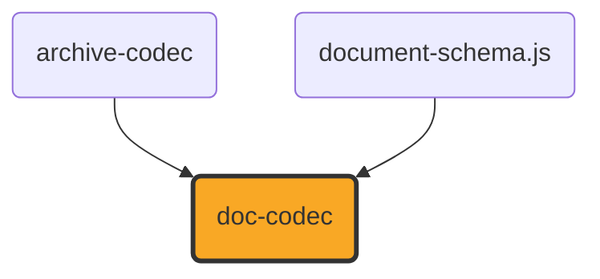

# doc-codec

[](https://github.com/ExaDev/documents.js/tree/main/packages/doc-codec) [](https://www.npmjs.com/package/doc-codec) [](https://www.npmjs.com/package/doc-codec) [](https://github.com/ExaDev/documents.js/actions)

> A hand-written, dependency-minimal reader for the Word Binary File Format (`.doc`, [MS-DOC]) against the shared [`document-schema.js`](../document-schema.js/README.md) content pivot.

`.doc` is the pre-2007 Word format: a binary document living inside an [MS-CFB] compound file, with none of the XML that makes `.docx` tractable. Its text is not stored contiguously, its formatting is stored as sparse exceptions on 512-byte pages, and every structure in it is addressed by a character position that only becomes a byte offset by passing through a piece table. `doc-codec` reads that structure by hand from the published specification, exactly as `ooxml.js` reads `.docx` and `odf.js` reads `.odt`, and produces the same `ContentDocument` all three target.

## Status

**Under active development. This package reads; it does not write.**

Built and shipped:

- **The compound-file container and the FIB** — `readDocStreams` resolves the `WordDocument` stream and whichever of `1Table`/`0Table` `FibBase.fWhichTblStm` selects, then parses the File Information Block for the counts and offsets every later step needs.
- **The piece table** — `parseClx` resolves a `Clx` (skipping any leading `Prc` array) into the pieces the logical text stream is assembled from, including the compressed 8-bit spelling and its halved byte offset.
- **Text reconstruction** — `readTextRange` turns a range of character positions into real characters through [MS-DOC] 2.4.1's own Retrieving Text algorithm, applying the specification's byte-to-code-point mapping for compressed pieces, and returns each character's byte offset alongside it.
- **Character and paragraph formatting** — the `PlcBteChpx`/`PlcBtePapx` bin tables and the `ChpxFkp`/`PapxFkp` pages behind them, the `Sprm`/`Prl` operand-sizing rules, and the subset of the character- and paragraph-property tables listed under [What is converted](#what-is-converted).
- **The style sheet** — `parseStsh` reads each style's index, name, kind and parent, and `headingLevelFromIstd` applies `sprmPIstd`'s own rule that an `istd` of 1 through 9 states an outline level.
- **`readDocContent`** — the whole chain, producing a `'wordprocessing'` `ContentDocument` of paragraphs and runs.
- **`isDocBytes`** — distinguishes a `.doc` from the `.xls`, `.ppt` and OLE embeddings that share its container, by looking for a `WordDocument` stream carrying `FibBase.wIdent`.

**Not built, and not approximated.** Each of these is a genuine layer of [MS-DOC] that this package does not implement; none is silently faked, and a document using one reads as though it did not:

| Absent                                  | Consequence                                                                                                                                                                                                                                                                              |
| --------------------------------------- | ---------------------------------------------------------------------------------------------------------------------------------------------------------------------------------------------------------------------------------------------------------------------------------------- |
| **Writing**                             | There is no `writeDoc`. The package is read-only.                                                                                                                                                                                                                                        |
| **Tables**                              | A table's cells read as ordinary paragraphs in document order, with no `ContentTable` and no row or column structure. Cell marks end paragraphs; `sprmPFInTable`/`sprmPFTtp` are parsed but not yet acted on.                                                                            |
| **Images and drawn objects**            | The anchor characters (`U+0001`, `U+0008`) are dropped rather than emitted as control characters. No picture data is read.                                                                                                                                                               |
| **Style-inherited formatting**          | A style's own property sets live in the `STD`'s `grLPUpxSw` and are not read, so a paragraph's formatting is the document defaults plus its own direct exceptions. A `Heading 1` paragraph reports its `styleId` and `headingLevel` but not the boldness or size its style would supply. |
| **Subdocuments**                        | Only the main document (character positions 0 to `ccpText`) is converted. Footnotes, endnotes, headers, footers, comments and text boxes are not.                                                                                                                                        |
| **Section properties**                  | Section boundaries are not read, so the whole document is one section, and its page size and margins are a US Letter placeholder rather than the document's own.                                                                                                                         |
| **Numbering definitions**               | `sprmPIlfo`/`sprmPIlvl` are read into a `list` membership, but the `PlfLfo`/`PlfLst` tables that say what the list looks like are not, so no marker text or numbering format is available.                                                                                               |
| **Metadata**                            | Title, author and dates live in `SummaryInformation` property-set streams ([MS-OLEPS], not [MS-DOC]) and are not read; `metadata` is empty.                                                                                                                                              |
| **Encryption**                          | An encrypted or XOR-obfuscated document is refused with a `DocUnsupportedError` rather than read as plaintext.                                                                                                                                                                           |
| **`sprmPHugePapx` / `sprmPTableProps`** | Paragraph properties stored indirectly in the Data stream are not followed, so such a paragraph reads with fewer properties than it states.                                                                                                                                              |

One construct is refused rather than mis-read: a `sprmPChgTabs` whose `cb` is the `255` sentinel encodes its own length as a formula over tab-stop counts this package does not parse, and its length is needed to find the next `Prl`. Rather than guess and silently mis-read every property after it, `operandSize` throws.

## What is converted

Character properties, from `Chpx` grpprls:

| Sprm                                                                    | Becomes                                                                                           |
| ----------------------------------------------------------------------- | ------------------------------------------------------------------------------------------------- |
| `sprmCFBold` (0x0835), `sprmCFItalic` (0x0836), `sprmCFStrike` (0x0837) | `bold` / `italic` / `strike`, honouring `ToggleOperand`'s inherit (0x80) and invert (0x81) values |
| `sprmCKul` (0x2A3E)                                                     | `underline` (any non-zero `Kul` style)                                                            |
| `sprmCHps` (0x4A43)                                                     | `sizePt`, the operand being half-points                                                           |
| `sprmCIco` (0x2A42)                                                     | `color`, through [MS-DOC] 2.9.126's fixed palette                                                 |
| `sprmCCv` (0x6870)                                                      | `color`, from a `COLORREF`                                                                        |
| `sprmCIstd` (0x4A30)                                                    | the character style index, carried for a caller to resolve                                        |

Paragraph properties, from `PapxInFkp` grpprls:

| Sprm                                                  | Becomes                                                                 |
| ----------------------------------------------------- | ----------------------------------------------------------------------- |
| `sprmPIstd` (0x4600)                                  | `styleId` (the style's name) and `headingLevel` (via the istd 1-9 rule) |
| `sprmPJc` (0x2461), `sprmPJc80` (0x2403)              | `alignment`                                                             |
| `sprmPDxaLeft` (0x845E) / `sprmPDxaLeft80` (0x840F)   | `indentLeftPt`                                                          |
| `sprmPDxaLeft1` (0x8460) / `sprmPDxaLeft180` (0x8411) | `indentFirstLinePt`                                                     |
| `sprmPDyaBefore` (0xA413), `sprmPDyaAfter` (0xA414)   | `spacingBeforePt` / `spacingAfterPt`                                    |
| `sprmPDyaLine` (0x6412)                               | `lineSpacing`, only for `LSPD`'s multiplier form                        |
| `sprmPFPageBreakBefore` (0x2407)                      | `pageBreakBefore`                                                       |
| `sprmPOutLvl` (0x2640)                                | `headingLevel`, where the istd did not already supply one               |
| `sprmPIlfo` (0x460B), `sprmPIlvl` (0x260A)            | `list` membership                                                       |

Fields are handled structurally: everything between a field-begin (`U+0013`) and a field-separator (`U+0014`) is the field's instruction and is dropped; the result between the separator and the field-end (`U+0015`) is kept. A line break (`U+000B`) inside a paragraph survives as a newline.

## Architecture

This package hand-parses [MS-DOC] against its published field tables. It depends on no third-party `.doc` reader, and its ESLint configuration bans several by name (`word-extractor`, `mammoth`, `textract`, the `cfb` package) so the decision is enforced rather than merely intended — the same bet `markdown-codec` makes against every markdown library and `pdf-codec` against `pdf-lib`.

It depends on exactly two siblings: [`archive-codec`](../archive-codec/README.md) for the [MS-CFB] container, and [`document-schema.js`](../document-schema.js/README.md) for the content pivot it produces. It does not depend on `ooxml.js`, and `ooxml.js` does not depend on it: `.doc` and `.docx` are unrelated formats that happen to share an application, and the only thing they genuinely have in common is the `ContentDocument` both target.



The modules layer in the order [MS-DOC]'s own algorithms chain:

| Module                               | What it does                                                                                                                                                                                |
| ------------------------------------ | ------------------------------------------------------------------------------------------------------------------------------------------------------------------------------------------- |
| `src/bytes.ts`                       | Bounds-checked little-endian reads; every offset in the format is attacker-controlled data, so an over-read fails loudly.                                                                   |
| `src/plc.ts`                         | The `PLC` container shape, whose element count is derived from its total size by [MS-DOC] 2.2.2's own formula, and the "largest key at most" lookup every algorithm phrases in those words. |
| `src/fib/`                           | The FIB's field offsets, derived by summing the declared field sizes, and the parse that reads the counts and offsets from them.                                                            |
| `src/text/piece-table.ts`            | The `Clx` and its `PlcPcd`, and the character-position-to-byte-offset mapping.                                                                                                              |
| `src/text/characters.ts`             | Text reconstruction, including the compressed-byte mapping table.                                                                                                                           |
| `src/text/special.ts`                | The characters that carry structure rather than glyphs.                                                                                                                                     |
| `src/prop/sprm.ts`                   | `Sprm` decoding and the operand-size table that makes a grpprl walkable.                                                                                                                    |
| `src/prop/fkp.ts`                    | The formatted disk pages and the bin tables that address them.                                                                                                                              |
| `src/prop/chp.ts`, `src/prop/pap.ts` | Folding a grpprl into character and paragraph properties.                                                                                                                                   |
| `src/style/stsh.ts`                  | The style sheet.                                                                                                                                                                            |
| `src/read.ts`                        | The whole chain, to a `ContentDocument`.                                                                                                                                                    |

### Why the piece table gets the most attention

A `.doc`'s text is assembled from pieces, each naming a byte range of the `WordDocument` stream and the character positions that range supplies, and every other structure in the format addresses text by character position. Two details carry most of the risk, and both live in one 32-bit field: the low 30 bits are a byte offset, and bit 30 says whether the piece's characters are 16-bit (offset used as-is) or 8-bit (the real offset being that value **halved**). Forget the halving and the reader does not fail — it produces real characters from the wrong place in the stream.

That is the failure mode this package is built to avoid throughout: a binary parser that guesses does not crash, it corrupts. So every structure here was implemented against the specification's own field tables, with a failing test written first from those tables, and the piece table is additionally tested against [MS-DOC] 2.9.6's published worked example — the same `Clx`, the same four character positions, the same three pieces, the same `"Hello World."` the specification says they assemble to.

## Getting started

Requires Node.js `>=20` and pnpm `11.6.0` (pinned via `packageManager` in `package.json`).

```sh
pnpm install
pnpm build
pnpm test
```

```ts
import { readDocContent, isDocBytes } from "doc-codec";

const bytes = new Uint8Array(await file.arrayBuffer());
if (isDocBytes(bytes)) {
  const document = readDocContent(bytes);
  // document.kind === "wordprocessing"
}
```

`readDocContent` throws a `DocFormatError` when the bytes do not conform to [MS-DOC], and a `DocUnsupportedError` when they conform but use a feature this package deliberately refuses rather than approximates (encryption, or the `sprmPChgTabs` sentinel above).

## Worker-isomorphic

Like every foundation and format-codec package in this family, `doc-codec`'s published `src/` imports no `node:*` module and uses no Node-only global. The whole surface is byte arithmetic over `Uint8Array` and `DataView`, with no I/O of its own. A `test:workers` suite runs the reader inside workerd, the real Cloudflare Workers runtime, so the property is a runtime-checked fact rather than an assertion.

## Testing

Every structure is tested against bytes hand-assembled from [MS-DOC]'s own field tables rather than dumped from a real Word file, and the test-support builders (`src/test-support/`) place each field by adding up the specification's declared sizes while the parsers read them from independently derived constants — so the two agree only if both match the specification. `buildDoc` assembles a whole synthetic `.doc`: a real compound file, a real FIB, a real piece table, real FKP pages, and a real style sheet, wired together with the offsets a producer would compute.

There is no real-world conformance corpus. That is a genuine gap, not an oversight: the tests prove this reader matches the published specification, which is not the same as proving it matches what Word actually wrote between 1997 and 2007. Anyone extending this package should treat a corpus as the next thing worth building.

## Specification

Every structure in this package cites the section of [MS-DOC] it implements. The specification is published by Microsoft under its Open Specifications programme:

- [[MS-DOC]: Word (.doc) Binary File Format](https://learn.microsoft.com/en-us/openspecs/office_file_formats/ms-doc/) — in particular [Fib](https://learn.microsoft.com/en-us/openspecs/office_file_formats/ms-doc/9aeaa2e7-4a45-468e-ab13-3f6193eb9394), [Retrieving Text](https://learn.microsoft.com/en-us/openspecs/office_file_formats/ms-doc/01d5d8c4-cf9c-4ef9-80fd-439e763cfe01), [Clx](https://learn.microsoft.com/en-us/openspecs/office_file_formats/ms-doc/bad26767-b575-44d3-9da3-96378d56ce14), [FcCompressed](https://learn.microsoft.com/en-us/openspecs/office_file_formats/ms-doc/aa2e55a2-f4f2-4795-bab5-6d9d7a0ed249), [ChpxFkp](https://learn.microsoft.com/en-us/openspecs/office_file_formats/ms-doc/f5f10f04-d4cc-4ebd-86df-0de6d227675c), [PapxFkp](https://learn.microsoft.com/en-us/openspecs/office_file_formats/ms-doc/34aaeaf3-9578-41af-a3f5-c12f6f66bf1b), [PapxInFkp](https://learn.microsoft.com/en-us/openspecs/office_file_formats/ms-doc/580510b8-df7a-467e-a51c-0d71eb15c7cd), [Sprm](https://learn.microsoft.com/en-us/openspecs/office_file_formats/ms-doc/099eb99c-a927-4caf-a80c-66254ea83d6a), [Character Properties](https://learn.microsoft.com/en-us/openspecs/office_file_formats/ms-doc/7022285b-9621-42e9-ad4d-4e02c115ef18), [Paragraph Properties](https://learn.microsoft.com/en-us/openspecs/office_file_formats/ms-doc/484822ee-a9d9-4af4-8423-29fda67a6a58), and [STSH](https://learn.microsoft.com/en-us/openspecs/office_file_formats/ms-doc/c8ee0f39-02c3-4caa-b27a-6a97600130fe).
- [[MS-CFB]: Compound File Binary File Format](https://learn.microsoft.com/en-us/openspecs/windows_protocols/ms-cfb/) — the container, read through `archive-codec`.

## Licence

MIT. See [LICENSE](LICENSE).
