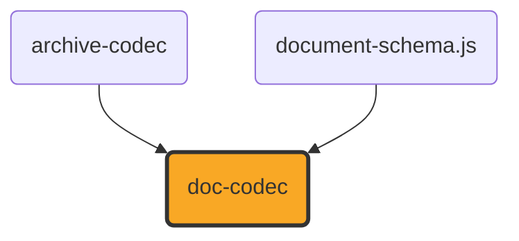

# doc-codec

[](https://github.com/ExaDev/documents.js/tree/main/packages/doc-codec) [](https://www.npmjs.com/package/doc-codec) [](https://www.npmjs.com/package/doc-codec) [](https://github.com/ExaDev/documents.js/actions)

> A hand-written, dependency-minimal reader and writer for the Word Binary File Format (`.doc`, [MS-DOC]) against the shared [`document-schema.js`](../document-schema.js/README.md) content pivot.

`.doc` is the pre-2007 Word format: a binary document living inside an [MS-CFB] compound file, with none of the XML that makes `.docx` tractable. Its text is not stored contiguously, its formatting is stored as sparse exceptions on 512-byte pages, and every structure in it is addressed by a character position that only becomes a byte offset by passing through a piece table. `doc-codec` reads that structure by hand from the published specification, exactly as `ooxml.js` reads `.docx` and `odf.js` reads `.odt`, and produces the same `ContentDocument` all three target.

## Status

**Under active development. This package both reads and writes, over a smaller surface on the write side than the read side covers.**

Built and shipped, on the read side:

- **The compound-file container and the FIB** — `readDocStreams` resolves the `WordDocument` stream and whichever of `1Table`/`0Table` `FibBase.fWhichTblStm` selects, then parses the File Information Block for the counts and offsets every later step needs.
- **The piece table** — `parseClx` resolves a `Clx` (skipping any leading `Prc` array) into the pieces the logical text stream is assembled from, including the compressed 8-bit spelling and its halved byte offset.
- **Text reconstruction** — `readTextRange` turns a range of character positions into real characters through [MS-DOC] 2.4.1's own Retrieving Text algorithm, applying the specification's byte-to-code-point mapping for compressed pieces, and returns each character's byte offset alongside it.
- **Character and paragraph formatting** — the `PlcBteChpx`/`PlcBtePapx` bin tables and the `ChpxFkp`/`PapxFkp` pages behind them, the `Sprm`/`Prl` operand-sizing rules, and the subset of the character- and paragraph-property tables listed under [What is converted](#what-is-converted), now including `sprmCRgFtc0`'s font-table lookup (see [The font table](#the-font-table)).
- **The style sheet** — `parseStsh` reads each style's index, name, kind and parent, and `headingLevelFromIstd` applies `sprmPIstd`'s own rule that an `istd` of 1 through 9 states an outline level.
- **`readDocContent`** — the whole chain, producing a `'wordprocessing'` `ContentDocument` of paragraphs and runs.
- **`isDocBytes`** — distinguishes a `.doc` from the `.xls`, `.ppt` and OLE embeddings that share its container, by looking for a `WordDocument` stream carrying `FibBase.wIdent`.

Built and shipped, on the write side — see [Writing](#writing) for the full scope statement:

- **`writeDocContent`** — a `'wordprocessing'` `ContentDocument` (one section, paragraphs of runs) to genuine [MS-DOC] bytes: a real piece table, real `ChpxFkp`/`PapxFkp` pages (splitting across as many as a document's own formatting needs, not just the common one-page case), a spec-conformant empty style sheet, and a font table when a run names one — wrapped in a real [MS-CFB] compound file via `archive-codec`'s `writeCompoundFile`.
- Every property `writeDocContent` writes is verified by reading it back through this package's own `readDocContent` (`src/write.test.ts`), and additionally against a real, independent [MS-DOC] implementation: LibreOffice opened, rendered, and re-exported a `writeDocContent` sample without error or content loss, including bold/italic/underline/strike/size/colour/font-family runs, paragraph alignment and indentation, and non-Latin-1 and non-BMP text (accented Latin, CJK, an emoji surrogate pair).

**Not built, and not approximated, on either side.** Each of these is a genuine layer of [MS-DOC] that this package does not implement; none is silently faked, and a document using one reads (or fails to write) as though it did not:

| Absent                                                          | Consequence                                                                                                                                                                                                                                                                                                                                                                                                                                                                    |
| --------------------------------------------------------------- | ------------------------------------------------------------------------------------------------------------------------------------------------------------------------------------------------------------------------------------------------------------------------------------------------------------------------------------------------------------------------------------------------------------------------------------------------------------------------------ |
| **Tables**                                                      | A table's cells read as ordinary paragraphs in document order, with no `ContentTable` and no row or column structure. Cell marks end paragraphs; `sprmPFInTable`/`sprmPFTtp` are parsed but not yet acted on. `writeDocContent` refuses a `ContentTable` block with `DocUnsupportedError` rather than flattening it.                                                                                                                                                           |
| **Images and drawn objects**                                    | The anchor characters (`U+0001`, `U+0008`) are dropped rather than emitted as control characters. No picture data is read. `writeDocContent` refuses an image block.                                                                                                                                                                                                                                                                                                           |
| **Style-inherited formatting**                                  | A style's own property sets live in the `STD`'s `grLPUpxSw` and are not read, so a paragraph's formatting is the document defaults plus its own direct exceptions. A `Heading 1` paragraph reports its `styleId` and `headingLevel` but not the boldness or size its style would supply. `writeDocContent` writes no paragraph styles at all (every paragraph is `istd` 0) and does not round-trip `styleId`/`headingLevel`.                                                   |
| **Subdocuments**                                                | Only the main document (character positions 0 to `ccpText`) is converted. Footnotes, endnotes, headers, footers, comments and text boxes are not, in either direction.                                                                                                                                                                                                                                                                                                         |
| **Section properties**                                          | Section boundaries are not read, so the whole document is one section, and its page size and margins are a US Letter placeholder rather than the document's own. `writeDocContent` refuses a `ContentDocument` with more than one section, rather than silently merging their content into what would read back as one.                                                                                                                                                        |
| **Numbering definitions**                                       | `sprmPIlfo`/`sprmPIlvl` are read into a `list` membership, but the `PlfLfo`/`PlfLst` tables that say what the list looks like are not, so no marker text or numbering format is available. `writeDocContent` does not write `PlfLfo`/`PlfLst` or `sprmPIlfo`/`sprmPIlvl`, so `ContentParagraph.list` is not round-tripped.                                                                                                                                                     |
| **Metadata**                                                    | Title, author and dates live in `SummaryInformation` property-set streams ([MS-OLEPS], not [MS-DOC]) and are not read or written; `metadata` is always empty on read, and ignored on write.                                                                                                                                                                                                                                                                                    |
| **Encryption**                                                  | An encrypted or XOR-obfuscated document is refused with a `DocUnsupportedError` rather than read as plaintext. `writeDocContent` never encrypts.                                                                                                                                                                                                                                                                                                                               |
| **`sprmPHugePapx` / `sprmPTableProps`**                         | Paragraph properties stored indirectly in the Data stream are not followed, so such a paragraph reads with fewer properties than it states. `writeDocContent` never writes an indirect Papx.                                                                                                                                                                                                                                                                                   |
| **Hyperlinks and fields**                                       | `ContentRun.hyperlink`, footnote/comment/annotation references, and every other field or anchor character are read as plain text or dropped (see [What is converted](#what-is-converted)) and are not written.                                                                                                                                                                                                                                                                 |
| **Right-margin paragraph indent**                               | `pap.ts`'s reader folds `sprmPDxaRight` into an internal `indentRightPt`, but `ContentParagraphSchema` (`document-schema.js`) carries no field for it, so no reader output and no writer input can ever carry it.                                                                                                                                                                                                                                                              |
| **Every FIB field beyond what this package's own reader needs** | `writeDocContent` populates only the fc/lcb pairs its own reader consults (the style sheet, the two property bin tables, the Clx, the font table). Roughly 140 other `FibRgFcLcb97` pairs — `SttbfAssoc`, `Dop`, the printer-driver structures among them — are left zero, which is the format's own "undefined, MUST be ignored" contract for most of them, but not a certification that every third-party [MS-DOC] reader accepts the result; see `fib/write.ts`'s own note. |

One construct is refused rather than mis-read: a `sprmPChgTabs` whose `cb` is the `255` sentinel encodes its own length as a formula over tab-stop counts this package does not parse, and its length is needed to find the next `Prl`. Rather than guess and silently mis-read every property after it, `operandSize` throws.

## What is converted

Character properties, from `Chpx` grpprls:

| Sprm                                                                    | Becomes                                                                                                   |
| ----------------------------------------------------------------------- | --------------------------------------------------------------------------------------------------------- |
| `sprmCFBold` (0x0835), `sprmCFItalic` (0x0836), `sprmCFStrike` (0x0837) | `bold` / `italic` / `strike`, honouring `ToggleOperand`'s inherit (0x80) and invert (0x81) values         |
| `sprmCKul` (0x2A3E)                                                     | `underline` (any non-zero `Kul` style)                                                                    |
| `sprmCHps` (0x4A43)                                                     | `sizePt`, the operand being half-points                                                                   |
| `sprmCIco` (0x2A42)                                                     | `color`, through [MS-DOC] 2.9.126's fixed palette                                                         |
| `sprmCCv` (0x6870)                                                      | `color`, from a `COLORREF`                                                                                |
| `sprmCIstd` (0x4A30)                                                    | the character style index, carried for a caller to resolve                                                |
| `sprmCRgFtc0` (0x4A4F)                                                  | `fontFamily`, looked up by index in the document's own font table (see [The font table](#the-font-table)) |

Paragraph properties, from `PapxInFkp` grpprls:

| Sprm                                                  | Becomes                                                                 |
| ----------------------------------------------------- | ----------------------------------------------------------------------- |
| `sprmPIstd` (0x4600)                                  | `styleId` (the style's name) and `headingLevel` (via the istd 1-9 rule) |
| `sprmPJc` (0x2461), `sprmPJc80` (0x2403)              | `alignment`                                                             |
| `sprmPDxaLeft` (0x845E) / `sprmPDxaLeft80` (0x840F)   | `indentLeftPt`                                                          |
| `sprmPDxaLeft1` (0x8460) / `sprmPDxaLeft180` (0x8411) | `indentFirstLinePt`                                                     |
| `sprmPDyaBefore` (0xA413), `sprmPDyaAfter` (0xA414)   | `spacingBeforePt` / `spacingAfterPt`                                    |
| `sprmPDyaLine` (0x6412)                               | `lineSpacing`, only for `LSPD`'s multiplier form                        |
| `sprmPFPageBreakBefore` (0x2407)                      | `pageBreakBefore`                                                       |
| `sprmPOutLvl` (0x2640)                                | `headingLevel`, where the istd did not already supply one               |
| `sprmPIlfo` (0x460B), `sprmPIlvl` (0x260A)            | `list` membership                                                       |

Fields are handled structurally: everything between a field-begin (`U+0013`) and a field-separator (`U+0014`) is the field's instruction and is dropped; the result between the separator and the field-end (`U+0015`) is kept. A line break (`U+000B`) inside a paragraph survives as a newline.

### The font table

`sprmCRgFtc0` names a font by an index into `SttbfFfn` ([MS-DOC] 2.9.253), a string table whose entries are `FFN` records ([MS-DOC] 2.9.87) — a fixed head of font-substitution metadata (family, weight, character set, a Panose and a `FontSignature`) this package neither reads nor writes meaningfully, followed by the font's own name as a null-terminated UTF-16 string. `src/style/fonts.ts` reads and writes this table: `parseFontTable` resolves the name at each index for `sprmCRgFtc0` to look up, and `buildFontTable` (used only by the writer) emits one entry per distinct font name a document's runs use, with every metadata field beyond the name itself zeroed — this package writes a font NAME for `ContentRun.fontFamily` to round-trip, not a font-substitution profile. Only `sprmCRgFtc0` (the default, non-East-Asian, non-complex-script font) is read or written; `sprmCRgFtc1`/`sprmCRgFtc2`/`sprmCFtcBi` are not.

## Writing

`writeDocContent` takes a `'wordprocessing'` `ContentDocument` with exactly one section and produces real [MS-DOC] bytes wrapped in a real [MS-CFB] compound file, inverting every read-side structure listed above: a real piece table (`text/piece-table-write.ts`, always one uncompressed 16-bit piece — see [Why always uncompressed](#why-the-writer-always-writes-uncompressed-text)), `Sprm`-encoded grpprls for each run's and paragraph's own direct formatting (`prop/chp-write.ts`, `prop/pap-write.ts`), `ChpxFkp`/`PapxFkp` pages packed and split across as many 512-byte pages as the content needs (`prop/fkp-write.ts`), a spec-conformant style sheet carrying zero styles (`style/stsh.ts`'s `buildEmptyStsh` — `FibRgFcLcb97.lcbStshf` "MUST be a nonzero value", so a document is never written without one, even though this package's own reader tolerates a missing one), and a font table when at least one run names a font (`style/fonts.ts`).

Character properties this writer converts, the exact inverse of [What is converted](#what-is-converted)'s character table above: `bold`, `italic`, `strike`, `underline` (as `kulSingle`, the only style a plain boolean can express), `sizePt`, `color` (via `sprmCCv`'s exact `COLORREF`, never the lossy 17-entry `sprmCIco` palette), and `fontFamily`. Paragraph properties: `alignment` (the four `ST_Jc`-aligned values this package's reader itself maps — `left`/`center`/`right`/`justify`), `indentLeftPt`, `indentFirstLinePt`, `spacingBeforePt`, `spacingAfterPt`, `lineSpacing` (only `LSPD`'s multiplier form, matching the reader), and `pageBreakBefore`.

**Deliberately not handled**, beyond what the read-side scope table above already states applies to both directions:

| Absent                                            | Consequence                                                                                                                                                                                                                                      |
| ------------------------------------------------- | ------------------------------------------------------------------------------------------------------------------------------------------------------------------------------------------------------------------------------------------------ |
| **Paragraph styles**                              | Every paragraph is written with `istd` 0 ("Normal"); `ContentParagraph.styleId` and `.headingLevel` are not written, and the style sheet this writer produces carries no styles for a future writer to target.                                   |
| **More than one section**                         | `writeDocContent` throws `DocUnsupportedError` for a `ContentDocument` with more than one `ContentSection`, rather than silently concatenating their blocks into what this package's own reader would read back as one anyway.                   |
| **Non-paragraph blocks**                          | A `ContentTable`, image, page break, embedded object, or construct-boundary marker block throws `DocUnsupportedError` naming its own `kind`.                                                                                                     |
| **An empty `ContentDocument.sections[0].blocks`** | Written as a single paragraph with no runs — [MS-DOC] 2.4.2 requires the Main Document's own text to end in a paragraph mark, so an otherwise-empty section still needs one to hold it, exactly as a real producer's own blank document has one. |

### Why the writer always writes uncompressed text

`writeDocContent` writes every piece as 16-bit (uncompressed) text, never the 8-bit compressed spelling the reader also understands. A compressed piece can only represent the bytes [MS-DOC] 2.4.1's own compressed-character table maps ([`COMPRESSED_CHARACTER_MAP`](src/text/characters.ts), effectively Windows-1252's high range with four gaps the specification itself leaves undefined), so writing compressed text would mean rejecting or mis-encoding any run outside that range — every character outside Latin-1 entirely, and four Windows-1252 code points [MS-DOC] does not define a mapping for. Always writing uncompressed sidesteps the whole question: every UTF-16 code unit, including each half of a surrogate pair for a character outside the Basic Multilingual Plane, round-trips through a 16-bit piece with no byte-mapping table to invert, verified in `write.test.ts` against accented Latin, CJK and an emoji surrogate pair together in one run.

## Architecture

This package hand-parses and hand-writes [MS-DOC] against its published field tables. It depends on no third-party `.doc` reader or writer, and its ESLint configuration bans several by name (`word-extractor`, `mammoth`, `textract`, the `cfb` package) so the decision is enforced rather than merely intended — the same bet `markdown-codec` makes against every markdown library and `pdf-codec` against `pdf-lib`.

It depends on exactly two siblings: [`archive-codec`](../archive-codec/README.md) for the [MS-CFB] container — `readCompoundFile` on the read side, `writeCompoundFile` on the write side — and [`document-schema.js`](../document-schema.js/README.md) for the content pivot it reads into and writes from. It does not depend on `ooxml.js`, and `ooxml.js` does not depend on it: `.doc` and `.docx` are unrelated formats that happen to share an application, and the only thing they genuinely have in common is the `ContentDocument` both target.



The modules layer in the order [MS-DOC]'s own algorithms chain:

| Module                                           | What it does                                                                                                                                                                                |
| ------------------------------------------------ | ------------------------------------------------------------------------------------------------------------------------------------------------------------------------------------------- |
| `src/bytes.ts`                                   | Bounds-checked little-endian reads; every offset in the format is attacker-controlled data, so an over-read fails loudly.                                                                   |
| `src/plc.ts`                                     | The `PLC` container shape, whose element count is derived from its total size by [MS-DOC] 2.2.2's own formula, and the "largest key at most" lookup every algorithm phrases in those words. |
| `src/fib/`                                       | The FIB's field offsets, derived by summing the declared field sizes, and the parse that reads the counts and offsets from them.                                                            |
| `src/text/piece-table.ts`                        | The `Clx` and its `PlcPcd`, and the character-position-to-byte-offset mapping.                                                                                                              |
| `src/text/characters.ts`                         | Text reconstruction, including the compressed-byte mapping table.                                                                                                                           |
| `src/text/special.ts`                            | The characters that carry structure rather than glyphs.                                                                                                                                     |
| `src/prop/sprm.ts`                               | `Sprm` decoding and the operand-size table that makes a grpprl walkable.                                                                                                                    |
| `src/prop/fkp.ts`                                | The formatted disk pages and the bin tables that address them.                                                                                                                              |
| `src/prop/chp.ts`, `src/prop/pap.ts`             | Folding a grpprl into character and paragraph properties.                                                                                                                                   |
| `src/style/stsh.ts`                              | The style sheet.                                                                                                                                                                            |
| `src/style/fonts.ts`                             | The font table (`SttbfFfn`/`FFN`) — read and write together, since both directions share one small, self-contained field layout.                                                            |
| `src/read.ts`                                    | The whole read chain, to a `ContentDocument`.                                                                                                                                               |
| `src/fib/write.ts`                               | Builds a real FIB for nFib 0x00C1 (Word 97), populated with the fc/lcb pairs this package's own writer needs.                                                                               |
| `src/text/piece-table-write.ts`                  | Builds a `Clx` describing the whole logical text stream as one uncompressed piece.                                                                                                          |
| `src/prop/chp-write.ts`, `src/prop/pap-write.ts` | The inverse of `chp.ts`/`pap.ts`: a run's or paragraph's direct properties to a grpprl.                                                                                                     |
| `src/prop/fkp-write.ts`                          | Packs formatting exceptions into `ChpxFkp`/`PapxFkp` pages, splitting across as many as the content needs, and builds the bin tables addressing them.                                       |
| `src/write.ts`                                   | The whole write chain, from a `ContentDocument` to real [MS-DOC] bytes in a real [MS-CFB] compound file.                                                                                    |

### Why the piece table gets the most attention

A `.doc`'s text is assembled from pieces, each naming a byte range of the `WordDocument` stream and the character positions that range supplies, and every other structure in the format addresses text by character position. Two details carry most of the risk, and both live in one 32-bit field: the low 30 bits are a byte offset, and bit 30 says whether the piece's characters are 16-bit (offset used as-is) or 8-bit (the real offset being that value **halved**). Forget the halving and the reader does not fail — it produces real characters from the wrong place in the stream.

That is the failure mode this package is built to avoid throughout: a binary parser that guesses does not crash, it corrupts. So every structure here was implemented against the specification's own field tables, with a failing test written first from those tables, and the piece table is additionally tested against [MS-DOC] 2.9.6's published worked example — the same `Clx`, the same four character positions, the same three pieces, the same `"Hello World."` the specification says they assemble to.

## Getting started

Requires Node.js `>=20` and pnpm `11.6.0` (pinned via `packageManager` in `package.json`).

```sh
pnpm install
pnpm build
pnpm test
```

```ts
import { readDocContent, writeDocContent, isDocBytes } from "doc-codec";

const bytes = new Uint8Array(await file.arrayBuffer());
if (isDocBytes(bytes)) {
  const document = readDocContent(bytes);
  // document.kind === "wordprocessing"
}

const written = writeDocContent({
  kind: "wordprocessing",
  metadata: {},
  sections: [
    {
      pageSize: { widthPt: 612, heightPt: 792 },
      margins: { topPt: 72, rightPt: 72, bottomPt: 72, leftPt: 72 },
      blocks: [{ kind: "paragraph", runs: [{ text: "Hello.", bold: true }] }],
    },
  ],
});
```

`readDocContent` throws a `DocFormatError` when the bytes do not conform to [MS-DOC], and a `DocUnsupportedError` when they conform but use a feature this package deliberately refuses rather than approximates (encryption, or the `sprmPChgTabs` sentinel above). `writeDocContent` throws a `DocUnsupportedError` for a document, section count, or block kind outside its own scope (see [Writing](#writing)) and a `DocFormatError` for a value that would need a property out of a sprm's own operand range (a font size or indent too large to fit its 2-byte operand, for instance).

## Worker-isomorphic

Like every foundation and format-codec package in this family, `doc-codec`'s published `src/` imports no `node:*` module and uses no Node-only global. The whole surface is byte arithmetic over `Uint8Array` and `DataView`, with no I/O of its own. A `test:workers` suite runs both the reader and the writer inside workerd, the real Cloudflare Workers runtime, so the property is a runtime-checked fact rather than an assertion.

## Testing

Every structure is tested against bytes hand-assembled from [MS-DOC]'s own field tables rather than dumped from a real Word file, and the read-side test-support builders (`src/test-support/`) place each field by adding up the specification's declared sizes while the parsers read them from independently derived constants — so the two agree only if both match the specification. `buildDoc` assembles a whole synthetic `.doc`: a real compound file, a real FIB, a real piece table, real FKP pages, and a real style sheet, wired together with the offsets a producer would compute.

The writer is verified the opposite way: `src/write.test.ts` reads every document `writeDocContent` produces back through this package's own `readDocContent`, including cases that force `ChpxFkp`/`PapxFkp` page-splitting (150 distinctly-formatted runs, 60 distinctly-indented paragraphs) rather than relying only on the common one-page case. Beyond the committed suite, a `writeDocContent` sample carrying every character and paragraph property this writer supports was opened, rendered, and re-exported by a real, independent [MS-DOC] implementation — LibreOffice — without error or visible content loss, confirming the bytes are genuinely conformant to a reader this package did not write, not merely self-consistent with its own.

There is no real-world conformance corpus on the read side, and the write side inherits the same gap for the same reason: the tests prove this package matches the published specification, which is not the same as proving it matches what Word itself reads or writes between 1997 and 2007. Anyone extending this package should treat a corpus as the next thing worth building.

## Specification

Every structure in this package cites the section of [MS-DOC] it implements. The specification is published by Microsoft under its Open Specifications programme:

- [[MS-DOC]: Word (.doc) Binary File Format](https://learn.microsoft.com/en-us/openspecs/office_file_formats/ms-doc/) — in particular [Fib](https://learn.microsoft.com/en-us/openspecs/office_file_formats/ms-doc/9aeaa2e7-4a45-468e-ab13-3f6193eb9394), [FibRgFcLcb97](https://learn.microsoft.com/en-us/openspecs/office_file_formats/ms-doc/0c9df81f-98d0-454e-ad84-b612cd05b1a4), [Retrieving Text](https://learn.microsoft.com/en-us/openspecs/office_file_formats/ms-doc/01d5d8c4-cf9c-4ef9-80fd-439e763cfe01), [Clx](https://learn.microsoft.com/en-us/openspecs/office_file_formats/ms-doc/bad26767-b575-44d3-9da3-96378d56ce14), [FcCompressed](https://learn.microsoft.com/en-us/openspecs/office_file_formats/ms-doc/aa2e55a2-f4f2-4795-bab5-6d9d7a0ed249), [ChpxFkp](https://learn.microsoft.com/en-us/openspecs/office_file_formats/ms-doc/f5f10f04-d4cc-4ebd-86df-0de6d227675c), [PapxFkp](https://learn.microsoft.com/en-us/openspecs/office_file_formats/ms-doc/34aaeaf3-9578-41af-a3f5-c12f6f66bf1b), [PapxInFkp](https://learn.microsoft.com/en-us/openspecs/office_file_formats/ms-doc/580510b8-df7a-467e-a51c-0d71eb15c7cd), [Sprm](https://learn.microsoft.com/en-us/openspecs/office_file_formats/ms-doc/099eb99c-a927-4caf-a80c-66254ea83d6a), [Character Properties](https://learn.microsoft.com/en-us/openspecs/office_file_formats/ms-doc/7022285b-9621-42e9-ad4d-4e02c115ef18), [Paragraph Properties](https://learn.microsoft.com/en-us/openspecs/office_file_formats/ms-doc/484822ee-a9d9-4af4-8423-29fda67a6a58), [STSH](https://learn.microsoft.com/en-us/openspecs/office_file_formats/ms-doc/c8ee0f39-02c3-4caa-b27a-6a97600130fe), [STTB](https://learn.microsoft.com/en-us/openspecs/office_file_formats/ms-doc/4a491aed-ad45-4b41-910b-082c71d5ef14), [SttbfFfn](https://learn.microsoft.com/en-us/openspecs/office_file_formats/ms-doc/18b7d35b-ad29-4723-893b-82aa30c64ced), and [FFN](https://learn.microsoft.com/en-us/openspecs/office_file_formats/ms-doc/ff407d64-3478-4b56-9b98-6dbcfc66a4ae).
- [[MS-CFB]: Compound File Binary File Format](https://learn.microsoft.com/en-us/openspecs/windows_protocols/ms-cfb/) — the container, read and written through `archive-codec`.

## Licence

MIT. See [LICENSE](LICENSE).
