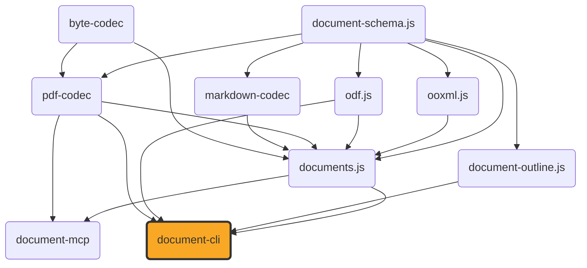

# document-cli

[](https://github.com/ExaDev/documents.js/tree/main/packages/document-cli) [](https://www.npmjs.com/package/document-cli) [](https://www.npmjs.com/package/document-cli) [](https://github.com/ExaDev/documents.js/actions)

> A command-line interface and an interactive terminal (Ink) app for [`documents.js`](https://github.com/ExaDev/documents.js): every docx/pptx/odt/odp/ods/odg/odf/pdf/odm/odb/xlsx/csv/svg/markdown/rtf/wpd/doc/xls/ppt conversion, bridge, and editor documents.js exposes, plus the outline projection [`document-outline.js`](../document-outline.js/README.md) builds over any readable document, wired up as a scriptable subcommand or a full-screen terminal editor. Installs as either `document-cli` or `doculi`.

`document-cli` adds no conversion or editing logic of its own — it is a dispatch layer over `documents.js`'s existing conversion functions, `DocumentConverter` port, live-view editors, and `.odb`/PDF readers. What it adds is two ways to drive them without writing TypeScript: a scriptable, Unix-shaped CLI (stdin/stdout, exit codes, `--json` diagnostics) for pipelines, and a full-screen Ink terminal app for browsing and editing a document interactively.



## Why

`documents.js` is a library, not a tool — everything it does happens through function calls from TypeScript/JavaScript. Most people who want to convert a docx to a PDF, extract an `.odb` table to CSV, or poke at a PDF's structure from a terminal don't want to write a script to do it. `document-cli` is that missing entry point: every one of documents.js's direct conversion pairs, its generic converter, its `.odm`/`.odb` extraction functions (including a bounded SQL engine over an `.odb`'s own tables and full report rendering), its PDF inspector, and its document metadata/source-font introspection become a single command-line invocation, and its seven live-view editors (docx/pptx/odt/odp/ods/odg/markdown) become a keyboard-driven terminal app that never needs a code editor open at all.

[`document-mcp`](../document-mcp/README.md) is the sibling frontend over the identical `documents.js` library — an MCP server rather than a terminal CLI/TUI — so the two are independent consumers of one shared implementation, each exposing whatever subset of it suits a human at a terminal versus an MCP-speaking agent.

The CLI and the TUI are deliberately not two separate implementations of the same logic. The TUI's own document-opening, saving, and PDF-export code (`src/tui/format/`) calls the identical `documents.js` functions the CLI commands call — `openDocx`/`createDocx`/`docxToPdf` and their five siblings per format, plus `readOdbTables`/`readPdf` for the two read-only sources — so there is exactly one place either surface can drift from what documents.js itself does: nowhere. This CLI adds no conversion logic of its own, so a conversion's fidelity — which pairs round-trip losslessly, which are a best-effort reconstruction, and why — is exactly what [`documents.js`'s own Fidelity section](../documents.js/README.md#fidelity) documents, table included; it is not restated here.

## Getting started

Requires Node.js `>=20`.

```sh
npm i -g document-cli
# or, identically:
npm i -g doculi
```

Both names install the exact same package and the exact same binary — `package.json`'s `bin` field declares both `document-cli` and `doculi` pointing at the one built entry point unconditionally, so there is no "real" name and an alias; pick whichever you find easier to type. Unlike a sibling's second _npm package name_ (`documents.js`'s own `js.documents` — see that package's README, and note the older per-repo pipeline's GitHub Packages republish this pattern used to mirror is no longer running, per [ExaDev/documents.js#732](https://github.com/ExaDev/documents.js/issues/732)), this is one package with two `bin` entries: a second name for the same build, not a second build, and unaffected by that gap.

## Usage

Every conversion and extraction command reads one input and writes one output. Pass `-` for either to use stdin/stdout instead of a file — useful for piping through other tools without a temp file:

```sh
document-cli docx-to-pdf report.docx report.pdf
cat report.docx | document-cli docx-to-pdf - - > report.pdf
```

### Commands

**The explicit `<source>-to-<target>` conversions** — one command per pair `createLocalDocumentConverter().conversions` declares in `documents.js` (confirmed by running the built CLI's own `formats` command, not assumed): every ordered pair of the ten content formats — docx, pptx, xlsx, odt, odp, ods, odg, svg, csv, markdown — in both directions as a PDF-bypassing bridge (a pair whose formats share one `ContentDocument` variant, like `odt-to-docx` or `ods-to-xlsx`, copies content across directly; a cross-variant pair, like `docx-to-pptx`, `xlsx-to-markdown`, or `odg-to-svg`, swaps the document's content variant through a semantic transform); each of those ten plus `odf` into pdf (`docx-to-pdf`, `xlsx-to-pdf`, `csv-to-pdf`, `svg-to-pdf`, `odf-to-pdf`, ...); and pdf back into the same ten (`pdf-to-docx`, `pdf-to-xlsx`, `pdf-to-csv`, `pdf-to-svg`, ... — there is no `pdf-to-odf`; `odf-to-pdf` is one-way, see documents.js's own README). Each takes `<input> [output]`:

```sh
document-cli docx-to-pdf report.docx report.pdf
document-cli ods-to-xlsx budget.ods budget.xlsx
```

**`convert <input> [output]`** — the same conversions through one generic command, inferring source format from the input's extension and target format from the output's extension (or `--to <format>` when the output path doesn't carry one, e.g. writing to stdout):

```sh
document-cli convert report.docx report.pdf
document-cli convert report.docx - --to pdf > report.pdf
```

**`formats`** — lists every `source -> target` pair the commands above support (`--json` for a machine-readable array), plus a pointer to the commands not on that list because they don't fit the source/target shape (`odm-to-pdf`, `odb-to-csv`, `odb-to-xlsx`, `odb-tables`, `odb-forms`, `odb-reports`, `pdf-inspect`, `from-package`, `fonts`, `docx-extras`, `metadata`, `set-metadata`, `outline`).

**`from-package <input> [output]`** — reads back a `DocumentTree` JSON file a previous conversion wrote via `--dump-package` (below) and exports it to a real target format, closing the round trip `--dump-package` otherwise has no return path for. Target resolution matches `convert`: an output path's own extension, or `--to <format>` when it doesn't have one. The package this command reads is the tree form since documents.js 3.0.0 — content grouped one group per container (section, slide, sheet, draw page) under `children`, with the minted `styles` table at the root — flattened once at this boundary, exactly as documents.js's own builders do. `pdf` rebuilds the layout from the package's own recorded positions — each content node's `frames` plus the package's `pages` geometry (`layoutDocumentFromPackage` → `writePdf`; a package no longer carries a separate `layout` half at all); every other format builds a fresh package from the flattened content through the identical `buildXPackage` function the matching `pdf-to-X`/bridge conversion already uses — `xlsx` included, via `ooxml.js`'s own `buildXlsxPackage`. `odf` is the one target rejected outright, since a standalone formula document has no write path from `ContentDocument` at all; a `csv` or `svg` target is written through the identical `buildCsvText`/`buildSvgText` functions the codec registry's own write wrappers call, so the `--delimiter`/`--sheet`/`--page` selection flags below reach it exactly as they do a live conversion. Only a file genuinely written by a current `--dump-package` round-trips here: the `$schema` URI a dump carries pins the document-schema.js release that wrote it, and any pre-4.0.0 dump — the flat `{ formatVersion, content, pages }` envelope documents.js 1.x/2.x wrote, whatever its `formatVersion` — is rejected with an error naming the pinned release, the flat-to-tree change, and the remedy, rather than a raw validation wall. A layout-document dump (a document-schema.js 3.x layout artefact, e.g. an old `pdf-inspect --full` output) gets its own pointer: that schema moved to pdf-codec.

```sh
document-cli docx-to-pdf report.docx report.pdf --dump-package report.package.json
document-cli from-package report.package.json report2.pdf
document-cli from-package report.package.json report.odt --to odt
```

**`odm-to-pdf <input> [output]`** — converts a `.odm` master document to PDF. A `.odm`'s chapters are external references to standalone `.odt` files, never inlined in the master document itself, so this command needs to be told where to find them: `--chapters-dir <dir>` (matched by each chapter's own basename) and/or repeatable `--chapter <href>=<file>` overrides. An unresolved chapter fails with every missing `href` named at once, not just the first.

**`odb-to-xlsx <input> [output]`**, **`odb-to-csv <input> [output]`**, **`odb-tables <input>`** — extract table data from an embedded `.odb` database (HSQLDB TEXT script, HSQLDB CACHED binary row store, or Firebird gbak backup — detected automatically). `odb-to-xlsx` exports every table, one sheet each; `odb-to-csv` exports exactly one table (`--table <name>`, required whenever the database declares more than one); `odb-tables` lists every table's name, columns, and row count without writing anything:

```sh
document-cli odb-tables customers.odb
document-cli odb-to-csv customers.odb --table CUSTOMERS customers.csv
```

**`odb-forms <input>`**, **`odb-reports <input>`** — read a `.odb`'s form and report _structure_ rather than its table data. A form or report is a static ODF sub-document inside the package, so neither command consults the embedded database at all: they work on an `.odb` whose connection points at an external server just as well as on an embedded one. `odb-forms` prints each form's own data source (table or saved query) and its field-bound controls, sub-forms nested under their parent with their own separate command; `odb-reports` prints each report's data-source command, its band structure (report/page headers and footers, groups, detail), every `rpt:` formula expression (`field:[AMOUNT]`, `rpt:SUM([AMOUNT])`), and any user-defined report functions. `--json` emits the same structure machine-readably — for a form that is the structure only, with the form's own parsed sub-document dropped:

```sh
document-cli odb-forms sales.odb
document-cli odb-reports sales.odb --json
```

**`odb-query <input>`** — runs a bounded single-table `SELECT` over every table an embedded `.odb` extracts (documents.js's own `src/odb/sql/` engine — no database anywhere in the path), given directly via `--sql <text>` or by naming one of the `.odb`'s own saved queries via `--query <savedName>` (the two are mutually exclusive, and one of them is required). `--json` emits the bare `{ columns, rows }` result set; otherwise a plain-text table:

```sh
document-cli odb-query sales.odb --sql "SELECT REGION, SUM(AMOUNT) FROM SALES GROUP BY REGION"
document-cli odb-query sales.odb --query HighValueSales --json
```

**`odb-render-report <input> [output]`** — renders one of an `.odb`'s own reports to a real document: its data-source command resolved and run through the same SQL engine `odb-query` uses, its `rpt:` formulas evaluated, its bands laid out, then built into `docx`, `odt`, or `pdf` — the only three targets a rendered report can become, since `readOdbReportContent` always produces a `wordprocessing`-variant document and no other format has a wordprocessing counterpart to build one into. `--report <name>` selects which report when the `.odb` declares more than one; `--to <format>` when the target can't be inferred from the output path:

```sh
document-cli odb-render-report sales.odb SalesByRegion.pdf --report SalesByRegion
```

**`pdf-inspect <input>`** — reports a PDF's page count, per-page size and item-kind histogram, document metadata, and embedded image formats, without converting it to anything. `--full` dumps the entire parsed `LayoutDocument` as plain JSON (no `$schema` stamp — that family moved to pdf-codec at document-schema.js 4.0.0 and lost its schema-stamped envelope) instead of the summary:

```sh
document-cli pdf-inspect report.pdf
document-cli pdf-inspect report.pdf --json
```

**`fonts <input>`** — lists every source-embedded font face a docx/pptx/odt/odp/ods/odg document carries (family, weight/style, byte length) — the same embedded faces every `<format>-to-pdf` conversion already extracts and renders through automatically (see [Real fonts](#real-fonts) below); this command just reports what's there without converting anything. Rejects a format with no source-embedded-font concept at all (xlsx, csv, svg, pdf, markdown, odf, rtf, wpd, doc, xls, ppt), naming it:

```sh
document-cli fonts report.docx
```

**`docx-extras <input>`** — prints a docx's own comments, footnotes, headers, footers, and numbering definitions: data `readDocxContent`'s `ContentDocument` shape has nowhere to carry, so documents.js reads it through a second, independent pass (`readDocxExtras`) over the same package. `--json` emits the raw `DocxExtras` object:

```sh
document-cli docx-extras report.docx
```

**`metadata <input>`** — prints a document's own title/author/subject/keywords/creator/producer/created/modified metadata, for any of the seventeen supported formats (docx, pptx, xlsx, odt, odp, ods, odg, svg, odf, csv, markdown, rtf, wpd, doc, xls, ppt, pdf); csv, svg, doc, xls, and ppt carry no metadata container of their own (doc-codec/xls-codec/ppt-codec don't read one yet — see each package's own README), so they always report none. `--json` emits the raw metadata object:

```sh
document-cli metadata report.pdf
```

**`set-metadata <input> [output]`** — patches a document's own title/author/subject/keywords, leaving every other field untouched (`--set-title`, `--set-author`, `--set-subject`, `--set-keywords` — the last a comma-separated list); source and target format must match, so run `convert`/`from-package` first if a different target format is also needed. A `pdf` source/target patches the parsed PDF directly (`writePdf`) with no layout engine involved — genuinely lossless for everything else on the page; every other format rebuilds a fresh package from that format's own `ContentDocument`, which for docx specifically is lossy (it drops everything `docx-extras` covers, since `buildDocxPackage` has no way to carry that data through a `ContentDocument`-only rebuild); a `csv` or `svg` source/target is rejected outright, since plain text has no metadata container and a rebuild would silently drop the override:

```sh
document-cli set-metadata report.docx report.docx --set-title "Q3 Report" --set-author "Finance"
document-cli set-metadata report.docx report.odt --set-keywords "draft,internal"
```

**`outline <input>`** — prints a document's outline: the table-of-contents projection over the tree-form `DocumentTree` read straight off the source document's own bytes — headings nested by heading level, list items nested under their heading or slide, one group per slide (labelled `Slide N`), sheet (labelled with the sheet's own name), or draw page (labelled `Page N`) — rendered as indented text, two spaces per nesting depth. Leaves render their own text (a paragraph's runs, a table's cell text, an image's alt text, a formula's LaTeX) or their kind in brackets when they carry none (`[page-break]`, `[vector]`, `[embeddedObject]`). Works on any of the seventeen readable formats: the command reads the source's own native tree directly (documents.js's `readNativeDocumentTree`) — no bridging conversion runs and no output bytes are discarded — and projects that tree through [`document-outline.js`](../document-outline.js/README.md)'s own `buildOutline`, this command being that package's first real consumer. `--json` emits the outline tree itself — groups as `{ text, level, children }`, leaves as the package leaves they are — rather than a CLI-private shape; a `pdf` source's own `readPdf` parse diagnostics still reach stderr exactly as they would on the matching `pdf-to-docx` command. `--from <format>` names the source format when the input path carries no recognised extension to infer it from — the only way to outline a document read from stdin (`-`), which otherwise has no extension to read at all. Heading nesting depends on the source document carrying a heading-level signal on disk (`w:outlineLvl` for docx, `text:outline-level` for odt) — present in anything authored by Word or LibreOffice, always present for a markdown source (whose own reader parses `#`/`##` headings directly), and also stamped by this ecosystem's own docx/odt writers (`buildDocxPackage`'s `w:outlineLvl`, `buildOdtPackage`'s promotion to a real `text:h`), so outlining a docx/odt this CLI's own conversions produce nests headings correctly too:

```sh
document-cli outline report.docx
document-cli outline slides.pptx --json
```

**`tui [file]`** — launches the interactive terminal app; see [The TUI](#the-tui) below.

### Shared flags

The explicit conversions, `convert`, `odm-to-pdf`, `odb-to-xlsx`, `odb-to-csv`, `set-metadata`, and `odb-render-report` — every command that reads one file and writes one — share:

| Flag               | Meaning                                                                                                                                                             |
| ------------------ | ------------------------------------------------------------------------------------------------------------------------------------------------------------------- |
| `-o, --out <file>` | Output path; defaults to the input path with the target format's own extension. Conflicts with a positional output argument that names a different path.            |
| `--timeout <ms>`   | Abort the run after this many milliseconds.                                                                                                                         |
| `--json`           | Emit diagnostics and the result summary as newline-delimited JSON on stderr, instead of human-readable lines.                                                       |
| `-q, --quiet`      | Suppress diagnostic and summary output (the JSON result-summary line still prints in `--json` mode, so a script consuming NDJSON always gets a terminating record). |
| `--verbose`        | Include a full stack trace in the error line when the run fails.                                                                                                    |

Three further flags select what a csv or svg edge of a conversion works on, threaded straight into documents.js's own `ConversionOptions`: `--delimiter <char>` (the field delimiter a csv source reads with, or a csv target writes with — default `,`), `--sheet <name>` (the sheet a csv target writes, required when the source document has more than one), and `--page <index>` (the 0-based page an svg target draws, required when the source document has more than one). On the explicit commands they are registered only where the pair can reach the edge in question — `--delimiter` on any pair with a csv edge, `--sheet` on a csv target, `--page` on an svg target — and unconditionally on `convert` and `from-package`, whose target is only known once the output path or `--to` resolves at run time (the same registration reasoning the font flags below document). Leaving `--sheet` or `--page` unanswered on an ambiguous document fails with exit `3`, naming the sheets or page count to pick from:

`--dump-package <file>` is one flag further, registered only on the explicit conversions and `convert` — it writes the SOURCE document's own native `DocumentTree` (documents.js's `readNativeDocumentTree`, read straight off the input bytes a second time, independent of `--to`/the output path) to a JSON file, tagged with its own version-pinned `$schema` — the URI _is_ the package's version — so `from-package` (above) can read it back in. This is deliberately not the same tree `--to`'s own conversion produces internally: a target sharing no `ContentDocument` variant with the source composes through a lossy cross-variant bridge or a pdf pivot to get there (`xlsx-to-markdown`, say), and reporting that intermediate hop's shape would mean an xlsx source's own dump carries a wordprocessing tree with no sheet/cell/formula/A1 data at all rather than the workbook it actually is ([ExaDev/documents.js#823](https://github.com/ExaDev/documents.js/issues/823)) — `--dump-package` is about what the source carries, not about how `--to` got there. Every source format populates one: a `pdf` source's dump carries `pages` and per-node `frames` (a PDF has no representation other than positioned layout — the identical reconstruction `pdf-to-docx` runs), and every other source's dump is content-only, with no `pages` and no `frames` at all, `odf` included (its dump carries a `formula`-kind content with no invented page geometry — a standalone formula document has no page concept of its own until something renders it). `odm-to-pdf`/`odb-*`/`set-metadata` don't expose the flag at all, since none of them goes through `DocumentConverter.convert` in the first place. `odb-tables`, `odb-forms`, `odb-reports`, `fonts`, `docx-extras`, `metadata`, `formats`, and `pdf-inspect` each take only their own `--json` (plus `pdf-inspect`'s own `--full`); `odb-query` takes `--sql <text>`/`--query <savedName>` (mutually exclusive) alongside its own `--json`, with none of the shared flags above since it only reads and writes nothing; `from-package` and `set-metadata` each take `--to <format>` alongside the shared flags in this table; `outline` takes the shared flags except `--out` (it prints to stdout and writes no file), plus its own `--from <format>` for a source format extension inference can't resolve — it reads the source's own native tree directly (the same `readNativeDocumentTree` primitive `--dump-package` uses), so its diagnostics and `--timeout` behave like any conversion's; `odb-render-report` takes `--report <name>` and `--to <format>` alongside the shared flags and the font flags below; `tui` takes no flags at all, only an optional positional file.

### Real fonts

By default a conversion renders through whatever `documents.js` resolves for itself: the source document's own embedded faces first, then `pdf-codec`'s vendored Carlito/Caladea substitutes (metric-compatible with Calibri/Cambria), then the standard 14 PDF fonts. `--font-file <path>` inserts your own faces between the first two steps — used wherever the document asks for the family a font file declares, and ignored where it doesn't.

```sh
document-cli docx-to-pdf report.docx report.pdf \
  --font-file ~/fonts/Calibri.ttf \
  --font-file ~/fonts/Calibri-Bold.ttf \
  --report-font-substitutions
```

The flag is repeatable, takes a `.ttf`/`.otf` path, and needs **no accompanying family flag**: the family, weight, and slope are read from the font file's own `name` and `OS/2` tables. That is a deliberate choice over the alternative of a parallel `--font-family`/`--font-bold`/`--font-italic` set — three repeatable flags whose values must stay index-aligned with a fourth is a silent-misalignment hazard (pass two font files and one `--font-family` and the second face is mis-declared, with nothing reporting it), and every real font already states all three facts itself. The consequence to know about: a font file can only be supplied _as the family it says it is_. There is no way to say "draw Calibri using this file instead" — for that, the family in the document has to match the family in the font. A file that is not a readable font (a `.woff`, a `.ttc` collection, a mistyped path pointing at something else) fails the run outright, naming the file, rather than being quietly skipped.

`--report-font-substitutions` prints each face that resolved to something other than what the document asked for, as it happens, with its structured fields intact (`--json` makes it one more NDJSON record: `{"type":"font-substitution","requestedFamily":"Calibri",…}`). Without it, the same fallbacks are still reported — the `font/substituted` diagnostic lines every conversion already emits — just as rendered messages after the fact rather than structured events as they occur.

Both flags are registered only where they can do something: the `<format>-to-pdf` conversions, `convert`, `odm-to-pdf`, and `odb-render-report`. The last two register them unconditionally (like `convert`, whose target isn't known until the output path or `--to` resolves) even though a `docx`/`odt` render has nothing to resolve fonts against — the same non-pdf no-op every other command in this list already documents. A `pdf-to-<format>` reconstruction reads a PDF's own already-positioned glyphs and a format-to-format bridge runs no layout engine at all, so neither resolves a typeface and neither advertises the flags.

Diagnostics and the summary line always go to stderr; stdout is reserved for the converted bytes on any command writing to `-`.

### Exit codes

| Code  | Meaning                                                                                                                                                                                                                                                                                                                                                                                                                                                                                                                                  |
| ----- | ---------------------------------------------------------------------------------------------------------------------------------------------------------------------------------------------------------------------------------------------------------------------------------------------------------------------------------------------------------------------------------------------------------------------------------------------------------------------------------------------------------------------------------------- |
| `0`   | Success.                                                                                                                                                                                                                                                                                                                                                                                                                                                                                                                                 |
| `1`   | The input was unusable — a malformed or encrypted PDF, or any other conversion failure not covered by the codes below.                                                                                                                                                                                                                                                                                                                                                                                                                   |
| `2`   | A usage error — bad flags, conflicting output destinations, an unrecognised format, or (for a bare/`--help`/`--version` invocation) commander's own exit path.                                                                                                                                                                                                                                                                                                                                                                           |
| `3`   | documents.js needs more information to finish, not a different file — an unresolved `.odm` chapter, a `.odb` table that wasn't specified (or wasn't found, or has no embedded engine at all, or uses an unsupported HSQLDB script serialisation), a `.odb` report that wasn't specified when the database declares more than one, a csv target whose source carries more than one sheet (or a `--sheet` that names one it doesn't), or an svg target whose source carries more than one page (or a `--page` that indexes past the last). |
| `124` | The run's own `--timeout` elapsed before it finished.                                                                                                                                                                                                                                                                                                                                                                                                                                                                                    |
| `130` | Interrupted by `SIGINT` (Ctrl+C).                                                                                                                                                                                                                                                                                                                                                                                                                                                                                                        |

## The TUI

Launch it either bare (`document-cli`, with no arguments) or explicitly with `document-cli tui [file]` — both open the same app; the explicit form additionally opens `file` immediately, skipping the launcher screen. The TUI needs an interactive terminal: a bare invocation with redirected stdout prints help text instead, and an explicit `tui` invocation with redirected stdout fails outright, since there's no terminal for Ink to draw into.

It supports the same seven formats documents.js's live-view editors cover — docx, pptx, odt, odp, ods, odg, markdown — each with a full navigate/edit/save experience built on that format's editor (paragraphs and runs for docx/odt/markdown, slides and shapes for pptx/odp, sheets and cells for ods, pages and vectors/shapes for odg), plus undo (whole-document snapshots taken before each committed mutation), search, a command palette, and PDF export straight from the open document. On a pptx or odp slide, `a` from the shape list also adds a real table (rows then columns, a two-step prompt) alongside the existing textbox/image choices, and `n` opens the slide's own speaker notes for either format — `PptxSlide` and `OdpSlide` both carry a real `.notes` getter/setter, so notes editing was never odp-specific, only gated that way until this phase removed the gate. On a docx document, `x` from the paragraph/table list opens a read-only view of the document's own comments, footnotes, headers/footers, and numbering definitions — a docx-only concept with no odt equivalent, and the TUI counterpart to the `docx-extras` command, rendered through the identical `src/docx-extras-format.ts` line formatter so the two can't drift apart. `m`, global to every screen with a document open, shows that document's own title/author/subject/keywords/etc metadata read-only — every format the `metadata` command covers, including `.odb`/`.pdf`/`.xlsx`; documents.js's live-view editors have no metadata setter to mutate in place, so this TUI has no matching write screen (use the `set-metadata` command for that).

Markdown (`.md`/`.markdown`) shares the same paragraph/run/table body-list screens docx and odt already use, through documents.js's own `MarkdownEditor` (`openMarkdown`/`createMarkdownEditor`) — a genuine live view over a mutable `ContentDocument`, the same live-view contract every other editor here follows, even though there is no `XmlElement` tree underneath it the way there is for docx/odt (`MarkdownEditor.toMarkdownText()` re-serialises the whole document fresh on every call, rather than exposing a `toBytes()`). Appending a paragraph, appending a run, and toggling bold/italic all go through the identical reducer actions docx/odt use; a markdown run has no underline, colour, font family, or font size at all (CommonMark/GFM has no construct for any of the four), so those keys — along with image insertion, which `MarkdownParagraph` has no counterpart for — are simply absent from a markdown paragraph's own key hints rather than opening a prompt that could only end in a warning. A markdown table can be created and its cells edited through the same 'T' wizard and table-view screens docx/odt use, but GFM tables have no cell-merge concept, so a merge requested alongside table creation still creates the table (unmerged) and reports why the merge itself didn't happen. `:view-source` (markdown documents only) shows the literal text the document was opened with side by side with what a save would write right now — these can genuinely differ even with no edits made this session, from a heading-style, bullet-marker, or line-ending choice the writer normalises. Every save re-serialises the whole document fresh through `buildMarkdownText`, a deliberate, permanent consequence of structured editing rather than something to work around. Diagnostics from the read side (a clamped heading level, a dropped front-matter key, a fenced code block's own info string with nowhere to go, …) now surface into the same diagnostics panel a PDF export's own substitutions already populate, the moment a `.md` file is opened, not only on export. documents.js's own `createMarkdownEditor()` exists now, but this TUI does not yet wire a "new markdown document" flow into `:new`/the new-document picker, so a markdown document can still only be opened from an existing file.

Three further kinds of format open read-only: a `.odb` browses its tables and rows with no write path at all (documents.js's own `.odb` support has no write direction to offer), a `.pdf` browses its pages and positioned items rather than being edited in place, and a `.xlsx`, `.csv`, `.svg`, `.rtf`, `.wpd`, `.doc`, `.xls`, or `.ppt` opens as a converted PDF preview — documents.js has no spreadsheet, svg, rtf, wpd, doc, xls, or ppt editor to hold a live view into (wpd-codec ships no writer at all, so a wpd document could never gain one; doc-codec/xls-codec/ppt-codec ship real writers now, but no live TUI editor targets them yet), so opening one runs `xlsxToPdf`, `csvToPdf`, `svgToPdf`, `rtfToPdf`, `convertDocument("wpd", "pdf", ...)`, `docToPdf`, `xlsToPdf`, or `pptToPdf` once at open time and browses the result through the identical page-list/page-items/item-detail screens a real `.pdf` uses, with the original bytes kept alongside so a later export re-runs the same conversion with the caller's own fonts and diagnostics rather than reusing the fixed preview conversion. A `.odb` additionally browses its _structure_ alongside its data: `f` from the table list opens the form browser and `r` the report browser, each listing what the database declares and opening one to show it in full — a form's own data source and field-bound controls (sub-forms nested under their parent), a report's data-source command, band and group structure, and every `rpt:` formula. Both are rendered through the same `src/odb-structure.ts` the `odb-forms`/`odb-reports` commands print, so the two views cannot drift apart, and search filters by line (`/SUM` narrows a long report to its aggregate expressions). `Enter` on a report's own detail screen renders it — its data-source command resolved, its `rpt:` formulas evaluated, its bands laid out — to a real `docx`/`odt`/`pdf` file, through the same two-field destination-path-then-font-list form the PDF-export screen below uses; the TUI counterpart to the `odb-render-report` command. A standalone `.odf` formula document has no TUI editor either — nothing to edit interactively, only a PDF conversion.

The export-to-PDF screen (`e` from any editor screen) is a two-field form: a destination path, then an optional comma-separated list of local `.ttf`/`.otf` paths, which are the same `--font-file` faces the CLI takes and are derived the same way — each font's family, weight, and slope come from the file itself. `Enter` on the path field moves to the fonts field and `Enter` there exports, so leaving fonts empty is still "type a path, press Enter twice". Comma-separated rather than space-separated because a font path routinely contains spaces and almost never a comma. A face falling back to a substitute is reported into the same diagnostics panel a character substitution already is, and a bad font path fails the export with the file named, before anything is written to the destination.

### Key bindings

The global bindings below apply everywhere; individual screens (a docx run's own bold/italic toggles, an ods cell's own value-kind picker) add their own on top:

| Keys                  | Action                                        |
| --------------------- | --------------------------------------------- |
| `↑` / `k`             | Move the selection up                         |
| `↓` / `j`             | Move the selection down                       |
| `Enter` / `→` / `l`   | Open or edit the selected item                |
| `Esc` / `←` / `h`     | Go back to the previous screen                |
| `PageUp` / `PageDown` | Scroll a page at a time                       |
| `Home` / `End`        | Jump to the first or last item                |
| `a`                   | Append a new item to the current list         |
| `m`                   | Show the open document's metadata (read-only) |
| `Ctrl+S`              | Save the open document                        |
| `Ctrl+W`              | Close the open document                       |
| `Ctrl+Z`              | Undo the last change                          |
| `q` / `Ctrl+C`        | Quit                                          |
| `:`                   | Open the command palette                      |
| `/`                   | Search within the current screen              |
| `?`                   | Show this help                                |
| `Ctrl+D`              | Show the diagnostics panel                    |

## Architecture

The package splits into two independent layers sharing one thin format-detection module, `src/format.ts` (extension ⇄ `DocumentFormat` inference), so a change to how a format is recognised from a path never needs making twice:

- **`src/commands/` + `src/runtime/`** is the CLI proper. `commands/shared.ts`'s `buildConversionAction(source, target)` is the one implementation behind every `<source>-to-<target>` command and the generic `convert` — it partially applies a format pair and hands back a ready commander action, so the conversion-running logic (read input, call `createLocalDocumentConverter().convert`, write output, report diagnostics, map errors to exit codes) exists exactly once regardless of which pair is invoked. `commands/{odm,odb,pdf-inspect,fonts,docx-extras,metadata}.ts` each call their own documents.js function directly instead, since none of them fits the generic `DocumentConverter` port's bytes-in/bytes-out shape (`odmToPdf` needs a `resolveSubDocument` callback, `.odb` extraction/query/report-rendering has no PDF conversion or port entry at all, `pdf-inspect` reads without converting, and `fonts`/`docx-extras`/`metadata` each read a document without producing one); `commands/outline.ts` does go through the port, but only to take `ConversionResult.package` — its output bytes are discarded and document-outline.js's `buildOutline` projects the tree instead, the one command here whose product is neither the converted bytes nor a direct documents.js read. `commands/set-metadata.ts` also bypasses `buildConversionAction` despite writing a file, since `setDocumentMetadata(source, target, bytes, overrides)` patches a document rather than converting one and requires source and target to match. `src/odb-structure.ts` sits alongside `src/format.ts` as a module shared by both layers: it turns an `OdbForm`/`OdbReport` into a flat array of already-indented lines, which the `odb-forms`/`odb-reports` commands join with newlines and the TUI's own form/report detail screens render one per list row; `src/docx-extras-format.ts` and `src/sql-result-format.ts` are the same idea for their own commands — the first turns a `DocxExtras` value into the flat line list `docx-extras` prints and the TUI's own `DocxExtrasScreen` renders, the second turns an `SqlResultSet` into an aligned plain-text table for `odb-query`. `src/runtime/` holds the process-level concerns every command shares: `abort.ts`'s `createRuntimeSignal` (one `SIGINT` listener and an optional timeout, combined into a single signal), `io.ts`'s stdin/stdout/file `-`-aware read and write helpers, `exit-codes.ts`'s exit-code constants and `mapErrorToExit`, `diagnostics.ts`'s stderr reporter, `fonts.ts`'s `loadProvidedFonts` (validating every `--font-file` path into documents.js's own `ProvidedFont` shape, shared by every font-accepting command and the TUI's own PDF-export and report-render screens), and `metadata-format.ts`'s `formatMetadataLines` (shared by `metadata`, `pdf-inspect`, and the TUI's own metadata screen).
- **`src/tui/`** is the Ink app, entered lazily. `src/cli.ts` only imports `./tui/index.js` inside a dynamic `import()`, called just once dispatch has already decided the TUI is actually running — a plain `document-cli docx-to-pdf a b` invocation never loads React, Ink, or any TUI screen module at all, and `tsdown.config.ts`'s bin build correctly code-splits the TUI into its own lazily-loaded chunk as a result. Inside the TUI, `state/reducer.ts` and `state/types.ts` hold the single `AppState` (a screen stack, the open document, undo history, overlays), `format/open-document.ts` is the one place bytes become an open document for every format, and `screens/editors/<format>/` holds each format's own screen components — reusing shared building blocks (`screens/shared/paragraph-family.tsx`, `slide-family.tsx`) between docx/odt and pptx/odp respectively, the same way documents.js's own odp editor reuses its odt paragraph/run classes.
- **`src/index.ts`** re-exports the CLI's command-layer, format, and exit-code logic (not the TUI, which stays behind its own lazy import) as this package's `"."` library export, for a caller that wants `document-cli`'s conversion-running logic directly rather than spawning the bin as a subprocess.
- **One package, two npm names.** `package.json`'s `bin` field lists `document-cli` and `doculi` unconditionally, both pointing at the same built entry point — there is no separate build, alias package, or npm alias mechanism involved, just two keys in one `bin` object.

## Build, test, and lint

```sh
pnpm build         # turbo run _build -> tsdown -> dist/ (a library build for src/index.ts, and a separate ESM-only bin build for src/cli.ts)
pnpm typecheck     # turbo run _typecheck -> tsc --noEmit
pnpm lint          # turbo run _lint -> eslint . --fix --cache --max-warnings 0
pnpm test          # turbo run _test -> vitest run --project unit
pnpm test:watch    # vitest --project unit
pnpm test:smoke    # turbo run _test:smoke -> tsdown, then vitest run --project smoke -- spawns the built dist/cli.js as a real child process
pnpm test:workers  # turbo run _test:workers -> vitest run --config vitest.workers.config.ts -- runs the thin isomorphic slice (src/sql-result-format.ts, src/runtime/exit-codes.ts) under the real Cloudflare Workers runtime (workerd), proving the wrapped documents.js paths execute inside a workerd isolate with no Node-only API usage
```

## Gotchas

- **The lazy TUI import is load-bearing, not incidental.** `src/cli.ts` computes the dispatch token before doing anything else and only reaches `await import('./tui/index.js')` on the bare/`tui` branch — every other command path (all explicit conversions, `convert`, `formats`, `from-package`, `odm-to-pdf`, `odb-*`, `pdf-inspect`, `fonts`, `docx-extras`, `metadata`, `set-metadata`, `outline`) never touches that import at all. This is what keeps a scripted, high-frequency CLI invocation from paying React/Ink's module-load cost on every call.
- **A bare invocation and an explicit `tui` invocation fail differently on non-interactive stdout.** `document-cli` with no arguments and redirected stdout prints help and exits `0`, on the assumption that a bare invocation piped somewhere was more likely a forgotten argument than a deliberate TUI request. `document-cli tui` with redirected stdout is unambiguous, so it fails outright (exit `2`) rather than silently reinterpreting it as a help request.
- **`tsdown.config.ts` disables `fixedExtension` on both build passes.** `platform: 'node'` defaults tsdown's `fixedExtension` to `true`, which would emit `dist/cli.mjs`/`dist/index.mjs` regardless of `package.json`'s own `"type": "module"` — mismatching the `.js`/`.cjs` paths `bin` and `exports` actually name. Both entries set `fixedExtension: false` explicitly so the build output matches what's published.
- **`readOdbTables` needs `decodeOdbPackage` from `documents.js`, not `decodePackage`.** `documents.js`'s own `decodePackage` re-exports `ooxml.js`'s OOXML-only reader and cannot decode an ODF `.odb` container at all; `decodeDocumentPackage(format, bytes)` dispatches to `odf.js` internally for every real `DocumentFormat` member (odt/odp/ods/odg/odf), but `.odb` is deliberately not one of those (it has no PDF conversion and no write direction — see documents.js's own README), so it has no format string to pass either. `decodeOdbPackage` is the `.odb`-specific sibling that decodes the identical raw ODF container directly — `commands/odb.ts` and the TUI's `format/open-document.ts` both use it for exactly this reason. `odf.js` and `pdf-codec` are devDependencies only: every runtime reach into them (the spreadsheet grid's `cellReference`/`columnIndexToLetters` for A1-style cell/column labelling, font-file inspection via `describeFontFace`) now goes through `documents.js`'s own re-exports, and `odf.js` survives in `devDependencies` solely because `src/test-support/embedded-font-fixture.ts` builds real ODF package fixtures from its low-level XML primitives.
- **A TUI screen must call an editor's own accessors fresh on every render, never cache them.** documents.js's live-view editors (`DocxRun`, `OdtParagraph`, `OdsCell`, ...) mutate the real XML tree in place — `editor.paragraphs()`/`slide.shapes()`/`sheet.cell(r, c)` called once and stored in `useState`/`useMemo` goes stale the instant any screen mutates the underlying document, with nothing in the type system or in React to catch it (see `src/tui/state/types.ts`'s own doc comment on `Screen`).
- **The conversions this CLI runs carry the same fidelity limits documents.js itself documents** — most notably that PDF-pivot conversions are not round-trip-lossless (line wrapping drifts under standard-14 font substitution, justified text renders left-aligned, tables and vector shapes don't reconstruct from a PDF), and that `pdf-to-ods` recovers only what a spreadsheet printed, never a real number/date/formula. None of that is specific to this CLI or the TUI; see documents.js's own README, particularly its [Fidelity](../documents.js/README.md#fidelity) section, for the full, format-by-format account.

## Contributing

Release, CI, and commit-message conventions are all workspace-wide, not package-local — see the [monorepo root README](../../README.md#releases) for the release mechanism and [CONTRIBUTING.md](../../CONTRIBUTING.md) for the shared git hooks and history conventions. Work inside `packages/document-cli/`.

## License

MIT
