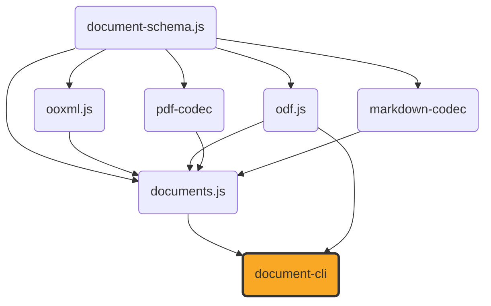

# document-cli

[](https://github.com/ExaDev/document-cli) [](https://www.npmjs.com/package/document-cli) [](https://github.com/ExaDev/document-cli/releases/latest) [](https://github.com/ExaDev/document-cli/actions)

> A command-line interface and an interactive terminal (Ink) app for [`documents.js`](https://github.com/ExaDev/documents.js): every docx/pptx/odt/odp/ods/odg/odf/odm/odb conversion, bridge, and editor documents.js exposes, wired up as a scriptable subcommand or a full-screen terminal editor. Installs as either `document-cli` or `doculi`.

`document-cli` adds no conversion or editing logic of its own — it is a dispatch layer over `documents.js`'s existing conversion functions, `DocumentConverter` port, live-view editors, and `.odb`/PDF readers. What it adds is two ways to drive them without writing TypeScript: a scriptable, Unix-shaped CLI (stdin/stdout, exit codes, `--json` diagnostics) for pipelines, and a full-screen Ink terminal app for browsing and editing a document interactively.



## Why

`documents.js` is a library, not a tool — everything it does happens through function calls from TypeScript/JavaScript. Most people who want to convert a docx to a PDF, extract an `.odb` table to CSV, or poke at a PDF's structure from a terminal don't want to write a script to do it. `document-cli` is that missing entry point: every one of documents.js's 27 direct conversion pairs, its generic converter, its `.odm`/`.odb` extraction functions, and its PDF inspector become a single command-line invocation, and its six live-view editors (docx/pptx/odt/odp/ods/odg) plus its line-based markdown editor become a keyboard-driven terminal app that never needs a code editor open at all.

The CLI and the TUI are deliberately not two separate implementations of the same logic. The TUI's own document-opening, saving, and PDF-export code (`src/tui/format/`) calls the identical `documents.js` functions the CLI commands call — `openDocx`/`createDocx`/`docxToPdf` and their five siblings per format, plus `readOdbTables`/`readPdf` for the two read-only sources — so there is exactly one place either surface can drift from what documents.js itself does: nowhere.

## Getting started

Requires Node.js `>=20`.

```sh
npm i -g document-cli
# or, identically:
npm i -g doculi
```

Both names install the exact same package and the exact same binary — `package.json`'s `bin` field declares both `document-cli` and `doculi` pointing at the one built entry point unconditionally, so there is no "real" name and an alias; pick whichever you find easier to type. This mirrors the alias-publishing pattern already established elsewhere in this package family (`documents.js`'s own scoped `@exadev/documents.js` republish to GitHub Packages) — a second name for the same build, not a second build.

## Usage

Every conversion and extraction command reads one input and writes one output. Pass `-` for either to use stdin/stdout instead of a file — useful for piping through other tools without a temp file:

```sh
document-cli docx-to-pdf report.docx report.pdf
cat report.docx | document-cli docx-to-pdf - - > report.pdf
```

### Commands

**The 27 explicit `<source>-to-<target>` conversions** — one command per pair `createLocalDocumentConverter().conversions` declares in `documents.js` (confirmed by running the built CLI's own `formats` command, not assumed): the nine `<format>-to-pdf` conversions `docx-to-pdf`, `pptx-to-pdf`, `odt-to-pdf`, `odp-to-pdf`, `ods-to-pdf`, `odg-to-pdf`, `odf-to-pdf`, `xlsx-to-pdf`, `markdown-to-pdf`; the eight `pdf-to-<format>` reverse conversions `pdf-to-docx`, `pdf-to-pptx`, `pdf-to-odt`, `pdf-to-odp`, `pdf-to-ods`, `pdf-to-odg`, `pdf-to-xlsx`, `pdf-to-markdown` (`odf-to-pdf` is one-way — there is no `pdf-to-odf` — see documents.js's own README); and ten further PDF-bypassing bridges, `odt-to-docx`, `docx-to-odt`, `odp-to-pptx`, `pptx-to-odp`, `ods-to-xlsx`, `xlsx-to-ods`, `markdown-to-docx`, `docx-to-markdown`, `markdown-to-odt`, `odt-to-markdown`. Each takes `<input> [output]`:

```sh
document-cli docx-to-pdf report.docx report.pdf
document-cli ods-to-xlsx budget.ods budget.xlsx
```

**`convert <input> [output]`** — the same conversions through one generic command, inferring source format from the input's extension and target format from the output's extension (or `--to <format>` when the output path doesn't carry one, e.g. writing to stdout):

```sh
document-cli convert report.docx report.pdf
document-cli convert report.docx - --to pdf > report.pdf
```

**`formats`** — lists every `source -> target` pair the commands above support (`--json` for a machine-readable array), plus a pointer to the commands not on that list because they don't fit the source/target shape (`odm-to-pdf`, `odb-to-csv`, `odb-to-xlsx`, `odb-tables`, `odb-forms`, `odb-reports`, `pdf-inspect`, `from-package`).

**`from-package <input> [output]`** — reads back a `DocumentPackage` JSON file a previous conversion wrote via `--dump-package` (below) and exports it to a real target format, closing the round trip `--dump-package` otherwise has no return path for. Target resolution matches `convert`: an output path's own extension, or `--to <format>` when it doesn't have one. `pdf` writes the package's own `layout` half directly (`writePdf`); every other format builds a fresh package from the `content` half through the identical `buildXPackage` function the matching `pdf-to-X`/bridge conversion already uses. `xlsx` and `odf` are rejected outright — documents.js exposes no `ContentDocument`-to-xlsx builder (convert to `ods` and run `ods-to-xlsx` instead) and a formula document has no write path from `ContentDocument` at all. Only a file genuinely written by `--dump-package` round-trips here; anything else fails with its `$schema` mismatch named:

```sh
document-cli docx-to-pdf report.docx report.pdf --dump-package report.package.json
document-cli from-package report.package.json report2.pdf
document-cli from-package report.package.json report.odt --to odt
```

**`odm-to-pdf <input> [output]`** — converts a `.odm` master document to PDF. A `.odm`'s chapters are external references to standalone `.odt` files, never inlined in the master document itself, so this command needs to be told where to find them: `--chapters-dir <dir>` (matched by each chapter's own basename) and/or repeatable `--chapter <href>=<file>` overrides. An unresolved chapter fails with every missing `href` named at once, not just the first.

**`odb-to-xlsx <input> [output]`**, **`odb-to-csv <input> [output]`**, **`odb-tables <input>`** — extract table data from an embedded `.odb` database (HSQLDB TEXT script, HSQLDB CACHED binary row store, or Firebird gbak backup — detected automatically). `odb-to-xlsx` exports every table, one sheet each; `odb-to-csv` exports exactly one table (`--table <name>`, required whenever the database declares more than one); `odb-tables` lists every table's name, columns, and row count without writing anything:

```sh
document-cli odb-tables customers.odb
document-cli odb-to-csv customers.odb --table CUSTOMERS customers.csv
```

**`odb-forms <input>`**, **`odb-reports <input>`** — read a `.odb`'s form and report *structure* rather than its table data. A form or report is a static ODF sub-document inside the package, so neither command consults the embedded database at all: they work on an `.odb` whose connection points at an external server just as well as on an embedded one. `odb-forms` prints each form's own data source (table or saved query) and its field-bound controls, sub-forms nested under their parent with their own separate command; `odb-reports` prints each report's data-source command, its band structure (report/page headers and footers, groups, detail), every `rpt:` formula expression (`field:[AMOUNT]`, `rpt:SUM([AMOUNT])`), and any user-defined report functions. `--json` emits the same structure machine-readably — for a form that is the structure only, with the form's own parsed sub-document dropped:

```sh
document-cli odb-forms sales.odb
document-cli odb-reports sales.odb --json
```

**`pdf-inspect <input>`** — reports a PDF's page count, per-page size and item-kind histogram, document metadata, and embedded image formats, without converting it to anything. `--full` dumps the entire parsed `LayoutDocument` as JSON instead of the summary:

```sh
document-cli pdf-inspect report.pdf
document-cli pdf-inspect report.pdf --json
```

**`tui [file]`** — launches the interactive terminal app; see [The TUI](#the-tui) below.

### Shared flags

The 27 explicit conversions, `convert`, `odm-to-pdf`, `odb-to-xlsx`, and `odb-to-csv` — every command that reads one file and writes one — share:

| Flag | Meaning |
|---|---|
| `-o, --out <file>` | Output path; defaults to the input path with the target format's own extension. Conflicts with a positional output argument that names a different path. |
| `--timeout <ms>` | Abort the run after this many milliseconds. |
| `--json` | Emit diagnostics and the result summary as newline-delimited JSON on stderr, instead of human-readable lines. |
| `-q, --quiet` | Suppress diagnostic and summary output (the JSON result-summary line still prints in `--json` mode, so a script consuming NDJSON always gets a terminating record). |
| `--verbose` | Include a full stack trace in the error line when the run fails. |

`--dump-package <file>` is one flag further, registered only on the 27 explicit conversions and `convert` — it writes the intermediate `DocumentPackage` (content + layout) that conversion built to a JSON file, tagged with its own `$schema` so `from-package` (above) can read it back in. Every conversion populates one except `odf-to-pdf`, which accepts but never invokes its own `onDocument` callback (a standalone formula document has no `ContentDocument`/`LayoutDocument` pivot behind it); the ten PDF-bypassing bridges (`odt-to-docx`/`docx-to-odt`, `odp-to-pptx`/`pptx-to-odp`, `ods-to-xlsx`/`xlsx-to-ods`, `markdown-to-docx`/`docx-to-markdown`, `markdown-to-odt`/`odt-to-markdown`) populate one too, just with `layout` always `undefined`, since a bridge never runs a layout engine. `odm-to-pdf`/`odb-*` don't expose the flag at all, since neither goes through `DocumentConverter.convert` in the first place. `odb-tables`, `odb-forms`, `odb-reports`, `formats`, and `pdf-inspect` each take only their own `--json` (plus `pdf-inspect`'s own `--full`); `from-package` takes `--to <format>` alongside the shared flags in this table; `tui` takes no flags at all, only an optional positional file.

### Real fonts

By default a conversion renders through whatever `documents.js` resolves for itself: the source document's own embedded faces first, then `pdf-codec`'s vendored Carlito/Caladea substitutes (metric-compatible with Calibri/Cambria), then the standard 14 PDF fonts. `--font-file <path>` inserts your own faces between the first two steps — used wherever the document asks for the family a font file declares, and ignored where it doesn't.

```sh
document-cli docx-to-pdf report.docx report.pdf \
  --font-file ~/fonts/Calibri.ttf \
  --font-file ~/fonts/Calibri-Bold.ttf \
  --report-font-substitutions
```

The flag is repeatable, takes a `.ttf`/`.otf` path, and needs **no accompanying family flag**: the family, weight, and slope are read from the font file's own `name` and `OS/2` tables. That is a deliberate choice over the alternative of a parallel `--font-family`/`--font-bold`/`--font-italic` set — three repeatable flags whose values must stay index-aligned with a fourth is a silent-misalignment hazard (pass two font files and one `--font-family` and the second face is mis-declared, with nothing reporting it), and every real font already states all three facts itself. The consequence to know about: a font file can only be supplied *as the family it says it is*. There is no way to say "draw Calibri using this file instead" — for that, the family in the document has to match the family in the font. A file that is not a readable font (a `.woff`, a `.ttc` collection, a mistyped path pointing at something else) fails the run outright, naming the file, rather than being quietly skipped.

`--report-font-substitutions` prints each face that resolved to something other than what the document asked for, as it happens, with its structured fields intact (`--json` makes it one more NDJSON record: `{"type":"font-substitution","requestedFamily":"Calibri",…}`). Without it, the same fallbacks are still reported — the `font/substituted` diagnostic lines every conversion already emits — just as rendered messages after the fact rather than structured events as they occur.

Both flags are registered only where they can do something: the nine `<format>-to-pdf` conversions, `convert`, and `odm-to-pdf`. A `pdf-to-<format>` reconstruction reads a PDF's own already-positioned glyphs and a format-to-format bridge runs no layout engine at all, so neither resolves a typeface and neither advertises the flags.

Diagnostics and the summary line always go to stderr; stdout is reserved for the converted bytes on any command writing to `-`.

### Exit codes

| Code | Meaning |
|---|---|
| `0` | Success. |
| `1` | The input was unusable — a malformed or encrypted PDF, or any other conversion failure not covered by the codes below. |
| `2` | A usage error — bad flags, conflicting output destinations, an unrecognised format, or (for a bare/`--help`/`--version` invocation) commander's own exit path. |
| `3` | documents.js needs more information to finish, not a different file — an unresolved `.odm` chapter, or a `.odb` table that wasn't specified (or wasn't found, or has no embedded engine at all, or uses an unsupported HSQLDB script serialisation). |
| `124` | The run's own `--timeout` elapsed before it finished. |
| `130` | Interrupted by `SIGINT` (Ctrl+C). |

## The TUI

Launch it either bare (`document-cli`, with no arguments) or explicitly with `document-cli tui [file]` — both open the same app; the explicit form additionally opens `file` immediately, skipping the launcher screen. The TUI needs an interactive terminal: a bare invocation with redirected stdout prints help text instead, and an explicit `tui` invocation with redirected stdout fails outright, since there's no terminal for Ink to draw into.

It supports the same six formats documents.js's live-view editors cover — docx, pptx, odt, odp, ods, odg — each with a full navigate/edit/save experience built on that format's editor (paragraphs and runs for docx/odt, slides and shapes for pptx/odp, sheets and cells for ods, pages and vectors/shapes for odg), plus undo (whole-document snapshots taken before each committed mutation), search, a command palette, and PDF export straight from the open document. On a pptx or odp slide, `a` from the shape list also adds a real table (rows then columns, a two-step prompt) alongside the existing textbox/image choices, and `n` opens the slide's own speaker notes for either format — `PptxSlide` and `OdpSlide` both carry a real `.notes` getter/setter, so notes editing was never odp-specific, only gated that way until this phase removed the gate.

Markdown (`.md`/`.markdown`) is also a fully supported TUI format, but a structurally different one: documents.js has no `MarkdownEditor` the way it has a `DocxEditor`/`OdtEditor` (its own markdown support is a thin read/write pair over a plain string, not an `XmlElement` tree to hold a live view into), so the TUI edits a markdown document as its own raw source text rather than through a live-view editor object. Opening a `.md` file loads its bytes verbatim as a source string (`decodeMarkdownText`); the root screen lists that source split into lines, one row each, with search filtering by line content; selecting a line opens a line editor that replaces its text in place; `Ctrl+S` writes the (possibly edited) source straight back to disk (`encodeMarkdownText`), the identical byte↔text boundary opening it went through in reverse — never through `readMarkdownContent`/`buildMarkdownText`. PDF export is the one place the `ContentDocument` pivot enters at all: exporting calls `markdownToPdf` directly on the current source text, run fresh on every export rather than kept in sync with in-progress edits. There is no "create a new markdown document" flow (documents.js has no `createMarkdown()`), so a markdown document can only be opened from an existing file, never created fresh from the TUI's new-document screen the way docx/pptx/odt/odp/ods/odg can.

Three further formats open read-only: a `.odb` browses its tables and rows with no write path at all (documents.js's own `.odb` support has no write direction to offer), a `.pdf` browses its pages and positioned items rather than being edited in place, and a `.xlsx` opens as a converted PDF preview — documents.js has no xlsx editor to hold a live view into, so opening one runs `xlsxToPdf` once at open time and browses the result through the identical page-list/page-items/item-detail screens a real `.pdf` uses, with the original bytes kept alongside so a later export re-runs `xlsxToPdf` with the caller's own fonts and diagnostics rather than reusing the fixed preview conversion. A `.odb` additionally browses its *structure* alongside its data: `f` from the table list opens the form browser and `r` the report browser, each listing what the database declares and opening one to show it in full — a form's own data source and field-bound controls (sub-forms nested under their parent), a report's data-source command, band and group structure, and every `rpt:` formula. Both are rendered through the same `src/odb-structure.ts` the `odb-forms`/`odb-reports` commands print, so the two views cannot drift apart, and search filters by line (`/SUM` narrows a long report to its aggregate expressions). A standalone `.odf` formula document has no TUI editor either — nothing to edit interactively, only a PDF conversion.

The export-to-PDF screen (`e` from any editor screen) is a two-field form: a destination path, then an optional comma-separated list of local `.ttf`/`.otf` paths, which are the same `--font-file` faces the CLI takes and are derived the same way — each font's family, weight, and slope come from the file itself. `Enter` on the path field moves to the fonts field and `Enter` there exports, so leaving fonts empty is still "type a path, press Enter twice". Comma-separated rather than space-separated because a font path routinely contains spaces and almost never a comma. A face falling back to a substitute is reported into the same diagnostics panel a character substitution already is, and a bad font path fails the export with the file named, before anything is written to the destination.

### Key bindings

The global bindings below apply everywhere; individual screens (a docx run's own bold/italic toggles, an ods cell's own value-kind picker) add their own on top:

| Keys | Action |
|---|---|
| `↑` / `k` | Move the selection up |
| `↓` / `j` | Move the selection down |
| `Enter` / `→` / `l` | Open or edit the selected item |
| `Esc` / `←` / `h` | Go back to the previous screen |
| `PageUp` / `PageDown` | Scroll a page at a time |
| `Home` / `End` | Jump to the first or last item |
| `a` | Append a new item to the current list |
| `Ctrl+S` | Save the open document |
| `Ctrl+W` | Close the open document |
| `q` / `Ctrl+C` | Quit |
| `:` | Open the command palette |
| `/` | Search within the current screen |
| `?` | Show this help |
| `Ctrl+D` | Show the diagnostics panel |

## Architecture

The package splits into two independent layers sharing one thin format-detection module, `src/format.ts` (extension ⇄ `DocumentFormat` inference), so a change to how a format is recognised from a path never needs making twice:

- **`src/commands/` + `src/runtime/`** is the CLI proper. `commands/shared.ts`'s `buildConversionAction(source, target)` is the one implementation behind every `<source>-to-<target>` command and the generic `convert` — it partially applies a format pair and hands back a ready commander action, so the conversion-running logic (read input, call `createLocalDocumentConverter().convert`, write output, report diagnostics, map errors to exit codes) exists exactly once regardless of which of the 27 pairs is invoked. `commands/{odm,odb,pdf-inspect}.ts` each call their own documents.js function directly instead, since none of the three fits the generic `DocumentConverter` port's bytes-in/bytes-out shape (`odmToPdf` needs a `resolveSubDocument` callback, `.odb` extraction has no PDF conversion or port entry at all, and `pdf-inspect` reads without converting). `src/odb-structure.ts` sits alongside `src/format.ts` as the second module both layers share: it turns an `OdbForm`/`OdbReport` into a flat array of already-indented lines, which the `odb-forms`/`odb-reports` commands join with newlines and the TUI's own form/report detail screens render one per list row. `src/runtime/` holds the process-level concerns every command shares: `abort.ts`'s `createRuntimeSignal` (one `SIGINT` listener and an optional timeout, combined into a single signal), `io.ts`'s stdin/stdout/file `-`-aware read and write helpers, `exit-codes.ts`'s exit-code constants and `mapErrorToExit`, and `diagnostics.ts`'s stderr reporter.
- **`src/tui/`** is the Ink app, entered lazily. `src/cli.ts` only imports `./tui/index.js` inside a dynamic `import()`, called just once dispatch has already decided the TUI is actually running — a plain `document-cli docx-to-pdf a b` invocation never loads React, Ink, or any TUI screen module at all, and `tsdown.config.ts`'s bin build correctly code-splits the TUI into its own lazily-loaded chunk as a result. Inside the TUI, `state/reducer.ts` and `state/types.ts` hold the single `AppState` (a screen stack, the open document, undo history, overlays), `format/open-document.ts` is the one place bytes become an open document for every format, and `screens/editors/<format>/` holds each format's own screen components — reusing shared building blocks (`screens/shared/paragraph-family.tsx`, `slide-family.tsx`) between docx/odt and pptx/odp respectively, the same way documents.js's own odp editor reuses its odt paragraph/run classes.
- **`src/index.ts`** re-exports the CLI's command-layer, format, and exit-code logic (not the TUI, which stays behind its own lazy import) as this package's `"."` library export, for a caller that wants `document-cli`'s conversion-running logic directly rather than spawning the bin as a subprocess.
- **One package, two npm names.** `package.json`'s `bin` field lists `document-cli` and `doculi` unconditionally, both pointing at the same built entry point — there is no separate build, alias package, or npm alias mechanism involved, just two keys in one `bin` object.

## Build, test, and lint

```sh
pnpm build         # tsdown -> dist/ (a library build for src/index.ts, and a separate ESM-only bin build for src/cli.ts)
pnpm typecheck     # tsc --noEmit
pnpm lint          # eslint . --max-warnings 0
pnpm test          # vitest run --project unit
pnpm test:watch    # vitest --project unit
pnpm test:smoke    # tsdown, then vitest run --project smoke -- spawns the built dist/cli.js as a real child process
```

## Gotchas

- **The lazy TUI import is load-bearing, not incidental.** `src/cli.ts` computes the dispatch token before doing anything else and only reaches `await import('./tui/index.js')` on the bare/`tui` branch — every other command path (all 27 explicit conversions, `convert`, `formats`, `odm-to-pdf`, `odb-*`, `pdf-inspect`) never touches that import at all. This is what keeps a scripted, high-frequency CLI invocation from paying React/Ink's module-load cost on every call.
- **A bare invocation and an explicit `tui` invocation fail differently on non-interactive stdout.** `document-cli` with no arguments and redirected stdout prints help and exits `0`, on the assumption that a bare invocation piped somewhere was more likely a forgotten argument than a deliberate TUI request. `document-cli tui` with redirected stdout is unambiguous, so it fails outright (exit `2`) rather than silently reinterpreting it as a help request.
- **`tsdown.config.ts` disables `fixedExtension` on both build passes.** `platform: 'node'` defaults tsdown's `fixedExtension` to `true`, which would emit `dist/cli.mjs`/`dist/index.mjs` regardless of `package.json`'s own `"type": "module"` — mismatching the `.js`/`.cjs` paths `bin` and `exports` actually name. Both entries set `fixedExtension: false` explicitly so the build output matches what's published.
- **`readOdbTables` needs `decodePackage` from `odf.js`, not from `documents.js`.** `documents.js` re-exports `ooxml.js`'s own `decodePackage` under the same name for OOXML packages, and that function cannot read an ODF `.odb` container at all — `commands/odb.ts` and the TUI's `format/open-document.ts` both import `decodePackage` from `odf.js` directly for exactly this reason. Importing it from the wrong package fails silently different, not loudly: it throws trying to parse a `.odb`'s manifest as an OOXML relationship file.
- **A TUI screen must call an editor's own accessors fresh on every render, never cache them.** documents.js's live-view editors (`DocxRun`, `OdtParagraph`, `OdsCell`, ...) mutate the real XML tree in place — `editor.paragraphs()`/`slide.shapes()`/`sheet.cell(r, c)` called once and stored in `useState`/`useMemo` goes stale the instant any screen mutates the underlying document, with nothing in the type system or in React to catch it (see `src/tui/state/types.ts`'s own doc comment on `Screen`).
- **The conversions this CLI runs carry the same fidelity limits documents.js itself documents** — most notably that PDF-pivot conversions are not round-trip-lossless (line wrapping drifts under standard-14 font substitution, justified text renders left-aligned, tables and vector shapes don't reconstruct from a PDF), and that `pdf-to-ods` recovers only what a spreadsheet printed, never a real number/date/formula. None of that is specific to this CLI or the TUI; see documents.js's own README, particularly its [Fidelity](https://github.com/ExaDev/documents.js#fidelity) section, for the full, format-by-format account.

## License

MIT
