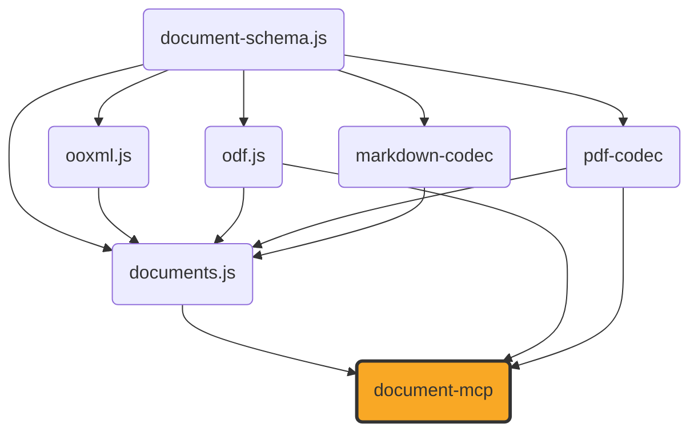

# document-mcp

[](https://github.com/ExaDev/document-mcp) [](https://www.npmjs.com/package/document-mcp) [](https://github.com/ExaDev/document-mcp/releases/latest) [](https://github.com/ExaDev/document-mcp/actions)

> An MCP (Model Context Protocol) server exposing [`documents.js`](https://github.com/ExaDev/documents.js)'s document-conversion, `.odb`, metadata, and font tooling as MCP tools, so an MCP-speaking agent can convert, inspect, and edit docx/pptx/odt/odp/ods/odg/odf/pdf/odb/xlsx/markdown documents without writing TypeScript against `documents.js` directly.

`document-mcp` adds no conversion or editing logic of its own — it is a dispatch layer over `documents.js`'s existing conversion functions, `DocumentConverter` port, live-view editors, and `.odb`/PDF readers, wired up as MCP tools served over stdio.



## Status

Under construction. This repository currently holds the project scaffold only (package/build/lint/release tooling and the shared hybrid document input/output I/O helpers) — no MCP tools are registered yet. A later phase wires `documents.js`'s conversions, `.odb` reading, metadata, and font tooling up as real MCP tools. This README will be rewritten once that lands.

## Getting started

Requires Node.js `>=20` and pnpm `11.6.0` (pinned via `packageManager` in `package.json`).

```sh
pnpm install
pnpm build        # tsdown -> dist/ (ESM + CJS + .d.ts)
pnpm typecheck     # tsc --noEmit
pnpm lint          # eslint . --max-warnings 0
pnpm test          # vitest run --project unit
pnpm test:smoke    # rebuilds dist/, then a smoke pass over the built server
```

Once published, run the server directly via `npx document-mcp` (stdio transport).

## References

- [documents.js](https://github.com/ExaDev/documents.js) — the library this server exposes.
- [document-cli](https://github.com/ExaDev/document-cli) — the sibling CLI/TUI over the same library, whose toolchain this repository's scaffold mirrors.
- [Model Context Protocol](https://modelcontextprotocol.io) — the protocol this server implements, via [`@modelcontextprotocol/server`](https://www.npmjs.com/package/@modelcontextprotocol/server).

## License

MIT
