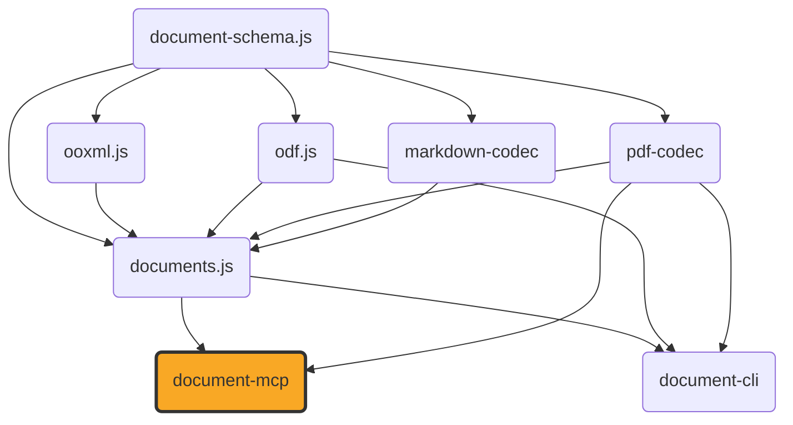

# document-mcp

[](https://github.com/ExaDev/document-mcp) [](https://www.npmjs.com/package/document-mcp) [](https://github.com/ExaDev/document-mcp/releases/latest) [](https://github.com/ExaDev/document-mcp/actions)

> An MCP (Model Context Protocol) server exposing [`documents.js`](https://github.com/ExaDev/documents.js)'s document-conversion, `.odb`, metadata, and font tooling as MCP tools, so an MCP-speaking agent can convert, inspect, and edit docx/pptx/odt/odp/ods/odg/odf/pdf/odb/xlsx/markdown documents without writing TypeScript against `documents.js` directly.

`document-mcp` adds no conversion or editing logic of its own — it is a dispatch layer over `documents.js`'s existing conversion functions, `DocumentConverter` port, and `.odb`/PDF readers, wired up as MCP tools served over stdio. [`document-cli`](https://github.com/ExaDev/document-cli) is the sibling frontend over the identical `documents.js` library — a terminal CLI/TUI rather than an MCP server — so the two are independent consumers of one shared implementation and can expose different subsets of it. A `convert_document` call's fidelity — which `(source, targetFormat)` pairs round-trip losslessly, which are a best-effort reconstruction, and why — is exactly what [`documents.js`'s own Fidelity section](https://github.com/ExaDev/documents.js#fidelity) documents, table included; it is not restated here.



## Getting started

Requires Node.js `>=20` and pnpm `11.6.0` (pinned via `packageManager` in `package.json`).

```sh
pnpm install
pnpm build         # tsdown -> dist/ (ESM + CJS + .d.ts)
pnpm typecheck     # tsc --noEmit
pnpm lint          # eslint . --max-warnings 0
pnpm test          # vitest run --project unit
pnpm test:smoke    # rebuilds dist/, then spawns dist/bin.js as a real subprocess and drives it over genuine MCP stdio
```

Once published, run the server directly via `npx document-mcp` (stdio transport, no install step needed).

### Connecting from Claude Code / Claude Desktop

Add an entry to the client's MCP server configuration (`claude mcp add` for Claude Code, or the `mcpServers` block in Claude Desktop's config file):

```json
{
  "mcpServers": {
    "document-mcp": {
      "command": "npx",
      "args": ["-y", "document-mcp"]
    }
  }
}
```

Or, for local development against a checkout of this repository rather than the published package, point `command` at the built binary directly:

```json
{
  "mcpServers": {
    "document-mcp": {
      "command": "node",
      "args": ["/absolute/path/to/document-mcp/dist/bin.js"]
    }
  }
}
```

## Document I/O

Every tool that takes or produces document bytes goes through the same two hybrid shapes, documented once here rather than repeated per tool below.

**Input** (`DocumentInput`) is a union: either a filesystem `path` (the format is inferred from the file extension — `docx`, `pptx`, `xlsx`, `odt`, `odp`, `ods`, `odg`, `odf`, `md`/`markdown`, `pdf`), or inline `bytesBase64` plus an explicit `format` (required, since inline bytes carry no filename to infer one from). `.odb` tools are the one exception: a `.odb` has no single `DocumentFormat` of its own (it is a database front end, not a document — tables, saved queries, and reports are three unrelated output shapes), so their `source.path`/`source.bytesBase64` bytes are read directly with no format inference at all.

**Output** (`DocumentOutput`), on every tool that produces a document, is a single optional `outputPath`: supply it to have the tool write the result to that filesystem path (the response then reports `{ path, byteLength }`); omit it to receive the bytes inline instead (`{ bytesBase64, byteLength }`, flagged `large: true` above 5 MB — advisory only, the bytes are never truncated or refused).

## Tools

| Tool | Description |
| --- | --- |
| `convert_document` | Converts a document from one supported format to another via `documents.js`'s `DocumentConverter` port — docx, pptx, xlsx, odt, odp, ods, odg, odf, markdown, and pdf. Not every `(source, targetFormat)` pair is direct; call `list_document_conversions` first. |
| `list_document_conversions` | Lists every `(source, target)` format pair `convert_document` actually supports. |
| `metadata_read` | Reads a document's title/author/subject/keywords/creator/producer/created-and-modified timestamps. Works across every supported format, including xlsx and odf. |
| `metadata_write` | Patches a document's title/author/subject/keywords in place. Does not convert format — source and target format must match (or both be `pdf`); xlsx and odf are rejected as either. |
| `fonts` | Lists every source-embedded font face a docx/pptx/odt/odp/ods/odg document carries (family, weight/style, byte length). |
| `describe_font_file` | Reads a standalone `.ttf`/`.otf` font file and reports the family/bold/italic triple it declares about itself. |
| `docx_extras` | Reads a docx's own comments, footnotes, headers, footers, and numbering definitions — data the `ContentDocument` pivot cannot carry, so no other tool sees it. |
| `pdf_inspect` | Parses a PDF and reports a summary (page count, per-page size and item-kind histogram, metadata, embedded image formats), or the entire parsed `LayoutDocument` with `full: true`. |
| `odm_to_pdf` | Converts a `.odm` (ODF master document) to PDF. A `.odm` never carries its chapters' content inline, so each chapter resolves via a caller-supplied `chapters` href-to-document map and/or a `chaptersDir` searched by basename. |
| `from_package` | Rebuilds real document bytes in a target format from a `DocumentPackage` previously serialised to JSON (e.g. by a conversion tool's own `onDocument`/package-dump step). |
| `odb_tables` | Lists every table an embedded `.odb` database declares — column names, types, and row data — across every storage tier `documents.js` supports (HSQLDB TEXT/CACHED/BINARY, Firebird gbak backups). |
| `odb_forms` | Lists every form an `.odb` database declares, with each form's own data source and field-bound controls. |
| `odb_reports` | Lists every report an `.odb` database declares, with each report's own data-source command, band/group structure, and `rpt:` formula expressions. |
| `odb_query` | Runs a bounded single-table `SELECT` over an embedded `.odb` database's extracted tables — given directly as SQL or by naming a saved query. No database engine involved; an unsupported construct is reported as a tool error naming it, never silently ignored. |
| `odb_to_csv` | Extracts exactly one named table from an embedded `.odb` database as CSV bytes. The table name is required whenever the database declares more than one table. |
| `odb_to_xlsx` | Extracts every table an embedded `.odb` database declares into one xlsx workbook, one sheet per table. |
| `odb_render_report` | Resolves one of an `.odb` database's own reports — its data-bound command run through the bounded SQL engine, its `rpt:` formulas evaluated, its bands laid out — and renders the result to docx, odt, or pdf. |

## References

- [documents.js](https://github.com/ExaDev/documents.js) — the library this server exposes.
- [document-cli](https://github.com/ExaDev/document-cli) — the sibling CLI/TUI over the same library, whose toolchain this repository's scaffold mirrors.
- [Model Context Protocol](https://modelcontextprotocol.io) — the protocol this server implements, via [`@modelcontextprotocol/server`](https://www.npmjs.com/package/@modelcontextprotocol/server).

## License

MIT
