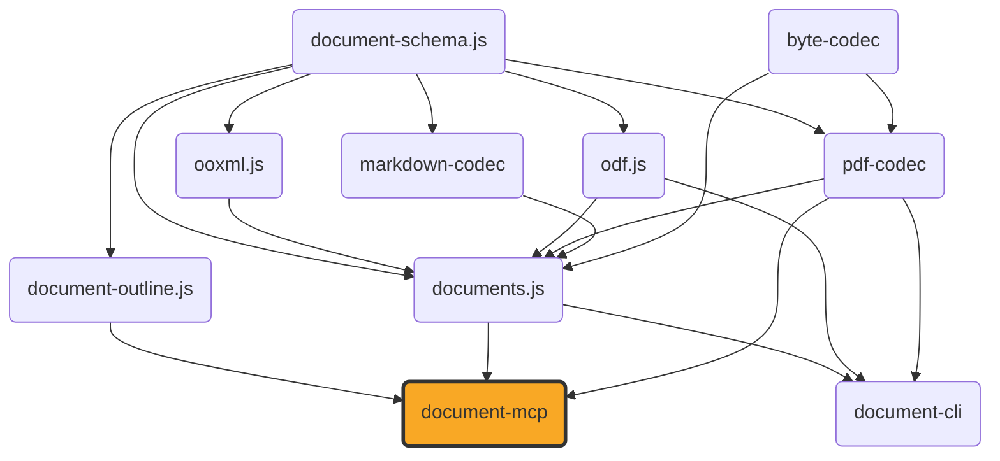

# document-mcp

[](https://github.com/ExaDev/documents.js/tree/main/packages/document-mcp) [](https://www.npmjs.com/package/document-mcp) [](https://www.npmjs.com/package/document-mcp) [](https://github.com/ExaDev/documents.js/actions)

> An MCP (Model Context Protocol) server exposing [`documents.js`](https://github.com/ExaDev/documents.js)'s document-conversion, `.odb`, metadata, and font tooling as MCP tools, so an MCP-speaking agent can convert, inspect, and edit docx/pptx/odt/odp/ods/odg/odf/pdf/odb/xlsx/markdown documents without writing TypeScript against `documents.js` directly.

`document-mcp` adds no conversion or editing logic of its own — it is a dispatch layer over `documents.js`'s existing conversion functions, `DocumentConverter` port, and `.odb`/PDF readers, wired up as MCP tools served over stdio. [`document-cli`](../document-cli/README.md) is the sibling frontend over the identical `documents.js` library — a terminal CLI/TUI rather than an MCP server — so the two are independent consumers of one shared implementation and can expose different subsets of it. A `convert_document` call's fidelity — which `(source, targetFormat)` pairs round-trip losslessly, which are a best-effort reconstruction, and why — is exactly what [`documents.js`'s own Fidelity section](../documents.js/README.md#fidelity) documents, table included; it is not restated here.



## Getting started

Run the server directly — no install step needed:

```sh
npx document-mcp
```

The server uses **stdio transport** (runs as a local process). This is supported by Claude Code, Claude Desktop, Codex CLI, Codex Desktop, and OpenCode directly. Claude Web (claude.ai), Claude Mobile, and ChatGPT require a **remote HTTP** MCP server — see [Remote transport](#remote-transport-http) below.

### Compatibility

| Client                       | Transport           | Direct support            |
| ---------------------------- | ------------------- | ------------------------- |
| Claude Code (CLI)            | stdio               | ✅                        |
| Claude Code (plugin)         | stdio               | ✅                        |
| Claude Desktop               | stdio               | ✅                        |
| Codex CLI                    | stdio               | ✅                        |
| Codex Desktop                | stdio               | ✅                        |
| OpenCode                     | stdio               | ✅                        |
| Claude Team/Enterprise (org) | stdio (per-machine) | ✅ via managed settings   |
| Claude Web (claude.ai)       | HTTP/SSE only       | ❌ needs remote transport |
| Claude Mobile (iOS/Android)  | HTTP/SSE only       | ❌ needs remote transport |
| ChatGPT (web/desktop)        | HTTP only           | ❌ needs remote transport |

### Connecting from Claude Code

One-liner (adds the MCP server directly):

```sh
claude mcp add --transport stdio document-mcp -- npx -y document-mcp
```

Or install as a Claude Code plugin (this repo is a plugin marketplace — includes auto-update on new releases):

From the terminal:

```sh
claude plugin marketplace add ExaDev/document-mcp
claude plugin install document-mcp@exadev
```

Or from within a running Claude Code session:

```text
/plugin marketplace add ExaDev/document-mcp
/plugin install document-mcp@exadev
```

Run `/reload-plugins` to activate in an already-running session. In Claude Desktop or on claude.ai: **Customize → Plugins → Browse plugins**, search for `document-mcp`, and install.

### Connecting from Codex CLI

```sh
codex mcp add document-mcp -- npx -y document-mcp
```

Or via the Codex Desktop app: **Settings → MCP Servers → + Add**.

Or add to `~/.codex/config.toml` manually:

```toml
[mcp_servers.document-mcp]
command = "npx"
args = ["-y", "document-mcp"]
```

### Connecting from OpenCode

Add to `opencode.json`:

```json
{
  "mcp": {
    "document-mcp": {
      "type": "local",
      "command": ["npx", "-y", "document-mcp"]
    }
  }
}
```

### Connecting from Claude Desktop

Add to the `mcpServers` block in Claude Desktop's config file (`~/Library/Application Support/Claude/claude_desktop_config.json` on macOS):

```json
{
  "mcpServers": {
    "document-mcp": {
      "command": "npx",
      "args": ["-y", "document-mcp"]
    }
  }
}
```

Or, for local development against a checkout of this repository rather than the published package, point `command` at the built binary directly:

```json
{
  "mcpServers": {
    "document-mcp": {
      "command": "node",
      "args": ["/absolute/path/to/document-mcp/dist/bin.js"]
    }
  }
}
```

### Connecting from Claude Team/Enterprise (organization)

Organization admins can deploy MCP server configurations centrally via **server-managed settings** (Admin Settings → Claude Code → Managed settings in the claude.ai console). A `managed-settings.json` entry for document-mcp enforces the connection across all Claude Code users in the org — no per-user setup needed. Admins can also allow/block specific MCP servers via `allowedMcpServers`/`blockedMcpServers` in the same file.

### Remote transport (HTTP)

Claude Web, Claude Mobile, and ChatGPT only accept **remote** (HTTP/SSE) MCP servers — a local stdio process is not reachable from a browser or phone. To use document-mcp on those platforms, run it behind an HTTP transport:

```sh
npx document-mcp --transport http --port 3000
```

Then add the server URL (e.g., `https://your-host:3000/mcp`) as a connector in Claude Web (**claude.ai/customize/connectors**) or ChatGPT (**Settings → Connectors → Advanced → Enable Developer Mode → Create**). Use a tunnel (Cloudflare Tunnel, ngrok) or deploy to a server with TLS — both platforms require HTTPS.

> **Note:** the `--transport http` flag is not yet implemented. The server currently only supports stdio. Track this as a future capability — the MCP SDK supports SSE/streamable-http transports, so adding it is a matter of wiring the existing server to an HTTP listener.

### Development

Requires Node.js `>=20` and pnpm `11.6.0` (pinned via `packageManager` in `package.json`).

```sh
pnpm install
pnpm build         # turbo -> tsdown -> dist/ (ESM + CJS + .d.ts)
pnpm typecheck     # turbo -> tsc --noEmit
pnpm lint          # turbo -> eslint . --fix --cache --max-warnings 0
pnpm test          # turbo -> vitest run --project unit
pnpm test:workers  # turbo -> vitest under the real Cloudflare Workers runtime (workerd) via @cloudflare/vitest-pool-workers, driving createServer() through an in-memory JSON-RPC pair
pnpm test:smoke    # turbo -> tsdown then vitest --project smoke -- spawns dist/bin.js as a real subprocess driven over genuine MCP stdio
```

## Document I/O

Every tool that takes or produces document bytes goes through the same two hybrid shapes, documented once here rather than repeated per tool below.

**Input** (`DocumentInput`) is a union: either a filesystem `path` (the format is inferred from the file extension — `docx`, `pptx`, `xlsx`, `odt`, `odp`, `ods`, `odg`, `odf`, `md`/`markdown`, `pdf`), or inline `bytesBase64` plus an explicit `format` (required, since inline bytes carry no filename to infer one from). Each ODF/OOXML template and macro-enabled variant also reads as its base format: `.ott`/`.ots`/`.otp`/`.otg`/`.otf` as `odt`/`ods`/`odp`/`odg`/`odf`, and `.dotx`/`.potx`/`.xltx` (templates) or `.docm`/`.xlsm`/`.pptm` (macro-enabled) as their OOXML base — a template is the same package with a `-template` mimetype, and a macro-enabled file carries a `vbaProject` part this library reads past without executing or re-emitting. `.odb` tools are the one exception: a `.odb` has no single `DocumentFormat` of its own (it is a database front end, not a document — tables, saved queries, and reports are three unrelated output shapes), so their `source.path`/`source.bytesBase64` bytes are read directly with no format inference at all.

**Output** (`DocumentOutput`), on every tool that produces a document, is a single optional `outputPath`: supply it to have the tool write the result to that filesystem path (the response then reports `{ path, byteLength }`); omit it to receive the bytes inline instead (`{ bytesBase64, byteLength }`, flagged `large: true` above 5 MB — advisory only, the bytes are never truncated or refused).

## Tools

| Tool                        | Description                                                                                                                                                                                                                                                                                                                                                                                                                                                                                                                                                                      |
| --------------------------- | -------------------------------------------------------------------------------------------------------------------------------------------------------------------------------------------------------------------------------------------------------------------------------------------------------------------------------------------------------------------------------------------------------------------------------------------------------------------------------------------------------------------------------------------------------------------------------- |
| `convert_document`          | Converts a document from one supported format to another via `documents.js`'s `DocumentConverter` port — docx, pptx, xlsx, odt, odp, ods, odg, odf, markdown, and pdf. Not every `(source, targetFormat)` pair is direct; call `list_document_conversions` first.                                                                                                                                                                                                                                                                                                                |
| `list_document_conversions` | Lists every `(source, target)` format pair `convert_document` actually supports.                                                                                                                                                                                                                                                                                                                                                                                                                                                                                                 |
| `metadata_read`             | Reads a document's title/author/subject/keywords/creator/producer/created-and-modified timestamps. Works across every supported format, including xlsx and odf.                                                                                                                                                                                                                                                                                                                                                                                                                  |
| `metadata_write`            | Patches a document's title/author/subject/keywords in place. Does not convert format — source and target format must match (or both be `pdf`); odf (a standalone formula document) is rejected as either, since it has no write path back out at all.                                                                                                                                                                                                                                                                                                                            |
| `fonts`                     | Lists every source-embedded font face a docx/pptx/odt/odp/ods/odg document carries (family, weight/style, byte length).                                                                                                                                                                                                                                                                                                                                                                                                                                                          |
| `describe_font_file`        | Reads a standalone `.ttf`/`.otf` font file and reports the family/bold/italic triple it declares about itself.                                                                                                                                                                                                                                                                                                                                                                                                                                                                   |
| `docx_extras`               | Reads a docx's own comments, footnotes, header/footer parts, and numbering definitions — data the `ContentDocument` pivot cannot carry, so no other tool sees it.                                                                                                                                                                                                                                                                                                                                                                                                                |
| `pdf_inspect`               | Parses a PDF and reports a summary (page count, per-page size and item-kind histogram, metadata, embedded image formats), or with `full: true` the entire parsed `LayoutDocument` as plain JSON — no `$schema` stamp, since that family moved to `pdf-codec` at `document-schema.js` 4.0.0 and lost its schema-stamped envelope.                                                                                                                                                                                                                                                 |
| `odm_to_pdf`                | Converts a `.odm` (ODF master document) to PDF. A `.odm` never carries its chapters' content inline, so each chapter resolves via a caller-supplied `chapters` href-to-document map and/or a `chaptersDir` searched by basename.                                                                                                                                                                                                                                                                                                                                                 |
| `from_package`              | Rebuilds real document bytes in a target format from a `DocumentTree` previously serialised to JSON (e.g. by a conversion tool's own `onDocument`/package-dump step). Only a package genuinely written by a current dump round-trips: the `$schema` URI it carries pins the `document-schema.js` release that wrote it, and a pre-4.0.0 dump (the flat `{ formatVersion, content, pages }` envelope) is rejected with an error naming the pinned release, the flat-to-tree change, and the remedy — a layout-document dump gets its own pointer, naming the move to `pdf-codec`. |
| `outline_document`          | Projects a document's own table of contents as structured JSON: groups (`{ text, level, children }`) for headings, list items, slides, sheets, and draw pages, leaves (`{ kind, text }`) for the content between them. The outline is over the source's own content — read through `documents.js`'s `DocumentConverter` port and built by `document-outline.js`'s `buildOutline`.                                                                                                                                                                                                |
| `odb_tables`                | Lists every table an embedded `.odb` database declares — column names, types, and row data — across every storage tier `documents.js` supports (HSQLDB TEXT/CACHED/BINARY, Firebird gbak backups).                                                                                                                                                                                                                                                                                                                                                                               |
| `odb_forms`                 | Lists every form an `.odb` database declares, with each form's own data source and field-bound controls.                                                                                                                                                                                                                                                                                                                                                                                                                                                                         |
| `odb_reports`               | Lists every report an `.odb` database declares, with each report's own data-source command, band/group structure, and `rpt:` formula expressions.                                                                                                                                                                                                                                                                                                                                                                                                                                |
| `odb_query`                 | Runs a bounded single-table `SELECT` over an embedded `.odb` database's extracted tables — given directly as SQL or by naming a saved query. No database engine involved; an unsupported construct is reported as a tool error naming it, never silently ignored.                                                                                                                                                                                                                                                                                                                |
| `odb_to_csv`                | Extracts exactly one named table from an embedded `.odb` database as CSV bytes. The table name is required whenever the database declares more than one table.                                                                                                                                                                                                                                                                                                                                                                                                                   |
| `odb_to_xlsx`               | Extracts every table an embedded `.odb` database declares into one xlsx workbook, one sheet per table.                                                                                                                                                                                                                                                                                                                                                                                                                                                                           |
| `odb_render_report`         | Resolves one of an `.odb` database's own reports — its data-bound command run through the bounded SQL engine, its `rpt:` formulas evaluated, its bands laid out — and renders the result to docx, odt, or pdf.                                                                                                                                                                                                                                                                                                                                                                   |

## References

- [documents.js](https://github.com/ExaDev/documents.js) — the library this server exposes.
- [document-outline.js](../document-outline.js/README.md) — the artefact-utilities package over document-schema.js's tree-form `DocumentTree` whose `buildOutline` powers `outline_document`.
- [document-cli](../document-cli/README.md) — the sibling CLI/TUI over the same library, whose toolchain this repository's scaffold mirrors.
- [Model Context Protocol](https://modelcontextprotocol.io) — the protocol this server implements, via [`@modelcontextprotocol/server`](https://www.npmjs.com/package/@modelcontextprotocol/server).

## Gotchas

- **Runtime dependencies are `documents.js` + `document-outline.js` + `@modelcontextprotocol/server` + `zod` only; `pdf-codec` and `odf.js` are devDependencies (test-support only).** `document-outline.js` is the one dependency beyond the server stack itself: `outline_document` imports `buildOutline`/`outlineLeafText` from it, and documents.js deliberately does not re-export them (the outline projection lives in the family's artefact-utilities package, which depends only on `document-schema.js` — already a transitive dependency via documents.js — so it adds no second copy of anything). Every runtime reach into `pdf-codec`/`odf.js` — `ProvidedFont`/`FontSubstitution`/`describeFontFace`/the `WinAnsi` substitution shape — goes through `documents.js`'s own re-exports, so a published install pulls in no direct `pdf-codec`/`odf.js` dependency. `odf.js` survives in `devDependencies` solely because `src/test-support/odm-fixture.ts` and `src/test-support/embedded-font-fixture.ts` build real ODF package fixtures from its low-level XML primitives (`zipPackage`/`el`/`rootElement`), and `src/test-support/` is excluded from the `tsdown` build — only `src/index.ts` and `src/bin.ts` are entry points — so neither fixture module ever ships in `dist/`.

## Contributing

Release, CI, and commit-message conventions are all workspace-wide, not package-local — see the [monorepo root README](../../README.md#releases) for the release mechanism and [CONTRIBUTING.md](../../CONTRIBUTING.md) for the shared git hooks and history conventions. Work inside `packages/document-mcp/`.

## License

MIT
