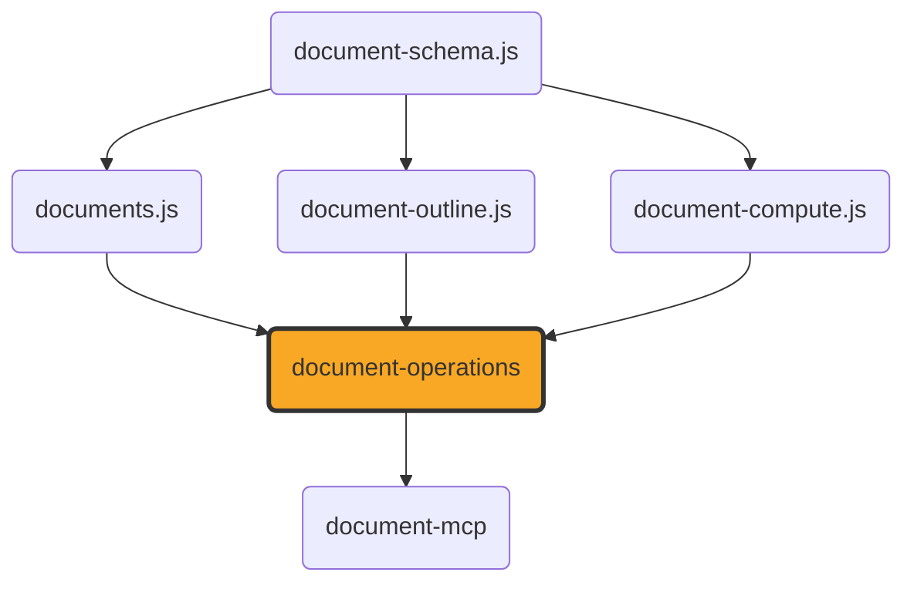

# document-operations

[](https://github.com/ExaDev/documents.js/tree/main/packages/document-operations) [](https://www.npmjs.com/package/document-operations) [](https://www.npmjs.com/package/document-operations) [](https://github.com/ExaDev/documents.js/actions)

> The canonical set of document-conversion, editing, inspection, and `.odb` operations [`documents.js`](https://github.com/ExaDev/documents.js) exposes — one Zod input/output schema and one transport-agnostic `run()` function per operation, so [`document-mcp`](../document-mcp/README.md), a REST API server, and [`document-cli`](../document-cli/README.md) can each expose the identical operation without redefining its shape or its behaviour a second time.

Before this package existed, `document-mcp` defined each MCP tool's Zod schema and dispatch logic directly in its own `src/tools/*.ts`, and `document-cli` described the same underlying operations again as hand-written `commander` flags — two independent definitions of "what does `convert_document` take" that could silently drift, with no shared source of truth a third surface (a REST server) could build against either. `document-operations` is that source of truth: every operation from `document-mcp`'s own tool set moved here unchanged in behaviour, decoupled from any one transport's own result-shaping.



## The `DocumentOperation` contract

Every operation this package exports has the same shape (`src/operation.ts`):

```ts
interface DocumentOperation<In, Out> {
  readonly name: string;
  readonly title: string;
  readonly description: string;
  readonly inputSchema: z.ZodType<In>;
  readonly outputSchema?: z.ZodType<Out>;
  run(input: In, context?: { readonly signal?: AbortSignal }): Promise<Out>;
}
```

`inputSchema`/`outputSchema` are the single source of truth for validation and description text; `run()` is the transport-agnostic implementation. A failure is always a thrown Error (a plain one, or one of `documents.js`'s own typed errors, e.g. `OdbReportNotSpecifiedError`, `OdmUnresolvedSectionError`) — `run()` never shapes a transport-specific result. Each transport decides for itself how to present a thrown error: `document-mcp` wraps it as an `isError` tool result (with an optional `mapError` hook for the two operations whose errors carry data worth surfacing structurally), a REST route would map it to a 4xx JSON body, and a CLI command would print it to stderr with a non-zero exit code.

`defineOperation()`/`defineOperationWithoutOutputSchema()` build one of these from a plain object, inferring `In`/`Out` from the Zod schemas so a call site never repeats `z.infer<typeof Schema>` itself. Use the `WithoutOutputSchema` variant for the handful of operations whose original MCP tool registration declared no `outputSchema` at all (`metadata_read`'s return shape varies per format; the `.odb`-reading operations return `documents.js`'s own reader types directly) — adding a guessed schema there would risk introducing output validation that did not previously exist and could reject a genuine value the guess did not anticipate.

`DOCUMENT_OPERATIONS` (`src/registry.ts`) is every operation in one array — "the same registry as the MCP" a caller that wants to enumerate every operation, rather than import one by name, reaches for: an MCP server registers each entry as a tool, a REST server would add one route per entry, and a CLI would validate its own parsed flags against an entry's `inputSchema` before dispatching to `run()`.

## Operations

Every operation below was ported unchanged in behaviour from `document-mcp`'s own `src/tools/*.ts` — see that package's README for the full description of what each one does; this table is the index.

| Export                              | Name                         |
| ----------------------------------- | ---------------------------- |
| `convertDocumentOperation`          | `convert_document`           |
| `listDocumentConversionsOperation`  | `list_document_conversions`  |
| `metadataReadOperation`             | `metadata_read`              |
| `metadataWriteOperation`            | `metadata_write`             |
| `documentCreateOperation`           | `document_create`            |
| `documentAppendParagraphsOperation` | `document_append_paragraphs` |
| `fontsOperation`                    | `fonts`                      |
| `describeFontFileOperation`         | `describe_font_file`         |
| `docxExtrasOperation`               | `docx_extras`                |
| `fromPackageOperation`              | `from_package`               |
| `outlineDocumentOperation`          | `outline_document`           |
| `pdfInspectOperation`               | `pdf_inspect`                |
| `computeFormulaOperation`           | `compute_formula`            |
| `odmToPdfOperation`                 | `odm_to_pdf`                 |
| `odbTablesOperation`                | `odb_tables`                 |
| `odbFormsOperation`                 | `odb_forms`                  |
| `odbReportsOperation`               | `odb_reports`                |
| `odbQueryOperation`                 | `odb_query`                  |
| `odbToCsvOperation`                 | `odb_to_csv`                 |
| `odbToXlsxOperation`                | `odb_to_xlsx`                |
| `odbRenderReportOperation`          | `odb_render_report`          |

## Getting started

```sh
pnpm install
pnpm build         # turbo -> tsdown -> dist/ (ESM + CJS + .d.ts)
pnpm typecheck     # turbo -> tsc --noEmit, plus attw --pack
pnpm lint          # turbo -> eslint . --fix --cache --max-warnings 0
pnpm test          # turbo -> vitest run
pnpm test:workers  # turbo -> vitest under the real Cloudflare Workers runtime (workerd) via @cloudflare/vitest-pool-workers, exercising every operation's bytesBase64 input path
```

## Gotchas

- **Not held to Worker isomorphism, unlike the foundation packages it depends on.** `resolveDocumentInput`'s `path` branch (`src/io/document-input.ts`) reads a file from disk via `node:fs/promises`, and `odm_to_pdf`'s chapter-directory resolution (`src/operations/odm.ts`) uses `node:fs`'s synchronous API — the same reason `document-mcp` and `document-cli` are excluded from the isomorphic-package list in the [monorepo root README](../../README.md#conventions). `pnpm test:workers` still proves every operation's `bytesBase64` input path runs correctly under workerd (no `path`/`chaptersDir` involved), matching `document-mcp`'s own workers-test scope.
- **`document-mcp`'s own tests were left untouched, not moved here.** They keep testing the full MCP registration (`createServer()` + a real client/server JSON-RPC round trip), which still exercises this package's own `run()` functions underneath — moving them would have meant re-verifying ~3000 lines of existing, passing test behaviour for no functional gain. This package's own tests are a separate, more direct unit-level check on each `run()` function in isolation.
- **`odb_render_report`'s `OdbReportNotSpecifiedError` and `odm_to_pdf`'s `OdmUnresolvedSectionError` are not caught here.** Both are thrown by the underlying `documents.js` functions and left to propagate — the MCP-specific enrichment (a remediation hint, `structuredContent.availableReports`/`.hrefs`) lives in `document-mcp`'s own `mapError` hooks (`src/tools/odb-render-report.ts`, `src/tools/odm.ts`), since that shaping is presentation, not operation logic.

## Contributing

Release, CI, and commit-message conventions are all workspace-wide, not package-local — see the [monorepo root README](../../README.md#releases) for the release mechanism and [CONTRIBUTING.md](../../CONTRIBUTING.md) for the shared git hooks and history conventions. Work inside `packages/document-operations/`.

## License

MIT
