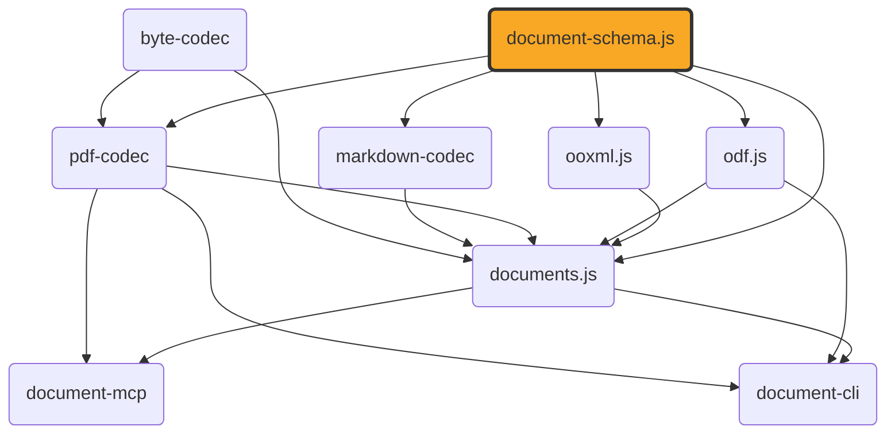

# document-schema.js

[](https://github.com/ExaDev/documents.js/tree/main/packages/document-schema.js) [](https://www.npmjs.com/package/document-schema.js) [](https://www.npmjs.com/package/document-schema.js) [](https://github.com/ExaDev/documents.js/actions)

> The canonical, format-agnostic content and document-package schema pivot shared by [ooxml.js](../ooxml.js/README.md), [odf.js](../odf.js/README.md), [documents.js](https://github.com/ExaDev/documents.js), [pdf-codec](../pdf-codec/README.md), and [markdown-codec](../markdown-codec/README.md).

Both `ooxml.js` and `documents.js` independently arrived at the same content vocabulary, producing two field-identical copies in two places. This package is the fix: one schema, imported by every format package instead of redefined by each. It also sidesteps a circular dependency (`documents.js` depends on both `ooxml.js` and `odf.js`).



`ContentDocument` (the semantic pivot) is a discriminated union of five kinds: `wordprocessing` (docx/odt sections of paragraphs/runs/tables/images), `presentation` (pptx/odp slides of shapes), `spreadsheet` (xlsx/ods sheets of cells, columns, rows, print settings), `drawing` (odg pages of shapes plus vector primitives — rect/ellipse/line/path), and `formula` (an equation carrying its own MathML node tree plus StarMath source when the producing format had one, extended with the two-layer math model: an optional verbatim-LaTeX `presentation` authoritative for rendering, an optional semantic `content: MathExpression` tree authoritative for computation, and provenance — neither layer stored derived from the other, so editing one never silently mutates the other). `ContentEmbeddedObjectSchema` lets any of the five embed another whole `ContentDocument`; its one exception is the `'chart'` objectKind, which names a chart graphic frame's cached series/category model carried as a small spreadsheet document — a chart is not itself a document kind, and the objectKind/document pairing being a convention rather than a constraint is what lets the two halves each say their own truth. Every paragraph/run/image/table/shape/vector/spreadsheet-cell leaf also carries its own canonical `headingLevel`-or-position fields directly: a `ContentParagraph`'s optional `headingLevel` (1 = the outermost heading, independent of the round-trip-only `styleId`), and every such leaf's optional `frames: LayoutFrame[]` — that node's own rendered page position(s) (`pageIndex` plus PDF user-space `xPt`/`yPt`/`widthPt`/`heightPt`), fused directly onto the content tree once a layout pass has run. `DocumentPackage` is the single hierarchical artefact — structure, layout, and content fused in one tree (see [The package tree](#the-package-tree)): the root carries `kind`, `metadata`, the optional document-level `symbolTable` and rendered `pages`, the optional package-level `styles`/`definitions`/`layers`/`attachments`/`destinations` tables (see [Definitions tables and styles](#definitions-tables-and-styles)) and the keyed `source` residue table (see [The residue channel](#the-residue-channel)), and `children` — one group per top-level container with the content tree grouped inside it, where a group's node may also be one of the six fidelity construct descriptors, which the flat form carries instead as a matched `constructStart`/`constructEnd` block pair (see [Fidelity constructs](#fidelity-constructs)); the schema does not keep populated `frames` fields and `pages` in sync or detect staleness, and does not check that a tree's `style` refs name table entries (both are producer responsibilities, exactly as the frames/pages pairing always was). Every one of the five kinds also accepts an optional document-level `symbolTable` — the math curation layer mapping each written symbol glyph (within a scope) to its id, quantity kind, preferred unit, and definition source, alongside the unit registry (SI dimension-exponent vectors, exact rational conversions, per-unit-system normalisation contexts) that the `qty` nodes of lowered formulas resolve against.

The `LayoutDocument` family (pages of positioned `LayoutItem`s — `text`/`image`/`rect`/`line`/`ellipse`/`path`/`link` in PDF user-space coordinates) no longer lives here: 4.0.0 demoted it to a pdf-codec-private model ([pdf-codec#65](https://github.com/ExaDev/pdf-codec/issues/65)), where the only codec that ever read or wrote it owns it outright. `documentFromJson` recognises old layout-document `$schema` URIs and throws a tombstone pointing at pdf-codec rather than failing as if the value were unrelated. Dependents stay on document-schema.js 3.x via semver until their own majors, so the demotion is not a cascade-breaker.

The package contains [Zod](https://zod.dev) schemas, their inferred types, trivial schema-attached helpers (hex-colour conversion, recursive structural type guards, the style-resolution helpers of `src/definitions.ts`, the construct-marker balance check of `src/content.ts`), one small structural interface (`ContentCodec`, see [Codecs](#codecs)), and the structural transform between the two encodings it defines (`decompose`/`flattenPackage`/`factorStyles`/`assemblePackage`, see [The package boundary](#the-package-boundary)). No format-specific behaviour and no I/O of any kind — no XML, ZIP, PDF, or binary handling; the sole dependency is `zod`.

Two format-agnostic helpers live here because they operate on the content model itself: cell-addressing utilities in `src/a1.ts` (0-based row/column indices, row-first order matching `ContentSheetCell`'s `{row, column}`) and the `FontFace` interface in `src/font-port.ts` (`{family, bold, italic}`).

## Usage

```ts
import { ContentDocumentSchema, DocumentPackageSchema } from 'document-schema.js';

// The codec-exchange form: what every format's reader produces and every writer consumes -- always flat,
// always fully materialised (no styles table, no refs), never versioned (that lives on the serialised artefact).
const content = ContentDocumentSchema.parse(someWordprocessingOrPresentationValue);

// The package tree: what a serialised dump carries. `children` holds one group per top-level container,
// with the content grouped inside it (see "The package tree" below).
const pkg = DocumentPackageSchema.parse({
  kind: 'wordprocessing',
  metadata: { title: 'Example' },
  children: [
    {
      node: { kind: 'section', pageSize: { widthPt: 612, heightPt: 792 }, margins: { topPt: 72, rightPt: 72, bottomPt: 72, leftPt: 72 } },
      children: [
        { node: { kind: 'paragraph', headingLevel: 1, runs: [{ text: 'Heading' }] }, children: [] },
        { kind: 'paragraph', runs: [{ text: 'Body.' }] },
      ],
    },
  ],
});

// Once a layout pass has fused rendered positions onto the tree's own nodes (each via its own `frames` array)
// and reported each page's own size, `pages` is populated to match:
const laidOut = DocumentPackageSchema.parse({ ...pkg, pages: [{ widthPt: 612, heightPt: 792 }] });
```

## The package tree

`DocumentPackage` ([#20](https://github.com/ExaDev/document-schema.js/issues/20)) is the promoted single hierarchical artefact — one tree where 3.x carried `{ formatVersion, content, pages }` with the content flat. The tree's vocabulary is defined in `src/package-node.ts` and was proven first as [document-outline.js](../document-outline.js/README.md)'s phase-1 `decompose`/`flatten` implementation ([document-outline.js#2](https://github.com/ExaDev/document-outline.js/issues/2)); this package's schemas are that shape's schema-home port, matching it node for node:

- **Groups** are `{ node, children }` where `node` embeds either an anchor paragraph (heading groups and list-item groups carry the full `ContentParagraph` — runs, formatting, frames — never a projected text label) or a container descriptor: `{ kind: 'section', pageSize, margins }`, `{ kind: 'slide', size, notes }`, `{ kind: 'sheet', name, cells, columns, rows, printSettings }`, `{ kind: 'drawPage', size }`, each tagged with a `kind` the flat container type does not carry, or a shape group's untagged frame descriptor, or — since 4.1.0 — a **construct descriptor** (see [Fidelity constructs](#fidelity-constructs)).
- **Bare leaves** carry their own `kind` and never `children`. Discrimination is structural on `node`+`children`, not on the presence of a `kind`. Every `ContentBlock` kind is a legal leaf except the two construct boundary markers, which are the flat form's encoding of something the tree carries as a group (see [Constructs in the flat form](#constructs-in-the-flat-form)).
- **Section groups are mandatory** — one per `ContentSection` — because a section carries pre-layout page geometry (`pageSize`/`margins`, plus the optional `breakType` naming how the section begins — nextPage/continuous/evenPage/oddPage, absent meaning the producer's own default) that a rendered `pages` array cannot hold.
- **Grouping never crosses container boundaries**: a shape is its own group with its inner blocks grouped inside it (never a slide's paragraphs flattened across its shapes — that is a TOC projection, not a decomposition); a sheet's grid rides on the sheet node with images and embedded documents as children; embedded documents stay intact as one leaf.
- **Style refs ride on group wrappers only** — a group may carry `style: string` naming a `styles` table entry; `ContentDocument` nodes carry no ref field, so the flat codec-exchange form is always fully materialised.

The flat `ContentDocument` and the tree are **one format, two encodings**, related by three laws — the contract with document-outline.js (which property-tests them over real corpus documents) and, at the package boundary, with documents.js ([documents.js#623](https://github.com/ExaDev/documents.js/issues/623)):

1. **Strict structural equality, both directions, for table-free packages** — `decompose(flatten(pkg))` and `flatten(decompose(pkg))` reproduce their input exactly.
2. **Effective-property equality, universally** — resolve styles first, then compare: a factored and an unfactored serialisation of one document are equal (this is also why content hashing and structural diffing resolve first).
3. **Minting idempotence** — factoring a package a second time mints the identical styles table: `decompose(flatten(decompose(x))) === decompose(x)`.

The codecs do not change: they keep producing flat `ContentDocument`s (their natural reading shape); decomposition runs once where a package is assembled and flatten runs once where a builder consumes one. Both directions live here — see [The package boundary](#the-package-boundary).

## The package boundary

The transform between the two encodings lives in this package, alongside the schemas that define them:

```ts
import { assemblePackage, decompose, factorStyles, flattenPackage } from 'document-schema.js';

// The one call a construction site makes: decompose the flat content into the tree, splice the envelope
// onto the root, and mint a styles table over the result. `pages` is optional -- pass it once a layout
// pass has produced each rendered page's own size.
const pkg = assemblePackage(content, pages);

// The inverse, with every style ref resolved away: a fully materialised, ref-free ContentDocument.
const flat = flattenPackage(pkg);

// The two halves on their own, for a caller composing its own boundary.
const children = decompose(content);   // flat -> the tree `children` a package carries
const reminted = factorStyles(pkg);    // re-mint an already-assembled tree (idempotent)
```

`decompose` throws `ConstructMarkerImbalanceError` — carrying `src/content.ts`'s own `ConstructMarkerImbalance` payload, so a caller narrows with `instanceof` and reads the offending block index rather than parsing a message — when a container's `constructStart`/`constructEnd` markers do not pair up. Promotion is defined only over a balanced stream, so an unbalanced one is refused rather than repaired into a plausible tree.

**This is a deliberate amendment to the "schemas only" charter, not a drift from it.** The transform is not business logic and not format-specific behaviour: it is the canonical, purely structural, zero-I/O relationship between the two shapes this package already defines, and its correctness contract *is* the three laws above. It lives here because it has to: `ooxml.js`, `odf.js`, `markdown-codec`, and `pdf-codec` all depend on this package and none of them depends on `documents.js`, so a codec whose public read/write functions speak `DocumentPackage` directly can only reach the transform if the transform sits at or below the schema layer. Everything the charter actually guards against — XML, ZIP, PDF, fonts, layout, bytes, filesystem — remains firmly out.

The laws are pinned in `src/bijection.test.ts` over a corpus spanning every document kind, every leaf the tree vocabulary admits, and every grouping signal `decompose` reads (headings, list levels, and construct boundaries in each block flow that admits them). `documents.js` runs the same law harness over its own real-format corpus — reader output for every format it supports, editor builds, and conversion captures carrying a layout pass's real frames and pages — which is the complement this package cannot host, since every reader in it belongs to a package that depends on this one.

## Fidelity constructs

Every format carries constructs the flat content model drops — docx SDTs and field codes, ODF fields and tracked changes, PDF form widgets and link annotations, markdown footnotes and link titles. [#22](https://github.com/ExaDev/document-schema.js/issues/22) replaces those per-repo caveats with one **harmonised semantic vocabulary**: no format-specific node kinds, ever. Four codec inventories ([ooxml.js#65](https://github.com/ExaDev/ooxml.js/issues/65), [odf.js#59](https://github.com/ExaDev/odf.js/issues/59), [markdown-codec#63](https://github.com/ExaDev/markdown-codec/issues/63), [pdf-codec#66](https://github.com/ExaDev/pdf-codec/issues/66)) audited what each format actually carries, and 4.1.0 lands their answer additively ([#24](https://github.com/ExaDev/document-schema.js/issues/24)) — new descriptor kinds and package tables, no change to any existing node shape, so a 4.0.0 tree parses unchanged.

In the tree, a construct is a group like any other: `{ node: <descriptor>, children }`, where the children are the extent the construct spans. The tree was designed construct-capable from day one for exactly this, which is why the kinds could land in a minor rather than a second structural break. In the flat form — the shape every codec actually reads and writes — the same construct is a matched pair of boundary markers bracketing its extent (see [Constructs in the flat form](#constructs-in-the-flat-form) below).

```ts
// A tracked insertion inside a docx content control, and a footnote marker whose body lives in the definitions table.
const pkg = DocumentPackageSchema.parse({
  kind: 'wordprocessing',
  metadata: {},
  definitions: { n1: { kind: 'footnote', blocks: [{ kind: 'paragraph', runs: [{ text: 'The note body.' }] }] } },
  children: [
    {
      node: { kind: 'section', pageSize: { widthPt: 612, heightPt: 792 }, margins: { topPt: 72, rightPt: 72, bottomPt: 72, leftPt: 72 } },
      children: [
        {
          node: { kind: 'contentControl', controlType: 'richText', tag: 'ClientBlock', lock: 'container' },
          children: [
            {
              node: { kind: 'provenance', change: 'insertion', author: 'A. Reviewer', dateIso: '2026-08-18T09:00:00Z' },
              children: [{ kind: 'paragraph', runs: [{ text: 'Inserted sentence.' }] }],
            },
            { node: { kind: 'anchor', anchorType: 'footnote', name: '1', definition: 'n1' }, children: [] },
          ],
        },
      ],
    },
  ],
});
```

The six kinds (`src/construct.ts`):

| Kind | Carries | Where it comes from |
| --- | --- | --- |
| `contentControl` | `controlType`, `tag`, `alias`, `lock`, `value`, `checked`, `options` | docx block and inline SDTs, docx legacy `w:ffData` form fields, ODF `office:forms` controls and TOC/index wrappers, PDF AcroForm widgets and their field tree |
| `field` | `instruction`, `cachedResult` | docx `w:fldChar`/`w:instrText` and `w:fldSimple`, ODF field masters and simple fields, ODF cross-reference displays, pptx `a:fld` |
| `anchor` | `anchorType`, `name`, `definition` | docx bookmarks, comment extents, footnote/endnote references; ODF `text:bookmark`, `text:reference-mark*`, `text:note`, `office:annotation`; PDF sticky notes and markup annotations; markdown footnote markers |
| `link` | `target` (external URI or internal anchor name), `title` | docx `@w:anchor`, pptx slide jumps, PDF `GoTo`/`/Dest` and link annotations, markdown link/image titles |
| `provenance` | `change`, `author`, `dateIso` | docx `w:ins`/`w:del` and move tracking, ODF `text:tracked-changes`/`text:changed-region` |
| `division` | `name`, `columnCount`, `protected`, `source` | ODF `text:section` and `text:section-source`, tagged PDF `/Sect` and `/Div` |

Five things bound the vocabulary, and each is a decision rather than an omission:

- **Block-scoped extents are groups; run-scoped extents are a paragraph field.** A construct group wraps the block flow of a section, heading group, shape, or list item — and since the run-level extent mechanism landed ([#741](https://github.com/ExaDev/documents.js/issues/741)), a construct covering a sub-sequence of one paragraph's runs is a `RunConstructExtent` on that paragraph's own optional `constructs` field: a descriptor plus a half-open `startRun`/`endRun` range, so the paragraph it sits in is never split to host a wrapper (see [Run-level construct extents](#run-level-construct-extents) below). One occurrence, one scope, one encoding: a construct bracketing whole blocks is a marker pair in the flat form and a group in the tree; a construct covering a run sub-sequence is a field on the paragraph in both. An external hyperlink stays on `ContentRun.hyperlink` regardless — `link` groups are for block-scoped and annotated extents a flat run field cannot express, never a replacement for it.
- **Crossing and boundary-straddling block extents are a ratified drop.** Two block-scoped constructs whose extents cross (the first ends inside the second, the second inside the first) have no encoding in either form, structurally: the tree states a construct as a group and no tree holds crossing subtrees, while the flat form's bracket matching re-pairs a crossing couple into a different nesting than the source meant. The id-keyed pairing that could express them (WordprocessingML's own `w:id`) is exactly what the marker contract refuses — an id has no home on the tree side and no deterministic way back through `flatten`. The same holds for an extent straddling a block-list boundary (a section break, a table cell's wall), because each block list is its own bracket scope and cross-list pairing is ids again. Within one paragraph, crossing extents *are* encodable — run ranges are data, not brackets — so this ratification covers block scope only; a codec reading a crossing or straddling pair drops the crossing extent and keeps the properly nested one.
- **Two group variants, one per block flow.** `SectionConstructGroup` sits in a section's or heading group's flow and admits heading children; `ShapeConstructGroup` sits in a shape's or list item's and does not — exactly the `SectionChild`/`ShapeChild` split that already existed. A construct nests in and around every other group, so a `provenance` wrapper inside a `contentControl` inside a `division` is a legal (and real) docx shape. Constructs are **not** legal as direct children of a slide, sheet, drawing page, or the package root: those hold containers and leaves, not block flow. The flat form's marker pair follows the same rule by construction: it is a `ContentBlock`, so it can only appear where block flow already runs.
- **`division` is first-class, not degraded.** [#24](https://github.com/ExaDev/document-schema.js/issues/24) posed ODF `text:section` as a choice between a new generic kind and degrading to `contentControl` with the specifics in residue. It is first-class, on the odf inventory's own recommendation: `ContentSection` cannot host it (that is page geometry, one `pageSize`/`margins` pair, and it does not nest, while a division nests arbitrarily and usually changes no page geometry at all), and burying a structural container in the form-control vocabulary would make `contentControl` mean two unrelated things. It clears #22's no-format-specific-kinds bar on a real analogue — tagged PDF's `/Sect` and `/Div` are the same construct — not on ODF's say-so. It is spelled `division` rather than `section` because `{ kind: 'section' }` is already the page-geometry container descriptor.
- **Residue rides the descriptors, spelt identically to everywhere else.** #22's channel 2 has landed (see [The residue channel](#the-residue-channel)): every descriptor except `division` carries the same optional `source: { format, xml }` every content node carries, because a descriptor is the construct group's node payload — a node position, not a special case. A matched marker pair moves it across the flat/tree boundary inside the descriptor the open marker already embeds, so the markers themselves stay bare and the construct group keeps its strict `{ node, style, children }` shape. `division` is the one refusal: its `source` already names the external-chapter link (`DivisionSource`, landed 4.1.0), one name cannot mean two facts, and renaming the landed field wants a major — division's own residue rows (ODF `text:filter-name`) wait on that rename.

### Constructs in the flat form

The tree has a wrapper node to hang an extent off; the flat `ContentDocument` does not — a section's, shape's, or table cell's content is one block list and nothing else. So the flat encoding of a construct is a **matched pair of boundary markers** bracketing the blocks it spans, added to `ContentBlock` as two new kinds (`src/content.ts`):

```ts
import type { ContentBlock } from 'document-schema.js';

// The flat form of the same construct region the tree example above carries as nested groups: a tracked
// insertion and a footnote marker, both inside one content control.
const blocks: ContentBlock[] = [
  { kind: 'constructStart', descriptor: { kind: 'contentControl', controlType: 'richText', tag: 'ClientBlock', lock: 'container' } },
  { kind: 'constructStart', descriptor: { kind: 'provenance', change: 'insertion', author: 'A. Reviewer', dateIso: '2026-08-18T09:00:00Z' } },
  { kind: 'paragraph', runs: [{ text: 'Inserted sentence.' }] },
  { kind: 'constructEnd' },
  { kind: 'constructStart', descriptor: { kind: 'anchor', anchorType: 'footnote', name: '1', definition: 'n1' } },
  { kind: 'constructEnd' },
  { kind: 'constructEnd' },
];
```

This is what makes the descriptor vocabulary reachable at all from the shape a codec produces: every codec reads and writes `ContentDocument`, so a construct facility wired only onto the tree is a facility no codec can emit into. `decompose` promotes each matched pair into the construct group the tree already has, and `flatten` emits the pair back.

- **Pairing is ordinary bracket matching.** A `constructEnd` closes the nearest preceding still-open `constructStart` in the **same block list**, and the blocks between them are the extent. That is the entire mechanism — there is deliberately **no id, name, or other pairing key** on either marker. An id would have to be minted by whichever producer emitted the pair and then reproduced byte-for-byte by `flatten` to satisfy law 1 above, and a construct group carries a descriptor and its children and nothing else, so the id would be a value with no home on the tree side and no deterministic way back. A bare bracket has nothing to reproduce and nothing to get wrong, and bracket matching already generalises to arbitrary nesting depth and to different construct kinds nested inside each other.
- **Matching never straddles a block list.** A pair opened in a section's blocks closes in that same array; a pair opened inside a table cell closes inside that cell. That cell is also where a construct inside a table is expressible in *either* encoding, because decomposition treats a table as one leaf and never descends into it — so a cell's block list stays flat in a tree too, markers and all.
- **An unbalanced list is invalid input, not a shape to repair.** A close with nothing open, or a start still open when the list ends, is malformed: `decompose` throws rather than inventing a boundary. `findConstructMarkerImbalance(blocks)` is the one shared definition of that check — it returns `{ kind: 'unmatchedEnd' | 'unclosedStart', index }` for the first fault or `undefined` when the list balances, and it exists here because a codec emitting pairs, another reading them, and `decompose` promoting them must all agree on exactly one answer, and no schema can express balance (it is a property of a list's sequence, not of any block in it). It is deliberately non-recursive: each block list is its own bracket scope, so a caller walking nested lists calls it once per list. Balance is checked here, not by the schema — `ContentDocumentSchema.parse` still accepts a section whose blocks carry an unmatched marker (pinned by a dedicated test), since a Zod-only refinement expressing balance would validate against a rule the published `content-document.schema.json` fragment cannot express and so would silently diverge from it.
- **Balance is necessary but not sufficient — an extent must not cross a heading-group or list-group scope boundary.** Headings and list items have no delimiter of their own in the flat form; a heading paragraph's scope runs until the next paragraph whose `headingLevel` is shallower than or equal to its own, and a list item's scope runs until nesting shallows back out — exactly the nesting `decompose` infers when it builds `HeadingGroupNode`/`ListGroupNode`. A pair whose extent contains a paragraph that closes a scope open before the pair started gives `decompose` no single correct tree: nesting the construct group inside the closing scope strands that paragraph with no legal parent, and closing the scope at the `constructStart` and hoisting the construct group out silently moves everything after that paragraph out of a scope it belonged to. `findConstructMarkerImbalance` cannot see this — balance is a property of the marker pair alone, not of what sits between the two markers — so this package does not check it either; `decompose` is the sole enforcement point, since only it walks the heading/list nesting needed to detect a crossing, and it must reject a crossing extent exactly as it already rejects an unbalanced one, rather than silently picking between the two divergent trees. A producer (`ooxml.js`, `odf.js`, `markdown-codec`, `pdf-codec`) must never open a marker pair inside a heading or list scope that some other block inside the extent goes on to close.
- **A marker carries nothing but its kind and (on the open half) its descriptor.** No `frames` or `sourcePath` — a boundary renders nothing, occupies no space, and has no position — and no `style` ref, since refs are tree-only and a construct group's own ref never resolves onto the construct anyway; it only extends the chain passed to its children, which already carry their own resolved properties. A construct's residue is not a marker field either: it rides *inside* the descriptor the open marker embeds, the same `source` field that descriptor carries as a tree node.
- **The tree refuses markers at leaf positions.** `PackageBlockLeaf` (`src/package-node.ts`) is `ContentBlock` minus the two marker kinds, and every block-flow child position uses it. A construct is a *group* in the tree; admitting the marker pair there as well would put one fact in two encodings inside one tree, and `decompose(flatten(x)) === x` could never hold for it. Table cells are not an exception to this — a cell's blocks are flat in both encodings, so nothing there crosses the boundary.

### Run-level construct extents

A construct whose extent is a **sub-sequence of one paragraph's runs** — an inline field, a mid-paragraph bookmark, a comment reference site, a footnote reference marker — is not a marker pair and not a group; it is an entry on the paragraph it sits inside ([#741](https://github.com/ExaDev/documents.js/issues/741)):

```ts
import type { ContentParagraph } from 'document-schema.js';

// A bookmark over the middle two runs of four, and a point footnote reference at the paragraph's end.
const paragraph: ContentParagraph = {
  kind: 'paragraph',
  runs: [{ text: 'before ' }, { text: 'marked ' }, { text: 'words' }, { text: ' after' }],
  constructs: [
    { descriptor: { kind: 'anchor', anchorType: 'bookmark', name: 'midway' }, startRun: 1, endRun: 3 },
    { descriptor: { kind: 'anchor', anchorType: 'footnote', name: '1', definition: 'n1' }, startRun: 4, endRun: 4 },
  ],
};
```

The shape is an **extent array, not markers spliced into the runs**, and the choice is load-bearing rather than stylistic:

- **It is additive in both runtime and type space.** An optional field on `ContentParagraph` parses unchanged for a pre-4.5.0 document and compiles unchanged for a consumer that never reads it; widening the runs union to carry markers would break every runs consumer the way the `ContentBlock` marker addition broke exhaustive switchers — and `ContentRunSchema` is reused by sheet cells, which have no use for run-level markers.
- **The bijection laws extend by the existing embed discipline alone.** A paragraph is atomic to decomposition — a bare leaf, or a heading/list group's anchor; its runs are never regrouped — so `decompose`, `flattenPackage`, and minting's strip-copy carry the field on the same node object, exactly the way a table cell's own markers ride through untouched. `bijection.test.ts` pins all three laws over every placement (leaf, heading anchor, list anchor, table cell, and minted paragraphs) with no transform change.
- **Ranges are data, not brackets, so two extents may cross freely** — WordprocessingML's own bookmarks overlap by `w:id` with no imposed nesting, and the run-level mechanism encodes that reality rather than dropping it. This is also precisely why the block-level crossing ratification above cannot be lifted by reusing this mechanism at block scope: flat block indices do not survive the tree's heading/list regrouping, so a block-range array would be a fact only one encoding can read.

Well-formedness is a per-entry range check — `0 <= startRun <= endRun <= runs.length` — stated by one shared helper, `findRunConstructFault(paragraph)`, the run-level twin of `findConstructMarkerImbalance`: it returns `{ kind: 'invertedRange' | 'beyondRuns', index }` for the first faulty entry or `undefined` when every extent names real runs. As with marker balance, the schema deliberately does not enforce it (`ContentParagraphSchema.parse` accepts an inverted range, pinned by a dedicated test): the bound is the paragraph's own `runs.length`, a cross-object fact no single node's schema states, and a Zod refinement would validate against a rule the published `content-document.schema.json` fragment cannot express. A run extent can never cross a heading-group or list-group scope either — it is inside one paragraph by construction — so the no-scope-crossing rule the block markers obey cannot even be phrased here.

Two harmonisations the inventories asked for are also deliberately absent. There is **no `fieldType` enum**: `instruction` is required and verbatim, so nothing is lost without one, and #24 asks for exactly one new vocabulary — `link`'s internal targets — rather than one per kind, with the four inventories' own corpus gate still standing before a field-type member set could be frozen honestly. And a **sheet-scoped named range** (xlsx defined names and tables, ODF `table:named-expressions`) is a definitions-table entry, not an `anchor`: a sheet group's children are its images and embedded documents, never a block flow, so there is no extent for an anchor to wrap — which is the odf inventory's own verdict for the identical construct.

## The residue channel

[#22](https://github.com/ExaDev/document-schema.js/issues/22)'s second channel, landed by [#718](https://github.com/ExaDev/documents.js/issues/718) (`src/source.ts`): a quarantined **`source: { format, xml }`** value for what has no cross-format meaning — a WordprocessingML proofing mark, a custom XML payload, a markdown raw-HTML block's remainder, a PDF XMP packet. `format` is a closed enum naming the producing format (one member per reader the workspace has today), so a consumer can tell residue it may restore from residue it must leave alone without reading the text; `xml` is that format's own serialisation, validated as opaque text and nothing more.

It is one field with one shape at every position a producer fact can sit:

- **Per-node**, on every content node a format reader produces — the same node set that carries `sourcePath` and `frames`, plus the containers and the formula. In the tree, the containers' descriptors inherit it automatically (omit+extend, `src/package-node.ts`), and `decompose`/`flattenPackage` carry it verbatim because they embed node objects rather than copying them — the bijection laws run over it unchanged.
- **On construct descriptors** (every kind but `division`): a construct with no cross-format analogue degrades to the nearest semantic kind with its specifics in residue — a docx SDT whose gallery is not the TOC degrades to `richText` with its `w:docPartObj` in the descriptor's `source`. The flat form carries it inside the `constructStart` marker's own descriptor payload, so the markers stay bare and the construct group keeps its strict `{ node, style, children }` shape. `division` alone refuses: its `source` already names the external-chapter link (`DivisionSource`, landed 4.1.0), one name cannot mean two facts, and renaming the landed field wants a major — division's residue rows wait on that rename.
- **At the package root**, as a keyed `source` table for whole-package facts no content node owns (an unmapped frontmatter key, an XMP packet, a custom XML store), keyed by the producer's own identifier for what each entry reconstructs — a part path, a named store, `frontmatter`. Its own root field rather than a `definitions` tenant, for the same reason `styles` has one: separate key namespaces, and a consumer reaches residue without filtering kind-tagged entries. Like the other tables it is tree-only, and `factorStyles` re-carries it beside `definitions` and `pages`.

**The quarantine contract.** Residue is never semantically interpreted. Within this package that is structural: no module reads, resolves, normalises, factors, or branches on a `source` value — the styles table's strict entry objects reject the key outright, so minting can no more factor residue than it can `frames` or `sourcePath`. Outside this package it is a usage rule: a **same-format writer may re-emit its own residue verbatim** (that re-emission is the restorable tier's whole mechanism, and re-serialising opaque text is not interpreting it), and no consumer derives semantics from it — renders it, converts it into semantic nodes, or lets it change content behaviour.

### The three fidelity tiers

"Full fidelity" is three testable tiers, not one ([#22](https://github.com/ExaDev/document-schema.js/issues/22)'s definition, restated now that both channels exist):

1. **Semantic fidelity** — every translatable construct survives as a first-class node of the harmonised vocabulary, so cross-format conversion loses no *meaning*. This is channel 1 alone: source → schema → target never touches residue, because residue names the source format precisely so a cross-format consumer can tell it is not its concern.
2. **Restorable fidelity** — same-format re-emission rebuilds the original from semantic nodes plus residue, verified by round-trip tests over each codec's corpus. This is the tier the residue channel exists for: a semantic pivot alone cannot promise it (a degraded gallery name has nowhere to come back from), and byte identity is not required for it.
3. **Byte fidelity** — the lossless layer's job (`ooxml.js`'s `decodePackage`/`encodePackage`, `odf.js`'s package model): live views over the raw parts, for any format, forever. No semantic pivot achieves byte identity, and this package does not pretend otherwise — the tiers are stacked, not competing: byte fidelity subsumes restorable, which subsumes semantic.

The construct verdicts (semantic / residue / derivable — derivable meaning recomputable and dropped without loss, e.g. pivot caches, statistics parts) are recorded per format in the four codec inventories ([ooxml.js#65](https://github.com/ExaDev/ooxml.js/issues/65), [odf.js#59](https://github.com/ExaDev/odf.js/issues/59), [markdown-codec#63](https://github.com/ExaDev/markdown-codec/issues/63), [pdf-codec#66](https://github.com/ExaDev/pdf-codec/issues/66)).

## Definitions tables and styles

The package root carries a generic definitions-table facility ([#21](https://github.com/ExaDev/document-schema.js/issues/21)): named tables whose entries tree nodes reference by string id. **Styles were the first tenant**; link, footnote, and comment definitions ride the tenant-generic `definitions` table (entries tagged with a `kind` discriminator and an open body, `src/definitions.ts`) alongside it — which is why that generic table exists rather than the facility being shaped around styles.

4.1.0 adds three more tables of that same generic type at the root ([#24](https://github.com/ExaDev/document-schema.js/issues/24), proposed by [pdf-codec#66](https://github.com/ExaDev/pdf-codec/issues/66)) — no new entry shape is minted anywhere:

- `layers` — optional-content/layer definitions: PDF `/OCProperties` groups and their configuration, ODF Draw's layer model. Definitions only; which content belongs to which layer is a membership fact the producing codec carries on its own item model.
- `attachments` — package attachments: PDF `/Names /EmbeddedFiles`, `/FileAttachment`, `/EF`, `/AF`, and the docx/ODF package attachments that make the facility cross-format rather than PDF-specific.
- `destinations` — named destinations and the navigation tree that resolves against them: PDF `/Dests`, the `/Names` name tree, and `/Outlines`. This is the other end of a `link` construct's internal target.

Each is its own root field rather than three more tenants of `definitions`, for the reason `styles` is its own field despite being the facility's first tenant: separate key namespaces, so a layer and a destination may share a name without colliding. The `kind` discriminator still earns its keep inside each, because each holds more than one tenant — a layers table carries group definitions alongside their configuration, and a destinations table carries named destinations alongside outline entries. Per-tenant entry fields stay the tenant's own, never this package's.

A styles entry carries `{ paragraph?, run? }` sub-objects of **resolved canonical properties only**: paragraph `alignment`/`list`/`spacingBeforePt`/`spacingAfterPt`/`lineSpacing`/`indentLeftPt`/`indentFirstLinePt`/`pageBreakBefore`/`pageBreakAfter`, run `bold`/`italic`/`underline`/`strike`/`fontFamily`/`sizePt`/`color`. Never `frames`, never `sourcePath`, never `styleId` (per-node facts — a position is a fact about a node, not a style), never a `basedOn` graph (the table is a dictionary, not a program) — and the ban list is **enforced by schema shape** (strict objects that reject those keys outright), not merely documented.

Resolution is one overlay chain — outermost ancestor group's style, each nearer group's style, the node's own direct properties; innermost wins, with the resolved run half applying one level further down as run defaults under each run's own properties. `src/definitions.ts` exports the pure helpers that implement it (`overlayStyleEntries`, `resolveStyleChain`, `applyParagraphStyleProperties`, `applyRunStyleProperties`), and `factorStyles` (`src/factor-styles.ts`) is the deterministic frequency pass that mints entries, factoring repeated property tuples into `s1`, `s2`, … refs — see [The package boundary](#the-package-boundary).

Every module is also importable directly — `tsdown` builds one file per source module, and `package.json`'s `"./*"` export makes each individually resolvable:

```ts
import { schemaUriFor } from 'document-schema.js/schema-io';
import { ColorSchema } from 'document-schema.js/color';
```

## Codecs

`ContentCodec` (`src/codec.ts`) is the format-agnostic *interface* a sibling package's docx/pptx/odt/odp/ods/odg/xlsx/markdown codec can implement, so a caller working across formats holds one of these instead of a format-specific function pair:

```ts
import type { ContentCodec } from 'document-schema.js';

declare const docxCodec: ContentCodec; // read(bytes) -> ContentDocument; write(content) -> bytes -- write is optional
```

`ContentCodec.write` is optional (`odf` has a reader but no builder — recovering MathML from glyphs is OCR-adjacent), and the interface is generic over its own `TOptions`. There is no `LayoutCodec` any more: it modelled the one format that produces layout cheaply on read — PDF — and the whole `LayoutDocument` family it described moved to pdf-codec in 4.0.0 (see [pdf-codec#65](https://github.com/ExaDev/pdf-codec/issues/65)).

The interface constructs no `DocumentPackage`; composing one (decomposing a codec's flat `ContentDocument` into the tree) is the caller's job (`documents.js`'s `DOCUMENT_FORMAT_CODECS` registry is the concrete example).

This package also hosts the **port contracts** a layout engine consumes: `TextMeasurer`/`StyledRun`/`WrappedLine` (`src/text-layout.ts`), `ProvidedFont`/`FontSubstitution` (`src/font-port.ts`), `MathBox`/`MathFontMetrics`/`PositionedFormula` (`src/math-layout.ts`), and `Point` (`src/geometry.ts`).

## JSON Schema

Two plain [JSON Schema](https://json-schema.org) files are published — generated from the Zod definitions via [`z.toJSONSchema()`](https://zod.dev/json-schema) at build time (`scripts/generate-json-schemas.mjs`) — for non-TypeScript consumers:

```ts
const documentPackageSchema = require('document-schema.js/schemas/document-package.schema.json');
// or, from a bundler/toolchain that supports JSON module imports:
import documentPackageSchema from 'document-schema.js/schemas/document-package.schema.json' with { type: 'json' };
```

or from any language/tool that can read a file out of `node_modules`:

```
node_modules/document-schema.js/schemas/document-package.schema.json
node_modules/document-schema.js/schemas/content-document.schema.json
```

Each file's `$id` is a jsdelivr URL pinned to the exact npm version — immutable and live on publish, and (see [Versioning by `$schema`](#versioning-by-schema)) the version of anything stamped with it. Both files carry the same hand-authored `$defs` block (the same object emitted twice in one generator run, so the copies cannot drift), covering the recursive paragraph/table/embedded-object, MathML, and package-tree node models that Zod's converter cannot express directly; `content-json-schema-defs.ts` holds those fragments, and a regression test compares each fragment that has a real Zod counterpart against a live `z.toJSONSchema()` of that schema so a field changed without updating its fragment fails a test. The one deliberate cross-file `$ref` is the embedded-object cycle back to a whole `ContentDocument`. Fragments downstream of a `z.custom()` node (`ContentBlock` and the tree's marker-free `PackageBlockLeaf`, `ContentTable`/`Cell`/`Row`, `ContentEmbeddedObject(Block)`, the nine package-tree group wrappers, `MathMlNode`/`Element`/`Attribute`, `ContentFormula`, `MathExpression` and its recursive variants) still need hand re-verification — the construct descriptors and the two boundary markers do not, since each is a plain `z.object`/`z.strictObject` reaching no opaque node and is held to the live comparison against `src/content.ts`/`src/package-node.ts`/`src/mathml.ts`/`src/math.ts` — see below.

### `z.custom()` vs `z.lazy()` for recursive schemas

`ContentBlockSchema`, `ContentEmbeddedObjectSchema`, the package tree's per-kind group schemas (`src/package-node.ts`), `MathMlNodeSchema`, and `MathExpressionSchema` are `z.custom()` type-guard predicates rather than real Zod schemas, because `z.lazy()` was believed to collapse to `unknown` for recursive children. A throwaway spike (reverted) re-tested `MathMlNodeSchema` (the simplest case) against `zod@4.4.3`.

**Finding: `z.lazy()` works now, with one constructional gotcha.** The naive rewrite —

```ts
export const MathMlElementSchema: z.ZodType<MathMlElement> = z.object({
  type: z.literal('element'),
  tag: z.string(),
  attributes: z.array(MathMlAttributeSchema),
  children: z.lazy(() => z.array(MathMlNodeSchema)),
});
export const MathMlNodeSchema: z.ZodType<MathMlNode> = z.discriminatedUnion('type', [
  MathMlTextSchema, MathMlCdataSchema, MathMlCommentSchema, MathMlDeclarationSchema, MathMlPiSchema, MathMlElementSchema,
]);
```

— fails to typecheck: annotating `MathMlElementSchema` as `z.ZodType<MathMlElement>` widens it so `z.discriminatedUnion` (which needs each member's internal `propValues`) rejects it, and dropping the annotation hits TypeScript's circular-inference error. The fix: annotate **only the outer union's binding** (`MathMlNodeSchema`), leaving every member schema unannotated and fully inferred — all tests passed, and `z.toJSONSchema()` produced a real `oneOf` with `{ "$ref": "#" }` at the recursion point.

**This is a tracked follow-up, not carried out here.** Converting `MathMlNodeSchema` for real would let the JSON-schema generator drop its hand-authored `$defs` entries; `ContentBlockSchema`/`ContentEmbeddedObjectSchema` are harder (mutual recursion across table/cell/row, plus the full `ContentDocument` cycle) and were not spiked.

### Versioning by `$schema`

There is no `formatVersion` field anywhere in a 4.0.0 dump. A serialised value states its version through the release-pinned `$schema` URI its dumper stamped, and that URI **is** the version — one source of truth instead of a hand-kept integer beside URIs that already named the release. `documentFromJson` is the enforcement point for untrusted input:

- a URI from the **same major** as the installed release parses (patch and minor releases are semver-compatible with their major's schema generation);
- an **older major's** URI throws `SchemaVersionMismatchError` naming the change — pre-4.0.0 dumps carry the retired `formatVersion` field and the flat `{ formatVersion, content, pages }` package shape, replaced by the tree form ([#20](https://github.com/ExaDev/document-schema.js/issues/20));
- a **newer major's** URI throws the same error with the upgrade pointer;
- a **layout-document** URI (any release) throws `LayoutSchemaDemotedError` pointing at pdf-codec — the demotion tombstone.

A bare `DocumentPackageSchema.parse(value)` does **not** version-discriminate — it structurally validates whatever it is handed against the installed schema, full stop — so a caller ingesting a dump it did not itself produce must go through `documentFromJson`, not a direct parse. `documentSchemaKindOf(value)` still answers "which kind does this URI name" version-agnostically without parsing. Content hashes and structural comparisons over serialised dumps must exclude `$schema` — it is envelope metadata that names the dumper, not content; two dumps of one document by two releases hash equal once it is excluded.

### Self-describing JSON

`documentPackageWithSchema`/`contentDocumentWithSchema` each stamp a `$schema` property pointing at the `.schema.json` file for the currently installed version:

```ts
import { documentPackageWithSchema } from 'document-schema.js';

const tagged = documentPackageWithSchema(pkg);
// { $schema: 'https://cdn.jsdelivr.net/npm/document-schema.js@4.0.0/schemas/document-package.schema.json', kind: 'wordprocessing', metadata: {...}, children: [...] }
writeFileSync('package.json.doc', JSON.stringify(tagged, null, 2));
```

A caller who already knows the kind can keep using the schemas directly — `DocumentPackageSchema.parse(value)` tolerates and strips an incoming `$schema` (none are `.strict()`). `documentFromJson` is for the "don't yet know the kind or provenance" case, reading `$schema` to decide which schema to run and whether this release may run it:

```ts
import { documentFromJson, SchemaVersionMismatchError, UnrecognizedDocumentSchemaError } from 'document-schema.js';

try {
  const { kind, value } = documentFromJson(JSON.parse(readFileSync('some-file.json', 'utf8')));
  // kind: 'DocumentPackage' | 'ContentDocument'
} catch (error) {
  if (error instanceof UnrecognizedDocumentSchemaError) {
    console.error('not a document-schema.js value:', error.schema);
  } else if (error instanceof SchemaVersionMismatchError) {
    console.error(`dump is @${error.dumpVersion}, installed is @${error.installedVersion}`);
  }
}
```

`schemaUriFor(kind)` is the URL builder. No JSON-Schema-validator dependency (e.g. `ajv`) for ingest — the `.schema.json` files are a weaker approximation of the real Zod schemas, so re-validating against them would be a fidelity regression.

## Used by

- [ooxml.js](../ooxml.js/README.md) — `readDocx`/`readPptx`/`readXlsxContent` return types are typed against this package's schemas, not a local lookalike.
- [odf.js](../odf.js/README.md) — ODF typed readers return the same shared types, so ODF and OOXML speak the identical pivot.
- [documents.js](https://github.com/ExaDev/documents.js) — primary consumer of `ContentDocument` and `DocumentPackage`; its `DOCUMENT_FORMAT_CODECS` registry implements `ContentCodec` per format, and its conversion pipeline calls `assemblePackage`/`flattenPackage` from here at every package construction site.
- [pdf-codec](../pdf-codec/README.md) — owns its layout item model outright since 4.0.0; `readPdf`/`writePdf` operate on pdf-codec's own `LayoutDocument`, and this package's `ContentDocument` remains its content pivot.
- [markdown-codec](../markdown-codec/README.md) — `readMarkdown`/`writeMarkdown` read and write this package's `ContentDocument` directly.

None depend on each other for this vocabulary — each depends on `document-schema.js` directly.

## Build, test, and lint

Requires Node.js `>=20` and pnpm `11.6.0` (pinned via `packageManager` in `package.json`).

```sh
pnpm install
pnpm build         # turbo run _build -> tsdown && node scripts/generate-json-schemas.mjs (ESM + CJS + .d.ts in dist/, plus the two published .schema.json files in schemas/)
pnpm typecheck     # turbo run _typecheck _typecheck:node -> tsc -p tsconfig.json && tsc -p tsconfig.node.json
pnpm lint          # turbo run _lint -> eslint . --fix --cache --max-warnings 0
pnpm test          # turbo run _test -> vitest run --project unit
pnpm test:workers  # turbo run _test:workers -> vitest run --config vitest.workers.config.ts (runs the test/workers suite under the real Cloudflare Workers runtime via @cloudflare/vitest-pool-workers, turning "pure Zod, no Node-API usage" into a runtime-checked fact rather than an assertion)
pnpm test:watch    # vitest --project unit
pnpm test:smoke    # turbo run _test:smoke -> rebuilds dist/ and schemas/ first, then verifies the built ESM/CJS output loads and exposes the public surface, and that the two generated JSON Schema files exist and are correctly version-pinned
```

To run a single test file: `pnpm vitest run src/path/to/file.test.ts`.

## Release and publishing

Release, CI, and commit-message conventions are all workspace-wide, not package-local — see the [monorepo root README](../../README.md#releases) for the mechanism (topological per-package `semantic-release` via `@exadev/semantic-release-workspace`, OIDC trusted npm publishing, automatic sibling dependency-range rewriting) and its [known gap](../../README.md#releases) note on GitHub Packages republishing and SBOM/provenance signing, both dropped in the migration to this monorepo and not yet restored.

## Contributing

Conventional Commits, enforced workspace-wide by commitlint through a root `commit-msg` hook. Work inside `packages/document-schema.js/`; see [CONTRIBUTING.md](../../CONTRIBUTING.md) for the shared git hooks and history conventions.

## npm aliases

This package also published under the following alternate npm names from the pre-monorepo pipeline:

- [document-content-model](https://www.npmjs.com/package/document-content-model)
- [doc-model.js](https://www.npmjs.com/package/doc-model.js)
- [doc-schema.js](https://www.npmjs.com/package/doc-schema.js)
- [document-schema](https://www.npmjs.com/package/document-schema)
- [document-model.js](https://www.npmjs.com/package/document-model.js)

**Frozen since the monorepo migration** — see the [root README's release note](../../README.md#releases): the alias republish step was dropped along with GitHub Packages mirroring and SBOM/provenance signing, and nothing today keeps any of the five in sync with `document-schema.js`'s own releases. Tracked in [ExaDev/documents.js#730](https://github.com/ExaDev/documents.js/issues/730).

## License

MIT
