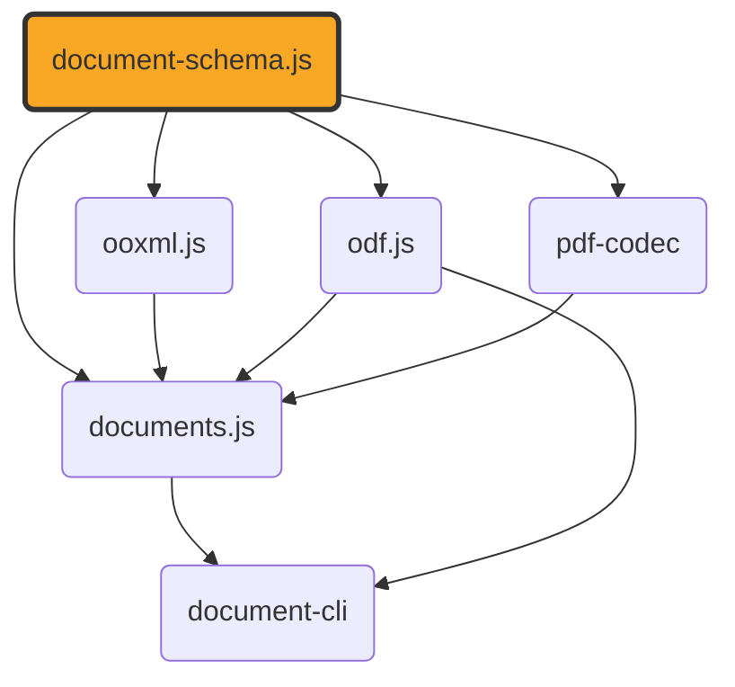

# document-schema.js

[](https://github.com/ExaDev/document-schema.js) [](https://www.npmjs.com/package/document-schema.js) [](https://github.com/ExaDev/document-schema.js/releases/latest) [](https://github.com/ExaDev/document-schema.js/actions)

> The canonical, format-agnostic content and layout schema pivot shared by [ooxml.js](https://github.com/ExaDev/ooxml.js), [odf.js](https://github.com/ExaDev/odf.js), [documents.js](https://github.com/ExaDev/documents.js), and [pdf-codec](https://github.com/ExaDev/pdf-codec).

Both `ooxml.js` and `documents.js` independently arrived at the same content vocabulary -- paragraphs, runs, tables, images, shapes, slides -- because `documents.js`'s docx/pptx-to-PDF pipeline needed a richer model than `ooxml.js`'s own readers originally produced, and that model was later ported back into `ooxml.js` itself. The result was two field-identical copies maintained in two places. This package is the fix: one schema, imported by every format package instead of redefined by each. It also sidesteps a circular dependency that would otherwise appear once `odf.js` exists, since `documents.js` depends on both `ooxml.js` and `odf.js`.



`ContentDocument` (the semantic pivot) is a discriminated union of four kinds: `wordprocessing` (docx/odt-style sections of paragraphs/runs/tables/images), `presentation` (pptx/odp-style slides of shapes), `spreadsheet` (xlsx/ods-style sheets of cells, columns, rows, and print settings), and `drawing` (odg-style pages of shapes plus vector primitives -- rect/ellipse/line/path). `ContentEmbeddedObjectSchema` lets any of the four embed another whole `ContentDocument`. `LayoutDocument` (the PDF-rendering pivot) is pages of positioned `LayoutItem`s -- `text`/`image`/`rect`/`line`/`ellipse`/`path`/`link` -- in PDF user-space coordinates, with `LayoutPathSchema` modelling a general vector path rather than only axis-aligned rectangles. `DocumentPackageSchema` is a small envelope pairing the two: `content` required, `layout` optional (it's a derived artifact, absent until something lays the content out), correlated via each item's own `sourcePath` when both are present -- a pairing this schema does not itself keep in sync or detect as stale.

It contains only [Zod](https://zod.dev) schemas, their inferred types, and a handful of trivial schema-attached helpers (hex-colour conversion, a recursive structural type guard for the mutually-recursive table/block/embedded-object types). There is no XML, ZIP, PDF, or other binary handling here, and no `zod` dependency other than `zod` itself.

The GitHub repository is [`ExaDev/document-schema.js`](https://github.com/ExaDev/document-schema.js), matching the published npm package name.

## Usage

```ts
import { ContentDocumentSchema, DocumentPackageSchema, LayoutDocumentSchema } from 'document-schema.js';

const content = ContentDocumentSchema.parse(someWordprocessingOrPresentationValue);
const layout = LayoutDocumentSchema.parse(somePageLayoutValue);
const pkg = DocumentPackageSchema.parse({ formatVersion: 1, content, layout });
```

## JSON Schema

Alongside the Zod schemas/types above, the package publishes three plain [JSON Schema](https://json-schema.org) files -- generated from the same Zod definitions via [`z.toJSONSchema()`](https://zod.dev/json-schema) at build time (`scripts/generate-json-schemas.mjs`) -- for non-TypeScript consumers that want to validate against or generate types from these shapes without depending on Zod at all:

```ts
const documentPackageSchema = require('document-schema.js/schemas/document-package.schema.json');
// or, from a bundler/toolchain that supports JSON module imports:
import documentPackageSchema from 'document-schema.js/schemas/document-package.schema.json' with { type: 'json' };
```

or from any language/tool that can read a file out of `node_modules`:

```
node_modules/document-schema.js/schemas/document-package.schema.json
node_modules/document-schema.js/schemas/content-document.schema.json
node_modules/document-schema.js/schemas/layout-document.schema.json
```

Each file's `$id` is a `https://cdn.jsdelivr.net/npm/document-schema.js@<version>/schemas/<file>` URL, pinned to the exact npm version that generated it -- immutable (jsdelivr serves each version's own published tarball contents forever, with an immutable cache header) and genuinely live the moment that version is published, unlike a commit-SHA-pinned raw GitHub URL would be: a gitignored, generated file can never actually be committed at the commit whose SHA it would need to embed, since committing it changes the tree and thus the hash. The three files are cross-referenced via real `$ref`s (e.g. `document-package.schema.json`'s `content`/`layout` properties `$ref` the other two files directly, at that same version), so a JSON Schema validator that resolves `$ref`s over HTTP (or against local copies of all three files) can validate a whole `DocumentPackage` value. `content-document.schema.json` additionally carries a `$defs` block for the recursive paragraph/table/embedded-object block model, which Zod's own converter can't express directly (see that script's own top-of-file comment for why).

### Self-describing JSON

`documentPackageWithSchema`/`contentDocumentWithSchema`/`layoutDocumentWithSchema` each take a real `DocumentPackage`/`ContentDocument`/`LayoutDocument` value and return the same value with a `$schema` property added, pointing at the `.schema.json` file above for the *currently installed* package version:

```ts
import { documentPackageWithSchema } from 'document-schema.js';

const tagged = documentPackageWithSchema(pkg);
// { $schema: 'https://cdn.jsdelivr.net/npm/document-schema.js@1.6.1/schemas/document-package.schema.json', formatVersion: 1, content: {...}, layout: {...} }
writeFileSync('package.json.doc', JSON.stringify(tagged, null, 2));
```

A caller who already knows the kind can keep ingesting with the existing schemas directly -- `DocumentPackageSchema.parse(value)` (etc.) already tolerates and silently strips an incoming `$schema` property, since none of these schemas are `.strict()`. `documentFromJson` exists for the "don't yet know the kind" case: it reads `$schema` to decide which of the three schemas to run, then that schema does the real structural validation:

```ts
import { documentFromJson, UnrecognizedDocumentSchemaError } from 'document-schema.js';

try {
  const { kind, value } = documentFromJson(JSON.parse(readFileSync('some-file.json', 'utf8')));
  // kind: 'DocumentPackage' | 'ContentDocument' | 'LayoutDocument'
} catch (error) {
  if (error instanceof UnrecognizedDocumentSchemaError) {
    console.error('not a document-schema.js value:', error.schema);
  }
}
```

`documentSchemaKindOf(value)` is the lower-level building block `documentFromJson` uses internally -- exported on its own for a caller that only wants to know which kind a value claims to be (version-agnostically: a `$schema` from an older or newer installed version still resolves), without also parsing it. `schemaUriFor(kind)` is the URL builder itself, also exported directly. Deliberately not added: a JSON-Schema-validator dependency (e.g. `ajv`) for ingest -- the generated `.schema.json` files are already a strictly *weaker* approximation of the real Zod schemas (see the two hand-authored `$defs` fragments above), so re-validating against them on ingest would be a fidelity regression, not an improvement.

## Used by

- [ooxml.js](https://github.com/ExaDev/ooxml.js) — its `readDocx`/`readPptx`/`readXlsxContent` return `ContentSection[]`/`ContentSlide[]`/spreadsheet `ContentSheet[]` typed against this package's own schemas, not a locally-defined lookalike.
- [odf.js](https://github.com/ExaDev/odf.js) — its ODF typed readers (`readOdt`, `readOdp`, `readOds`, `readOdg`, …) return the same shared types, so an ODF document and an OOXML document speak the identical pivot.
- [documents.js](https://github.com/ExaDev/documents.js) — the primary consumer of both `ContentDocument` and `LayoutDocument`, which it converts between via its layout engines and its `pdf-codec` dependency, and of `DocumentPackage` as the `onDocument` side-channel value its conversion functions hand back.
- [pdf-codec](https://github.com/ExaDev/pdf-codec) — the hand-written PDF codec extracted from `documents.js`: `readPdf`/`writePdf` and its own `pdfCodec` z.codec() pair operate entirely in terms of this package's `LayoutDocument` (plus the item kinds it's built from -- `LayoutItem`/`LayoutText`/`LayoutImage`/`LayoutRect`/`LayoutEllipse`/`LayoutLink`/`LayoutPath`/`LayoutSubpath`/`LayoutPathSegment`/`LayoutPage`/`LayoutImageAsset`/`LayoutMetadata`), `Color`/`LayoutFont` (aliased `LayoutColor`/`LayoutFont` at its own call sites), and `LAYOUT_FORMAT_VERSION`/`COLOR_BLACK`/`LayoutDocumentSchema` -- it never redeclares any of these itself, unlike its own `MathBox`/`PositionedFormula` mirror of `documents.js`'s MathML types (a deliberate, narrower exception -- see pdf-codec's own README).

None of these four packages depend on each other for this vocabulary — each depends on `document-schema.js` directly, which is the whole point: one schema, not four independently-maintained, drift-prone copies.

## npm aliases

This package also publishes under the following alternate npm names — the identical build, same version, republished by CI alongside the primary `document-schema.js` package:

- [document-content-model](https://www.npmjs.com/package/document-content-model)
- [doc-model.js](https://www.npmjs.com/package/doc-model.js)
- [doc-schema.js](https://www.npmjs.com/package/doc-schema.js)
- [document-schema](https://www.npmjs.com/package/document-schema)
- [document-model.js](https://www.npmjs.com/package/document-model.js)

## License

MIT
