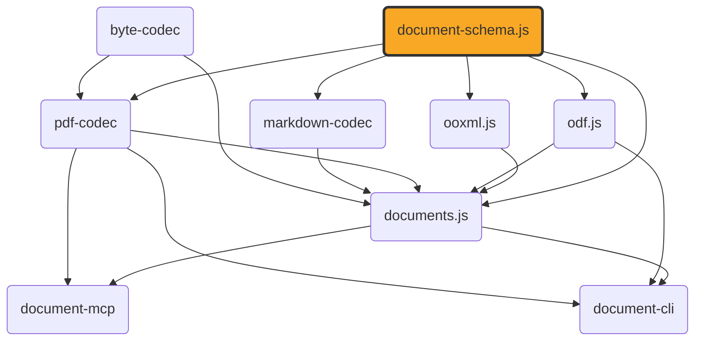

# document-schema.js

[](https://github.com/ExaDev/document-schema.js) [](https://www.npmjs.com/package/document-schema.js) [](https://github.com/ExaDev/document-schema.js/releases/latest) [](https://github.com/ExaDev/document-schema.js/actions)

> The canonical, format-agnostic content and layout schema pivot shared by [ooxml.js](https://github.com/ExaDev/ooxml.js), [odf.js](https://github.com/ExaDev/odf.js), [documents.js](https://github.com/ExaDev/documents.js), [pdf-codec](https://github.com/ExaDev/pdf-codec), and [markdown-codec](https://github.com/ExaDev/markdown-codec).

Both `ooxml.js` and `documents.js` independently arrived at the same content vocabulary, producing two field-identical copies in two places. This package is the fix: one schema, imported by every format package instead of redefined by each. It also sidesteps a circular dependency (`documents.js` depends on both `ooxml.js` and `odf.js`).



`ContentDocument` (the semantic pivot) is a discriminated union of five kinds: `wordprocessing` (docx/odt sections of paragraphs/runs/tables/images), `presentation` (pptx/odp slides of shapes), `spreadsheet` (xlsx/ods sheets of cells, columns, rows, print settings), `drawing` (odg pages of shapes plus vector primitives — rect/ellipse/line/path), and `formula` (an equation carrying its own MathML node tree plus StarMath source when the producing format had one). `ContentEmbeddedObjectSchema` lets any of the five embed another whole `ContentDocument`. `LayoutDocument` (the PDF-rendering pivot) is pages of positioned `LayoutItem`s (`text`/`image`/`rect`/`line`/`ellipse`/`path`/`link`) in PDF user-space coordinates. `DocumentPackageSchema` pairs the two: `content` required, `layout` optional (derived, absent until something lays content out); the schema does not keep them in sync or detect staleness.

The package contains only [Zod](https://zod.dev) schemas, their inferred types, trivial schema-attached helpers (hex-colour conversion, recursive structural type guards), and two small structural interfaces (`ContentCodec`/`LayoutCodec`, see [Codecs](#codecs)). No XML, ZIP, PDF, or binary handling; the sole dependency is `zod`.

Two format-agnostic helpers live here because they operate on the content model itself: cell-addressing utilities in `src/a1.ts` (0-based row/column indices, row-first order matching `ContentSheetCell`'s `{row, column}`) and the `FontFace` interface in `src/font-port.ts` (`{family, bold, italic}`).

## Usage

```ts
import { ContentDocumentSchema, DocumentPackageSchema, LayoutDocumentSchema } from 'document-schema.js';

const content = ContentDocumentSchema.parse(someWordprocessingOrPresentationValue);
const layout = LayoutDocumentSchema.parse(somePageLayoutValue);
const pkg = DocumentPackageSchema.parse({ formatVersion: 1, content, layout });
```

Every module is also importable directly — `tsdown` builds one file per source module, and `package.json`'s `"./*"` export makes each individually resolvable:

```ts
import { schemaUriFor } from 'document-schema.js/schema-io';
import { ColorSchema } from 'document-schema.js/color';
```

## Codecs

`ContentCodec`/`LayoutCodec` (`src/codec.ts`) are the format-agnostic *interfaces* a sibling package's docx/pptx/odt/odp/ods/odg/xlsx/markdown/PDF codec can implement, so a caller working across formats holds one of these instead of a format-specific function pair:

```ts
import type { ContentCodec, LayoutCodec } from 'document-schema.js';

declare const docxCodec: ContentCodec; // read(bytes) -> ContentDocument; write(content) -> bytes -- write is optional
declare const pdfCodec: LayoutCodec; // read(bytes) -> LayoutDocument; write(layout) -> bytes -- write is required
```

The two are separate interfaces (not one `DocumentCodec`) because the formats are asymmetric: most produce only *content* on read (layout is a later engine-driven step); PDF produces *layout* cheaply and content only via a separate, lossy reconstruction pass. `ContentCodec.write` is optional (`odf` has a reader but no builder — recovering MathML from glyphs is OCR-adjacent); `LayoutCodec.write` is required. Both are generic over their own `TOptions`.

Neither interface constructs a `DocumentPackage`; composing one is the caller's job (`documents.js`'s `DOCUMENT_FORMAT_CODECS` registry is the concrete example).

This package also hosts the **port contracts** a layout engine consumes: `TextMeasurer`/`StyledRun`/`WrappedLine` (`src/text-layout.ts`), `ProvidedFont`/`FontSubstitution` (`src/font-port.ts`), `MathBox`/`MathFontMetrics`/`PositionedFormula` (`src/math-layout.ts`), and `Point` (`src/geometry.ts`).

## JSON Schema

Three plain [JSON Schema](https://json-schema.org) files are published — generated from the Zod definitions via [`z.toJSONSchema()`](https://zod.dev/json-schema) at build time (`scripts/generate-json-schemas.mjs`) — for non-TypeScript consumers:

```ts
const documentPackageSchema = require('document-schema.js/schemas/document-package.schema.json');
// or, from a bundler/toolchain that supports JSON module imports:
import documentPackageSchema from 'document-schema.js/schemas/document-package.schema.json' with { type: 'json' };
```

or from any language/tool that can read a file out of `node_modules`:

```
node_modules/document-schema.js/schemas/document-package.schema.json
node_modules/document-schema.js/schemas/content-document.schema.json
node_modules/document-schema.js/schemas/layout-document.schema.json
```

Each file's `$id` is a jsdelivr URL pinned to the exact npm version — immutable and live on publish. The three files cross-reference via `$ref`s, so a validator resolving refs over HTTP can validate a whole `DocumentPackage`. `content-document.schema.json` carries a hand-authored `$defs` block for the recursive paragraph/table/embedded-object and MathML node models (Zod's converter cannot express these directly); `content-json-schema-defs.ts` holds those fragments, and a regression test compares each against a live `z.toJSONSchema()` of its real Zod counterpart so a field changed without updating its fragment fails a test. Fragments downstream of a `z.custom()` node (`ContentBlock`, `ContentTable`/`Cell`/`Row`, `ContentEmbeddedObjectBlock`, `MathMlNode`/`Element`/`Attribute`) still need hand re-verification against `src/content.ts`/`src/mathml.ts` — see below.

### `z.custom()` vs `z.lazy()` for recursive schemas

`ContentBlockSchema`, `ContentEmbeddedObjectSchema`, and `MathMlNodeSchema` are `z.custom()` type-guard predicates rather than real Zod schemas, because `z.lazy()` was believed to collapse to `unknown` for recursive children. A throwaway spike (reverted) re-tested `MathMlNodeSchema` (the simplest case) against `zod@4.4.3`.

**Finding: `z.lazy()` works now, with one constructional gotcha.** The naive rewrite —

```ts
export const MathMlElementSchema: z.ZodType<MathMlElement> = z.object({
  type: z.literal('element'),
  tag: z.string(),
  attributes: z.array(MathMlAttributeSchema),
  children: z.lazy(() => z.array(MathMlNodeSchema)),
});
export const MathMlNodeSchema: z.ZodType<MathMlNode> = z.discriminatedUnion('type', [
  MathMlTextSchema, MathMlCdataSchema, MathMlCommentSchema, MathMlDeclarationSchema, MathMlPiSchema, MathMlElementSchema,
]);
```

— fails to typecheck: annotating `MathMlElementSchema` as `z.ZodType<MathMlElement>` widens it so `z.discriminatedUnion` (which needs each member's internal `propValues`) rejects it, and dropping the annotation hits TypeScript's circular-inference error. The fix: annotate **only the outer union's binding** (`MathMlNodeSchema`), leaving every member schema unannotated and fully inferred — all tests passed, and `z.toJSONSchema()` produced a real `oneOf` with `{ "$ref": "#" }` at the recursion point.

**This is a tracked follow-up, not carried out here.** Converting `MathMlNodeSchema` for real would let the JSON-schema generator drop its hand-authored `$defs` entries; `ContentBlockSchema`/`ContentEmbeddedObjectSchema` are harder (mutual recursion across table/cell/row, plus the full `ContentDocument` cycle) and were not spiked.

### Self-describing JSON

`documentPackageWithSchema`/`contentDocumentWithSchema`/`layoutDocumentWithSchema` each stamp a `$schema` property pointing at the `.schema.json` file for the currently installed version:

```ts
import { documentPackageWithSchema } from 'document-schema.js';

const tagged = documentPackageWithSchema(pkg);
// { $schema: 'https://cdn.jsdelivr.net/npm/document-schema.js@1.6.1/schemas/document-package.schema.json', formatVersion: 1, content: {...}, layout: {...} }
writeFileSync('package.json.doc', JSON.stringify(tagged, null, 2));
```

A caller who already knows the kind can keep using the schemas directly — `DocumentPackageSchema.parse(value)` tolerates and strips an incoming `$schema` (none are `.strict()`). `documentFromJson` is for the "don't yet know the kind" case, reading `$schema` to decide which schema to run:

```ts
import { documentFromJson, UnrecognizedDocumentSchemaError } from 'document-schema.js';

try {
  const { kind, value } = documentFromJson(JSON.parse(readFileSync('some-file.json', 'utf8')));
  // kind: 'DocumentPackage' | 'ContentDocument' | 'LayoutDocument'
} catch (error) {
  if (error instanceof UnrecognizedDocumentSchemaError) {
    console.error('not a document-schema.js value:', error.schema);
  }
}
```

`documentSchemaKindOf(value)` returns the kind version-agnostically without parsing; `schemaUriFor(kind)` is the URL builder. No JSON-Schema-validator dependency (e.g. `ajv`) for ingest — the `.schema.json` files are a weaker approximation of the real Zod schemas, so re-validating against them would be a fidelity regression.

## Used by

- [ooxml.js](https://github.com/ExaDev/ooxml.js) — `readDocx`/`readPptx`/`readXlsxContent` return types are typed against this package's schemas, not a local lookalike.
- [odf.js](https://github.com/ExaDev/odf.js) — ODF typed readers return the same shared types, so ODF and OOXML speak the identical pivot.
- [documents.js](https://github.com/ExaDev/documents.js) — primary consumer of `ContentDocument`, `LayoutDocument`, and `DocumentPackage`; its `DOCUMENT_FORMAT_CODECS` registry implements `ContentCodec`/`LayoutCodec` per format.
- [pdf-codec](https://github.com/ExaDev/pdf-codec) — `readPdf`/`writePdf` operate on this package's `LayoutDocument` and item kinds, never redeclaring them.
- [markdown-codec](https://github.com/ExaDev/markdown-codec) — `readMarkdown`/`writeMarkdown` read and write this package's `ContentDocument` directly.

None depend on each other for this vocabulary — each depends on `document-schema.js` directly.

## Build, test, and lint

Requires Node.js `>=20` and pnpm `11.6.0` (pinned via `packageManager` in `package.json`).

```sh
pnpm install
pnpm build         # turbo run _build -> tsdown && node scripts/generate-json-schemas.mjs (ESM + CJS + .d.ts in dist/, plus the three published .schema.json files in schemas/)
pnpm typecheck     # turbo run _typecheck _typecheck:node -> tsc -p tsconfig.json && tsc -p tsconfig.node.json
pnpm lint          # turbo run _lint -> eslint . --fix --cache --max-warnings 0
pnpm test          # turbo run _test -> vitest run --project unit
pnpm test:workers  # turbo run _test:workers -> vitest run --config vitest.workers.config.ts (runs the test/workers suite under the real Cloudflare Workers runtime via @cloudflare/vitest-pool-workers, turning "pure Zod, no Node-API usage" into a runtime-checked fact rather than an assertion)
pnpm test:watch    # vitest --project unit
pnpm test:smoke    # turbo run _test:smoke -> rebuilds dist/ and schemas/ first, then verifies the built ESM/CJS output loads and exposes the public surface, and that the three generated JSON Schema files exist and are correctly version-pinned
```

To run a single test file: `pnpm vitest run src/path/to/file.test.ts`.

## npm aliases

This package also publishes under the following alternate npm names — the identical build, same version, republished by CI alongside the primary `document-schema.js` package:

- [document-content-model](https://www.npmjs.com/package/document-content-model)
- [doc-model.js](https://www.npmjs.com/package/doc-model.js)
- [doc-schema.js](https://www.npmjs.com/package/doc-schema.js)
- [document-schema](https://www.npmjs.com/package/document-schema)
- [document-model.js](https://www.npmjs.com/package/document-model.js)

## License

MIT
