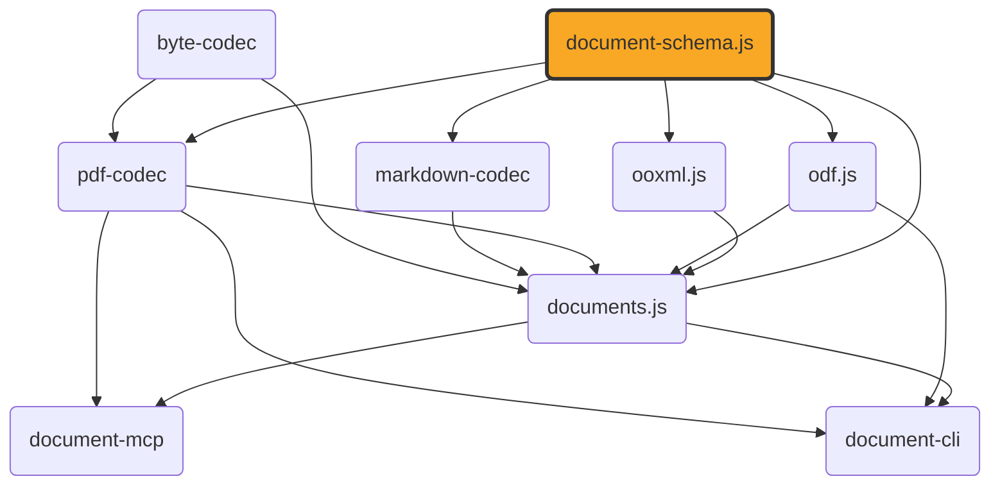

# document-schema.js

[](https://github.com/ExaDev/document-schema.js) [](https://www.npmjs.com/package/document-schema.js) [](https://github.com/ExaDev/document-schema.js/releases/latest) [](https://github.com/ExaDev/document-schema.js/actions)

> The canonical, format-agnostic content and layout schema pivot shared by [ooxml.js](https://github.com/ExaDev/ooxml.js), [odf.js](https://github.com/ExaDev/odf.js), [documents.js](https://github.com/ExaDev/documents.js), [pdf-codec](https://github.com/ExaDev/pdf-codec), and [markdown-codec](https://github.com/ExaDev/markdown-codec).

Both `ooxml.js` and `documents.js` independently arrived at the same content vocabulary -- paragraphs, runs, tables, images, shapes, slides -- because `documents.js`'s docx/pptx-to-PDF pipeline needed a richer model than `ooxml.js`'s own readers originally produced, and that model was later ported back into `ooxml.js` itself. The result was two field-identical copies maintained in two places. This package is the fix: one schema, imported by every format package instead of redefined by each. It also sidesteps a circular dependency that would otherwise appear once `odf.js` exists, since `documents.js` depends on both `ooxml.js` and `odf.js`.



`ContentDocument` (the semantic pivot) is a discriminated union of five kinds: `wordprocessing` (docx/odt-style sections of paragraphs/runs/tables/images), `presentation` (pptx/odp-style slides of shapes), `spreadsheet` (xlsx/ods-style sheets of cells, columns, rows, and print settings), `drawing` (odg-style pages of shapes plus vector primitives -- rect/ellipse/line/path), and `formula` (an equation, carrying its own MathML presentation-layer node tree plus the StarMath source when the producing format had one). `ContentEmbeddedObjectSchema` lets any of the five embed another whole `ContentDocument` -- including a `formula` one, which is what an embedded equation inside a document or slide now carries. `LayoutDocument` (the PDF-rendering pivot) is pages of positioned `LayoutItem`s -- `text`/`image`/`rect`/`line`/`ellipse`/`path`/`link` -- in PDF user-space coordinates, with `LayoutPathSchema` modelling a general vector path rather than only axis-aligned rectangles. `DocumentPackageSchema` is a small envelope pairing the two: `content` required, `layout` optional (it's a derived artifact, absent until something lays the content out), correlated via each item's own `sourcePath` when both are present -- a pairing this schema does not itself keep in sync or detect as stale.

It contains only [Zod](https://zod.dev) schemas, their inferred types, a handful of trivial schema-attached helpers (hex-colour conversion, recursive structural type guards for the mutually-recursive table/block/embedded-object types and for the MathML node tree), and two small structural interfaces (`ContentCodec`/`LayoutCodec`, see [Codecs](#codecs) below) that a sibling package's own format codec can implement -- no runtime code of their own either. There is no XML, ZIP, PDF, or other binary handling here, and no `zod` dependency other than `zod` itself.

The GitHub repository is [`ExaDev/document-schema.js`](https://github.com/ExaDev/document-schema.js), matching the published npm package name.

## Usage

```ts
import { ContentDocumentSchema, DocumentPackageSchema, LayoutDocumentSchema } from 'document-schema.js';

const content = ContentDocumentSchema.parse(someWordprocessingOrPresentationValue);
const layout = LayoutDocumentSchema.parse(somePageLayoutValue);
const pkg = DocumentPackageSchema.parse({ formatVersion: 1, content, layout });
```

Every module is also importable directly, without going through the barrel above -- `tsdown` builds one file per source module rather than a single bundle, and `package.json`'s `"./*"` export makes each one individually resolvable by name:

```ts
import { schemaUriFor } from 'document-schema.js/schema-io';
import { ColorSchema } from 'document-schema.js/color';
```

## Codecs

Alongside the schemas themselves, `ContentCodec`/`LayoutCodec` (`src/codec.ts`) are the format-agnostic *interfaces* a sibling package's own docx/pptx/odt/odp/ods/odg/xlsx/markdown/PDF codec can implement, so a caller working across formats can hold one of these instead of a format-specific function pair:

```ts
import type { ContentCodec, LayoutCodec } from 'document-schema.js';

declare const docxCodec: ContentCodec; // read(bytes) -> ContentDocument; write(content) -> bytes -- write is optional
declare const pdfCodec: LayoutCodec; // read(bytes) -> LayoutDocument; write(layout) -> bytes -- write is required
```

The two are deliberately separate interfaces rather than one `DocumentCodec` shaped like `DocumentPackage`, because the formats they model are asymmetric: most formats (docx/pptx/odt/odp/ods/odg/markdown) only ever produce *content* on read, with layout always a later, engine-driven step; PDF is the mirror image, producing *layout* cheaply on read and content only via a separate, expensive, lossy, opt-in reconstruction pass that is emphatically not part of "reading" a PDF. `ContentCodec.write` is deliberately optional -- this models a real, permanent asymmetry, not a temporary gap: the `odf` format (a standalone ODF formula document) has a reader but genuinely no builder at all, since recovering structured MathML from rendered glyphs is a categorically different, OCR-adjacent problem than generating them. `LayoutCodec.write` is not optional, since PDF -- the only format with a `LayoutCodec` implementation anywhere in this family -- always supports both directions equally readily. Both interfaces are generic over their own `TOptions` (defaulting to `unknown`) rather than sharing one options shape across every implementation, since each real format's own read/write options are format-specific today (an `AbortSignal`, a font-substitution callback, a diagnostic sink) and forcing them into one shared shape would either be too narrow for some formats or carry fields meaningless to others.

Neither interface constructs a `DocumentPackage` itself: a codec's `read()` returns one half (content, or layout, never both), and composing a `DocumentPackage` from a `ContentCodec.read()` result plus a separately-run layout-engine pass is the caller's job, one level up from either interface -- `documents.js`'s own `DOCUMENT_FORMAT_CODECS` registry (`src/codecs/registry.ts`) is the concrete example, implementing a `ContentCodec`/`LayoutCodec` pair per format over its own existing read/build/layout functions.

Alongside the schemas and the codec interfaces, this package also hosts the **port contracts** a layout engine consumes — the interfaces and data shapes a neutral layer needs, independent of any concrete rendering backend. `src/text-layout.ts` (`TextMeasurer`, `StyledRun`, `WrappedLine`, `WrapOptions`), `src/font-port.ts` (`ProvidedFont`, `FontSubstitution`, `FontRegistryOptions`), `src/math-layout.ts` (`MathBox`, `MathLayoutItem`, `MathFontMetrics`, `PositionedFormula`), and `Point` in `src/geometry.ts` are all here, so a layout engine never reaches into a specific backend (pdf-codec) for its contracts — the backend implements them, the engine consumes them.

## JSON Schema

Alongside the Zod schemas/types above, the package publishes three plain [JSON Schema](https://json-schema.org) files -- generated from the same Zod definitions via [`z.toJSONSchema()`](https://zod.dev/json-schema) at build time (`scripts/generate-json-schemas.mjs`) -- for non-TypeScript consumers that want to validate against or generate types from these shapes without depending on Zod at all:

```ts
const documentPackageSchema = require('document-schema.js/schemas/document-package.schema.json');
// or, from a bundler/toolchain that supports JSON module imports:
import documentPackageSchema from 'document-schema.js/schemas/document-package.schema.json' with { type: 'json' };
```

or from any language/tool that can read a file out of `node_modules`:

```
node_modules/document-schema.js/schemas/document-package.schema.json
node_modules/document-schema.js/schemas/content-document.schema.json
node_modules/document-schema.js/schemas/layout-document.schema.json
```

Each file's `$id` is a `https://cdn.jsdelivr.net/npm/document-schema.js@<version>/schemas/<file>` URL, pinned to the exact npm version that generated it -- immutable (jsdelivr serves each version's own published tarball contents forever, with an immutable cache header) and genuinely live the moment that version is published, unlike a commit-SHA-pinned raw GitHub URL would be: a gitignored, generated file can never actually be committed at the commit whose SHA it would need to embed, since committing it changes the tree and thus the hash. The three files are cross-referenced via real `$ref`s (e.g. `document-package.schema.json`'s `content`/`layout` properties `$ref` the other two files directly, at that same version), so a JSON Schema validator that resolves `$ref`s over HTTP (or against local copies of all three files) can validate a whole `DocumentPackage` value. `content-document.schema.json` additionally carries a `$defs` block for the recursive paragraph/table/embedded-object block model and for the recursive MathML node tree the `formula` kind carries, neither of which Zod's own converter can express directly (see that script's own top-of-file comment for why). `content-json-schema-defs.ts` (a normal, fully typechecked/linted `src/` module, not part of the `scripts/` build step) is where those hand-authored `$defs` fragments actually live; a regression test (`content-json-schema-defs.test.ts`) holds every fragment with a real, non-recursive, non-`z.custom()` exported Zod schema counterpart (`Color`, `Box`, `Alignment`, `ContentStrokeStyle`, `ContentBorder`, `ContentCellBorders`, `ContentListMembership`, `ContentRun`, `ContentParagraph`, `ContentImageBlock`, `ContentPageBreak`) to a live `z.toJSONSchema()` comparison against that real schema, so a field added to (or removed from) one of those schemas without updating its hand-authored `$defs` fragment now fails a test rather than silently drifting. The remaining fragments (`ContentBlock`, `ContentTable`/`ContentTableRow`/`ContentTableCell`, `ContentEmbeddedObjectBlock`, `MathMlNode`/`MathMlElement`/`MathMlAttribute`) sit downstream of one of the three genuinely un-representable `z.custom()` nodes and still need re-verifying by hand against `src/content.ts`/`src/mathml.ts` whenever those files change -- see the `z.lazy()` investigation immediately below for why those three nodes are `z.custom()` in the first place, and whether that still has to be true.

### `z.custom()` vs `z.lazy()` for recursive schemas

`ContentBlockSchema`, `ContentEmbeddedObjectSchema` (`src/content.ts`), and `MathMlNodeSchema` (`src/mathml.ts`) are all `z.custom()` type-guard predicates rather than real Zod schemas, because -- per each file's own long-standing code comment -- `z.lazy()` was believed to "collapse to `unknown`" for recursive children in the pinned Zod version. That belief was re-tested directly against the version actually installed today (`zod@4.4.3`, confirmed via `node_modules/zod/package.json`) by converting `MathMlNodeSchema`/`MathMlElementSchema` (the simplest of the three -- a self-recursive discriminated union, not `ContentBlock`'s mutual table/cell recursion or the cross-cutting `ContentDocument` cycle `ContentEmbeddedObject` carries) to a genuine `z.lazy()`-based pair, as a throwaway spike later reverted in full (`git diff -- src/mathml.ts` shows no changes on the commit this note was added in).

**Finding: `zod@4.4.3`'s `z.lazy()` genuinely supports this now, with one real constructional gotcha.** The naive rewrite --

```ts
export const MathMlElementSchema: z.ZodType<MathMlElement> = z.object({
  type: z.literal('element'),
  tag: z.string(),
  attributes: z.array(MathMlAttributeSchema),
  children: z.lazy(() => z.array(MathMlNodeSchema)),
});
export const MathMlNodeSchema: z.ZodType<MathMlNode> = z.discriminatedUnion('type', [
  MathMlTextSchema, MathMlCdataSchema, MathMlCommentSchema, MathMlDeclarationSchema, MathMlPiSchema, MathMlElementSchema,
]);
```

fails to typecheck: annotating `MathMlElementSchema` itself as `z.ZodType<MathMlElement>` widens it enough that `z.discriminatedUnion` (which needs each member's own internal `propValues` metadata to dispatch on the discriminant) rejects it with a real, correct type error (`Types of property '_zod.propValues' are incompatible ... Type 'undefined' is not assignable to type 'PropValues'`) -- not a Zod bug, but a genuine consequence of erasing a `ZodObject`'s specific shape down to the generic `ZodType` interface. Dropping the annotation entirely instead produces TypeScript's own classic circular-inference error (`'MathMlElementSchema' implicitly has type 'any' because it does not have a type annotation and is referenced directly or indirectly in its own initializer`) -- this is the failure the original "collapses to `unknown`" comment was almost certainly describing. The fix that actually works: annotate **only the outer union's own binding** (`MathMlNodeSchema: z.ZodType<MathMlNode> = z.discriminatedUnion(...)`), leaving every member schema, `MathMlElementSchema` included, unannotated and fully inferred. That one annotation breaks the circularity for the type-checker without erasing any member's own internal shape, since the erasure only ever applies to the final union result, not to what's passed into `z.discriminatedUnion`'s own argument list.

With that one change, every existing test in `mathml.test.ts` passed unmodified -- including the four-level-deep nested-element test and the exact-failure-at-the-deepest-level negative test -- proving recursion genuinely terminates and validates correctly at runtime, not just at the type level. `z.toJSONSchema(MathMlNodeSchema, { unrepresentable: 'any' })`, called on its own (no registry, no `override()`), produced a fully real, standard `oneOf`-based JSON Schema with a genuine `{ "$ref": "#" }` at the exact recursion point (`element.children.items`) -- no empty `{}` degenerate node anywhere, and `unrepresentable: 'any'` never actually had to activate for it.

**What this means, and what it doesn't (yet):** this is a confirmed, empirically-verified capability upgrade in the currently-pinned Zod version for the *simplest* of the three `z.custom()` cases in this package. It was **not** implemented as a real change in this task -- it's flagged here as a scoped, tracked follow-up, not carried out speculatively alongside unrelated work. Converting `MathMlNodeSchema` for real would let `scripts/generate-json-schemas.mjs` drop its `MathMlNode`/`MathMlElement`/`MathMlAttribute` hand-authored `$defs` entries (and the `override()` branch for `MathMlNodeSchema`) entirely, replacing them with Zod's own native recursive output. `ContentBlockSchema`/`ContentEmbeddedObjectSchema` are meaningfully harder (mutual recursion across `ContentBlock ↔ ContentTableCell ↔ ContentTableRow ↔ ContentTable`, plus `ContentEmbeddedObject`'s cycle back through a whole five-variant `ContentDocument` union) and were not spiked at all -- the same "annotate only the outermost binding" technique is the natural starting point, but the actual mutual-recursion shape needs its own from-scratch verification before assuming it generalises.

### Self-describing JSON

`documentPackageWithSchema`/`contentDocumentWithSchema`/`layoutDocumentWithSchema` each take a real `DocumentPackage`/`ContentDocument`/`LayoutDocument` value and return the same value with a `$schema` property added, pointing at the `.schema.json` file above for the *currently installed* package version:

```ts
import { documentPackageWithSchema } from 'document-schema.js';

const tagged = documentPackageWithSchema(pkg);
// { $schema: 'https://cdn.jsdelivr.net/npm/document-schema.js@1.6.1/schemas/document-package.schema.json', formatVersion: 1, content: {...}, layout: {...} }
writeFileSync('package.json.doc', JSON.stringify(tagged, null, 2));
```

A caller who already knows the kind can keep ingesting with the existing schemas directly -- `DocumentPackageSchema.parse(value)` (etc.) already tolerates and silently strips an incoming `$schema` property, since none of these schemas are `.strict()`. `documentFromJson` exists for the "don't yet know the kind" case: it reads `$schema` to decide which of the three schemas to run, then that schema does the real structural validation:

```ts
import { documentFromJson, UnrecognizedDocumentSchemaError } from 'document-schema.js';

try {
  const { kind, value } = documentFromJson(JSON.parse(readFileSync('some-file.json', 'utf8')));
  // kind: 'DocumentPackage' | 'ContentDocument' | 'LayoutDocument'
} catch (error) {
  if (error instanceof UnrecognizedDocumentSchemaError) {
    console.error('not a document-schema.js value:', error.schema);
  }
}
```

`documentSchemaKindOf(value)` is the lower-level building block `documentFromJson` uses internally -- exported on its own for a caller that only wants to know which kind a value claims to be (version-agnostically: a `$schema` from an older or newer installed version still resolves), without also parsing it. `schemaUriFor(kind)` is the URL builder itself, also exported directly. Deliberately not added: a JSON-Schema-validator dependency (e.g. `ajv`) for ingest -- the generated `.schema.json` files are already a strictly *weaker* approximation of the real Zod schemas (see the hand-authored `$defs` fragments above), so re-validating against them on ingest would be a fidelity regression, not an improvement.

## Used by

- [ooxml.js](https://github.com/ExaDev/ooxml.js) — its `readDocx`/`readPptx`/`readXlsxContent` return `ContentSection[]`/`ContentSlide[]`/spreadsheet `ContentSheet[]` typed against this package's own schemas, not a locally-defined lookalike.
- [odf.js](https://github.com/ExaDev/odf.js) — its ODF typed readers (`readOdt`, `readOdp`, `readOds`, `readOdg`, …) return the same shared types, so an ODF document and an OOXML document speak the identical pivot.
- [documents.js](https://github.com/ExaDev/documents.js) — the primary consumer of both `ContentDocument` and `LayoutDocument`, which it converts between via its layout engines and its `pdf-codec` dependency, and of `DocumentPackage` as the `onDocument` side-channel value its conversion functions hand back. Its own `DOCUMENT_FORMAT_CODECS` registry additionally implements this package's `ContentCodec`/`LayoutCodec` interfaces per format, over its existing read/build/layout functions.
- [pdf-codec](https://github.com/ExaDev/pdf-codec) — the hand-written PDF codec extracted from `documents.js`: `readPdf`/`writePdf` and its own `pdfCodec` z.codec() pair operate entirely in terms of this package's `LayoutDocument` (plus the item kinds it's built from -- `LayoutItem`/`LayoutText`/`LayoutImage`/`LayoutRect`/`LayoutEllipse`/`LayoutLink`/`LayoutPath`/`LayoutSubpath`/`LayoutPathSegment`/`LayoutPage`/`LayoutImageAsset`/`LayoutMetadata`), `Color`/`LayoutFont` (aliased `LayoutColor`/`LayoutFont` at its own call sites), and `LAYOUT_FORMAT_VERSION`/`COLOR_BLACK`/`LayoutDocumentSchema` -- it never redeclares any of these itself, unlike its own `MathBox`/`PositionedFormula` mirror of `documents.js`'s MathML types (a deliberate, narrower exception -- see pdf-codec's own README).
- [markdown-codec](https://github.com/ExaDev/markdown-codec) — the hand-written CommonMark+GFM codec: `readMarkdown`/`writeMarkdown` and its own `markdownCodec` z.codec() pair read and write this package's `ContentDocument` directly, the identical `wordprocessing` pivot `ooxml.js`'s `readDocx` and `odf.js`'s `readOdt` also produce.

None of these five packages depend on each other for this vocabulary — each depends on `document-schema.js` directly, which is the whole point: one schema, not five independently-maintained, drift-prone copies.

## npm aliases

This package also publishes under the following alternate npm names — the identical build, same version, republished by CI alongside the primary `document-schema.js` package:

- [document-content-model](https://www.npmjs.com/package/document-content-model)
- [doc-model.js](https://www.npmjs.com/package/doc-model.js)
- [doc-schema.js](https://www.npmjs.com/package/doc-schema.js)
- [document-schema](https://www.npmjs.com/package/document-schema)
- [document-model.js](https://www.npmjs.com/package/document-model.js)

## License

MIT
