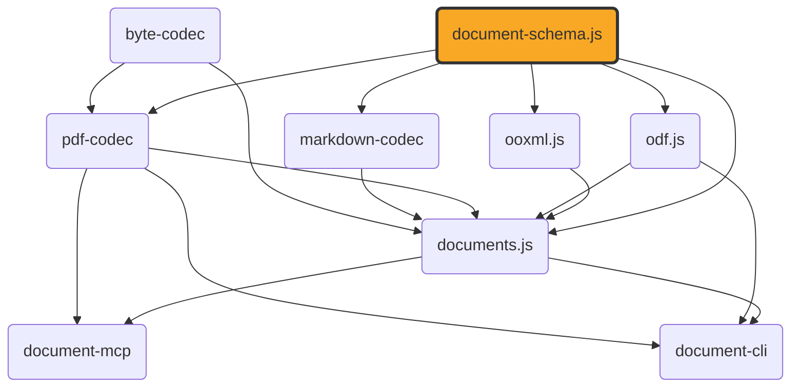

# document-schema.js

[](https://github.com/ExaDev/document-schema.js) [](https://www.npmjs.com/package/document-schema.js) [](https://github.com/ExaDev/document-schema.js/releases/latest) [](https://github.com/ExaDev/document-schema.js/actions)

> The canonical, format-agnostic content and document-package schema pivot shared by [ooxml.js](https://github.com/ExaDev/ooxml.js), [odf.js](https://github.com/ExaDev/odf.js), [documents.js](https://github.com/ExaDev/documents.js), [pdf-codec](https://github.com/ExaDev/pdf-codec), and [markdown-codec](https://github.com/ExaDev/markdown-codec).

Both `ooxml.js` and `documents.js` independently arrived at the same content vocabulary, producing two field-identical copies in two places. This package is the fix: one schema, imported by every format package instead of redefined by each. It also sidesteps a circular dependency (`documents.js` depends on both `ooxml.js` and `odf.js`).



`ContentDocument` (the semantic pivot) is a discriminated union of five kinds: `wordprocessing` (docx/odt sections of paragraphs/runs/tables/images), `presentation` (pptx/odp slides of shapes), `spreadsheet` (xlsx/ods sheets of cells, columns, rows, print settings), `drawing` (odg pages of shapes plus vector primitives — rect/ellipse/line/path), and `formula` (an equation carrying its own MathML node tree plus StarMath source when the producing format had one, extended with the two-layer math model: an optional verbatim-LaTeX `presentation` authoritative for rendering, an optional semantic `content: MathExpression` tree authoritative for computation, and provenance — neither layer stored derived from the other, so editing one never silently mutates the other). `ContentEmbeddedObjectSchema` lets any of the five embed another whole `ContentDocument`. Every paragraph/run/image/table/shape/vector/spreadsheet-cell leaf also carries its own canonical `headingLevel`-or-position fields directly: a `ContentParagraph`'s optional `headingLevel` (1 = the outermost heading, independent of the round-trip-only `styleId`), and every such leaf's optional `frames: LayoutFrame[]` — that node's own rendered page position(s) (`pageIndex` plus PDF user-space `xPt`/`yPt`/`widthPt`/`heightPt`), fused directly onto the content tree once a layout pass has run. `DocumentPackage` is the single hierarchical artefact — structure, layout, and content fused in one tree (see [The package tree](#the-package-tree)): the root carries `kind`, `metadata`, the optional document-level `symbolTable` and rendered `pages`, the optional package-level `styles`/`definitions` tables (see [Definitions tables and styles](#definitions-tables-and-styles)), and `children` — one group per top-level container with the content tree grouped inside it; the schema does not keep populated `frames` fields and `pages` in sync or detect staleness, and does not check that a tree's `style` refs name table entries (both are producer responsibilities, exactly as the frames/pages pairing always was). Every one of the five kinds also accepts an optional document-level `symbolTable` — the math curation layer mapping each written symbol glyph (within a scope) to its id, quantity kind, preferred unit, and definition source, alongside the unit registry (SI dimension-exponent vectors, exact rational conversions, per-unit-system normalisation contexts) that the `qty` nodes of lowered formulas resolve against.

The `LayoutDocument` family (pages of positioned `LayoutItem`s — `text`/`image`/`rect`/`line`/`ellipse`/`path`/`link` in PDF user-space coordinates) no longer lives here: 4.0.0 demoted it to a pdf-codec-private model ([pdf-codec#65](https://github.com/ExaDev/pdf-codec/issues/65)), where the only codec that ever read or wrote it owns it outright. `documentFromJson` recognises old layout-document `$schema` URIs and throws a tombstone pointing at pdf-codec rather than failing as if the value were unrelated. Dependents stay on document-schema.js 3.x via semver until their own majors, so the demotion is not a cascade-breaker.

The package contains only [Zod](https://zod.dev) schemas, their inferred types, trivial schema-attached helpers (hex-colour conversion, recursive structural type guards, the style-resolution helpers of `src/definitions.ts`), and one small structural interface (`ContentCodec`, see [Codecs](#codecs)). No XML, ZIP, PDF, or binary handling; the sole dependency is `zod`.

Two format-agnostic helpers live here because they operate on the content model itself: cell-addressing utilities in `src/a1.ts` (0-based row/column indices, row-first order matching `ContentSheetCell`'s `{row, column}`) and the `FontFace` interface in `src/font-port.ts` (`{family, bold, italic}`).

## Usage

```ts
import { ContentDocumentSchema, DocumentPackageSchema } from 'document-schema.js';

// The codec-exchange form: what every format's reader produces and every writer consumes -- always flat,
// always fully materialised (no styles table, no refs), never versioned (that lives on the serialised artefact).
const content = ContentDocumentSchema.parse(someWordprocessingOrPresentationValue);

// The package tree: what a serialised dump carries. `children` holds one group per top-level container,
// with the content grouped inside it (see "The package tree" below).
const pkg = DocumentPackageSchema.parse({
  kind: 'wordprocessing',
  metadata: { title: 'Example' },
  children: [
    {
      node: { kind: 'section', pageSize: { widthPt: 612, heightPt: 792 }, margins: { topPt: 72, rightPt: 72, bottomPt: 72, leftPt: 72 } },
      children: [
        { node: { kind: 'paragraph', headingLevel: 1, runs: [{ text: 'Heading' }] }, children: [] },
        { kind: 'paragraph', runs: [{ text: 'Body.' }] },
      ],
    },
  ],
});

// Once a layout pass has fused rendered positions onto the tree's own nodes (each via its own `frames` array)
// and reported each page's own size, `pages` is populated to match:
const laidOut = DocumentPackageSchema.parse({ ...pkg, pages: [{ widthPt: 612, heightPt: 792 }] });
```

## The package tree

`DocumentPackage` ([#20](https://github.com/ExaDev/document-schema.js/issues/20)) is the promoted single hierarchical artefact — one tree where 3.x carried `{ formatVersion, content, pages }` with the content flat. The tree's vocabulary is defined in `src/package-node.ts` and was proven first as [document-outline.js](https://github.com/ExaDev/document-outline.js)'s phase-1 `decompose`/`flatten` implementation ([document-outline.js#2](https://github.com/ExaDev/document-outline.js/issues/2)); this package's schemas are that shape's schema-home port, matching it node for node:

- **Groups** are `{ node, children }` where `node` embeds either an anchor paragraph (heading groups and list-item groups carry the full `ContentParagraph` — runs, formatting, frames — never a projected text label) or a container descriptor: `{ kind: 'section', pageSize, margins }`, `{ kind: 'slide', size, notes }`, `{ kind: 'sheet', name, cells, columns, rows, printSettings }`, `{ kind: 'drawPage', size }`, each tagged with a `kind` the flat container type does not carry, or a shape group's untagged frame descriptor.
- **Bare leaves** carry their own `kind` and never `children`. Discrimination is structural on `node`+`children`, not on the presence of a `kind`.
- **Section groups are mandatory** — one per `ContentSection` — because a section carries pre-layout page geometry (`pageSize`/`margins`) that a rendered `pages` array cannot hold.
- **Grouping never crosses container boundaries**: a shape is its own group with its inner blocks grouped inside it (never a slide's paragraphs flattened across its shapes — that is a TOC projection, not a decomposition); a sheet's grid rides on the sheet node with images and embedded documents as children; embedded documents stay intact as one leaf.
- **Style refs ride on group wrappers only** — a group may carry `style: string` naming a `styles` table entry; `ContentDocument` nodes carry no ref field, so the flat codec-exchange form is always fully materialised.

The flat `ContentDocument` and the tree are **one format, two encodings**, related by three laws — the contract with document-outline.js (which property-tests them over real corpus documents) and, at the package boundary, with documents.js ([documents.js#623](https://github.com/ExaDev/documents.js/issues/623)):

1. **Strict structural equality, both directions, for table-free packages** — `decompose(flatten(pkg))` and `flatten(decompose(pkg))` reproduce their input exactly.
2. **Effective-property equality, universally** — resolve styles first, then compare: a factored and an unfactored serialisation of one document are equal (this is also why content hashing and structural diffing resolve first).
3. **Minting idempotence** — factoring a package a second time mints the identical styles table: `decompose(flatten(decompose(x))) === decompose(x)`.

The codecs do not change: they keep producing flat `ContentDocument`s (their natural reading shape); decomposition runs once at the package boundary in documents.js and flatten runs once where a builder consumes a package.

## Definitions tables and styles

The package root carries a generic definitions-table facility ([#21](https://github.com/ExaDev/document-schema.js/issues/21)): named tables whose entries tree nodes reference by string id. **Styles are the first tenant**; link and footnote definitions are future tenants of the same mechanism ([markdown-codec#63](https://github.com/ExaDev/markdown-codec/issues/63), [#22](https://github.com/ExaDev/document-schema.js/issues/22)) — which is why the tenant-generic `definitions` table (entries tagged with a `kind` discriminator and an open body, `src/definitions.ts`) sits alongside the styles-specific `styles` table rather than the facility being shaped around styles.

A styles entry carries `{ paragraph?, run? }` sub-objects of **resolved canonical properties only**: paragraph `alignment`/`list`/`spacingBeforePt`/`spacingAfterPt`/`lineSpacing`/`indentLeftPt`/`indentFirstLinePt`, run `bold`/`italic`/`underline`/`strike`/`fontFamily`/`sizePt`/`color`. Never `frames`, never `sourcePath`, never `styleId` (per-node facts — a position is a fact about a node, not a style), never a `basedOn` graph (the table is a dictionary, not a program) — and the ban list is **enforced by schema shape** (strict objects that reject those keys outright), not merely documented.

Resolution is one overlay chain — outermost ancestor group's style, each nearer group's style, the node's own direct properties; innermost wins, with the resolved run half applying one level further down as run defaults under each run's own properties. `src/definitions.ts` exports the pure helpers that implement it (`overlayStyleEntries`, `resolveStyleChain`, `applyParagraphStyleProperties`, `applyRunStyleProperties`); minting entries (the deterministic frequency pass that factors repeated property tuples into `s1`, `s2`, … refs) is documents.js's boundary behaviour, not this package's.

Every module is also importable directly — `tsdown` builds one file per source module, and `package.json`'s `"./*"` export makes each individually resolvable:

```ts
import { schemaUriFor } from 'document-schema.js/schema-io';
import { ColorSchema } from 'document-schema.js/color';
```

## Codecs

`ContentCodec` (`src/codec.ts`) is the format-agnostic *interface* a sibling package's docx/pptx/odt/odp/ods/odg/xlsx/markdown codec can implement, so a caller working across formats holds one of these instead of a format-specific function pair:

```ts
import type { ContentCodec } from 'document-schema.js';

declare const docxCodec: ContentCodec; // read(bytes) -> ContentDocument; write(content) -> bytes -- write is optional
```

`ContentCodec.write` is optional (`odf` has a reader but no builder — recovering MathML from glyphs is OCR-adjacent), and the interface is generic over its own `TOptions`. There is no `LayoutCodec` any more: it modelled the one format that produces layout cheaply on read — PDF — and the whole `LayoutDocument` family it described moved to pdf-codec in 4.0.0 (see [pdf-codec#65](https://github.com/ExaDev/pdf-codec/issues/65)).

The interface constructs no `DocumentPackage`; composing one (decomposing a codec's flat `ContentDocument` into the tree) is the caller's job (`documents.js`'s `DOCUMENT_FORMAT_CODECS` registry is the concrete example).

This package also hosts the **port contracts** a layout engine consumes: `TextMeasurer`/`StyledRun`/`WrappedLine` (`src/text-layout.ts`), `ProvidedFont`/`FontSubstitution` (`src/font-port.ts`), `MathBox`/`MathFontMetrics`/`PositionedFormula` (`src/math-layout.ts`), and `Point` (`src/geometry.ts`).

## JSON Schema

Two plain [JSON Schema](https://json-schema.org) files are published — generated from the Zod definitions via [`z.toJSONSchema()`](https://zod.dev/json-schema) at build time (`scripts/generate-json-schemas.mjs`) — for non-TypeScript consumers:

```ts
const documentPackageSchema = require('document-schema.js/schemas/document-package.schema.json');
// or, from a bundler/toolchain that supports JSON module imports:
import documentPackageSchema from 'document-schema.js/schemas/document-package.schema.json' with { type: 'json' };
```

or from any language/tool that can read a file out of `node_modules`:

```
node_modules/document-schema.js/schemas/document-package.schema.json
node_modules/document-schema.js/schemas/content-document.schema.json
```

Each file's `$id` is a jsdelivr URL pinned to the exact npm version — immutable and live on publish, and (see [Versioning by `$schema`](#versioning-by-schema)) the version of anything stamped with it. Both files carry the same hand-authored `$defs` block (the same object emitted twice in one generator run, so the copies cannot drift), covering the recursive paragraph/table/embedded-object, MathML, and package-tree node models that Zod's converter cannot express directly; `content-json-schema-defs.ts` holds those fragments, and a regression test compares each fragment that has a real Zod counterpart against a live `z.toJSONSchema()` of that schema so a field changed without updating its fragment fails a test. The one deliberate cross-file `$ref` is the embedded-object cycle back to a whole `ContentDocument`. Fragments downstream of a `z.custom()` node (`ContentBlock`, `ContentTable`/`Cell`/`Row`, `ContentEmbeddedObject(Block)`, the seven package-tree group wrappers, `MathMlNode`/`Element`/`Attribute`, `ContentFormula`, `MathExpression` and its recursive variants) still need hand re-verification against `src/content.ts`/`src/package-node.ts`/`src/mathml.ts`/`src/math.ts` — see below.

### `z.custom()` vs `z.lazy()` for recursive schemas

`ContentBlockSchema`, `ContentEmbeddedObjectSchema`, the package tree's per-kind group schemas (`src/package-node.ts`), `MathMlNodeSchema`, and `MathExpressionSchema` are `z.custom()` type-guard predicates rather than real Zod schemas, because `z.lazy()` was believed to collapse to `unknown` for recursive children. A throwaway spike (reverted) re-tested `MathMlNodeSchema` (the simplest case) against `zod@4.4.3`.

**Finding: `z.lazy()` works now, with one constructional gotcha.** The naive rewrite —

```ts
export const MathMlElementSchema: z.ZodType<MathMlElement> = z.object({
  type: z.literal('element'),
  tag: z.string(),
  attributes: z.array(MathMlAttributeSchema),
  children: z.lazy(() => z.array(MathMlNodeSchema)),
});
export const MathMlNodeSchema: z.ZodType<MathMlNode> = z.discriminatedUnion('type', [
  MathMlTextSchema, MathMlCdataSchema, MathMlCommentSchema, MathMlDeclarationSchema, MathMlPiSchema, MathMlElementSchema,
]);
```

— fails to typecheck: annotating `MathMlElementSchema` as `z.ZodType<MathMlElement>` widens it so `z.discriminatedUnion` (which needs each member's internal `propValues`) rejects it, and dropping the annotation hits TypeScript's circular-inference error. The fix: annotate **only the outer union's binding** (`MathMlNodeSchema`), leaving every member schema unannotated and fully inferred — all tests passed, and `z.toJSONSchema()` produced a real `oneOf` with `{ "$ref": "#" }` at the recursion point.

**This is a tracked follow-up, not carried out here.** Converting `MathMlNodeSchema` for real would let the JSON-schema generator drop its hand-authored `$defs` entries; `ContentBlockSchema`/`ContentEmbeddedObjectSchema` are harder (mutual recursion across table/cell/row, plus the full `ContentDocument` cycle) and were not spiked.

### Versioning by `$schema`

There is no `formatVersion` field anywhere in a 4.0.0 dump. A serialised value states its version through the release-pinned `$schema` URI its dumper stamped, and that URI **is** the version — one source of truth instead of a hand-kept integer beside URIs that already named the release. `documentFromJson` is the enforcement point for untrusted input:

- a URI from the **same major** as the installed release parses (patch and minor releases are semver-compatible with their major's schema generation);
- an **older major's** URI throws `SchemaVersionMismatchError` naming the change — pre-4.0.0 dumps carry the retired `formatVersion` field and the flat `{ formatVersion, content, pages }` package shape, replaced by the tree form ([#20](https://github.com/ExaDev/document-schema.js/issues/20));
- a **newer major's** URI throws the same error with the upgrade pointer;
- a **layout-document** URI (any release) throws `LayoutSchemaDemotedError` pointing at pdf-codec — the demotion tombstone.

A bare `DocumentPackageSchema.parse(value)` does **not** version-discriminate — it structurally validates whatever it is handed against the installed schema, full stop — so a caller ingesting a dump it did not itself produce must go through `documentFromJson`, not a direct parse. `documentSchemaKindOf(value)` still answers "which kind does this URI name" version-agnostically without parsing. Content hashes and structural comparisons over serialised dumps must exclude `$schema` — it is envelope metadata that names the dumper, not content; two dumps of one document by two releases hash equal once it is excluded.

### Self-describing JSON

`documentPackageWithSchema`/`contentDocumentWithSchema` each stamp a `$schema` property pointing at the `.schema.json` file for the currently installed version:

```ts
import { documentPackageWithSchema } from 'document-schema.js';

const tagged = documentPackageWithSchema(pkg);
// { $schema: 'https://cdn.jsdelivr.net/npm/document-schema.js@4.0.0/schemas/document-package.schema.json', kind: 'wordprocessing', metadata: {...}, children: [...] }
writeFileSync('package.json.doc', JSON.stringify(tagged, null, 2));
```

A caller who already knows the kind can keep using the schemas directly — `DocumentPackageSchema.parse(value)` tolerates and strips an incoming `$schema` (none are `.strict()`). `documentFromJson` is for the "don't yet know the kind or provenance" case, reading `$schema` to decide which schema to run and whether this release may run it:

```ts
import { documentFromJson, SchemaVersionMismatchError, UnrecognizedDocumentSchemaError } from 'document-schema.js';

try {
  const { kind, value } = documentFromJson(JSON.parse(readFileSync('some-file.json', 'utf8')));
  // kind: 'DocumentPackage' | 'ContentDocument'
} catch (error) {
  if (error instanceof UnrecognizedDocumentSchemaError) {
    console.error('not a document-schema.js value:', error.schema);
  } else if (error instanceof SchemaVersionMismatchError) {
    console.error(`dump is @${error.dumpVersion}, installed is @${error.installedVersion}`);
  }
}
```

`schemaUriFor(kind)` is the URL builder. No JSON-Schema-validator dependency (e.g. `ajv`) for ingest — the `.schema.json` files are a weaker approximation of the real Zod schemas, so re-validating against them would be a fidelity regression.

## Used by

- [ooxml.js](https://github.com/ExaDev/ooxml.js) — `readDocx`/`readPptx`/`readXlsxContent` return types are typed against this package's schemas, not a local lookalike.
- [odf.js](https://github.com/ExaDev/odf.js) — ODF typed readers return the same shared types, so ODF and OOXML speak the identical pivot.
- [documents.js](https://github.com/ExaDev/documents.js) — primary consumer of `ContentDocument` and `DocumentPackage`; its `DOCUMENT_FORMAT_CODECS` registry implements `ContentCodec` per format, and its package boundary runs decompose/flatten against the tree form.
- [pdf-codec](https://github.com/ExaDev/pdf-codec) — owns its layout item model outright since 4.0.0; `readPdf`/`writePdf` operate on pdf-codec's own `LayoutDocument`, and this package's `ContentDocument` remains its content pivot.
- [markdown-codec](https://github.com/ExaDev/markdown-codec) — `readMarkdown`/`writeMarkdown` read and write this package's `ContentDocument` directly.

None depend on each other for this vocabulary — each depends on `document-schema.js` directly.

## Build, test, and lint

Requires Node.js `>=20` and pnpm `11.6.0` (pinned via `packageManager` in `package.json`).

```sh
pnpm install
pnpm build         # turbo run _build -> tsdown && node scripts/generate-json-schemas.mjs (ESM + CJS + .d.ts in dist/, plus the two published .schema.json files in schemas/)
pnpm typecheck     # turbo run _typecheck _typecheck:node -> tsc -p tsconfig.json && tsc -p tsconfig.node.json
pnpm lint          # turbo run _lint -> eslint . --fix --cache --max-warnings 0
pnpm test          # turbo run _test -> vitest run --project unit
pnpm test:workers  # turbo run _test:workers -> vitest run --config vitest.workers.config.ts (runs the test/workers suite under the real Cloudflare Workers runtime via @cloudflare/vitest-pool-workers, turning "pure Zod, no Node-API usage" into a runtime-checked fact rather than an assertion)
pnpm test:watch    # vitest --project unit
pnpm test:smoke    # turbo run _test:smoke -> rebuilds dist/ and schemas/ first, then verifies the built ESM/CJS output loads and exposes the public surface, and that the two generated JSON Schema files exist and are correctly version-pinned
```

To run a single test file: `pnpm vitest run src/path/to/file.test.ts`.

## npm aliases

This package also publishes under the following alternate npm names — the identical build, same version, republished by CI alongside the primary `document-schema.js` package:

- [document-content-model](https://www.npmjs.com/package/document-content-model)
- [doc-model.js](https://www.npmjs.com/package/doc-model.js)
- [doc-schema.js](https://www.npmjs.com/package/doc-schema.js)
- [document-schema](https://www.npmjs.com/package/document-schema)
- [document-model.js](https://www.npmjs.com/package/document-model.js)

## License

MIT
