# documents.js

[](https://github.com/ExaDev/documents.js/tree/main/packages/documents.js) [](https://www.npmjs.com/package/documents.js) [](https://www.npmjs.com/package/documents.js) [](https://github.com/ExaDev/documents.js/actions)

> Converts between any two compatible document formats through a shared content/layout pivot. docx, pptx, odt, odp, ods, odg, xlsx, csv (TSV is the same format with a tab delimiter), svg, markdown, rtf, and the three legacy binary formats doc/xls/ppt ([MS-DOC], BIFF8, [MS-PPT], each wrapped in an [MS-CFB] compound file) all read into and build from the same shared `ContentDocument` model (reported to callers as the tree-form `DocumentTree`), with PDF — reached through pdf-codec's own `LayoutDocument` view — as the one format every variant can reach; wpd (WordPerfect 6.x-X6) reads into the same wordprocessing variant as a read-only source, routable everywhere the others are but never buildable as a target, since wpd-codec ships no writer. A composition engine (`convertDocument`) routes 208 (source, target) pairs across the fifteen content formats and PDF, including twenty-eight PDF-pivot round trips (the eight layout-engine formats, plus xlsx/csv/xls composing through ods, and rtf/doc composing through docx/odt/markdown and ppt composing through pptx/odp), twenty-four cross-format bridge functions (same-variant direct copies, cross-variant semantic transforms, and PDF-composed), fifteen one-way wpd-sourced routes, plus special-case conversions for `.odm` master documents, `.odb` database front-ends (HSQLDB and Firebird, four storage tiers), standalone `.odf` formula documents, and a bounded SQL/rpt-formula engine for `.odb` reports. Also includes: read-and-write live-view editors for all six editable formats, docx comment/footnote/header-footer exposure via `readDocxExtras`, real font resolution (source-embedded faces ahead of caller-supplied, vendored substitutes, and the standard 14), a hand-written MathML typesetting engine with embedded-font PDF rendering and a matching MathML ⇄ OMML translator, LaTeX lowering into the schema's two-layer semantic math core (pinned temml parser, symbol tables from prose, a coherence lint), and a fully hand-written PDF codec. Built on [ooxml.js](../ooxml.js/README.md), [odf.js](../odf.js/README.md), [pdf-codec](../pdf-codec/README.md), [markdown-codec](../markdown-codec/README.md), [rtf-codec](../rtf-codec/README.md), [wpd-codec](../wpd-codec/README.md), [doc-codec](../doc-codec/README.md), [xls-codec](../xls-codec/README.md), [ppt-codec](../ppt-codec/README.md), [archive-codec](../archive-codec/README.md), and [document-schema.js](../document-schema.js/README.md).

`documents.js` extends `ooxml.js` in two directions `ooxml.js` deliberately does not cover: full PDF support (parsing and generating, via `pdf-codec`), and a read-**and-write** manipulation API for docx/pptx content — `ooxml.js`'s own typed readers are one-way. The PDF codec is hand-written against ISO 32000-1, with no external PDF library as a dependency — see [Fidelity](#fidelity) and pdf-codec's own README for the honest trade-off (not as robust against adversarial PDFs as a 15+-year-hardened library; fully auditable and dependency-free instead). `src/mathml/` (the MathML typesetting engine) stays in this package and is hand-written too, for the same supply-chain reason. The one deliberate exception on the math side is the LaTeX parser: `src/latex/` lowers LaTeX into the schema's semantic core over a pinned exact-version [temml](https://temml.org) dependency — see [LaTeX lowering into the semantic core](#latex-lowering-into-the-semantic-core) for why a LaTeX grammar is the one component not worth hand-writing and what the pin guarantees.

```mermaid
graph TD
    schema("document-schema.js")
    ooxml("ooxml.js")
    odf("odf.js")
    pdfcodec("pdf-codec")
    mdcodec("markdown-codec")
    rtfcodec("rtf-codec")
    wpdcodec("wpd-codec")
    doccodec("doc-codec")
    xlscodec("xls-codec")
    pptcodec("ppt-codec")
    archivecodec("archive-codec")
    bytecodec("byte-codec")
    documents("documents.js")
    mcp("document-mcp")
    cli("document-cli")

    schema --> ooxml
    schema --> odf
    schema --> pdfcodec
    schema --> mdcodec
    schema --> rtfcodec
    schema --> wpdcodec
    schema --> doccodec
    schema --> xlscodec
    schema --> pptcodec
    schema --> documents
    ooxml --> documents
    odf --> documents
    pdfcodec --> documents
    mdcodec --> documents
    rtfcodec --> documents
    wpdcodec --> documents
    doccodec --> documents
    xlscodec --> documents
    pptcodec --> documents
    archivecodec --> doccodec
    archivecodec --> xlscodec
    archivecodec --> pptcodec
    archivecodec --> documents
    bytecodec --> pdfcodec
    bytecodec --> documents
    documents --> mcp
    pdfcodec --> mcp
    documents --> cli
    odf --> cli
    pdfcodec --> cli

    click schema "https://github.com/ExaDev/documents.js/tree/main/packages/document-schema.js" "document-schema.js"
    click ooxml "https://github.com/ExaDev/documents.js/tree/main/packages/ooxml.js" "ooxml.js"
    click odf "https://github.com/ExaDev/documents.js/tree/main/packages/odf.js" "odf.js"
    click pdfcodec "https://github.com/ExaDev/documents.js/tree/main/packages/pdf-codec" "pdf-codec"
    click mdcodec "https://github.com/ExaDev/documents.js/tree/main/packages/markdown-codec" "markdown-codec"
    click rtfcodec "https://github.com/ExaDev/documents.js/tree/main/packages/rtf-codec" "rtf-codec"
    click wpdcodec "https://github.com/ExaDev/documents.js/tree/main/packages/wpd-codec" "wpd-codec"
    click doccodec "https://github.com/ExaDev/documents.js/tree/main/packages/doc-codec" "doc-codec"
    click xlscodec "https://github.com/ExaDev/documents.js/tree/main/packages/xls-codec" "xls-codec"
    click pptcodec "https://github.com/ExaDev/documents.js/tree/main/packages/ppt-codec" "ppt-codec"
    click archivecodec "https://github.com/ExaDev/documents.js/tree/main/packages/archive-codec" "archive-codec"
    click bytecodec "https://github.com/ExaDev/documents.js/tree/main/packages/byte-codec" "byte-codec"
    click documents "https://github.com/ExaDev/documents.js" "documents.js"
    click mcp "https://github.com/ExaDev/documents.js/tree/main/packages/document-mcp" "document-mcp"
    click cli "https://github.com/ExaDev/documents.js/tree/main/packages/document-cli" "document-cli"

    style documents fill:#f9a825,stroke:#333,stroke-width:3px
```



## Why

The PDF side hand-writes every layer of the format against ISO 32000-1 rather than wrapping a third-party library. The read-and-write editor exists because `ooxml.js`'s typed readers are a deliberate one-way projection — editors are live views directly over the `XmlElement` objects inside a decoded `Package`, so a mutation edits the tree in place and everything you don't touch round-trips byte-faithful.

## Getting started

Requires Node.js `>=20` and pnpm `11.6.0` (pinned via `packageManager` in `package.json`).

```sh
pnpm install
```

Install as a dependency in another project. The package boundary transform (`assembleTree`/`decompose`/`flattenTree`/`factorStyles`) lives in `document-schema.js`, so a caller using it needs that package installed too, matching the major `documents.js` itself depends on (`^4`) — a different major hands back a `DocumentTree` from one package's barrel and a transform from an incompatible copy, with no resolution error to catch the mismatch:

```sh
pnpm add documents.js document-schema.js
# or
npm install documents.js document-schema.js
```

## Usage

### The generic entry point: `convertDocument`

A single function, `convertDocument`, sits behind every named conversion and reaches every pair the composition engine can route — all 208 supported (source, target) combinations. The named functions below are thin one-line forwarders to it; they remain the ergonomic layer for a caller who wants a fixed pair and autocomplete discovery, while `convertDocument` is the first-class entry point for a caller working from a runtime format pair (CLI, MCP tool, matrix enumeration).

```ts
import { convertDocument } from "documents.js";

// markdown -> pptx has no named function of its own: the composition engine routes it
// as one cross-variant transform hop (read wordprocessing, wordprocessingToPresentation, build pptx).
const pptxBytes = convertDocument("markdown", "pptx", markdownBytes);

// Every option a named function accepts is accepted here too, threaded to whichever hop consumes it.
const odtBytes = convertDocument("docx", "odt", docxBytes, {
  onMathDiagnostic: (d) => console.warn(d),
});
```

`convertDocument` throws `UnsupportedConversionError` (a named class, so a caller can branch on it) for any pair the composition engine cannot route — there is no silent fallback. `resolveCompositionPlan(source, target)` is exported too, for surfacing the resolved hop plan without running it.

### PDF-pivot conversions

The sixteen round-trip ergonomic conversions between the formats with their own layout engine and PDF (docx/pptx/odt/odp/ods/odg/markdown/svg ⇄ PDF, all round-tripping both ways), plus `xlsxToPdf`/`pdfToXlsx` and `csvToPdf`/`pdfToCsv` (each composing its ods bridge with the ods⇄pdf layout pair internally — neither xlsx nor csv has a layout engine of its own), and `rtfToPdf`/`pdfToRtf`, `docToPdf`/`pdfToDoc`, `xlsToPdf`/`pdfToXls`, `pptToPdf`/`pdfToPpt` (each composing a same-variant bridge — doc/rtf through docx, xls through ods, ppt through pptx — with that bridge target's own layout pair internally, for the identical reason: none of the four has a layout engine of its own):

```ts
import {
  csvToPdf,
  docToPdf,
  docxToPdf,
  markdownToPdf,
  odgToPdf,
  odpToPdf,
  odsToPdf,
  odtToPdf,
  pdfToCsv,
  pdfToDoc,
  pdfToDocx,
  pdfToMarkdown,
  pdfToOdg,
  pdfToOdp,
  pdfToOds,
  pdfToOdt,
  pdfToPpt,
  pdfToPptx,
  pdfToRtf,
  pdfToSvg,
  pdfToXls,
  pdfToXlsx,
  pptToPdf,
  pptxToPdf,
  rtfToPdf,
  svgToPdf,
  xlsToPdf,
  xlsxToPdf,
} from "documents.js";

const pdfBytes = docxToPdf(docxBytes);
const docxBytes2 = pdfToDocx(pdfBytes);

const pdfFromSlides = pptxToPdf(pptxBytes);
const pptxBytes2 = pdfToPptx(pdfFromSlides);

const pdfFromOdt = odtToPdf(odtBytes);
const odtBytes2 = pdfToOdt(pdfFromOdt);

const pdfFromOdp = odpToPdf(odpBytes);
const odpBytes2 = pdfToOdp(pdfFromOdp);

const pdfFromOdg = odgToPdf(odgBytes);
const odgBytes2 = pdfToOdg(pdfFromOdg);

const pdfFromOds = odsToPdf(odsBytes);
const odsBytes2 = pdfToOds(pdfFromOds); // recovers what was printed, then heuristically re-types it -- see Fidelity

const pdfFromXlsx = xlsxToPdf(xlsxBytes); // composes xlsxToOds -> odsToPdf internally
const xlsxBytes2 = pdfToXlsx(pdfFromXlsx); // composes pdfToOds -> odsToXlsx internally

const pdfFromMarkdown = markdownToPdf(markdownBytes);
const markdownBytes2 = pdfToMarkdown(pdfFromMarkdown); // the lossiest conversion in the whole package -- see Fidelity; it does carry page boundaries (one '<!-- page break -->' marker per page) and rank-inferred heading levels

const pdfFromCsv = csvToPdf(csvBytes); // composes csvToOds -> odsToPdf internally
const csvBytes2 = pdfToCsv(pdfFromCsv); // composes pdfToOds -> odsToCsv internally; recovers what was printed, then heuristically re-types it

const pdfFromSvg = svgToPdf(svgBytes); // reads the six shape primitives into a drawing ContentDocument, then the same drawing layout engine odgToPdf feeds renders it
const svgBytes2 = pdfToSvg(pdfFromSvg); // readPdf -> reconstructDrawing -> buildSvgText: vector geometry recovers near-1:1, while recovered text boxes sit outside the svg writer's vector-only scope (reported per shape, never silently dropped)

const pdfFromRtf = rtfToPdf(rtfBytes); // composes an rtf -> docx bridge -> docx -> pdf toPdf internally
const rtfBytes2 = pdfToRtf(pdfFromRtf); // composes pdf -> docx fromPdf -> docx -> rtf internally

const pdfFromDoc = docToPdf(docBytes); // composes a doc -> docx bridge -> docx -> pdf toPdf internally
const docBytes2 = pdfToDoc(pdfFromDoc); // composes pdf -> docx fromPdf -> docx -> doc internally

const pdfFromXls = xlsToPdf(xlsBytes); // composes an xls -> ods bridge -> ods -> pdf toPdf internally
const xlsBytes2 = pdfToXls(pdfFromXls); // composes pdf -> ods fromPdf -> ods -> xls internally

const pdfFromPpt = pptToPdf(pptBytes); // composes a ppt -> pptx bridge -> pptx -> pdf toPdf internally
const pptBytes2 = pdfToPpt(pdfFromPpt); // composes pdf -> pptx fromPdf -> pptx -> ppt internally
```

Each accepts an optional `signal` (`AbortSignal`) and either `onSubstitution` (X → PDF, called per character not representable in a standard-14 font) or `sink` (PDF → X, called per recoverable parse diagnostic). Every X → PDF conversion additionally accepts `fonts` (extra `ProvidedFont` faces) and `onFontSubstitution` (per family+weight+style that resolved to something else). Neither is needed for the common case — see [Fonts](#fonts).

**Cancellation granularity, for CPU-metered runtimes** (ExaDev/documents.js#585): every conversion here is synchronous end to end, and the `signal` is honoured at page boundaries — once per page in pdf-codec's `readPdf`/`writePdf` page loops and once per page in each of this package's four reconstructors (wordprocessing/presentation/drawing/spreadsheet). An abort arriving mid-conversion therefore takes effect at the next page boundary, not instantly: a single page's content-stream interpretation, pdf-codec's document-open phase, and the per-target build/encode stage after reconstruction are not interruptible, and parse cost is roughly linear in decompressed content length — budget for the worst single page, not the page count. A shared `AbortSignal` makes a deadline enforceable at that granularity on Cloudflare Workers; it cannot convert a synchronous conversion into a resumable or streaming one (an async page-at-a-time API is a deliberate non-goal of the current surface — see pdf-codec's README for the same statement from the codec side).

### Cross-format bridges

Twenty-four bridge functions across twelve pairs bypass the PDF pivot where a direct path exists. Eight same-variant direct-copy pairs (`odtToDocx`/`docxToOdt`, `odpToPptx`/`pptxToOdp`, `odsToXlsx`/`xlsxToOds`, `csvToOds`/`odsToCsv`, `csvToXlsx`/`xlsxToCsv`, `svgToOdg`/`odgToSvg`, `markdownToDocx`/`docxToMarkdown`, `markdownToOdt`/`odtToMarkdown`) compose a direct `readXContent` → `buildYPackage` pivot copy — the csv pairs are one hop to its spreadsheet siblings, so csv never needs PDF to reach ods or xlsx, and `svgToOdg`/`odgToSvg` bridge svg to its drawing sibling odg the same way. Two cross-variant semantic-transform pairs (`docxToPptx`/`pptxToDocx`, `odtToOdp`/`odpToOdt`) go through `src/convert/variant-bridges.ts`. Two PDF-composed pairs (`xlsxToMarkdown`/`markdownToXlsx`, `csvToMarkdown`/`markdownToCsv`) route through PDF internally — the lossiest conversions in the package.

```ts
import {
  odtToDocx,
  docxToOdt,
  markdownToDocx,
  docxToMarkdown,
} from "documents.js";

const docxBytes = odtToDocx(odtBytes);
const odtBytes2 = docxToOdt(docxBytes);

const docxFromMarkdown = markdownToDocx(markdownBytes);
const markdownBytes3 = docxToMarkdown(docxFromMarkdown); // colour, font family/size, and explicit alignment have no markdown source construct -- dropped on this hop
```

Each takes an optional `{ signal }` — no `onSubstitution`/`sink`, since there is no font substitution or PDF-parse degradation. `odtToDocx`/`markdownToDocx`/`docxToOdt`/`docxToMarkdown` additionally take `onMathDiagnostic`, called per formula construct that degraded crossing the bridge. The csv-sourced bridges (`csvToOds`, `csvToXlsx`, `csvToMarkdown`, `csvToPdf`) take `{ delimiter }` — `'\t'` parses the same format as TSV, since a delimiter is a parse option, not a different document format — and `onCellTypeInference`, the per-decision audit channel the read shares with `pdfToOds`. The csv-target bridges (`odsToCsv`, `xlsxToCsv`, `markdownToCsv`, `pdfToCsv`) take `{ delimiter, sheet }`: csv has no second sheet, so writing a multi-sheet source refuses with `CsvSheetNotSpecifiedError` naming every sheet until a caller selects one. The svg-sourced bridges (`svgToOdg`, `svgToPdf`) take `onSvgDiagnostic`, the reader's per-scope-limit channel; the svg-target bridges (`odgToSvg`, `pdfToSvg`) take `{ page, onSvgDiagnostic }`: an svg is a single drawing, so writing a multi-page source refuses with `SvgMultiPageNotSpecifiedError` naming the page count until `{ page }` selects one (an index, because drawing pages are anonymous where sheets are named).

### The `DocumentConverter` port

The same conversions behind a swappable port, for a caller that wants to inject a different implementation without changing call sites:

```ts
import { createLocalDocumentConverter } from "documents.js";

const converter = createLocalDocumentConverter();
const { document, diagnostics } = await converter.convert(
  { source: { format: "docx", bytes: docxBytes }, targetFormat: "pdf" },
  { signal: new AbortController().signal },
);
```

`DocumentFormat` includes `docx`/`pptx`/`xlsx`/`odt`/`odp`/`ods`/`odg`/`svg`/`odf`/`csv`/`markdown`/`rtf`/`doc`/`xls`/`ppt`/`wpd`/`pdf` — seventeen members, `wpd` the one read-only member: it appears as a source in `conversions` but never as a target, since wpd-codec ships no writer. The port's `conversions` list is derived from `resolveCompositionPlan` plus the `odf`→`pdf` special case — 208 pairs total. `DocumentFormat` is inferred from `DocumentFormatSchema` (a real Zod schema); `DOCUMENT_FORMATS` is exported as a plain array derived from the same schema:

The port also exposes `contractVersion: number`, bumped only when `DocumentConverter`'s own contract shape changes — a new field on `ConversionResult` a caller might need to branch on, or a new `ConversionOptions` field an implementation is now expected to honour — never when the `conversions` table simply grows with more supported source/target pairs (that's discoverable at runtime via `conversions` itself). It is currently `7`: the bump from `6` reflects `ConversionResult.package` changing type to the tree-form `DocumentTree` described below, which a caller reading that field must now flatten rather than read directly.

```ts
import { DOCUMENT_FORMATS, DocumentFormatSchema } from "documents.js";

console.log(DOCUMENT_FORMATS); // ['docx', 'pptx', 'xlsx', 'odt', 'odp', 'ods', 'odg', 'svg', 'odf', 'csv', 'markdown', 'rtf', 'doc', 'xls', 'ppt', 'wpd', 'pdf']
DocumentFormatSchema.parse(userSuppliedFormat); // throws a ZodError for anything outside that list
```

### Intermediate `DocumentTree`, JSON, and bytes

Every conversion function accepts an `onDocument` callback receiving the intermediate `DocumentTree` — since document-schema.js 4, the single hierarchical tree: `children` carry the decomposed group tree (one group per container — a section, slide, sheet, or draw page — with heading and list paragraphs anchoring nested groups inside their container's flow), and the content nodes embedded in that tree carry `frames`, the rendered page positions the layout pass stamped onto them, in PDF user-space. `pages` (each rendered page's size, indexed to match every `frames[].pageIndex`) and the minted `styles` table ride the root. The port surfaces the same value as `package` on `ConversionResult`. For PDF-bypassing bridges, `pkg.pages` is always `undefined` and no node carries frames — no layout pass ran.

```ts
import { flattenTree } from "document-schema.js";
import { docxToPdf } from "documents.js";

const pdfBytes = docxToPdf(docxBytes, {
  onDocument: (pkg) => {
    console.log(pkg.kind); // 'wordprocessing' -- the document kind rides the tree's root
    console.log(pkg.pages?.length); // populated for every X-to-PDF/PDF-to-X conversion
    const content = flattenTree(pkg); // the flat ContentDocument, fully materialised
    const block =
      content.kind === "wordprocessing"
        ? content.sections[0]?.blocks[0]
        : undefined;
    console.log(
      block?.kind === "paragraph" ? block.runs[0]?.frames : "no paragraph",
    ); // that run's rendered placements
  },
});
```

The tree and the flat `ContentDocument` are one format in two encodings, related by three laws (stated on [document-schema.js#20](https://github.com/ExaDev/document-schema.js/issues/20), proven over this package's real corpus by the bijection suite in `src/convert/bijection.test.ts`): (i) `flattenTree(assembleTree(c))` reproduces `c` exactly, up to one declared normalisation (a present-but-empty sheet `embeddedObjects` array normalises to the field absent); (ii) effective-property equality holds universally — a factored and an unfactored serialisation of one document resolve to the same properties; (iii) minting is idempotent — factoring a second time produces the identical styles table.

Three flat-form signals drive the grouping, and all three are reproduced exactly on the way back: `headingLevel`, `list.level`, and — since document-schema.js 4.2.0 — the `constructStart`/`constructEnd` block pair that delimits a fidelity construct (a docx SDT, an ODF field, a tracked-change span, a bookmark, a hyperlink region, a division). `decompose` promotes each marker pair to a construct group carrying the `ConstructDescriptor` and holding the delimited region as its children, decomposed on its own; `flattenTree` writes the pair back around that region. A construct is a semantic wrapper rather than a container, so it neither disturbs the enclosing heading/list nesting it sits inside nor resets the style chain resolving onto it — content inside a construct still inherits the ambient heading's or section's factored properties, exactly as if the construct were not there. Markers must pair up within one container's block flow: an unmatched `constructEnd`, or a `constructStart` a container never closes, throws document-schema.js's `ConstructMarkerImbalanceError` (carrying its `ConstructMarkerImbalance` payload, so the offending block index is available without parsing the message) rather than being repaired into a plausible tree. The format codecs do not emit markers yet — construct extraction per format is tracked separately on [document-schema.js#22](https://github.com/ExaDev/document-schema.js/issues/22) — but the decompose/flatten boundary itself handles them today, so a caller hand-building marker content needs no change at that boundary specifically. Reaching further than the boundary is a mixed picture, not a blanket guarantee: `buildMarkdownText` passes markers through to markdown-codec's own bracket-resolving writer, which renders each construct it has a markdown spelling for (a footnote definition, a blockquote division, a titled image's link wrapper) and renders the rest transparently with a diagnostic — markdown-codec's own read side emits those pairs, so this package's editor and conversion round trips depend on it; building docx/odt bytes back from marker-carrying flat content silently drops the markers, since neither builder reads or writes them yet; and the layout engines (`convertWordprocessingToLayout`, `convertShape`) silently skip a marker block during pagination — harmless there, since a marker carries no content of its own to render.

`assembleTree` is the one constructor behind every construction site — decompose, then `factorStyles`, the minting pass that hoists property tuples occurring two or more times onto a group-wrapper ref plus a `styles` table entry (deterministic order; `frames`/`sourcePath`/`styleId` are per-node facts and never factor). The transform belongs to `document-schema.js`, which owns both encodings and publishes `assembleTree`, `decompose`, `flattenTree`, `factorStyles`, `ConstructMarkerImbalanceError`, and the `TreeChildren` type for any caller composing its own boundary — import them from there, not from this package. documents.js consumes that transform at its own boundary and re-exports none of it; the readers, builders, layout engines, and editors here keep producing and consuming the flat form, so the tree exists only where a `DocumentTree` is constructed or consumed:

```ts
import {
  assembleTree,
  decompose,
  factorStyles,
  flattenTree,
} from "document-schema.js";

const tree = assembleTree(content, pages); // decompose + mint: the tree a conversion reports
const flat = flattenTree(tree); // the exact flat ContentDocument back, refs materialised
const again = factorStyles(tree); // re-mint: identical table and tree (law iii)
```

`documentTreeWithSchema`/`documentFromJson` turn a `DocumentTree` into self-describing JSON and back (re-exported from `document-schema.js`); the version-pinned `$schema` URI the dumper stamps is the package's version — the hand-kept `formatVersion` integer is gone:

```ts
import { documentFromJson, documentTreeWithSchema } from "documents.js";

const tagged = documentTreeWithSchema(pkg);
writeFileSync("converted.doc.json", JSON.stringify(tagged, null, 2));

const { kind, value } = documentFromJson(
  JSON.parse(readFileSync("converted.doc.json", "utf8")),
);
// kind: 'DocumentTree' (here) | 'ContentDocument'
```

`buildDocumentBytes` rebuilds any `DocumentFormat`'s bytes from a tree-form `DocumentTree` — it flattens once at the boundary and hands the flat form to the builders, whose signatures never changed. `'pdf'` rebuilds the pdf-codec view from the package's own frames+pages (`layoutDocumentFromPackage`, a mechanical inverse walking the flattened content and emitting `LayoutItem`s from each node's recorded placements; throwing if the package carries no `pages`), `'odf'` has no builder and throws, everything else rebuilds from the flattened `ContentDocument`. `layoutDocumentFromPackage` is exported too, for a caller wanting the rebuilt `LayoutDocument` without writing bytes. Two honest limits on the pdf rebuild, both structural properties of what a package records: a run's frames carry positions, not the wrap decisions that distributed its text across them, so a wrapped run re-renders once, whole, at its first recorded placement; and no font registry or positioned formula survives a bare package (a formula block's frame records where it sat while its glyphs render as nothing):

```ts
import { buildDocumentBytes, docxToPdf } from "documents.js";

let captured;
docxToPdf(docxBytes, {
  onDocument: (pkg) => {
    captured = pkg;
  },
});
const pdfBytesAgain = buildDocumentBytes(captured, "pdf");
const docxBytesAgain = buildDocumentBytes(captured, "docx");
```

### Package decode/encode, metadata, and deep imports

`decodeDocumentPackage`/`encodeDocumentPackage` dispatch docx/pptx/xlsx through `ooxml.js`'s OPC codec and odt/odp/ods/odg/odf through `odf.js`'s ODF codec, throwing `UnsupportedPackageFormatError` for `markdown`/`csv`/`svg`/`pdf` (none of the four is a package — the first three are plain text, pdf is bytes). `decodeOdbPackage` is the `.odb`-specific sibling (`.odb` is not a `DocumentFormat` member):

```ts
import {
  decodeDocumentPackage,
  decodeOdbPackage,
  encodeDocumentPackage,
} from "documents.js";

const pkg = decodeDocumentPackage("docx", docxBytes);
const docxBytesAgain = encodeDocumentPackage("docx", pkg);
const odbPkg = decodeOdbPackage(odbBytes);
```

`readDocumentMetadata`/`setDocumentMetadata` read or patch metadata across any `DocumentFormat`. `setDocumentMetadata` patches in place (source/target formats must match); `odf` is rejected in both directions, and `csv` is rejected in both directions too (RFC 4180 text has no metadata container) — `readDocumentMetadata('csv', ...)` answers an empty `LayoutMetadata` for the same reason. `svg` reads its root `<title>` as `metadata.title` and is rejected as a `setDocumentMetadata` source/target for the mirror-image reason: `<title>` is svg's whole metadata surface, so any other override would be silently dropped by the rebuild. `readDocumentMetadata('xlsx', ...)` reads the workbook's own `docProps` like every other content format — `createdIso`/`modifiedIso` from `docProps/core.xml` when the file declares them, `docProps/app.xml`'s Application as `creator`, and `producer` unset (a PDF-only concept no semantic reader sets). It previously rendered a `xlsxToPdf` preview and read that PDF's metadata instead, which for a file carrying no timestamps of its own reported facts about the render rather than the workbook: timestamps stamped at the render moment and a producer naming the preview PDF's writer.

```ts
import { readDocumentMetadata, setDocumentMetadata } from "documents.js";

const metadata = readDocumentMetadata("docx", docxBytes);
const patchedBytes = setDocumentMetadata("docx", "docx", docxBytes, {
  title: "New title",
  keywords: ["a", "b"],
});
```

`readNativeDocumentTree` reads a `DocumentTree` straight off a source document's own bytes, with no conversion target and no bridging hop involved at all — the source's native structure, always, regardless of what (if anything) else it also gets converted to. This is a genuinely different report from `onDocument`/`ConversionResult.package`, which reflect whichever hop actually produced a _requested_ conversion's output: a target sharing no `ContentDocument` variant with the source composes through a lossy cross-variant transform or a pdf pivot to reach it (`xlsx` → `markdown`, say), and that intermediate hop's shape is not the source's own — an xlsx workbook's `onDocument` report for an xlsx-to-markdown conversion is a wordprocessing tree with no sheet/cell/formula/A1 data at all, since markdown has no native way to carry any of it ([ExaDev/documents.js#823](https://github.com/ExaDev/documents.js/issues/823)). `readNativeDocumentTree` sidesteps that entirely: every `DocumentFormat` member reads through that format's own reader with no reconstruction and no `pages` — odf's `readOdfFormulaContent` included — except `pdf`, which has no `ContentDocument` reader of its own; its native representation is `readPdf`'s `LayoutDocument` reconstructed into a wordprocessing tree (`reconstructWordprocessing`, the identical reconstruction `pdfToDocx` runs), with `pages`/`frames` and the document-level PDF tables (destinations/outline/attachments/layers/structure/comment bodies) attached exactly as that conversion's own report already carries:

```ts
import { readNativeDocumentTree } from "documents.js";

const tree = readNativeDocumentTree("xlsx", xlsxBytes);
console.log(tree.kind); // 'spreadsheet' -- the workbook's own shape, never a projection through some other target
```

Every module under `src/` is deep-importable by package-relative path:

```ts
import { emuToPt } from "documents.js/model/units";
import { buildOdtPackage } from "documents.js/edit/odt/content";
```

One subpath is a declared entry point in its own right: **`documents.js/read`** (an explicit `exports` entry onto `src/convert/from-pdf.ts`, where the `pdfTo*` family lives). A consumer that only ever converts FROM pdf and imports the root barrel statically reaches every X-to-PDF renderer — and through pdf-codec's root barrel, ~2.9 MB of vendored font binaries it can never execute, which on Cloudflare Workers' free plan (3 MB gzipped for an entire Worker) is most of the budget. The read entry's module graph provably excludes them, all the way across the workspace boundary into pdf-codec's own source:

```ts
import { pdfToMarkdown } from "documents.js/read";
```

It carries the ten `pdfTo*` conversions, `PdfToDocumentOptions`, `readDocumentMetadata` (with `ReadDocumentMetadataOptions`), and `readNativeDocumentTree` (with `ReadNativeDocumentTreeOptions`) — identical functions to the root barrel's (the same forwarders, run through the composition engine's read half, and the same dispatch through the read-only codec half `src/codecs/read.ts`), never a forked behaviour; `convertDocument` and every X-to-PDF direction stay on the root barrel. `src/read-graph.test.ts` walks the entry's static import graph, follows `pdf-codec` specifiers through that package's real `exports` map into its source, and fails the build if the write path or any font asset becomes reachable.

### Reading and building xlsx content directly

Every other content format has its own standalone `readXContent`-shaped entry point (`readDocxContent`, `readPptxContent`, `readOdtContent`, `readOdpContent`, `readOdsContent`, `readOdgContent`) — xlsx is no longer the exception. `readXlsxContent`/`buildXlsxPackage` are this package's names for `ooxml.js`'s own spreadsheet `ContentDocument` read/build pair — the same one the `ods⇄xlsx` bridge and every xlsx metadata-rebuild path already use internally — re-exported here directly rather than wrapped, since `readXlsxContent` already produces the right shape on its own. (Since `ooxml.js` 4.0.0 the upstream flat builder is named `buildXlsxPackageFromContent` — the bare `buildXlsxPackage` name moved to that package's tree-form `DocumentTree` builder — so this package re-exports the flat builder under its own long-standing `buildXlsxPackage` name and the `ContentDocument`-in/`Package`-out contract is unchanged.) csv's `readCsvContent`/`buildCsvText` are the same kind of directly-exported stage pair, one level further in: they operate on RFC 4180 text rather than a decoded package (see `src/csv/` under Architecture). svg's `readSvgContent`/`buildSvgText` are the drawing-variant counterpart of csv's pair, operating on SVG text rather than a decoded package (see `src/svg/` under Architecture).

```ts
import {
  buildXlsxPackage,
  decodeDocumentPackage,
  encodeDocumentPackage,
  readXlsxContent,
} from "documents.js";

const content = readXlsxContent(decodeDocumentPackage("xlsx", xlsxBytes)); // ContentDocument, kind: 'spreadsheet'
const rebuiltBytes = encodeDocumentPackage("xlsx", buildXlsxPackage(content));
```

This pair is comparatively newer than the ODF/DrawingML readers above, and inherits their maturity level: percentage, currency, and date cell kinds round-trip with their semantic kind intact, but two narrower gaps are worth knowing before relying on it for more than read-only extraction — an ODS-style time-only value has no xlsx serial to write into and degrades to a plain string cell, and a written column width survives a read back only within about a point of its original value (an algebraic-inverse rounding artifact in the character-width unit conversion, not a dropped value). See `src/convert/bridges.test.ts`'s own `ods⇄xlsx` section for the exact, currently-tested numbers.

### Live-view editors

Read-and-write editors for docx/pptx/odt/odp/ods/odg content, holding a direct reference into the real `Package`/`XmlElement` objects. Saving is `encodePackage(pkg)` — everything you didn't touch stays byte-faithful.

```ts
import { openDocx, createDocx } from "documents.js";

const editor = openDocx(existingDocxBytes);
const paragraph = editor.body.appendParagraph({ alignment: "center" });
const run = paragraph.appendRun({ text: "Hello" });
run.bold = true;
run.color = { r: 1, g: 0, b: 0 };
const bytes = editor.toBytes();

const fresh = createDocx();
fresh.body.appendParagraph().appendRun({ text: "New document" });
```

A docx's comments, footnotes, header/footer parts, section header/footer references, and numbering definitions never fit `ContentDocument`'s section/block shape — `readDocxExtras` is a second, independent read returning exactly that data:

```ts
import { readDocxExtras } from "documents.js";
import { decodePackage } from "ooxml.js";

const {
  comments,
  footnotes,
  headerFooterParts,
  sectionHeaderFooters,
  numbering,
} = readDocxExtras(decodePackage(docxBytes));
console.log(Object.values(numbering)[0]?.levels["0"]?.format); // numbering is keyed by numId, each level by its own level index
```

`openPptx`/`createPptx` and `PptxSlide`/`PptxShape` are the pptx equivalent. `embeddedPresentationSerialiser` is ooxml.js's embedded-presentation port wired from this package's own pptx builder. ooxml.js has no PresentationML writer and cannot depend on the one pptx writer in the ecosystem (`buildPptxPackage`, living here one layer above it), so its docx writer instead accepts an injected serialiser; pass this value as `BuildDocxContentOptions.serialiseEmbeddedPresentation` and a docx carrying an OLE-embedded presentation — which `readDocxContent` genuinely recovers as an `embeddedObject` block — round-trips through that writer, the nested deck re-serialised into a real `word/embeddings/oleObject<N>.pptx` payload rather than refused:

```ts
import { embeddedPresentationSerialiser } from "documents.js";
import {
  buildDocxPackageFromContent,
  decodePackage,
  encodePackage,
  readDocxContent,
} from "ooxml.js";

const content = readDocxContent(decodePackage(docxBytes)); // carries a presentation embed
const rebuilt = encodePackage(
  buildDocxPackageFromContent(content, {
    serialiseEmbeddedPresentation: embeddedPresentationSerialiser,
  }),
);
```

`openOdt`/`createOdt` and `OdtParagraph`/`OdtRun`/`OdtTable`/`OdtList` are the odt equivalent, built on ODF's style-name-referencing model. `openOdp`/`createOdp` and `OdpSlide`/`OdpShape` reuse `OdtParagraph`/`OdtRun`/`OdtList` directly (a `draw:frame`'s `draw:text-box` holds the identical `text:p`/`text:span` model):

```ts
import { createOdp } from "documents.js";

const editor = createOdp();
const slide = editor.addSlide();
const title = slide.addTextBox({
  frame: { xPt: 40, yPt: 30, widthPt: 640, heightPt: 80 },
  text: "Title",
});
title.rotationDeg = 15; // OdpShape has a genuine draw:transform rotation setter
const bullets = slide.addTextBox({
  frame: { xPt: 40, yPt: 130, widthPt: 300, heightPt: 200 },
  text: "",
});
bullets.paragraphs()[0].remove();
bullets
  .addList()
  .addItem()
  .appendParagraph({ text: "A real bulleted text:list" });
slide.notes = "Speaker notes for this slide";
const bytes = editor.toBytes();
```

`createOds`/`openOds` and `OdsEditor`/`OdsSheet`/`OdsCell` are the spreadsheet equivalent — the one editor family built from scratch (cell addressing has no docx/pptx analogue). Setting a cell far from the origin splits `table:number-*-repeated` runs in place rather than materialising every cell in between:

```ts
import { createOds } from "documents.js";

const editor = createOds();
const sheet = editor.addSheet("Sheet1");
sheet.printSettings = {
  pageSize: { widthPt: 595, heightPt: 842 },
  margins: { topPt: 20, rightPt: 20, bottomPt: 20, leftPt: 20 },
  gridlines: true,
  headers: true,
  pageOrder: "downThenOver",
};
sheet.cell(0, 0).value = { kind: "string", value: "Total" }; // 0-based (row, column)
sheet.cell(0, 1).value = { kind: "currency", value: 42.5, currency: "USD" };
sheet.cell(500, 50).value = { kind: "boolean", value: true }; // does not materialise 500x50 empty cells
const bytes = editor.toBytes();
```

`createOdg`/`openOdg` and `OdgEditor`/`OdgPage` are the drawing equivalent. `OdgPage.addTextBox`/`.addImage` return `OdpShape` instances; `addRect`/`addEllipse`/`addLine`/`addPath` return vector classes writing real `draw:rect`/`draw:ellipse`/`draw:line`/`draw:path` elements:

```ts
import { createOdg } from "documents.js";

const editor = createOdg();
const page = editor.addPage();
page.addRect({
  frame: { xPt: 20, yPt: 20, widthPt: 100, heightPt: 60 },
  fill: { r: 1, g: 0.5, b: 0 },
});
page.addEllipse({
  frame: { xPt: 140, yPt: 20, widthPt: 100, heightPt: 60 },
  stroke: { color: { r: 0, g: 0, b: 0 }, widthPt: 1 },
});
page.addPath({
  frame: { xPt: 20, yPt: 100, widthPt: 80, heightPt: 80 },
  subpaths: [
    {
      start: { xPt: 0, yPt: 80 },
      closed: true,
      segments: [
        { kind: "line", to: { xPt: 60, yPt: 80 } },
        {
          kind: "cubic",
          control1: { xPt: 80, yPt: 80 },
          control2: { xPt: 80, yPt: 0 },
          to: { xPt: 40, yPt: 0 },
        },
      ],
    },
  ],
  fill: { r: 1, g: 1, b: 0 },
}); // a genuine Bezier curve -- writes a real svg:d/svg:viewBox pair, not a polygon approximation
page.addTextBox({
  frame: { xPt: 20, yPt: 200, widthPt: 300, heightPt: 30 },
  text: "A label on top",
});
const bytes = editor.toBytes();
```

### PDF bytes and `z.codec()` pairs

```ts
import { readPdf, writePdf } from "documents.js";

const layout = readPdf(pdfBytes); // -> LayoutDocument: pages of positioned text/image/rect/link items
const bytes = writePdf(layout);
```

The fifteen PDF round trips and sixteen PDF-bypassing bridge directions are also available as schema-validated [`z.codec()`](https://zod.dev) pairs (`pdfCodec`, `docxPdfCodec`, `pptxPdfCodec`, `odtPdfCodec`, `odpPdfCodec`, `odsPdfCodec`, `odgPdfCodec`, `svgPdfCodec`, `xlsxPdfCodec`, `csvPdfCodec`, `markdownPdfCodec`, `rtfPdfCodec`, `docPdfCodec`, `xlsPdfCodec`, `pptPdfCodec`, `odtDocxCodec`, `odpPptxCodec`, `odsXlsxCodec`, `odsCsvCodec`, `xlsxCsvCodec`, `odgSvgCodec`, `markdownDocxCodec`, `markdownOdtCodec`) — the no-options form, adding automatic two-way schema validation. The two PDF-composed pairs have codec forms too (`xlsxMarkdownCodec`, `csvMarkdownCodec`):

```ts
import { z } from "zod";
import { docxPdfCodec, pdfCodec } from "documents.js";

const layout = z.decode(pdfCodec, pdfBytes); // throws a ZodError if pdfBytes has no %PDF- header
const pdfBytes2 = z.encode(pdfCodec, layout);
const pdfFromDocx = z.decode(docxPdfCodec, docxBytes);
const docxBack = z.encode(docxPdfCodec, pdfFromDocx);
```

### Special-case conversions

**`odmToPdf`** — ODF master document → PDF. A `.odm` never carries its chapters' content (each `text:section` is an external `.odt` reference), so it requires a caller-supplied `resolveSubDocument` callback. Not wired into the `DocumentConverter` port (its contract is bytes-in/bytes-out):

```ts
import { readFileSync } from "node:fs";
import { odmToPdf, OdmUnresolvedSectionError } from "documents.js";

const chapterBytes = new Map([
  ["../chapter1.odt", new Uint8Array(readFileSync("chapter1.odt"))],
  ["../chapter2.odt", new Uint8Array(readFileSync("chapter2.odt"))],
]);

try {
  const pdfBytes = odmToPdf(odmBytes, {
    resolveSubDocument: (href) => chapterBytes.get(href),
  });
} catch (error) {
  if (error instanceof OdmUnresolvedSectionError) {
    console.error("missing chapters:", error.hrefs); // every unresolved href, not just the first
  }
}
```

**`.odb` database front-end** — `readOdbTables` extracts every table; `odbToXlsx`/`odbToCsv` produce xlsx or CSV. All four storage tiers are supported (HSQLDB TEXT-script Tier 1, HSQLDB CACHED binary Tier 2, Firebird gbak Tier 3, HSQLDB BINARY/COMPRESSED Tier 4), dispatched automatically:

```ts
import { decodePackage } from "odf.js";
import { odbToCsv, odbToXlsx, readOdbTables } from "documents.js";

const xlsxBytes = odbToXlsx(odbBytes); // one xlsx sheet per table
const csvBytes = odbToCsv(odbBytes, { table: "CUSTOMERS" }); // required when the .odb has more than one table
const tables = readOdbTables(decodePackage(odbBytes)); // Package -> HsqldbTable[]
```

Form/Report _structure_: `readOdbForms`/`readOdbReports` read every declared component's static structure (bound controls, bands/groups/functions):

```ts
import { decodePackage } from "odf.js";
import { readOdbForms, readOdbReports } from "documents.js";

const forms = readOdbForms(decodePackage(odbBytes));
const reports = readOdbReports(decodePackage(odbBytes));
```

`readFirebirdBackup` decodes a Firebird `.fbk` directly:

```ts
import { readFirebirdBackup } from "documents.js";
const { summary, tables } = readFirebirdBackup(firebirdBackupBytes);
```

**SQL `SELECT` engine** — `parseSelect`/`evaluateSelect` run a bounded single-table `SELECT` over `readOdbTables`' output. Closed allowlist grammar: column list or `*` or aggregates (`COUNT`/`SUM`/`AVG`/`MIN`/`MAX`), `FROM` one table, optional `WHERE`/`GROUP BY`/`ORDER BY`. Everything else throws `HsqldbSqlUnsupportedError`:

```ts
import { decodePackage, readOdbInventory } from "odf.js";
import { evaluateSelect, parseSelect, readOdbTables } from "documents.js";

const pkg = decodePackage(odbBytes);
const [query] = readOdbInventory(pkg).queries;
const { columns, rows } = evaluateSelect(
  parseSelect(query.command),
  readOdbTables(pkg),
);
```

**rpt formula engine** — `runRptReport` evaluates a report's group breaks and per-group totals. Closed allowlist: `rpt:HASCHANGED(X)`, `rpt:LEFT(X;n)` (semicolon separator), `rpt:SUM`/`COUNT`/`AVG`/`MIN`/`MAX`, and `field:[COLUMN]`. Everything else throws `RptFormulaUnsupportedError`:

```ts
import { decodePackage, readOdbInventory } from "odf.js";
import {
  evaluateSelect,
  parseSelect,
  readOdbReports,
  readOdbTables,
  rptDefinitionFromReport,
  runRptReport,
} from "documents.js";

const pkg = decodePackage(odbBytes);
const [report] = readOdbReports(pkg);
const query = readOdbInventory(pkg).queries.find(
  (candidate) => candidate.name === report.command,
);
const rows = evaluateSelect(parseSelect(query.command), readOdbTables(pkg));
const { bands } = runRptReport(rptDefinitionFromReport(report), rows);
```

**Report rendering** — `readOdbReportContent` resolves data binding, runs the query, evaluates formulas, and renders bands as a real `ContentDocument`. `odbReportToDocx`/`odbReportToOdt`/`odbReportToPdf` dispatch it to bytes:

```ts
import { decodePackage } from "odf.js";
import {
  odbReportToDocx,
  odbReportToOdt,
  odbReportToPdf,
  readOdbReportContent,
} from "documents.js";

const report = readOdbReportContent(decodePackage(odbBytes), {
  report: "SalesByRegion",
});
const docxBytes = odbReportToDocx(report);
const pdfBytes = odbReportToPdf(report);
```

**`odfToPdf`** — standalone `.odf` formula document → PDF via the MathML typesetting engine. No reverse `pdfToOdf` (recovering structured MathML from rendered glyphs is OCR-adjacent). Formulas embedded inside odt/odp/ods render automatically through `odtToPdf`/`odpToPdf`/`odsToPdf`:

```ts
import { odtToPdf, odfToPdf } from "documents.js";

const pdfBytes = odfToPdf(odfBytes); // a single formula, faithfully typeset
const pdfFromOdtWithFormula = odtToPdf(odtBytes); // embedded formulas render as real typeset MathML
```

A formula's MathML travels inside the `ContentDocument` as a `ContentEmbeddedObjectBlock` whose `document` is a `'formula'`-kind `ContentDocument`:

```ts
import {
  convertWordprocessingToLayout,
  formulaOfBlock,
  readOdtContent,
} from "documents.js";

const document = readOdtContent(pkg);
const block = document.sections[0].blocks.find(
  (b) => b.kind === "embeddedObject",
);
formulaOfBlock(block); // -> { mathml, starMath? }, or undefined for a non-formula embedded object

const { document: layout, formulas: positioned } =
  convertWordprocessingToLayout(document, { measurer });
const pdfBytes = writePdf(layout, { formulas: positioned });
```

`layoutFormula`/`loadMathFont` are exported for direct formula layout. `buildOfficeMath`/`buildOfficeMathParagraph` translate MathML into OMML for docx. `readOfficeMath`/`collectOfficeMathElements` are the read-side inverse:

```ts
import {
  buildOfficeMathParagraph,
  layoutFormula,
  loadMathFont,
  openDocx,
} from "documents.js";

const { metricsAt } = loadMathFont();
const { box, diagnostics } = layoutFormula(mathml, {
  metrics: metricsAt(12),
  sizePt: 12,
  color: { r: 0, g: 0, b: 0 },
});

const editor = openDocx(existingDocxBytes);
const { diagnostics: ommlDiagnostics } = editor.body
  .appendParagraph()
  .appendOfficeMath(mathml);
```

### LaTeX lowering into the semantic core

A formula in the 3.2.0 schema carries two co-equal layers: `presentation` (a verbatim LaTeX string, rendering-authoritative) and `content` (a `MathExpression` semantic tree, computation-authoritative). Neither is stored derived from the other. This package owns the string-to-tree half — the lowering — and runs it wherever LaTeX enters the model:

- **Parsing** happens at the format edge through [temml](https://temml.org) (MIT, zero dependencies), pinned to the **exact version recorded in `package.json`** — `"temml": "0.13.4"`, no caret. The pin is load-bearing: the lowering consumes temml's internal parse-node API, which carries no stability guarantee across releases, and the two-layer contract says a stored presentation string has one defined parse. Bumping the pin is a deliberate act that must re-run `src/latex/lower.test.ts`, whose table cases pin the parse-node shapes the lowering consumes. temml is the one math component this ecosystem deliberately does not hand-write (a LaTeX grammar is a large surface with none of the supply-chain payoff the hand-written MathML engine has); it is pure JavaScript, its parser never touches the DOM, and the workerd suite proves the whole lowering path in a Cloudflare Workers isolate.
- **Lowering** is mechanical exactly where notation is unambiguous: `\frac` → `math:divide`, radicals → `math:sqrt` / an exact `1/n` exponent, a scripted Sigma or Product with limits → a `sum`/`prod` binder owning the rest of its term, numeric literals → exact rationals (`3.14` → `157/50`, BigInt-exact at any length), subscripts → distinct symbol identities through the symbol table (`x_1` is never `x` times `1`), superscripts → `math:pow` unless the table already curates the scripted form as one symbol. Named functions (`\sin`, `\ln`, ...) consume their argument the way binders consume their summand.
- **Everything context-starved degrades to visible data**: juxtaposition (`mc^2`, `f(x)`, `2(x+1)` — multiplication and function application are both defensible readings, and LaTeX cannot say which), overloaded operators (`\pm`, `\approx`), integrals (the grammar's binders are exactly sum and prod), `\text` prose, compound subscripts (`a_{i+1}`), binomials, `align`/`cases` environments — each becomes an `unparsed` node carrying the verbatim source span plus a named diagnostic from `LATEX_DIAGNOSTIC_CODES`. Never a parse failure, never a silent guess; a degraded juxtaposition is exactly what the round-trip-safe semantic editing the schema defines is for.
- **Symbol tables** come from the document's own prose: sentence-level "where R is…" / "let x be…" definitions seed curated entries (conservatively — precision over recall, no quantity kind is ever guessed), and glyphs nobody defined are minted so every `sym` reference resolves. The markdown read pass builds the table automatically.
- **The markdown read path runs the whole pipeline**: markdown-codec hands `$$` display blocks and `\( \)` inline spans through as raw LaTeX text, and `readMarkdownContent` lowers them into embedded formula blocks (position, content, presentation MathML from the same parse — so `markdownToPdf` typesets real math through the STIX engine, `markdownToDocx` writes real OMML, and `markdownToOdt` writes real embedded formula sub-documents). The write side reconstructs the same markdown math syntax from the verbatim presentation layer. The pass's diagnostics surface through `readMarkdownContent`'s third parameter.
- **The coherence lint** (`lintMathCoherence`) re-parses and re-lowers every stored presentation string against the document's own symbol table and compares with the stored content layer — divergence means somebody edited one layer deliberately, so it reports a **warning carrying provenance** and re-derives nothing.

```ts
import { latexToFormula, lintMathCoherence, lowerLatex } from "documents.js";

const { expression, diagnostics, mintedSymbols } = lowerLatex(
  "\\sum_{i=1}^{n} \\frac{1}{i^2}",
);
// expression: { kind: 'sum', binder: 'i', lower: {kind:'num',numerator:'1',denominator:'1'}, ... }
// diagnostics: [] — fully mechanical; '2x' would degrade to unparsed + 'latex/juxtaposition-unparsed'

const { formula } = latexToFormula("x^2", {
  symbolEntries: table.symbols,
  source: "my:pipeline",
});
// formula: { mathml, presentation: { latex: 'x^2' }, content, provenance } — ready to embed

const warnings = lintMathCoherence(pkg); // [{ code: 'math/coherence-divergence', severity: 'warning', provenance, detail }]
```

## Fonts

Every X → PDF conversion resolves each typeface through a real `FontRegistry`, in this order:

1. **The source document's own embedded faces** — docx (`w:embed*`, obfuscated per ECMA-376), pptx (`p:embeddedFontLst`, unobfuscated), ODF (`Fonts/` under `svg:font-face-uri`). Extracted automatically.
2. **Faces the caller supplied** through `options.fonts`.
3. **pdf-codec's vendored Carlito and Caladea** — metric-compatible with Calibri and Cambria.
4. **The standard 14** — last resort.

The same registry drives both the `TextMeasurer` (line breaking) and the writer (glyph emission) — measuring against one font's metrics and drawing through another would wrap text at wrong positions.

```ts
import { docxToPdf } from "documents.js";

const pdfBytes = docxToPdf(docxBytes); // nothing to configure for embedded fonts

const withFallbackFace = docxToPdf(docxBytes, {
  fonts: [
    {
      family: "Brand Sans",
      bold: false,
      italic: false,
      bytes: brandSansTtfBytes,
    },
  ],
  onFontSubstitution: (substitution) =>
    console.warn(
      substitution.requestedFamily,
      "->",
      substitution.resolvedFamily,
    ),
});
```

A document that embeds nothing and asks for no vendored-substitute family writes byte-identical output to the old standard-14-only pipeline. Two structural limits: an embedded face is normally subsetted, so it can legitimately lack a synthesised character (list bullet, `###` overflow marker) — resolved per character via `onMissingGlyph`. And `odfToPdf` accepts font options but consults neither — a standalone formula emits only the embedded STIX Two Math font's glyphs. `extractSourceFonts`/`extractSourceFontsForFormat`/`createDocumentFontRegistry` are exported for callers composing the pipeline manually. `describeFontFace` inspects a standalone `.ttf`/`.otf` file.

```ts
import { describeFontFace, extractSourceFontsForFormat } from "documents.js";

const faces = extractSourceFontsForFormat("docx", docxBytes); // -> readonly ProvidedFont[]
const { family, bold, italic } = describeFontFace(
  fontBytes,
  "BrandSans-Regular.ttf",
);
```

## Architecture

The package is layered from generic primitives outward to the two conversion directions:

- **`src/model/`** — thin additions on top of `document-schema.js`, which owns the content model (`ContentDocument`, and since 4.0.0 the tree-form `DocumentTree` vocabulary) imported, not defined here; the `LayoutDocument` item family is pdf-codec's own since the schema-4 demotion. Local: `bytes.ts` (magic-byte schemas), `units.ts` (EMU/twip/point conversions), `geometry.ts`/`color.ts`/`style.ts` (thin re-exports plus PDF-specific `flipY`), `paint-order.ts` (merges drawing page `shapes`/`vectors` by `paintOrder`), `formula.ts` (helpers around `ContentFormula`), `embedded-drawing.ts` (packages recovered vectors as a `ContentEmbeddedObjectBlock`).
- **`pdf-codec`** (external) — the hand-written PDF codec, plus generic byte/image primitives (now in `byte-codec`). See that package's own README.
- **`src/ports/`** — injectable ports: `throwIfAborted` (signal check at long-loop boundaries) and `ClockPort`/`systemClock`/`fixedClock` (injectable "now" for deterministic output — exported but not yet consumed by any conversion path).
- **`src/xml/`** and **`src/opc/`** — parent-aware XML query/mutation and OPC package mechanics over `ooxml.js`'s `Package`/`XmlNode`. `src/xml/odf-text.ts` holds `encodeOdfText`/`decodeOdfText` — see the ODF text gotcha below.
- **`src/odf-package/`** — ODF-side counterpart to `src/opc/`: manifest sync, media insertion (`addImageMedia`), and embedded formula sub-documents (`addFormulaObject`).
- **`src/edit/`** — the read-and-write editable model: live-view classes for all six editable formats, plus `buildXPackage` functions bridging `ContentDocument` to fresh packages. Key reuse patterns: `src/edit/odp/*` reuses `src/edit/odt/*` wholesale (identical `text:p`/`text:span` model); `src/edit/odg/*` reuses `OdpShape` for `draw:frame` content; `src/edit/drawingml/vector.ts` is the shared OOXML vector writer for docx and pptx; `src/edit/odg/vector.ts` is the shared ODF vector writer for odt/odp/odg. `src/edit/ods/*` is built from scratch (cell addressing) but reuses odt's style interning.
- **`src/fonts/`** — source-embedded font extraction (`obfuscation.ts` implements ECMA-376 Part 4, 2.8.1; `ooxml.ts`/`odf.ts` resolve font references) and `registry.ts`'s `createDocumentFontRegistry` composing the precedence chain as data.
- **`src/mathml/`** — a self-contained MathML presentation-layer typesetting engine (no import from `model`, `pdf-codec`, or `odf.js`; consumes only port contracts from `document-schema.js` and its own locally-mirrored `MathMlNode`). Covers `mrow`/`mi`/`mn`/`mo`/`mtext`/`mspace`/`msub`/`msup`/`msubsup`/`munder`/`mover`/`munderover`/`mfrac`/`msqrt`/`mroot`/`mtable`/`mtr`/`mtd`/`mstyle`/`semantics`, driven by the injected `MathFontMetrics` port. Stretches vertical fences and horizontal braces via the font's `MathVariants` data.
- **`src/omml/`** — the MathML ⇄ OMML structural translator, both directions. `write.ts` covers the identical construct set `src/mathml/layout.ts` typesets; `read.ts` covers strictly more (reads what Word authored, not just what this package writes). Lives outside `src/mathml/` because its I/O type is `ooxml.js`'s `XmlElement` and `src/mathml/` imports no package.
- **`src/ooxml/`** — thin adapters over `ooxml.js`'s own flat `readDocxContent`/`readPptxContent` readers, wrapping results into `ContentDocument`. `docx/formula.ts` is the one local reading pass (splicing OOXML math equations). `docx/extras.ts`'s `readDocxExtras` returns comments/footnotes/header-footer parts, section header/footer references, and numbering.
- **`src/odf/`** — ODF-side counterparts: `readOdtContent`/`readOdpContent`/`readOdsContent`/`readOdgContent` are thin adapters over `odf.js`. `formula/read.ts`/`formula/detect.ts` handle embedded formula detection (genuinely new work with no `odf.js`-side equivalent).
- **`src/ppt/`** — the one legacy-binary-format adapter with a genuine wrap of its own: `ppt-codec`'s `readPptContent`/`writePptContent` operate on the flat `{ metadata, slides }` shape (mirroring `ooxml.js`'s/`odf.js`'s own upstream flat readers), not a full `'presentation'`-kind `ContentDocument` directly, so `read.ts`/`write.ts` do the envelope wrap/unwrap `src/ooxml/pptx/read.ts`/`src/odf/odp/read.ts` also do for their own formats -- minus the formula/vector-recovery passes those two run, since `ppt-codec` has no upstream equivalent to splice in. `doc` and `xls` need no equivalent module: `doc-codec`'s `readDocContent`/`writeDocContent` and `xls-codec`'s `readXlsContent`/`writeXlsContent` already read/write a real `ContentDocument` directly (the latter over `XlsContentDocument`, a plain narrowed alias), so both are called straight from `src/codecs/read.ts`/`src/codecs/registry.ts`/`src/convert/composition.ts`, exactly like `rtf-codec`'s own pair.
- **`src/latex/`** — the LaTeX presentation → `MathExpression` lowering: `temml.ts` is the pinned-parser boundary (exact-version temml, its internal parse API guarded behind structural type guards), `lower.ts` the mechanical rules and their degradations, `symbols.ts` the glyph/command map and the prose definition scanner, `rational.ts` the exact-rational helpers, `lint.ts` the coherence lint. See [LaTeX lowering into the semantic core](#latex-lowering-into-the-semantic-core).
- **`src/markdown/`** — third adapter family, via `markdown-codec`. `readMarkdownContent` passes `readMarkdownContent`'s (markdown-codec's flat reader, so named since that package's 4.0.0; the bare `readMarkdown` name is now its tree-form `DocumentTree` reader) result through the math-lowering pass (`math.ts` — markdown-codec's preserved `$$` display blocks and `\( \)` inline spans become two-layer formula blocks, with the document's symbol table seeded from its own prose). `buildMarkdownText` wraps `writeMarkdownContent`, reconstructing markdown math syntax from formula blocks carrying a presentation layer. `text.ts` is the byte↔text boundary. `MarkdownEditor` holds a mutable in-memory `ContentDocument`.
- **`src/csv/`** — fourth adapter family, sharing the spreadsheet variant with xlsx/ods. `records.ts` is the RFC 4180 record parser/writer (one shared `quoteCsvField`, also used by the `.odb` CSV exporter); `text.ts` is the byte↔text boundary, rejecting malformed UTF-8; `read.ts` turns records into a spreadsheet `ContentDocument` (first record as verbatim string header, data cells through the same cell-typing heuristic `pdfToOds` uses); `write.ts` turns one sheet of a spreadsheet `ContentDocument` back into records via each cell's `displayText`. TSV is the same format with `{ delimiter: '\t' }` on either side.
- **`src/svg/`** — fifth adapter family, sharing the drawing variant with odg. `text.ts` is the byte↔text boundary, rejecting malformed UTF-8; `read.ts` maps the six SVG shape primitives (rect/circle/ellipse/line/polyline/polygon/path) onto a one-page drawing `ContentDocument`, with transform lists composed as 2×3 affines and CSS lengths and the viewBox map resolved into page points; `write.ts` writes the six primitives back out, one shape element each; `path.ts` is the full SVG path-data grammar (M/L/H/V/C/S/Z plus Q/T/A and the relative forms — S/Q/T convert exactly, A is the one bounded approximation at ≤90° per cubic); `transform.ts` parses and composes the transform attribute and classifies the result by frame representability; `units.ts` resolves CSS length units and the viewBox; `paint.ts` resolves fill/stroke presentation attributes and dash styles; `diagnostics.ts` is the shared scope-limit vocabulary.
- **`src/layout/`** — the pure conversion algorithms: `engine.ts` (wordprocessing → layout: flow, line-breaking, pagination), `slides.ts` (presentation → layout: direct placement), `sheets.ts` (spreadsheet → layout: grid, print settings, the first algorithm accepting `AbortSignal`), `drawing.ts` (drawing → layout: vector primitives + shape reuse), `reconstruct.ts` (layout → content: baseline clustering for wordprocessing/presentation, near-1:1 mapping for drawing, gridline-lattice-or-text-clustering for spreadsheet; plus the PDF construct surfacing — link reconciliation to `ContentRun.hyperlink` or link constructs, hidden-layer content dropped, anchor/comment and AcroForm contentControl constructs, and tagged-structure semantics where the file states them: heading levels from owning `H1`..`H6` elements over the font-size census, lattice-free table recovery from `/Table`/`/TR`/`/TH`/`/TD` ownership, and `division` constructs around `/Part`/`/Sect`/`/Div` extents).
- **`src/hsqldb/`** — `.odb` decoders, four tiers: `script.ts` (TEXT-script DDL/DML parser), `rowformat.ts`/`cache.ts` (CACHED binary row-store), `binary-script.ts` (BINARY/COMPRESSED whole-script). All import only `document-schema.js` — no odf.js knowledge.
- **`src/firebird/`** — Tier 3: gbak logical-backup reader. `reader.ts` (attribute framing + RLE decompression + XDR decoding), `schema.ts`/`data.ts` (table/row walking). No ratified spec — built against Firebird's own engine source.
- **`src/odb/`** — decoder-selection and pivot-mapping: `read.ts` routes to the right tier, `spreadsheet.ts`/`csv.ts` map to output formats. `odb/sql/` is the bounded SQL engine, `odb/formula/` is the rpt formula engine, `odb/report/` is the renderer, `odb/values.ts` is shared comparison/aggregation semantics.
- **`src/convert/`** — the composition layer: `convert.ts` (the named conversion functions and their option types), `composition.ts` (the pathfinder, the primitive registry, the bridge/fromPdf executors, and `convertDocumentFromPdf` — the read half of the engine), `composition-to-pdf.ts` (`executeToPdf`, the layout-engine registry, and the full `convertDocument` binding — the write half, split out so a read-only consumer never statically imports a renderer), `from-pdf.ts` (the `pdfTo*` family, `readDocumentMetadata`, `readNativeDocumentTree`, and the `documents.js/read` entry), `codec.ts` (`z.codec()` pairs), `port.ts`/`local.ts` (the `DocumentConverter` port), `variant-bridges.ts` (cross-variant semantic transforms), and `from-package.ts` (`buildDocumentBytes`, which flattens once at the boundary). The tree ⇄ flat transform those construction sites call — `assembleTree`, `decompose`, `flattenTree`, `factorStyles` — is not implemented here: it lives in `document-schema.js`, which owns both encodings. `bijection.test.ts` is this package's own gate on it, re-running the three laws over the real corpus every reader, editor, and conversion here produces.
- **`src/codecs/`** — `DOCUMENT_FORMAT_CODECS`: every format's read/build capability as data, so `readDocumentMetadata`/`setDocumentMetadata`/`buildDocumentBytes` dispatch through one registry.
- **`src/metadata/`** — cross-format metadata read/write via `DOCUMENT_FORMAT_CODECS`.
- **`src/package-codec.ts`** — `decodeDocumentPackage`/`encodeDocumentPackage`/`decodeOdbPackage`.

Dependency direction is downward and checkable. Twelve external dependencies each own a distinct concern: `ooxml.js` (docx/pptx/xlsx), `odf.js` (odt/ods/odp/odg), `document-schema.js` (shared schemas + port contracts), `pdf-codec` (PDF codec + text-layout/font primitives), `byte-codec` (byte/image utilities), `markdown-codec` (markdown), `rtf-codec` (rtf), `wpd-codec` (wpd, read-only), `doc-codec` (doc), `xls-codec` (xls), `ppt-codec` (ppt, through this package's own `src/ppt/` envelope adapter), `archive-codec` (the `[MS-CFB]` compound-file detection all three legacy binary codecs' own bytes schemas build on). No `PdfObject`/`PdfDict`/`PdfStream` type appears anywhere in this package.

## Build, test, and lint

```sh
pnpm build         # turbo run _build (tsdown -> dist/ (ESM + CJS + .d.ts))
pnpm typecheck     # turbo run _typecheck _typecheck:node
pnpm lint          # turbo run _lint (eslint . --fix --cache --max-warnings 0)
pnpm test          # turbo run _test (vitest run --project unit)
pnpm test:workers  # turbo run _test:workers (vitest run --config vitest.workers.config.ts -- Cloudflare Workers runtime)
pnpm test:watch    # vitest --project unit
pnpm test:smoke    # turbo run _test:smoke (rebuilds dist/, verifies ESM/CJS parity, real round trips across all conversions, font resolution, from the built CJS bundle)
```

To run a single test file: `pnpm vitest run src/path/to/file.test.ts`.

## Conventions

- **Zod-first schema/type/guard**, matching `ooxml.js`: every model type is inferred from its Zod schema. `ContentBlock` (recursive) uses a hand-written structural guard + `z.custom`, not `z.lazy`.
- **`z.codec()` for every schema-to-schema round trip** — the no-options form; named functions remain the entry points for `signal`/`sink`/`onSubstitution`.
- **`PdfObject` has no Zod schema** — it never crosses a public boundary; narrows on its own `kind` discriminant.
- **No type assertions anywhere.** Every loosely-typed value is narrowed through a type guard or Zod parse at the boundary.
- **Live views, not flatten-and-regenerate.** Editor classes hold a reference into the real `Package`/`XmlElement` objects; saving is `encodePackage(pkg)`.
- **Three-tier PDF-read failure policy** — throw for unprocessable files, recover-with-diagnostic for malformed-but-salvageable, degrade-with-diagnostic for unsupported features. See pdf-codec's README.
- **Conventional commits**, enforced via commitlint + husky.
- **Worker-isomorphic runtime.** `src/` is typechecked against a web-only environment (`lib: ["ES2024", "WebWorker"]`, no `@types/node`); `eslint` bans Node-only imports/globals; `test:workers` proves both the PDF-bypassing paths and the PDF pivot itself (`pdfToMarkdown` through the read-only entry module, `markdownToPdf` through the full write path) run in `workerd`.

## Gotchas and quirks

- **`ooxml.js`'s typed readers are the basis for conversion** — `readDocxContent`/`readPptxContent` are thin wrappers, not independent walks. They are deliberately not re-exported (exposing both would invite using the wrong one). The upstream flat docx reader's `comments`/`footnotes`/`headerFooterParts`/`sectionHeaderFooters`/`numbering` are exposed via `readDocxExtras`; pptx has no extras reader yet. xlsx is the one exception: `ooxml.js`'s `readXlsxContent` (and flat builder, re-exported here as `buildXlsxPackage`) already read/write a spreadsheet `ContentDocument` directly (unlike the docx/pptx readers, which `readDocxContent`/`readPptxContent` wrap), so they're re-exported as-is rather than given a documents.js-local wrapper of their own. Since `ooxml.js` 4.0.0 the bare `readDocx`/`readPptx`/`readXlsx`/`buildXlsxPackage` names belong to that package's tree-form `DocumentTree` readers/builder, and the lossy cell-values-only workbook view is `readXlsxWorkbook` — none of those tree-form names is re-exported, for the same "don't expose both the wrapper and the thing it wraps" reason.
- **ODF text content is not a plain string.** ODF represents runs of spaces as `<text:s>`, tabs as `<text:tab/>`, line breaks as `<text:line-break/>` — all elements, not text nodes. Every ODF text getter MUST call `decodeOdfText`, never `textContent()` — which silently drops them (no error, just shorter text).
- **docx⇄PDF and pptx⇄PDF are explicitly not round-trip-lossless** — see [Fidelity](#fidelity). The cross-format bridge pairs are a genuinely different case.
- **A `DocumentTree` from `onDocument`/`ConversionResult.package` is a snapshot, not a live view** — mutating the tree's content nodes after the layout pass leaves their `frames` stale; nothing detects or rejects that, and the schema keeps the tree's populated `frames` and `pages` in sync with nothing.
- **A construct group is the one tree node that does not embed the block it came from.** Everywhere else `decompose` wraps rather than copies, so the tree and the flat form share node objects. `TreeBlockLeaf` excludes both marker kinds by construction, so a construct group can only hold the `constructStart`'s `ConstructDescriptor` — that descriptor object _is_ shared, by identity — while the marker wrapper around it has no tree spelling and is rebuilt fresh by `flattenTree`. Two further boundary facts follow from promotion being a property of one container's own block flow: which group type a marker pair promotes to depends on where it sits (a `SectionConstructGroupNode`, whose children are a full section flow, at a section/heading scope; a `ShapeConstructGroupNode`, whose children are a list/shape flow where a heading paragraph is ordinary content, inside a list item or a shape) — and markers inside a table cell's blocks or inside an embedded document ride through on their leaf, neither promoted nor balance-checked, exactly as a heading level in the same position is not a grouping signal.
- **`frames` are stamped in place onto the caller's own content tree** — `convertXToLayout` mutates its `ContentDocument` argument (each node's placements are appended to its own `frames` array, one frame per rendered placement: per wrapped fragment on a run, the cell box on a cell, the emitted item's box on an image/vector/shape) and returns `pages` alongside the internal `LayoutDocument`. A run wrapped across three lines carries three frames; a repeat-row spreadsheet cell carries one per page it re-renders on. Reconstructors attach frames from the exact items each reconstructed node was clustered from, so every PDF-to-X conversion's content carries genuine positions too. The tree an `onDocument` callback receives embeds those same framed node objects (decompose wraps, it never copies — only a styles-minted paragraph or run is a copy), so the positions are identical in both encodings by construction.
- **ODF text getters must call `decodeOdfText`.** See the dedicated gotcha above.
- **`readPdf` recovers rect/ellipse/line as their own `LayoutRect`/`LayoutEllipse`/`LayoutLine` kinds** via pdf-codec's shape-pattern detection — an axis-aligned closed four-corner subpath is a rect, four kappa-ratio cubics at cardinal points is an ellipse, an open single straight stroke is a line. A false positive changes kind, never geometry. Off-axis rotations, freeform curves, and multi-subpath figures narrow to `LayoutPath`.
- **`pdfToOds` re-types cells heuristically — this is probabilistic, not a fidelity guarantee.** A rendered PDF never carries a cell's typed value, only the printed string. Re-typing fires only where the string has exactly one defensible reading: the decimal must be exactly representable as a JS number; separators must be unambiguous (`"1,234"` is declined — competing European reading is 1.234); leading zeros decline (`"007"`); dates must self-state their component roles (ISO or named month accepted; `"01/02/2024"` declined). `TRUE`/`FALSE` re-type as booleans; `Yes`/`No` are declined. `displayText` always carries the rendered string verbatim. `onCellTypeInference` reports every decision. A formula is never claimed.
- **The csv read shares `pdfToOds`'s cell-typing heuristic, with the same decision-only audit channel.** The first record is a verbatim string header (never re-typed, even when it looks like data); data cells re-type through `inferCellValue` exactly as the PDF reconstructor does — declines keep the plain string, `displayText` always carries the raw field text, and `onCellTypeInference` fires per decision, staying silent for header cells and no-candidate text. The parser drops blank records, so a record of one empty field alone cannot round-trip. Writing csv takes exactly one sheet: a multi-sheet source refuses with `CsvSheetNotSpecifiedError` naming every sheet until `{ sheet }` selects one. TSV is not a separate format — `{ delimiter: '\t' }` on either side parses or writes the same grid.
- **The svg read's scope limits are named diagnostics, never silent drops.** Text, images, `use` references, gradients/patterns, CSS style blocks, and out-of-scope opacity are each reported through `onSvgDiagnostic` with a code from `SVG_DIAGNOSTIC_CODES` (`svg/text-unsupported`, `svg/image-unsupported`, `svg/use-unsupported`, `svg/gradient-unsupported`, `svg/css-style-ignored`, `svg/opacity-ignored`, …) — the same contract as markdown's construct-mapping vocabulary. A plain vector SVG (the six shape primitives, transforms, paint) reads silently.
- **An absent SVG fill paints black — the SVG spec default, and the one visible svg⇄odg asymmetry.** The svg reader turns a missing `fill` attribute into a black fill; the svg writer leaves the drawing frame's absent fill unset rather than second-guessing it. Round-tripping odg→svg→odg therefore converts an unfilled odg shape into a black-filled one, mirroring what a browser would render from the same markup.
- **A rootless size falls back to the CSS default, and a stretched viewBox says so.** When neither `width`/`height` nor a `viewBox` is present, the read assumes the CSS default 300×150px viewport ({225, 112.5}pt) and reports `svg/default-size-assumed`; when `width`/`height` and the viewBox disagree in aspect ratio, the read maps through the stretched viewport and reports `svg/preserve-aspect-ratio-stretched` rather than silently re-proportioning the geometry.
- **Writing svg takes exactly one page.** An svg is a single drawing, so a multi-page source refuses with `SvgMultiPageNotSpecifiedError` naming the page count until `{ page }` selects one (an index, because drawing pages are anonymous where csv's sheets are named — the same contract one variant over).
- **svg→csv and svg→markdown honestly produce empty output.** The svg read has no text in scope, and neither csv nor markdown has a vocabulary for vectors, so the composition routes (via PDF into the spreadsheet/text readers) yield a document with nothing to emit — pinned as expected-empty in the round-trip matrix rather than dressed up as a conversion.
- **A rotated rect or ellipse stays a frame, with `rotationDeg`.** The read composes the transform list into one 2×3 affine and classifies it: an axis-aligned map (any scale, mirrors included) folds into the frame; a similarity rotation keeps the frame and records `rotationDeg` about the frame's centre; a shear or rotation-composed non-uniform scale narrows to a path. The affine itself is exact in every case — only which container carries it changes.
- **The path grammar's one approximation is the elliptical arc.** `A` converts endpoint-to-centre parameterisation exactly (F.6.5, with the F.6.5.6 radii correction), then approximates each arc segment with kappa-bounded cubics at ≤90° per cubic; S/Q/T convert exactly (a quadratic elevates to an exact cubic, T reflects the previous quadratic's own control).
- **`reconstructWordprocessing`/`reconstructPresentation` recover vector primitives too**, in a nested drawing document — a rule under a heading, an underline, a cell background are all recovered as vectors (intended — discarding real content because it might be incidental is ruled out). A table's gridlines are excluded from vector recovery when the lattice claims them.
- **Recovered vectors round-trip through all five vector-writing readers** — `buildDocxPackage`/`buildPptxPackage` write real DrawingML; `buildOdtPackage`/`buildOdpPackage` write real `draw:rect`/`draw:ellipse`/`draw:line`/`draw:path`; `buildSvgText` writes real SVG shape elements. The PDF-bypassing bridges between vector-carrying formats (odt⇄docx, odp⇄pptx, odt⇄odp, svg⇄odg) carry vector geometry across too.
- **Each format wraps a vector shape differently.** OOXML: pptx gets a plain `p:sp`; docx gets a `w:drawing`/`wp:anchor` with `behindDoc="1"`/`wp:wrapNone` carrying a `wps:wsp`. ODF: odp appends to `draw:page`; odt anchors in a `text:p` with `style:horizontal-rel`/`style:vertical-rel="page"` (page-absolute coordinates) and `style:run-through="background"`.
- **`ContentStroke.style` is not written by vector writers.** `LayoutLine`/`LayoutPath` carry the enum, but neither ODF nor DrawingML vector writers read it — a hand-built vector with `stroke.style` paints solid. Cell borders are a separate path that does set the style.
- **`pdfToOds` recovers what was printed, not what was entered.** `reconstructSpreadsheet` tries a real gridline lattice first (`MIN_GRIDLINE_COUNT_PER_AXIS = 3`), using line positions directly as cell boundaries; absent one, clusters text into a grid from geometry. Column widths/row heights are measured, never invented. No print range/scale/repeat-rows/manual-breaks are inferred.
- **`OdsSheet.printSettings` round-trips every field** — `pageSize`/`margins`/`gridlines`/`headers`/`pageOrder`/`printRange`/`scalePercent`/`fitToPages`/`repeatColumns`/`repeatRows`/`manualBreaks`. The setter mints a fresh style chain (append-only convention).
- **`OdsSheet` column-width/row-height setters close the zero-size hazard.** An explicit-but-unstyled column/row element reads back at `widthPt`/`heightPt` 0, which wins over the layout engine's fallback — `xlsxToPdf`'s internal composition made this a real bug. `ensureColumnDefaultWidth`/`ensureRowDefaultHeight` stamp defaults on first individuation. `OdsSheet.addImage`/`addEmbeddedObject` write floating shapes and formula sub-documents.
- **`reconstructDrawing` maps recovered geometry near-1:1** — no clustering (a drawing has no semantic structure to infer). Kind survives where `readPdf` recovers it; a rotation not a multiple of 90° narrows to `path`. A wrapped multi-line text box comes back as separate single-line boxes (one `LayoutText` = one shape). A `path`'s reconstructed `frame` is the tight bounding box of all recovered points including cubic controls.
- **Two fill bugs fixed as part of `pdfToOdg`** (both pre-existing, exposed by real-file verification): `draw:fill="solid"` is now written explicitly whenever a fill is set (LibreOffice silently renders a `draw:path` with `draw:fill-color` alone as unfilled); and `writeEllipse` now emits a PDF `h` closepath operator (PDF fills close implicitly, but `readPdf` only marks `closed: true` when it sees `h`).
- **Vector fill/stroke uses a self-contained graphic-family style writer** (`src/edit/odg/style.ts`), not `odf.js`'s `StyleRegistry` — which recognises `'graphic'` but never emits `style:graphic-properties`.
- **`svg:d` is cross-checked against `odf.js`'s real parser** — `OdgPathVector.subpaths` re-derives by reparsing the written `svg:viewBox`/`svg:d` on every read.
- **Paint order is document order, never `draw:z-index`.** `shapes` and `vectors` arrays merge via the shared `paintOrder` field. An earlier `add*` call paints behind a later one.
- **`LayoutPathSchema` has no quadratic or elliptical-arc segment** — deliberately; real LibreOffice output only emits `M`/`L`/`H`/`V`/`C`/`Z`.
- **A rotated vector renders as `LayoutPath`** — `LayoutRect`/`LayoutEllipse` carry no rotation field. The rotation is exact (affine maps edges to edges, cubics to cubics); only the `rotationDeg` field is lost on PDF round trip.
- **`ContentVector.path.fillRule` is read from real `svg:fill-rule` markup.**
- **Cell borders render with real `style` (`solid`/`dashed`/`dotted`/`double`)** — `LayoutLineSchema` carries the enum, `pushCellBorderLines` sets it, pdf-codec renders it. The `'double'` inter-line offset is an internal constant (not in the data model).
- **Font resolution uses a real registry, standard 14 as last resort.** A family with no embedded/caller/vendored face (Aptos, third-party typefaces) renders through the nearest standard-14 face with a width-correction factor — expect a visual approximation, not line-identical output. MathML formula rendering is separate: it embeds STIX Two Math, not registry-resolvable.
- **Justified paragraphs stretch inter-word gaps** in all three layout engines (`engine.ts`, `slides.ts`, `sheets.ts`). `justifyLineGapsPt` divides slack evenly across detected word gaps; final lines stay left-aligned.
- **Encrypted PDFs and CCITT/JBIG2/JPX images are real capabilities** in pdf-codec — not scope boundaries. The permanent boundary is adversarial/malformed-input robustness.
- **PDF → docx/pptx/odt/odp table recovery requires a real drawn gridline lattice** — never text alignment (which would invent structure). A lattice with no text inside is rejected.
- **Merged table cells round-trip as merged.** docx: horizontal merge collapses to one `w:tc` with `w:gridSpan`; vertical merge needs one `w:tc` per covered row with `w:vMerge`. ODF: one entry per grid position, covered cells get `table:covered-table-cell`.
- **docx headers/footers/comments/footnotes/numbering are readable via `readDocxExtras`** — `readDocxContent` still drops them (`ContentDocument` has nowhere to put them). `PAGE`/`NUMPAGES` field substitution is never read (it's a render-time value).
- **A docx inline image reads as a real `ContentImageBlock`** — `buildDocxPackage` recognises the flat docx reader's two-block pattern (empty-text paragraph + image) and writes it back as one paragraph, avoiding spurious blank paragraphs on round trip.
- **pptx speaker notes survive via a hidden `/Subtype /Text` annotation** — specific to this package's writer/reader pair; other PDF producers/consumers won't see it.
- **`odmToPdf` is the one non-bytes-in/bytes-out conversion** — chapters are external `.odt` references requiring `resolveSubDocument`. All unresolved sections are collected before throwing `OdmUnresolvedSectionError`.
- **`.odb` has no `odbToPdf`** — a database front-end's tables/queries/reports are three unrelated output shapes. Rendered _reports_ are the exception: `odbReportToDocx`/`odbReportToOdt`/`odbReportToPdf` take an already-rendered `ContentDocument`.
- **The rpt formula engine's group scoping cascades enclosing breaks inward.** A group at level L starts a new instance when its own expression breaks OR when any enclosing group breaks — otherwise a "Q2" subtotal would span two regions. `HASCHANGED` itself knows nothing about groups; the cascade lives in the report structure. Aggregates are computed over complete ranges (not running totals); group expressions may not transitively depend on aggregates (circular).
- **The rpt function set is a closed allowlist; separator is semicolon.** `rpt:HASCHANGED`/`rpt:LEFT`/`rpt:SUM`/`COUNT`/`AVG`/`MIN`/`MAX`/`field:[COLUMN]` — everything else throws. `[NAME]` and `"NAME"` are one concept. Three refusals where guessing would produce wrong values: non-boolean group expressions, `rpt:LEFT` over non-text, per-row formulas in report header/footer.
- **The rpt engine emits no page headers/footers** — the renderer places them under a single-logical-page model, at report scope.
- **The SQL engine is a closed allowlist** — JOINs, subqueries, `UNION`, `DISTINCT`, `HAVING`, `LIMIT`, aliases, `CASE`, arithmetic, etc. all throw `HsqldbSqlUnsupportedError` naming the construct. Silently dropping a clause would return plausible wrong rows.
- **Four SQL semantics decisions:** (1) NULL is `{ kind: 'empty' }`, three-valued logic; (2) values compare within classes (numeric/boolean/text), cross-class throws; (3) `GROUP BY` puts NULLs in one group, first-appearance order; `COUNT(*)` counts rows, `COUNT(column)` counts non-NULL; (4) `ORDER BY` sorts NULLs last under ASC, stable.
- **Unquoted SQL identifiers fold to upper case; double-quoted match exactly.**
- **All four `.odb` decoder tiers are implemented.** Tier 4 (BINARY/COMPRESSED) is a sibling of Tier 2, not a new value decoder — it recovers DDL as TEXT-format script text and decodes rows through the same per-column encoder. An external-only connection is a permanent scope boundary.
- **The CACHED-table decoder is scoped to HSQLDB 1.8.x** (LibreOffice's bundled version). No ratified spec; ground truth is the decompiled engine source, cross-checked against a JDBC oracle.
- **A CACHED table's index count comes from its `SET TABLE ... INDEX'...'` line's token count** — `tokens.length - 1`. Traversing index 0's tree suffices (every index spans the same rows); the AVL tree is walked by child positions, never key comparisons.
- **DATE/TIME/TIMESTAMP from CACHED tables need a timezone** — the file doesn't record one. `{ timeZone }` option (IANA name), defaulting to local zone. Affects Tier 2 and 4 only.
- **BIGINT/DECIMAL/NUMERIC beyond double precision carry `exactValue`** — a decimal-string sidecar, built via `BigInt` digit manipulation, attached only when `Number()` would lose precision.
- **`.odb` Tier 3 (Firebird) has no ratified spec.** The `database/firebird.fbk` part is a gbak logical backup stream, not a raw ODS page dump (confirmed by hex-inspecting a real fixture). Built against Firebird's own engine source; format version 10 (FB2.5→FB3.0).
- **Three real fixtures back the Firebird reader**, generated via headless LibreOffice 26.2 UNO automation, cross-verified field-by-field against LibreOffice's own SDBC.
- **BLOB columns are genuinely decoded.** TEXT blobs arrive as UTF-8 strings; binary blobs as base64 `data:` URIs. NULL blobs write no record. No `att_end` terminator after blob data.
- **FB4+-only types (`INT128`/`DECFLOAT`) are an environmental hard stop** — LibreOffice's bundled FB3 engine cannot declare them, so no `.odb` exists to verify against.
- **Firebird gbak mixes two byte-level encodings:** little-endian for tags/attributes, big-endian XDR for row field values.
- **STIX Two Math is embedded as a whole `CFF ` table** — pdf-codec's scope decision, not this package's.
- **Stretchy fences stretch vertically via `MathVariants`** — parentheses, brackets, braces, floor/ceiling, angle brackets, bars. `msqrt`/`mroot` radicals render through the font's √ construction plus a vinculum rule. Multi-character `mo` never stretches.
- **Over/under-braces stretch horizontally** via the identical `MathFontMetrics.stretch` port, called with `axis: 'horizontal'`.
- **Stretched fence glyphs have no ToUnicode mapping** — pdf-codec wraps them in `/ActualText` spans for text extraction.
- **Big operators (`∑`/`∏`/`⋃`) are NOT stretchy** — they grow via `largeop`, matching MathML3.
- **The operator dictionary is a bounded ~60-entry table**, not the full MathML3 spec.
- **`mover`/`munder` centre at the font's `MathTopAccentAttachment` point** when available, geometric centring otherwise.
- **Greek `mathvariant` covers the alphabet, nabla, partial, and six symbol-variant glyphs** — generated from Unicode's `UnicodeData.txt`.
- **Cell-anchored formulas render for real** — `sheets.ts` resolves the anchor against positioned column/row geometry. The print range widens to cover the anchor cell when no explicit range is declared. A formula in a repeat band renders on every page. Hidden anchor rows/columns skip the formula.
- **`convertSpreadsheetToLayout` returns `{ document, formulas }`** — formula CID-font glyph runs can't travel through `LayoutDocument.pages[].items`.
- **`formulaSizePtForFrame` is one shared two-pass fit** — lay out once at reference size, rescale to fit both frame width and height, floored at 8pt. docx OMML (no geometry) uses height alone.
- **Embedded-formula detection in odt/odp is genuinely new work** — `collectFormulaFrames`/`collectSlideFormulaFrames` mirror `odf.js`'s own walks. ods needs no detection pass (`odf.js` 2.2.0 classifies formula sub-documents directly).
- **A formula that cannot typeset degrades to its plain-text stand-in, never to nothing.** `buildDocxPackage` writes real OMML; `buildOdtPackage` writes real embedded formula sub-documents. The markdown writer reconstructs real `$$`/`\( \)` math for formulas carrying a presentation layer and falls back to the plain-text stand-in (StarMath, the verbatim presentation LaTeX, else `[formula]`) only for formulas with no LaTeX at all. `odmToPdf` carries formulas through as ordinary blocks.
- **OMML read/write are deliberately asymmetric** — the reader covers more (`m:d`, `m:nary`, `m:acc`, `m:bar`, `m:func`, `m:sPre`) because it must read what Word wrote. `docx → odt → docx` round trips keep the mathematics but may change the OMML construct.
- **The OMML translator covers exactly what `src/mathml/layout.ts` typesets.** A stretchy fence diverges: PDF stretches it, docx writes it at base size. `munderover` becomes nested `m:limUpp`/`m:limLow` (no operand scope in MathML).
- **`sourcePath` traces a `LayoutItem` to its `ContentDocument` origin, but only within one read+layout pass** — not an edit-tracking mechanism. Since the frames fusion it survives as traceability only: the authoritative node↔position association is each content node's own `frames`, stamped at the moment of layout (or of reconstruction) rather than re-matched by string afterwards.
- **`readMarkdownContent` runs markdown-codec's result through the math-lowering pass** — `markdown-codec` already produces a full `ContentDocument`, but it deliberately stops short of lowering math: a `$$` display block arrives as an embedded formula object holding only the verbatim presentation LaTeX, an inline `\( \)` span as a Cambria-Math-marked raw-LaTeX run; the pass lowers that LaTeX into two-layer formula blocks so markdown math typesets, edits, and computes like math from any other format (see [LaTeX lowering into the semantic core](#latex-lowering-into-the-semantic-core)).
- **Every markdown construct-mapping gap is a documented `MarkdownDiagnosticCodes` entry** (`md/invented-page-geometry`, `md/nested-emphasis-flattened`, `md/link-title-dropped`, `md/blockquote-container-skipped`, `md/list-item-block-unlisted`, `md/image-unresolved`, `md/raw-html-preserved-as-text`/`md/raw-html-dropped`, `md/front-matter-key-unmapped`, `md/heading-level-clamped`, `md/adjacent-links-merged`, `md/code-span-as-monospace-run`, `md/paragraph-indent-dropped`, `md/list-numid-fallback`, `md/table-cell-formatting-dropped`, `md/table-cell-multi-paragraph-joined`) — never a silent approximation. The info-string, multi-block-item, and blockquote-depth gaps that used to be in this list are closed: a fence's language word rides `ContentParagraph.codeLanguage`, item identity rides `ContentListMembership.itemId`, and a blockquote carries a `division` construct pair.
- **`buildMarkdownText` throws for non-`'wordprocessing'` `ContentDocument`.**
- **`buildMarkdownText` passes `constructStart`/`constructEnd` markers through to markdown-codec's own writer**, which resolves them as balanced brackets: a construct with a markdown spelling renders as that syntax (a footnote definition, a blockquote division, a titled image's link wrapper), one without renders its extent transparently under a diagnostic. A genuinely unbalanced list still throws — markdown-codec's own `MarkdownUnbalancedConstructMarkersError`, the shared definition of that check. The old `MarkdownConstructUnsupportedError` refusal is gone: markdown-codec's read side now emits marker pairs of its own (blockquotes, titled images), so a writer that refused markers would refuse this package's own editor round trips.
- **`decodeMarkdownText` throws on malformed UTF-8** rather than producing U+FFFD.
- **The composition engine routes every pair generically** through a declarative primitive registry and minimum-cost pathfinder. `resolveCompositionPlan` finds the minimum-cost route (same-variant bridge < cross-variant transform < via-PDF multi-hop). Named functions are thin forwarders.

## Fidelity

Read as **row → column**. `✓` lossless, `~` bounded, `✗` lossy, `✗✗` severe, `→` one-way, `–` no conversion. `.odm`/`.odb` sit outside this table. `rtf` is wired into the composition engine and bidirectionally routable to every other format here except `csv`/`xlsx` (one hop past the pathfinder's own 3-hop cap) and `odf` (excluded from routing entirely — see below). `wpd` is wired in as a read-only source (see composition.ts's own `ReadOnlyContentFormat`): routable to every other format here except `odf`, exactly like `rtf`'s reach, but every one of its cells is `→` rather than a fidelity grade, since a read-only format has no reverse direction to compare against and no column of its own — nothing ever routes to `wpd`, wpd-codec having no writer at all. Every cell below is derived from `resolveCompositionPlan`'s actual resolved route for that pair (hop count and hop kind — same-variant bridge, cross-variant transform, or PDF pivot), not hand-reasoned: the pathfinder generates the full cross-product of same-variant and cross-variant-transform edges, so a pair can be routable even with no named convenience function for it (e.g. `odp → docx`, `odt → pptx`). `doc`/`xls`/`ppt` (the three legacy binary formats — see doc-codec/xls-codec/ppt-codec's own READMEs for exactly what each reads/writes) are wired into the composition engine too, and bidirectionally routable to most of the formats here (`doc` reaches everything except `csv`/`xlsx`/`xls`; `xls` reaches everything except `doc`/`ppt`/`rtf`; `ppt` reaches everything except `csv`/`xlsx`/`xls`, each the identical one-hop-too-many gap `rtf`'s own `csv`/`xlsx` pair already has, for the same reason — none of the three has a toPdf/fromPdf edge of its own) — like the `rtf` extension before them (ExaDev/documents.js#853), all three now carry a real per-pair fidelity audit in the table below ([ExaDev/documents.js#880](https://github.com/ExaDev/documents.js/issues/880)), checked the same way: every `doc`/`xls`/`ppt` cell is verified against `resolveCompositionPlan`'s actual resolved route for that pair plus that codec's own documented read/write scope, not guessed from the hop shape alone.

| ↓ from \ to → | docx | pptx | xlsx | odt | odp | ods | odg | svg | odf | markdown | csv | rtf | doc | xls | ppt | wpd | pdf |
| ------------- | ---- | ---- | ---- | --- | --- | --- | --- | --- | --- | -------- | --- | --- | --- | --- | --- | --- | --- |
| **docx**      | —    | ~    | ✗    | ✓   | ~   | ✗   | ✗   | ✗   | –   | ✗        | ✗   | ✗   | ✗   | ✗   | ✗   | –   | ~   |
| **pptx**      | ~    | —    | ✗    | ~   | ✓   | ✗   | ~   | ~   | –   | ~        | ✗   | ~   | ✗   | ✗   | ✗   | –   | ~   |
| **xlsx**      | ✗    | ✗    | —    | ✗   | ✗   | ~   | ✗   | ✗   | –   | ✗✗       | ~   | –   | –   | ✗   | –   | –   | ~   |
| **odt**       | ✓    | ~    | ✗    | —   | ~   | ✗   | ✗   | ✗   | –   | ✗        | ✗   | ✗   | ✗   | ✗   | ✗   | –   | ~   |
| **odp**       | ~    | ✓    | ✗    | ~   | —   | ✗   | ~   | ~   | –   | ~        | ✗   | ~   | ✗   | ✗   | ✗   | –   | ~   |
| **ods**       | ✗    | ✗    | ~    | ✗   | ✗   | —   | ✗   | ✗   | –   | ✗✗       | ~   | ✗   | ✗   | ✗   | ✗   | –   | ~   |
| **odg**       | ✗    | ~    | ✗    | ✗   | ~   | ✗   | —   | ✓   | –   | ✗        | ✗   | ✗   | ✗   | ✗   | ✗   | –   | ~   |
| **svg**       | ✗    | ~    | ✗    | ✗   | ~   | ✗   | ✓   | —   | –   | ✗✗       | ✗✗  | ✗   | ✗   | ✗   | ✗   | –   | ~   |
| **odf**       | –    | –    | –    | –   | –   | –   | –   | –   | —   | –        | –   | –   | –   | –   | –   | –   | →   |
| **markdown**  | ~    | ~    | ✗✗   | ~   | ~   | ✗   | ✗   | ✗✗  | –   | —        | ✗✗  | ~   | ✗   | ✗✗  | ✗   | –   | ~   |
| **csv**       | ✗    | ✗    | ✓    | ✗   | ✗   | ✓   | ✗   | ✗   | –   | ✗✗       | —   | –   | –   | ✓   | –   | –   | ~   |
| **rtf**       | ~    | ~    | –    | ~   | ~   | ✗   | ✗   | ✗   | –   | ✗        | –   | —   | ✗   | –   | ✗   | –   | ~   |
| **doc**       | ✗    | ✗    | –    | ✗   | ✗   | ✗   | ✗   | ✗   | –   | ✗        | –   | ✗   | —   | –   | ✗   | –   | ~   |
| **xls**       | ✗    | ✗    | ✗    | ✗   | ✗   | ✗   | ✗   | ✗   | –   | ✗✗       | ~   | –   | –   | —   | –   | –   | ~   |
| **ppt**       | ✗    | ✗    | –    | ✗   | ✗   | ✗   | ✗   | ✗   | –   | ✗        | –   | ✗   | ✗   | –   | —   | –   | ~   |
| **wpd**       | →    | →    | →    | →   | →   | →   | →   | →   | –   | →        | →   | →   | →   | →   | →   | —   | →   |
| **pdf**       | ✗    | ✗    | ✗    | ✗   | ✗   | ✗   | ✗   | ✗   | –   | ✗✗       | ✗   | ✗   | ✗   | ✗   | ✗   | –   | —   |

208 of 272 directional pairs are routable. The shared `ContentDocument` model is the hub, not PDF — 112 of those 208 directional pairs (61 counted as an undirected format relationship, since most run both ways; ten don't, all of them `wpd`'s own outbound-only routes) resolve to a route whose every hop is a bridge, never touching PDF at all, confirmed by walking `resolveCompositionPlan` over every pair and checking no hop's executor is `toPdf`/`fromPdf`.

**X → PDF** is a genuine layout render: positioned text, images, tables, lists, vector primitives, styled through the full cascade. It is a faithful visual approximation, not pixel-identical — closeness depends on font availability.

**odf → PDF and embedded formulas** render faithful mathematical typesetting through STIX Two Math: real box-model layout, per-glyph metrics, font-wide constants from the `MATH` table, stretchy fences and braces via `MathVariants`. `pdfToOdf` is not attempted — recovering a semantic operator tree from glyphs is OCR-adjacent.

**PDF → docx/pptx/odt/odp** is best-effort reconstruction from geometry. Reading order, font properties, page count survive; paragraph boundaries are inferred from baseline spacing. Tables recover only from a real gridline lattice. Vector primitives recover into a nested drawing document.

**PDF → odg** is near-1:1 mapping (no clustering needed). Kind narrows upstream: rotated rects, freeform curves, multi-subpath figures become `path`.

**svg ⇄ PDF and PDF → svg** lay out through the same drawing engine odg feeds, so `svgToPdf` is bounded only by the svg read's documented scope; `pdfToSvg` reuses `pdfToOdg`'s near-1:1 vector recovery writing SVG shape elements instead. Recovered text boxes sit outside the svg writer's vector-only scope — reported per shape via `onSvgDiagnostic`, never silently dropped — and svg→csv/svg→markdown honestly produce empty output (no text in the read's scope, no vector vocabulary in the target).

**PDF → ods** recovers what was printed, not what was entered. The printed string always survives in `displayText`; re-typed `value` is explicitly probabilistic inference.

**`markdownToPdf`/`pdfToMarkdown`** is the lossiest round trip: `markdownToPdf` is faithful, but `pdfToMarkdown` stacks reconstruction lossiness PLUS markdown's coarser vocabulary (no colour, font, size, alignment). Two structure signals do survive it (ExaDev/documents.js#584): every page boundary arrives as an exact `<!-- page break -->` marker (one per boundary — the one fact a rendered PDF states precisely), and headings are inferred from font size — each distinct size at least 2pt above the document's modal body size is a heading, ranked largest-first into `Heading1..6`, which inverts this package's own heading render sizes exactly and is a heuristic (the well-worn "largest text is the title" reading) for any other producer. Tables reach markdown as GFM pipe tables wherever the gridline-lattice gate succeeds; a table rendered without drawn gridlines (which includes every `markdownToPdf`-authored one, markdown carrying no border concept) correctly comes back as tab-separated prose rather than invented structure. The PDF-composed markdown bridges (`xlsxToMarkdown`/`markdownToXlsx`, `csvToMarkdown`/`markdownToCsv`) stack the same two losses in both directions — hence their `✗✗` cells. `ods ⇄ markdown` stacks the identical pair of losses even without a named bridge function: the pathfinder's own bare toPdf-then-fromPdf route carries no extra hop, but the two legs are the same render-then-reconstruct-into-markdown pair, so both directions are `✗✗` too.

**The same-variant bridge pairs** (odt⇄docx, odp⇄pptx, ods⇄xlsx, csv⇄ods, csv⇄xlsx, csv⇄xls, svg⇄odg, plus rtf's own docx⇄rtf/odt⇄rtf) bypass PDF entirely — no layout engine, no reconstruction. Text, styling, tables, lists, rotated shapes survive completely wherever both formats' `ContentDocument` coverage matches. `ods⇄xlsx` has small format-boundary limits (time cells, formula dialects). Embedded formulas survive `odtToDocx` as real OOXML math. The csv pairs are bounded by what csv itself carries: toward ods/xlsx/xls nothing the csv had is lost, while writing to csv collapses each cell to its `displayText` — formulas become their rendered values, formatting disappears, and a multi-sheet source must name the sheet it wants. The svg pair carries the six vector primitives losslessly in both directions; its one asymmetry is paint defaults — SVG's absent-fill-is-black versus a drawing frame's no-fill. `docx⇄rtf`/`odt⇄rtf` are asymmetric the other way round: rtf-codec's own [Scope](../rtf-codec/README.md#scope) carries colour, font family/size, alignment, multiple sections, cell borders/shading/both merge directions, bookmarks, and tracked changes, so nothing docx/odt already lost crossing to rtf and back is lost a second time going rtf → docx/odt. What going docx/odt → rtf still drops is superscript/subscript and right-to-left text — and neither is an RTF gap: `ContentRun` carries no vertical-alignment or direction field at all, so the same content is lost crossing to _any_ format in this family, exactly as `epub-codec` reports for its own `<sub>`/`<sup>`.

**The markdown and rtf bridge pairs into/out of markdown** bypass PDF too, but markdown's grammar has no construct for colour/font/size/alignment — `docxToMarkdown`/`odtToMarkdown` and rtf → markdown all drop them (format-boundary loss, not approximation). rtf carries all four natively (unlike markdown), so `markdown → rtf` loses nothing markdown had, the same asymmetry `markdown → docx`/`markdown → odt` already show.

**Every wordprocessing-family format (docx/odt/markdown/rtf) bridges to every presentation-family format (pptx/odp), and every drawing-family format (odg/svg) bridges to every presentation-family format too, through a semantic transform** — not just the two hand-written convenience pairs (docx⇄pptx, odt⇄odp): the pathfinder generates the full cross-product from the same two transform functions (`wordprocessingToPresentation`/`presentationToWordprocessing`, `drawingToPresentation`/`presentationToDrawing`), so e.g. `odp → docx` and `odt → pptx` are real routable pairs with no named function of their own. Slide boundaries are heuristic, but blocks survive intact. A wordprocessing format reaching a drawing format (or vice versa) chains two such transforms through presentation as a hub (e.g. `docx → pptx → odg`) with no PDF pivot at all — cheaper than a PDF round trip, but compounding two structural transforms is more lossy than one, hence those cells' `✗` rather than `~`.

**`wpd`'s whole row is `→`, never a fidelity grade, because it is read-only.** wpd-codec has a real reader and no writer at all (a deliberate scope decision, not an omission — see that package's own Scope), so there is no reverse conversion to measure loss against the way every other pair in this table can be. `wpd → docx`/`wpd → odt`/`wpd → markdown`/`wpd → rtf` are same-variant bridges at cost 1; `wpd → pptx`/`wpd → odp` are cross-variant transforms at cost 2; `wpd → pdf` is a direct layout-engine pass, the same edge markdown's own `hasLayoutPath` justifies; everything else composes through one of those. `wpd → odf` is the one cell excluded, matching every other row, and `wpd → doc`/`wpd → xls`/`wpd → ppt` route exactly as `wpd`'s reach into `rtf` already does — same-variant/cross-variant edges into a narrower legacy sibling, still `→` rather than a grade, since `wpd` never carries a reverse direction to measure loss against regardless of how rich or narrow the target is.

**`doc`'s own bridges lose far more than `rtf`'s did, and its writer refuses rather than approximates a genuine construct kind.** doc-codec's reader (see that package's own [Status](../doc-codec/README.md#status)) reads real tables (row/column/cell structure, horizontal and vertical merge) but still drops images, style-inherited formatting, subdocuments, every section beyond the first, numbering definitions, metadata, and hyperlinks/fields — a much narrower read than docx/odt offer, so every `doc → X` cell in this table stays `✗` regardless of `X`'s own richness: that content is already gone before any target is reached, tables now surviving the crossing notwithstanding. Going the other way, `writeDocContent` writes a `ContentTable` (a table nested inside a table cell is the one genuine table-shaped refusal, alongside cell shading/borders it silently does not carry — see doc-codec's own [Tables](../doc-codec/README.md#tables) section) but still does not approximate an image or a section beyond the first — it throws `DocUnsupportedError` rather than dropping or flattening either. Every `X → doc` cell where `X`'s own content can genuinely carry an image (`docx`, `odt`, `markdown`, `rtf`, and anything reconstructed with one via a PDF pivot) stays rated `✗` on the same basis as every other `doc` cell, and for those sources that direction can still mean the conversion fails outright for a real document rather than merely losing formatting — there is no partial write for a document containing an image, though a table alone no longer forces that failure.

**`xls`'s writer never touches formulas, per-cell fonts, or images**, so `xls⇄xlsx`/`xls⇄ods` are rated `✗` rather than the `~` their full-featured `xlsx⇄ods` counterpart earns: a real workbook's formulas and per-cell font are silently dropped in both directions (neither is ever read by xls-codec, so neither can be written back either — see that package's own [Writer scope](../xls-codec/README.md#writer-scope) and [Read-side gaps](../xls-codec/README.md#read-side-gaps)), a materially bigger gap than `xlsx⇄ods`'s own "small format-boundary limits" (time cells, formula dialects). A cell's background fill and per-side borders, its own alignment, a sheet's print settings, and the workbook's own metadata do all survive the crossing — each is read and written for real by xls-codec — so the downgrade rests on formulas and font alone. `csv⇄xls` is the one `xls` pair that escapes this downgrade: csv can carry neither formulas nor per-cell fonts to begin with, so it loses nothing crossing into `xls` that it would not also lose crossing into `xlsx`/`ods` — `csv → xls` is `✓`, matching `csv → xlsx`/`csv → ods`, and `xls → csv` is `~`, matching `xlsx → csv`, since csv always collapses a cell to its `displayText` regardless of how rich the source was. `xls⇄markdown` needs the identical extra `ods`-bridge hop before the same PDF pivot that already earns `xlsx⇄markdown`/`csv⇄markdown` their `✗✗` — so `xls⇄markdown` is `✗✗` too, for the same reason. A `.xls` cell grid outside BIFF8's own 65536-row/256-column limit is refused outright, the one write-side hard stop `xls-codec` shares with `doc-codec`'s own refusals.

**`ppt`'s writer drops what it can't express instead of throwing**, unlike `doc`'s: an image, table, or OLE-embedded shape is silently excluded from the written text body rather than refusing the whole conversion (see that package's own [Writing a document](../ppt-codec/README.md#writing-a-document)) — genuinely gentler failure behaviour than `doc`'s hard stop, but the loss itself is just as real, so `ppt` cells are rated `✗` on the same basis as `doc`'s rather than upgraded for failing more softly. `ppt`'s reader is narrower again than `pptx`'s own: only plain text-box shapes with basic character formatting come back at all — no images, tables, OLE objects, masters, layouts, scheme colours, or per-shape insets (see that package's own [What it does not read yet](../ppt-codec/README.md#what-it-does-not-read-yet)) — so every `ppt → X` cell already reflects that ceiling before `X`'s own capacity ever matters.

**`.odb` extraction** is genuine verified data extraction across all four tiers, differing by what each storage shape carries. BLOB content recovers byte-for-byte. No reverse direction.

**SQL/rpt engines** are exact within their closed grammars, hard failures outside — never approximations.

**Report rendering** is structurally faithful, not pixel-faithful: band order/content/formulas are exact; fonts/colours/number formats/pagination are not reproduced (odf.js's report reader doesn't resolve styles).

## Release and publishing

Release, CI, and commit-message conventions are all workspace-wide, not package-local — see the [monorepo root README](../../README.md#releases) for the mechanism (topological per-package `semantic-release` via `@exadev/semantic-release-workspace`, OIDC trusted npm publishing, automatic sibling dependency-range rewriting) and its [post-release republishing and attestation](../../README.md#releases) note on the restored GitHub Packages mirrors, npm aliases, and SBOM/provenance signing.

## Contributing

Conventional Commits, enforced workspace-wide by commitlint through a root `commit-msg` hook. Work inside `packages/documents.js/`; see [CONTRIBUTING.md](../../CONTRIBUTING.md) for the shared git hooks and history conventions.

## References

- [ooxml.js](../ooxml.js/README.md) — docx/pptx/xlsx ⇄ JSON handling and typed reading, including `readXlsxContent` and the flat spreadsheet builder it pairs with, `buildXlsxPackageFromContent` (consumed by the `odsToXlsx`/`xlsxToOds` bridge and internal codecs, and re-exported directly from this package's own surface under the long-standing `buildXlsxPackage` name — see [Reading and building xlsx content directly](#reading-and-building-xlsx-content-directly)).
- [document-schema.js](../document-schema.js/README.md) — owns `ContentDocument`, the tree-form `DocumentTree` and its styles-table facility, and the port contracts; shared by all sibling packages.
- [markdown-codec](../markdown-codec/README.md) — CommonMark+GFM ⇄ `ContentDocument` handling. The third format (after docx/odt) sharing the wordprocessing pivot.
- [pdf-codec](../pdf-codec/README.md) — the hand-written PDF codec (`readPdf`/`writePdf`/`pdfCodec`), the embedded STIX Two Math font, and text-measurement/font-resolution primitives.
- [byte-codec](../byte-codec/README.md) — generic byte/image utilities (ByteWriter, CRC-32, deflate/inflate, PNG/JPEG), extracted from pdf-codec.
- [odf.js](../odf.js/README.md) — ODF codec (odt/ods/odp/odg), also built on `document-schema.js`. Style interning, rotation, `svg:d` parsing, and manifest handling consumed directly.
- [STIX Two Math](https://github.com/stipub/stixfonts) — the embedded math font. Vendored within pdf-codec (OFL-1.1).
- [firebirdsql/firebird](https://github.com/FirebirdSQL/firebird) — ground truth for `src/firebird/`, since gbak backup format has no ratified spec. Read as source material only, not a build/runtime dependency.

## npm aliases

This package also published under an alternate name from the pre-monorepo pipeline:

- [js.documents](https://www.npmjs.com/package/js.documents)

**Frozen since the monorepo migration** — see the [root README's release note](../../README.md#releases): the alias republish step was dropped along with GitHub Packages mirroring and SBOM/provenance signing, and nothing today keeps this name in sync with `documents.js`'s own releases. Tracked in [ExaDev/documents.js#731](https://github.com/ExaDev/documents.js/issues/731).

## License

MIT
