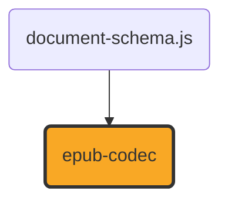

# epub-codec

[](https://github.com/ExaDev/documents.js/tree/main/packages/epub-codec) [](https://www.npmjs.com/package/epub-codec) [](https://www.npmjs.com/package/epub-codec) [](https://github.com/ExaDev/documents.js/actions)

> A hand-written, dependency-minimal EPUB 2/3 codec: reads flowable EPUB 2 and EPUB 3 packages into the shared [document-schema.js](../document-schema.js/README.md) content pivot, and writes deterministic, minimal EPUB 3. Built on [fast-xml-parser](https://github.com/NaturalIntelligence/fast-xml-parser), [fflate](https://github.com/101arrowz/fflate), and [Zod 4](https://zod.dev).

An EPUB decomposes into two things this family already does well: an OCF ZIP container with a manifest and a fixed first entry — structurally `odf.js`/`ooxml.js` territory — whose payload is flowable block content in well-formed XHTML — semantically `markdown-codec` territory, since EPUB 3.3 requires its content documents to be real XML, not tag-soup HTML. This package sits at exactly that intersection: its OCF/ZIP layer and XML parse/build wrapper mirror the conventions those siblings already established (hand-duplicated, not imported — see [Architecture](#architecture) for why), and its XHTML-to-`ContentDocument` mapping is the closest relative `markdown-codec`'s own AST-to-`ContentDocument` lowering has in this family.



`epub-codec` depends on nothing else in this family beyond `document-schema.js` — see [Dependency choices](#dependency-choices) for why it does _not_ depend on `archive-codec` or `byte-codec`, both real candidates the issue that created this package asked to be checked. Wiring this package into `documents.js`'s conversion engine, `document-cli`, `document-mcp`, or the web UI is explicitly out of scope here — see [ExaDev/documents.js#802](https://github.com/ExaDev/documents.js/issues/802), a separate, already-filed follow-up blocked on this package existing at all.

## Scope

**Flowable EPUB only.** Fixed-layout EPUB (FXL, `rendition:layout-pre-paginated`) is fixed-page geometry — closer to `pdf-codec`'s own private layout representation than to flowable content — and is not specially detected or rejected; an FXL package's XHTML still reads as ordinary flowable content, just without the positioning its `properties="rendition:layout-pre-paginated"` metadata was asking a reading system to honour.

**Read EPUB 2 and EPUB 3. Write EPUB 3 only.** `readEpub`/`readEpubContent` accept either; `writeEpub`/`writeEpubContent` always produce a minimal, spec-valid EPUB 3 package, matching how this family already treats legacy format quirks elsewhere (read, never re-emitted).

## Getting started

Requires Node.js `>=20` and pnpm `11.6.0` (pinned via `packageManager` in `package.json`).

```sh
pnpm install
```

Install as a dependency in another project:

```sh
pnpm add epub-codec
# or
npm install epub-codec
```

## Usage

Reading and writing EPUB bytes, at the tree level (the primary API — [document-schema.js](../document-schema.js/README.md)'s `DocumentTree`, matching `markdown-codec`'s identical dual-level convention):

```ts
import { readEpub, writeEpub } from "epub-codec";

const tree = readEpub(epubBytes); // -> DocumentTree, kind: 'wordprocessing'
// tree.children is one section group per spine itemref, in spine order -- headings, lists, and
// footnote/blockquote constructs already promoted into their own groups by document-schema.js's assembleTree.
const bytes = writeEpub(tree); // a fresh, minimal, spec-valid EPUB 3
```

The flat pair one level down (`ContentDocument`, the codec-exchange shape every reader/writer in this family actually reads and writes):

```ts
import { readEpubContent, writeEpubContent } from "epub-codec";

const { sections, metadata } = readEpubContent(epubBytes); // ContentDocument, kind: 'wordprocessing'
const bytes = writeEpubContent({ kind: "wordprocessing", metadata, sections });
```

Both accept an optional `sink` (`EpubDiagnosticSink`, called once per recoverable read issue or unrepresentable construct — see [Conventions](#conventions) for the three-tier policy this shares with `markdown-codec`/`pdf-codec`):

```ts
import { readEpubContent } from "epub-codec";

const document = readEpubContent(epubBytes, {
  sink: (diagnostic) => console.warn(diagnostic.code, diagnostic.message),
});
```

The same round trip as a schema-validated [`z.codec()`](https://zod.dev) pair, mirroring `markdown-codec`'s `markdownCodec`/`markdownContentCodec`:

```ts
import { z } from "zod";
import { epubCodec, epubContentCodec } from "epub-codec";

const tree = z.decode(epubCodec, epubBytes); // throws a ZodError if epubBytes has no zip header
const bytes2 = z.encode(epubCodec, tree);
```

This is the no-extra-options form only — `readEpub(Content)`/`writeEpub(Content)` remain the entry points for a diagnostic sink.

One spine itemref becomes one `ContentSection`, in spine order — **every** itemref, including one marked `linear="no"` (an EPUB 2 idiom for supplementary content, most often a footnote/endnote page): this package reads it as an ordinary section rather than silently skipping real content a reading system happens to route around. EPUB has no page concept of its own, so every section is given the same invented A4 + 1in default geometry (`ReadEpubOptions`/`WriteEpubOptions` carry no override for this, unlike `markdown-codec`'s `pageSize`/`margins` options — nothing in this package's own scope needs one yet).

## Architecture

Layered from the lossless OCF/XML primitives outward to the XHTML-to-`ContentDocument` mapping itself:

- **`src/zip.ts`** — the OCF ZIP container: fixed-mtime, ordered-entries `zipPackage`/`unzipPackage` over `fflate`, hand-duplicated from `ooxml.js`'s and `odf.js`'s own identical wrappers rather than depending on `archive-codec` — see [Dependency choices](#dependency-choices).
- **`src/xml/`** — the lossless XML layer every other module in this package builds on: `parse.ts`/`build.ts` wrap `fast-xml-parser` with the identical `preserveOrder` configuration `ooxml.js`'s and `odf.js`'s own XML modules use (order and mixed content survive; entity encoding stays raw until `entities.ts` decodes it in the one place text actually becomes content), `query.ts` the same handful of tree-walking helpers (`rootElement`, `findChildElement`, `childrenWithTag`, `elementsWithTag`, `attrValue`, plus `findElement` and `textContent`, needed here for footnote-target and nav-toc resolution respectively).
- **`src/ocf/`** — `container.ts` resolves the OPF rootfile from `META-INF/container.xml` (EPUB 3.3 §6.7.2); `write.ts` is its structural inverse.
- **`src/opf/`** — `parse.ts`/`write.ts` read and write the OPF package document (§5.4): Dublin Core metadata (`metadata.ts`), the manifest, and the spine.
- **`src/nav/`** — `nav3.ts`/`ncx.ts` reduce the EPUB 3 `<nav epub:type="toc">` document and the EPUB 2 NCX to a flat, fragment-stripped href sequence each; `reconcile.ts` compares that sequence against the spine's own reading order (the issue's own explicit "the spine wins" decision); `write.ts` builds a minimal EPUB 3 nav document, one entry per section, titled from each section's own first heading.
- **`src/xhtml/`** — the mapping this package exists for: `read.ts` (`readXhtmlBody`, one XHTML content document's `<body>` to `ContentBlock[]`), `write.ts` (`writeXhtmlBody`, its structural inverse, built on `document-schema.js`'s own `decomposeSection` rather than re-deriving heading/list/construct nesting by hand), `inline.ts` (run-level formatting and footnote reference extents), `footnote.ts` (EPUB 3 `epub:type="noteref"`/`"footnote"` and the EPUB 2 linked-anchor idiom, both mapped onto the identical `anchor` construct), `list-id.ts` (list marker type packed into the opaque `numId`, mirroring `markdown-codec`'s own mechanism for the identical schema gap), `context.ts`/`style-constants.ts` (shared read-side plumbing and round-trip-only styleId/font constants).
- **`src/image/dimensions.ts`** — PNG/JPEG format detection and pixel dimensions, hand-written rather than reused from `byte-codec` — see [Dependency choices](#dependency-choices).
- **`src/util/base64.ts`** — isomorphic base64 codec, a third hand-written copy of the identical helper `odf.js`'s and `pdf-codec`'s own `src/util/base64.ts` already carry.
- **`src/path.ts`** — package-relative path resolution (manifest hrefs against the OPF's own directory, `` against its own XHTML document's directory), honouring `../` segments.
- **`src/diagnostics.ts`** — the three-tier read/write failure policy; see [Conventions](#conventions).
- **`src/read.ts`/`src/write.ts`** — the public entry points, composing every layer above into `readEpub(Content)`/`writeEpub(Content)`.
- **`src/codec.ts`** — `epubCodec`/`epubContentCodec`, the `z.codec()` pair.

## Dependency choices

The issue that created this package ([ExaDev/documents.js#801](https://github.com/ExaDev/documents.js/issues/801)) named `archive-codec` and `byte-codec` as real candidates for this package's own OCF/ZIP and image-dimension layers, and asked for the choice to be investigated and justified rather than assumed either way. Both were investigated; both were declined, for reasons specific to what each actually offers today rather than as a blanket "hand-write everything" reflex:

- **Not `archive-codec` for the ZIP layer.** `archive-codec`'s own `zip/container.ts` is structurally identical to what this package needs (`zipPackage`/`unzipPackage`, ordered entries, a `stored` flag) — but it does not pin a fixed entry mtime, unlike `ooxml.js`'s and `odf.js`'s own `zip.ts`, both of which do exactly to keep output byte-deterministic across two builds of identical content. Nothing in this family writes through `archive-codec`'s own ZIP writer today, so the gap has never mattered before; it would matter here, since byte-deterministic output is this package's own explicit requirement. Every existing format codec in this family (`ooxml.js`, `odf.js`) already hand-duplicates this exact wrapper rather than sharing it — precisely to keep each codec's release cadence decoupled from a package it would otherwise need to bump in lockstep with, the same reasoning `odf.js`'s own README states for not depending on `ooxml.js` — so this package's own `src/zip.ts` is a third hand-written copy of the identical ~30-line wrapper, not a fourth pattern. `archive-codec` remains genuinely useful elsewhere in this family (ZIP-in-ZIP walking, CFB reading) — neither of which a flat OCF container needs, since a flowable EPUB has no nested-archive or compound-file embedding to recurse into.
- **Not `byte-codec` for image dimensions.** `byte-codec`'s `image/jpeg-info.ts` (header-only JPEG dimensions, no sample decoding) would have been a clean reuse for the JPEG half — but its PNG half (`image/png-decode.ts`) is a full pixel decode, normalising every PNG colour type to 8-bit gray/RGB planes for a PDF Image XObject's own needs. This package never needs a single decoded pixel: `ContentImageBlock` carries the image's own raw bytes as base64 and only needs its _dimensions_, so a full PNG decode would pay real CPU per manifest image to read four IHDR bytes, and risks rejecting a real PNG variant an IHDR-only read would tolerate. Depending on `byte-codec` for the JPEG half alone while hand-writing the PNG half would gain nothing over hand-writing both — JPEG marker scanning and PNG IHDR reading are each roughly the same amount of code — so `src/image/dimensions.ts` mirrors `markdown-codec`'s own identical `src/image/image.ts` instead: the one other codec in this family with the identical problem (dimensions from arbitrary image bytes, no format-native explicit sizing to read instead — every OOXML/ODF image anchor already carries its own explicit display size).

## Conventions

- **Hand-written, dependency-minimal**, matching every sibling codec's own stated bet: no `epubjs`/`epub-gen`/`epub2`/`node-epub`/general-purpose ZIP library dependency (`adm-zip`, `jszip`, `yazl`, `yauzl`), enforced by `eslint.config.ts`'s own `no-restricted-imports` patterns.
- **Worker-isomorphic**: runtime `src/` must not import `node:*`, a bare Node builtin, or use the `Buffer` global — enforced statically by the shared `no-restricted-imports`/`no-restricted-globals` guard and dynamically by `pnpm test:workers` (the whole read/write pipeline exercised inside a real Cloudflare Workers isolate via `@cloudflare/vitest-pool-workers`). `writeEpubContent`'s generated identifier uses `crypto.randomUUID()` (the Web Crypto API, globally available in Node 20+/Workers/browsers), never `node:crypto`.
- **A three-tier read/write failure policy**, matching `markdown-codec`'s/`pdf-codec`'s own: throw a typed `EpubParseError`/`EpubWriteError` subclass for input this package cannot meaningfully process at all (an invalid mimetype entry, a missing/unparsable `container.xml`/OPF, an empty spine, unbalanced construct markers, a non-`'wordprocessing'` document); report an `EpubDiagnostic` through the caller's own sink for a recoverable producer mistake or an individual construct this package's own mapping cannot represent, while the rest of the document still reads. `src/diagnostics-coverage.test.ts` asserts every `EpubDiagnosticCodes` entry is reachable from real input — a code that exists only in a comment is dead documentation, worse than none.
- **`z.codec()` for the round trip** (`epubCodec`, `epubContentCodec`), matching `markdown-codec`'s pair exactly: each wraps the independently-tested read/write pair at its own level with automatic two-way schema validation (no-options form only).
- **No type assertions anywhere.** Every loosely-typed value is narrowed through a type guard or Zod parse at the boundary.
- **Conventional commits**, enforced via commitlint + husky.

## Gotchas and quirks

Every construct this package's XHTML mapping cannot represent losslessly is a documented `EpubDiagnosticCodes` entry — see `src/diagnostics.ts` for the full table, and each module's own top-of-file comment for which side (read/write) it belongs to:

- **`epub/element-unmapped`** — `<sub>`/`<sup>` degrade to plain text: `document-schema.js`'s `ContentRun` carries no subscript/superscript field at all, a genuine family-wide schema gap (no sibling codec has ever needed one; `ooxml.js`'s own docx reader has no `w:vertAlign` handling either), not something specific to this package.
- **`epub/link-target-external-only`** — every href, external or same-/cross-document, rides `ContentRun.hyperlink` verbatim rather than building the full internal-target `link` construct bookkeeping `document-schema.js`'s own vocabulary supports (an internal link construct needs a resolved same-document `anchor` target this package does not build for ordinary hyperlinks, only for recognised footnote references — see below). A deliberate scope decision: every href still restores byte-for-byte either way, and the feature this degrades is real semantic internal-navigation fidelity, not content loss.
- **Footnotes are same-document only.** Both the EPUB 3 structured idiom (`epub:type="noteref"`/`"footnote"`) and the EPUB 2 linked-anchor idiom (a `class="footnote"`/`"noteref"` convention with no `epub:type` vocabulary at all, recognised by `src/xhtml/footnote.ts`) map onto the identical `anchor` construct — a run-level point extent at the reference site, a `constructStart`/blocks/`constructEnd` triple around the body. Recognition never crosses a spine itemref boundary: `document-schema.js`'s own construct-marker contract states a bracket pair can never straddle a block list boundary, and each `ContentSection` is its own block list, so a cross-document footnote (a separate "notes.xhtml", the more common real-world EPUB 2 shape) falls through to the ordinary internal-hyperlink handling above instead of being force-fit into a shape the schema cannot express.
- **`epub/style-residue`** — a document's own `<head>` style declarations (`<link rel="stylesheet">`, `<style>`) are quarantined verbatim as `SourceResidue` on the owning `ContentSection`, never interpreted: CSS is residue, not content. `writeEpubContent` re-emits it into the written `<head>` on a same-format write (this family's standard restorable-fidelity re-emission contract).
- **An empty or whitespace-only paragraph (`<p></p>`, `<p> </p>`, or bare whitespace text between two block-level siblings — the common case in any pretty-printed real EPUB) is dropped entirely on read**, matching the same "anonymous block box" rule a browser's own HTML block-formatting context already applies to inter-block whitespace, rather than becoming a bogus empty `ContentParagraph`.
- **List marker type (bullet vs. ordered, and an `<ol>`'s own non-default `start`) is packed into the opaque `numId`** (`epub{N}:{bullet|ordered}[@{start}]`, `src/xhtml/list-id.ts`), since `ContentListMembership` carries no field of its own for it — the identical mechanism `markdown-codec`'s own `src/shared/list-id.ts` uses for its GFM bullet/ordered distinction, hand-mirrored rather than shared. A numId outside this grammar (odf.js's bare `"list1"`, markdown-codec's own `"md1:bullet"`) is read back as an ordinary bullet list with no declared start.
- **A container's own direct-child ``** (some producers/editors wrap every floating image in a paragraph tag rather than a `<figure>`) is split at the image by `readContainerChildren`: the phrasing content before and after becomes its own paragraph (dropped entirely when empty), the image its own block, in source order. That split fires for every container this package reads transparently through `readContainerChildren` — `<body>` itself, `<p>`, `<li>`, `<blockquote>`, `<figure>`, `<div>`, `<section>`, `<article>`, `<aside>`, and `<nav>` — never only a named handful of them; an `` reached anywhere else — nested inside a `<span>`/`<a>` at any depth, or a _direct_ child of a heading, a `<figcaption>`, a `<dt>`/`<dd>`, or a table cell, none of which route through `readContainerChildren` at all — is instead reached by `src/xhtml/inline.ts`'s own run-building recursion, which by that point has committed to producing a flat run sequence with no block list left to insert a sibling image block into, and degrades to its alt text (or nothing, when it carries none) with an `epub/image-inline-unsupported` diagnostic rather than silently vanishing. [ExaDev/documents.js#994](https://github.com/ExaDev/documents.js/issues/994) closed the four remaining silent gaps this guarantee did not originally cover: a non-empty `<caption>`, a legal direct child of `<table>`, is now read as an ordinary paragraph immediately before the table (`epub/table-caption-unsupported`, since `ContentTable` has no field of its own for a caption's distinct tag; any `` the caption itself carries degrades to alt text exactly like a `<figcaption>`'s own, and any run-level construct the caption's own inline content carries — a footnote reference, most commonly — rides that paragraph's own `constructs` field exactly like any other paragraph's), while an empty or whitespace-only `<caption>` is dropped entirely instead, with no diagnostic, matching this package's own empty-paragraph-drop rule documented above; a `<dl>` wrapping one or more `dt`/`dd` pairs in a `<div>` (legal HTML5, used for a per-entry styling hook) is now recognised by recursing into the `<div>`, with no diagnostic at all, since the wrapper carries no properties of its own to lose (identical to every other `<div>` this package already reads transparently); and any content — a nested `<ul>`/`<ol>`, a bare ``, stray text — sitting directly inside a `<ul>`/`<ol>` rather than inside an `<li>` (not valid HTML5, but a shape real-world converters do emit) is now recovered via `epub/list-content-outside-item`, through the same `readContainerChildren` dispatch an `<li>`'s real children already use: content sitting between or after real `<li>` siblings attaches to the preceding item's own nesting — a stray list shares its numId and increments its level, exactly as if it had been nested correctly — while content sitting before the very first `<li>` has no preceding item to attach to and is instead recovered inheriting whatever list membership its own enclosing context already carries (none, unless the `<ul>`/`<ol>` it sits directly inside is itself nested inside another list's `<li>`), landing in the read result immediately before the list's own real items — matching a browser's rendering order for this shape, though not necessarily its nesting depth when the enclosing list is itself nested. One part of the original finding remains a genuine, permanent structural limit rather than a recovered gap: an `` inside a `<pre>`/`<code>` block still cannot become a real `ContentImageBlock` — a `<pre>` block's own content model is plain text, so there is no block list to insert one into, the same constraint `epub/image-inline-unsupported` already names elsewhere — but it no longer vanishes silently either; its alt text is spliced into the extracted text in its place, with a diagnostic (`epub/image-pre-unsupported`) naming the loss when it carries none.
- **A run-level construct extent (most commonly a footnote reference) carried by inline content built directly into a paragraph is preserved on that paragraph's own `constructs` field wherever such a paragraph is built** — a heading, a table caption, a table cell, a `<dt>`/`<dd>`, and a `<figcaption>` all share `constructsField`, the one helper `src/xhtml/read.ts` funnels every such paragraph through, so a fix applied to one of these shapes cannot silently miss the others. A stray element sitting where only a narrower set of tags is expected is likewise recovered rather than dropped, following the same `readContainerChildren`-plus-diagnostic pattern `epub/list-content-outside-item` already established: a `<dl>` (or one of its `<div>` wrappers) carrying anything other than `dt`/`dd`/`<div>` — a stray `<p>`, stray text, a stray ``, or a non-conformant wrapper like `<section>` used in `<div>`'s own place — is recovered via `epub/definition-list-content-outside-entry` (a non-conformant wrapper's own `dt`/`dd` children lose their distinct term/definition treatment once routed this way, degrading to plain concatenated text — a real fidelity cost, but a text-preserving one). The same treatment applies to a `<table>`: content sitting outside any row, caption, or `<colgroup>` — whether directly inside the `<table>` itself or inside one of its `<thead>`/`<tbody>`/`<tfoot>` row groups, which admit only `tr` and script-supporting children per the HTML Standard — is recovered immediately before the table via `epub/table-content-unrecognized`; a `<tr>` carrying content outside any `<td>`/`<th>` is recovered as its own cell in the row's own column sequence via `epub/table-row-content-outside-cell`; and a `<table>` carrying more than one `<caption>` (HTML5 permits at most one) has every caption beyond the first read as its own paragraph too, via `epub/table-duplicate-caption`, rather than `findChildElement`'s own first-match-only resolution silently discarding it as it previously did. `<style>` and `<noscript>` appearing anywhere in `<body>` content are now skipped by the identical guard that already protected against a `<script>`/`<template>` leaking its own raw content as document prose (`isInertElement`, `src/xhtml/context.ts`) — a `<style>` is CSS, and a `<noscript>`'s scripting-disabled fallback markup is deliberately treated the same conservative way, since this package cannot tell a genuine fallback from a "please enable JavaScript" placeholder from the markup alone.
- **A blockquote containing a heading cannot carry its `division` construct** — a marker extent may not open or close a heading scope, and the last heading inside an extent always leaves one standing (`document-schema.js`'s own constraint) — so it degrades to indent-only structure (still `indentLeftPt`/`styleId: "Quote"`) while the heading keeps its own heading fidelity.
- **Image dimensions are derived from pixel size via the CSS reference-pixel ratio (1px = 1/96in)**, not read from any ``/`` attribute or CSS: an EPUB's own XHTML/CSS carries no reliable point-based sizing of its own, so the image's natural pixel size is the one dimension every manifest image reliably has.
- **A GIF or SVG manifest image is not yet decoded** — `document-schema.js`'s `ContentImageBlockSchema` widened its `format` field to admit `"svg"`/`"gif"` alongside `"png"`/`"jpeg"` specifically for this package's own manifest image kinds, but this package's reader does not yet decode either one; it degrades to alt text with an `epub/image-format-unsupported` diagnostic until that decode work lands.
- **A table cell's own construct-boundary marker (if a foreign producer's `ContentDocument` carries one) has no XHTML representation on write** and is dropped with a diagnostic — `document-schema.js`'s own `decompose` never descends into a table cell, so a cell's blocks are never grouped the way a section's are, and this package's own reader never emits one there either.
- **`dc:publisher`/`dc:contributor`/`dc:rights` have no `LayoutMetadata` field to land in** and are reported as `epub/metadata-field-unmapped` rather than silently dropped.

## Fidelity

**Semantic fidelity** — headings, paragraphs, lists (nested, bullet/ordered), definition lists, tables, images, hyperlinks, text styling (bold/italic/underline/strike/monospace), blockquotes, pre/code blocks, horizontal rules, figure/figcaption, and footnotes (both EPUB 2 and EPUB 3 idioms) all survive as first-class `document-schema.js` nodes or constructs — see [ExaDev/documents.js#801](https://github.com/ExaDev/documents.js/issues/801) for the full acceptance list this package was built against, and `src/roundtrip.test.ts` for the real end-to-end proof (a hand-built `ContentDocument` covering nearly all of it, written to a genuine EPUB 3 zip and read back unchanged).

**Restorable fidelity** — a same-format (EPUB-to-EPUB) round trip re-emits quarantined CSS residue verbatim; every other documented gap above (sub/sup styling, internal-link semantics, cross-document footnotes) is a permanent, structural limit rather than a restorable one, since the source construct itself has nowhere in the schema to ride.

**Not byte fidelity.** This package has no lossless byte-level `Package` model the way `ooxml.js`/`odf.js` do — there is no `decodePackage`/`encodePackage` pair, and a read-then-write round trip never reproduces the original bytes (a fresh `dc:identifier` is minted on every write, per this package's own explicit write scope). What _is_ deterministic: two writes of the _same_ `ContentDocument` produce byte-identical zip _layout_ (mimetype-first, stored, ordered entries, fixed mtimes) even though the OPF entry's own compressed bytes differ (the fresh identifier). `src/roundtrip.test.ts` pins the layout invariant directly rather than claiming full byte determinism.

## Build, test, and lint

```sh
pnpm build         # turbo run _build -> tsdown (dist/: ESM + CJS + .d.ts, one file set per src module)
pnpm typecheck     # turbo run _typecheck _typecheck:attw -> tsc -p tsconfig.json && tsc -p tsconfig.node.json, plus attw --pack
pnpm lint          # turbo run _lint -> eslint . --fix --cache --max-warnings 0
pnpm test          # turbo run _test -> vitest run --project unit
pnpm test:watch    # vitest --project unit
pnpm test:workers  # turbo run _test:workers -> vitest run --config vitest.workers.config.ts, inside a real Cloudflare Workers (workerd) isolate
pnpm test:smoke    # turbo run _test:smoke -> rebuilds dist/, then verifies the built ESM/CJS output loads and exposes the public surface
```

To run a single test file: `pnpm vitest run src/path/to/file.test.ts`.

## Release and publishing

Release, CI, and commit-message conventions are all workspace-wide, not package-local — see the [monorepo root README](../../README.md#releases) for the mechanism (topological per-package `semantic-release` via `@exadev/semantic-release-workspace`, OIDC trusted npm publishing, automatic sibling dependency-range rewriting) and its [post-release republishing and attestation](../../README.md#releases) note on the restored GitHub Packages mirrors, npm aliases, and SBOM/provenance signing. Publishing this package for the first time needs the one-time npm trusted-publisher registration the root README's own Releases section describes — organization `ExaDev`, repository `documents.js`, workflow `ci.yml`.

## Contributing

Conventional Commits, enforced workspace-wide by commitlint through a root `commit-msg` hook. Work inside `packages/epub-codec/`; see [CONTRIBUTING.md](../../CONTRIBUTING.md) for the shared git hooks and history conventions.

## References

- [document-schema.js](../document-schema.js/README.md) — the canonical `ContentDocument`/`DocumentTree` schema and the `decompose`/`flattenTree`/`assembleTree` transform this package's writer is built on.
- [markdown-codec](../markdown-codec/README.md) — the closest architectural relative: hand-written, AST-to-`ContentDocument` lowering, the identical dual-level (`DocumentTree`/`ContentDocument`) API, the identical three-tier diagnostic policy, and the identical list-`numId`-packing mechanism for the identical schema gap.
- [ooxml.js](../ooxml.js/README.md) / [odf.js](../odf.js/README.md) — the OCF/ZIP and lossless-XML-layer conventions this package's own `src/zip.ts`/`src/xml/` mirror.
- [archive-codec](../archive-codec/README.md) — the ZIP-in-ZIP/CFB utility package this package deliberately does not depend on; see [Dependency choices](#dependency-choices).
- [byte-codec](../byte-codec/README.md) — the byte/image utility package this package deliberately does not depend on for image dimensions; see [Dependency choices](#dependency-choices).
- [EPUB 3.3](https://www.w3.org/TR/epub-33/) — the current W3C Recommendation this package's own EPUB 3 reading and writing targets.
- [OCF 1.0 / OPF 2.0.1 / OPS 2.0.1](https://idpf.org/epub/dir) — the legacy IDPF specifications this package's EPUB 2 reading targets (container.xml, the OPF package document, and the NCX navigation format are all unchanged in substance between the two generations).

## License

MIT
