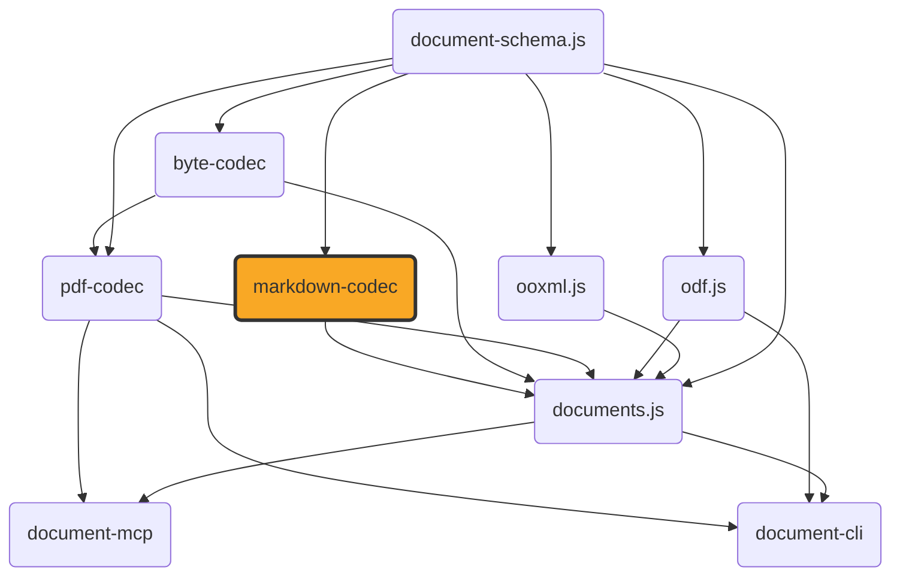

# markdown-codec

[](https://github.com/ExaDev/documents.js/tree/main/packages/markdown-codec) [](https://www.npmjs.com/package/markdown-codec) [](https://www.npmjs.com/package/markdown-codec) [](https://github.com/ExaDev/documents.js/actions)

> Hand-written CommonMark+GFM ⇄ `DocumentTree` codec, built on [document-schema.js](../document-schema.js/README.md).

The same "hand-write the format instead of wrapping a third-party library" bet as [`pdf-codec`](../pdf-codec/README.md), aimed at CommonMark and GFM. No `micromark`/`remark`/`marked`/`markdown-it`/`commonmark`/`mdast`/`unified`/`turndown`/`showdown` dependency (enforced by eslint `no-restricted-imports`). Runtime dependencies: `document-schema.js` (the shared pivot) and `zod`. `readMarkdown`/`writeMarkdown` read and write that pivot's tree-form `DocumentTree`; `readMarkdownContent`/`writeMarkdownContent` read and write the flat `ContentDocument` underneath it — the same model [`documents.js`](https://github.com/ExaDev/documents.js) builds docx/pptx/odt/odp conversions around. See [Two encodings](#two-encodings-documenttree-and-contentdocument).



## Status

The scanner, block parser, and inline parser are complete hand-written implementations of CommonMark 0.31.2's two-phase algorithm plus GFM's table/strikethrough/autolink/task-list-item extensions and GitHub's footnotes (see [Footnotes](#footnotes)). Both encodings' read/write pairs and both `z.codec()` pairs are wired and real. Conformance suites measure the full public surface (`readMarkdownContent` → `writeMarkdownContent` → reparse → render to HTML) against the vendored CommonMark/GFM corpora — see [Fidelity](#fidelity) for why the rate is below 100% (dominated by what `ContentDocument` can represent, not parsing gaps).

## Getting started

Requires Node.js `>=20` and pnpm `11.6.0` (pinned via `packageManager` in `package.json`).

```sh
pnpm install
```

Install as a dependency in another project:

```sh
pnpm add markdown-codec
# or
npm install markdown-codec
```

Published to [npmjs.org](https://www.npmjs.com/package/markdown-codec) via OIDC trusted publishing. `dist/` is gitignored like every other package's build output: the published tarball carries the release build, and a workspace consumer gets `dist/` from turbo's `^_build` ordering, never from the repository.

## Usage

Reading and writing markdown text:

```ts
import { readMarkdown, writeMarkdown } from "markdown-codec";

const { documentPackage, diagnostics } = readMarkdown(
  "# Title\n\nSome **bold** text with a [link](https://example.com).",
  {
    frontMatter: true, // parse a leading YAML front matter block into the package's metadata
    footnotes: true, // recognise [^label] markers and [^label]: definitions (default; see Footnotes)
    images: (destination) => undefined, // a synchronous MarkdownImageResolver port for non-data: URI images
  },
);

const markdown = writeMarkdown(documentPackage, {
  bulletListMarker: "-",
  emphasisMarker: "_",
  frontMatter: true, // emit the package's metadata back out as a leading front matter block
});
```

`documentPackage` is a `DocumentTree` — document-schema.js's tree form, with a minted styles table (see [Two encodings](#two-encodings-documenttree-and-contentdocument)). The field is named `documentPackage` rather than `package` because `package` is a reserved word in strict mode, so `const { package } = readMarkdown(src)` would not parse.

Both accept an optional `signal` (`AbortSignal`) and `sink` (`MarkdownDiagnosticSink`, called once per recoverable issue or construct-mapping gap — see [Gotchas](#gotchas-and-quirks)). `writeMarkdown` throws `MarkdownUnsupportedDocumentKindError` for a package whose `kind` is not `'wordprocessing'`, checked before flattening so every non-`'wordprocessing'` package reaches it the same way regardless of what else about that package would have failed document-schema.js's own `flattenTree`. A `'wordprocessing'` package can still fail to flatten — a group carrying a style reference the package's own `styles` table has no entry for — and that failure surfaces as `MarkdownPackageFlattenError`, not a bare `Error` from the dependency. A `DocumentTree`'s own `layers`/`attachments`/`destinations`/`pages` tables have no flat-`ContentDocument` home to land in; `writeMarkdown` reports one `PACKAGE_TABLE_DROPPED` diagnostic per non-empty table it finds rather than dropping them without a trace. The `definitions` table is the one exemption: this package's own link-tenant entries (what `readMarkdown` splices there from the source's reference definitions) render back out as `[label]: destination "title"` lines, so only a table holding foreign tenants reports.

The same round trip as a schema-validated [`z.codec()`](https://zod.dev) pair, mirroring `pdf-codec`'s `pdfCodec`:

```ts
import { z } from "zod";
import { markdownCodec, MarkdownBytesSchema } from "markdown-codec";

const documentPackage = z.decode(markdownCodec, bytes); // throws if bytes are not well-formed UTF-8
const bytes2 = z.encode(markdownCodec, documentPackage);
```

`MarkdownBytesSchema` checks for well-formed UTF-8. The no-options form only; `readMarkdown`/`writeMarkdown` remain the entry points for an `AbortSignal` or diagnostic sink. Every construct-mapping gap reports through the sink as a stable code (e.g. `md/nested-emphasis-flattened`) — see `MarkdownDiagnosticCodes` and [Gotchas](#gotchas-and-quirks).

## Two encodings: `DocumentTree` and `ContentDocument`

document-schema.js states one document in two shapes, and owns the transform between them: the flat `ContentDocument` every codec's lowering pipeline actually builds, and the tree-form `DocumentTree` a serialised artefact carries — sections, headings, lists, and construct boundaries as real nested groups, plus a styles table minted over repeated property tuples. `assembleTree` goes flat → tree (`decompose` then `factorStyles`), `flattenTree` goes tree → flat. Only one direction is a genuine round trip: `flattenTree(assembleTree(document))` reproduces `document` exactly, for any `ContentDocument` this package's own read side produces (checked against the full CommonMark and GFM conformance corpora, not just a hand-picked fixture — see `src/conformance.test.ts`/`src/gfm-conformance.test.ts`'s own "tree pair matches the flat pair" suite). `assembleTree(flattenTree(documentPackage))` does not, in general, reproduce `documentPackage` — a package carrying `definitions`/`layers`/`attachments`/`destinations`/`pages` loses all of them on the way through `flattenTree`, which carries forward only `metadata` and `symbolTable` (see [Gotchas](#gotchas-and-quirks)).

This package exposes a read/write pair and a codec at each level. The unsuffixed names are the tree-form ones and are what to reach for by default — a codec is a construction site, so the tree is what a caller gets unless they ask for otherwise. The `Content`-suffixed names are the flat pair one level down, mirroring the `readXlsx`/`readXlsxContent` naming already in [`ooxml.js`](../ooxml.js/README.md):

| Level          | Read                  | Write                  | Codec                  | Value type        |
| -------------- | --------------------- | ---------------------- | ---------------------- | ----------------- |
| Tree (default) | `readMarkdown`        | `writeMarkdown`        | `markdownCodec`        | `DocumentTree`    |
| Flat           | `readMarkdownContent` | `writeMarkdownContent` | `markdownContentCodec` | `ContentDocument` |

The tree pair is the flat pair with the transform composed on — `readMarkdown` is `assembleTree` over `readMarkdownContent`, `writeMarkdown` is `flattenTree` before `writeMarkdownContent` — plus the two tree-only carries the flat form has no root for: the source's reference definitions splice into `documentPackage.definitions` (link tenant, keyed by normalised label) and the verbatim front-matter block into `documentPackage.source.frontmatter`, both rendered back out by `writeMarkdown` (`[label]: dest "title"` lines after the body; the original front matter verbatim in place of the regenerated block). Sources carrying neither render identically to the flat pair, pinned in `src/package.test.ts`; a source carrying either renders its extra block, which is the point of reaching for the tree. Options, diagnostics, and error behaviour are identical at both levels.

Reach for the flat pair when composing a package boundary by hand (`decompose`/`flattenTree` directly, or `factorStyles` with your own minting policy), when feeding a `ContentDocument`-consuming builder such as `documents.js`'s conversion pipeline, or when a layout stage needs to stamp frames onto content before it is decomposed. Everything else wants the tree.

```ts
import { readMarkdownContent, writeMarkdownContent } from "markdown-codec";

const { document } = readMarkdownContent(source); // a ContentDocument: kind, metadata, sections
const markdown = writeMarkdownContent(document);
```

## Architecture

Modelled on `pdf-codec`'s own layering, aimed at CommonMark+GFM instead of PDF:

- **`src/diagnostics/`** — three-tier diagnostic policy (throw/recover/degrade); `MarkdownDiagnosticCodes` names every code.
- **`src/ast/`** — markdown AST node types (document/block/inline union), Zod-first.
- **`src/options/`** / **`src/defaults/`** — read/write options (GFM toggles, sink, `AbortSignal`, write-side style) and defaults.
- **`src/scan/`** — CommonMark line/character scanner, plus `entity-table.ts` (generated from `assets/html-entities/entities.json`).
- **`src/block/`** — CommonMark block-structure algorithm (open-block stack, continuation matching): paragraphs, headings, code blocks, block quotes, lists (incl. GFM task-list-item), thematic breaks, link references, footnote definitions, GFM tables.
- **`src/inline/`** — emphasis, code spans, links, autolinks, raw HTML, GFM strikethrough, footnote references, line breaks. `link.ts` and `footnote.ts` hold the label grammars the block phase shares.
- **`src/html/`** — raw HTML recognition (bounded rules, not a general parser) plus `render.ts` (conformance oracle; internal only).
- **`src/image/`** — PNG/JPEG dimension reader and base64 codec, shared by `src/lower/` and `src/emit/`.
- **`src/shared/`** — string-shape conventions `src/lower`/`src/emit` agree on (`style-constants.ts`, `list-id.ts`'s opaque `numId`). Re-exported so `documents.js`'s `MarkdownEditor` reuses the identical grammar.
- **`src/lower/`** — AST → `ContentDocument` lowering (thin adapter, not a second parser); top-of-file table maps each construct to its diagnostic gap.
- **`src/emit/`** — `ContentDocument` → markdown text emission, the structural inverse of `src/lower`.
- **`src/read.ts`** / **`src/write.ts`** / **`src/codec.ts`** — the public entry points at both levels: `readMarkdown`/`writeMarkdown`/`markdownCodec` over `DocumentTree`, and `readMarkdownContent`/`writeMarkdownContent`/`markdownContentCodec` over `ContentDocument`. The tree-form functions are thin compositions of `document-schema.js`'s `assembleTree`/`flattenTree` onto the flat ones; no conversion logic of their own lives here.

## Vendored assets

`assets/` holds real, unmodified conformance corpora (each with a `NOTICE.md` recording source, version, licence). None is read at runtime: `assets/html-entities/entities.json` is compiled into `src/scan/entity-table.ts`, and the spec corpora are test-only. So `package.json`'s `"files": ["dist"]` is correct.

- **`assets/commonmark/`** — CommonMark spec + corpus (652 examples), tag `0.31.2` (CC-BY-SA 4.0).
- **`assets/gfm/`** — GitHub Flavored Markdown Spec (CC-BY-SA 4.0).
- **`assets/html-entities/`** — WHATWG HTML5 named character reference table (BSD 3-Clause).

## Build, test, and lint

```sh
pnpm build         # turbo run _build (tsdown -> dist/, ESM + CJS + .d.ts)
pnpm typecheck     # turbo run _typecheck _typecheck:node (dual tsconfig)
pnpm lint          # turbo run _lint (eslint . --fix --cache --max-warnings 0)
pnpm test          # turbo run _test (vitest run --project unit, incl. CommonMark/GFM conformance)
pnpm test:workers  # turbo run _test:workers (unit suite under the real Cloudflare Workers/workerd runtime)
pnpm test:watch    # vitest --project unit
pnpm test:coverage # turbo run _test:coverage (vitest run --project unit --coverage)
pnpm test:smoke    # turbo run _test:smoke (rebuilds dist/, verifies ESM/CJS parity + a real round trip per bundle)
pnpm test:corpus   # turbo run _test:corpus (optional, gitignored real-world sanity check -- see Fidelity)
```

To run a single test file: `pnpm vitest run src/path/to/file.test.ts`.

## Conventions

- **Zod-first schema/type/guard**, matching `pdf-codec`/`documents.js`: every model type inferred from its Zod schema.
- **No type assertions.** Every loosely-typed value narrowed through a type guard or Zod parse at the boundary.
- **No markdown-parsing library dependency**, enforced by eslint `no-restricted-imports`.
- **`z.codec()` for the round trip** (`markdownCodec`, `markdownContentCodec`), matching `pdf-codec`'s `pdfCodec`: each wraps the independently-tested read/write pair at its own level with automatic two-way schema validation (no-options form only).
- **Shrink-only conformance exclusion list.** Every spec example the read → write → reparse → render pipeline does not reproduce byte for byte is named in `src/test-support/conformance-exclusions.ts`, with a test asserting it genuinely still fails — the list shrinks as gaps close, never quietly grows.
- **Conventional commits**, enforced via commitlint + husky.

## Gotchas and quirks

Every construct `src/lower`/`src/emit` cannot represent losslessly is a documented `MarkdownDiagnosticCodes` entry:

- **`md/invented-page-geometry`** — no page concept in markdown; one `ContentSection` with A4 + 1in defaults (overridable). Fires once.
- **`md/nested-emphasis-flattened`** — same-kind nested emphasis flattens to one run.
- **`md/link-title-dropped`** — the one titled shape still dropping: a nested image (inside a link or emphasis) or an unresolved image. Every other title rides a `link` construct's `title` field — a run-level extent for an inline or reference link, a block-scoped marker pair around a resolved image (which also restores the image's original destination on the way out).
- **`md/blockquote-container-skipped`** — a blockquote containing a heading anywhere in its subtree cannot carry its division construct (a marker extent may not open a heading scope), so that quote degrades to indent-only structure while the heading keeps its fidelity. Every other quote carries a `division` construct pair — exact container boundary and exact nesting depth, with the indent and `Quote` styleId kept as the materialised formatting.
- **`md/list-item-block-unlisted`** — a table, resolved image, or display-math block in a list item cannot carry `ContentListMembership` (paragraphs only).
- **`md/list-item-multi-block-flattened`** — a construct (most commonly a blockquote) sitting directly inside a list item interrupts that item's own contiguous block run on write. `ContentListMembership.itemId` does let the writer re-attach a multi-block item's later plain blocks to its own marker line — a paragraph followed by a fenced code block, or by a nested sub-list and then more of the item's own text, all render as one item — but a construct's own extent is resolved independently of that grouping, so the construct and anything of the same item after it render as separate top-level content instead.
- **`md/list-marker-type-conflict`** — a nested list whose marker type disagrees with its enclosing list's minted numId keeps the enclosing type (first-wins).
- **`md/math-inline-preserved-as-text`** — inline `\( \)` math stays a Cambria-Math-marked raw-LaTeX run; display `$$` math is a real embedded formula carrying the presentation layer.
- **`md/image-unresolved`** — no resolver, `undefined` return, or non-PNG/JPEG bytes degrades to alt-text run.
- **`md/raw-html-preserved-as-text` / `md/raw-html-dropped`** — raw HTML kept as literal text (default) or dropped; never interpreted. The preserved text's verbatim original quarantines as markdown residue on its node, and this package's own writer re-emits that residue as-is.
- **`md/front-matter-key-unmapped`** — no YAML/TOML engine; only five known `LayoutMetadata` keys recognised. The verbatim original block rides the package-level residue table (`readMarkdown`'s `documentPackage.source.frontmatter`), which `writeMarkdown` re-emits as-is.
- **`md/heading-level-clamped`** — styleId beyond `Heading6` (from another format) clamps to level 6 via document-schema.js's shared `clampHeadingLevel()`.
- **`md/adjacent-links-merged`** / **`md/code-span-as-monospace-run`** — same-destination adjacent links merge; monospace runs emit as code spans.
- **`md/paragraph-indent-dropped`** — `indentLeftPt` without a recognised styleId; indent dropped, paragraph renders.
- **`md/list-numid-fallback`** — a foreign or absent `numId` (depth-only `ContentListMembership`) falls back to a plain bullet list.
- **`md/raw-html-preserved-as-text`** — see the raw-HTML entry above.
- **`md/table-cell-formatting-dropped`** / **`md/table-cell-multi-paragraph-joined`** — GFM cells have no rich-formatting or multi-paragraph representation.
- **`md/duplicate-footnote-definition`** — two definitions share a label; every reference resolves to the first, both are kept as written.
- **`md/footnote-body-heading-flattened`** — a heading inside a definition body is carried as literal ATX text, since a construct extent may not open or close a heading scope.
- **`md/construct-unrepresented`** — a construct kind markdown has no syntax for renders transparently: its extent still appears, the construct itself does not.
- **`md/package-table-dropped`** — `writeMarkdown` only, ahead of flattening: a `DocumentTree`'s own `definitions`/`layers`/`attachments`/`destinations`/`pages` table has no flat-`ContentDocument` home (`flattenTree`'s own envelope carries forward only `metadata` and `symbolTable`); fires once per non-empty table present.

## Footnotes

GitHub's footnote extension (`[^label]` markers, `[^label]: body` definitions) is on by default, alongside the four GFM toggles — switch it off with `footnotes: false`. Neither CommonMark nor the GFM spec document defines footnotes, so both spellings are ordinary text with it off.

The two halves of a footnote map onto the **same `anchor` construct at two different scopes**, and that split is structural rather than a choice:

- **A definition becomes an `anchor` construct.** Lowering emits document-schema.js's construct boundary markers — a `constructStart` carrying `{ kind: 'anchor', anchorType: 'footnote', name }`, the definition's own lowered body blocks, and a `constructEnd` — which is what `readMarkdownContent` returns in its block flow, and what `decompose` promotes to a construct group of its own in the `DocumentTree` `readMarkdown` returns (the descriptor rides the group's `node`, the body blocks its `children`). The body rides the construct's extent rather than `AnchorDescriptor.definition`, which names a key in a package-level definitions table: `DocumentTree` does carry that table as a root (unlike the flat `ContentDocument`), but a table entry there is a flat descriptor record, not a container for block content, so a body that is genuinely several paragraphs, a code block, or a list still has nowhere to live as a table value either way — the construct's own bracketed extent is the one shape in this schema built to hold real block content. A bodyless `[^1]:` lowers to the point anchor the same descriptor describes: a pair with nothing between it.
- **A reference site becomes a point run-level `anchor` extent.** A reference sits between two runs inside a paragraph, so no block-level boundary marker can bracket it without splitting the paragraph in two — but a run-level construct extent (`RunConstructExtent` on `ContentParagraph.constructs`, document-schema.js 4.5.0) names exactly that shape. Lowering emits an ordinary text run keeping the reference's own `[^label]` spelling (the materialised rendering, so a consumer that ignores constructs still shows `[^1]`) plus a point extent — `{ kind: 'anchor', anchorType: 'footnote', name }` at `startRun === endRun` naming that run, the same wiring ooxml.js's docx reader mints for a `w:footnoteReference` — carried through `decompose`/`flattenTree` verbatim, exactly the way a table cell's own markers are. The writer spells `[^label]` back out from the covering extent rather than from anything about the run's text (which is what still distinguishes a genuine reference from a deliberately-escaped literal `\[^1\]`), gated by the same label grammar as the definition marker: a foreign name that grammar cannot spell degrades to the run's own escaped text plus `md/construct-unrepresented`.

Definitions are recognised only at the document's own top level. Inside a block quote or a list item, the pair's extent would sit inside a scope the enclosing container had already opened, which the marker contract forbids a producer from emitting — so the text stays an ordinary paragraph there. A heading inside a definition body is flattened to literal ATX text for the same reason.

Emission is the inverse and validates first: a section's markers must pair as balanced brackets (checked through document-schema.js's own `findConstructMarkerImbalance`, the shared definition every codec and `decompose` agree on) or `writeMarkdownContent` throws `MarkdownUnbalancedConstructMarkersError`. A tree already satisfies that balance by construction — `decompose` refuses to build one from an unbalanced stream — so `writeMarkdown` reaches this check only on a hand-built package flattened back to an unbalanced flow. A construct kind with no markdown syntax — a bookmark, a division, a tracked change — renders transparently: its extent still appears in place, only the construct's own identity is lost.

## Fidelity

**Markdown → `ContentDocument` is dominated by target-schema limits, not parsing gaps.** The parser recognises every construct CommonMark and GFM define; the limiting factor is what `ContentDocument` can hold — a cross-format pivot shaped around docx/pptx/odt/odp/ods/odg, not markdown's richer model. Each gap is a permanent structural mismatch.

**Round-trip conformance rate** (read → write → reparse → render to HTML, compared byte for byte against expected HTML):

| Corpus                                                                                | Examples | Passing round trip | Rate  |
| ------------------------------------------------------------------------------------- | -------- | ------------------ | ----- |
| CommonMark 0.31.2 (`assets/commonmark/spec.json`)                                     | 652      | 513                | 78.7% |
| GFM tagged extensions (table/strikethrough/autolink/task-list, `assets/gfm/spec.txt`) | 23       | 22                 | 95.7% |
| Combined                                                                              | 675      | 535                | 79.3% |

Every non-passing example is named individually in `src/test-support/conformance-exclusions.ts`, attributed to a closed set of causes (shrink-only — see [Conventions](#conventions)): most commonly a soft line break collapsing to a space, a nested/unresolved image title, an emphasis-span collision, or a blockquote whose heading content skips its container pair.

**Optional real-world corpus.** `test/corpus/` (gitignored) holds a `pnpm test:corpus` project for a manual sanity check against sibling READMEs on disk — asserts no throw and real content on reparse, not byte fidelity. Not part of `pnpm test`; run locally before significant parser/lower/emit changes.

## Release and publishing

Release, CI, and commit-message conventions are all workspace-wide, not package-local — see the [monorepo root README](../../README.md#releases) for the mechanism (topological per-package `semantic-release` via `@exadev/semantic-release-workspace`, OIDC trusted npm publishing, automatic sibling dependency-range rewriting) and its [post-release republishing and attestation](../../README.md#releases) note on the restored GitHub Packages mirrors, npm aliases, and SBOM/provenance signing.

## Contributing

Conventional Commits, enforced workspace-wide by commitlint through a root `commit-msg` hook. Work inside `packages/markdown-codec/`; see [CONTRIBUTING.md](../../CONTRIBUTING.md) for the shared git hooks and history conventions.

## References

- [document-schema.js](../document-schema.js/README.md) — owns both shared encodings (`ContentDocument`, `DocumentTree`) and the `assembleTree`/`flattenTree` transform between them.
- [pdf-codec](../pdf-codec/README.md) — the sibling whose scaffold, tooling, and "hand-write the format" philosophy this project mirrors.
- [documents.js](https://github.com/ExaDev/documents.js) — bridges markdown to docx/odt/PDF via this package's `ContentDocument` (the flat pair; its own conversion pipeline assembles the package itself). Markdown has no presentation/spreadsheet/drawing variant, so pptx/odp/ods/odg are structurally out of reach.
- [CommonMark Spec](https://spec.commonmark.org/) — the base specification targeted.
- [GitHub Flavored Markdown Spec](https://github.github.com/gfm/) — GFM extensions layered on top.
- [WHATWG HTML § named character references](https://html.spec.whatwg.org/multipage/named-characters.html) — the entity table `assets/html-entities/` vendors.

## npm aliases

This package also published under an alternate name from the pre-monorepo pipeline:

- [mrkdwn.js](https://www.npmjs.com/package/mrkdwn.js)

**Frozen since the monorepo migration** — see the [root README's release note](../../README.md#releases): the alias republish step was dropped along with GitHub Packages mirroring and SBOM/provenance signing, and nothing today keeps this name in sync with `markdown-codec`'s own releases. Tracked in [ExaDev/documents.js#728](https://github.com/ExaDev/documents.js/issues/728).

## License

MIT
