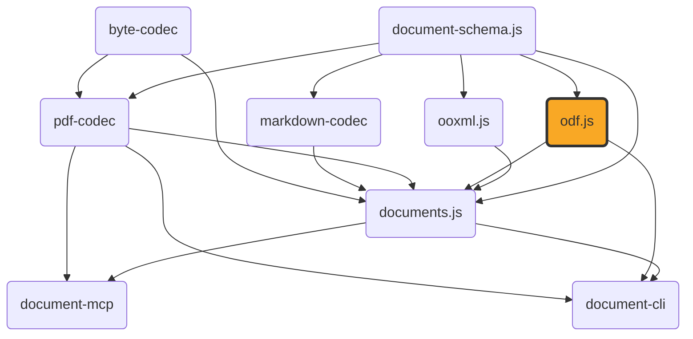

# odf.js

[](https://github.com/ExaDev/documents.js/tree/main/packages/odf.js) [](https://www.npmjs.com/package/odf.js) [](https://www.npmjs.com/package/odf.js) [](https://github.com/ExaDev/documents.js/actions)

> A hand-written, dependency-minimal codec for the OpenDocument Format (ODF — OASIS/ISO 26300): `.odt`/`.ods`/`.odp`/`.odg`/`.odf`/`.odb`/`.odm` and their template variants, built on [Zod 4](https://zod.dev) codecs.

`odf.js` is the ODF sibling of [`ooxml.js`](../ooxml.js/README.md), mirroring its architecture: a lossless ZIP-of-XML core that round-trips any package byte-for-content-faithful, with typed readers layered on top. Two ODF-specific differences shape the design: ODF has no relationship mechanism (inter-part references are direct paths, with an exhaustive `META-INF/manifest.xml`), and ODF has no inline/direct formatting — every formatting difference must be a named "automatic style," so `odf.js` owns a style-interning subsystem (`src/styles/`) with no OOXML equivalent.

**This package does not depend on `ooxml.js`.** `ooxml.js`'s branding and SBOM are scoped to ECMA-376/OOXML; depending on it would be the wrong signal for an OASIS-standard codec and would force a breaking `ooxml.js` release for every ODF-only fix. The small generic ZIP/XML/`Package` layer is duplicated, kept structurally identical so TypeScript's structural typing makes both packages' values interchangeable for a shared consumer like `documents.js`. Both depend on [`document-schema.js`](../document-schema.js/README.md) for the genuinely identical `ContentDocument`/`DocumentTree` content model.



## Status

Under active development. Built and shipped:

- **Lossless core** — ZIP-of-XML primitives (`Package`/`XmlNode`/`XmlElement`, XML parse/build, zip/unzip, base64, the `packageCodec`/`xmlCodec` `z.codec()` pairs).
- **Namespaces, media types, mimetype, manifest** (`src/ns.ts`, `src/media-type.ts`, `src/mimetype.ts`, `src/manifest.ts`) — full read and write, including `META-INF/manifest.xml` and the mimetype part's mandatory first-entry/stored/uncompressed layout.
- **Style interning** (`src/styles/`) — `StyleRegistry` adopts existing automatic styles, finds-or-mints on `intern()`, fingerprints on canonical serialized properties (never `JSON.stringify`), collision-checked across all four style containers.
- **Shared typed primitives** (`src/typed/shared/`) — unit parsing, A1 cell-reference computation with repeat-count cursor advancement, colour/geometry/master-page parsing into `document-schema.js` types, whitespace-run decoding, the read-side style cascade, shared `readOdfParagraph`/`readOdfTable`, the `draw:transform`/`draw:g` group-flattening geometry resolver, an `svg:d`/`draw:points` path parser, and `meta.xml` reading.
- **Typed readers, at two levels** — `readOdt`/`readOdp`/`readOdg`/`readOds`/`readOdfFormula` resolve a `Package` into a `document-schema.js` **`DocumentTree`**: the single hierarchical artefact, with a minted styles table. Beneath each sits its `*Content` sibling (`readOdtContent`, `readOdpContent`, `readOdgContent`, `readOdsContent`, `readOdfFormulaContent`) producing the flat `ContentDocument`-level shape instead. See [Reading a document](#reading-a-document).
- **What each reader actually covers** — wordprocessing (`readOdt`), presentation (`readOdp`), drawing (`readOdg`: vector primitives in `draw:z-index`-aware paint order), spreadsheet (`readOds`: every `office:value-type`, cell/page-anchored images, and embedded sub-documents including charts), each expressed in `document-schema.js`'s own `ContentSection`/`ContentSlide`/`ContentDrawPage`/`ContentSheet` vocabulary — plus the fidelity construct vocabulary in `readOdt` (fields including the cross-reference displays, bookmarks and reference-marks, tracked changes, notes, annotations, divisions, index wrappers, forms, and anchored frames; see [Fidelity constructs](#fidelity-constructs)).
- **`readOdfFormulaMathMl`** — resolves a standalone/embedded `.odf` formula's bare-MathML `content.xml` into raw MathML nodes plus a StarMath annotation, with no pivot shaping at all. **`readOdfFormulaContent`** wraps that into a real `'formula'`-kind `ContentDocument`, and **`readOdfFormula`** into a `DocumentTree`.
- **`readOdm`** — resolves a `.odm` master document into an ordered list of chapter references (`{ name, href, filterName? }`); chapters are genuinely external `.odt` files by ODF design, never cached.
- **`readOdbInventory`** — resolves a `.odb` into connection info, table names, query definitions (`{ name, command, escapeProcessing? }` with real SQL text), and form/report `{ name, href }` pairs. A sub-document directory is named after an opaque *persistent* name (`forms/Obj11`), not the user-visible name.
- **`readOdbForm`/`readOdbReport`** — extract one sub-document's *static structure*, executing nothing: a form's control tree and data bindings, or a report's band stack, recursive group tree, bound fields, and computed expressions.

Not yet built: live-view editors and the `.odb` database-table-export subsystem. A general-purpose SQL query engine for rendering a Report against its data is **deliberately not attempted** — building even a bounded SQL engine means reimplementing HSQLDB's/Firebird's query semantics, a materially different undertaking from decoding their file formats, with unreviewed licensing questions. Gated on the requesting engineer's explicit sign-off.

## Getting started

Requires Node.js `>=20` and pnpm `11.6.0` (pinned via `packageManager` in `package.json`).

```sh
pnpm install
```

Install as a dependency in another project:

```sh
pnpm add odf.js
# or
npm install odf.js
```

## Build, test, and lint

```sh
pnpm build         # turbo run _build -> tsdown (dist/: ESM + CJS + .d.ts)
pnpm typecheck     # turbo run _typecheck -> tsc -p tsconfig.json && tsc -p tsconfig.node.json
pnpm lint          # turbo run _lint -> eslint . --fix --cache --max-warnings 0
pnpm test          # turbo run _test -> vitest run --project unit
pnpm test:workers  # turbo run _test:workers -> vitest run --config vitest.workers.config.ts (the package parsing and ODF content readers run inside a real Cloudflare Workers isolate, proving they carry zero Node-only API usage)
```

To run a single test file: `pnpm vitest run src/path/to/file.test.ts`.

## Usage

### Reading a document

A typed reader takes a `Package` (bytes go through `decodePackage`/`parsePackage` first) and returns a [`DocumentTree`](../document-schema.js/README.md#the-package-tree) — `document-schema.js`'s single hierarchical artefact, where structure, layout, and content are fused in one tree and a `styles` table has already been minted over it:

```ts
import { decodePackage, readOdt } from 'odf.js';

const pkg = decodePackage(new Uint8Array(await file.arrayBuffer()));
const document = readOdt(pkg);

document.kind;      // 'wordprocessing'
document.metadata;  // title, author, keywords, ... from meta.xml
document.children;  // one section group per ContentSection, headings and lists grouped inside it
document.styles;    // the minted styles table the tree's `style` refs name
```

One reader per format, each returning the `DocumentTree` arm its format produces:

| Format | Reader | Package kind |
| --- | --- | --- |
| `.odt` | `readOdt` | `wordprocessing` |
| `.odp` | `readOdp` | `presentation` |
| `.ods` | `readOds` | `spreadsheet` |
| `.odg` | `readOdg` | `drawing` |
| `.odf` | `readOdfFormula` | `formula` |

Each is assembled through `document-schema.js`'s own `assembleTree`, so odf.js's packages are built exactly the way every other package construction site in this family builds one. No `pages` array is populated and no node carries `frames`: a reader runs before any layout pass, and rendered page geometry is a layout engine's to report, never a reader's to invent.

### The flat `ContentDocument` level

Beneath each package-native reader sits the flat reader it is built on, unchanged in behaviour and exported under a `*Content` name. Reach for these when you work in `document-schema.js`'s flat codec-exchange form — as `documents.js`'s own conversion pipeline does — rather than in the tree:

```ts
import { readOdsContent, readOdfFormulaMathMl } from 'odf.js';

const { metadata, sheets } = readOdsContent(pkg);   // the flat ContentSheet[] shape, no tree, no styles table
const { mathml, starMath } = readOdfFormulaMathMl(formulaPkg); // rawest of all: MathML nodes and the StarMath annotation
```

`readOdtContent`/`readOdpContent`/`readOdgContent`/`readOdsContent` return `{ metadata, sections | slides | pages | sheets }`; `readOdfFormulaContent` returns a whole `'formula'`-kind `ContentDocument`; `readOdfFormulaMathMl` returns the raw MathML with no pivot shaping at all. A package-native reader calls its own `*Content` sibling and reshapes that result, so the two levels are one read and can never disagree about what the file says.

Crossing between the levels is `document-schema.js`'s job, not this package's: `flattenTree(readOdt(pkg))` reproduces exactly what `readOdtContent(pkg)` returns, wrapped in its `ContentDocument` envelope. That equality is pinned per format against real fixture bytes in this package's own test suites.

### The primary names moved — migrating from 4.x

Every bare `readOdX` name now belongs to the package-native reader. Callers of the old flat functions rename; nothing about those functions' behaviour changed:

| 4.x | 5.0 | Returns |
| --- | --- | --- |
| `readOdt` | `readOdtContent` | `OdtDocument` |
| `readOdp` | `readOdpContent` | `OdpDocument` |
| `readOdg` | `readOdgContent` | `OdgDocument` |
| `readOds` | `readOdsContent` | `OdsDocument` |
| `readOdfFormulaDocument` | `readOdfFormulaContent` | `ContentDocument` |
| `readOdfFormula` | `readOdfFormulaMathMl` | `OdfFormulaDocument` |

The rename is a compile error at every call site, never a silent behaviour change: each new bare name returns a `DocumentTree`, which is assignable to none of the old return types.

`readOdm`, `readOdbInventory`, `readOdbForm`, and `readOdbReport` are untouched, and none gains a package-native form. `readOdm`'s chapters are external file references and `readOdbInventory`/`readOdbReport` describe structure rather than content, so none of those three has a `ContentDocument` to decompose. `readOdbForm` is the exception that proves the rule rather than a fourth case of it: a form's sub-document is a complete, ordinary ODF text document, so `readOdbForm` does call `readOdtContent` on it and does return an `OdtDocument` — but that document is one component nested inside the form's own control-tree result, not the function's own top-level return value, so there is no `DocumentTree`-native `readOdbForm` to add without changing what the function returns altogether.

### The lossless core

The ZIP-of-XML layer every reader above is built on:

```ts
import { decodePackage, encodePackage } from 'odf.js';

// .odt / .ods / .odp bytes -> faithful JSON Package
const pkg = decodePackage(new Uint8Array(await file.arrayBuffer()));

// ...inspect pkg.parts...

// Package -> bytes (content-identical, mimetype-first/stored, manifest untouched)
const bytes = encodePackage(pkg);
```

Manifest and mimetype, ODF's own package-identity mechanism (no relationships, unlike OOXML):

```ts
import { readManifest, syncManifest, setDocumentMediaType, readMimetype } from 'odf.js';

const manifest = readManifest(pkg); // { entries: [{ fullPath, mediaType }, ...] }
setDocumentMediaType(pkg, 'application/vnd.oasis.opendocument.text'); // updates mimetype + manifest root entry atomically
syncManifest(pkg); // rebuilds manifest.xml to exactly match pkg's current parts
readMimetype(pkg); // 'application/vnd.oasis.opendocument.text'
```

### Direct module imports

Every module is also importable directly by its own subpath, without going through the barrel:

```ts
import { parseOdfLength } from 'odf.js/typed/shared/units';

parseOdfLength('2.5cm'); // 70.86614173228347
```

Any `src/**/*.ts` module (excluding tests and `test-support/` fixtures) resolves at its path relative to `src/` — `src/manifest.ts` as `odf.js/manifest`, `src/typed/odt/read.ts` as `odf.js/typed/odt/read`, and so on.

## Architecture

Layered from a lossless core outward, mirroring `ooxml.js`:

- **`src/model/`** — `Package`/`XmlNode`/`XmlElement`: a duplicate-by-design copy of `ooxml.js`'s equivalent.
- **`src/xml/`** — XML parse/build (`fast-xml-parser`), production element/text-node construction, entity encoding, and tree-query helpers.
- **`src/image/`** — `sniffImageFormat`: a PNG/JPEG magic-byte sniffer consumed by `src/manifest.ts` and `src/typed/draw/shapes.ts`.
- **`src/zip.ts`** — takes *ordered* `[path, entry]` tuples, not a `Record`, so the mimetype-first/stored/uncompressed requirement doesn't depend on insertion order surviving a Zod round trip.
- **`src/package-io/`** — `write.ts` hoists `mimetype` first (stored) and `META-INF/manifest.xml` second if present; never fabricates either as a side effect.
- **`src/manifest.ts`** — full manifest read/write; the manifest is ODF's one mandatory part, unlike `ooxml.js`'s read-only OPC-relationship stance.
- **`src/styles/`** — `properties.ts`/`serialize.ts` (canonical property-bag ↔ XML attributes), `registry.ts` (`StyleRegistry`, the mandatory style-interning layer), `span.ts` (character-range `text:span` wrapping).
- **`src/typed/shared/`** — ODF-specific typed primitives every reader builds on (units, A1 cursors, colour/geometry, whitespace runs, style cascade, shared paragraph/table readers, transform/path parsing, metadata).
- **`src/typed/odt/`, `odp/`, `odg/`, `ods/`** — one module per format, each carrying both levels of its reader: the package-native `readOdt`/`readOdp`/`readOdg`/`readOds` and the flat `readOdtContent`/`readOdpContent`/`readOdgContent`/`readOdsContent` it is built on.
- **`src/typed/draw/`** — the shared `draw:frame`/`draw:g`/vector shape vocabulary and `readDrawImageBlock` (`shapes.ts`), plus `embedded.ts` (`readDrawObjectReference`, `readEmbeddedObjectDocument`, `readOdfChartContent` — the shared embedded-object reference resolver and the central kind→reader dispatch table).
- **`src/typed/formula/`, `odm/`** — `readOdfFormula`/`readOdfFormulaContent`/`readOdfFormulaMathMl` and `readOdm`.
- **`src/typed/odb/`** — `readOdbInventory`, `readOdbForm`/`readOdbReport`, `resolveOdbComponent`, `subDocumentPackage`.

## Conventions

- **Zod-first schema/type/guard**, matching `ooxml.js`/`document-schema.js`: every model type is inferred from its Zod schema, never hand-written.
- **Recursive types use a hand-written structural guard, not `z.lazy`** (collapses to `unknown` in the pinned Zod version).
- **No type assertions anywhere** — `assertionStyle: 'never'`, `noInlineConfig: true`.
- **Ground truth over memory for every ODF spec fact** — namespace URIs, media types, and attribute names are verified against the OASIS spec or real LibreOffice output, never assumed from an OOXML analogue (see [Gotchas](#gotchas-and-quirks)).

## Gotchas and quirks

- **Several ODF namespace URIs are not what you'd guess from the prefix.** `draw:` is `...drawing:1.0`, `number:` is `...datastyle:1.0`, `fo:`/`svg:`/`smil:` are `*-compatible:1.0`. See `src/ns.ts`.
- **`.odb`'s media type is `application/vnd.oasis.opendocument.base`**, not `...database`.
- **`dc:creator` records whoever most recently *saved* the document, not the author** — the original author is `meta:initial-creator`.
- **`meta:keyword` appears once per keyword**, unlike OOXML's single comma-separated `cp:keywords`.
- **`table:number-columns-repeated`/`-rows-repeated` must be cursor-advanced, never materialized** — real sheets have trailing repeat counts over a million.
- **ODF cells carry no explicit cell-reference attribute** (unlike xlsx's `r="B7"`) — `typed/shared/a1.ts` computes references from a running cursor.
- **A rotated `draw:rect`/`ellipse`/`path`/`custom-shape` reads its own `rotationDeg`** via the same `resolveOdfShapeGeometry` machinery `draw:frame` uses, composing any enclosing `draw:g` rotation.
- **Every `ContentShape`/`ContentVector` carries a resolved `paintOrder`** so true relative paint order survives across the independently-ordered `shapes`/`vectors` arrays.
- **`svg:fill-rule` and `draw:stroke` map onto `ContentVector.fillRule`/`ContentStroke.style`.** A dotted pattern and `"double"` stroke have no ODF vector-stroke counterpart and remain unread.
- **`readOdsContent`/`readTableCell` resolve cell `background`/`borders`/`alignment`/`verticalAlignment` from the real style cascade.** An explicit `fo:border-*` of `"none"`/`"hidden"` clears an inherited edge.
- **`readOdsContent` reads sheet-anchored drawings** — cell-anchored `draw:frame`s (coordinates relative to the cell) and page-anchored ones (in `table:shapes`). An embedded chart resolves as a `chart`-kind object whose document is a frame-sized drawing page carrying the chart's own cached data table, with the `chart:chart` element quarantined in residue. A sheet cannot carry a floating text box or bare vector; each is skipped.
- **`readDrawObjectReference` resolves a frame's embedded sub-document kind from its own `content.xml`, not the manifest.** A `draw:object` must be checked *before* the frame's preview image, since an embedded-object frame also carries a preview `draw:image`.

## Fidelity constructs

`readOdt` reads ODF's fidelity constructs into `document-schema.js`'s harmonised construct vocabulary — the semantic channel of the family's two-channel fidelity model (the quarantined residue channel is the other half). Two residue rows carry genuine producer fixtures (`conditional-format.ods`, `transitions.odp` — real LibreOffice output, generated through the same UNO calls the Calc/Impress UIs use); every other fixture below the unit suites is programmatic, built to the OASIS element grammar, with real-producer verification outstanding.

- **Fields** — every inline field element (the simple set, the variable/user-field/sequence instance families, the database displays, and the `*-ref` cross-reference displays — `text:bookmark-ref`, `text:reference-ref`, `text:note-ref`, `text:sequence-ref`) reads as ordinary runs carrying its cached text plus a run-level field extent on the paragraph, instruction being the serialised element and `cachedResult` its own text content. Field master declarations (`text:*-decls`) read into the package-root definitions table, keyed per family.
- **Bookmarks, reference-marks, and tracked changes** — paired marker halves at run scope pair inside one paragraph; halves at paragraph edges pair across blocks into `constructStart`/`constructEnd` markers. A `text:reference-mark` is a point bookmark anchor; a `text:reference-mark-start`/`-end` pair is a range anchor in its own pairing family (ODF keeps reference-mark names and bookmark names in separate namespaces, so a same-named bookmark and reference-mark pair independently). Change markers resolve their `text:change-id` against the `text:changed-region` definitions (either id spelling, `xml:id` today and ODF 1.0's `text:id`), carrying author and date as provenance.
- **Notes and annotations** — a `text:note`'s citation becomes a run, its body a definitions entry, an anchor extent naming both; an `office:annotation` does the same and pairs with `office:annotation-end` by `office:name` over a range, falling back to a point anchor when no end arrives.
- **Divisions and index wrappers** — `text:section` brackets its blocks as a division construct (name, protected, column count, and a `text:section-source`'s external-chapter link); the seven index wrappers bracket their cached `text:index-body` blocks as `index` content controls, with the wrapper's `*-source` build rules quarantined in residue.
- **Forms** — `office:forms` in an ordinary text document reads as point content controls in pre-order through the same form-tree walker the `.odb` reader uses; `form:properties` bags quarantine into residue.
- **Anchored frames** — a `draw:frame` in text flow lifts to blocks after its paragraph: images, text-box content, and embedded objects (formula, drawing, presentation, chart, spreadsheet), each dispatched through `typed/draw/embedded.ts`'s shared `readEmbeddedObjectDocument` — the central kind→reader table that lets a Writer document read an embedded Calc sheet (and a Calc sheet an embedded Writer document) without any format reader importing a sibling reader.
- **Style-side tenants** — `number:*` data styles and `office:font-face-decls` read into the definitions table from both parts; a paragraph style's unmodellable properties quarantine as per-node residue.
- **Master pages and page-break styles** — every `style:master-page` reads as part of a whole-page inventory: a paragraph style's `style:paragraph-properties/@style:master-page-name` switch opens a new `ContentSection` at that paragraph carrying the named master page's own geometry (`breakType: 'nextPage'` — ODF defines the switch as forcing a page break), and each master page's `style:header`/`style:footer` variants (default, `-left`, `-first`) read as real block flow on `OdtDocument.headerFooterParts`, with `sectionMasterPages` naming positionally which master page each section came from. Explicit page breaks ride the shared cascade: `fo:break-before`/`fo:break-after="page"` resolve onto the paragraph's `pageBreakBefore`/`pageBreakAfter` flags (`auto` to an explicit false; `column`/`even-page`/`odd-page` quarantine as residue through the unknown-properties path, since the boolean cannot hold their extra meaning).
- **The quarantined residue rows** — inline no-analogue constructs (`text:ruby`, `text:meta`, a heading's `text:is-list-header` flag) quarantine on their own paragraph beside the style-chain unknowns; document-level tenants nothing else owns (`xforms:model`, DDE connection declarations and `text:dde-source` links, vendor-extension elements) quarantine at the package tier on `OdtDocument.source`; `table:calculation-settings` and vendor-extension elements (Calc writes its `calcext:conditional-formats` inside each `table:table`) do the same on `OdsDocument.source`; an odp slide's presentation extras — the transition attributes off the slide's own drawing-page style, where every ODF schema version and real Impress output put them (the legacy `presentation:transition-*`/`presentation:duration` spelling and the ODF 1.2 `smil:type`/`-subtype`/`-direction`/`-fadeColor` one), plus `presentation:sound` and `anim:` trees — and every format's unmapped shape kinds (`dr3d:scene`, `draw:connector`, `draw:measure`, applet/plugin/floating-frame) quarantine on their own slide/page; an unrecognised `draw:custom-shape` preset's whole `draw:enhanced-geometry` quarantines in the text shape it degrades to; and every non-content XML part (`settings.xml`, `META-INF/manifest.rdf`, `Configurations2/…`) quarantines at the package tier keyed by its part path — never an embedded sub-document's own `Object N/` parts, which the semantic channel already carries whole.

Every read-side construct has no write-side counterpart because this package's typed layer is read-only — the honest asymmetry of a reader with no content writer; the lossless `encodePackage` layer remains the byte-fidelity tier.
- **An embedded Math object in a spreadsheet cell reads as `objectKind: 'formula'`** — its `content.xml` root *is* the MathML root, so `readDrawObjectReference` falls back to `findMathRoot` and dispatches to `readOdfFormulaContent`.
- **A `draw:frame`'s alternative text (`svg:title`, falling back to `svg:desc`) reads into `ContentImageBlock.altText`.**
- **`readOdbInventory`'s `queries` carry real `db:command` SQL text**, not just names — a breaking rename from `string[]` to `OdbQueryInfo[]`.
- **`.odb` Form/Report structure extraction is real** (`readOdbForm`/`readOdbReport`), grounded in a genuine fixture. **A SQL/`rpt:` rendering engine to execute a query or evaluate report totals is deliberately not attempted** — see the Status section. Even a fully bounded SQL engine would not suffice to render a report: grouping breaks (`rpt:HASCHANGED`), prefix functions (`rpt:LEFT`), and running totals (`rpt:SUM`) are evaluated by Report Builder's own `rpt:` formula language, not by SQL.

## Release and publishing

Release, CI, and commit-message conventions are all workspace-wide, not package-local — see the [monorepo root README](../../README.md#releases) for the mechanism (topological per-package `semantic-release` via `@exadev/semantic-release-workspace`, OIDC trusted npm publishing, automatic sibling dependency-range rewriting) and its [known gap](../../README.md#releases) note on GitHub Packages republishing and SBOM/provenance signing, both dropped in the migration to this monorepo and not yet restored.

## Contributing

Conventional Commits, enforced workspace-wide by commitlint through a root `commit-msg` hook. Work inside `packages/odf.js/`; see [CONTRIBUTING.md](../../CONTRIBUTING.md) for the shared git hooks and history conventions.

## References

- [ooxml.js](../ooxml.js/README.md) — the OOXML sibling; architecturally mirrored, deliberately not depended on.
- [document-schema.js](../document-schema.js/README.md) — the canonical `ContentDocument`/`DocumentTree` schema both packages depend on, and the home of the `assembleTree`/`flattenTree`/`decompose`/`factorStyles` transform between the two encodings.
- [documents.js](https://github.com/ExaDev/documents.js) — the downstream consumer; its own `readOdtContent`/`readOdpContent`/`readOdsContent`/`readOdgContent` adapters wrap this package's flat `*Content` readers into `ContentDocument`s, adding the odt/odp formula, image, and vector detection passes those readers deliberately leave out.

## License

MIT
