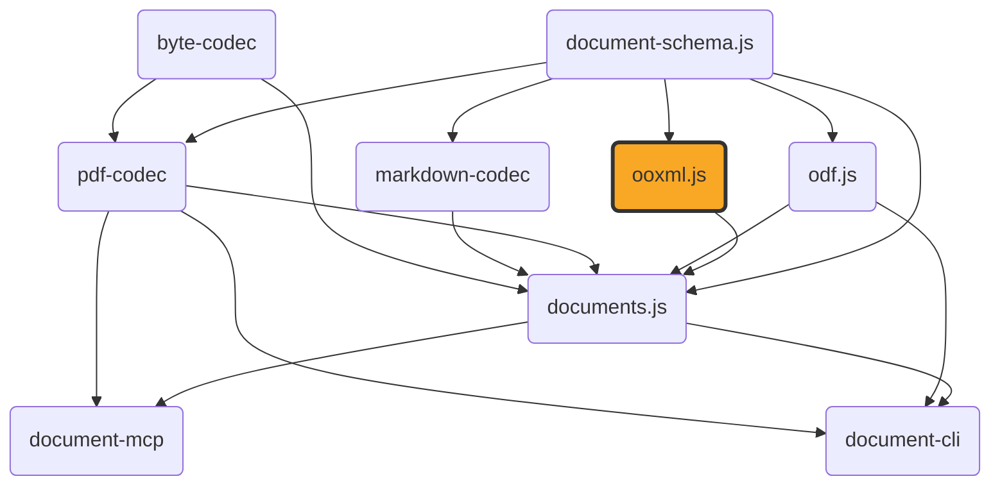

# ooxml.js

[](https://github.com/ExaDev/documents.js/tree/main/packages/ooxml.js) [](https://www.npmjs.com/package/ooxml.js) [](https://www.npmjs.com/package/ooxml.js) [](https://github.com/ExaDev/documents.js/actions)

> Type-safe, lossless round-trip conversion between OOXML packages (`.docx`, `.pptx`, `.xlsx`) and a faithful JSON model, built on [Zod 4](https://zod.dev) codecs.

An OOXML file is a ZIP of parts (an OPC "package"): `[Content_Types].xml`, relationships, XML content, and binary parts. `ooxml.js` decodes the whole package to faithful JSON and encodes it back part-for-part.



## Why

Semantic typed models are lossy and one-directional: they cannot round-trip. True round-trip needs every part, relationship, and binary byte-for-byte at the content level. `ooxml.js` provides that lossless foundation, with typed per-format readers and writers on top — each available both as `document-schema.js`'s tree-form `DocumentPackage` and as the flat, content-level shape that tree decomposes.

## Getting started

Requires Node.js `>=20` and pnpm `11.6.0` (pinned via `packageManager` in `package.json`).

```sh
pnpm install
```

Install as a dependency in another project:

```sh
pnpm add ooxml.js
# or
npm install ooxml.js
```

## Compatibility

Worker-isomorphic: runtime `src/` uses no Node-only APIs (no `node:*` imports, no bare Node builtins, no `Buffer` global), so the published package runs in Cloudflare Workers, Deno Deploy, browser bundlers, or any ES2024+ host — not just Node. This is enforced statically by an `eslint` guard (`no-restricted-imports`/`no-restricted-globals` in `eslint.config.ts`) that rejects any Node-only import in `src/`, and dynamically by the `workerd` test suite (`pnpm test:workers`) that exercises the xlsx decode path, and the `DocumentPackage` assembly and write path on top of it, inside a Cloudflare Workers isolate on every CI run. The `engines.node >= 20` pin is the development and CI floor, not a runtime constraint on consumers.

## Usage

```ts
import { decodePackage, encodePackage } from 'ooxml.js';

// .docx / .pptx / .xlsx bytes -> faithful JSON Package
const pkg = decodePackage(new Uint8Array(await file.arrayBuffer()));

// ...inspect or modify pkg.parts...

// Package -> bytes (content-identical to the original)
const bytes = encodePackage(pkg);
```

The core is a Zod 4 codec, so both directions are schema-validated:

```ts
import { z } from 'zod';
import { packageCodec } from 'ooxml.js';

const pkg = z.decode(packageCodec, bytes);
const out = z.encode(packageCodec, pkg);
```

### Typed readers and writers

Above the lossless core sit typed readers that resolve a format's own cascades — the docx style cascade, pptx's placeholder → layout → master → theme inheritance, xlsx's style-index → number-format classification — so order, styling, and geometry come through, not just flattened text. Each format has two entry points onto the same read: one producing `document-schema.js`'s tree-form `DocumentPackage`, one producing the flat, content-level shape that tree decomposes.

| Format | `DocumentPackage` (primary) | Flat, content-level |
| --- | --- | --- |
| docx | `readDocx` / `buildDocxPackage` | `readDocxContent` / `buildDocxPackageFromContent` |
| pptx | `readPptx` (read-only) | `readPptxContent` (read-only) |
| xlsx | `readXlsx` / `buildXlsxPackage` | `readXlsxContent` / `buildXlsxPackageFromContent` |

`readXlsxWorkbook` sits outside the table: a separate lossy, cell-values-only reading view (sheet names, references, resolved values, formulas, merged ranges, defined names) with no write side.

#### The `DocumentPackage` API

`readDocx`/`readPptx`/`readXlsx` decompose what they read into the tree `document-schema.js` defines — one group per top-level container, headings and lists nested inside the section they belong to, block-scoped constructs promoted to the region they span, repeated formatting factored into a package-level styles table. `buildDocxPackage`/`buildXlsxPackage` take one back the other way:

```ts
import { buildDocxPackage, decodePackage, encodePackage, readDocx } from 'ooxml.js';

const document = readDocx(decodePackage(bytes)); // DocumentPackage, kind: 'wordprocessing'
// document.children is one section group per section, the section's page geometry on the group's own
// node. Inside it, a heading paragraph opens a group holding the blocks beneath it, a list paragraph
// opens its own, and a table stays a leaf — decomposition groups a container's block flow, it never
// descends into a table's cells.
const out = encodePackage(buildDocxPackage(document)); // a complete docx, built from scratch
```

Readers mint the styles table (`assemblePackage`, i.e. `decompose` plus the frequency pass) because a reader is where a package first comes into existence. Writers materialise every ref back into direct properties (`flattenPackage`) before handing the content to the format writer, so a minted package, a hand-built one with no table at all, and a re-minted one all write out identically. Both transforms — and `decompose`/`factorStyles` for a caller composing its own boundary — are re-exported from this package, so consuming what these readers return takes no second dependency.

Minting has a real consequence for a caller walking the tree by hand, and it is the single biggest behavioural difference between these primary names and the `Content` ones below: a run or paragraph that shares its formatting with others in the same subtree no longer carries that formatting itself. Three bold, red paragraphs in one section come back as three plain `{"text": "..."}` runs plus one `style: "s1"` ref on the enclosing group, with `styles: {"s1": {"run": {"bold": true, "color": {...}}}}` on the package root — not as three runs each carrying `bold`/`color` directly. Reading a run's real effective formatting off a tree therefore means resolving its ancestor groups' `style` refs first: `resolveStyleChain` collects the chain from the root down to a node, `overlayStyleEntries` merges it outermost-first (the nearest entry wins), and `applyParagraphStyleProperties`/`applyRunStyleProperties` gap-fill a resolved entry onto whatever direct properties the node already carries. All four are re-exported from this package's barrel alongside `StylesTable`/`StyleEntry`/`StyleParagraphProperties`/`StyleRunProperties`, so resolving a run's formatting back out of a tree takes no second dependency either. A `Content`-suffixed reader never needs any of this: it returns a fully materialised `ContentDocument` with no refs and no table to consult.

#### The flat, content-level API

The `Content`-suffixed functions are what the tree-form ones wrap, exported in their own right for a caller driving a pipeline stage by stage (`documents.js`'s conversion engine does exactly this) or needing what the tree has no spelling for. Routing through the tree costs no fidelity of its own: `buildDocxPackage(readDocx(pkg))` builds the identical `Package` `buildDocxPackageFromContent(readDocxContent(pkg))` does, and flattening a tree reproduces exactly the content its content-level reader returns — both pinned in `src/typed/document-package.test.ts`.

```ts
import { buildXlsxPackageFromContent, decodePackage, readXlsxContent } from 'ooxml.js';

const content = readXlsxContent(decodePackage(bytes)); // ContentDocument, kind: 'spreadsheet'
const pkg = buildXlsxPackageFromContent(content); // a fresh Package built from scratch, not a write-back into `pkg`
```

`readDocxContent` is the only reader in this package that returns a docx's comments, footnotes, endnotes, header/footer parts and text, section break kinds, and `word/numbering.xml` definitions: those sit on `DocxDocument` outside its `sections` (a section's `breakType` excepted — that rides `ContentSection` itself), which is exactly the part of it `ContentDocument` — and therefore the tree — has no place for. They do not survive `buildDocxPackageFromContent` either (it writes none of those parts), so this is about which reader returns them, not about which pair round-trips them. `endnotes`, `headerFooterParts`, and `sectionHeaderFooters` are required fields on the published `DocxDocument` shape — a reader always populates them (an empty array when the docx spells none), and code constructing a `DocxDocument` by hand rather than reading one must spell them too.

#### Fidelity constructs

Both docx readers read the block-scoped fidelity constructs — structured document tags, fields, bookmarks, and tracked changes. In the flat form they are `document-schema.js` construct-boundary markers bracketing the blocks each one spans, one matched `constructStart`/`constructEnd` pair per construct, nesting as brackets do; in the tree they are promoted to a group over exactly that region, carrying the same descriptor. Both docx writers write them back.

A bookmark whose extent is a sub-sequence of one paragraph's runs — the bookmark over three words inside a sentence — is read onto that paragraph's own `constructs` field (`document-schema.js`'s run-level construct extents: a descriptor plus a half-open run range, so the paragraph is never split to host a wrapper), and the docx writer puts its `w:bookmarkStart`/`w:bookmarkEnd` halves back between the runs the range names. Two such bookmarks whose extents cross both survive — run ranges are data, not brackets. The same field carries the other run-level rows: a complex field or `w:fldSimple` inside a sentence (a `field` extent over its result runs, which the writer re-emits as its `w:fldChar` characters), an internal `w:hyperlink/@w:anchor` link (a `link` extent with an internal target, re-wrapped in one `w:hyperlink` on write), a `w:commentRangeStart`/`End` pair or standalone reference (an `anchor` extent named by the comment's own `w:id`, which joins back to the body in `DocxDocument.comments`), a footnote/endnote reference mark (a point `anchor` joining to `DocxDocument.footnotes`/`endnotes`), and a legacy `w:ffData` form field (a `contentControl` — checkbox, dropDown, or plainText — with the whole `w:ffData` element quarantined verbatim in the descriptor's residue). Comment extents, note references, and `w:ffData` controls are read-only rows: the writer emits no comments/footnotes/endnotes parts to point at and rebuilds no form-field payload, so their content writes plain and only the descriptor is lost. An inline SDT, a partial tracked change, and a bookmark whose halves sit in two different paragraphs still have no encoding here: the text comes through, the construct does not. See the gotchas below.

A construct with format-specific specifics the harmonised vocabulary does not name carries them in the descriptor's quarantined `source` residue (`document-schema.js`'s residue channel): an SDT whose `w:docPartObj` gallery is not the Table of Contents degrades to a `richText` control with the whole `w:docPartObj` element carried verbatim, and the docx writer re-emits that element from the residue in place of the default `w:richText` type element — the restorable tier in action, the gallery name no longer lost to the round trip.

### Migrating from 3.x

The `DocumentPackage` readers and writers took the primary names, and the functions that held them were renamed rather than removed. Every one of them still behaves exactly as it did:

| Was | Is now |
| --- | --- |
| `readDocx` | `readDocxContent` |
| `readPptx` | `readPptxContent` |
| `readXlsx` | `readXlsxWorkbook` |
| `buildDocxPackage` | `buildDocxPackageFromContent` |
| `buildXlsxPackage` | `buildXlsxPackageFromContent` |

`readXlsxContent` is unchanged, and is the one name that already followed this convention.

Three of the renames are silent under a plain call — `readDocx`, `readPptx`, and `readXlsx` still take a `Package`, they just return a `DocumentPackage` now — so a TypeScript caller sees the break where it uses the result (`doc.sections` becomes `document.children`), and a JavaScript caller sees it at runtime. Either add the `Content` suffix to keep the previous behaviour, or move to the tree.

### Deep imports

Every module under `src/` is importable directly, by the same path it has relative to `src/`, without going through the barrel:

```ts
import { bytesToBase64, base64ToBytes } from 'ooxml.js/util/base64';
import { readXlsxContent } from 'ooxml.js/typed/xlsx/content';
import { readDocx, buildDocxPackage } from 'ooxml.js/typed/document-package';
```

## The ooxml.js format

**The ooxml.js format** is a compact, still-plain-JSON alternative to the verbose `Package` (which repeats `type`/`tag`/`attributes`/`children` keys per node, with tag/namespace strings recurring thousands of times) — tuple-encoded nodes plus one interned string table, composing on `packageCodec`:

```
OOXML bytes --[packageCodec]--> Package --[compactCodec]--> CompactPackage (the ooxml.js format)
```

```ts
import { decodePackage, toCompact, fromCompact } from 'ooxml.js';

const pkg = decodePackage(bytes);
const compact = toCompact(pkg); // { s: string[], p: Record<path, CompactPart> }
const roundTripped = fromCompact(compact); // deep-equals pkg
```

A `word/document.xml` part holding a single run of text:

```xml
<w:p><w:r><w:t>Hi</w:t></w:r></w:p>
```

decodes to this `Package` (one entry in `parts`, each element an `XmlNode`):

```json
{
  "parts": {
    "word/document.xml": {
      "kind": "xml",
      "nodes": [
        {
          "type": "element",
          "tag": "w:p",
          "attributes": [],
          "children": [
            {
              "type": "element",
              "tag": "w:r",
              "attributes": [],
              "children": [
                {
                  "type": "element",
                  "tag": "w:t",
                  "attributes": [],
                  "children": [{ "type": "text", "value": "Hi" }]
                }
              ]
            }
          ]
        }
      ]
    }
  }
}
```

`toCompact` interns every tag and text value once (first-occurrence order) and replaces each node with a tuple (type code `0`=element/`1`=text, then string-table indices):

```json
{
  "s": ["w:p", "w:r", "w:t", "Hi"],
  "p": {
    "word/document.xml": [[0, 0, [], [[0, 1, [], [[0, 2, [], [[1, 3]]]]]]]]
  }
}
```

Reading the outer tuple: `[0, 0, [], [...]]` is an element whose tag is `s[0]` (`"w:p"`), wrapping a child recursing down to the text leaf `[1, 3]` (`s[3]` = `"Hi"`). It is a JSON shape, not a compression layer: every string stays human-readable, so it stays diffable and debuggable. `fromCompact(toCompact(pkg))` round-trips exactly; `toCompact` is deterministic.

All three format pairs have a direct codec — `packageCodec` (bytes ⇄ `Package`), `compactCodec` (`Package` ⇄ `CompactPackage`), and `compactPackageCodec` (bytes ⇄ `CompactPackage` directly):

```ts
import { decodeCompactPackage, encodeCompactPackage } from 'ooxml.js';

const compact = decodeCompactPackage(bytes); // OOXML bytes -> CompactPackage directly
const out = encodeCompactPackage(compact); // CompactPackage -> OOXML bytes directly
```

## Build, test, and lint

```sh
pnpm build          # turbo run _build (tsdown -> dist/: one ESM + CJS + .d.ts set per source module, via tsdown.config.ts)
pnpm lint           # turbo run _lint (eslint . --fix --cache --max-warnings 0)
pnpm typecheck      # turbo run _typecheck _typecheck:node (tsc against tsconfig.json + tsconfig.node.json, the dual-tsconfig setup)
pnpm test           # turbo run _test (vitest run --project unit)
pnpm test:watch     # vitest --project unit
pnpm test:workers   # turbo run _test:workers (vitest run --config vitest.workers.config.ts)
pnpm test:smoke     # turbo run _test:smoke (builds dist/, then runs test/smoke.test.mjs to verify the built ESM and CJS artifacts both load and behave identically)
```

`pnpm prepublishOnly` runs `lint`, `typecheck`, `tsdown`, `publint`, and `attw --pack`. `test/smoke.test.mjs` loads the built ESM/CJS barrels and checks they behave identically — a check `tsc`/`publint`/`attw` cannot do.

`tsdown.config.ts`'s `entry` is a `src/**/*.ts` glob (excluding tests/`.d.ts`), so `dist/` mirrors `src/` one ESM/CJS/.d.ts/.d.cts set per module; `package.json`'s `exports` adds a `"./*"` wildcard for deep imports.

To run a single test file: `pnpm vitest run src/typed/docx.test.ts`.

## Architecture

The package layers a lossless core outward to lossy convenience views:

- **`src/model/`** — schemas: `node.ts` (`XmlNode`: `text`/`cdata`/`comment`/`declaration`/`pi`/`element`, an ordered forest matching XML mixed content) and `package.ts` (`Package`: path → `Part`; `xml` parts hold parsed nodes, `binary` parts hold base64 bytes — keeping `Package` plain JSON).
- **`src/xml/`** — `parse.ts`/`build.ts` convert XML strings ⇄ `XmlNode[]` via `fast-xml-parser` (`preserveOrder`, entity re-encoding disabled, so order, mixed content, and entity encoding survive).
- **`src/zip.ts`** — thin `fflate` wrapper (`zipSync`/`unzipSync`).
- **`src/package-io/`** — `read.ts`/`write.ts` unzip, classify each entry as XML or binary (`looksLikeXml` byte sniff), and parse/serialize.
- **`src/codec.ts`** — public round-trip surface: `packageCodec`/`xmlCodec` (`z.codec()` pairs) plus `decodePackage`/`encodePackage` wrappers.
- **`src/compact.ts`** — the ooxml.js format: `compactCodec`/`compactPackageCodec` plus `toCompact`/`fromCompact`/`decodeCompactPackage`/`encodeCompactPackage` wrappers.
- **`src/typed/`** — lossy projections. `readDocxContent` resolves the full style cascade (`docDefaults` → `basedOn` → paragraph-mark → character styles → direct formatting) into ordered `sections` plus comments/footnotes/headers/footers/numbering; `readPptxContent` resolves placeholder → layout → master → theme inheritance into `slides` (presentation order via `p:sldIdLst`); `readXlsxWorkbook` covers cell values/formulas, merged ranges, defined names. `typed/shared/` holds shared OOXML primitives (`drawingml.ts` geometry/theme/colour, `color.ts` `ColorTransform` cascade, `units.ts`, `metadata.ts`, `source-path.ts`). Types come from `document-schema.js`. Only the docx and xlsx `ContentDocument`-shaped pairs encode back to a `Package`; everything else is one-way, and faithful round-tripping goes through `decodePackage`/`encodePackage`.
- **`src/typed/document-package.ts`** — the `DocumentPackage`-native surface, and nothing else: `readDocx`/`readPptx`/`readXlsx` are their content-level reader composed with `document-schema.js`'s `assemblePackage`, `buildDocxPackage`/`buildXlsxPackage` are `flattenPackage` composed with their content-level writer. One module rather than one per format, because the adapters are format-uniform and the reasoning behind them (why a reader mints styles rather than calling bare `decompose`, why a writer's kind guard lives at this boundary, what a docx's non-content parts do instead of riding the tree) is one argument stated once.
- **`src/typed/docx/`** — `read.ts` and `write.ts` are a read/write pair over `ContentSection[]`. `constructs.ts` owns the fidelity construct vocabulary both halves share: the descriptor shapes (`contentControl` from `w:sdt`, `field` from `w:fldChar`/`w:fldSimple`, `anchor` from `w:bookmarkStart`/`End`, `provenance` from `w:ins`/`w:del`/`w:moveFrom`/`w:moveTo`) and the rule deciding which occurrences are block-scoped enough to bracket. `buildDocxPackageFromContent` builds a complete docx `Package` from scratch; it writes no `styles.xml`, `numbering.xml`, comments, footnotes, or headers/footers, so the `DocxDocument` fields outside `sections` do not survive the pair.
- **`src/typed/xlsx/`** — a `ContentDocument`-shaped read/write pair alongside the lossy `readXlsxWorkbook` (both exported; different callers). `readXlsxContent` reads column widths, row heights, hidden rows/columns, merged ranges, every cell value kind, print settings, and cell comments (`comments.ts`: legacy `xl/comments{N}.xml` notes plus `[MS-XLSX]` threaded comments, both resolved through the worksheet part's own relationships, never by part name); `buildXlsxPackageFromContent` builds a complete xlsx `Package` from scratch (never editing the decoded package). `number-format.ts`/`styles.ts`/`serial.ts` run both ways: reading classifies style index → format code → kind (`percentage`/`currency`/`date`/`time`/`dateTime`); writing emits interned `numFmt` codes, fed back through the classifier in tests. The classifier is not a formatter (`displayText` is the typed-value spelling). Scope limits: `currency` with no ISO code writes as plain `number`; non-canonical temporal values degrade to text; cell comments read but do not write (`buildXlsxPackageFromContent` emits no comment part, so they do not survive this pair); column widths re-approximate through xlsx's own character-width unit on every write, so a width drifts slightly on each round trip rather than reaching a fixed point.

## Conventions

- **Zod-first schema/type/guard.** Every model type is inferred from its Zod schema (`z.infer<typeof XSchema>`), not hand-written.
- **`XmlNode` uses a recursive structural guard, not `z.lazy`.** `z.lazy` collapses to `unknown` for element-children in the pinned Zod version, so `XmlElementSchema` validates `children` via `z.custom<XmlNode>(isXmlNode)`. Any change to `XmlNode`'s shape must update `isXmlNode` in step. `CompactXmlNode` and `document-schema.js`'s `ContentBlock` reuse this pattern.
- **Lossless core vs. lossy views is a hard boundary.** `decodePackage`/`encodePackage` stay byte/part faithful. A `src/typed/*` reader is a lossy projection; faithful round-tripping goes through the generic `Package`. `readXlsxContent`/`buildXlsxPackageFromContent` and `readDocxContent`/`buildDocxPackageFromContent` are the deliberate exceptions — read/write pairs around the shared content model, where each writer builds a fresh package rather than touching the decoded one. The `DocumentPackage`-native pairs above them are those same pairs with a structural transform on each end, so they inherit exactly the same boundary.
- **XML entities stay raw in the lossless layer.** `parseXml` runs with `processEntities: false`; typed readers decode the five standard entities (`decodeEntities` in `typed/util.ts`) only in their own lossy projection.
- **No type assertions.** `eslint.config.ts` bans `as` and angle-bracket casts (`assertionStyle: "never"`, `noInlineConfig: true` — no `eslint-disable` escape hatch). Narrow with a guard or parse with Zod.

## Gotchas and quirks

- **A `Content` suffix means the flat form, not a lesser one.** `readDocx` and `readDocxContent` are the same read; the suffix says which shape comes back (`DocumentPackage` versus the flat `DocxDocument`/`ContentDocument`), never which is more faithful. The pair that genuinely differs in what it reads is `readXlsxWorkbook`, whose name says so by naming its own return type rather than taking a suffix.
- **A construct marker brackets whole blocks, never a sub-sequence of runs.** A construct covering a sub-sequence of one paragraph's runs lands on that paragraph's `constructs` field as a run range (see the fidelity-constructs section above) — bookmarks, fields, internal links, comment extents, note references, and `w:ffData` form fields alike. An inline SDT or a few inserted words inside an otherwise untouched paragraph are still read exactly as before — the text survives, the construct does not — as is a bookmark whose two halves sit in different paragraphs. So does a block extent that crosses another, or that straddles a section break or table-cell boundary: neither is expressible as balanced brackets (nor as a tree group, which is what the marker pair promotes to), and both are dropped — a drop `document-schema.js`'s extent-scope note ratifies — rather than emitted at a position that would decode to a different nesting.
- **The docx pair round-trips `sections`, not a whole `DocxDocument`.** Numbering definitions, cell border styling/shading, section break kinds (`w:sectPr/w:type` onto `ContentSection.breakType`, both directions), and `w:themeColor` (without `themeShade`/`themeTint`) are read; images read into `ContentImageBlock` (floating `wp:anchor` position not recorded); `PAGE`/`NUMPAGES` fields resolve to Word's cached text. Headers and footers are read both as the flat per-part text arrays the reader always produced and structurally — each referenced part as block flow (`headerFooterParts`) plus per-section default/first/even references (`sectionHeaderFooters`); collapsing the flat arrays into that model wants a breaking change to a published shape and is tracked rather than taken. An inline `w:object`/`o:OLEObject` whose payload part is itself a ZIP archive — a modern producer's embedded xlsx/docx/pptx, detected by magic bytes through `archive-codec` — or a classic OLE compound-file `.bin` whose root storage carries the embedded file as an OLE-packaged `Package` stream, read through `archive-codec`'s bounded CFB reader, is decoded into a nested content document and emitted as a `ContentEmbeddedObjectBlock` beside its containing paragraph's own block, sized from `w:dxaOrig`/`w:dyaOrig`; the object's VML preview picture (`v:imagedata`) and a `w:object` inside a footnote (notes ride as text, with no block flow to lift an object into — a header/footer's own objects DO recover, those parts being walked as block flow) are not read, a compound file holding native legacy streams (BIFF and friends — no `Package` stream, or a packaged file that is not a ZIP) stays opaque, and a payload that does not decode as one of the three OOXML flavours (a plain archive, corrupt zip or compound-file data, a bodyless docx) degrades to no embedded block rather than failing the host read. The writer emits such a block back out as the inverse `w:object`/`o:OLEObject`: the nested document is re-serialised through its own format's builder into a fresh `word/embeddings/oleObject<N>.<docx|xlsx|pptx>` ZIP part carrying its relationship and content-type override, and `w:dxaOrig`/`w:dyaOrig` are derived from the block's frame (twips). An embedded presentation document serialises through an injected port — `BuildDocxContentOptions.serialiseEmbeddedPresentation`, a presentation `ContentDocument` → pptx-bytes function this package accepts because it has no PresentationML writer of its own, and the ecosystem's one pptx writer lives one layer up in documents.js (which exports `embeddedPresentationSerialiser`, wired from its own pptx builder, for exactly this call); with no serialiser injected, a `ContentDocument` carrying one is refused with a thrown error rather than a silent drop, and no VML preview picture is regenerated (the reader never read one into the model, and real previews are WMF/EMF this ecosystem has no writer for; Word shows a blank until activated). The writer emits no `styles.xml`, `numbering.xml`, comments, footnotes, endnotes, or headers/footers, so the `DocxDocument` fields outside `sections` do not come back — a paragraph's `styleId` is still written as a `w:pStyle` reference, resolving to nothing, since every property the style would have contributed is already spelled as direct formatting by then.
- **pptx is read-only.** Connector shapes (`p:cxnSp`) are skipped; shape rotation composes through groups; a dynamic field (`a:fld`, e.g. slidenum/datetime) reads as an ordinary run plus a `field` run construct carrying `@type` as the instruction and the cached `a:t` as the result; an internal slide-jump link (`a:hlinkClick` resolving to a slide relationship, no `TargetMode`) records a `link` run construct with an internal target naming the destination slide's package part path (e.g. `ppt/slides/slide2.xml` — PresentationML addresses slides by part relationship, never by name; the flat run's `hyperlink` field stays reserved for external URIs, and an action-only `ppaction://hlinkshowjump` names no target part and records nothing); a chart graphic frame reads its chart part's cached series/category model into a table block (header row = series names, one row per category index); a SmartArt graphic frame reads its diagram data model's node text as paragraphs in diagram order (depth-first over `parOf` connections, siblings by `srcOrd`); an OLE graphic frame reads the fallback picture its `mc:Fallback` carries (or, with none reachable, a paragraph naming the `p:oleObj`'s `progId`), and when the payload part is itself a ZIP archive — a modern producer's embedded xlsx/docx/pptx, detected by magic bytes through `archive-codec` — or a classic OLE compound-file `.bin` whose root storage carries the embedded file as an OLE-packaged `Package` stream, read through `archive-codec`'s bounded CFB reader, also decodes it into a nested content document and emits it as an `embeddedObject` block beside the picture, sized to the frame's own geometry; a compound file holding native legacy streams (no `Package` stream, or a packaged file that is not a ZIP) stays opaque external-application data, and a payload that does not decode as one of the three OOXML flavours degrades to no embedded block rather than failing the slide read.
- **xlsx has no native percentage/currency/date/time cell type.** Both directions are closed via the number-format engine: reading classifies style → format code → kind; writing emits interned `numFmt` codes, fed back through the classifier in tests. `displayText` is the typed-value spelling, not the producer's rendered string. A chart graphic frame reads as an embedded `chart` object (`embeddedObjects`, one row per series over the shared category axis, values verbatim `c:v` text, frame resolved through the sheet's own column widths and row heights), and a drawing picture (`xdr:pic`) as a `ContentSheetImage` (`images`, media bytes sniffed through the drawing part's relationships, frame resolved the same way) — one-way rows, since the writer emits no drawing part. A workbook's general defined names and table/List objects ride the tree reader's root `definitions` table (`readXlsx`), the landing the schema's own verdict gives a named range; the flat reader and the write pair carry neither. `dataValidation` and `conditionalFormatting` rules quarantine verbatim on their range's anchor cell through the residue channel, pending the corpus-gated vocabulary the construct inventory defers.
- **`test:smoke` depends on a fresh build.** It runs `tsdown && vitest run --project smoke`, always rebuilding `dist/` first. A bare `vitest` runs both projects; `smoke` fails loudly (`Cannot find module '../dist/index.js'`) if `dist/` is unbuilt.
- **Binary-vs-XML part classification is a byte sniff, not an extension check.** `looksLikeXml` looks for a leading `<` after skipping a UTF-8 BOM and whitespace; any future binary format starting with `<` would misclassify.
- **`Array.isArray` narrows `unknown` to `any[]`, not `unknown[]`.** Indexing the result reintroduces `any` and trips `no-unsafe-assignment`. `compact.ts` and `xml/parse.ts` each define a local `isUnknownArray` guard (`value is unknown[]`) — use it wherever the narrowed element is read.
- **TypeScript is pinned to the latest 6.x, not 7.** TS 7 breaks `typescript-eslint` (peer range `<6.1.0`) and `cosmiconfig`'s TS loader (via `typescript.findConfigFile`, which TS 7 no longer exports). Wait for ecosystem support.
- **`release-notes-generator`'s `preset` is `angular`, not `conventionalcommits` (unlike `commit-analyzer`).** `conventional-changelog-conventionalcommits@10.x` exports its body under `template`, but the bundled `conventional-changelog-writer` reads only `options.mainTemplate`, so the body falls back to a generic default — producing an empty changelog. Don't switch without checking upstream.

## Fidelity

Conversion is **part-content-faithful**: every XML part re-serialises to equivalent XML, every binary part to identical bytes, no parts dropped or added. The re-zipped file opens correctly in Word, Excel, and PowerPoint. It is **not** byte-for-byte identical at the ZIP-container level — re-zipping changes archive entry layout (order, compression, metadata), not achievable deterministically across tools.

## Release and publishing

Release, CI, and commit-message conventions are all workspace-wide, not package-local — see the [monorepo root README](../../README.md#releases) for the mechanism (topological per-package `semantic-release` via `@exadev/semantic-release-workspace`, OIDC trusted npm publishing, automatic sibling dependency-range rewriting) and its [known gap](../../README.md#releases) note on GitHub Packages republishing and SBOM/provenance signing, both dropped in the migration to this monorepo and not yet restored.

## Contributing

Conventional Commits, enforced workspace-wide by commitlint through a root `commit-msg` hook. Work inside `packages/ooxml.js/`; see [CONTRIBUTING.md](../../CONTRIBUTING.md) for the shared git hooks and history conventions.

## References

- [archive-codec](../archive-codec/README.md) — ZIP detection and container primitives; this package's embedded-object recovery checks an OLE payload part's bytes through `isZipArchive` before decoding the nested package.
- [document-schema.js](../document-schema.js/README.md) — canonical `ContentBlock`/`ContentSection`/geometry/colour schemas and `ContentDocument`/`LayoutMetadata` types shared with `odf.js` and `documents.js`, plus the `DocumentPackage` tree and the `decompose`/`flattenPackage`/`assemblePackage`/`factorStyles` transform this package's primary readers and writers are built on.
- [odf.js](../odf.js/README.md) — sibling OpenDocument Format package, also on `document-schema.js`.
- [documents.js](https://github.com/ExaDev/documents.js) — adds PDF conversion and a read-and-write docx/pptx editor on top of this package.

## License

MIT
