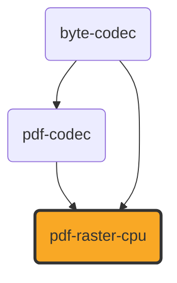

# pdf-raster-cpu

[](https://github.com/ExaDev/documents.js/tree/main/packages/pdf-raster-cpu) [](https://www.npmjs.com/package/pdf-raster-cpu) [](https://www.npmjs.com/package/pdf-raster-cpu) [](https://github.com/ExaDev/documents.js/actions)

> The pure-software reference backend for [pdf-codec](../pdf-codec/README.md)'s `PageRasteriser` port ([#1198](https://github.com/ExaDev/documents.js/issues/1198)): renders a PDF page, or one located region of one, to PNG bytes with a scanline rasteriser that has no canvas dependency at all and runs identically under Node, a browser Worker, and workerd.

`pdf-codec`'s `renderPdfPage` defines the contract — it walks a page's content through the same read machinery `readPdf` runs and drives a caller-supplied rasteriser with device-space draw operations — and deliberately does not pick an implementation. This package is the family's own answer: correct and deterministic first, fast second. It exists so a consumer that needs pixels (OCR input, a vision model, a thumbnail) can get them on any runtime with nothing but `pdf-codec` and arithmetic; a runtime with a real canvas (a browser, or Cloudflare Browser Rendering) supplies its own backend through the same port and none of this code ships.



## Getting started

Requires Node.js `>=20` and pnpm `11.6.0` (pinned via `packageManager` in `package.json`).

```sh
pnpm install
pnpm build         # tsdown (ESM + CJS + .d.ts)
pnpm typecheck     # tsc -p tsconfig.json + tsconfig.node.json
pnpm lint          # eslint . --fix --cache --max-warnings 0
pnpm test          # vitest run
pnpm test:workers  # vitest run --config vitest.workers.config.ts, inside a real Cloudflare Workers (workerd) isolate
```

Rendering a page:

```ts
import { renderPdfPage } from "pdf-codec/raster";
import { createCpuRasteriser } from "pdf-raster-cpu";

const pngBytes = renderPdfPage(
  pdfBytes,
  0, // page index
  { dpi: 200 }, // or { scale: 2 }; exactly one of the two
  createCpuRasteriser(),
);

// Just a located figure region, in the same point coordinates
// segmentPdfRegions' bounds (and LayoutFrame) use:
const figurePng = renderPdfPage(
  pdfBytes,
  0,
  {
    dpi: 200,
    clipPt: {
      xPt: region.bounds.xPt,
      yPt: region.bounds.yPt,
      widthPt: region.bounds.widthPt,
      heightPt: region.bounds.heightPt,
    },
  },
  createCpuRasteriser(),
);
```

One `CpuRasteriser` instance renders any number of pages sequentially — `renderPdfPage` drives it `beginPage` → `draw` … → `finish` per page, and each page starts from a cleared canvas. The factory also takes this backend's own options:

```ts
import { createCpuRasteriser } from "pdf-raster-cpu";

const rasteriser = createCpuRasteriser({
  onDiagnostic: (d) => console.warn(d.code, d.message),
  // "raster-cpu/jpeg-image-undecoded" -- the one refusal this backend
  // reports: a JPEG image op, which it declines rather than misrenders
});
```

## What renders and what refuses

Everything below is pinned by tests on decoded output pixels, not on intermediate structures.

- **Rectangle fills** paint with exact analytic coverage: for an axis-aligned rectangle each pixel's covered fraction is computable in closed form, so crisp table rules on integer boundaries paint whole pixels and fractional edges blend at exactly their overlap fraction — slightly more accurate than any supersample could state.
- **Vector paths** (arbitrary curves, ellipses, chart lines, and every glyph outline) fill through a sub-scanline sweep at 4×4 supersamples per pixel (a 1/16 coverage quantum), honouring both winding rules across all of a path's subpaths at once — the same pass that makes an evenodd hole a hole makes overlapping stroke pieces union rather than double-paint.
- **Strokes** render as geometry: each flattened centreline segment becomes an offset quad, each join the wedge that fills the notch on the outside of the turn — a miter (PDF's own default limit, 10.0) that falls back to a bevel past it — with butt caps, width-relative dash arrays exactly as the port recovers them, and a zero-width stroke clamped to one device pixel per the format's own "thinnest possible width" rule. The port converts dotted strokes to filled squares before they arrive, so no round-cap primitive is ever needed. One documented approximation: a join landing exactly on a dash boundary takes the boundary's butt ends rather than its wedge, a sub-stroke-width difference at dash scale.
- **Images** sample bilinearly under their own placement quad's coverage, so a rotated placement antialiases exactly like every other edge. PNG image ops (everything the port decoded) draw through byte-codec's decoder, cached per page by content. **JPEG (DCTDecode) image ops are declined by name** — `raster-cpu/jpeg-image-undecoded` through `onDiagnostic` — because byte-codec carries no DCT decoder and approximating a scan's pixels would silently misrender it. A canvas-owning backend draws these natively instead; the compressed bytes remain available through the port's op (and through `readPdf`'s image recovery) for consumers that want them.
- **Text** arrives from the port already resolved: each run's embedded TrueType outlines as filled path ops, placed at the run's own text matrices. Faces that state no sfnt outlines (CFF programs, standard-14 faces with nothing embedded, Type 3 glyph procedures) are refused by the port itself, through pdf-codec's own sink (`raster/text-cff-outlines`, `raster/text-outlines-unavailable`), never approximated here.

## Runtime boundaries

- **Worker-isomorphic**: published `src/` imports no `node:*` builtins, no `Buffer`, no DOM, no canvas, and makes no network calls — enforced by the same lint rule every foundation package in this workspace opts into and proved at runtime by a workerd test suite that renders a page inside a real Cloudflare Workers isolate and asserts the node suite's own pinned pixels. No OCR, no vision, anywhere: this package hands a caller pixels and stops.
- **Deterministic**: the supersample factor is a fixed constant, curve flattening is a tolerance-bounded recursion, and every blend rounds once — so two renders of the same page produce byte-identical PNGs on every runtime, which the workerd suite pins directly.
- **Opaque white background**: a PDF page is notionally painted on white and the port deliberately specifies no background, so this backend clears each canvas to opaque white (what a viewer displays). Output PNGs therefore carry colour channels only — there is no alpha to encode, since source-over compositing onto an opaque base stays opaque.
- **Correct before fast**: a page of text at OCR-friendly 150–300 dpi renders in seconds, not milliseconds; the coverage passes visit every pixel row a shape touches. A runtime with a hardware-accelerated canvas should wrap it as its own backend through the same port rather than tolerate this one's speed.

## Conventions

- Worker-isomorphic (see [the family-wide convention](../../README.md#conventions)); `isomorphic: true` in `packageLintConfig`, with a `test:workers` suite proving it at runtime.
- No non-null assertions, no type assertions: this package is new enough to hold none of the indexed-access debt the older packages carry a burn-down exemption for.
- Conventional commits, enforced via commitlint + husky, workspace-wide.

## Install

```sh
pnpm add pdf-raster-cpu
# or
npm install pdf-raster-cpu
```

Peer expectations: `pdf-codec` (the port this implements) and `byte-codec` (the PNG codec) are declared as ordinary pinned dependencies — install this package and they arrive with it.

## License

MIT
