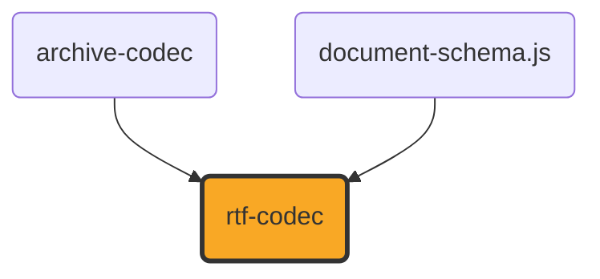

# rtf-codec

[](https://github.com/ExaDev/documents.js/tree/main/packages/rtf-codec) [](https://www.npmjs.com/package/rtf-codec) [](https://www.npmjs.com/package/rtf-codec) [](https://github.com/ExaDev/documents.js/actions)

> A hand-written, dependency-minimal Rich Text Format codec: reads RTF into the shared [document-schema.js](../document-schema.js/README.md) content pivot, and writes deterministic, 7-bit-ASCII RTF back out. Built against Microsoft's own [RTF Specification, version 1.9.1](#the-specification) and [Zod 4](https://zod.dev), with no third-party RTF library.

**Status: under active development.** The read and write paths described below are implemented and tested, but this package is new and has not yet been exercised against a real-world corpus. [Scope](#scope) states exactly what is handled and what is not; nothing in this README describes work that is planned rather than done.

Every construct that remains unhandled is either a gap in `document-schema.js` rather than in this codec (superscript/subscript and text direction have no field to land in), or something RTF itself does not specify (it has no content-control equivalent at all) — see [Deliberately not handled](#deliberately-not-handled), which says which of the two each row is.

RTF is the cleanest structural fit of any format this family did not already handle. It is a wordprocessing format through and through — paragraphs, runs, character properties, paragraph properties, tables, lists and pictures all have direct `ContentDocument` equivalents — and it can express more of the wordprocessing variant than markdown can, carrying colour, font family, font size and alignment natively. No `document-schema.js` model change was needed for it.

What it is _not_ is another XML format. RTF is tokenised plain text with a brace-nested group and destination model, so none of the XML plumbing `ooxml.js` and `odf.js` share applies here: this package carries its own byte lexer, its own destination state machine, its own `\uN`/`\ucN` Unicode handling with code-page fallback, and its own parsers for the five header mini-formats. The closest relative in this workspace is `markdown-codec`, which is likewise a hand-written scanner and parser for a non-XML text format rather than a wrapper around a document library.



`rtf-codec` depends on `document-schema.js` for the content pivot and `archive-codec` for the [MS-CFB] container an embedded object's `\objdata` carries — see [Embedded objects](#embedded-objects) and [Dependency choices](#dependency-choices). It is reachable from [`documents.js`](../documents.js/README.md)'s conversion engine, and so from `document-cli`, `document-mcp`, and the web UI, as an ordinary source and target format.

## Getting started

```sh
pnpm add rtf-codec
```

```ts
import { readRtf, writeRtf, readRtfContent, writeRtfContent } from "rtf-codec";

// The tree-form pair, over document-schema.js's DocumentTree -- what to reach for by default.
const { documentPackage, diagnostics } = readRtf(await file.bytes());
const bytes = writeRtf(documentPackage);

// The flat pair, over its ContentDocument -- the shape the reader itself builds.
const { document } = readRtfContent(await file.bytes());
const flatBytes = writeRtfContent(document);
```

Every entry point takes **bytes**, not a string. RTF is defined over bytes: `\'hh` names a raw byte decoded through whichever code page the document declared, and `\binN` is followed by literally N arbitrary bytes. A caller who has already decoded a `.rtf` file as UTF-8 has destroyed exactly the information the code-page layer needs. For the one string form that genuinely still holds bytes — a file read with a latin-1/binary reader — `rtfBytesFromLatin1` converts it exactly, and throws above U+00FF rather than truncating.

Both encodings are also available as [`z.codec()`](https://zod.dev) pairs, matching the convention `markdown-codec` and `pdf-codec` already follow:

```ts
import { rtfCodec, rtfContentCodec, RtfBytesSchema } from "rtf-codec";

const documentPackage = rtfCodec.parse(bytes); // bytes -> DocumentTree
const roundTripped = rtfCodec.encode(documentPackage); // DocumentTree -> bytes
```

`RtfBytesSchema` is a real magic-byte check — the `<File>` production requires an RTF document to begin `{\rtf`, so a caller handing the codec a docx or a PDF is refused at the schema boundary rather than deep inside the tokenizer.

## The specification

Everything here is implemented against Microsoft's own **Rich Text Format (RTF) Specification, Version 1.9.1** (March 2008, 278 pages) — the final revision, covering Word 2007. Each source module cites the section it implements by name.

- Primary source: [`[MSFT-RTF].pdf`](https://officeprotocoldoc.z19.web.core.windows.net/files/Archive_References/%5BMSFT-RTF%5D.pdf), hosted in Microsoft's own Office protocol documentation archive.
- Microsoft's original download page: <https://www.microsoft.com/en-us/download/details.aspx?id=10725> ([Wayback snapshot](https://web.archive.org/web/2024/https://www.microsoft.com/en-us/download/details.aspx?id=10725)).
- The version history and the note that 1.9.1 is the final revision: [Rich Text Format on Wikipedia](https://en.wikipedia.org/wiki/Rich_Text_Format) ([Wayback snapshot](https://web.archive.org/web/2025/https://en.wikipedia.org/wiki/Rich_Text_Format)).
- Format-preservation context: [Library of Congress, Sustainability of Digital Formats — RTF](https://www.loc.gov/preservation/digital/formats/fdd/fdd000473.shtml) ([Wayback snapshot](https://web.archive.org/web/2024/https://www.loc.gov/preservation/digital/formats/fdd/fdd000473.shtml)).

The code-page tables in `src/codepage.ts` were **generated, not transcribed**: each is `bytes([b]).decode(codec)` over `0x80..0xFF` from Python's own codec library, verified byte-for-byte against it, because a hand-typed 128-entry table is exactly where one transposed character hides until a real document decodes wrong.

## Architecture

Five stages, each its own module, each testable on its own:

| Stage  | Module            | What it does                                                                                                                                                                                                                                    |
| ------ | ----------------- | ----------------------------------------------------------------------------------------------------------------------------------------------------------------------------------------------------------------------------------------------- |
| Lex    | `src/tokenize.ts` | Bytes to a flat token stream: control words (32-letter name cap, 10-digit signed parameter, one-space delimiter), control symbols (no delimiter at all), the `\'hh` hex byte as its own token kind, `\binN`'s raw byte run, and CR/LF handling. |
| Group  | `src/group.ts`    | Brace matching and destination identification — the two structural facts every stage above the lexer needs.                                                                                                                                     |
| Header | `src/header.ts`   | The five header mini-formats: `\fonttbl`, `\colortbl`, `\stylesheet`, `\listtable` and `\listoverridetable`, plus `\info` and the document properties, in one pass ahead of the body.                                                           |
| Read   | `src/read.ts`     | The destination/group state machine that turns the token stream into a `ContentDocument`.                                                                                                                                                       |
| Write  | `src/write.ts`    | The inverse: mints the header tables from what the document actually uses, then emits a body that references them by index.                                                                                                                     |

Supporting modules: `src/codepage.ts` (byte-to-character tables and the `\ansicpgN`/`\fcharsetN`/`\cpgN` precedence), `src/base64.ts` (hex and base64 conversion for picture and object payloads), `src/units.ts` (twips, half-points, pixels), `src/list-id.ts` (the opaque `numId` grammar), `src/constructs.ts` (the fidelity-construct descriptor shapes and the DTTM bit field), `src/cell-format.ts` (the `<celldef>` border, shading, and merge production), `src/embedded-object.ts` (the `\object`/`\objdata` payload -- JSON in, real `[MS-CFB]` compound file out, via `archive-codec`; see [Embedded objects](#embedded-objects)), `src/diagnostics.ts` (the three-tier diagnostic policy).

### The reader is the specification's own model, literally

"Conventions of an RTF Reader" states the model this reader implements exactly: an opening brace stores the current state on a stack, a closing brace retrieves it, a backslash collects a control word or symbol and dispatches on it, and anything else is text written "to the current destination using the current formatting properties". Four kinds of state ride that stack, as the spec enumerates them — destination, character properties, paragraph properties, table properties — plus the `\ucN` skip count, which the spec separately requires be stacked.

The destination is not merely a label: it decides what happens to text. Body text becomes runs; a `\pict` destination's text is hex picture payload; a `\fldinst` destination's text is a field instruction to be parsed rather than shown; a `\listtext` destination's text is the flat rendering of a list number that "should be ignored by any reader that understands Word 97 through Word 2007 numbering"; an unrecognised `{\*` destination's text is discarded whole. That mapping is what lets the reader be a single pass with no lookahead beyond a group's own head.

### Tables are paragraph properties, not a group

"There is no RTF table group; instead, tables are specified as paragraph properties." A row is a run of `\intbl` paragraphs terminated by `\cell` marks and closed by `\row`, with the row's own `\trowd ... \cellxN` definition sitting before it, after it, or — for Word 2002 onward — both. The table builder is therefore driven by the `\cell`/`\row` marks in the text stream rather than by nesting, and a table closes when a non-table paragraph arrives.

### Unicode

`\uN` carries the character and is followed by an ANSI approximation a Unicode-aware reader must skip: "the reader should ignore the next N' characters, where N' corresponds to the last `\ucN'` value encountered", where "any RTF control word or symbol is considered a single character" and a brace ends the skippable run early. All three of those rules are implemented, including partial consumption of a text run — which is why the main loop carries a byte offset alongside its token index. `{\upr {ansi} {\*\ud unicode}}` pairs take the `\ud` half and discard the ANSI one.

On the way out, **every non-ASCII character leaves as `\uN`** with a one-character `?` fallback under a single `\uc1`. The writer deliberately does not hunt for a code page that could carry a character as a `\'hh` byte: the output is then pure 7-bit ASCII whatever the input contained, which is what makes it safe to transmit and trivially diffable, and costs a conforming reader nothing.

## Scope

### Read: RTF → `ContentDocument`

| Construct                                                | Handled                                                                                                                                                                                           |
| -------------------------------------------------------- | ------------------------------------------------------------------------------------------------------------------------------------------------------------------------------------------------- |
| Groups, destinations, `{\*` ignorable destinations       | Yes — per the spec's own reader conventions                                                                                                                                                       |
| Control words, control symbols, `\'hh`, `\binN`          | Yes                                                                                                                                                                                               |
| `\uN` / `\ucN` with ANSI fallback skipping, `\upr`/`\ud` | Yes                                                                                                                                                                                               |
| Code pages                                               | `\ansi`/`\mac`/`\pc`/`\pca`, `\ansicpgN`, per-font `\cpgN`/`\fcharsetN`; the Windows, OEM and Macintosh single-byte pages, plus UTF-8                                                             |
| `\fonttbl`                                               | Face name, family keyword, per-font code page                                                                                                                                                     |
| `\colortbl`                                              | RGB, including a theme colour's own literal RGB; index 0 is the auto colour                                                                                                                       |
| `\stylesheet`                                            | Paragraph style names and heading levels (`\outlinelevelN` or a built-in `heading N` name)                                                                                                        |
| `\listtable` / `\listoverridetable`                      | `\lsN` → `\listidN` → the level's `\levelnfcN` and `\levelstartatN`, with each `\lfolevel`'s own start-at or whole-level override applied                                                         |
| `\*\revtbl`                                              | The revision authors `\revauthN` and its siblings index into                                                                                                                                      |
| Sections                                                 | `\sect`, `\sectd`, the `\pgwsxnN`/`\marg*sxnN` geometry family, and the `\sbk*` break vocabulary                                                                                                  |
| Paragraphs                                               | `\par`, `\pard`, alignment, indents, spacing, `\slN`/`\slmultN`, `\pagebb`                                                                                                                        |
| Runs                                                     | `\b`, `\i`, `\ul` (every variant), `\strike`, `\fN`, `\fsN`, `\cfN`, `\v` (dropped as hidden)                                                                                                     |
| Tables                                                   | `\trowd`, `\cellxN`, `\trleftN`, `\cell`, `\row`, multi-paragraph cells                                                                                                                           |
| Table cells                                              | `\clbrdrt`/`l`/`b`/`r` with the whole `<brdr>` production, `\clcbpatN` shading, and both merge families (`\clvmgf`/`\clvmrg`, `\clmgf`/`\clmrg`)                                                  |
| Bookmarks                                                | `\*\bkmkstart`/`\*\bkmkend` as `anchor` constructs, with `\bkmkcolfN`/`\bkmkcollN` quarantined as residue                                                                                         |
| Revision marks                                           | The whole `<chrev>` production as `provenance` constructs: `\revised`, `\deleted`, `\mvf`/`\mvt`, `\crauthN`, with authors and `\revdttmN` dates                                                  |
| Lists                                                    | `\lsN`, `\ilvlN`, with the marker type carried through the `numId` grammar                                                                                                                        |
| Pictures                                                 | `\pngblip` and `\jpegblip`, hex or `\binN` payload, `\picwgoalN`/`\pichgoalN` or `\picwN`/`\pichN`, `\picscalexN`/`\picscaleyN`                                                                   |
| Hyperlinks                                               | The `HYPERLINK` field production, including its `\l` anchor switch                                                                                                                                |
| Special characters                                       | `\tab`, `\line`, `\emdash`, `\endash`, `\bullet`, the quotation marks, `\~`, `\-`, `\_`, `\\`, `\{`, `\}`, and the zero-width and directional marks                                               |
| Page breaks                                              | `\page`                                                                                                                                                                                           |
| `\info`                                                  | Title, author, subject, keywords                                                                                                                                                                  |
| Embedded objects                                         | `\object\objemb` -> `ContentEmbeddedObjectBlock` when `\objdata` is this package's own payload (see [Embedded objects](#embedded-objects)); a real, foreign OLE object degrades with a diagnostic |

### Write: `ContentDocument` → RTF

Everything in the read table above has a write path, with the header tables minted from what the document actually uses: a font table entry per distinct family, a colour table per distinct colour (runs' and cells' alike), a `heading N` style per distinct heading level, a `\listtable`/`\listoverridetable` pair per distinct list, and a `\*\revtbl` per distinct revision author. Output is deterministic (the same document produces byte-identical bytes) and pure 7-bit ASCII. An `embeddedObject` block writes unconditionally too now (see [Embedded objects](#embedded-objects)) -- there is no ContentDocument shape this writer refuses to embed, since the payload is this package's own JSON rather than a format-specific serialisation.

Two places where the two models genuinely differ in shape, rather than merely in spelling:

- **Page geometry is stated twice.** The document-level `\paperwN` family is written once in the header from the first section's own geometry, and the section-level `\pgwsxnN` family per section — so a reader that understands neither multiple sections nor the section family still lays the document out on the right paper.
- **A horizontally merged cell is one cell here and several there.** `ContentTableCell` states a `colSpan` on one cell, while RTF states the same merge as several cells, the first carrying `\clmgf` and each continuation `\clmrg`. The writer expands one into the other, and the reader collapses it back. A _vertical_ merge is the opposite: RTF and the content model both keep a cell in each covered row, so `\clvmrg` reads as a cell with no blocks — the convention `ooxml.js` already follows for `w:vMerge`.

### Deliberately not handled

Each of these is reported through a diagnostic rather than dropped silently — see [Diagnostics](#diagnostics).

| Construct                                                                                                                  | Why                                                                                                                                                                                                                                                                                                                                                                                                                                                        |
| -------------------------------------------------------------------------------------------------------------------------- | ---------------------------------------------------------------------------------------------------------------------------------------------------------------------------------------------------------------------------------------------------------------------------------------------------------------------------------------------------------------------------------------------------------------------------------------------------------- |
| Headers, footers, footnotes, endnotes, annotations                                                                         | `ContentDocument`'s flat form has no page-furniture or note position for them. A footnote's real home is `document-schema.js`'s tree-only `definitions` table, which a codec producing the flat form cannot reach.                                                                                                                                                                                                                                         |
| Content controls                                                                                                           | **RTF 1.9.1 specifies none.** It predates OOXML's `w:sdt`: its "Custom XML Tags" (`\xmlopen`/`\xmlclose`) are a bare namespace/name tag with no type, lock, alias or value, and `\*\datastore` is an opaque blob whose "format ... is unknown to RTF" by the spec's own words.                                                                                                                                                                             |
| Form fields (`\*\formfield`, with a `FORMTEXT`/`FORMCHECKBOX`/`FORMDROPDOWN` instruction)                                  | RTF's own nearest analogue to a content control, and a real `contentControl` mapping -- `ooxml.js` maps docx's legacy `w:ffData` twin onto exactly that kind. Not mapped yet: it needs the field machinery to hand the control its instruction and cached result.                                                                                                                                                                                          |
| East Asian DBCS code pages (932, 936, 949, 950, 1361)                                                                      | Each needs a ~20k-entry table and its own lead-byte state machine. A document declaring one decodes through cp1252 and says so.                                                                                                                                                                                                                                                                                                                            |
| Code page 42 (`SYMBOL_CHARSET`)                                                                                            | Not an encoding: its bytes are glyph indices into whichever symbol font the run names, so there is no correct Unicode for them without that font's own cmap.                                                                                                                                                                                                                                                                                               |
| Metafile and bitmap pictures (`\wmetafileN`, `\emfblip`, `\dibitmapN`, `\wbitmapN`, `\macpict`)                            | `ContentImageBlock` carries PNG and JPEG only.                                                                                                                                                                                                                                                                                                                                                                                                             |
| A picture with no stated size                                                                                              | `ContentImageBlock` requires a positive width and height, and deriving them from the payload would need an image decoder this package deliberately does not carry.                                                                                                                                                                                                                                                                                         |
| Nested tables (`\nestcell`/`\nestrow`)                                                                                     | Read as ordinary cell content; the inner table's own structure is not reconstructed.                                                                                                                                                                                                                                                                                                                                                                       |
| Drawing objects (`\do`, `\shp`)                                                                                            | **A schema gap, not a container one.** These are Word's own native in-document vector-drawing layer, not an OLE embed -- there is no raw drawing-shape `ContentBlock` for a wordprocessing section's block flow to land in (only `ContentEmbeddedObjectBlock`, which names a whole embedded document, not a shape), so a `\do`/`\shp` construct is dropped regardless of the container work [Embedded objects](#embedded-objects) below did for `\object`. |
| A real, foreign `\object`'s OLE data                                                                                       | This package's own `\objdata` payload round-trips fully (see [Embedded objects](#embedded-objects)); a real Word-authored OLESaveToStream structure (an actual embedded `.xls`/`.doc`/OLE-control payload) has no decoder here and degrades with a diagnostic instead.                                                                                                                                                                                     |
| Superscript/subscript (`\super`, `\sub`, `\upN`, `\dnN`), character scaling, kerning, background colour                    | **A schema gap, not an RTF one.** `ContentRun` carries no vertical-alignment field at all -- `epub-codec` reports the identical gap for its own `<sub>`/`<sup>`, and `ooxml.js`'s docx reader has no `w:vertAlign` handling either. Closing it is a change to `document-schema.js` and every codec that would then carry it, not to this one.                                                                                                              |
| Right-to-left text (`\rtlch`, `\ltrch`, `\rtlpar`, `\rtlrow`, `\rtldoc`)                                                   | The same shape of gap: no `ContentDocument` field carries text direction, at any of the four scopes RTF states it at.                                                                                                                                                                                                                                                                                                                                      |
| Cell vertical alignment (`\clvertalt`/`\clvertalc`/`\clvertalb`), diagonal cell borders (`\cldglu`/`\cldgll`), `\clshdngN` | `ContentTableCell` carries per-side borders and one background colour and nothing else -- a diagonal rule is not a side, and a shading percentage is a pattern rather than a colour.                                                                                                                                                                                                                                                                       |
| A bookmark whose two halves straddle a table cell wall                                                                     | `document-schema.js` ratifies this as a drop rather than a shape to repair: each block list is its own bracket scope, and pairing across two of them would need the marker ids its contract deliberately refuses.                                                                                                                                                                                                                                          |

## Embedded objects

RTF 1.9.1's own "Objects" section states an `\object`'s grammar precisely: `'{' \object (<objtype> & ...) <objdata> <result> '}'`, where `\objdata` is `'{\*' \objdata (<objalias>? & <objsect>?) <data> '}'` and `<data>` is the identical `(\binN #BDATA) | #SDATA` production `\pict`'s own payload uses. The spec is direct about what that data actually is: "When the object is an OLE embedded or linked object, the data part of the object is the structure produced by the OLESaveToStream function" — a real OLE compound file. This package used to drop `\object` in both directions because it had no way to build or read that container; [`archive-codec`](../archive-codec/README.md) now ships exactly that (`writeCompoundFile`/`readCompoundFile`, [MS-CFB]), plus the `Package` stream wrapper (`writeOlePackage`/`readOlePackage`) real Word/PowerPoint embeds use inside it — the same pair `doc-codec`/`xls-codec`/`ppt-codec` already depend on `archive-codec` for.

**What rides inside the container is this codec's own JSON, not a foreign format's bytes.** `rtf-codec` cannot depend on `ooxml.js`/`odf.js` — format codecs are peers in this family, never one another's dependency — so a `wordprocessing`/`presentation`/`spreadsheet`/`drawing`/`formula` `ContentEmbeddedObjectBlock`'s own nested `ContentDocument` cannot be re-serialised into a real docx/pptx/xlsx/odf/MathML byte stream the way a genuine OLE server would. What this codec can write and read back losslessly is its own `ContentDocument` (a plain, Zod-validated, JSON-serialisable value), so `src/embedded-object.ts` packages that JSON as the `Package` stream's own "file" — the identical slot a real embed's actual docx/xlsx bytes would occupy — wraps it in a real `[MS-CFB]` compound file, and hex-encodes that as `\objdata`. `objectKind`, `frame`, and the anchor fields all ride the same envelope, so nothing about the embed's position or kind depends on `\object`'s own `\objw`/`\objh`/`\objclass` control words — those are still written, purely as the size hint and class label a reader that cannot decode `\objdata` at all would fall back to, matching the spec's own advice that a producer supply them "to maintain backward compatibility."

**Reading is honest about what it can and cannot decode.** A real Word-authored `\object` — an actual embedded `.xls` range, a Windows Media Player control, an Equation Editor formula — carries real OLESaveToStream/COM data with no JSON envelope inside it, and decoding that would need this package to understand every OLE server's own on-disk format, which is out of scope for the same reason a metafile picture is: no image/OLE decoder lives here. `readEmbeddedObjectData` tries the one path it can (compound file -> `Package` stream -> JSON -> `ContentEmbeddedObjectSchema`) and returns `undefined` for anything else, degrading with `RtfDiagnosticCodes.EMBEDDED_OBJECT_UNREADABLE` rather than throwing — one unreadable `\object` must not fail the whole document. `\object`'s own `\result` fallback (the rendered preview a non-`\object`-aware reader would show instead) is read but discarded: this reader always tries `\objdata` first, exactly as Word itself prefers the real object over its own cached result.

```ts
import { readRtfContent, writeRtfContent } from "rtf-codec";

const written = writeRtfContent({
  kind: "wordprocessing",
  metadata: {},
  sections: [
    {
      pageSize: { widthPt: 612, heightPt: 792 },
      margins: { topPt: 72, rightPt: 72, bottomPt: 72, leftPt: 72 },
      blocks: [
        {
          kind: "embeddedObject",
          objectKind: "spreadsheet",
          frame: { xPt: 0, yPt: 0, widthPt: 200, heightPt: 100 },
          document: { kind: "spreadsheet", metadata: {}, sheets: [] },
        },
      ],
    },
  ],
});

// The \objdata this writer produced is a real [MS-CFB] compound file -- readRtfContent
// decodes it back into the identical objectKind/frame/document.
const { document } = readRtfContent(written);
```

## Diagnostics

The same three-tier policy `markdown-codec` and `pdf-codec` use: **throw** for input that cannot be processed at all, **recover with a diagnostic** for input that is malformed in a way the spec's own robustness advice says to survive, and **degrade with a diagnostic** for a construct read correctly at the token level whose meaning the `ContentDocument` mapping does not carry.

That third tier does more work here than in the XML formats. The spec _requires_ an unknown control word to be ignored and an unknown `{\*` destination to be skipped whole, so "I did not understand this" is the format's normal operating mode rather than an error condition — but a reader that silently drops a construct a caller cared about is indistinguishable from one that never saw it. Every drop this package makes deliberately therefore names itself through a code in `RtfDiagnosticCodes`.

```ts
import { readRtf, RtfDiagnosticCodes } from "rtf-codec";

const { documentPackage, diagnostics } = readRtf(bytes);
const droppedPictures = diagnostics.filter(
  (diagnostic) =>
    diagnostic.code === RtfDiagnosticCodes.UNSUPPORTED_PICTURE_FORMAT,
);
```

A coverage suite proves every code in `RtfDiagnosticCodes` is reachable by producing each one from a real input, and fails if any has no fixture — so the table cannot grow an entry nothing can emit, and a construct that stops being dropped has its code removed rather than left behind as a promise the package no longer keeps.

The throw tier is `RtfNotAnRtfDocumentError` (no `{\rtf` header), `RtfInputTooLargeError` and `RtfNestingLimitExceededError` (the two resource guards, both configurable through `ReadRtfOptions`), and `RtfUnsupportedDocumentKindError` on the write side, since RTF is a wordprocessing format and a presentation, spreadsheet, drawing or formula document has no RTF spelling.

## Dependency choices

`document-schema.js` for the content pivot, `archive-codec` for the `[MS-CFB]` container [Embedded objects](#embedded-objects) needs, and `zod`. Every third-party RTF library is banned **by name** in this package's own `eslint.config.ts` — `rtf-parser`, `rtf.js`, `rtf-stream-parser`, `node-rtf`, `jsrtf`, `@shelf/rtf-to-html` — the same bet `markdown-codec` makes against micromark/remark/marked and `pdf-codec` makes against pdf-lib/pdfjs-dist. Depending on one would defeat the reason this package exists. `archive-codec` is not such a library: it is zero document-format knowledge, the same sibling `doc-codec`/`xls-codec`/`ppt-codec` already depend on for their own `[MS-CFB]` container, not an RTF-aware dependency this package's own bet is against.

`iconv-lite` is banned for a second reason on top of that: it is Node-only (it is built on `Buffer`), so depending on it would break this package's Worker isomorphism. The code-page tables in `src/codepage.ts` exist instead.

It deliberately does **not** depend on `byte-codec`, even though that package has the base64 and byte-writing primitives `src/base64.ts` reimplements. RTF's picture payload is hex-encoded ASCII inside a text format, not a binary container, so what is actually needed here is about sixty lines of hex and base64 conversion — considerably less than the coupling a dependency on a sibling's release cadence would cost. `epub-codec` made the same call for the same reason.

## Worker isomorphism

Like every foundation and format-codec package in this family, `rtf-codec` is Worker-isomorphic: its published `src/` imports no `node:*` module and uses no `Buffer`, so one artifact behaves identically in a Node host, a browser, and a Cloudflare Worker. The ban is enforced by `isomorphic: true` in this package's `eslint.config.ts`, and `pnpm test:workers` proves it at runtime by running the public surface inside workerd.

Two places would have been tempting to write with a Node-only shortcut, and the workers suite exercises both: `src/base64.ts`'s hand-written encoders (`Buffer.from(bytes).toString("base64")` is the one-liner they exist instead of) and `src/codepage.ts`'s own tables.

## Fidelity constructs and the residue channel

Both of the channels `document-schema.js` defines are live here.

**Channel 1, the harmonised construct vocabulary.** Bookmarks read and write as `anchor` descriptors, and the whole `<chrev>` revision-mark family as `provenance` descriptors. Which of the two flat encodings a construct takes is decided by what it actually spans, exactly as the schema requires: a bookmark opening and closing inside one paragraph is a `RunConstructExtent` on that paragraph, one spanning whole paragraphs is a `constructStart`/`constructEnd` marker pair, and a revision mark — being a character property — is always the former. Content controls are absent because RTF has none; see the gap table above.

**Channel 2, the residue channel.** `SourceFormatSchema` gained its `rtf` member, so this codec can now quarantine what no semantic field carries. `\bkmkcolfN`/`\bkmkcollN` — a bookmark's table-column range — ride the anchor descriptor's own `source`, and the writer restores them verbatim inside its `{\*\bkmkstart …}` when the residue names `rtf` as its format, leaving another format's residue untouched. That decidability is the whole point of the `format` field.

## Build, test, and lint

```sh
pnpm install
pnpm build         # tsdown -> ESM + CJS + .d.ts in dist/
pnpm typecheck     # tsc for the web program and the node program, plus attw --pack
pnpm lint          # eslint . --fix --cache --max-warnings 0
pnpm test          # vitest run --project unit
pnpm test:workers  # the same code inside workerd, the real Cloudflare Workers runtime
pnpm test:smoke    # rebuilds dist/ and exercises the built ESM and CJS artifacts
```

To run a single test file: `pnpm vitest run src/read.test.ts`.

## Release and publishing

Release, CI, and commit-message conventions are workspace-wide, not package-local — see the [monorepo root README](../../README.md#releases) for the mechanism.

## Contributing

Conventional Commits, enforced workspace-wide by commitlint through a root `commit-msg` hook. Work inside `packages/rtf-codec/`; see [CONTRIBUTING.md](../../CONTRIBUTING.md) for the shared git hooks and history conventions.

## License

MIT
